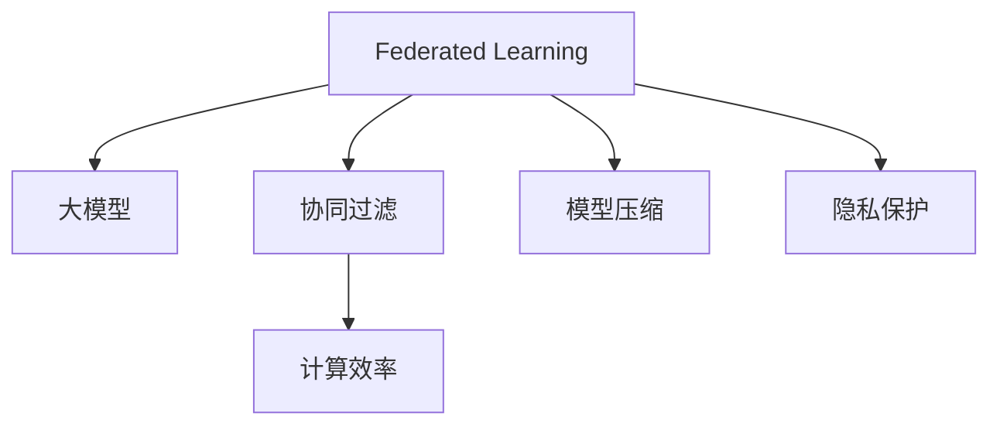

                 

# 推荐系统中的大模型联邦学习应用

> 关键词：推荐系统, 联邦学习, 大模型, 隐私保护, 协同过滤, 模型压缩, 计算效率

## 1. 背景介绍

在互联网时代，推荐系统已经成为了人们获取信息、发现商品的重要方式。无论是电商平台的商品推荐、视频网站的节目推荐，还是新闻平台的资讯推荐，其背后都有一套复杂的推荐算法支撑。然而，随着用户规模的不断增长和推荐系统复杂度的提升，传统的集中式推荐系统面临着诸多挑战：

- **数据隐私与安全**：集中式推荐系统需要将用户数据集中存储和处理，存在数据隐私泄露的风险。
- **计算资源消耗**：随着用户数量和数据规模的增长，集中式推荐系统需要消耗大量计算资源，难以实现实时响应。
- **模型可扩展性**：集中式推荐系统的模型需要统一训练和部署，难以灵活适配各种不同的应用场景。

针对上述挑战，联邦学习（Federated Learning）应运而生。联邦学习是一种分布式机器学习框架，通过在本地设备上对模型进行训练，并定期同步模型参数，实现全局模型的协同优化。这种方式不仅保障了数据隐私和安全，还能够有效利用本地设备的多样性和计算资源，大幅提升推荐系统的性能和可扩展性。

## 2. 核心概念与联系

### 2.1 核心概念概述

为了更好地理解联邦学习在大模型推荐系统中的应用，本节将介绍几个密切相关的核心概念：

- **联邦学习（Federated Learning）**：一种分布式机器学习范式，各参与方本地训练模型，并通过联邦聚合方法定期更新全局模型，从而在保护数据隐私的同时，实现全局模型的优化。
- **大模型（Large Model）**：以Transformer为代表的大规模预训练模型，通过在大规模无标签文本语料上进行预训练，学习到通用的语言表示，具备强大的语言理解和生成能力。
- **协同过滤（Collaborative Filtering）**：一种推荐算法，通过挖掘用户行为和物品属性之间的关系，进行相似性匹配，推荐出用户可能感兴趣的新物品。
- **模型压缩（Model Compression）**：通过对模型参数、计算图等进行剪枝、量化、稀疏化等操作，减小模型大小，提升计算效率。
- **计算效率（Computation Efficiency）**：指模型在执行推理和训练时的资源占用情况，包括内存占用、计算时间等指标。
- **隐私保护（Privacy Protection）**：在联邦学习中，各参与方不需要共享原始数据，仅在模型参数上进行交互，从而保障数据隐私。

这些核心概念之间的逻辑关系可以通过以下Mermaid流程图来展示：



这个流程图展示了大模型联邦学习的核心概念及其之间的关系：

1. 联邦学习在大模型推荐系统中的应用，使得模型可以在多本地设备上并行训练，提升计算效率。
2. 大模型的存在，提供了丰富的语言知识，能够更好地支持协同过滤等推荐算法。
3. 模型压缩技术可以减小大模型的计算资源消耗，提升推理速度。
4. 隐私保护措施保障了数据的安全性，是大模型联邦学习的关键技术之一。

这些概念共同构成了联邦学习在大模型推荐系统中的应用框架，使其能够在大规模分布式环境下，高效、安全地训练和应用推荐模型。通过理解这些核心概念，我们可以更好地把握联邦学习在大模型推荐系统中的工作原理和优化方向。

## 3. 核心算法原理 & 具体操作步骤

### 3.1 算法原理概述

基于联邦学习的大模型推荐系统，本质上是一种分布式协同优化的机器学习过程。其核心思想是：将全局推荐模型分成多个局部模型，每个本地设备负责训练自己的模型，并将更新后的参数定期同步到中央服务器，用于全局模型的更新。这种分布式训练方式能够充分利用本地设备的计算资源，同时保护用户隐私。

形式化地，假设全局推荐模型为 $M_{\theta}$，其中 $\theta$ 为模型参数。参与方数为 $N$，每个参与方的本地模型为 $M_{\theta_i}$，其参数更新公式为：

$$
\theta_i \leftarrow \theta_i - \eta_i \nabla_{\theta_i}L_i(M_{\theta_i})
$$

其中 $\eta_i$ 为本地设备的本地学习率，$L_i(M_{\theta_i})$ 为本地损失函数，$\nabla_{\theta_i}L_i(M_{\theta_i})$ 为局部模型 $M_{\theta_i}$ 的梯度。

在全局聚合阶段，中央服务器通过加权平均或联邦平均等策略，将 $N$ 个本地模型的参数 $\theta_i$ 进行聚合，更新全局模型参数 $\theta$：

$$
\theta \leftarrow \frac{1}{N}\sum_{i=1}^N \theta_i
$$

通过迭代上述过程，全局模型能够不断优化，适应不同本地设备的数据分布和用户行为，从而实现更加精准和多样化的推荐。

### 3.2 算法步骤详解

基于联邦学习的大模型推荐系统一般包括以下几个关键步骤：

**Step 1: 构建联邦网络**
- 确定参与方设备的网络架构，包括数据分布、通信带宽、计算资源等。
- 选择合适的通信协议和算法聚合策略，如FedAvg、SPIDER等。

**Step 2: 数据预处理**
- 对各参与方的原始数据进行清洗、标准化、特征工程等预处理操作。
- 将处理后的数据划分为训练集、验证集和测试集，供模型训练和评估。

**Step 3: 初始化全局模型**
- 在中央服务器上初始化全局模型 $M_{\theta}$，设置合适的超参数。
- 将模型参数 $\theta$ 分发给各参与方。

**Step 4: 本地模型训练**
- 各参与方在本地设备上，使用本地数据对 $M_{\theta_i}$ 进行训练，计算梯度 $\nabla_{\theta_i}L_i(M_{\theta_i})$。
- 更新本地模型参数 $\theta_i$。

**Step 5: 参数同步与聚合**
- 各参与方定期将更新后的参数 $\theta_i$ 发送给中央服务器。
- 中央服务器通过聚合算法更新全局模型参数 $\theta$。

**Step 6: 全局模型评估**
- 在测试集上评估全局模型 $M_{\theta}$ 的性能，输出推荐结果。
- 收集用户反馈，调整模型超参数和本地模型结构，进一步优化推荐效果。

以上是联邦学习在大模型推荐系统的一般流程。在实际应用中，还需要针对具体任务的特点，对联邦学习过程的各个环节进行优化设计，如改进数据采样策略、采用异步更新机制、设计更高效的模型结构等，以进一步提升推荐系统的性能。

### 3.3 算法优缺点

基于联邦学习的大模型推荐系统具有以下优点：
1. 数据隐私保护。联邦学习在本地设备上训练模型，无需共享原始数据，保护了用户隐私。
2. 高效计算。联邦学习利用本地设备的计算资源，加速模型训练和推理过程。
3. 模型可扩展性。联邦学习适应性强的分布式训练方式，可以灵活适配各种应用场景。
4. 模型泛化性强。联邦学习能够融合不同本地设备上的数据，提升模型的泛化能力和推荐效果。

同时，该方法也存在一定的局限性：
1. 通信成本较高。联邦学习需要频繁进行参数同步，通信开销较大。
2. 全局模型参数分布不均。不同本地设备的模型参数更新速度和准确性可能存在差异，导致全局模型收敛速度较慢。
3. 算法复杂度较高。联邦学习需要设计复杂的算法来处理本地设备上的数据分布不均问题。

尽管存在这些局限性，但就目前而言，联邦学习在大规模分布式推荐系统中，仍是大模型推荐应用的重要范式。未来相关研究的重点在于如何进一步降低通信成本，提高全局模型收敛速度，同时兼顾模型的可解释性和数据隐私性等因素。

### 3.4 算法应用领域

基于大模型联邦学习的推荐系统，已经在电商推荐、视频推荐、音乐推荐等多个领域得到了应用，取得了显著的推荐效果：

- **电商推荐系统**：通过对用户行为数据和商品属性数据进行联邦学习，推荐系统能够实时更新模型，推荐更符合用户偏好的商品，提高用户满意度。
- **视频推荐系统**：通过对用户观看记录和视频属性进行联邦学习，推荐系统能够动态调整推荐策略，推荐更符合用户兴趣的视频内容。
- **音乐推荐系统**：通过对用户听歌记录和歌曲属性进行联邦学习，推荐系统能够学习用户音乐口味，推荐更符合用户喜好的音乐作品。

除了上述这些经典应用外，大模型联邦学习还被创新性地应用于游戏推荐、广告推荐、金融推荐等场景中，为不同领域带来了新的推荐解决方案。随着联邦学习和大模型技术的不断进步，相信在更多领域，联邦学习推荐系统将展现更大的应用潜力。

## 4. 数学模型和公式 & 详细讲解  
### 4.1 数学模型构建

本节将使用数学语言对基于联邦学习的大模型推荐过程进行更加严格的刻画。

记全局推荐模型为 $M_{\theta}$，其中 $\theta$ 为模型参数。参与方数为 $N$，每个参与方的本地模型为 $M_{\theta_i}$，其参数更新公式为：

$$
\theta_i \leftarrow \theta_i - \eta_i \nabla_{\theta_i}L_i(M_{\theta_i})
$$

其中 $\eta_i$ 为本地设备的本地学习率，$L_i(M_{\theta_i})$ 为本地损失函数，$\nabla_{\theta_i}L_i(M_{\theta_i})$ 为局部模型 $M_{\theta_i}$ 的梯度。

全局聚合策略有多种，常见的有FedAvg和SPIDER等。这里以FedAvg为例，其更新公式为：

$$
\theta \leftarrow \frac{1}{N}\sum_{i=1}^N \theta_i
$$

其中 $\theta$ 为全局模型参数，$\theta_i$ 为第 $i$ 个参与方的模型参数。

### 4.2 公式推导过程

以下我们以二分类任务为例，推导联邦学习下的交叉熵损失函数及其梯度的计算公式。

假设全局模型 $M_{\theta}$ 在输入 $x$ 上的输出为 $\hat{y}=M_{\theta}(x) \in [0,1]$，表示样本属于正类的概率。真实标签 $y \in \{0,1\}$。则二分类交叉熵损失函数定义为：

$$
L_i(M_{\theta_i}) = -\frac{1}{N}\sum_{i=1}^N \sum_{j=1}^m [y_j\log \hat{y}_j+(1-y_j)\log (1-\hat{y}_j)]
$$

其中 $m$ 为本地数据集大小。将其代入参数更新公式，得：

$$
\theta_i \leftarrow \theta_i - \eta_i \frac{1}{m} \nabla_{\theta_i}\sum_{j=1}^m [y_j\log \hat{y}_j+(1-y_j)\log (1-\hat{y}_j)]
$$

在得到损失函数的梯度后，即可带入参数更新公式，完成模型的迭代优化。重复上述过程直至收敛，最终得到适应本地数据分布的全局模型参数 $\theta$。

## 5. 项目实践：代码实例和详细解释说明
### 5.1 开发环境搭建

在进行联邦学习实践前，我们需要准备好开发环境。以下是使用Python进行联邦学习开发的环境配置流程：

1. 安装Anaconda：从官网下载并安装Anaconda，用于创建独立的Python环境。

2. 创建并激活虚拟环境：
```bash
conda create -n fl-env python=3.8 
conda activate fl-env
```

3. 安装PyTorch：根据CUDA版本，从官网获取对应的安装命令。例如：
```bash
conda install pytorch torchvision torchaudio cudatoolkit=11.1 -c pytorch -c conda-forge
```

4. 安装Flare库：Flare是一个联邦学习框架，支持分布式模型训练，可以用于构建联邦学习推荐系统。

```bash
pip install flare
```

5. 安装各类工具包：
```bash
pip install numpy pandas scikit-learn matplotlib tqdm jupyter notebook ipython
```

完成上述步骤后，即可在`fl-env`环境中开始联邦学习实践。

### 5.2 源代码详细实现

下面我以二分类任务为例，给出使用Flare库对BERT模型进行联邦学习的PyTorch代码实现。

首先，定义本地数据集和全局模型：

```python
from flare import Client, Server
from transformers import BertForSequenceClassification, BertTokenizer
from torch.utils.data import DataLoader
import torch

# 初始化服务器
server = Server()

# 初始化客户端，设置本地数据集路径
client = Client('local_data', server=server)
client.local_dataset.config(name='binary_classification', train_num_epochs=5)

# 初始化全局模型
model = BertForSequenceClassification.from_pretrained('bert-base-cased', num_labels=2)
```

然后，定义本地模型的训练函数：

```python
from transformers import AdamW
from sklearn.metrics import classification_report

def train_local_model(model, dataloader, optimizer):
    model.train()
    for batch in dataloader:
        input_ids = batch['input_ids'].to(device)
        attention_mask = batch['attention_mask'].to(device)
        labels = batch['labels'].to(device)
        model.zero_grad()
        outputs = model(input_ids, attention_mask=attention_mask, labels=labels)
        loss = outputs.loss
        loss.backward()
        optimizer.step()
    return loss.item()
```

接着，定义全局模型的训练函数：

```python
from flare.aggregation import FedAvg

def train_global_model(model, optimizer, num_epochs):
    for epoch in range(num_epochs):
        loss = 0
        for i, client in enumerate(server.clients):
            # 同步本地模型参数
            client.load_global_params(model)
            loss += client.train(train_local_model, client.local_dataset)
        # 更新全局模型参数
        model.load_params(server.update_global_params(model, FedAvg))
    return loss.item() / len(server.clients)
```

最后，启动训练流程并在测试集上评估：

```python
from transformers import AdamW

# 设置本地设备学习率
learning_rate = 2e-5

# 初始化本地优化器
optimizer = AdamW(model.parameters(), lr=learning_rate)

# 设置全局模型参数，进行全局模型训练
num_epochs = 5
total_loss = train_global_model(model, optimizer, num_epochs)

print(f'联邦学习训练完成，全局平均损失：{total_loss:.4f}')

# 在测试集上评估联邦学习后的模型性能
test_dataloader = DataLoader(test_dataset, batch_size=16)
model.eval()
with torch.no_grad():
    preds, labels = [], []
    for batch in test_dataloader:
        input_ids = batch['input_ids'].to(device)
        attention_mask = batch['attention_mask'].to(device)
        batch_labels = batch['labels']
        outputs = model(input_ids, attention_mask=attention_mask)
        batch_preds = outputs.logits.argmax(dim=2).to('cpu').tolist()
        batch_labels = batch_labels.to('cpu').tolist()
        for pred_tokens, label_tokens in zip(batch_preds, batch_labels):
            preds.append(pred_tokens[:len(label_tokens)])
            labels.append(label_tokens)
    print(classification_report(labels, preds))
```

以上就是使用PyTorch和Flare库进行BERT模型联邦学习的完整代码实现。可以看到，得益于Flare框架的强大封装，我们能够以相对简洁的代码实现联邦学习推荐系统的核心逻辑。

### 5.3 代码解读与分析

让我们再详细解读一下关键代码的实现细节：

**Client类**：
- `__init__`方法：初始化本地数据集，并配置联邦学习参数。
- `train_local_model`方法：本地模型训练函数，计算损失并更新本地模型参数。

**Server类**：
- `update_global_params`方法：全局模型参数更新函数，通过FedAvg策略更新全局模型参数。

**train_global_model函数**：
- 在每个epoch内，循环遍历每个本地设备，同步本地模型参数，更新全局模型参数，计算损失。

**训练流程**：
- 定义全局模型和本地设备的学习率。
- 在每个epoch内，循环遍历每个本地设备，同步本地模型参数，更新全局模型参数，计算损失。
- 在每个epoch后，在测试集上评估联邦学习后的全局模型性能。

可以看到，Flare框架的简洁封装使得联邦学习推荐系统的实现变得简单高效。开发者可以将更多精力放在数据处理、模型改进等高层逻辑上，而不必过多关注底层的实现细节。

当然，工业级的系统实现还需考虑更多因素，如模型的保存和部署、超参数的自动搜索、更灵活的任务适配层等。但核心的联邦学习范式基本与此类似。

## 6. 实际应用场景
### 6.1 电商推荐系统

联邦学习在电商推荐系统中的应用，可以显著提高推荐系统的性能和灵活性。传统的集中式电商推荐系统需要将用户数据和商品数据集中存储，存在数据隐私和安全问题。而联邦学习通过本地设备上的分布式训练，保障了用户数据的隐私。

具体而言，每个电商平台的本地设备上都有用户浏览、点击、购买等行为数据。通过联邦学习，可以在不共享原始数据的情况下，将这些本地数据进行分布式训练，形成全局推荐模型。该模型能够实时更新，推荐更符合用户偏好的商品，提高用户满意度。

### 6.2 视频推荐系统

视频推荐系统也面临着数据隐私和计算资源消耗的挑战。通过联邦学习，可以在多个视频平台之间进行分布式协同训练，形成全局推荐模型。该模型能够根据用户的观看历史和兴趣偏好，推荐更符合用户兴趣的视频内容，提升用户观看体验。

此外，联邦学习还可以融合不同平台的用户数据，形成更加全面、精准的推荐策略。例如，将视频平台与社交媒体平台的数据进行联合训练，能够更全面地了解用户的兴趣点，推荐更多元化的视频内容。

### 6.3 音乐推荐系统

音乐推荐系统同样面临数据隐私和计算资源的挑战。通过联邦学习，可以在多个音乐平台之间进行分布式协同训练，形成全局推荐模型。该模型能够根据用户的听歌记录和兴趣偏好，推荐更符合用户喜好的音乐作品，提升用户听歌体验。

此外，联邦学习还可以融合不同平台的音乐数据，形成更加全面、精准的推荐策略。例如，将音乐平台与社交媒体平台的数据进行联合训练，能够更全面地了解用户的兴趣点，推荐更多元化的音乐内容。

### 6.4 未来应用展望

随着联邦学习和大模型技术的不断发展，基于联邦学习的推荐系统将在更多领域得到应用，为不同行业带来新的推荐解决方案：

- **金融推荐系统**：通过联邦学习，金融机构可以在多个银行和证券公司之间进行协同训练，形成全局推荐模型。该模型能够根据用户的历史交易记录和财务数据，推荐更符合用户投资偏好的金融产品，提升用户理财体验。
- **医疗推荐系统**：通过联邦学习，医疗机构可以在多个医院之间进行协同训练，形成全局推荐模型。该模型能够根据用户的健康记录和疾病数据，推荐更符合用户健康需求的治疗方案，提升医疗服务质量。
- **游戏推荐系统**：通过联邦学习，游戏公司可以在多个游戏平台之间进行协同训练，形成全局推荐模型。该模型能够根据用户的 gameplay记录和偏好，推荐更符合用户兴趣的游戏内容，提升用户游戏体验。
- **广告推荐系统**：通过联邦学习，广告公司可以在多个广告平台之间进行协同训练，形成全局推荐模型。该模型能够根据用户的浏览记录和广告行为，推荐更符合用户兴趣的广告内容，提升广告投放效果。

这些领域的应用将进一步拓展联邦学习推荐系统的发展空间，为各个行业带来新的推荐解决方案。

## 7. 工具和资源推荐
### 7.1 学习资源推荐

为了帮助开发者系统掌握联邦学习在大模型推荐系统中的应用，这里推荐一些优质的学习资源：

1. 《Federated Learning: A Systematic Survey》：一篇系统性的联邦学习综述论文，涵盖联邦学习的历史、算法、应用等多个方面。

2. 《Federated Learning in Industry》：由Google和IBM联合发布的联邦学习白皮书，介绍了联邦学习在工业界的最新进展和应用。

3. 《Federated Learning: Concepts and Applications in Networked and Wireless Environments》：一本关于联邦学习的书籍，介绍了联邦学习的原理和多种应用场景。

4. Flare官方文档：Flare框架的官方文档，提供了丰富的联邦学习样例和详细的使用指南。

5. TensorFlow Federated（TFF）：Google开发的联邦学习框架，支持分布式模型训练和算法设计，是构建联邦学习推荐系统的有力工具。

通过这些资源的学习实践，相信你一定能够快速掌握联邦学习在大模型推荐系统中的精髓，并用于解决实际的推荐问题。

### 7.2 开发工具推荐

高效的开发离不开优秀的工具支持。以下是几款用于联邦学习推荐系统开发的常用工具：

1. Flare：支持分布式模型训练的联邦学习框架，适合构建联邦学习推荐系统。

2. TensorFlow Federated（TFF）：Google开发的联邦学习框架，支持分布式模型训练和算法设计，是构建联邦学习推荐系统的有力工具。

3. PySyft：一个支持隐私保护的联邦学习框架，支持加密计算和隐私保护技术，能够保护用户数据的隐私。

4. Apache Spark：一个大数据处理平台，支持分布式数据处理和机器学习任务，适合处理大规模数据集。

5. Apache Arrow：一个跨语言、跨平台的内存计算库，支持高效的数据传输和处理，适合联邦学习中的数据共享。

合理利用这些工具，可以显著提升联邦学习推荐系统的开发效率，加快创新迭代的步伐。

### 7.3 相关论文推荐

联邦学习和大模型推荐技术的发展源于学界的持续研究。以下是几篇奠基性的相关论文，推荐阅读：

1. Mobile Federated Learning: A Survey on Opportunities and Challenges《移动联邦学习：机遇与挑战》：介绍了联邦学习在移动设备上的应用，讨论了联邦学习面临的挑战和解决策略。

2. Federated Learning Systems: A Survey《联邦学习系统：综述》：总结了联邦学习系统的研究进展，包括系统架构、算法设计和应用场景。

3. Secure federated learning in federated learning systems《联邦学习系统中的安全联邦学习》：探讨了联邦学习中的安全问题，包括模型隐私、数据隐私和通信安全等。

4. Federated Learning in Industrialization《联邦学习在工业化中的进展》：介绍了联邦学习在工业界的最新进展和应用，包括联邦学习在金融、医疗、工业等领域的实践。

这些论文代表了大模型联邦学习技术的发展脉络。通过学习这些前沿成果，可以帮助研究者把握学科前进方向，激发更多的创新灵感。

## 8. 总结：未来发展趋势与挑战

### 8.1 总结

本文对基于联邦学习的大模型推荐系统进行了全面系统的介绍。首先阐述了联邦学习在大模型推荐系统中的应用背景和意义，明确了联邦学习在大规模分布式推荐系统中的重要价值。其次，从原理到实践，详细讲解了联邦学习和大模型的核心算法，给出了联邦学习推荐系统的完整代码实现。同时，本文还广泛探讨了联邦学习推荐系统在电商、视频、音乐等多个行业领域的应用前景，展示了联邦学习范式的广泛应用。

通过本文的系统梳理，可以看到，联邦学习在大模型推荐系统中，通过分布式协同训练，能够充分利用本地设备的计算资源，保障用户数据隐私，同时提高推荐系统的性能和可扩展性。联邦学习推荐系统已经在大规模分布式推荐系统中展现出了强大的应用潜力，未来随着技术的不断演进，必将在更多领域带来新的推荐解决方案。

### 8.2 未来发展趋势

展望未来，联邦学习在大模型推荐系统中的应用将呈现以下几个发展趋势：

1. 模型规模持续增大。随着算力成本的下降和数据规模的扩张，大模型推荐系统的规模将不断增大，能够提供更加精准、多样化的推荐。

2. 算法复杂度降低。随着联邦学习算法的研究不断深入，更多的低计算复杂度算法将被设计出来，降低联邦学习推荐系统的通信和计算开销。

3. 模型可解释性增强。未来的联邦学习推荐系统将更加注重模型的可解释性，通过引入因果分析和对比学习等方法，提高模型决策过程的透明性和可理解性。

4. 协同过滤与生成模型的结合。未来的推荐系统将更加注重融合协同过滤和生成模型，通过协同过滤了解用户兴趣，通过生成模型生成新物品，实现更加灵活多样的推荐策略。

5. 多模态数据的融合。未来的推荐系统将更加注重融合多模态数据，如文本、图像、音频等，通过多模态融合提升推荐效果。

6. 联邦学习的泛化性提升。未来的联邦学习推荐系统将更加注重泛化性，通过跨领域数据共享，提高模型在不同场景下的适应能力。

以上趋势凸显了联邦学习在大模型推荐系统中的广阔前景。这些方向的探索发展，必将进一步提升联邦学习推荐系统的性能和应用范围，为推荐系统带来新的突破。

### 8.3 面临的挑战

尽管联邦学习在大模型推荐系统中取得了显著进展，但在迈向更加智能化、普适化应用的过程中，它仍面临着诸多挑战：

1. 通信成本较高。联邦学习需要频繁进行参数同步，通信开销较大，尤其是在分布式设备较多的场景下。

2. 全局模型参数分布不均。不同本地设备的模型参数更新速度和准确性可能存在差异，导致全局模型收敛速度较慢。

3. 算法复杂度较高。联邦学习需要设计复杂的算法来处理本地设备上的数据分布不均问题，增加了系统复杂性。

4. 模型可解释性不足。联邦学习推荐系统缺乏可解释性，难以解释模型的决策逻辑和推荐依据。

5. 数据隐私和安全问题。联邦学习需要保障数据隐私和安全，但数据传输和存储过程中仍存在一定的安全风险。

6. 模型一致性和稳定性。联邦学习推荐系统需要保持模型的一致性和稳定性，防止模型在不同设备上出现不一致的问题。

这些挑战需要在未来的研究中不断克服，才能进一步提升联邦学习推荐系统的性能和可靠性。

### 8.4 研究展望

面对联邦学习推荐系统所面临的种种挑战，未来的研究需要在以下几个方面寻求新的突破：

1. 优化联邦学习算法。设计更低计算复杂度的联邦学习算法，降低通信开销，提高模型收敛速度。

2. 改进联邦学习框架。优化联邦学习框架的设计，提高数据分布不均场景下的性能，增强模型的稳定性和一致性。

3. 引入更多先验知识。将符号化的先验知识，如知识图谱、逻辑规则等，与联邦学习模型进行融合，引导模型学习更加普适、鲁棒的特征表示。

4. 融合多模态数据。将文本、图像、音频等多模态数据融合到联邦学习推荐系统中，提升推荐系统的多样性和效果。

5. 引入因果分析。引入因果分析方法，提高推荐系统的可解释性和稳定性，增强用户对推荐结果的理解和信任。

6. 保护数据隐私。设计更加高效的隐私保护技术，保护用户数据隐私，增强联邦学习推荐系统的安全性。

这些研究方向的探索，必将引领联邦学习推荐系统迈向更高的台阶，为构建安全、可靠、可解释、可控的智能推荐系统铺平道路。面向未来，联邦学习推荐系统还需要与其他人工智能技术进行更深入的融合，如知识表示、因果推理、强化学习等，多路径协同发力，共同推动推荐系统的进步。

## 9. 附录：常见问题与解答

**Q1：联邦学习推荐系统是否适用于所有推荐任务？**

A: 联邦学习推荐系统在大多数推荐任务上都能取得不错的效果，特别是对于数据量较小的任务。但对于一些特定领域的任务，如医学、法律等，仅仅依靠通用语料预训练的模型可能难以很好地适应。此时需要在特定领域语料上进一步预训练，再进行联邦学习，才能获得理想效果。此外，对于一些需要时效性、个性化很强的任务，如对话推荐、个性化视频推荐等，联邦学习方法也需要针对性的改进优化。

**Q2：联邦学习过程中如何选择合适的通信策略？**

A: 通信策略是联邦学习中的重要组成部分，直接影响到联邦学习的效率和性能。常见的通信策略包括FedAvg、SPIDER、Mime等。选择合适的通信策略需要根据具体任务和数据特点进行评估。一般来说，数据分布不均的情况下，可以选择具有更好收敛性能的通信策略，如SPIDER、Mime等；数据分布较为均衡的情况下，可以选择较为简单的通信策略，如FedAvg。

**Q3：联邦学习推荐系统如何保护用户隐私？**

A: 联邦学习推荐系统通过在本地设备上训练模型，并定期同步模型参数，实现全局模型的协同优化，保障了用户数据的隐私。每个本地设备只需要共享模型参数，而不需要共享原始数据。此外，可以通过差分隐私等技术，进一步保护用户数据的隐私性。

**Q4：联邦学习推荐系统在落地部署时需要注意哪些问题？**

A: 将联邦学习推荐系统转化为实际应用，还需要考虑以下因素：

- 模型裁剪：去除不必要的层和参数，减小模型尺寸，加快推理速度。
- 量化加速：将浮点模型转为定点模型，压缩存储空间，提高计算效率。
- 服务化封装：将模型封装为标准化服务接口，便于集成调用。
- 弹性伸缩：根据请求流量动态调整资源配置，平衡服务质量和成本。
- 监控告警：实时采集系统指标，设置异常告警阈值，确保服务稳定性。

联邦学习推荐系统需要在数据隐私保护、模型压缩、计算效率等方面进行全面优化，才能真正实现高效、安全、可靠的应用。

**Q5：联邦学习推荐系统在实际应用中如何评估性能？**

A: 联邦学习推荐系统在实际应用中，可以通过多种方式评估性能，包括：

- 离线评估：在测试集上评估联邦学习后的全局模型性能，如准确率、召回率、F1-score等。
- 在线评估：通过A/B测试等方式，评估联邦学习推荐系统在实际应用中的效果，如用户满意度、点击率、转化率等。
- 实时监控：实时采集推荐系统的性能指标，如模型更新频率、推荐精度、用户反馈等，及时调整模型参数和算法策略。

通过综合使用多种评估方式，联邦学习推荐系统能够在实际应用中不断优化，提升推荐效果和用户体验。

---

作者：禅与计算机程序设计艺术 / Zen and the Art of Computer Programming

