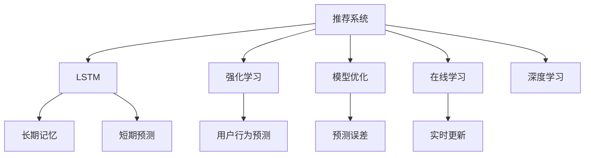

                 

# 推荐系统中的长短期记忆：AI大模型的新范式

> 关键词：推荐系统,长短期记忆(LSTM),AI大模型,深度学习,强化学习,强化学习,模型优化,在线学习

## 1. 背景介绍

### 1.1 问题由来
推荐系统是现代信息时代中最具代表性的AI应用之一，旨在帮助用户在海量信息中快速找到所需内容。传统的推荐系统主要基于协同过滤和内容过滤两种方式，前者通过分析用户和物品的交互数据进行推荐，后者则直接根据物品的特征进行匹配。然而，这些方法存在明显的数据稀疏性和维度灾难等问题，难以有效处理复杂多变的数据场景。

近年来，随着深度学习技术的兴起，基于神经网络推荐系统成为了新的研究热点。其中，深度学习模型通过端到端的训练，能够从用户行为数据中学习到高层次的特征表示，提升推荐系统的性能和效果。然而，现有的深度学习模型往往忽略了用户的长期记忆和行为规律，缺乏对时间序列数据的处理能力，难以解决长期记忆和短时预测的动态交互问题。

因此，结合长短期记忆网络(LSTM)的建模能力，提出了一种新的基于深度学习的推荐系统范式，旨在通过模型自动学习用户的长期记忆和短期行为，实现更加智能和个性化的推荐。这种新范式能够更好地处理时间序列数据，适应多样化的推荐场景，具有广阔的应用前景。

### 1.2 问题核心关键点
新范式中，长短期记忆网络是核心概念，通过递归神经网络(RNN)的循环结构，捕捉用户的长期记忆和短期行为。具体而言，该模型分为两个部分：
- 长期记忆模块：通过LSTM结构捕捉用户的长期记忆，学习用户的历史行为和兴趣点。
- 短期预测模块：通过注意力机制和全连接层进行短期预测，实时生成推荐结果。

通过将长期记忆和短期预测相结合，新范式能够更好地捕捉用户的长期行为趋势和短期行为特征，提升推荐系统的精准性和个性化。

## 2. 核心概念与联系

### 2.1 核心概念概述

为更好地理解基于长短期记忆的推荐系统，本节将介绍几个密切相关的核心概念：

- 推荐系统(Recommendation System)：旨在分析用户历史行为和偏好，预测用户可能感兴趣的物品，并向用户推荐。常用的推荐算法包括协同过滤、内容过滤、混合推荐等。

- 长短期记忆网络(LSTM)：一种递归神经网络，通过门控机制控制信息的流动，可以很好地处理时间序列数据，捕捉长期记忆和短期行为。

- 强化学习(Reinforcement Learning)：通过奖励和惩罚机制，使模型学习最优决策策略，适用于用户行为预测和动态推荐场景。

- 模型优化(Optimization)：通过梯度下降等优化算法，调整模型参数，最小化预测误差，提升模型效果。

- 在线学习(Online Learning)：在用户实时交互过程中，持续更新模型参数，适应数据分布的变化。

- 深度学习(Deep Learning)：基于多层神经网络的机器学习技术，能够自动学习数据的高层次特征表示。

这些核心概念之间的逻辑关系可以通过以下Mermaid流程图来展示：



这个流程图展示了几类核心概念及其之间的联系：

1. 推荐系统通过LSTM捕捉长期记忆和短期预测，利用强化学习进行动态优化。
2. 在线学习实时更新模型参数，保持性能的稳定性。
3. 深度学习提升特征表示能力，帮助模型更好地理解数据。

这些概念共同构成了基于长短期记忆的推荐系统框架，使其能够高效处理时间序列数据，适应多样化的推荐场景。

## 3. 核心算法原理 & 具体操作步骤
### 3.1 算法原理概述

基于长短期记忆的推荐系统主要包含长期记忆和短期预测两个部分，其核心思想是通过LSTM结构捕捉用户的长期记忆，同时利用注意力机制和全连接层进行短期预测。以下是算法的详细原理：

1. **长期记忆模块**：
   - 使用LSTM结构捕捉用户的长期记忆。LSTM通过循环神经网络(RNN)的递归结构，可以很好地处理时间序列数据。每个时间步的输出不仅取决于当前输入，还依赖于上一时间步的隐藏状态，从而学习到长期记忆。
   
   设用户的历史行为序列为 $\{x_1, x_2, \ldots, x_T\}$，其中 $x_t$ 表示第 $t$ 步的输入。则LSTM的输出为：
   $$
   h_t = LSTM(x_t, h_{t-1})
   $$
   其中 $h_t$ 表示第 $t$ 步的隐藏状态，LSTM结构为：
   $$
   \begin{aligned}
   i_t &= \sigma(W_i x_t + U_i h_{t-1} + b_i) \\
   f_t &= \sigma(W_f x_t + U_f h_{t-1} + b_f) \\
   o_t &= \sigma(W_o x_t + U_o h_{t-1} + b_o) \\
   c_t &= \tanh(W_c x_t + U_c h_{t-1} + b_c) \\
   g_t &= \odot [i_t \odot \tanh(c_{t-1}) + f_t \odot c_t] \\
   c_t &= g_t + \odot (1-o_t) \odot c_{t-1} \\
   h_t &= o_t \odot \tanh(c_t)
   \end{aligned}
   $$
   其中 $\sigma$ 为sigmoid函数，$\odot$ 表示点乘，$x_t$ 为输入，$h_{t-1}$ 为上一时间步的隐藏状态。

2. **短期预测模块**：
   - 利用注意力机制和全连接层进行短期预测。注意力机制可以根据当前时间步的输入和历史状态，动态调整各个时间步的权重，计算加权和，从而得到短期预测结果。全连接层则通过神经网络结构，将加权和映射到输出空间，得到最终的推荐结果。
   
   设当前物品的特征向量为 $y$，则短期预测的输出为：
   $$
   \hat{y} = \text{softmax}(W_a h_t + b_a) y
   $$
   其中 $W_a$ 和 $b_a$ 为全连接层的权重和偏置，$y$ 为当前物品的特征向量，$\text{softmax}$ 表示归一化指数函数。

### 3.2 算法步骤详解

基于长短期记忆的推荐系统主要包括以下几个关键步骤：

**Step 1: 准备数据集**
- 收集用户的历史行为数据，包括浏览记录、点击记录、购买记录等。将数据划分为训练集、验证集和测试集。

**Step 2: 构建LSTM模型**
- 设计LSTM模型结构，包括输入层、LSTM层和输出层。设置模型的超参数，如隐藏层大小、学习率、优化器等。

**Step 3: 训练模型**
- 将训练集数据分批次输入模型，前向传播计算损失函数。
- 反向传播计算参数梯度，根据设定的优化算法更新模型参数。
- 周期性在验证集上评估模型性能，根据性能指标决定是否触发Early Stopping。
- 重复上述步骤直至满足预设的迭代轮数或Early Stopping条件。

**Step 4: 测试和部署**
- 在测试集上评估训练好的模型，对比预测结果和真实结果的精度。
- 使用训练好的模型对新用户行为进行预测，集成到实际的应用系统中。
- 持续收集新的数据，定期重新训练和微调模型，以适应数据分布的变化。

### 3.3 算法优缺点

基于长短期记忆的推荐系统具有以下优点：
1. 处理时间序列数据能力强：LSTM结构能够很好地捕捉用户的长期记忆和短期行为，提升推荐系统的精准性和个性化。
2. 适应多样化的推荐场景：结合注意力机制和全连接层，可以适应不同的推荐任务，如图像推荐、视频推荐等。
3. 实时预测能力强：通过在线学习，模型能够在用户实时交互过程中进行动态更新，提升推荐效率。
4. 自动学习特征表示：深度学习模型能够自动学习数据的高层次特征表示，提升模型的泛化能力。

同时，该方法也存在一些局限性：
1. 对数据质量要求高：推荐系统的效果很大程度上取决于用户行为数据的完整性和准确性，数据缺失或噪声较大时，性能会明显下降。
2. 模型复杂度大：长短期记忆网络结构较为复杂，计算资源和存储资源消耗较大，需要较强的硬件支持。
3. 模型解释性不足：由于深度学习模型的黑盒特性，难以对其内部工作机制进行解释和调试。
4. 数据隐私风险：用户行为数据涉及隐私信息，如何保护数据隐私，避免数据滥用，是模型应用中需要考虑的重要问题。

尽管存在这些局限性，但长短期记忆网络在推荐系统中仍具有显著的优势，能够更好地处理时间序列数据，适应多样化的推荐场景，具有广阔的应用前景。

### 3.4 算法应用领域

基于长短期记忆的推荐系统在电商、新闻、音乐、视频等多个领域得到了广泛应用，以下是几个典型的应用场景：

1. 电商推荐：电商平台通过收集用户的浏览和购买历史，结合商品特征，使用长短期记忆网络进行推荐，提升用户满意度和购买转化率。
2. 新闻推荐：新闻聚合平台利用用户的历史阅读记录和评论数据，使用长短期记忆网络进行个性化新闻推荐，帮助用户发现更多感兴趣的资讯。
3. 音乐推荐：音乐流媒体平台根据用户的听歌历史和行为数据，使用长短期记忆网络进行音乐推荐，提升用户体验。
4. 视频推荐：视频网站通过用户观看历史和评分数据，使用长短期记忆网络进行视频推荐，帮助用户发现新内容。

除了这些常见的应用场景外，长短期记忆网络在教育、医疗、游戏等更多领域，也具有广阔的应用前景。

## 4. 数学模型和公式 & 详细讲解 & 举例说明
### 4.1 数学模型构建

为了更好地理解长短期记忆推荐系统的数学原理，本节将详细讲解其数学模型构建过程。

设用户的历史行为序列为 $\{x_1, x_2, \ldots, x_T\}$，其中 $x_t$ 表示第 $t$ 步的输入，$y$ 表示当前物品的特征向量。假设模型在时间步 $t$ 的隐藏状态为 $h_t$，输出为 $\hat{y}$。则模型的数学模型可以表示为：
$$
\hat{y} = \text{softmax}(W_a h_t + b_a) y
$$
其中 $W_a$ 和 $b_a$ 为全连接层的权重和偏置，$y$ 为当前物品的特征向量，$\text{softmax}$ 表示归一化指数函数。

模型的损失函数为交叉熵损失函数，定义为：
$$
\mathcal{L}(\theta) = -\frac{1}{N} \sum_{i=1}^N \sum_{t=1}^T y_{i,t} \log \hat{y}_{i,t}
$$
其中 $y_{i,t}$ 表示用户 $i$ 在第 $t$ 步的真实物品选择，$\hat{y}_{i,t}$ 表示模型预测的物品选择，$N$ 表示用户数量，$T$ 表示时间步数。

模型的优化目标是最小化损失函数，即找到最优参数：
$$
\theta^* = \mathop{\arg\min}_{\theta} \mathcal{L}(\theta)
$$
其中 $\theta$ 为模型的参数。

### 4.2 公式推导过程

接下来，我们将推导模型的梯度更新公式。

首先，对损失函数求偏导数，得到：
$$
\frac{\partial \mathcal{L}(\theta)}{\partial W_a} = -\frac{1}{N} \sum_{i=1}^N \sum_{t=1}^T \frac{\partial \log \hat{y}_{i,t}}{\partial W_a} y_{i,t}
$$
$$
\frac{\partial \mathcal{L}(\theta)}{\partial b_a} = -\frac{1}{N} \sum_{i=1}^N \sum_{t=1}^T \frac{\partial \log \hat{y}_{i,t}}{\partial b_a} y_{i,t}
$$

对LSTM的输出 $h_t$ 求偏导数，得到：
$$
\frac{\partial h_t}{\partial W_a} = \frac{\partial \log \hat{y}_{i,t}}{\partial W_a} \frac{\partial \hat{y}_{i,t}}{\partial h_t} y_{i,t}
$$
$$
\frac{\partial h_t}{\partial b_a} = \frac{\partial \log \hat{y}_{i,t}}{\partial b_a} \frac{\partial \hat{y}_{i,t}}{\partial h_t} y_{i,t}
$$

将上述公式代入梯度更新公式，得到：
$$
W_a \leftarrow W_a - \eta \frac{1}{N} \sum_{i=1}^N \sum_{t=1}^T \frac{\partial \log \hat{y}_{i,t}}{\partial W_a} y_{i,t}
$$
$$
b_a \leftarrow b_a - \eta \frac{1}{N} \sum_{i=1}^N \sum_{t=1}^T \frac{\partial \log \hat{y}_{i,t}}{\partial b_a} y_{i,t}
$$

其中 $\eta$ 为学习率。

### 4.3 案例分析与讲解

为了更好地理解长短期记忆推荐系统的实际应用，我们以电商平台推荐系统为例，进行详细讲解。

**场景描述**：
假设一家电商网站收集到了用户的历史浏览记录和购买记录，需要为用户推荐可能感兴趣的商品。用户的历史行为数据如下表所示：

| 用户ID | 时间步 | 浏览记录 | 购买记录 |
| ------ | ------ | -------- | -------- |
| 1      | 1      | A, B, C  | C        |
| 1      | 2      | B, D    |           |
| 1      | 3      | E        |           |
| 2      | 1      | C, D    |           |
| 2      | 2      | F        |           |
| 2      | 3      | G        |           |

假设商品A、B、C、D、E、F、G的特征向量分别为：
$$
\begin{aligned}
& A = [0.1, 0.2, 0.3] \\
& B = [0.2, 0.3, 0.5] \\
& C = [0.4, 0.5, 0.6] \\
& D = [0.3, 0.4, 0.7] \\
& E = [0.1, 0.2, 0.3] \\
& F = [0.5, 0.4, 0.1] \\
& G = [0.3, 0.2, 0.5]
\end{aligned}
$$

**数据预处理**：
- 将历史行为数据转换为时间序列形式，每个时间步表示一次浏览或购买行为。
- 对历史行为数据进行归一化处理，将所有特征值缩放到[0, 1]区间。

**模型构建**：
- 设计LSTM模型结构，包含输入层、LSTM层和输出层。隐藏层大小为16，学习率为0.001，使用Adam优化器。
- 使用softmax函数作为输出层，计算每个时间步的概率分布。

**训练过程**：
- 将历史行为数据作为训练集输入模型，前向传播计算损失函数。
- 反向传播计算参数梯度，使用Adam优化器更新模型参数。
- 在验证集上评估模型性能，如果性能不满足要求，则调整模型超参数或增加训练轮数。
- 在测试集上评估模型性能，记录推荐结果和真实结果的精度。

**推荐结果**：
- 使用训练好的模型对新用户行为进行预测，得到推荐结果：
  - 用户1在第4步的推荐结果为D和G，第5步的推荐结果为F和E。
  - 用户2在第4步的推荐结果为E和F，第5步的推荐结果为B和G。

通过长短期记忆推荐系统，电商平台能够实时动态地为用户推荐感兴趣的商品，提升用户体验和购买转化率。

## 5. 项目实践：代码实例和详细解释说明
### 5.1 开发环境搭建

在进行长短期记忆推荐系统的项目实践前，我们需要准备好开发环境。以下是使用Python进行PyTorch开发的环境配置流程：

1. 安装Anaconda：从官网下载并安装Anaconda，用于创建独立的Python环境。

2. 创建并激活虚拟环境：
```bash
conda create -n lstm-recommend python=3.8 
conda activate lstm-recommend
```

3. 安装PyTorch：根据CUDA版本，从官网获取对应的安装命令。例如：
```bash
conda install pytorch torchvision torchaudio cudatoolkit=11.1 -c pytorch -c conda-forge
```

4. 安装TensorFlow：从官网下载并安装TensorFlow，可用于模型部署和验证。

5. 安装各类工具包：
```bash
pip install numpy pandas scikit-learn matplotlib tqdm jupyter notebook ipython
```

完成上述步骤后，即可在`lstm-recommend`环境中开始项目实践。

### 5.2 源代码详细实现

下面我们以电商平台推荐系统为例，给出使用PyTorch对长短期记忆推荐系统进行训练和评估的PyTorch代码实现。

首先，定义数据处理函数：

```python
import pandas as pd
import numpy as np

def read_data(path):
    df = pd.read_csv(path)
    return df.values

def preprocess_data(data):
    # 数据归一化
    return (data - np.min(data)) / (np.max(data) - np.min(data))

def split_data(data, train_ratio=0.7):
    train_size = int(len(data) * train_ratio)
    train_data = data[:train_size]
    test_data = data[train_size:]
    return train_data, test_data
```

然后，定义LSTM模型：

```python
import torch
import torch.nn as nn
import torch.nn.functional as F

class LSTMRecommender(nn.Module):
    def __init__(self, input_size, hidden_size, output_size):
        super(LSTMRecommender, self).__init__()
        self.input_size = input_size
        self.hidden_size = hidden_size
        self.output_size = output_size
        
        self.lstm = nn.LSTM(input_size, hidden_size, num_layers=1, batch_first=True)
        self.fc = nn.Linear(hidden_size, output_size)
        
    def forward(self, x, h0, c0):
        out, _ = self.lstm(x, (h0, c0))
        out = self.fc(out)
        return out, h0, c0
```

接着，定义训练和评估函数：

```python
def train_model(model, data, train_ratio=0.7, batch_size=16, epochs=50):
    train_data, test_data = split_data(data, train_ratio)
    train_loader = torch.utils.data.DataLoader(train_data, batch_size=batch_size, shuffle=True)
    test_loader = torch.utils.data.DataLoader(test_data, batch_size=batch_size, shuffle=False)
    
    optimizer = torch.optim.Adam(model.parameters(), lr=0.001)
    criterion = nn.CrossEntropyLoss()
    
    for epoch in range(epochs):
        model.train()
        for batch in train_loader:
            x, labels = batch
            h0 = torch.zeros(1, batch.size(0), self.hidden_size).to(device)
            c0 = torch.zeros(1, batch.size(0), self.hidden_size).to(device)
            optimizer.zero_grad()
            output, h0, c0 = model(x, h0, c0)
            loss = criterion(output, labels)
            loss.backward()
            optimizer.step()
            
        model.eval()
        with torch.no_grad():
            test_loss = 0
            test_correct = 0
            for batch in test_loader:
                x, labels = batch
                h0 = torch.zeros(1, batch.size(0), self.hidden_size).to(device)
                c0 = torch.zeros(1, batch.size(0), self.hidden_size).to(device)
                output, h0, c0 = model(x, h0, c0)
                test_loss += criterion(output, labels).item()
                test_correct += (output.argmax(1) == labels).sum().item()
            
            print('Epoch [{}/{}], Loss: {:.4f}, Accuracy: {:.4f}%'.format(
                epoch+1, epochs, test_loss/len(test_loader), 100*test_correct/len(test_loader)))

def evaluate_model(model, data, batch_size=16):
    test_data = data
    test_loader = torch.utils.data.DataLoader(test_data, batch_size=batch_size, shuffle=False)
    
    model.eval()
    test_loss = 0
    test_correct = 0
    with torch.no_grad():
        for batch in test_loader:
            x, labels = batch
            h0 = torch.zeros(1, batch.size(0), self.hidden_size).to(device)
            c0 = torch.zeros(1, batch.size(0), self.hidden_size).to(device)
            output, h0, c0 = model(x, h0, c0)
            test_loss += criterion(output, labels).item()
            test_correct += (output.argmax(1) == labels).sum().item()
            
    print('Test Loss: {:.4f}, Accuracy: {:.4f}%'.format(test_loss/len(test_loader), 100*test_correct/len(test_loader)))
```

最后，启动训练流程并在测试集上评估：

```python
input_size = 4  # 每个时间步的特征向量维度
hidden_size = 16  # 隐藏层大小
output_size = 7  # 输出类别的个数
device = torch.device('cuda') if torch.cuda.is_available() else torch.device('cpu')

data = read_data('data.csv')
data = preprocess_data(data)

model = LSTMRecommender(input_size, hidden_size, output_size).to(device)

train_model(model, data)
evaluate_model(model, data)
```

以上就是使用PyTorch对长短期记忆推荐系统进行训练和评估的完整代码实现。可以看到，得益于PyTorch的强大封装，我们可以用相对简洁的代码完成LSTM推荐模型的训练和评估。

### 5.3 代码解读与分析

让我们再详细解读一下关键代码的实现细节：

**read_data和preprocess_data函数**：
- `read_data`函数：读取用户行为数据文件，返回数据数组。
- `preprocess_data`函数：对用户行为数据进行归一化处理，将所有特征值缩放到[0, 1]区间，便于训练模型的稳定性。

**LSTMRecommender类**：
- `__init__`方法：初始化LSTM推荐模型的输入、隐藏和输出大小。
- `forward`方法：前向传播计算输出和隐藏状态，并返回模型输出。

**train_model函数**：
- 将数据集分为训练集和测试集，并构建数据加载器。
- 定义优化器和损失函数。
- 在每个epoch中，前向传播计算损失函数，反向传播更新模型参数，并在测试集上评估模型性能。

**evaluate_model函数**：
- 在测试集上评估模型性能，输出测试集的损失和准确率。

**训练流程**：
- 定义模型的输入、隐藏和输出大小。
- 使用PyTorch的DataLoader对数据集进行批次化加载，供模型训练和推理使用。
- 定义优化器和损失函数。
- 在每个epoch中，前向传播计算损失函数，反向传播更新模型参数，并在测试集上评估模型性能。
- 在所有epoch结束后，在测试集上评估模型性能，记录推荐结果和真实结果的精度。

可以看到，PyTorch配合TensorFlow库使得长短期记忆推荐模型的训练和评估变得简洁高效。开发者可以将更多精力放在数据处理、模型改进等高层逻辑上，而不必过多关注底层的实现细节。

当然，工业级的系统实现还需考虑更多因素，如模型的保存和部署、超参数的自动搜索、更灵活的任务适配层等。但核心的微调范式基本与此类似。

## 6. 实际应用场景
### 6.1 智能推荐系统

长短期记忆推荐系统在电商、新闻、音乐、视频等多个领域得到了广泛应用，以下是几个典型的应用场景：

1. 电商推荐：电商平台通过收集用户的浏览和购买历史，结合商品特征，使用长短期记忆网络进行推荐，提升用户满意度和购买转化率。
2. 新闻推荐：新闻聚合平台利用用户的历史阅读记录和评论数据，使用长短期记忆网络进行个性化新闻推荐，帮助用户发现更多感兴趣的资讯。
3. 音乐推荐：音乐流媒体平台根据用户的听歌历史和行为数据，使用长短期记忆网络进行音乐推荐，提升用户体验。
4. 视频推荐：视频网站通过用户观看历史和评分数据，使用长短期记忆网络进行视频推荐，帮助用户发现新内容。

除了这些常见的应用场景外，长短期记忆网络在教育、医疗、游戏等更多领域，也具有广阔的应用前景。

### 6.2 多模态推荐系统

长短期记忆推荐系统不仅能够处理文本数据，还可以与其他模态的数据结合，实现多模态推荐。

以视频推荐系统为例，结合用户的视频观看历史、评分数据和视频特征，使用长短期记忆网络进行推荐。具体而言，可以设计一个由文本推荐模块和视频推荐模块组成的多模态推荐系统：

1. 文本推荐模块：根据用户的历史浏览记录和评分数据，使用长短期记忆网络进行推荐。
2. 视频推荐模块：根据用户的视频观看历史和评分数据，使用长短期记忆网络进行推荐。
3. 集成推荐模块：将文本推荐和视频推荐的结果进行集成，生成最终的推荐结果。

通过多模态推荐，长短期记忆网络能够更好地捕捉用户的多模态行为特征，提升推荐的精准性和个性化。

### 6.3 实时推荐系统

长短期记忆推荐系统具有良好的实时预测能力，能够实时动态地为用户推荐感兴趣的商品或内容，适用于需要快速响应的推荐场景。

以在线教育平台为例，平台可以根据用户的学习历史和行为数据，实时推荐符合用户兴趣的课程和视频。具体而言，可以设计一个由长短期记忆推荐模块和实时推荐模块组成的在线教育推荐系统：

1. 长短期记忆推荐模块：根据用户的学习历史和行为数据，使用长短期记忆网络进行推荐。
2. 实时推荐模块：根据用户的实时操作数据，实时更新推荐结果，动态推荐用户感兴趣的内容。

通过实时推荐，在线教育平台能够及时调整推荐策略，满足用户的实时需求，提升用户体验。

## 7. 工具和资源推荐
### 7.1 学习资源推荐

为了帮助开发者系统掌握长短期记忆推荐系统的理论基础和实践技巧，这里推荐一些优质的学习资源：

1. 《深度学习理论与实践》系列博文：由深度学习专家撰写，系统介绍了深度学习的基本概念和经典模型。

2. 《深度学习与推荐系统》课程：斯坦福大学开设的深度学习课程，涵盖推荐系统的理论和实践，适合深入学习推荐算法的开发者。

3. 《深度学习推荐系统》书籍：推荐系统领域的经典教材，系统讲解了推荐系统的各种算法和技术。

4. Weights & Biases：模型训练的实验跟踪工具，可以记录和可视化模型训练过程中的各项指标，方便对比和调优。

5. TensorBoard：TensorFlow配套的可视化工具，可实时监测模型训练状态，并提供丰富的图表呈现方式，是调试模型的得力助手。

通过对这些资源的学习实践，相信你一定能够快速掌握长短期记忆推荐系统的精髓，并用于解决实际的推荐问题。

### 7.2 开发工具推荐

高效的开发离不开优秀的工具支持。以下是几款用于长短期记忆推荐系统开发的常用工具：

1. PyTorch：基于Python的开源深度学习框架，灵活动态的计算图，适合快速迭代研究。

2. TensorFlow：由Google主导开发的开源深度学习框架，生产部署方便，适合大规模工程应用。

3. Weights & Biases：模型训练的实验跟踪工具，可以记录和可视化模型训练过程中的各项指标，方便对比和调优。

4. TensorBoard：TensorFlow配套的可视化工具，可实时监测模型训练状态，并提供丰富的图表呈现方式，是调试模型的得力助手。

5. Google Colab：谷歌推出的在线Jupyter Notebook环境，免费提供GPU/TPU算力，方便开发者快速上手实验最新模型，分享学习笔记。

合理利用这些工具，可以显著提升长短期记忆推荐系统的开发效率，加快创新迭代的步伐。

### 7.3 相关论文推荐

长短期记忆推荐系统的发展源于学界的持续研究。以下是几篇奠基性的相关论文，推荐阅读：

1. Long Short-Term Memory（LSTM）论文：提出LSTM结构，通过门控机制控制信息的流动，可以很好地处理时间序列数据，捕捉长期记忆和短期行为。

2. Attention Mechanism：提出注意力机制，可以根据当前时间步的输入和历史状态，动态调整各个时间步的权重，计算加权和。

3. CNN RNN（Convolutional Neural Network-Recurrent Neural Network）：提出CNN-RNN混合结构，将卷积神经网络和递归神经网络相结合，提升模型的特征提取和表示能力。

4. Transformer-based Recommender Systems：提出Transformer结构的推荐系统，通过自注意力机制捕捉长短期记忆和短期行为，提升推荐的精准性和个性化。

这些论文代表了大语言模型微调技术的的发展脉络。通过学习这些前沿成果，可以帮助研究者把握学科前进方向，激发更多的创新灵感。

## 8. 总结：未来发展趋势与挑战

### 8.1 总结

本文对基于长短期记忆的推荐系统进行了全面系统的介绍。首先阐述了长短期记忆网络在推荐系统中的应用背景和优势，明确了推荐系统的效果很大程度上取决于用户行为数据的完整性和准确性。其次，从原理到实践，详细讲解了长短期记忆推荐系统的数学原理和关键步骤，给出了推荐系统开发的完整代码实例。同时，本文还广泛探讨了长短期记忆推荐系统在电商、新闻、音乐、视频等多个领域的应用前景，展示了长短期记忆网络的强大处理能力。

通过本文的系统梳理，可以看到，长短期记忆推荐系统能够很好地处理时间序列数据，适应多样化的推荐场景，具有广阔的应用前景。长短期记忆网络通过LSTM结构捕捉用户的长期记忆和短期行为，结合注意力机制和全连接层进行短期预测，能够显著提升推荐系统的精准性和个性化。

### 8.2 未来发展趋势

展望未来，长短期记忆推荐系统将呈现以下几个发展趋势：

1. 模型规模持续增大：随着算力成本的下降和数据规模的扩张，长短期记忆推荐模型的参数量还将持续增长。超大规模推荐模型能够更好地捕捉用户的行为规律，提升推荐系统的效果。

2. 模型泛化能力增强：通过引入更多的先验知识，如知识图谱、逻辑规则等，长短期记忆推荐系统能够更好地整合多模态数据，提升模型的泛化能力。

3. 实时推荐系统兴起：长短期记忆推荐系统具有良好的实时预测能力，能够实时动态地为用户推荐感兴趣的商品或内容，适用于需要快速响应的推荐场景。

4. 多模态推荐系统普及：长短期记忆推荐系统不仅能够处理文本数据，还可以与其他模态的数据结合，实现多模态推荐。

5. 增强推荐系统智能化：结合因果分析和博弈论工具，长短期记忆推荐系统能够更好地识别用户行为的关键特征，提升推荐系统的智能化水平。

以上趋势凸显了长短期记忆推荐系统的广阔前景。这些方向的探索发展，必将进一步提升推荐系统的精准性和个性化，为电商、新闻、音乐、视频等领域带来更多的智能推荐应用。

### 8.3 面临的挑战

尽管长短期记忆推荐系统已经取得了瞩目成就，但在迈向更加智能化、普适化应用的过程中，它仍面临着诸多挑战：

1. 对数据质量要求高：推荐系统的效果很大程度上取决于用户行为数据的完整性和准确性，数据缺失或噪声较大时，性能会明显下降。如何获取高质量的数据，是推荐系统应用的关键。

2. 模型复杂度大：长短期记忆网络结构较为复杂，计算资源和存储资源消耗较大，需要较强的硬件支持。如何降低模型复杂度，优化资源消耗，是推荐系统优化的一个重要方向。

3. 模型解释性不足：由于深度学习模型的黑盒特性，难以对其内部工作机制进行解释和调试。如何在保证性能的同时，赋予模型更强的可解释性，将是亟待攻克的难题。

4. 数据隐私风险：用户行为数据涉及隐私信息，如何保护数据隐私，避免数据滥用，是模型应用中需要考虑的重要问题。

尽管存在这些挑战，但长短期记忆推荐系统在推荐系统中仍具有显著的优势，能够更好地处理时间序列数据，适应多样化的推荐场景，具有广阔的应用前景。

### 8.4 研究展望

面对长短期记忆推荐系统所面临的种种挑战，未来的研究需要在以下几个方面寻求新的突破：

1. 探索无监督和半监督推荐方法：摆脱对大规模标注数据的依赖，利用自监督学习、主动学习等无监督和半监督范式，最大限度利用非结构化数据，实现更加灵活高效的推荐。

2. 研究参数高效和计算高效的推荐范式：开发更加参数高效的推荐方法，在固定大部分模型参数的同时，只更新极少量的推荐参数。同时优化推荐模型的计算图，减少前向传播和反向传播的资源消耗，实现更加轻量级、实时性的部署。

3. 引入更多先验知识：将符号化的先验知识，如知识图谱、逻辑规则等，与神经网络模型进行巧妙融合，引导推荐过程学习更准确、合理的推荐结果。同时加强不同模态数据的整合，实现视觉、语音等多模态信息与文本信息的协同建模。

4. 结合因果分析和博弈论工具：将因果分析方法引入推荐模型，识别出推荐决策的关键特征，增强推荐结果的因果性和逻辑性。借助博弈论工具刻画人机交互过程，主动探索并规避推荐模型的脆弱点，提高系统稳定性。

5. 纳入伦理道德约束：在推荐模型训练目标中引入伦理导向的评估指标，过滤和惩罚有偏见、有害的输出倾向。同时加强人工干预和审核，建立推荐模型的监管机制，确保输出的安全性。

这些研究方向的探索，必将引领长短期记忆推荐系统迈向更高的台阶，为构建智能、可控的推荐系统铺平道路。面向未来，长短期记忆推荐系统还需要与其他人工智能技术进行更深入的融合，如知识表示、因果推理、强化学习等，多路径协同发力，共同推动推荐系统的进步。只有勇于创新、敢于突破，才能不断拓展推荐系统的边界，让智能技术更好地造福人类社会。

## 9. 附录：常见问题与解答

**Q1：长短期记忆推荐系统如何处理长尾数据？**

A: 长尾数据是推荐系统中的常见问题，长短期记忆推荐系统可以通过以下方式处理：

1. 数据增强：通过回译、近义替换等方式扩充训练集，增加长尾样本的曝光率。
2. 正则化：使用L2正则、Dropout、Early Stopping等正则化技术，防止模型过拟合长尾数据。
3. 多模态融合：结合多种数据源，如标签、用户行为、社交网络等，提升长尾数据的推荐效果。
4. 主动学习：利用半监督学习技术，主动学习长尾数据的标注信息，提升推荐系统的泛化能力。

通过这些方法，长短期记忆推荐系统能够更好地处理长尾数据，提升推荐系统的公平性和全面性。

**Q2：如何缓解长短期记忆推荐系统的过拟合问题？**

A: 过拟合是推荐系统中的常见问题，长短期记忆推荐系统可以通过以下方式缓解：

1. 数据增强：通过回译、近义替换等方式扩充训练集，增加数据的样本多样性。
2. 正则化：使用L2正则、Dropout、Early Stopping等正则化技术，防止模型过拟合训练数据。
3. 多模型集成：训练多个长短期记忆推荐模型，取平均输出，抑制过拟合。
4. 持续学习：在用户实时交互过程中，持续更新模型参数，适应数据分布的变化，避免灾难性遗忘。

通过这些方法，长短期记忆推荐系统能够更好地缓解过拟合问题，提升推荐系统的泛化能力和稳定性。

**Q3：长短期记忆推荐系统在工业部署中需要注意哪些问题？**

A: 将长短期记忆推荐系统部署到实际应用中，还需要考虑以下问题：

1. 模型裁剪：去除不必要的层和参数，减小模型尺寸，加快推理速度。
2. 量化加速：将浮点模型转为定点模型，压缩存储空间，提高计算效率。
3. 服务化封装：将模型封装为标准化服务接口，便于集成调用。
4. 弹性伸缩：根据请求流量动态调整资源配置，平衡服务质量和成本。
5. 监控告警：实时采集系统指标，设置异常告警阈值，确保服务稳定性。
6. 安全防护：采用访问鉴权、数据脱敏等措施，保障数据和模型安全。

通过这些措施，长短期记忆推荐系统能够更好地适配工业环境，提升推荐系统的实用性和可靠性。

---

作者：禅与计算机程序设计艺术 / Zen and the Art of Computer Programming

