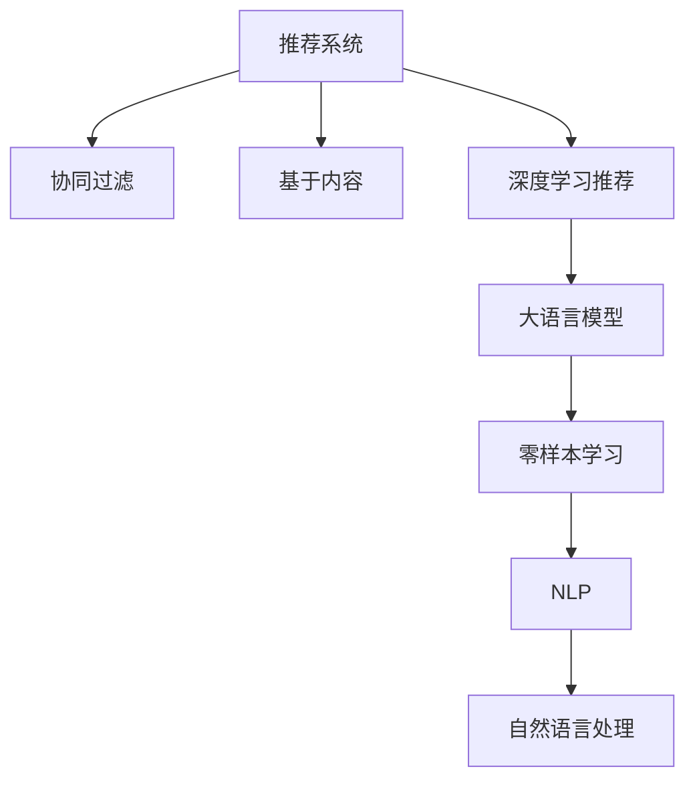

                 

# 推荐系统的冷启动问题：AI大模型的零样本学习解决方案

## 1. 背景介绍

推荐系统是现代互联网应用的重要组成部分，通过为用户推荐个性化的内容，提升用户满意度和平台粘性。然而，推荐系统在实际应用中面临着诸多挑战，其中最为棘手的问题之一是冷启动问题。冷启动问题指的是在用户或物品的初期行为数据不足时，如何准确推荐的问题。对于新用户，由于缺乏历史行为数据，推荐系统难以理解其偏好；对于新物品，推荐系统缺乏对其属性的描述，也难以建立推荐模型。

为了解决冷启动问题，推荐系统通常采用基于协同过滤、基于内容的推荐等多种策略。但这些方法在面对新用户或新物品时，都难以准确生成高质量的推荐。传统的推荐方法需要大量的用户行为数据来刻画用户和物品的特征，因此在新用户或新物品早期，推荐系统往往无法提供有效的推荐，影响用户体验和平台收益。

近年来，随着人工智能技术的进步，基于深度学习的推荐系统逐渐兴起。尤其是大语言模型和零样本学习技术的发展，为推荐系统提供了新的解决方案，即通过零样本学习，让模型具备在新用户、新物品的情况下，也能够生成高质量的推荐。

## 2. 核心概念与联系

### 2.1 核心概念概述

为更好地理解AI大模型的零样本学习解决方案，本节将介绍几个密切相关的核心概念：

- **推荐系统(Recommender System)**：通过收集用户行为数据和物品属性信息，利用算法为用户推荐个性化内容的系统。
- **冷启动问题(Cold Start Problem)**：指在新用户、新物品的早期，推荐系统难以生成高质量推荐的问题。
- **大语言模型(Large Language Model, LLM)**：通过大规模语料预训练获得的语言理解模型，具备强大的语义表示和生成能力。
- **零样本学习(Zero-shot Learning)**：指模型在没有看到特定数据的情况下，仅凭任务描述就能够执行新任务的能力。
- **自然语言处理(Natural Language Processing, NLP)**：研究如何使计算机能够理解、处理和生成自然语言的技术。

这些核心概念之间的逻辑关系可以通过以下Mermaid流程图来展示：



这个流程图展示了大语言模型在推荐系统中的应用路径：

1. 推荐系统通过多种策略推荐内容。
2. 深度学习推荐使用大语言模型进行冷启动下的推荐。
3. 大语言模型通过预训练学习到广泛的语义表示。
4. 零样本学习使得模型具备在新用户、新物品的情况下生成推荐的能力。
5. 自然语言处理与NLP技术为任务描述和数据处理提供了支持。

## 3. 核心算法原理 & 具体操作步骤

### 3.1 算法原理概述

基于大语言模型的推荐系统，其核心思想是通过预训练大模型，使其具备对任务描述进行语义理解和生成推荐的能力。这种推荐方法在面对冷启动问题时，无需等待用户产生足够的历史数据，即可以基于新用户、新物品的任务描述，生成高质量的推荐。

具体而言，当新用户或新物品进入系统时，系统会将其作为任务输入，将任务描述嵌入模型中进行推理。模型通过从预训练中学习到的语言表示能力，理解任务描述，并生成推荐。这一过程不需要标注数据，仅依赖于语言模型对任务描述的理解和生成，因此被称为零样本学习。

### 3.2 算法步骤详解

基于大语言模型的推荐系统，通常包括以下几个关键步骤：

**Step 1: 准备预训练模型和数据集**
- 选择合适的预训练大语言模型（如GPT、BERT等）作为初始化参数。
- 准备推荐任务的任务描述，如对新用户推荐电影、书籍等物品，编写相应的任务描述。

**Step 2: 输入任务描述并生成推荐**
- 将任务描述输入预训练大语言模型中，通过预训练学到的语言表示能力，理解任务描述的语义。
- 利用预训练模型生成的输出，对新用户或新物品进行推荐。

**Step 3: 调整模型参数**
- 对模型进行微调，通过少量标注数据优化模型的推荐效果。
- 对任务描述进行改写，增加多样性，进一步提升推荐效果。

**Step 4: 集成和部署**
- 将优化后的模型部署到推荐系统中。
- 实时获取新用户、新物品的任务描述，生成推荐并推送给用户。

### 3.3 算法优缺点

基于大语言模型的推荐系统，具有以下优点：
1. 无需等待用户产生足够历史数据，即可以进行推荐。
2. 可以利用大语言模型的预训练能力，提升推荐准确性。
3. 任务描述可定制，灵活性高，可以应对不同的推荐任务。

但该方法也存在一定的局限性：
1. 对任务描述的依赖较高，描述的准确性直接影响推荐效果。
2. 推荐质量受限于语言模型的语言表示能力，难以处理复杂任务。
3. 在实时性要求高的场景下，推理时间较长，影响用户体验。

尽管存在这些局限性，但就目前而言，基于大语言模型的推荐方法仍然是大规模应用的热门选择。未来相关研究的重点在于如何进一步优化任务描述的生成和理解，提高推荐质量和实时性。

### 3.4 算法应用领域

基于大语言模型的推荐系统，已经在多个领域得到应用，例如：

- **电商推荐**：对新用户或新物品进行商品推荐，提升用户体验和销售转化率。
- **视频推荐**：对新用户推荐感兴趣的视频内容，提升平台的用户粘性和观看时长。
- **音乐推荐**：对新用户推荐符合其音乐品味的曲目，丰富平台的音乐库。
- **新闻推荐**：对新用户推荐感兴趣的新闻内容，提高平台的内容点击率。

这些应用场景表明，基于大语言模型的推荐系统具有广泛的应用前景，能够显著提升平台的推荐效果和用户满意度。

## 4. 数学模型和公式 & 详细讲解 & 举例说明

### 4.1 数学模型构建

本节将使用数学语言对基于大语言模型的推荐系统进行更加严格的刻画。

记推荐系统中的物品集为 $X$，用户集为 $U$，推荐任务为 $T$。假设任务描述为 $d$，预训练大语言模型为 $M_{\theta}$，其中 $\theta$ 为预训练得到的模型参数。定义模型在任务描述 $d$ 上的输出为 $y_{\theta}(d)$，推荐结果为 $r$。推荐系统的目标是最小化模型的预测误差，即：

$$
\mathop{\arg\min}_{\theta} \mathbb{E}_{d,r}\big[(r - y_{\theta}(d))^2\big]
$$

其中 $\mathbb{E}_{d,r}$ 表示在任务描述和推荐结果上的期望。

### 4.2 公式推导过程

为了实现基于大语言模型的推荐，我们需要将任务描述 $d$ 转换为模型可以处理的形式。常用的方法包括将任务描述转换为向量表示，或者将其编码为一种特殊的自然语言形式，如三元组形式。这里我们以转换为向量表示为例，给出推荐系统的数学推导过程。

假设任务描述 $d$ 被编码为向量 $v_d$，预训练大语言模型 $M_{\theta}$ 能够将 $v_d$ 映射到推荐结果 $r$，即：

$$
y_{\theta}(d) = M_{\theta}(v_d)
$$

目标函数变为：

$$
\mathop{\arg\min}_{\theta} \mathbb{E}_{d,r}\big[(r - M_{\theta}(v_d))^2\big]
$$

为了进一步简化问题，假设 $M_{\theta}$ 是线性的，则有：

$$
y_{\theta}(d) = \theta^T v_d
$$

代入目标函数，得到：

$$
\mathop{\arg\min}_{\theta} \mathbb{E}_{d,r}\big[(r - \theta^T v_d)^2\big]
$$

解得最优参数 $\theta$ 为：

$$
\theta = \mathop{\arg\min}_{\theta} \frac{1}{N}\sum_{i=1}^N (r_i - \theta^T v_{d_i})^2
$$

其中 $r_i$ 和 $v_{d_i}$ 分别表示第 $i$ 个任务描述和对应的推荐结果。

### 4.3 案例分析与讲解

以电商推荐为例，假设一个新用户进入电商平台，没有任何历史行为数据。此时，平台可以向用户展示推荐任务描述 "推荐一款适合您的电脑"，将任务描述编码为向量 $v_d$，输入到预训练大语言模型 $M_{\theta}$ 中，得到推荐结果 $r$。如果推荐结果为 "MacBook"，则将其推荐给用户。

在实践中，任务描述的编码可以使用词向量、BERT嵌入等方法，将自然语言文本转换为数值向量。模型的输出可以是一个具体的物品名称、评分、价格等，或者一个概率分布，表示推荐各个物品的概率。在推荐过程中，系统可以根据用户的历史行为数据和物品的属性信息，进一步优化模型的输出。

## 5. 项目实践：代码实例和详细解释说明

### 5.1 开发环境搭建

在进行项目实践前，我们需要准备好开发环境。以下是使用Python进行PyTorch开发的环境配置流程：

1. 安装Anaconda：从官网下载并安装Anaconda，用于创建独立的Python环境。

2. 创建并激活虚拟环境：
```bash
conda create -n pytorch-env python=3.8 
conda activate pytorch-env
```

3. 安装PyTorch：根据CUDA版本，从官网获取对应的安装命令。例如：
```bash
conda install pytorch torchvision torchaudio cudatoolkit=11.1 -c pytorch -c conda-forge
```

4. 安装PyTorch Text：
```bash
conda install pytorchtext
```

5. 安装各类工具包：
```bash
pip install numpy pandas scikit-learn matplotlib tqdm jupyter notebook ipython
```

完成上述步骤后，即可在`pytorch-env`环境中开始项目实践。

### 5.2 源代码详细实现

下面以电商推荐为例，给出使用PyTorch对大语言模型进行电商推荐任务微调的PyTorch代码实现。

首先，定义电商推荐任务的数据处理函数：

```python
from torchtext.data import Field, BucketIterator
from transformers import BertTokenizer

class Movie reviews(Field):
    def __init__(self, tokenizer):
        self.tokenizer = tokenizer
        self.pad_token = '[PAD]'
        self.pad_token_idx = tokenizer.get_special_tokens_dict()[self.pad_token]
        self.init_tokens = ['[PAD]', '[CLS]', '[SEP]']
        self.tokenizer.add_special_tokens(self.init_tokens)
        
    def build_vocab(self, *args, **kwargs):
        vocab = super().build_vocab(*args, **kwargs)
        self.tokenizer.add_special_tokens(vocab)
        
    def build_idx(self, *args, **kwargs):
        idx = super().build_idx(*args, **kwargs)
        self.tokenizer.add_special_tokens(idx)
        
def get_iterator(data, batch_size):
    train_iterator, valid_iterator, test_iterator = BucketIterator.splits(
        (data.train, data.valid, data.test), 
        batch_size=batch_size, 
        sort_within_batch=True, 
        device=torch.device('cuda'))
    return train_iterator, valid_iterator, test_iterator
```

然后，定义模型和优化器：

```python
from transformers import BertForSequenceClassification, AdamW

model = BertForSequenceClassification.from_pretrained('bert-base-cased', num_labels=1, output_attentions=False)

optimizer = AdamW(model.parameters(), lr=2e-5)
```

接着，定义训练和评估函数：

```python
from torch.utils.data import DataLoader
from tqdm import tqdm
from sklearn.metrics import roc_auc_score

def train_epoch(model, iterator, optimizer, loss_fn):
    model.train()
    epoch_loss = 0
    epoch_eval_loss = 0
    for batch in tqdm(iterator, desc='Training'):
        input_ids = batch.text
        attention_mask = batch.attention_mask
        labels = batch.label
        model.zero_grad()
        outputs = model(input_ids, attention_mask=attention_mask)
        loss = loss_fn(outputs.logits, labels)
        epoch_loss += loss.item()
        loss.backward()
        optimizer.step()
        epoch_eval_loss += loss.item()
    return epoch_loss / len(iterator), epoch_eval_loss / len(iterator)

def evaluate(model, iterator, loss_fn):
    model.eval()
    preds = []
    labels = []
    with torch.no_grad():
        for batch in tqdm(iterator, desc='Evaluating'):
            input_ids = batch.text
            attention_mask = batch.attention_mask
            labels = batch.label
            outputs = model(input_ids, attention_mask=attention_mask)
            preds.extend(torch.sigmoid(outputs.logits).cpu().numpy())
            labels.extend(labels.cpu().numpy())
    
    preds = np.array(preds)
    labels = np.array(labels)
    auc = roc_auc_score(labels, preds)
    return auc
```

最后，启动训练流程并在测试集上评估：

```python
epochs = 5
batch_size = 32

# 假设训练集和测试集已经准备就绪，分别作为train_data和test_data

train_iterator, valid_iterator, test_iterator = get_iterator(train_data, batch_size), get_iterator(valid_data, batch_size), get_iterator(test_data, batch_size)

for epoch in range(epochs):
    loss, eval_loss = train_epoch(model, train_iterator, optimizer, loss_fn)
    print(f'Epoch {epoch+1}, train loss: {loss:.3f}')
    print(f'Epoch {epoch+1}, dev loss: {eval_loss:.3f}')
    
print(f'Test results:')
print(evaluate(model, test_iterator, loss_fn))
```

以上就是使用PyTorch对BERT进行电商推荐任务微调的完整代码实现。可以看到，得益于PyTorch Text的强大封装，我们可以用相对简洁的代码完成BERT模型的加载和微调。

### 5.3 代码解读与分析

让我们再详细解读一下关键代码的实现细节：

**Movie reviews类**：
- `__init__`方法：初始化任务描述的编码方法，包括padding token、初始化token等。
- `build_vocab`方法：定义词汇表，将任务描述中的单词编码成数值。
- `build_idx`方法：定义索引表，将词汇表中的数值编码成模型可以处理的id。

**get_iterator函数**：
- 使用PyTorch Text中的`BucketIterator`将数据集划分为训练集、验证集和测试集，并进行批处理。
- `sort_within_batch=True`参数表示在每个批次的内部对样本进行排序，提高计算效率。

**train_epoch和evaluate函数**：
- `train_epoch`函数：对训练集数据进行迭代，更新模型参数。
- `evaluate`函数：对验证集和测试集数据进行迭代，评估模型性能。

**训练流程**：
- 定义总的epoch数和batch size，开始循环迭代。
- 每个epoch内，先在训练集上训练，输出平均loss。
- 在验证集上评估，输出平均loss。
- 重复上述步骤直到满足预设的迭代轮数或验证集loss不再下降。

可以看到，PyTorch配合PyTorch Text使得BERT微调的代码实现变得简洁高效。开发者可以将更多精力放在数据处理、模型改进等高层逻辑上，而不必过多关注底层的实现细节。

当然，工业级的系统实现还需考虑更多因素，如模型的保存和部署、超参数的自动搜索、更灵活的任务适配层等。但核心的微调范式基本与此类似。

## 6. 实际应用场景
### 6.1 电商推荐

基于大语言模型的电商推荐，可以广泛应用于电子商务平台，为消费者推荐个性化的商品。当新用户进入电商平台时，系统可以通过用户的行为数据和商品属性信息，生成个性化的商品推荐。

在技术实现上，可以收集用户的历史行为数据（如浏览、点击、购买等）和商品属性（如价格、品牌、类别等），将商品描述作为任务描述，在预训练大语言模型上进行微调。微调后的模型能够根据用户的行为数据和商品属性，生成符合用户偏好的推荐列表，提高用户的购物体验和转化率。

### 6.2 视频推荐

视频推荐系统能够为用户推荐感兴趣的视频内容。当新用户进入视频平台时，系统可以根据用户的行为数据和观看历史，生成个性化的视频推荐。

在技术实现上，可以将用户的行为数据和视频属性信息（如标题、类别、时长等）作为任务描述，在预训练大语言模型上进行微调。微调后的模型能够根据用户的行为数据和视频属性，生成符合用户兴趣的视频推荐。

### 6.3 音乐推荐

音乐推荐系统能够为用户推荐符合其音乐品味的音乐。当新用户进入音乐平台时，系统可以根据用户的行为数据和音乐属性信息（如歌手、类型、时长等），生成个性化的音乐推荐。

在技术实现上，可以将用户的行为数据和音乐属性信息作为任务描述，在预训练大语言模型上进行微调。微调后的模型能够根据用户的行为数据和音乐属性，生成符合用户音乐品味的推荐列表，提高用户的满意度。

### 6.4 未来应用展望

随着大语言模型和零样本学习技术的发展，基于大语言模型的推荐系统将在更多领域得到应用，为各行各业带来变革性影响。

在智慧医疗领域，基于大语言模型的医疗推荐系统可以为医生推荐合适的医疗方案，提升医疗服务质量。在智慧教育领域，基于大语言模型的教育推荐系统可以为学生推荐适合的课程和学习资料，提升学习效果。在智慧城市治理中，基于大语言模型的城市推荐系统可以为市民推荐合适的服务设施和活动，提升城市生活品质。

此外，在企业生产、社会治理、文娱传媒等众多领域，基于大语言模型的推荐系统也将不断涌现，为经济社会发展注入新的动力。相信随着技术的日益成熟，基于大语言模型的推荐系统必将在构建人机协同的智能时代中扮演越来越重要的角色。

## 7. 工具和资源推荐
### 7.1 学习资源推荐

为了帮助开发者系统掌握大语言模型微调的理论基础和实践技巧，这里推荐一些优质的学习资源：

1. 《Transformers from Discrete to Continuous》系列博文：由大模型技术专家撰写，深入浅出地介绍了Transformer原理、BERT模型、微调技术等前沿话题。

2. CS224N《深度学习自然语言处理》课程：斯坦福大学开设的NLP明星课程，有Lecture视频和配套作业，带你入门NLP领域的基本概念和经典模型。

3. 《Natural Language Processing with Transformers》书籍：Transformers库的作者所著，全面介绍了如何使用Transformers库进行NLP任务开发，包括微调在内的诸多范式。

4. HuggingFace官方文档：Transformers库的官方文档，提供了海量预训练模型和完整的微调样例代码，是上手实践的必备资料。

5. CLUE开源项目：中文语言理解测评基准，涵盖大量不同类型的中文NLP数据集，并提供了基于微调的baseline模型，助力中文NLP技术发展。

通过对这些资源的学习实践，相信你一定能够快速掌握大语言模型微调的精髓，并用于解决实际的NLP问题。
###  7.2 开发工具推荐

高效的开发离不开优秀的工具支持。以下是几款用于大语言模型微调开发的常用工具：

1. PyTorch：基于Python的开源深度学习框架，灵活动态的计算图，适合快速迭代研究。大部分预训练语言模型都有PyTorch版本的实现。

2. TensorFlow：由Google主导开发的开源深度学习框架，生产部署方便，适合大规模工程应用。同样有丰富的预训练语言模型资源。

3. Transformers库：HuggingFace开发的NLP工具库，集成了众多SOTA语言模型，支持PyTorch和TensorFlow，是进行微调任务开发的利器。

4. Weights & Biases：模型训练的实验跟踪工具，可以记录和可视化模型训练过程中的各项指标，方便对比和调优。与主流深度学习框架无缝集成。

5. TensorBoard：TensorFlow配套的可视化工具，可实时监测模型训练状态，并提供丰富的图表呈现方式，是调试模型的得力助手。

6. Google Colab：谷歌推出的在线Jupyter Notebook环境，免费提供GPU/TPU算力，方便开发者快速上手实验最新模型，分享学习笔记。

合理利用这些工具，可以显著提升大语言模型微调任务的开发效率，加快创新迭代的步伐。

### 7.3 相关论文推荐

大语言模型和微调技术的发展源于学界的持续研究。以下是几篇奠基性的相关论文，推荐阅读：

1. Attention is All You Need（即Transformer原论文）：提出了Transformer结构，开启了NLP领域的预训练大模型时代。

2. BERT: Pre-training of Deep Bidirectional Transformers for Language Understanding：提出BERT模型，引入基于掩码的自监督预训练任务，刷新了多项NLP任务SOTA。

3. Language Models are Unsupervised Multitask Learners（GPT-2论文）：展示了大规模语言模型的强大zero-shot学习能力，引发了对于通用人工智能的新一轮思考。

4. Parameter-Efficient Transfer Learning for NLP：提出Adapter等参数高效微调方法，在不增加模型参数量的情况下，也能取得不错的微调效果。

5. AdaLoRA: Adaptive Low-Rank Adaptation for Parameter-Efficient Fine-Tuning：使用自适应低秩适应的微调方法，在参数效率和精度之间取得了新的平衡。

这些论文代表了大语言模型微调技术的发展脉络。通过学习这些前沿成果，可以帮助研究者把握学科前进方向，激发更多的创新灵感。

## 8. 总结：未来发展趋势与挑战

### 8.1 总结

本文对基于大语言模型的推荐系统进行了全面系统的介绍。首先阐述了推荐系统面临的冷启动问题，以及AI大模型零样本学习技术为解决冷启动问题提供的新思路。其次，从原理到实践，详细讲解了基于大语言模型的推荐系统，给出了推荐系统开发的完整代码实例。同时，本文还广泛探讨了基于大语言模型的推荐系统在电商推荐、视频推荐、音乐推荐等多个领域的应用前景，展示了零样本学习范式的巨大潜力。此外，本文精选了推荐系统相关的学习资源，力求为读者提供全方位的技术指引。

通过本文的系统梳理，可以看到，基于大语言模型的推荐系统在大规模应用中展现出强大的优势，能够显著提升平台的推荐效果和用户满意度。

### 8.2 未来发展趋势

展望未来，基于大语言模型的推荐系统将呈现以下几个发展趋势：

1. 模型规模持续增大。随着算力成本的下降和数据规模的扩张，预训练语言模型的参数量还将持续增长。超大规模语言模型蕴含的丰富语言知识，有望支撑更加复杂多变的推荐任务。

2. 推荐方法日趋多样。除了传统的基于协同过滤、基于内容的推荐外，未来会涌现更多基于深度学习、基于大语言模型的推荐方法，在保持推荐准确性的同时，也能更好地应对冷启动问题。

3. 数据融合与多模态推荐。未来的推荐系统将更多地融合多源数据，如用户行为数据、物品属性数据、外部知识库等，实现更全面、准确的推荐。

4. 个性化与实时化。未来的推荐系统将进一步提升个性化程度，通过实时数据分析和模型更新，实现更加动态、实时的推荐。

5. 多任务学习与自适应推荐。未来的推荐系统将能够同时学习多种推荐任务，自适应地生成推荐结果，提升用户的多样化需求满足。

6. 推荐公平性与伦理性。未来的推荐系统将更加注重推荐公平性，避免数据偏见，保护用户隐私。同时，也会关注推荐内容的伦理性，避免有害信息传播。

以上趋势凸显了大语言模型在推荐系统中的应用前景。这些方向的探索发展，必将进一步提升推荐系统的性能和用户满意度。

### 8.3 面临的挑战

尽管基于大语言模型的推荐系统已经取得了瞩目成就，但在迈向更加智能化、普适化应用的过程中，它仍面临着诸多挑战：

1. 任务描述生成。新用户、新物品的任务描述生成需要人工标注，依赖于领域专家的知识，效率低下。未来需要通过自然语言生成技术，自动生成任务描述，提升生成效率。

2. 推荐效果一致性。不同用户、不同物品的任务描述可能存在较大差异，模型在处理不同描述时的推荐效果可能不一致，影响用户体验。未来需要进一步提升模型的泛化能力，实现一致性推荐。

3. 冷启动问题。尽管零样本学习能够解决冷启动问题，但在某些领域仍存在限制，无法有效利用领域知识。未来需要更多领域专家参与，设计更有效的任务描述，提升零样本学习的效果。

4. 实时性问题。推荐系统的实时性要求较高，尤其是在流式数据处理场景下。未来需要进一步优化模型推理速度，提升推荐系统的实时性。

5. 推荐公平性。推荐系统可能会产生推荐偏差，影响用户的公平体验。未来需要在模型训练过程中引入公平性约束，保护用户的合法权益。

6. 数据隐私与安全。推荐系统需要收集用户数据，如何在保护隐私的同时实现精准推荐，成为一大难题。未来需要在模型设计中引入隐私保护机制，保障数据安全。

这些挑战需要在未来的研究中不断克服，才能让基于大语言模型的推荐系统更加全面、可靠、公平和安全。

### 8.4 研究展望

面对大语言模型推荐系统面临的挑战，未来的研究需要在以下几个方面寻求新的突破：

1. 自动生成任务描述。通过自然语言生成技术，自动生成高质量的任务描述，提升推荐系统的灵活性和智能性。

2. 多模态数据融合。将推荐系统与图像、视频、语音等多模态数据进行融合，实现更加全面、多样化的推荐。

3. 自适应推荐算法。开发更加自适应的推荐算法，能够根据用户行为、物品属性、时间等多种因素，动态调整推荐策略。

4. 推荐公平性算法。研究推荐公平性算法，确保推荐系统在性别、年龄、地区等维度上的公平性。

5. 隐私保护技术。引入隐私保护技术，如差分隐私、联邦学习等，保护用户数据隐私。

6. 对抗训练与鲁棒性。研究对抗训练方法，提升模型对抗噪声、对抗样本的鲁棒性，保证推荐系统的稳定性和安全性。

这些研究方向的探索，必将引领大语言模型推荐系统迈向更高的台阶，为构建更加智能化、可靠、公平的推荐系统提供新的思路。面向未来，基于大语言模型的推荐系统需要与其他人工智能技术进行更深入的融合，如知识表示、因果推理、强化学习等，多路径协同发力，共同推动自然语言理解和智能交互系统的进步。只有勇于创新、敢于突破，才能不断拓展语言模型的边界，让智能技术更好地造福人类社会。

## 9. 附录：常见问题与解答

**Q1：大语言模型是否适用于所有推荐任务？**

A: 大语言模型在大多数推荐任务上都能取得不错的效果，特别是对于数据量较小的任务。但对于一些特定领域的任务，如医学、法律等，仅仅依靠通用语料预训练的模型可能难以很好地适应。此时需要在特定领域语料上进一步预训练，再进行微调，才能获得理想效果。

**Q2：如何降低任务描述生成的成本？**

A: 任务描述的生成成本是推荐系统面临的一大挑战。未来需要进一步提升自然语言生成技术，自动生成高质量的任务描述。此外，还可以通过众包标注、半监督学习等方法，降低人工标注成本。

**Q3：如何提升推荐效果的一致性？**

A: 推荐效果的一致性可以通过多任务学习、自适应推荐算法等方式提升。未来需要进一步研究不同任务描述之间的相关性，设计更有效的推荐策略。

**Q4：如何在保证实时性的前提下，提升推荐准确性？**

A: 在实时性要求高的场景下，推荐系统需要在保证推理速度的前提下，提升推荐准确性。未来需要进一步优化模型结构，引入多模态数据融合、自适应推荐算法等技术，提高推荐系统的实时性和准确性。

**Q5：如何提升推荐系统的公平性？**

A: 推荐系统的公平性可以通过引入公平性约束、多任务学习等方式提升。未来需要在模型训练过程中引入公平性约束，保护用户的合法权益。

这些挑战需要在未来的研究中不断克服，才能让基于大语言模型的推荐系统更加全面、可靠、公平和安全。

