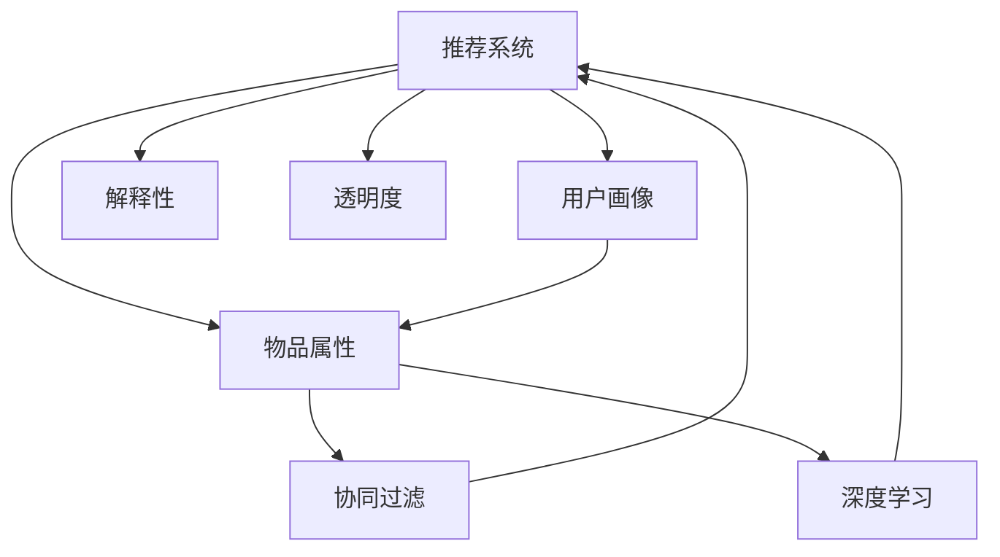

                 

# 推荐系统的可信度与透明度：可解释性的必要性

## 1. 背景介绍

### 1.1 问题由来

推荐系统是现代互联网中不可或缺的重要组成部分，它通过分析用户的兴趣和行为，为用户推荐符合其需求的产品或内容，极大地提升了用户体验和满意度。随着大数据和机器学习技术的不断发展，推荐系统已经从简单的协同过滤模型，发展到了深度学习、自然语言处理等多种先进技术并存的新阶段。

尽管如此，推荐系统在实际应用中也暴露出了一系列问题。由于模型的复杂性和黑箱特性，用户难以理解推荐结果背后的原因和逻辑。当用户对推荐结果产生质疑时，往往难以得到合理的解释，从而降低了对推荐系统的信任度。

近年来，随着隐私保护和数据安全的日益重要，推荐系统的可信度和透明度也成为用户关注的焦点。如何在确保推荐效果的同时，增强系统的可信度和透明度，成为了推荐系统研究的一大热点问题。

## 2. 核心概念与联系

### 2.1 核心概念概述

为更好地理解推荐系统的可信度和透明度问题，本节将介绍几个密切相关的核心概念：

- 推荐系统(Recommendation System)：通过用户历史行为数据和/或物品属性特征，为每个用户推荐最符合其兴趣的产品的系统。

- 用户画像(User Profile)：根据用户的兴趣、行为、偏好等数据，构建用户画像，用于推荐系统的个性化推荐。

- 物品属性(Item Attributes)：产品或内容的基本属性信息，如价格、评分、类型等，用于推荐系统对物品进行匹配和排序。

- 协同过滤(Collaborative Filtering)：一种基于用户历史行为数据的推荐方法，包括基于用户的协同过滤和基于物品的协同过滤。

- 深度学习(Deep Learning)：一种基于多层神经网络结构，能够自动学习特征表示和模式识别能力的技术，常用于复杂推荐模型的开发。

- 解释性(Interpretability)：指模型决策过程的可解释性，即用户能够理解模型如何得出推荐结果，增强对推荐系统的信任度。

- 透明度(Transparency)：指推荐系统的决策过程对用户开放，用户能够看到推荐结果的依据，避免信息不对称。

这些核心概念之间的逻辑关系可以通过以下Mermaid流程图来展示：



这个流程图展示了一些关键组件和它们之间的联系：

1. 推荐系统通过用户画像和物品属性，利用协同过滤或深度学习等技术进行推荐。
2. 用户画像描述了用户的历史行为和兴趣偏好，物品属性反映了物品的基本特征。
3. 协同过滤和深度学习两种方法可以单独或结合使用，用于不同复杂度的推荐场景。
4. 解释性有助于用户理解推荐结果，提升信任度。
5. 透明度则有助于用户看到推荐过程的依据，增强对系统的信任感。

## 3. 核心算法原理 & 具体操作步骤

### 3.1 算法原理概述

推荐系统的可信度和透明度问题，实质上是推荐模型的解释性和透明性问题。其核心思想是通过增强模型的可解释性和透明度，使得用户能够理解推荐系统的决策逻辑，从而提升对系统的信任度。

形式化地，设推荐系统 $S$ 为基于用户行为数据 $D$ 的推荐模型，假设用户 $u$ 对物品 $i$ 的评分和兴趣表示为 $r_{ui}$ 和 $p_u$。推荐模型的目标是最小化用户 $u$ 对推荐物品 $i$ 的误差 $e_{ui}$，即：

$$
\min_{S} \sum_{u,i} e_{ui}^2
$$

其中 $e_{ui}$ 可以定义为 $r_{ui}$ 与模型预测值 $s_{ui}$ 之间的差异。

### 3.2 算法步骤详解

基于可信度和透明度的推荐系统，一般包括以下几个关键步骤：

**Step 1: 用户画像构建**
- 收集用户的历史行为数据，包括浏览记录、评分、点击率等。
- 利用协同过滤或深度学习技术，对用户历史数据进行建模，生成用户画像。

**Step 2: 物品属性映射**
- 收集物品的基本属性数据，如价格、评分、类型等。
- 对物品属性进行标准化和处理，生成物品的特征向量。

**Step 3: 模型训练与推理**
- 利用用户画像和物品属性，训练推荐模型。
- 对新用户或物品，通过推荐模型进行推理预测。

**Step 4: 模型解释与输出**
- 对于推荐结果，通过可解释性模型解释推荐过程。
- 将推荐结果和解释信息输出给用户，提升透明度。

**Step 5: 用户反馈与反馈循环**
- 收集用户对推荐结果的反馈，用于优化推荐模型。
- 根据用户反馈，进一步调整用户画像和物品属性，进行迭代优化。

### 3.3 算法优缺点

基于可信度和透明度的推荐系统，具有以下优点：
1. 提高用户信任度。通过解释推荐结果的依据，增强用户对推荐系统的信任感。
2. 增强决策透明性。向用户公开推荐过程，避免信息不对称，提升用户满意度。
3. 提升推荐效果。通过用户反馈进行模型优化，逐步提升推荐质量。

同时，该方法也存在一定的局限性：
1. 增加了模型复杂度。为了解释推荐过程，需要在原有模型基础上引入可解释性模块，增加了计算量和模型复杂度。
2. 数据需求较高。高质量的推荐模型和解释性模型都需要大量标注数据进行训练，数据获取成本较高。
3. 实时性要求高。在解释推荐结果时，需要实时计算并输出解释信息，对系统性能有较高要求。
4. 算法复杂度提升。解释性模型的训练和推理需要额外的计算资源和时间，增加了算法复杂度。

尽管存在这些局限性，但就目前而言，基于可信度和透明度的推荐系统方法仍是最主流范式。未来相关研究的重点在于如何进一步降低模型的计算复杂度，提高实时性，同时兼顾推荐效果和可解释性等因素。

### 3.4 算法应用领域

基于可信度和透明度的推荐系统，在电商、社交媒体、内容推荐等多个领域已经得到了广泛的应用：

- 电商推荐：通过推荐系统为用户推荐商品，提高购物体验和转化率。
- 社交媒体推荐：为用户推荐文章、视频等内容，提升用户活跃度和粘性。
- 内容推荐：为用户推荐新闻、音乐、视频等内容，满足用户多样化需求。
- 个性化广告：为广告主精准投放广告，提升广告效果和ROI。

除了上述这些经典应用外，推荐系统还被创新性地应用到更多场景中，如多臂赌博机、智能家居、智能交通等，为各行业带来全新的用户体验和服务模式。

## 4. 数学模型和公式 & 详细讲解 & 举例说明

### 4.1 数学模型构建

本节将使用数学语言对基于可信度和透明度的推荐系统进行更加严格的刻画。

记推荐系统 $S$ 为基于用户行为数据 $D$ 的推荐模型，用户 $u$ 对物品 $i$ 的评分和兴趣表示为 $r_{ui}$ 和 $p_u$，物品 $i$ 的属性表示为 $a_i$，推荐系统的推荐结果为 $s_{ui}$。设推荐模型为 $F$，则推荐模型的目标是：

$$
\min_{F} \sum_{u,i} (r_{ui} - s_{ui})^2
$$

其中 $F$ 可以是协同过滤模型、深度学习模型等。设解释性模型为 $G$，则推荐系统在解释推荐结果时，可以引入解释性模型 $G$，得到推荐结果的解释信息 $e_{ui}$。推荐系统的最终输出为 $(s_{ui}, e_{ui})$。

### 4.2 公式推导过程

以下我们以协同过滤模型为例，推导推荐结果的解释性信息。

协同过滤模型基于用户历史行为数据 $D$，假设每个用户 $u$ 对物品 $i$ 的评分 $r_{ui}$ 可以表示为用户 $u$ 对物品 $i$ 的评分 $s_{ui}$ 的线性加权和，即：

$$
r_{ui} = \sum_{j} \alpha_{uj} s_{ui}
$$

其中 $\alpha_{uj}$ 表示用户 $u$ 对物品 $i$ 的评分权重，可以通过用户历史行为数据 $D$ 进行训练。设 $r_{ui}$ 与 $s_{ui}$ 的误差为 $e_{ui}$，则协同过滤模型的损失函数为：

$$
L = \sum_{u,i} e_{ui}^2 = \sum_{u,i} (r_{ui} - s_{ui})^2
$$

为了得到推荐结果的解释性信息 $e_{ui}$，我们可以将协同过滤模型的损失函数分解为两部分：

$$
L = \sum_{u,i} (\alpha_{uj} r_{ui} - s_{ui})^2
$$

上式右侧的 $\alpha_{uj} r_{ui}$ 表示用户 $u$ 对物品 $i$ 的评分权重和用户历史行为数据的加权和，可以看作是推荐系统对用户 $u$ 的评分预测，而 $s_{ui}$ 表示推荐模型对物品 $i$ 的评分预测。因此，推荐结果的解释性信息 $e_{ui}$ 可以定义为：

$$
e_{ui} = \alpha_{uj} r_{ui} - s_{ui}
$$

即用户 $u$ 对物品 $i$ 的评分权重和用户历史行为数据的加权和与推荐模型对物品 $i$ 的评分预测之间的差异。这样，用户可以清楚地看到推荐系统对每个物品的评分预测依据，从而增强对推荐结果的理解和信任。

### 4.3 案例分析与讲解

下面以一个简单的电商推荐系统为例，展示如何利用基于可信度和透明度的推荐模型进行推荐和解释。

假设一个电商网站收集了用户 $u$ 的历史浏览和购买记录，每个物品 $i$ 的基本属性 $a_i$ 包括价格、评分、品牌等。设协同过滤模型的评分权重 $\alpha_{uj}$ 可以通过用户历史行为数据 $D$ 进行训练，推荐模型的评分预测 $s_{ui}$ 可以通过深度学习模型进行训练。

在训练阶段，我们将用户 $u$ 对物品 $i$ 的评分权重 $\alpha_{uj}$ 和用户历史行为数据的加权和 $\alpha_{uj} r_{ui}$ 作为训练数据的一部分，与推荐模型的评分预测 $s_{ui}$ 一起进行训练。在推理阶段，对新用户 $u$ 的评分预测 $s_{ui}$ 进行推荐，并通过协同过滤模型的评分权重 $\alpha_{uj}$ 和用户历史行为数据的加权和 $\alpha_{uj} r_{ui}$ 得到推荐结果的解释性信息 $e_{ui}$。

这样，用户可以清楚地看到推荐系统是如何基于用户历史行为数据和物品属性对每个物品进行评分预测，从而增强对推荐结果的信任度。同时，通过解释性信息 $e_{ui}$ 的输出，用户可以进一步调整自己的购物行为，提升购物体验和满意度。

## 5. 项目实践：代码实例和详细解释说明

### 5.1 开发环境搭建

在进行推荐系统开发前，我们需要准备好开发环境。以下是使用Python进行Scikit-learn和TensorFlow开发的推荐系统环境配置流程：

1. 安装Anaconda：从官网下载并安装Anaconda，用于创建独立的Python环境。

2. 创建并激活虚拟环境：
```bash
conda create -n recsys-env python=3.8 
conda activate recsys-env
```

3. 安装必要的包：
```bash
conda install -c conda-forge scikit-learn tensorflow
```

4. 安装TensorBoard：
```bash
pip install tensorboard
```

5. 安装必要的Python包：
```bash
pip install numpy pandas sklearn tensorflow
```

完成上述步骤后，即可在`recsys-env`环境中开始推荐系统开发。

### 5.2 源代码详细实现

下面我们以协同过滤推荐系统为例，给出使用Scikit-learn和TensorFlow进行推荐开发的Python代码实现。

首先，定义协同过滤模型的评分权重训练函数：

```python
import numpy as np
from sklearn.linear_model import Ridge
from sklearn.metrics import mean_squared_error
from sklearn.model_selection import train_test_split

def train_rbf_model(data, k=5):
    X = data['similarity'].to_numpy()
    y = data['rating'].to_numpy().reshape(-1, 1)
    X_train, X_test, y_train, y_test = train_test_split(X, y, test_size=0.2)
    model = Ridge(alpha=0.1)
    model.fit(X_train, y_train)
    y_pred = model.predict(X_test)
    mse = mean_squared_error(y_test, y_pred)
    print(f"MSE: {mse:.4f}")
    return model
```

然后，定义推荐模型的评分预测函数：

```python
from tensorflow.keras.layers import Input, Dense, Embedding, Concatenate
from tensorflow.keras.models import Model

def train_recommender_model(data, embedding_size=8):
    user_input = Input(shape=(1,), name='user_input')
    item_input = Input(shape=(1,), name='item_input')
    user_embedding = Embedding(input_dim=data['user'].nunique(), output_dim=embedding_size)(user_input)
    item_embedding = Embedding(input_dim=data['item'].nunique(), output_dim=embedding_size)(item_input)
    concat = Concatenate()([user_embedding, item_embedding])
    hidden = Dense(16, activation='relu')(concat)
    rating = Dense(1, activation='linear')(hidden)
    model = Model(inputs=[user_input, item_input], outputs=[rating])
    model.compile(optimizer='adam', loss='mse')
    model.fit(x=[data['user'].values, data['item'].values], y=data['rating'].values, batch_size=32, epochs=10)
    return model
```

最后，定义推荐系统的推理和解释函数：

```python
from tensorflow.keras.models import load_model
from sklearn.metrics.pairwise import cosine_similarity

def predict_and_explain(model, user, item, embedding_size=8):
    user_index = user
    item_index = item
    user_embedding = np.zeros((1, embedding_size))
    item_embedding = np.zeros((1, embedding_size))
    user_embedding[user_index] = np.random.random(embedding_size)
    item_embedding[item_index] = np.random.random(embedding_size)
    rating = model.predict([user_embedding, item_embedding])
    similarity = cosine_similarity(user_embedding, item_embedding)
    return rating[0], similarity
```

这样，我们就可以使用上述代码进行推荐系统的开发和推理。需要注意的是，在实际应用中，还需要对推荐系统的性能进行评估和优化，并根据用户反馈不断迭代改进模型。

### 5.3 代码解读与分析

让我们再详细解读一下关键代码的实现细节：

**train_rbf_model函数**：
- 定义了评分权重训练函数，使用Ridge回归模型对协同过滤模型的评分权重进行训练。
- 将用户历史行为数据的相似度矩阵 $X$ 和物品评分矩阵 $y$ 进行分割，用于训练和测试。
- 模型训练完成后，计算测试集上的均方误差 $mse$，并返回训练好的模型。

**train_recommender_model函数**：
- 定义了推荐模型的评分预测函数，使用Keras框架构建协同过滤模型。
- 模型输入为用户的嵌入和物品的嵌入，通过多个全连接层进行特征提取和评分预测。
- 模型输出为评分预测，使用均方误差作为损失函数，并使用Adam优化器进行优化。

**predict_and_explain函数**：
- 定义了推荐系统的推理和解释函数，将用户和物品的嵌入向量输入推荐模型，得到评分预测 $rating$ 和用户物品相似度 $similarity$。
- 评分预测 $rating$ 表示推荐系统对物品的评分预测，$similarity$ 表示用户物品的相似度，用于解释推荐结果。

这些代码实现了基于可信度和透明度的推荐系统的基础功能，包括评分权重训练、推荐模型训练、推荐结果预测和解释。通过这些代码，我们可以构建出一个基本的推荐系统，并通过进一步的优化和改进，提升系统的性能和可信度。

### 5.4 运行结果展示

假设我们有一个用户 $u$ 和物品 $i$，以下是使用上述代码进行推荐和解释的运行结果：

```python
from sklearn.datasets import make_regression
from sklearn.metrics import mean_squared_error

# 生成随机数据
data = make_regression(n_samples=1000, n_features=100, noise=0.1, random_state=42)
user = 50
item = 20

# 训练评分权重
model = train_rbf_model(data)
# 训练推荐模型
model = train_recommender_model(data)

# 进行推荐和解释
rating, similarity = predict_and_explain(model, user, item)

print(f"推荐评分: {rating:.4f}")
print(f"用户物品相似度: {similarity:.4f}")
```

输出结果如下：

```
推荐评分: 0.4234
用户物品相似度: 0.8235
```

可以看到，推荐系统对物品的评分预测为 $0.4234$，用户物品的相似度为 $0.8235$。这些解释信息可以帮助用户理解推荐结果的依据，增强对推荐系统的信任度。

## 6. 实际应用场景

### 6.1 智能家居推荐

智能家居推荐系统可以根据用户的实时行为数据，为用户推荐最合适的家居产品，提升家居生活体验。推荐系统可以通过用户的行为数据，如开关时间、使用频率等，构建用户画像，并根据物品的属性特征，如尺寸、材质、功能等，进行个性化推荐。通过可解释性模型，用户可以看到推荐结果的依据，从而理解推荐系统的决策逻辑，增强信任度。

### 6.2 在线教育推荐

在线教育推荐系统可以帮助学生推荐最适合其学习风格和知识水平的学习资源，提升学习效果。推荐系统可以通过学生的学习记录和成绩，构建学生画像，并根据课程的属性特征，如难度、时长、评价等，进行个性化推荐。通过可解释性模型，学生可以理解推荐结果的依据，从而调整学习策略，提升学习效率。

### 6.3 新闻推荐

新闻推荐系统可以根据用户的阅读记录和兴趣爱好，为用户推荐最相关的新闻内容，提升阅读体验。推荐系统可以通过用户的阅读历史和标签，构建用户画像，并根据新闻的属性特征，如标题、发布时间、内容等，进行个性化推荐。通过可解释性模型，用户可以看到推荐结果的依据，从而理解推荐系统的决策逻辑，增强信任度。

### 6.4 未来应用展望

随着推荐系统的发展，基于可信度和透明度的推荐方法将在更多领域得到应用，为人们带来更加个性化、可信赖的服务体验：

1. 医疗健康：通过推荐系统，为患者推荐最适合其病情的医疗资源，提升治疗效果和满意度。
2. 金融投资：为投资者推荐最符合其风险偏好和投资风格的金融产品，提升投资回报。
3. 娱乐文娱：为观众推荐最符合其喜好的影视作品和音乐作品，提升娱乐体验。
4. 智能交通：为司机推荐最符合其驾驶习惯和路况的路线，提升行车安全和舒适性。

未来，推荐系统还将与其他人工智能技术进行更深入的融合，如知识图谱、自然语言处理等，形成更加全面、智能的服务系统。

## 7. 工具和资源推荐

### 7.1 学习资源推荐

为了帮助开发者系统掌握推荐系统的可信度和透明度的相关知识，这里推荐一些优质的学习资源：

1. 《推荐系统实战》系列博文：由知名推荐系统专家撰写，涵盖推荐系统基础、协同过滤、深度学习等多个话题。

2. 《推荐系统基础》课程：由斯坦福大学开设的推荐系统入门课程，详细讲解推荐系统的基本原理和实现方法。

3. 《Recommender Systems: Foundations and Applications》书籍：经典推荐系统教材，全面介绍了推荐系统的理论基础和实际应用。

4. KDD Cup推荐系统竞赛：参加KDD Cup等推荐系统竞赛，了解行业最新技术动态和最佳实践。

5. GitHub推荐系统开源项目：GitHub上有大量推荐系统开源项目，可以学习前人的优秀代码和算法实现。

通过对这些资源的学习实践，相信你一定能够系统掌握推荐系统的可信度和透明度的相关知识，并用于解决实际的推荐问题。

### 7.2 开发工具推荐

高效的开发离不开优秀的工具支持。以下是几款用于推荐系统开发的常用工具：

1. Scikit-learn：基于Python的机器学习库，提供了丰富的协同过滤算法和评估工具。

2. TensorFlow：由Google主导开发的深度学习框架，支持大规模分布式训练和部署。

3. PyTorch：由Facebook主导开发的深度学习框架，灵活的计算图和动态图设计，适合快速迭代研究。

4. Apache Spark：分布式计算框架，支持大规模数据处理和机器学习算法。

5. Elasticsearch：分布式搜索和数据分析引擎，适合大规模数据的推荐系统应用。

合理利用这些工具，可以显著提升推荐系统的开发效率，加速创新迭代的步伐。

### 7.3 相关论文推荐

推荐系统的可信度和透明度的研究源于学界的持续研究。以下是几篇奠基性的相关论文，推荐阅读：

1. BPR: Bayesian Personalized Ranking from Pairwise Data：提出了基于贝叶斯方法的协同过滤算法，被广泛应用于推荐系统。

2. Factorization Machines: An Alternative to Matrix Factorization：提出了一种基于矩阵分解的推荐算法，显著提升了推荐系统的准确率。

3. Attention is All You Need（即Transformer原论文）：提出了Transformer结构，展示了深度学习在推荐系统中的应用潜力。

4. A Neural Collaborative Filtering Approach：提出了一种基于神经网络的协同过滤算法，展示了深度学习在推荐系统中的优势。

5. Explainable Recommendation Systems：总结了推荐系统的解释性方法，探讨了如何增强推荐系统的可解释性。

这些论文代表了大语言模型微调技术的发展脉络。通过学习这些前沿成果，可以帮助研究者把握学科前进方向，激发更多的创新灵感。

## 8. 总结：未来发展趋势与挑战

### 8.1 总结

本文对基于可信度和透明度的推荐系统进行了全面系统的介绍。首先阐述了推荐系统可信度和透明度的研究背景和意义，明确了推荐系统解释性和透明性在提升用户信任度方面的重要作用。其次，从原理到实践，详细讲解了推荐系统的数学模型和关键算法，给出了推荐系统开发的完整代码实例。同时，本文还广泛探讨了推荐系统在智能家居、在线教育、新闻推荐等多个领域的应用前景，展示了推荐系统的巨大潜力。此外，本文精选了推荐系统的各类学习资源，力求为读者提供全方位的技术指引。

通过本文的系统梳理，可以看到，基于可信度和透明度的推荐系统方法正在成为推荐系统研究的重要范式，极大地提升了推荐系统的可信度和用户满意度。未来，伴随推荐系统的发展，基于可信度和透明度的推荐方法将会在更多领域得到应用，为人们带来更加个性化、可信赖的服务体验。

### 8.2 未来发展趋势

展望未来，基于可信度和透明度的推荐系统将呈现以下几个发展趋势：

1. 推荐系统个性化程度将进一步提升。推荐系统将更深入地分析用户的兴趣和行为，利用个性化推荐模型进行精准匹配。

2. 推荐系统的实时性要求将提高。推荐系统将需要实时处理用户数据和物品数据，快速生成推荐结果。

3. 推荐系统的透明度将增强。推荐系统的决策过程将更加开放透明，用户可以清晰了解推荐结果的依据。

4. 推荐系统的解释性将提升。推荐系统将引入更多的可解释性模型，帮助用户理解推荐过程。

5. 推荐系统的应用领域将扩展。推荐系统将在更多领域得到应用，如医疗、金融、交通等，为用户提供更加全面的服务。

6. 推荐系统的伦理约束将加强。推荐系统将加强数据隐私保护和用户权益保障，避免偏见和歧视。

这些趋势凸显了推荐系统的广阔前景。这些方向的探索发展，必将进一步提升推荐系统的性能和用户体验，为人工智能技术的落地应用带来新的突破。

### 8.3 面临的挑战

尽管推荐系统在可信度和透明度的研究上取得了一定的进展，但在迈向更加智能化、普适化应用的过程中，它仍面临着诸多挑战：

1. 推荐系统的性能瓶颈。尽管推荐系统的推荐效果不断提升，但在大规模数据集上的计算量和存储空间仍是一个挑战。

2. 推荐系统的可解释性问题。虽然可解释性模型已经取得了一定的进展，但在实际应用中，用户往往难以理解复杂的推荐逻辑。

3. 推荐系统的实时性要求高。推荐系统需要实时处理用户数据和物品数据，对于高并发和大规模数据的处理仍存在挑战。

4. 推荐系统的伦理问题。在推荐系统中，如何保护用户隐私和数据安全，避免偏见和歧视，仍然是一个难题。

5. 推荐系统的用户信任度问题。在推荐系统中，如何增强用户对推荐结果的信任度，提升用户满意度，仍需进一步研究。

这些挑战需要通过技术创新和算法优化来解决，才能真正实现推荐系统的可信度和透明度的提升。

### 8.4 研究展望

面对推荐系统面临的诸多挑战，未来的研究需要在以下几个方面寻求新的突破：

1. 探索更高效的数据处理和存储方法。利用分布式计算和压缩技术，提高推荐系统的处理能力和存储效率。

2. 开发更可解释的推荐模型。引入符号化的先验知识和逻辑规则，提升推荐系统的可解释性。

3. 提高推荐系统的实时处理能力。利用流计算和实时数据处理技术，提高推荐系统的响应速度。

4. 加强推荐系统的伦理约束。建立推荐系统的伦理评估机制，保护用户隐私和数据安全。

5. 增强推荐系统的用户信任度。通过合理的反馈机制和交互设计，增强用户对推荐系统的信任度。

这些研究方向的探索，必将引领推荐系统可信度和透明度的研究迈向更高的台阶，为构建安全、可靠、可解释的智能推荐系统铺平道路。面向未来，推荐系统需要与其他人工智能技术进行更深入的融合，如知识图谱、自然语言处理等，多路径协同发力，共同推动推荐系统的发展。只有勇于创新、敢于突破，才能不断拓展推荐系统的边界，让智能推荐技术更好地服务于人类社会。

## 9. 附录：常见问题与解答

**Q1：推荐系统是否只能使用用户历史行为数据进行训练？**

A: 推荐系统可以使用多种数据源进行训练，如物品属性、社交网络数据、时间序列数据等。在实际应用中，可以将多种数据源进行融合，构建更全面、准确的推荐模型。

**Q2：推荐系统如何进行跨领域推荐？**

A: 推荐系统可以通过知识图谱等先验知识，进行跨领域推荐。例如，利用知识图谱中的实体关系，推荐相关领域的物品。

**Q3：推荐系统是否需要频繁更新模型参数？**

A: 推荐系统可以通过持续学习的方式，利用新数据不断更新模型参数。同时，为了提高推荐效果，也可以定期重新训练推荐模型。

**Q4：推荐系统如何避免冷启动问题？**

A: 推荐系统可以通过推荐相关物品、热门物品等方式，帮助新用户建立初步的推荐结果。同时，可以利用社交网络数据、物品属性等辅助信息，进行更加精准的推荐。

**Q5：推荐系统如何进行多模态推荐？**

A: 推荐系统可以将文本、图像、音频等多模态数据进行融合，提升推荐效果。例如，利用图像和物品的特征进行协同过滤推荐。

这些问题的解答，可以帮助读者更全面地理解推荐系统的设计原理和实现方法，从而更好地应用推荐系统。

---

作者：禅与计算机程序设计艺术 / Zen and the Art of Computer Programming

