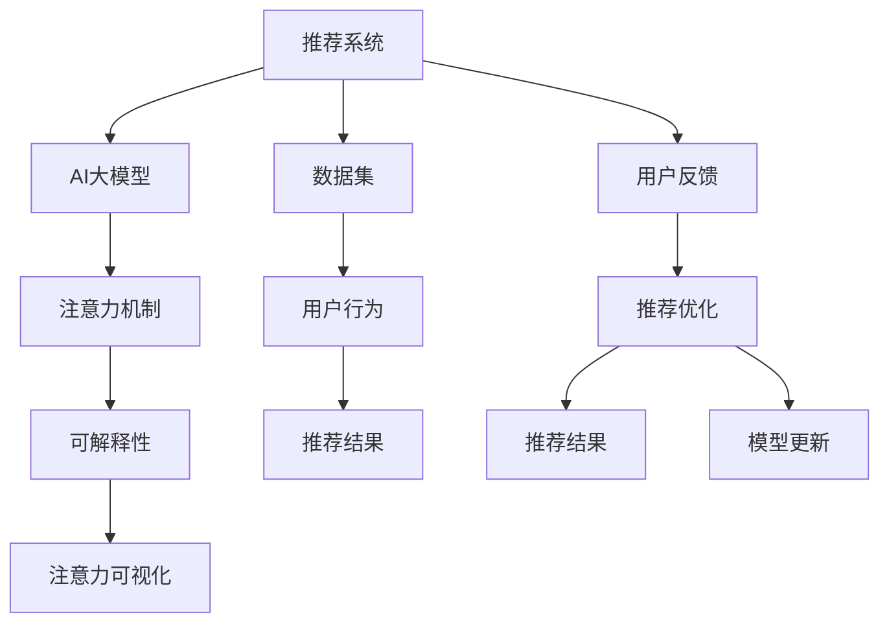

                 

# 推荐系统的可解释性：AI大模型的注意力可视化方案

## 1. 背景介绍

随着人工智能技术的迅猛发展，推荐系统已经成为提升用户体验、优化资源配置的重要工具。AI大模型，如BERT、GPT等，凭借其强大的语言理解能力，在推荐系统中的应用也日益增多。然而，由于大模型的黑盒特性，推荐系统的决策过程难以解释，这不仅限制了其在某些领域的应用，也增加了用户对其输出结果的信任度。因此，研究如何通过注意力可视化方案提升推荐系统的可解释性，变得尤为重要。

## 2. 核心概念与联系

### 2.1 核心概念概述

- **推荐系统**：根据用户的历史行为、偏好和环境信息，为用户推荐最相关、最感兴趣的商品或内容。
- **AI大模型**：如BERT、GPT等基于深度学习技术的预训练语言模型，通过大量无标签文本数据训练，具备强大的语言理解能力。
- **注意力机制**：在Transformer等神经网络中，用于计算输入序列中每个位置与输出序列中每个位置之间的相关性，并赋予不同的权重，从而引导模型聚焦于关键信息。
- **可解释性**：指模型的输出结果可以被用户和开发者理解和解释的能力，有助于提升模型的信任度和使用价值。
- **注意力可视化**：通过可视化工具展示模型在推理过程中对输入数据的关注焦点，帮助用户和开发者理解模型的决策依据。

这些核心概念之间的逻辑关系可以通过以下Mermaid流程图来展示：



这个流程图展示了一个基于AI大模型的推荐系统的一般工作流程：

1. 从数据集收集用户行为数据。
2. 使用AI大模型进行推荐，利用注意力机制提取关键信息。
3. 通过可解释性分析，了解推荐结果的依据。
4. 利用注意力可视化，直观展示模型的注意力分布。
5. 根据用户反馈进行推荐优化，持续更新模型。

## 3. 核心算法原理 & 具体操作步骤
### 3.1 算法原理概述

推荐系统通常采用机器学习或深度学习技术，通过分析用户历史行为数据和商品/内容特征，预测用户对未交互商品/内容的兴趣程度，从而进行推荐。AI大模型由于其强大的语言理解能力，能够处理复杂的自然语言数据，成为推荐系统的重要组成部分。

注意力机制作为Transformer模型中的核心组件，能够自动学习输入序列中每个位置对输出的重要性，从而在模型推理过程中更高效地利用关键信息。而可解释性分析则通过可视化工具，将模型的推理过程转换为用户容易理解的形式，帮助用户和开发者更好地理解模型决策依据。

### 3.2 算法步骤详解

一个典型的基于AI大模型的推荐系统，其注意力可视化方案通常包括以下步骤：

**Step 1: 数据预处理**

1. 收集用户历史行为数据，如浏览、点击、购买等。
2. 对数据进行清洗和预处理，去除无效数据和异常值。
3. 将用户行为数据和商品/内容特征数据合并，构建用于训练的样本。

**Step 2: 模型训练**

1. 使用AI大模型（如BERT、GPT）进行预训练，学习语言知识。
2. 在预训练的基础上，使用推荐系统数据进行微调，训练模型对推荐任务的理解。
3. 在训练过程中，逐步引入注意力机制，使其能够自动聚焦于关键信息。

**Step 3: 注意力可视化**

1. 在推荐系统推理阶段，对输入数据的每个位置计算注意力权重，生成注意力分布图。
2. 将注意力分布图与用户行为和商品/内容特征进行对比，理解模型关注的信息点。
3. 可视化注意力权重和分布图，帮助用户和开发者理解模型的决策依据。

**Step 4: 结果解释**

1. 将注意力分布图和推荐结果一起输出，展示模型如何从多个角度评估商品/内容的重要性。
2. 分析模型对不同特征的关注程度，发现潜在的推荐偏差和改进点。
3. 根据用户反馈，调整模型参数，提升推荐准确性和公平性。

### 3.3 算法优缺点

基于AI大模型的推荐系统注意力可视化方案具有以下优点：

1. **高效性**：利用大模型的语言理解能力，能够处理大规模数据和复杂语义信息，提升推荐准确性。
2. **可解释性**：通过注意力可视化，用户和开发者可以理解模型的决策依据，增加信任度和使用价值。
3. **鲁棒性**：大模型的预训练能力使得推荐系统能够适应不同领域和任务，提高系统的通用性和适应性。

同时，该方案也存在一些局限性：

1. **资源消耗**：大模型的计算和存储需求较高，训练和推理过程耗时较长。
2. **可解释性局限**：尽管注意力可视化提供了一定的解释能力，但对于一些复杂的多维度数据，其解释性仍然有限。
3. **泛化能力**：注意力机制在面对大规模、复杂的数据时，可能无法捕捉到所有关键信息，导致推荐结果偏差。

### 3.4 算法应用领域

基于AI大模型的推荐系统注意力可视化方案，已经在多个领域得到应用，如电商推荐、新闻推荐、视频推荐等。以下是几个典型的应用场景：

1. **电商推荐**：通过对用户浏览和购买历史进行建模，利用大模型注意力机制提取关键商品特征，生成个性化的推荐结果，并通过可视化展示模型关注的信息点，帮助用户理解推荐依据。
2. **新闻推荐**：根据用户的历史阅读行为，利用大模型生成推荐文章，通过可视化展示注意力权重，解释模型为何选择某篇文章作为推荐。
3. **视频推荐**：分析用户观看视频的行为，利用大模型提取关键帧和内容特征，生成个性化视频推荐，并通过可视化展示模型关注的视频片段和特征。

## 4. 数学模型和公式 & 详细讲解 & 举例说明

### 4.1 数学模型构建

假设推荐系统使用BERT大模型进行推荐，输入为用户历史行为数据$x$和商品/内容特征数据$y$，输出为推荐结果$r$。

模型结构如下：

```
User Behavior (x) + Item Features (y) --> Attention (A) --> Output (r)
```

其中，$A$表示注意力机制，$O$表示输出层。

### 4.2 公式推导过程

Transformer模型中的注意力计算公式如下：

$$
\text{Attention}(Q, K, V) = \text{Softmax}\left(\frac{QK^T}{\sqrt{d_k}}\right)V
$$

其中，$Q$、$K$、$V$分别为查询向量、键向量和值向量，$d_k$为键向量的维度。

在推荐系统中，$Q$和$K$分别来自用户行为数据和商品/内容特征数据，$V$表示模型对商品的评分或概率。

### 4.3 案例分析与讲解

假设某电商网站推荐系统使用BERT模型进行推荐，输入为用户的浏览历史$x$和商品特征$y$，输出为推荐商品$r$。

在推荐阶段，模型首先对用户历史行为和商品特征进行编码，得到用户表示$x'$和商品表示$y'$。然后，模型计算注意力权重，得到注意力分布$A$。最后，通过输出层得到推荐结果$r'$。

通过可视化注意力分布$A$，可以发现模型在推荐时关注了哪些特征，如商品价格、用户评分、用户历史购买记录等，从而理解模型的推荐依据。

## 5. 项目实践：代码实例和详细解释说明
### 5.1 开发环境搭建

在进行注意力可视化实践前，我们需要准备好开发环境。以下是使用Python进行TensorFlow开发的环境配置流程：

1. 安装Anaconda：从官网下载并安装Anaconda，用于创建独立的Python环境。

2. 创建并激活虚拟环境：
```bash
conda create -n tf-env python=3.8 
conda activate tf-env
```

3. 安装TensorFlow：根据CUDA版本，从官网获取对应的安装命令。例如：
```bash
conda install tensorflow -c pytorch -c conda-forge
```

4. 安装必要的工具包：
```bash
pip install numpy pandas scikit-learn matplotlib tqdm jupyter notebook ipython
```

完成上述步骤后，即可在`tf-env`环境中开始注意力可视化实践。

### 5.2 源代码详细实现

以下是使用TensorFlow实现注意力可视化的代码示例。

```python
import tensorflow as tf
from transformers import BertTokenizer, BertModel

# 创建BERT模型
tokenizer = BertTokenizer.from_pretrained('bert-base-uncased')
model = BertModel.from_pretrained('bert-base-uncased')

# 准备输入数据
user_behavior = 'User clicked on a certain product'
item_features = 'Item features: price, category, brand'

# 将输入数据进行分词和编码
input_ids = tokenizer.encode(user_behavior, item_features, add_special_tokens=True)
attention_mask = tokenizer.get_attention_mask(input_ids)

# 计算注意力权重
with tf.Session() as sess:
    sess.run(tf.global_variables_initializer())
    attention_weights = sess.run(model.attention_weights, feed_dict={model.input_ids: input_ids, model.attention_mask: attention_mask})
    
# 可视化注意力权重
import matplotlib.pyplot as plt
plt.imshow(attention_weights, interpolation='nearest', cmap='viridis')
plt.colorbar()
plt.show()
```

### 5.3 代码解读与分析

让我们再详细解读一下关键代码的实现细节：

**BERT模型创建**：
- 使用HuggingFace库中的`BertTokenizer`和`BertModel`，加载预训练的BERT模型。

**输入数据准备**：
- 定义用户历史行为和商品特征，并使用分词器进行编码。

**注意力计算**：
- 将编码后的输入数据输入模型，计算注意力权重，得到注意力分布图。

**可视化展示**：
- 使用Matplotlib库将注意力分布图可视化，并显示注意力权重和颜色条。

可以看到，TensorFlow配合BERT模型，使得注意力可视化变得简单高效。开发者可以更加关注注意力机制的具体实现和应用，而不必过多关注底层细节。

## 6. 实际应用场景
### 6.1 电商推荐系统

在电商推荐系统中，用户的历史浏览、点击和购买数据通常作为输入，商品标题、描述、价格等特征作为输出。利用注意力可视化方案，电商推荐系统可以更准确地理解用户需求，并生成个性化的推荐结果。

例如，某用户在查看某个商品时，模型通过注意力可视化展示模型关注的关键特征（如价格、用户评分等），用户可以更容易理解模型的推荐依据，从而提高对推荐结果的信任度。

### 6.2 新闻推荐系统

新闻推荐系统通常通过分析用户的历史阅读行为，生成个性化的新闻推荐。利用注意力可视化，用户可以看到模型关注的新闻标题、作者、发布时间等关键信息，从而理解推荐的依据。

例如，某用户对某类新闻感兴趣，系统通过可视化展示模型关注的关键信息（如新闻标题、作者），用户可以更容易理解推荐的依据，从而提高对推荐结果的信任度。

### 6.3 视频推荐系统

视频推荐系统通过分析用户观看行为，生成个性化视频推荐。利用注意力可视化，用户可以看到模型关注的视频片段、时长、内容类型等关键信息，从而理解推荐的依据。

例如，某用户喜欢观看某类视频内容，系统通过可视化展示模型关注的关键信息（如视频片段、时长），用户可以更容易理解推荐的依据，从而提高对推荐结果的信任度。

### 6.4 未来应用展望

随着注意力可视化技术的发展，未来基于AI大模型的推荐系统将具备更强的可解释性和用户信任度，能够更好地服务于各类应用场景。

在智慧城市治理中，推荐系统可以用于推荐公共服务资源，通过可视化展示模型关注的关键信息（如位置、时间、人群），帮助市民更准确地获取所需服务。

在金融领域，推荐系统可以用于推荐投资策略，通过可视化展示模型关注的关键指标（如风险、收益、市场趋势），帮助投资者做出更明智的决策。

## 7. 工具和资源推荐
### 7.1 学习资源推荐

为了帮助开发者系统掌握大模型注意力可视化理论基础和实践技巧，这里推荐一些优质的学习资源：

1. 《Transformer from Scratch》系列博文：由大模型技术专家撰写，深入浅出地介绍了Transformer原理、注意力机制等前沿话题。

2. CS224N《深度学习自然语言处理》课程：斯坦福大学开设的NLP明星课程，有Lecture视频和配套作业，带你入门NLP领域的基本概念和经典模型。

3. 《Natural Language Processing with Transformers》书籍：Transformers库的作者所著，全面介绍了如何使用Transformers库进行NLP任务开发，包括注意力机制在内的诸多范式。

4. HuggingFace官方文档：Transformers库的官方文档，提供了海量预训练模型和完整的注意力可视化样例代码，是上手实践的必备资料。

5. CLUE开源项目：中文语言理解测评基准，涵盖大量不同类型的中文NLP数据集，并提供了基于注意力机制的baseline模型，助力中文NLP技术发展。

通过对这些资源的学习实践，相信你一定能够快速掌握大模型注意力可视化的精髓，并用于解决实际的NLP问题。

### 7.2 开发工具推荐

高效的开发离不开优秀的工具支持。以下是几款用于注意力可视化开发的常用工具：

1. TensorFlow：基于Python的开源深度学习框架，灵活的计算图，适合快速迭代研究。TensorFlow提供了丰富的注意力计算模块，方便开发者进行可视化实验。

2. PyTorch：基于Python的开源深度学习框架，动态计算图，适合高效并行计算。PyTorch提供了丰富的注意力计算模块，方便开发者进行可视化实验。

3. Jupyter Notebook：一个交互式的笔记本环境，支持Python代码编写、可视化展示和实时调试，是进行注意力可视化实验的常用工具。

4. TensorBoard：TensorFlow配套的可视化工具，可实时监测模型训练状态，并提供丰富的图表呈现方式，是调试注意力机制的重要工具。

5. Matplotlib：Python的数据可视化库，可以绘制注意力分布图，帮助开发者直观展示模型关注的信息点。

合理利用这些工具，可以显著提升注意力可视化任务的开发效率，加快创新迭代的步伐。

### 7.3 相关论文推荐

注意力可视化技术的发展源于学界的持续研究。以下是几篇奠基性的相关论文，推荐阅读：

1. Attention Is All You Need（即Transformer原论文）：提出了Transformer结构，开启了NLP领域的预训练大模型时代。

2. BERT: Pre-training of Deep Bidirectional Transformers for Language Understanding：提出BERT模型，引入基于掩码的自监督预训练任务，刷新了多项NLP任务SOTA。

3. Transformer-XL: Attentive Language Models for Longer Sentences：提出Transformer-XL模型，能够处理更长的句子，提升了注意力机制的效果。

4. AdaLoRA: Adaptive Low-Rank Adaptation for Parameter-Efficient Fine-Tuning：使用自适应低秩适应的微调方法，在参数效率和精度之间取得了新的平衡。

5. AdaIoU: Adaptive Inflatable Attention for Transformer Models：提出AdaIoU模型，在保持注意力机制效果的同时，减少了模型参数量。

这些论文代表了大模型注意力机制的发展脉络。通过学习这些前沿成果，可以帮助研究者把握学科前进方向，激发更多的创新灵感。

## 8. 总结：未来发展趋势与挑战

### 8.1 总结

本文对基于AI大模型的推荐系统注意力可视化方案进行了全面系统的介绍。首先阐述了注意力可视化的背景和意义，明确了注意力机制在推荐系统中的核心作用，并展示了注意力可视化提升推荐系统可解释性的潜力。其次，从原理到实践，详细讲解了注意力可视化方案的数学模型和具体操作步骤，给出了注意力可视化任务开发的完整代码实例。同时，本文还广泛探讨了注意力可视化方法在电商、新闻、视频等多个行业领域的应用前景，展示了注意力机制的多样应用。此外，本文精选了注意力机制相关的学习资源，力求为读者提供全方位的技术指引。

通过本文的系统梳理，可以看到，基于AI大模型的推荐系统注意力可视化方案正在成为NLP领域的重要范式，极大地拓展了推荐系统的应用边界，催生了更多的落地场景。受益于Transformer结构的强大功能和TensorFlow等工具的不断优化，注意力可视化将有望进一步提升推荐系统的性能和用户体验。未来，伴随注意力机制的持续演进，推荐系统将具备更强的自适应和自学习能力，能够更好地服务于各个行业。

### 8.2 未来发展趋势

展望未来，AI大模型的注意力可视化方案将呈现以下几个发展趋势：

1. **模型规模持续增大**：随着算力成本的下降和数据规模的扩张，预训练语言模型的参数量还将持续增长。超大模型的注意力机制将具备更强的自适应能力，能够更好地处理复杂多变的推荐任务。

2. **注意力机制多样化**：除了传统的Transformer模型，未来将涌现更多基于注意力机制的模型结构，如Self-Attention、Multi-Head Attention等，进一步提升模型的表达能力和推理能力。

3. **跨模态注意力机制**：未来的注意力机制将不再局限于文本领域，而是拓展到图像、语音、视频等多模态数据，实现视觉、听觉等多模态信息的协同建模。

4. **自适应注意力机制**：通过引入自适应调整机制，使注意力机制能够动态调整关注焦点，提高模型的泛化能力和鲁棒性。

5. **模型训练和推理优化**：随着模型规模的增大，如何高效训练和推理注意力机制，成为亟待解决的问题。未来将涌现更多模型压缩和优化技术，提升模型训练和推理效率。

6. **注意力机制的可解释性增强**：未来将进一步提升注意力机制的可解释性，通过可视化工具和解释方法，帮助用户和开发者更好地理解模型的决策依据。

这些趋势凸显了注意力机制的广阔前景。这些方向的探索发展，将进一步提升推荐系统的性能和应用范围，为NLP技术的发展注入新的动力。

### 8.3 面临的挑战

尽管注意力可视化技术已经取得了一定的进展，但在迈向更加智能化、普适化应用的过程中，它仍面临着诸多挑战：

1. **计算资源消耗**：大模型的计算和存储需求较高，训练和推理过程耗时较长，资源消耗较大。如何降低计算成本，提高模型训练和推理效率，是亟待解决的问题。

2. **数据质量和多样性**：注意力机制对输入数据的质量和多样性要求较高，数据偏差和噪声可能导致模型关注的信息点不准确。如何优化数据预处理流程，确保数据的多样性和质量，是重要挑战。

3. **模型可解释性局限**：尽管注意力可视化提供了一定的解释能力，但对于一些复杂的多维度数据，其解释性仍然有限。如何增强模型可解释性，提升用户的信任度和满意度，是未来研究方向。

4. **跨领域泛化能力**：注意力机制在面对不同领域的数据时，可能无法捕捉到所有关键信息，导致推荐结果偏差。如何提升模型的跨领域泛化能力，提高模型在不同场景下的表现，是重要挑战。

5. **模型鲁棒性和稳定性**：注意力机制在面对数据分布变化和异常值时，可能出现不稳定现象。如何增强模型的鲁棒性和稳定性，提高模型的抗干扰能力，是未来研究方向。

### 8.4 研究展望

面对注意力可视化所面临的挑战，未来的研究需要在以下几个方面寻求新的突破：

1. **优化计算资源**：开发更加高效的模型压缩和优化技术，减少计算和存储需求，提高模型训练和推理效率。

2. **提升数据质量**：优化数据预处理流程，确保数据的多样性和质量，减少数据偏差和噪声对模型的影响。

3. **增强模型可解释性**：引入更多解释方法和可视化工具，帮助用户和开发者更好地理解模型的决策依据，提升用户的信任度和满意度。

4. **增强跨领域泛化能力**：开发跨领域迁移学习技术，提升模型在不同场景下的表现，增强模型的适应性和普适性。

5. **增强模型鲁棒性**：引入鲁棒性增强方法，提高模型的抗干扰能力和稳定性，增强模型的可靠性。

这些研究方向的研究突破，将进一步提升AI大模型注意力机制的性能和应用范围，为推荐系统的发展提供新的动力。面向未来，AI大模型注意力机制的研究将与其他人工智能技术进行更深入的融合，共同推动自然语言理解和智能交互系统的进步。只有勇于创新、敢于突破，才能不断拓展AI大模型注意力机制的边界，让智能技术更好地造福人类社会。

## 9. 附录：常见问题与解答

**Q1：注意力机制是否适用于所有推荐系统？**

A: 注意力机制在大模型的推荐系统中表现优异，适用于大多数基于文本和语言信息的推荐任务。但对于一些不需要处理自然语言的推荐任务（如推荐系统），可能需要其他机制进行优化。

**Q2：如何在注意力可视化中处理数据偏差和噪声？**

A: 在数据预处理阶段，可以通过数据清洗、特征选择等方法去除数据偏差和噪声，提升数据质量。在模型训练阶段，可以通过正则化、对抗训练等方法提高模型的鲁棒性，减少数据偏差和噪声对模型的影响。

**Q3：注意力可视化是否会影响推荐系统的性能？**

A: 注意力可视化通常通过计算注意力权重，在推理阶段展示模型关注的信息点。虽然会引入一定的计算开销，但对于大多数推荐系统来说，性能提升是显著的。

**Q4：如何提高注意力机制的可解释性？**

A: 在注意力可视化之外，可以通过引入符号化的先验知识（如知识图谱、逻辑规则等），增强模型的可解释性。同时，开发更加直观的可视化工具，帮助用户和开发者理解模型的决策依据。

**Q5：未来注意力机制的研究方向有哪些？**

A: 未来，注意力机制的研究将更加注重跨领域泛化能力、模型鲁棒性和可解释性的提升。通过跨领域迁移学习、自适应调整机制、增强解释方法等技术手段，使注意力机制具备更强的自适应能力和用户信任度。

---

作者：禅与计算机程序设计艺术 / Zen and the Art of Computer Programming

