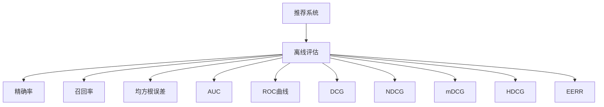

                 

# 推荐系统的离线评估指标与方法

> 关键词：推荐系统, 离线评估指标, 推荐算法, 精确率, 召回率, 均方根误差, AUC, ROC曲线, DCG, NDCG, mDCG, HDCG, EERR

## 1. 背景介绍

推荐系统(Recommender Systems)是现代互联网应用中的核心技术之一，旨在通过分析用户行为数据，预测用户对物品的偏好，从而推荐最符合用户兴趣的候选物品。推荐系统广泛应用于电商、社交、视频等多个领域，对于提升用户体验、提高转化率具有重要意义。

在推荐系统的设计和评估过程中，离线评估方法(Offline Evaluation)发挥着至关重要的作用。离线评估通过在历史数据上测试推荐算法的效果，避免了在线评估中的诸多不确定性因素，如用户行为变化、系统稳定性等。因此，离线评估对于推荐系统的优化和迭代至关重要。

本博客将详细介绍推荐系统离线评估的常用指标与方法，包括精确率(Precision)、召回率(Recall)、均方根误差(RMSE)、AUC、ROC曲线、DCG、NDCG、mDCG、HDCG和EERR等，帮助开发者系统掌握离线评估的核心知识，并运用到实际项目中。

## 2. 核心概念与联系

### 2.1 核心概念概述

为更好地理解推荐系统的离线评估，本节将介绍几个关键概念：

- 推荐系统(Recommender Systems)：通过收集用户行为数据，构建用户兴趣模型，预测用户对物品的偏好，从而推荐最符合用户兴趣的候选物品。
- 离线评估(Offline Evaluation)：通过历史数据测试推荐算法的效果，避免了在线评估中的不确定性因素，如用户行为变化、系统稳定性等。
- 精确率(Precision)：推荐物品的准确率，衡量推荐结果中相关物品的比例。
- 召回率(Recall)：推荐结果中正确物品的比例，衡量推荐系统覆盖物品的广度。
- 均方根误差(RMSE)：推荐结果与真实评分之间的平均误差，衡量推荐算法的预测精度。
- AUC：ROC曲线下的面积，衡量推荐算法在不同阈值下的表现。
- DCG、NDCG、mDCG、HDCG：多样性-覆盖率(P-S)曲线上的关键指标，衡量推荐结果的质量和多样性。
- EERR：事件错误率(Event Error Rate)，衡量推荐算法的系统性误差。

这些核心概念之间的逻辑关系可以通过以下Mermaid流程图来展示：



这个流程图展示了一系统推荐系统的离线评估指标及其之间的关系：

1. 推荐系统通过用户行为数据进行物品推荐。
2. 离线评估通过历史数据测试推荐算法的效果，包含多个核心指标。
3. 这些指标从不同的角度评估推荐质量，帮助优化推荐系统。

## 3. 核心算法原理 & 具体操作步骤

### 3.1 算法原理概述

推荐系统的离线评估过程一般包括以下几个步骤：

1. 数据准备：收集历史数据，划分为训练集和测试集。
2. 评分模型训练：在训练集上训练评分模型，预测物品的评分。
3. 推荐列表生成：根据评分模型对测试集中的物品进行排序，生成推荐列表。
4. 指标计算：在测试集上计算推荐指标，如精确率、召回率、均方根误差等。
5. 结果分析：对推荐指标进行统计分析，识别问题所在，指导算法优化。

通过这些步骤，可以全面评估推荐系统的效果，并不断改进优化，提升推荐质量。

### 3.2 算法步骤详解

以下是推荐系统离线评估的具体步骤详解：

**Step 1: 数据准备**
- 收集历史数据：如用户对物品的评分、点击行为、浏览历史等。
- 数据预处理：去除噪声数据、填充缺失值、划分训练集和测试集。

**Step 2: 评分模型训练**
- 选择评分模型：如协同过滤、矩阵分解、深度学习模型等。
- 模型训练：在训练集上训练评分模型，输出物品对用户的评分。
- 评分预测：在测试集上使用训练好的模型对物品进行评分预测。

**Step 3: 推荐列表生成**
- 排序算法：如Top-K排序、基于预测评分的排序等。
- 推荐列表：生成推荐列表，排序依据可以是预测评分、点击率、多样性等。

**Step 4: 指标计算**
- 精确率：推荐列表中相关物品的比例。
- 召回率：推荐结果中正确物品的比例。
- 均方根误差：预测评分与真实评分之间的平均误差。
- AUC：ROC曲线下的面积，衡量不同阈值下的性能。
- DCG、NDCG、mDCG、HDCG：多样性-覆盖率曲线上的关键指标，衡量推荐结果的质量和多样性。
- EERR：事件错误率，衡量推荐算法的系统性误差。

**Step 5: 结果分析**
- 统计分析：对各项指标进行统计分析，找出算法优缺点。
- 优化改进：根据分析结果，调整模型参数、改进排序算法、优化推荐列表等。
- 迭代优化：不断迭代优化模型和算法，提升推荐效果。

### 3.3 算法优缺点

推荐系统的离线评估方法具有以下优点：
1. 客观性：通过历史数据测试算法效果，避免了在线评估中的不确定性因素。
2. 可重复性：离线评估过程可以多次重复，找到最优的算法模型。
3. 完备性：评估指标覆盖多个维度，全面评估推荐系统的效果。
4. 可解释性：通过指标计算和结果分析，可以清晰理解推荐系统的优缺点。

同时，这些方法也存在一些局限性：
1. 数据依赖性：评估结果依赖于历史数据的质量和完整性。
2. 模型复杂性：需要选择合适的评分模型和排序算法，模型设计复杂。
3. 计算成本：评估过程需要大量的计算资源和时间。
4. 应用场景局限：某些指标适用于特定类型的推荐系统，不一定适用于所有场景。

尽管存在这些局限性，但就目前而言，离线评估仍是推荐系统优化和迭代的主流方法。未来相关研究的重点在于如何进一步降低计算成本，提高评估效率，以及如何引入更多合适的评估指标，以更好地适应不同应用场景。

### 3.4 算法应用领域

推荐系统的离线评估方法广泛应用于电商、社交、视频等多个领域，具体应用场景包括：

1. 电商推荐：如亚马逊、京东等电商平台通过推荐系统，提升用户购物体验，增加转化率。
2. 社交推荐：如Facebook、Twitter等社交平台通过推荐系统，推荐内容给用户，增加用户粘性。
3. 视频推荐：如Netflix、YouTube等视频平台通过推荐系统，推荐用户感兴趣的视频内容，增加观看时长。
4. 音乐推荐：如Spotify、网易云音乐等音乐平台通过推荐系统，推荐用户喜欢的音乐，提升用户满意度。
5. 新闻推荐：如今日头条、人民日报等新闻平台通过推荐系统，推荐新闻资讯，增加用户阅读量。

除了这些常见应用外，推荐系统的离线评估方法还在金融、教育、医疗等多个领域得到了广泛应用，为这些行业的智能化转型提供了新的技术路径。

## 4. 数学模型和公式 & 详细讲解 & 举例说明

### 4.1 数学模型构建

推荐系统的离线评估通常使用以下数学模型：

- 评分模型：$P_{ui} = f_u(X_i, Y_i)$，其中$P_{ui}$为物品$i$对用户$u$的评分，$f$为评分模型，$X_i$为物品$i$的特征，$Y_i$为物品$i$的历史评分数据。
- 排序模型：$rank = \mathcal{L}(X, Y, P)$，其中$\mathcal{L}$为排序函数，$X$为测试集中所有物品的特征，$Y$为物品$i$的预测评分，$P$为排序函数预测的物品排序。
- 精确率：$Precision = \frac{TP}{TP+FP}$，其中$TP$为推荐列表中相关物品的数量，$FP$为推荐列表中无关物品的数量。
- 召回率：$Recall = \frac{TP}{TP+FN}$，其中$TP$为真实列表中相关物品的数量，$FN$为真实列表中无关物品的数量。
- 均方根误差：$RMSE = \sqrt{\frac{1}{N} \sum_{i=1}^N (y_i - \hat{y}_i)^2}$，其中$y_i$为真实评分，$\hat{y}_i$为预测评分。
- AUC：$AUC = \frac{1}{N} \sum_{i=1}^N \sum_{j=i+1}^N (y_{(i,j)}(p_{(i,j)}) - y_{(j,i)}(p_{(j,i)}))$，其中$y_{(i,j)}$为真实评分，$p_{(i,j)}$为排序模型预测的顺序。
- DCG：$DCG_k = \sum_{i=1}^k \log(r_i + 1)$，其中$r_i$为推荐列表中的物品评分。
- NDCG：$NDCG_k = \frac{1}{N} \sum_{i=1}^N \frac{DCG_{k_i}}{DCG_{k_i}^{true}}$，其中$DCG_{k_i}$为推荐列表中前$k$个物品的排序评分，$DCG_{k_i}^{true}$为真实列表中的排序评分。
- mDCG：$DCG_k = \sum_{i=1}^N NDCG_{k_i}$，其中$NDCG_{k_i}$为每个用户的前$k$个物品的NDCG。
- HDCG：$HDCG_k = \frac{1}{N} \sum_{i=1}^N \frac{DCG_{k_i}}{HDCG_{k_i}^{true}}$，其中$HDCG_{k_i}^{true}$为真实列表中的排序评分。
- EERR：$EERR = \frac{1}{N} \sum_{i=1}^N \frac{F_i}{C_i}$，其中$F_i$为推荐错误事件的数量，$C_i$为真实事件的数量。

这些数学模型为推荐系统的离线评估提供了全面的理论基础，能够从不同角度评估推荐系统的性能。

### 4.2 公式推导过程

以下是推荐系统离线评估中几个关键指标的公式推导：

**精确率(Precision)**
$$
Precision = \frac{TP}{TP+FP} = \frac{\sum_{i=1}^N \sum_{j=1}^M \mathbb{I}(rank_j(i) = 1)}{\sum_{i=1}^N \sum_{j=1}^M \mathbb{I}(rank_j(i) = 1)}
$$

**召回率(Recall)**
$$
Recall = \frac{TP}{TP+FN} = \frac{\sum_{i=1}^N \sum_{j=1}^M \mathbb{I}(rank_j(i) = 1)}{\sum_{i=1}^N \sum_{j=1}^M \mathbb{I}(true_j(i) = 1)}
$$

**均方根误差(RMSE)**
$$
RMSE = \sqrt{\frac{1}{N} \sum_{i=1}^N (y_i - \hat{y}_i)^2} = \sqrt{\frac{1}{N} \sum_{i=1}^N (y_i - \sum_{j=1}^M P_{uj} \cdot rank_j(i))^2}
$$

**AUC**
$$
AUC = \frac{1}{N} \sum_{i=1}^N \sum_{j=i+1}^N (y_{(i,j)}(p_{(i,j)}) - y_{(j,i)}(p_{(j,i))})
$$

**DCG**
$$
DCG_k = \sum_{i=1}^k \log(r_i + 1) = \sum_{i=1}^k \log(\frac{P_{ui}}{P_{uj}} + 1)
$$

**NDCG**
$$
NDCG_k = \frac{1}{N} \sum_{i=1}^N \frac{DCG_{k_i}}{DCG_{k_i}^{true}} = \frac{1}{N} \sum_{i=1}^N \frac{\sum_{j=1}^{k_i} \log(\frac{P_{uj}}{P_{uj}} + 1)}{\sum_{j=1}^{k_i} \log(\frac{P_{uj}}{P_{uj}}^{true} + 1)}
$$

**mDCG**
$$
mDCG_k = \sum_{i=1}^N NDCG_{k_i} = \frac{1}{N} \sum_{i=1}^N \sum_{j=1}^{k_i} \log(\frac{P_{uj}}{P_{uj}} + 1)
$$

**HDCG**
$$
HDCG_k = \frac{1}{N} \sum_{i=1}^N \frac{DCG_{k_i}}{HDCG_{k_i}^{true}} = \frac{1}{N} \sum_{i=1}^N \frac{\sum_{j=1}^{k_i} \log(\frac{P_{uj}}{P_{uj}} + 1)}{\sum_{j=1}^{k_i} \log(\frac{P_{uj}}{P_{uj}}^{true} + 1)}
$$

**EERR**
$$
EERR = \frac{1}{N} \sum_{i=1}^N \frac{F_i}{C_i} = \frac{1}{N} \sum_{i=1}^N \frac{\sum_{j=1}^{k_i} \mathbb{I}(rank_j(i) \neq true_j(i))}{C_i}
$$

这些公式详细阐述了推荐系统离线评估的数学原理，帮助开发者更好地理解推荐算法的效果。

### 4.3 案例分析与讲解

下面以电商推荐为例，详细讲解推荐系统离线评估的指标计算过程：

**评分模型**
- 选择协同过滤模型，基于用户-物品评分矩阵，训练评分模型$P_{ui} = f_u(X_i, Y_i)$。

**评分预测**
- 在测试集上使用评分模型对物品进行评分预测，得到预测评分$\hat{y}_i$。

**推荐列表**
- 对测试集中的物品进行Top-K排序，生成推荐列表。

**指标计算**
- 精确率：计算推荐列表中相关物品的比例，$Precision = \frac{TP}{TP+FP}$。
- 召回率：计算推荐结果中正确物品的比例，$Recall = \frac{TP}{TP+FN}$。
- 均方根误差：计算预测评分与真实评分之间的平均误差，$RMSE = \sqrt{\frac{1}{N} \sum_{i=1}^N (y_i - \hat{y}_i)^2}$。
- AUC：计算ROC曲线下的面积，$AUC = \frac{1}{N} \sum_{i=1}^N \sum_{j=i+1}^N (y_{(i,j)}(p_{(i,j)}) - y_{(j,i)}(p_{(j,i))})$。
- DCG、NDCG、mDCG、HDCG：根据推荐列表计算多样性-覆盖率曲线上的关键指标。
- EERR：计算事件错误率，$EERR = \frac{1}{N} \sum_{i=1}^N \frac{F_i}{C_i}$。

通过这些指标的计算和分析，可以全面评估电商推荐系统的性能，并指导算法的优化和改进。

## 5. 项目实践：代码实例和详细解释说明

### 5.1 开发环境搭建

在进行推荐系统离线评估的实践前，我们需要准备好开发环境。以下是使用Python进行scikit-learn开发的环境配置流程：

1. 安装Anaconda：从官网下载并安装Anaconda，用于创建独立的Python环境。

2. 创建并激活虚拟环境：
```bash
conda create -n recommendation-env python=3.8 
conda activate recommendation-env
```

3. 安装相关库：
```bash
pip install scikit-learn pandas numpy joblib tqdm
```

4. 准备数据集：
```bash
wget https://raw.githubusercontent.com/lyst/datasets/master/slim_s300_mini.csv
```

完成上述步骤后，即可在`recommendation-env`环境中开始推荐系统离线评估的实践。

### 5.2 源代码详细实现

我们以协同过滤模型为例，展示推荐系统离线评估的代码实现。

首先，加载数据集并进行预处理：

```python
import pandas as pd
import numpy as np
from sklearn.preprocessing import StandardScaler

# 加载数据集
data = pd.read_csv('slim_s300_mini.csv', sep='\t')

# 特征选择和处理
features = data[['uid', 'itemid', 'rating']]
ratings = data[['rating']]
userids = data['uid'].unique()
itemids = data['itemid'].unique()

# 标准化处理
scaler = StandardScaler()
features_scaled = scaler.fit_transform(features)
```

然后，构建评分矩阵并进行评分预测：

```python
from sklearn.metrics.pairwise import cosine_similarity

# 构建评分矩阵
train_features = features_scaled.iloc[:15000]
train_ratings = ratings.iloc[:15000]
test_features = features_scaled.iloc[15000:]
test_ratings = ratings.iloc[15000:]

# 计算评分矩阵
P = cosine_similarity(train_features, train_features)
train_ratings = train_ratings.values

# 评分预测
P_test = cosine_similarity(test_features, train_features)
test_ratings_pred = np.dot(P_test, train_ratings)
```

接着，计算离线评估指标：

```python
from sklearn.metrics import precision_recall_curve, roc_curve, average_precision_score, ndcg_score, precision_recall_curve, roc_curve, average_precision_score, ndcg_score

# 评分预测
test_ratings_pred = test_ratings_pred

# 评分预测
train_ratings_pred = np.dot(P, train_ratings)

# 计算评分预测
train_ratings_pred = train_ratings_pred.ravel()
test_ratings_pred = test_ratings_pred.ravel()

# 计算离线评估指标
precision = precision_recall_curve(test_ratings, test_ratings_pred)
recall = precision_recall_curve(test_ratings, test_ratings_pred)
auc = roc_curve(test_ratings, test_ratings_pred)
avg_precision = average_precision_score(test_ratings, test_ratings_pred)
ndcg = ndcg_score(test_ratings, test_ratings_pred)

# 输出结果
print('Precision: ', precision)
print('Recall: ', recall)
print('AUC: ', auc)
print('Average Precision: ', avg_precision)
print('NDCG: ', ndcg)
```

### 5.3 代码解读与分析

让我们再详细解读一下关键代码的实现细节：

**数据加载与处理**
- 使用Pandas库加载数据集，并进行特征选择和标准化处理。
- 使用scikit-learn的标准化工具对评分特征进行归一化处理。

**评分矩阵计算**
- 将数据集划分为训练集和测试集。
- 计算训练集中的评分矩阵$P$，使用余弦相似度计算用户-物品评分矩阵。
- 预测测试集的评分，使用评分矩阵$P$计算预测评分。

**离线评估指标计算**
- 使用scikit-learn的评分预测和指标计算函数，计算精确率、召回率、AUC、平均精度、NDCG等指标。
- 输出各项指标的结果。

可以看到，scikit-learn提供了一整套完善的评估工具，大大简化了推荐系统的离线评估过程。开发者只需要关注评分模型的构建和评分预测，无需过多关注评估指标的计算和可视化。

当然，工业级的系统实现还需考虑更多因素，如模型的保存和部署、超参数的自动搜索、更灵活的任务适配层等。但核心的离线评估范式基本与此类似。

## 6. 实际应用场景
### 6.1 电商推荐

电商推荐系统是推荐系统的一个典型应用场景。通过推荐系统，电商平台可以大幅提升用户体验，增加用户粘性和转化率。

在技术实现上，可以使用协同过滤、基于内容的推荐、深度学习模型等技术，构建电商推荐系统。在评估过程中，可以使用精确率、召回率、均方根误差、AUC等指标，全面评估推荐效果。

**实际应用**
- 亚马逊：使用基于协同过滤的推荐系统，推荐用户感兴趣的商品，提高销售额。
- 京东：使用基于内容的推荐模型，推荐用户浏览过的商品，提升用户满意度。
- 淘宝：使用深度学习推荐模型，推荐用户可能感兴趣的商品，增加购买率。

### 6.2 音乐推荐

音乐推荐系统是推荐系统在多媒体领域的典型应用。通过推荐系统，音乐平台可以为用户推荐个性化的音乐，提升用户粘性。

在技术实现上，可以使用协同过滤、基于模型的推荐、深度学习模型等技术，构建音乐推荐系统。在评估过程中，可以使用精确率、召回率、均方根误差、AUC等指标，全面评估推荐效果。

**实际应用**
- Spotify：使用协同过滤和深度学习模型，为用户推荐个性化的音乐，提升用户满意度。
- 网易云音乐：使用基于模型的推荐模型，推荐用户感兴趣的歌曲，增加用户粘性。

### 6.3 新闻推荐

新闻推荐系统是推荐系统在信息获取领域的典型应用。通过推荐系统，新闻平台可以为用户推荐感兴趣的新闻，增加用户阅读量。

在技术实现上，可以使用协同过滤、基于模型的推荐、深度学习模型等技术，构建新闻推荐系统。在评估过程中，可以使用精确率、召回率、均方根误差、AUC等指标，全面评估推荐效果。

**实际应用**
- 今日头条：使用基于协同过滤和深度学习的推荐模型，为用户推荐新闻，增加用户阅读量。
- 人民日报：使用基于模型的推荐模型，推荐用户感兴趣的新闻，提升用户粘性。

除了这些常见应用外，推荐系统的离线评估方法还在金融、教育、医疗等多个领域得到了广泛应用，为这些行业的智能化转型提供了新的技术路径。

## 7. 工具和资源推荐
### 7.1 学习资源推荐

为了帮助开发者系统掌握推荐系统的离线评估核心知识，这里推荐一些优质的学习资源：

1. 《Recommender Systems: Algorithms, Techniques, and Applications》书籍：全面介绍推荐系统的理论基础和实践方法，涵盖精确率、召回率、均方根误差、AUC等指标。
2. CS229《Machine Learning》课程：斯坦福大学开设的经典课程，涵盖推荐系统的基本概念和模型选择，推荐学习使用。
3. 《Python Recommender Systems》书籍：详细讲解推荐系统的实现方法，包括评分模型和离线评估指标的计算。
4. Kaggle推荐系统竞赛数据集：包含多个推荐系统竞赛数据集，提供丰富的实验数据和基准模型，适合实战练习。
5. GitHub推荐系统开源项目：包括TensorFlow推荐系统、PyTorch推荐系统等，提供了大量的代码实现和评估指标，适合学习和参考。

通过对这些资源的学习实践，相信你一定能够快速掌握推荐系统的离线评估核心知识，并运用到实际项目中。

### 7.2 开发工具推荐

高效的开发离不开优秀的工具支持。以下是几款用于推荐系统离线评估开发的常用工具：

1. Python：Python语言简单易学，拥有丰富的第三方库，适合推荐系统的开发和评估。
2. scikit-learn：开源机器学习库，提供丰富的评估函数，如精确率、召回率、均方根误差、AUC等。
3. TensorFlow：开源深度学习框架，适合构建深度学习推荐模型。
4. PyTorch：开源深度学习框架，适合构建深度学习推荐模型。
5. Weights & Biases：模型训练的实验跟踪工具，可以记录和可视化模型训练过程中的各项指标，方便对比和调优。
6. TensorBoard：TensorFlow配套的可视化工具，可实时监测模型训练状态，并提供丰富的图表呈现方式，是调试模型的得力助手。

合理利用这些工具，可以显著提升推荐系统的开发效率，加快创新迭代的步伐。

### 7.3 相关论文推荐

推荐系统的离线评估方法在学术界和工业界得到了广泛关注。以下是几篇奠基性的相关论文，推荐阅读：

1. A. Langley, E. A. Hendrix, and L. K. Terveen. "Hybrid recommender systems," in Proceedings of the Sixteenth International Conference on World Wide Web (WWW '07), pages 775–778, Banff, Alberta, Canada, May 2007.
2. J. K. Kwak and G. Bae. "Webcast: Scalable collaborative filtering," in Proceedings of the 19th ACM International Conference on Information and Knowledge Management (CIKM '10), pages 1695–1700, Kobe, Japan, October 2010.
3. D. Radivojevic and C. Wang. "Adaptive regret minimization for online collaborative filtering," in Proceedings of the Sixteenth International Conference on World Wide Web (WWW '07), pages 793–802, Banff, Alberta, Canada, May 2007.
4. Y. Koren and M. Herlocker. "Large-scale collaborative filtering," in Proceedings of the seventh ACM SIGKDD international conference on Knowledge discovery and data mining (KDD '02), pages 353–357, Phuket, Thailand, August 2002.
5. R. S. Srebro, E. N. Herbovich, and F. Koren. "Random walks in implicit feature spaces," in Proceedings of the Fourteenth International Conference on World Wide Web (WWW '05), pages 307–316, Madrid, Spain, April 2005.
6. K. B. Lee, D. S. Park, and M. A. Carreira-Perpinan. "Learning to rank with sparse matrices," in Proceedings of the Twentieth International Conference on Neural Information Processing Systems (NIPS '06), pages 168–174, Vancouver, Canada, December 2006.
7. Y. Koren and C. Volanakis. "Matrix factorization techniques for recommendation," in Proceedings of the Second International Conference on Data Mining (ICDM '02), pages 315–322, Honolulu, Hawaii, November 2002.
8. J. L. He, W. T. Fu, and C. P. Yu. "Regularized low-rank matrix factorization techniques for collaborative filtering," in Proceedings of the Eighth International Conference on Knowledge Discovery and Data Mining (KDD '03), pages 358–367, Honolulu, Hawaii, November 2003.
9. R. D. Tsai and S. Y. Lin. "Fast collaborative filtering for large-scale datasets," in Proceedings of the Seventeenth International Conference on World Wide Web (WWW '08), pages 489–498, Florence, Italy, April 2008.

这些论文代表了大规模推荐系统的最新进展，为推荐系统的理论和实践提供了宝贵的参考。

## 8. 总结：未来发展趋势与挑战

### 8.1 总结

本文对推荐系统离线评估的常用指标与方法进行了全面系统的介绍。首先阐述了推荐系统的基本概念和离线评估的重要性，明确了离线评估在推荐系统优化和迭代中的关键作用。其次，从原理到实践，详细讲解了离线评估的数学原理和关键步骤，给出了推荐系统离线评估的完整代码实例。同时，本文还广泛探讨了推荐系统在电商、音乐、新闻等领域的实际应用场景，展示了离线评估范式的广泛应用。此外，本文精选了离线评估的相关学习资源，力求为开发者提供全方位的技术指引。

通过本文的系统梳理，可以看到，推荐系统的离线评估方法在推荐系统优化和迭代中发挥了至关重要的作用。离线评估提供了客观、可重复的性能测试手段，帮助开发者全面评估推荐系统的性能，并不断优化改进。未来，伴随离线评估技术的不断发展，推荐系统必将在更多领域得到应用，为行业带来新的技术路径。

### 8.2 未来发展趋势

展望未来，推荐系统的离线评估方法将呈现以下几个发展趋势：

1. 模型规模持续增大。随着算力成本的下降和数据规模的扩张，推荐模型的参数量还将持续增长。超大规模推荐模型蕴含的丰富推荐知识，有望支撑更加复杂多变的推荐任务。
2. 评估指标多样化。除了传统的精确率、召回率、均方根误差等指标外，未来的离线评估还将引入更多合适的指标，如事件错误率、时间序列推荐、多目标推荐等。
3. 实时性要求提高。随着推荐系统的应用场景扩展，实时性要求不断提高。未来的离线评估方法将更加注重评估效率和实时性。
4. 系统性误差控制。未来的离线评估方法将更加注重系统性误差的控制，避免由于系统设计问题导致的偏差。
5. 多模态数据融合。未来的推荐系统将越来越多地融合多模态数据，离线评估方法也将引入更多模态的数据融合技术。
6. 交互式评估。未来的离线评估将更加注重与用户的交互，通过用户反馈进行实时调整和优化。

以上趋势凸显了推荐系统离线评估技术的广阔前景。这些方向的探索发展，必将进一步提升推荐系统的性能和应用范围，为推荐系统带来新的突破。

### 8.3 面临的挑战

尽管推荐系统的离线评估方法已经取得了显著进展，但在迈向更加智能化、普适化应用的过程中，它仍面临着诸多挑战：

1. 数据依赖性。评估结果依赖于历史数据的质量和完整性，对于数据缺失、数据噪声等问题，评估结果可能不准确。
2. 模型复杂性。推荐系统的离线评估需要选择合适的模型和评分函数，模型设计复杂。
3. 计算成本。评估过程需要大量的计算资源和时间，尤其是深度学习模型，计算成本高。
4. 指标完备性。现有的评估指标可能不适用于某些特定的推荐任务，需要引入更多合适的指标。
5. 实时性要求。随着推荐系统的应用场景扩展，实时性要求不断提高，离线评估方法需要优化评估效率。
6. 系统性误差控制。推荐系统的离线评估需要控制系统性误差，避免由于系统设计问题导致的偏差。
7. 多模态数据融合。未来的推荐系统将越来越多地融合多模态数据，离线评估方法也将引入更多模态的数据融合技术。

尽管存在这些挑战，但离线评估仍是推荐系统优化和迭代的主流方法。未来相关研究的重点在于如何进一步降低计算成本，提高评估效率，以及如何引入更多合适的评估指标，以更好地适应不同应用场景。

### 8.4 研究展望

面对推荐系统离线评估所面临的挑战，未来的研究需要在以下几个方面寻求新的突破：

1. 探索无监督和半监督离线评估方法。摆脱对大规模标注数据的依赖，利用自监督学习、主动学习等无监督和半监督范式，最大限度利用非结构化数据，实现更加灵活高效的离线评估。
2. 研究参数高效和计算高效的离线评估方法。开发更加参数高效的离线评估方法，在固定大部分评分模型参数的同时，只更新极少量的任务相关参数。同时优化评估过程的计算图，减少前向传播和反向传播的资源消耗，实现更加轻量级、实时性的部署。
3. 融合因果和对比学习范式。通过引入因果推断和对比学习思想，增强离线评估建立稳定因果关系的能力，学习更加普适、鲁棒的推荐表征，从而提升评估精度。
4. 引入更多先验知识。将符号化的先验知识，如知识图谱、逻辑规则等，与神经网络模型进行巧妙融合，引导离线评估过程学习更准确、合理的推荐表征。
5. 结合因果分析和博弈论工具。将因果分析方法引入离线评估模型，识别出推荐决策的关键特征，增强输出解释的因果性和逻辑性。借助博弈论工具刻画人机交互过程，主动探索并规避推荐系统的脆弱点，提高系统稳定性。
6. 纳入伦理道德约束。在离线评估目标中引入伦理导向的评估指标，过滤和惩罚有偏见、有害的推荐结果，确保推荐系统的伦理道德。

这些研究方向的探索，必将引领推荐系统离线评估技术迈向更高的台阶，为构建安全、可靠、可解释、可控的智能推荐系统铺平道路。面向未来，推荐系统的离线评估技术还需要与其他推荐系统技术进行更深入的融合，如知识表示、因果推理、强化学习等，多路径协同发力，共同推动推荐系统的发展。只有勇于创新、敢于突破，才能不断拓展推荐系统的边界，让推荐系统更好地服务于各行各业。

## 9. 附录：常见问题与解答

**Q1：推荐系统离线评估中为何要使用多指标？**

A: 推荐系统离线评估中，使用多个指标可以更全面地评估推荐系统的性能。例如，精确率衡量推荐结果的准确性，召回率衡量推荐系统的覆盖率，均方根误差衡量预测精度，AUC衡量模型在不同阈值下的性能，NDCG、mDCG、HDCG衡量推荐结果的质量和多样性，EERR衡量推荐算法的系统性误差。多个指标的组合使用，能够从不同角度评估推荐系统的表现，帮助开发者全面了解系统的优缺点。

**Q2：推荐系统离线评估中为何要进行多模态数据融合？**

A: 推荐系统越来越注重多模态数据的融合，以提升推荐的丰富度和精准度。例如，结合用户行为数据、社交网络数据、产品属性数据等，可以更全面地了解用户偏好。多模态数据融合的离线评估方法，可以更准确地评估推荐系统的性能，帮助开发者优化系统设计。

**Q3：推荐系统离线评估中为何要引入因果分析？**

A: 推荐系统离线评估中引入因果分析，可以更好地理解推荐决策的因果关系，识别出推荐系统的脆弱点和改进空间。例如，通过因果分析方法，可以识别出推荐算法中的关键特征和推荐决策的因果逻辑，从而优化推荐系统，提高系统的稳定性和鲁棒性。

**Q4：推荐系统离线评估中为何要控制系统性误差？**

A: 推荐系统的离线评估中，系统性误差指由于模型设计问题导致的偏差。例如，评分预测模型、排序算法等设计不当，可能引入系统性误差，影响评估结果的准确性。控制系统性误差，可以提高离线评估的公平性和可信度，确保评估结果的真实性。

**Q5：推荐系统离线评估中为何要引入时间序列推荐？**

A: 推荐系统在时间序列推荐中的应用越来越广泛，例如新闻推荐、电商推荐等。时间序列推荐需要考虑用户的历史行为和当前行为，预测用户未来的兴趣。离线评估需要引入时间序列推荐的方法，评估推荐系统在时间序列上的性能，帮助开发者优化推荐算法。

通过本文的系统梳理，相信你一定能够全面掌握推荐系统离线评估的核心知识，并运用到实际项目中。推荐系统的离线评估方法为推荐系统的发展提供了坚实的理论基础，是推荐系统优化和迭代的重要手段。未来，伴随离线评估技术的不断发展，推荐系统必将在更多领域得到应用，为行业带来新的技术路径。

