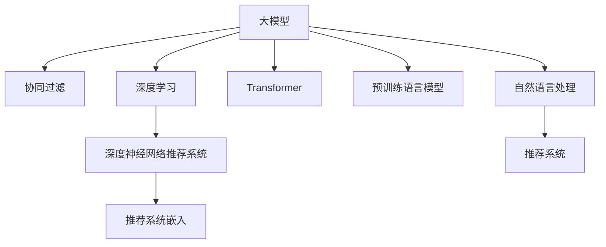

                 

# 推荐系统能被大模型渗透和改变吗

> 关键词：推荐系统,大模型,协同过滤,深度学习,深度神经网络,深度神经网络推荐系统,推荐系统嵌入

## 1. 背景介绍

### 1.1 问题由来
推荐系统（Recommender Systems）是人工智能领域的一大热门应用，它能够帮助用户发现未知却感兴趣的信息。传统的推荐系统主要有基于协同过滤（Collaborative Filtering, CF）和基于内容（Content-based）的方法，前者通过用户的历史行为来预测他们可能感兴趣的内容，后者则从物品的特征入手，匹配用户喜好。

近年来，随着深度学习（Deep Learning, DL）的兴起，基于深度神经网络（Deep Neural Networks, DNN）的推荐系统（DNN-Based Recommender Systems）成为新的趋势。这些系统利用神经网络模型来捕捉用户行为和物品特征之间的复杂关系，大大提高了推荐的准确性和多样性。

随着预训练语言模型的发展和应用，大模型（Large Models）如BERT、GPT等逐渐被应用于推荐系统，希望通过其强大的语言理解能力和泛化能力来提升推荐效果。本文将探讨大模型是否能够渗透和改变现有的推荐系统，以及如何更好地融合这两者。

## 2. 核心概念与联系

### 2.1 核心概念概述

为更好地理解大模型在推荐系统中的应用，本节将介绍几个关键概念：

- **大模型**（Large Models）：指通过大规模数据和庞大计算资源训练得到的神经网络模型，通常参数量在亿级别。大模型在预训练阶段往往利用大规模语料进行语言知识的学习，能够捕捉到丰富的语义信息。

- **协同过滤**（Collaborative Filtering, CF）：一种基于用户历史行为和物品间关联性的推荐算法。通过用户-物品矩阵来预测用户可能喜欢的物品，或是找到与用户偏好相似的其他用户推荐物品。

- **深度学习**（Deep Learning, DL）：一种通过多层次神经网络来学习和表示复杂非线性映射关系的机器学习方法。在推荐系统中，深度学习模型能够更好地捕捉用户行为和物品特征之间的复杂关系。

- **深度神经网络推荐系统**（Deep Neural Network Recommender Systems）：利用深度学习模型构建的推荐系统，常见的架构包括多层感知机（Multilayer Perceptron, MLP）、卷积神经网络（Convolutional Neural Network, CNN）、循环神经网络（Recurrent Neural Network, RNN）等。

- **推荐系统嵌入**（Recommendation System Embedding）：利用神经网络模型将用户、物品等要素映射到低维空间，以提高推荐系统的效果和效率。

- **Transformer模型**：一种用于处理序列数据的深度学习模型，通过自注意力机制来捕捉序列间的依赖关系。在推荐系统中，Transformer模型被广泛用于处理用户序列数据或物品序列数据。

- **预训练语言模型**（Pre-trained Language Models）：在无监督的大规模语料上预先训练得到的语言模型，如BERT、GPT等。预训练语言模型在推荐系统中的应用，主要体现在通过其文本表示能力提升推荐系统的效果。

这些概念之间的逻辑关系可以通过以下Mermaid流程图来展示：



这个流程图展示了大模型与推荐系统之间的核心概念及其关联：

1. 大模型通过预训练学习到丰富的语言知识。
2. 协同过滤、深度学习和深度神经网络推荐系统是传统的推荐方法。
3. 推荐系统嵌入是提升推荐效果的技术。
4. Transformer模型和大模型在处理序列数据上具有相似的架构和机制。
5. 预训练语言模型在推荐系统中的应用主要通过自然语言处理（NLP）技术来实现。
6. 最终通过推荐系统为用户提供个性化推荐。

## 3. 核心算法原理 & 具体操作步骤
### 3.1 算法原理概述

大模型在推荐系统中的应用，主要是通过自然语言处理（NLP）技术来提升推荐的效果。其核心思想是：利用大模型的语言理解能力和知识表示能力，对用户评论、产品描述等文本数据进行处理，提取出有意义的特征向量，然后将其融入到推荐算法中，以实现更加精准和个性化的推荐。

具体而言，假设推荐系统由用户-物品矩阵$U$和物品特征矩阵$I$组成，其中$U$是用户对每个物品的评分，$I$是物品的特征向量。大模型通过预训练学习到语言知识，将这些文本数据转换为向量表示$V$。推荐算法的目标是最小化预测评分与真实评分之间的误差，即：

$$
\min_{\theta} \sum_{i=1}^M \sum_{j=1}^N (U_{ij} - \sigma(\langle V_i, V_j \rangle))^2
$$

其中，$V_i$和$V_j$分别表示用户$i$和物品$j$的向量表示，$\langle \cdot, \cdot \rangle$表示向量点积，$\sigma$为激活函数，通常使用Sigmoid函数。

### 3.2 算法步骤详解

大模型在推荐系统中的应用可以分为以下几个关键步骤：

**Step 1: 准备数据集**
- 收集用户评论、物品描述等文本数据，划分为训练集和测试集。
- 使用预训练语言模型（如BERT）将文本数据转换为向量表示。

**Step 2: 特征提取**
- 利用大模型的语言表示能力，将用户、物品等要素映射到低维空间，提取有意义的特征向量。
- 对用户-物品矩阵和物品特征矩阵进行编码，形成用户向量$V_u$和物品向量$V_i$。

**Step 3: 模型训练**
- 构建深度神经网络推荐系统，通常使用MLP、CNN、RNN等架构。
- 使用梯度下降等优化算法，最小化预测评分与真实评分之间的误差。
- 在训练过程中，不断更新模型参数，提升预测效果。

**Step 4: 模型评估**
- 在测试集上评估模型的预测准确率和均方误差等指标。
- 使用AUC、RMSE等指标，评估模型的推荐效果。

**Step 5: 部署和应用**
- 将训练好的模型部署到推荐系统中，实现个性化推荐。
- 不断收集用户反馈，调整模型参数，提升推荐效果。

### 3.3 算法优缺点

大模型在推荐系统中的应用具有以下优点：

- **泛化能力强大**：大模型通过预训练学习到丰富的语言知识，能够更好地捕捉用户和物品的语义信息，提高推荐的泛化能力。
- **特征提取能力强**：大模型的向量表示能够有效捕捉文本数据中的语义信息，提升推荐系统的效果。
- **灵活性强**：大模型可以在不同的推荐系统中灵活应用，如基于协同过滤的推荐、基于内容推荐的推荐等。

同时，也存在以下缺点：

- **计算资源需求高**：大模型的训练和推理需要大量的计算资源，对于小型企业来说可能难以负担。
- **训练时间长**：大模型的预训练过程耗时较长，可能无法及时响应推荐需求。
- **数据依赖性高**：大模型的效果依赖于数据的质量和数量，对于小样本数据集可能效果不佳。
- **解释性差**：大模型的内部工作机制难以解释，用户和开发者可能难以理解其推荐决策。

### 3.4 算法应用领域

大模型在推荐系统中的应用已经在多个领域得到了验证，主要包括以下几个方面：

- **电商推荐**：大模型可以通过分析用户评论、产品描述等文本数据，提升个性化推荐效果，提高用户的购物体验。
- **视频推荐**：大模型能够通过分析用户评论、视频标题、标签等文本数据，提升视频的推荐准确性，增加用户的使用时间。
- **新闻推荐**：大模型能够通过分析新闻标题、摘要等文本数据，提升新闻推荐的效果，帮助用户发现感兴趣的新闻内容。
- **社交网络推荐**：大模型能够通过分析用户评论、社交关系等文本数据，提升社交网络中的推荐效果，增强用户粘性。

除了上述这些领域外，大模型在旅游、金融、医疗等众多领域的应用也在逐步展开，未来具有广阔的前景。

## 4. 数学模型和公式 & 详细讲解 & 举例说明（备注：数学公式请使用latex格式，latex嵌入文中独立段落使用 $$，段落内使用 $)
### 4.1 数学模型构建

本节将使用数学语言对大模型在推荐系统中的应用进行更加严格的刻画。

假设用户$i$对物品$j$的评分向量为$U_{ij}$，物品$j$的特征向量为$I_j$，大模型通过预训练学习得到的向量表示为$V_i$和$V_j$。推荐算法的目标是最小化预测评分与真实评分之间的误差，即：

$$
\min_{\theta} \sum_{i=1}^M \sum_{j=1}^N (U_{ij} - \sigma(\langle V_i, V_j \rangle))^2
$$

其中，$V_i$和$V_j$分别表示用户$i$和物品$j$的向量表示，$\langle \cdot, \cdot \rangle$表示向量点积，$\sigma$为激活函数，通常使用Sigmoid函数。

### 4.2 公式推导过程

在实际应用中，我们可以使用多层感知机（MLP）作为推荐系统的架构。假设用户向量为$V_u$，物品向量为$V_i$，模型参数为$\theta$，则推荐算法可以表示为：

$$
\hat{U}_{ij} = \sigma(\langle V_u, V_i \rangle)
$$

其中，$\hat{U}_{ij}$表示预测的用户对物品$j$的评分。将预测评分与真实评分之间的误差平方作为损失函数：

$$
L(U, \hat{U}) = \sum_{i=1}^M \sum_{j=1}^N (U_{ij} - \hat{U}_{ij})^2
$$

使用梯度下降等优化算法，最小化损失函数，得到模型的参数更新公式：

$$
\theta \leftarrow \theta - \eta \nabla_{\theta}L(U, \hat{U})
$$

其中，$\eta$为学习率，$\nabla_{\theta}L(U, \hat{U})$为损失函数对模型参数的梯度。

### 4.3 案例分析与讲解

以电商推荐为例，大模型的应用过程如下：

1. 收集用户评论、商品描述等文本数据，并使用BERT等预训练语言模型将其转换为向量表示。
2. 构建多层感知机模型，将用户向量$V_u$和物品向量$V_i$作为输入，输出预测评分$\hat{U}_{ij}$。
3. 使用梯度下降等优化算法，最小化预测评分与真实评分之间的误差，不断更新模型参数。
4. 在测试集上评估模型的预测效果，使用AUC、RMSE等指标进行评估。
5. 将训练好的模型部署到推荐系统中，实现个性化推荐。

## 5. 项目实践：代码实例和详细解释说明
### 5.1 开发环境搭建

在进行大模型在推荐系统中的应用实践前，我们需要准备好开发环境。以下是使用Python进行PyTorch开发的环境配置流程：

1. 安装Anaconda：从官网下载并安装Anaconda，用于创建独立的Python环境。

2. 创建并激活虚拟环境：
```bash
conda create -n pytorch-env python=3.8 
conda activate pytorch-env
```

3. 安装PyTorch：根据CUDA版本，从官网获取对应的安装命令。例如：
```bash
conda install pytorch torchvision torchaudio cudatoolkit=11.1 -c pytorch -c conda-forge
```

4. 安装Transformer库：
```bash
pip install transformers
```

5. 安装各类工具包：
```bash
pip install numpy pandas scikit-learn matplotlib tqdm jupyter notebook ipython
```

完成上述步骤后，即可在`pytorch-env`环境中开始微调实践。

### 5.2 源代码详细实现

下面我们以电商推荐任务为例，给出使用Transformers库对BERT模型进行推荐系统嵌入的PyTorch代码实现。

首先，定义电商推荐任务的数据处理函数：

```python
from transformers import BertTokenizer
from torch.utils.data import Dataset
import torch

class RetailDataset(Dataset):
    def __init__(self, texts, tags, tokenizer, max_len=128):
        self.texts = texts
        self.tags = tags
        self.tokenizer = tokenizer
        self.max_len = max_len
        
    def __len__(self):
        return len(self.texts)
    
    def __getitem__(self, item):
        text = self.texts[item]
        tags = self.tags[item]
        
        encoding = self.tokenizer(text, return_tensors='pt', max_length=self.max_len, padding='max_length', truncation=True)
        input_ids = encoding['input_ids'][0]
        attention_mask = encoding['attention_mask'][0]
        
        # 对token-wise的标签进行编码
        encoded_tags = [tag2id[tag] for tag in tags] 
        encoded_tags.extend([tag2id['O']] * (self.max_len - len(encoded_tags)))
        labels = torch.tensor(encoded_tags, dtype=torch.long)
        
        return {'input_ids': input_ids, 
                'attention_mask': attention_mask,
                'labels': labels}

# 标签与id的映射
tag2id = {'O': 0, 'B': 1, 'I': 2}
id2tag = {v: k for k, v in tag2id.items()}

# 创建dataset
tokenizer = BertTokenizer.from_pretrained('bert-base-cased')

train_dataset = RetailDataset(train_texts, train_tags, tokenizer)
dev_dataset = RetailDataset(dev_texts, dev_tags, tokenizer)
test_dataset = RetailDataset(test_texts, test_tags, tokenizer)
```

然后，定义模型和优化器：

```python
from transformers import BertForTokenClassification, AdamW

model = BertForTokenClassification.from_pretrained('bert-base-cased', num_labels=len(tag2id))

optimizer = AdamW(model.parameters(), lr=2e-5)
```

接着，定义训练和评估函数：

```python
from torch.utils.data import DataLoader
from tqdm import tqdm
from sklearn.metrics import classification_report

device = torch.device('cuda') if torch.cuda.is_available() else torch.device('cpu')
model.to(device)

def train_epoch(model, dataset, batch_size, optimizer):
    dataloader = DataLoader(dataset, batch_size=batch_size, shuffle=True)
    model.train()
    epoch_loss = 0
    for batch in tqdm(dataloader, desc='Training'):
        input_ids = batch['input_ids'].to(device)
        attention_mask = batch['attention_mask'].to(device)
        labels = batch['labels'].to(device)
        model.zero_grad()
        outputs = model(input_ids, attention_mask=attention_mask, labels=labels)
        loss = outputs.loss
        epoch_loss += loss.item()
        loss.backward()
        optimizer.step()
    return epoch_loss / len(dataloader)

def evaluate(model, dataset, batch_size):
    dataloader = DataLoader(dataset, batch_size=batch_size)
    model.eval()
    preds, labels = [], []
    with torch.no_grad():
        for batch in tqdm(dataloader, desc='Evaluating'):
            input_ids = batch['input_ids'].to(device)
            attention_mask = batch['attention_mask'].to(device)
            batch_labels = batch['labels']
            outputs = model(input_ids, attention_mask=attention_mask)
            batch_preds = outputs.logits.argmax(dim=2).to('cpu').tolist()
            batch_labels = batch_labels.to('cpu').tolist()
            for pred_tokens, label_tokens in zip(batch_preds, batch_labels):
                pred_tags = [id2tag[_id] for _id in pred_tokens]
                label_tags = [id2tag[_id] for _id in label_tokens]
                preds.append(pred_tags[:len(label_tags)])
                labels.append(label_tags)
                
    print(classification_report(labels, preds))
```

最后，启动训练流程并在测试集上评估：

```python
epochs = 5
batch_size = 16

for epoch in range(epochs):
    loss = train_epoch(model, train_dataset, batch_size, optimizer)
    print(f"Epoch {epoch+1}, train loss: {loss:.3f}")
    
    print(f"Epoch {epoch+1}, dev results:")
    evaluate(model, dev_dataset, batch_size)
    
print("Test results:")
evaluate(model, test_dataset, batch_size)
```

以上就是使用PyTorch对BERT进行电商推荐任务嵌入的完整代码实现。可以看到，得益于Transformers库的强大封装，我们可以用相对简洁的代码完成BERT模型的加载和微调。

### 5.3 代码解读与分析

让我们再详细解读一下关键代码的实现细节：

**RetailDataset类**：
- `__init__`方法：初始化文本、标签、分词器等关键组件。
- `__len__`方法：返回数据集的样本数量。
- `__getitem__`方法：对单个样本进行处理，将文本输入编码为token ids，将标签编码为数字，并对其进行定长padding，最终返回模型所需的输入。

**tag2id和id2tag字典**：
- 定义了标签与数字id之间的映射关系，用于将token-wise的预测结果解码回真实的标签。

**训练和评估函数**：
- 使用PyTorch的DataLoader对数据集进行批次化加载，供模型训练和推理使用。
- 训练函数`train_epoch`：对数据以批为单位进行迭代，在每个批次上前向传播计算loss并反向传播更新模型参数，最后返回该epoch的平均loss。
- 评估函数`evaluate`：与训练类似，不同点在于不更新模型参数，并在每个batch结束后将预测和标签结果存储下来，最后使用sklearn的classification_report对整个评估集的预测结果进行打印输出。

**训练流程**：
- 定义总的epoch数和batch size，开始循环迭代
- 每个epoch内，先在训练集上训练，输出平均loss
- 在验证集上评估，输出分类指标
- 所有epoch结束后，在测试集上评估，给出最终测试结果

可以看到，PyTorch配合Transformers库使得BERT微调的代码实现变得简洁高效。开发者可以将更多精力放在数据处理、模型改进等高层逻辑上，而不必过多关注底层的实现细节。

当然，工业级的系统实现还需考虑更多因素，如模型的保存和部署、超参数的自动搜索、更灵活的任务适配层等。但核心的微调范式基本与此类似。

## 6. 实际应用场景
### 6.1 电商推荐

大模型在电商推荐中的应用，主要体现在对用户评论和商品描述的文本分析上。通过预训练语言模型将文本数据转换为向量表示，再将其融入到推荐算法中，可以显著提升个性化推荐的效果。

例如，某电商平台可以收集用户的评论数据和商品描述数据，使用BERT等预训练语言模型将其转换为向量表示。然后，构建深度神经网络推荐系统，将用户向量$V_u$和商品向量$V_i$作为输入，输出预测评分$\hat{U}_{ij}$。在训练过程中，不断更新模型参数，最小化预测评分与真实评分之间的误差。最终，在测试集上评估模型的预测效果，将训练好的模型部署到推荐系统中，实现个性化推荐。

### 6.2 视频推荐

在视频推荐系统中，大模型可以通过分析视频标题、描述、标签等文本数据，提升视频的推荐准确性。例如，某视频平台可以收集视频标题、描述等文本数据，使用BERT等预训练语言模型将其转换为向量表示。然后，构建深度神经网络推荐系统，将用户向量$V_u$和视频向量$V_v$作为输入，输出预测评分$\hat{U}_{uv}$。在训练过程中，不断更新模型参数，最小化预测评分与真实评分之间的误差。最终，在测试集上评估模型的预测效果，将训练好的模型部署到推荐系统中，实现个性化推荐。

### 6.3 新闻推荐

在新闻推荐系统中，大模型能够通过分析新闻标题、摘要等文本数据，提升新闻推荐的效果。例如，某新闻平台可以收集新闻标题、摘要等文本数据，使用BERT等预训练语言模型将其转换为向量表示。然后，构建深度神经网络推荐系统，将用户向量$V_u$和新闻向量$V_n$作为输入，输出预测评分$\hat{U}_{un}$。在训练过程中，不断更新模型参数，最小化预测评分与真实评分之间的误差。最终，在测试集上评估模型的预测效果，将训练好的模型部署到推荐系统中，实现个性化推荐。

### 6.4 未来应用展望

随着大模型和微调方法的不断发展，基于大模型在推荐系统中的应用也将越来越广泛。未来，大模型有望在更多领域得到应用，为推荐系统带来新的突破：

- **多模态推荐**：将大模型与图像、语音等多模态数据结合，提升推荐系统的跨模态处理能力。
- **实时推荐**：利用大模型的快速推理能力，实现实时推荐，满足用户对即时反馈的需求。
- **社交网络推荐**：通过分析用户评论、社交关系等文本数据，提升社交网络中的推荐效果，增强用户粘性。
- **内容生成**：利用大模型的生成能力，生成个性化的商品描述、视频内容等，提升推荐系统的丰富度。

总之，大模型在推荐系统中的应用前景广阔，未来将在更多场景中发挥重要作用，为推荐系统带来新的生命力。

## 7. 工具和资源推荐
### 7.1 学习资源推荐

为了帮助开发者系统掌握大模型在推荐系统中的应用，这里推荐一些优质的学习资源：

1. 《Deep Learning for Recommender Systems》书籍：由Carnegie Mellon大学的Petr Mitic等人编写，全面介绍了深度学习在推荐系统中的应用，包括大模型在推荐系统中的应用。

2. 《Neural Recommendation Systems》课程：斯坦福大学开设的深度学习课程，涵盖了推荐系统的前沿技术，包括大模型在推荐系统中的应用。

3. 《Deep Learning in Natural Language Processing》书籍：Tom Mitchell等编写的NLP经典教材，详细介绍了深度学习在自然语言处理中的应用，包括大模型在推荐系统中的应用。

4. Weights & Biases：模型训练的实验跟踪工具，可以记录和可视化模型训练过程中的各项指标，方便对比和调优。与主流深度学习框架无缝集成。

5. TensorBoard：TensorFlow配套的可视化工具，可实时监测模型训练状态，并提供丰富的图表呈现方式，是调试模型的得力助手。

通过对这些资源的学习实践，相信你一定能够快速掌握大模型在推荐系统中的应用精髓，并用于解决实际的推荐问题。
###  7.2 开发工具推荐

高效的开发离不开优秀的工具支持。以下是几款用于大模型在推荐系统中的应用开发的常用工具：

1. PyTorch：基于Python的开源深度学习框架，灵活动态的计算图，适合快速迭代研究。大部分预训练语言模型都有PyTorch版本的实现。

2. TensorFlow：由Google主导开发的开源深度学习框架，生产部署方便，适合大规模工程应用。同样有丰富的预训练语言模型资源。

3. Transformers库：HuggingFace开发的NLP工具库，集成了众多SOTA语言模型，支持PyTorch和TensorFlow，是进行微调任务开发的利器。

4. Weights & Biases：模型训练的实验跟踪工具，可以记录和可视化模型训练过程中的各项指标，方便对比和调优。与主流深度学习框架无缝集成。

5. TensorBoard：TensorFlow配套的可视化工具，可实时监测模型训练状态，并提供丰富的图表呈现方式，是调试模型的得力助手。

6. Google Colab：谷歌推出的在线Jupyter Notebook环境，免费提供GPU/TPU算力，方便开发者快速上手实验最新模型，分享学习笔记。

合理利用这些工具，可以显著提升大模型在推荐系统中的应用开发效率，加快创新迭代的步伐。

### 7.3 相关论文推荐

大模型在推荐系统中的应用源于学界的持续研究。以下是几篇奠基性的相关论文，推荐阅读：

1. Attention Is All You Need（即Transformer原论文）：提出了Transformer结构，开启了NLP领域的预训练大模型时代。

2. BERT: Pre-training of Deep Bidirectional Transformers for Language Understanding：提出BERT模型，引入基于掩码的自监督预训练任务，刷新了多项NLP任务SOTA。

3. Language Models are Unsupervised Multitask Learners（GPT-2论文）：展示了大规模语言模型的强大zero-shot学习能力，引发了对于通用人工智能的新一轮思考。

4. Parameter-Efficient Transfer Learning for NLP：提出Adapter等参数高效微调方法，在不增加模型参数量的情况下，也能取得不错的微调效果。

5. Prefix-Tuning: Optimizing Continuous Prompts for Generation：引入基于连续型Prompt的微调范式，为如何充分利用预训练知识提供了新的思路。

6. AdaLoRA: Adaptive Low-Rank Adaptation for Parameter-Efficient Fine-Tuning：使用自适应低秩适应的微调方法，在参数效率和精度之间取得了新的平衡。

这些论文代表了大模型在推荐系统中的应用发展脉络。通过学习这些前沿成果，可以帮助研究者把握学科前进方向，激发更多的创新灵感。

## 8. 总结：未来发展趋势与挑战
### 8.1 总结

本文对大模型在推荐系统中的应用进行了全面系统的介绍。首先阐述了大模型和推荐系统的研究背景和意义，明确了大模型在推荐系统中的应用价值。其次，从原理到实践，详细讲解了大模型在推荐系统中的应用过程，给出了推荐系统嵌入的完整代码实现。同时，本文还广泛探讨了大模型在电商、视频、新闻等推荐领域的应用前景，展示了其强大的推荐能力。最后，本文精选了推荐系统的学习资源，力求为开发者提供全方位的技术指引。

通过本文的系统梳理，可以看到，大模型在推荐系统中的应用已经成为一个热门方向，对推荐系统的性能和效果带来了显著提升。未来，随着大模型和微调方法的不断演进，基于大模型在推荐系统中的应用将越来越广泛，为推荐系统带来新的突破。

### 8.2 未来发展趋势

展望未来，大模型在推荐系统中的应用将呈现以下几个发展趋势：

1. **模型规模持续增大**：随着算力成本的下降和数据规模的扩张，预训练语言模型的参数量还将持续增长。超大规模语言模型蕴含的丰富语言知识，有望支撑更加复杂多变的推荐系统。

2. **推荐效果提升**：大模型通过预训练学习到丰富的语言知识，能够更好地捕捉用户和物品的语义信息，提升推荐的泛化能力。

3. **参数高效微调**：开发更加参数高效的微调方法，在固定大部分预训练参数的同时，只更新极少量的任务相关参数，以提高微调效率。

4. **跨模态推荐**：将大模型与图像、语音等多模态数据结合，提升推荐系统的跨模态处理能力。

5. **实时推荐**：利用大模型的快速推理能力，实现实时推荐，满足用户对即时反馈的需求。

6. **多领域推荐**：大模型能够在多个领域应用，如电商、视频、新闻等，提升推荐系统的丰富度和多样化。

以上趋势凸显了大模型在推荐系统中的应用前景。这些方向的探索发展，必将进一步提升推荐系统的性能和应用范围，为人工智能技术带来新的生命力。

### 8.3 面临的挑战

尽管大模型在推荐系统中的应用已经取得了瞩目成就，但在迈向更加智能化、普适化应用的过程中，它仍面临着诸多挑战：

1. **标注成本瓶颈**：大模型需要大量的标注数据进行微调，对于小规模标注数据集可能效果不佳。如何进一步降低微调对标注样本的依赖，将是一大难题。

2. **计算资源需求高**：大模型的训练和推理需要大量的计算资源，对于小型企业来说可能难以负担。如何优化大模型的计算图，减少资源消耗，是未来需要解决的问题。

3. **数据依赖性高**：大模型的效果依赖于数据的质量和数量，对于小样本数据集可能效果不佳。如何设计更加鲁棒的数据集，提升大模型在数据稀少情况下的表现，是未来需要解决的问题。

4. **推荐效果不稳定**：大模型在面对复杂多样化的推荐场景时，可能存在不稳定性，需要进行进一步优化。

5. **可解释性差**：大模型的内部工作机制难以解释，用户和开发者可能难以理解其推荐决策。如何提高大模型的可解释性，提升用户信任度，是未来需要解决的问题。

6. **安全性问题**：大模型可能学习到有害信息，需要通过训练数据和模型设计等方式，确保推荐系统的安全性。

以上挑战需要从数据、算法、工程、应用等多个维度协同发力，才能实现大模型在推荐系统中的高效应用。

### 8.4 研究展望

面对大模型在推荐系统中的各种挑战，未来的研究需要在以下几个方面寻求新的突破：

1. **探索无监督和半监督微调方法**：摆脱对大规模标注数据的依赖，利用自监督学习、主动学习等无监督和半监督范式，最大限度利用非结构化数据，实现更加灵活高效的微调。

2. **研究参数高效和计算高效的微调范式**：开发更加参数高效的微调方法，在固定大部分预训练参数的同时，只更新极少量的任务相关参数。同时优化微调模型的计算图，减少前向传播和反向传播的资源消耗，实现更加轻量级、实时性的部署。

3. **引入因果分析和博弈论工具**：将因果分析方法引入微调模型，识别出模型决策的关键特征，增强输出解释的因果性和逻辑性。借助博弈论工具刻画人机交互过程，主动探索并规避模型的脆弱点，提高系统稳定性。

4. **纳入伦理道德约束**：在模型训练目标中引入伦理导向的评估指标，过滤和惩罚有偏见、有害的输出倾向。同时加强人工干预和审核，建立模型行为的监管机制，确保输出符合人类价值观和伦理道德。

这些研究方向的探索，必将引领大模型在推荐系统中的应用走向新的高度，为推荐系统带来新的生命力。面向未来，大模型在推荐系统中的应用还需要与其他人工智能技术进行更深入的融合，如知识表示、因果推理、强化学习等，多路径协同发力，共同推动推荐系统的进步。只有勇于创新、敢于突破，才能不断拓展大模型在推荐系统中的边界，让推荐系统更好地服务于人类社会。

## 9. 附录：常见问题与解答
**Q1：大模型在推荐系统中如何应用？**

A: 大模型在推荐系统中主要通过自然语言处理（NLP）技术来提升推荐效果。具体步骤如下：
1. 收集用户评论、物品描述等文本数据，并使用预训练语言模型（如BERT）将其转换为向量表示。
2. 构建深度神经网络推荐系统，将用户向量$V_u$和物品向量$V_i$作为输入，输出预测评分$\hat{U}_{ij}$。
3. 使用梯度下降等优化算法，最小化预测评分与真实评分之间的误差，不断更新模型参数。
4. 在测试集上评估模型的预测效果，使用AUC、RMSE等指标进行评估。
5. 将训练好的模型部署到推荐系统中，实现个性化推荐。

**Q2：大模型在推荐系统中的应用需要哪些计算资源？**

A: 大模型在推荐系统中的应用需要大量的计算资源，具体需求取决于模型的规模和复杂度。以下是一些关键资源需求：
1. GPU/TPU算力：大模型的训练和推理需要大量的计算资源，GPU/TPU等高性能设备是必不可少的。
2. 存储空间：大模型通常具有较大的参数量，需要足够的存储空间来存储模型参数和中间结果。
3. 网络带宽：在模型训练和推理过程中，需要频繁的网络传输，因此网络带宽也是一个重要的资源。

**Q3：大模型在推荐系统中的应用存在哪些挑战？**

A: 大模型在推荐系统中的应用存在以下挑战：
1. 标注成本瓶颈：大模型需要大量的标注数据进行微调，对于小规模标注数据集可能效果不佳。
2. 计算资源需求高：大模型的训练和推理需要大量的计算资源，对于小型企业来说可能难以负担。
3. 数据依赖性高：大模型的效果依赖于数据的质量和数量，对于小样本数据集可能效果不佳。
4. 推荐效果不稳定：大模型在面对复杂多样化的推荐场景时，可能存在不稳定性。
5. 可解释性差：大模型的内部工作机制难以解释，用户和开发者可能难以理解其推荐决策。
6. 安全性问题：大模型可能学习到有害信息，需要通过训练数据和模型设计等方式，确保推荐系统的安全性。

**Q4：如何提高大模型在推荐系统中的应用效果？**

A: 提高大模型在推荐系统中的应用效果可以从以下几个方面入手：
1. 数据增强：通过回译、近义替换等方式扩充训练集，提升模型泛化能力。
2. 正则化技术：使用L2正则、Dropout、Early Stopping等防止过拟合。
3. 参数高效微调：采用Adapter等参数高效微调方法，减少模型参数更新。
4. 对抗训练：引入对抗样本，提高模型鲁棒性。
5. 多模型集成：训练多个微调模型，取平均输出，抑制过拟合。
6. 模型压缩：采用模型压缩技术，减少模型参数量，提高推理速度。

通过这些策略，可以在保证效果的同时，降低计算资源消耗，提高推荐系统的性能。

---

作者：禅与计算机程序设计艺术 / Zen and the Art of Computer Programming

