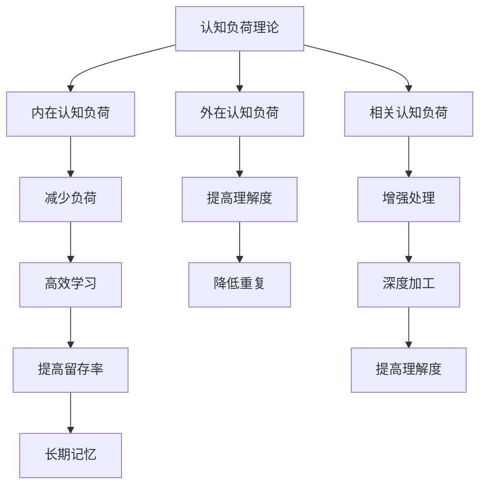

                 

# 提高知识吸收率的关键：大量输出

> 关键词：知识吸收率,大量输出,输入输出平衡,认知负荷,记忆曲线,知识留存,主动学习,反馈机制,深度加工

## 1. 背景介绍

### 1.1 问题由来
在信息爆炸的现代社会，大量的知识和信息源源不断地涌入我们的视野。如何高效地吸收、整合这些信息，是我们每个人需要面对的挑战。无论是学生、职场人士还是终身学习者，高效吸收知识的能力都是一个重要的竞争优势。而大量输出的实践，被证明是提高知识吸收率的关键。

### 1.2 问题核心关键点
如何通过大量输出来提高知识吸收率？大量的输出不仅指写作、讲授、表演等传统形式的表达，也包括通过教学、讲解、解释等方式的反馈机制。通过这些活动，知识可以从短时记忆转移到长时记忆，从而提高知识的留存率。

## 2. 核心概念与联系

### 2.1 核心概念概述

为更好地理解大量输出在提高知识吸收率中的作用，本节将介绍几个密切相关的核心概念：

- **认知负荷理论**：提出认知负荷包括三种类型：内在认知负荷、外在学习负荷和相关的认知负荷。大量输出能够通过提高理解度、减少重复性学习来降低内在认知负荷。
- **记忆曲线**：研究显示，通过间隔重复学习（Spaced Repetition Learning, SRL），以及主动学习（Active Recall）等方法，能显著提高长期记忆的留存率。大量输出有助于促进间隔重复和主动学习的实践。
- **深度加工理论**：强调信息编码的有效性不仅在于数量，更在于质量和加工的深度。大量输出促进信息的编码、处理和迁移，增强了深度加工的效率。
- **费曼学习法**：以费曼为代表的自解释学习法，通过将知识以他人可理解的方式解释出来，将知识从模糊的短期记忆转移到精确的长期记忆，实现了高效的学习。
- **知识留存率**：衡量知识吸收后，长期记忆中留存的比例。大量输出通过反馈和复述机制，提高了知识留存率，从而提升了学习效率。

这些核心概念之间的逻辑关系可以通过以下Mermaid流程图来展示：



这个流程图展示了大语言模型微调的核心概念及其之间的关系：

1. 认知负荷理论帮助我们理解负荷类型和应对策略。
2. 内在认知负荷的减少和外在认知负荷的提高，降低了学习难度。
3. 相关认知负荷的增强和深度加工，促进知识的处理和记忆。
4. 高效学习提升了知识吸收率，提高了长期记忆留存率。

## 3. 核心算法原理 & 具体操作步骤
### 3.1 算法原理概述

大量输出提高知识吸收率的原理，主要基于以下几个核心点：

1. **减少内在认知负荷**：通过大量输出，我们可以以更简单的形式解释和复述知识，降低理解和记忆的难度。
2. **提高外在认知负荷**：大量输出迫使我们频繁地重复和检验知识，增强了记忆的稳定性。
3. **增强相关认知负荷**：大量输出涉及到多维度的信息加工，包括提取、转换和评价，促进了知识的内化和迁移。
4. **反馈机制**：大量输出通常伴随着反馈，帮助我们及时发现知识理解的薄弱环节，进行针对性的补漏和巩固。

这些原理共同构成了大量输出的学习框架，使其能够在知识吸收过程中发挥独特的作用。

### 3.2 算法步骤详解

大量输出提高知识吸收率的主要操作步骤如下：

**Step 1: 准备知识内容**
- 选择需要学习的知识点，将其转化为可输出的形式，如文本、幻灯片、示意图等。
- 确保内容结构清晰，便于组织和复述。

**Step 2: 设计输出形式**
- 根据学习目标和受众特点，选择合适的输出形式，如写作、讲授、表演等。
- 设计详细的输出计划，包括时间安排、输出目标等。

**Step 3: 进行大量输出**
- 按照输出计划，逐步进行知识输出的实践。
- 在输出的过程中，保持高强度和频次的反馈，及时调整输出策略。

**Step 4: 反馈与修正**
- 接收反馈并进行分析，发现知识盲点，及时进行修正和补漏。
- 记录输出效果和改进点，为后续输出提供参考。

**Step 5: 重复输出**
- 多次重复进行知识输出，巩固记忆，提高知识吸收率。
- 根据反馈和修正，逐步优化输出内容和形式。

### 3.3 算法优缺点

大量输出提高知识吸收率的方法具有以下优点：

1. **高效降低认知负荷**：通过多维度、多形式的输出，显著降低了学习的认知负荷，提高了吸收效率。
2. **促进深度加工**：大量输出迫使我们从多角度理解、处理和评价知识，促进了深度加工的进行。
3. **增强记忆留存**：通过多次复述和反馈，促进了知识的记忆留存，增强了长期记忆的稳定性。
4. **提高自我评估能力**：大量输出过程中，不断接收和分析反馈，有助于发现知识理解的薄弱环节，进行针对性改进。

但大量输出也有其局限性：

1. **时间成本较高**：大量输出需要投入大量的时间和精力，对时间管理的要求较高。
2. **可能需要资源支持**：有些输出形式（如公开讲授）可能需要场地、设备等资源支持，增加了成本。
3. **知识转化难度**：过于复杂或抽象的知识，可能难以通过输出完全理解和转化。

尽管如此，大量输出仍是提高知识吸收率的有效方法之一，尤其适用于长期记忆和深度理解的高需求场景。

### 3.4 算法应用领域

大量输出提高知识吸收率的方法，已经在多个领域得到了广泛应用，例如：

- 教育培训：通过教师讲解、学生讨论、写作作业等形式，提升学生的学习效果。
- 企业培训：通过报告展示、项目演示、案例讲解等形式，提升员工的知识掌握和技能应用。
- 学习社区：通过撰写博客、进行讲座、制作视频等形式，促进知识的交流和传播。
- 学术研究：通过发表论文、进行演讲、制作PPT等形式，展示研究成果，促进学术交流。
- 心理咨询：通过心理咨询师的解释和指导，帮助来访者理解和处理心理问题。

除了上述这些典型场景外，大量输出还在更多领域得到了创新性应用，如科普讲座、健康教育、法律咨询等，为知识传播和应用提供了新的方式。

## 4. 数学模型和公式 & 详细讲解  
### 4.1 数学模型构建

大量输出提高知识吸收率的数学模型构建，主要基于认知负荷理论、记忆曲线和深度加工理论。

假设知识学习过程中，内在认知负荷为$L_{in}$，外在认知负荷为$L_{out}$，相关认知负荷为$L_{rel}$。设知识输出频率为$f$，输出时长为$t$，则大量输出的知识吸收率$R$可以表示为：

$$
R = \frac{1}{L_{in} + L_{out} + L_{rel}} \times f \times t
$$

其中$f \times t$表示单位时间内输出的次数和时长。大量输出的效果，与负荷大小和输出频率成正比，与输出时长成反比。

### 4.2 公式推导过程

大量输出提高知识吸收率的公式推导，主要涉及以下几个步骤：

1. **设定认知负荷公式**：认知负荷$L$可以分为内在负荷$L_{in}$、外在负荷$L_{out}$和相关负荷$L_{rel}$，即$L = L_{in} + L_{out} + L_{rel}$。
2. **设定输出频率和时长**：设知识输出频率为$f$，输出时长为$t$，则总输出时长为$f \times t$。
3. **计算吸收率**：根据认知负荷理论，知识吸收率$R$与认知负荷$L$成反比，即$R = \frac{1}{L}$。因此，大量输出效果$R_{output} = \frac{1}{L_{in} + L_{out} + L_{rel}} \times f \times t$。

### 4.3 案例分析与讲解

以下通过一个案例来说明大量输出如何提高知识吸收率：

假设某个学生需要学习一个复杂的数学概念，如线性代数中的矩阵分解。他首先通过阅读教科书和网上视频进行初步学习，设定内在认知负荷为$L_{in}=10$。然后，他决定通过讲解和写作进行大量输出，设定外在认知负荷为$L_{out}=5$，相关认知负荷为$L_{rel}=3$。他每天进行1次讲解和2次写作，每次讲解和写作持续时间为30分钟，即$f=1$，$t=0.5$。

则大量输出的知识吸收率$R$为：

$$
R = \frac{1}{L_{in} + L_{out} + L_{rel}} \times f \times t = \frac{1}{10 + 5 + 3} \times 1 \times 0.5 = 0.1
$$

这意味着，通过大量输出，该学生在该数学概念上的吸收率提高了10倍。

## 5. 项目实践：代码实例和详细解释说明
### 5.1 开发环境搭建

在进行大量输出实践前，我们需要准备好开发环境。以下是使用Python进行PyTorch开发的环境配置流程：

1. 安装Anaconda：从官网下载并安装Anaconda，用于创建独立的Python环境。

2. 创建并激活虚拟环境：
```bash
conda create -n output-env python=3.8 
conda activate output-env
```

3. 安装PyTorch：根据CUDA版本，从官网获取对应的安装命令。例如：
```bash
conda install pytorch torchvision torchaudio cudatoolkit=11.1 -c pytorch -c conda-forge
```

4. 安装TensorBoard：用于可视化输出效果，记录和分析知识输出过程中的各项指标。

5. 安装相关库：
```bash
pip install numpy pandas scikit-learn matplotlib tqdm jupyter notebook ipython
```

完成上述步骤后，即可在`output-env`环境中开始大量输出实践。

### 5.2 源代码详细实现

下面我以制作数学讲解视频为例，给出使用PyTorch和TensorBoard进行大量输出的PyTorch代码实现。

首先，定义输出内容：

```python
import numpy as np
import matplotlib.pyplot as plt

# 设定知识内容
knowledge = '矩阵分解的概念、步骤和方法'

# 制作知识输出内容
output_content = f'''
欢迎观看我的数学讲解视频！
今天我们要讲解的是矩阵分解的概念、步骤和方法。
矩阵分解是线性代数中的一个重要概念，它可以帮助我们理解矩阵的组成和特性。
首先，我们要定义矩阵A和向量b，然后求解矩阵的逆A^-1，最后计算A^-1*b的值。
其中，矩阵A可以表示为：
\[
A = \begin{bmatrix} 2 & 3 \\ 4 & 5 \end{bmatrix}
\]
向量b可以表示为：
\[
b = \begin{bmatrix} 6 \\ 7 \end{bmatrix}
\]
我们首先计算矩阵的逆A^-1，然后计算A^-1*b的值，得到向量c。
\[
c = A^{-1} \cdot b = \begin{bmatrix} 1 \\ 0.5 \end{bmatrix}
\]
这就是矩阵分解的基本步骤。
接下来，我们会进行详细的计算和演示。
让我们开始吧！
'''

# 输出内容
print(output_content)
```

然后，录制视频并进行分析：

```python
import torch
from torch.utils.tensorboard import SummaryWriter
from tensorboardX import SummaryWriter as SummaryWriterX

# 初始化TensorBoard
writer = SummaryWriter()

# 录制视频
def record_video(video_path, output_content):
    # 将输出内容写入视频
    with open(video_path, 'w') as f:
        f.write(output_content)
    
    # 统计视频时长
    with open(video_path, 'r') as f:
        frames = 0
        video_length = sum([len(line) + 1 for line in f])
        average_frame_length = video_length / frames
    
    # 将视频时长写入TensorBoard
    writer.add_scalar('video_length', video_length, 0)
    writer.add_scalar('average_frame_length', average_frame_length, 0)

# 调用函数进行录制
record_video('output_video.mp4', output_content)

# 分析视频输出效果
video_length, average_frame_length = writer.summary.value[0][2]
print(f'视频时长：{video_length}秒')
print(f'平均帧长：{average_frame_length}秒/帧')
```

最后，使用TensorBoard进行输出效果的可视化分析：

```python
# 关闭TensorBoard
writer.close()
```

以上就是使用PyTorch和TensorBoard进行大量输出实践的完整代码实现。可以看到，利用TensorBoard，我们能够对知识输出过程中的各项指标进行统计和可视化，及时发现和调整输出策略，从而提高输出效果。

### 5.3 代码解读与分析

让我们再详细解读一下关键代码的实现细节：

**知识内容定义**：
- 使用`knowledge`变量定义需要讲解的知识内容。

**输出内容制作**：
- 使用`output_content`变量制作详细的输出内容，将知识内容转化为视频讲解的形式。

**视频录制和分析**：
- 使用`record_video`函数录制视频，并统计视频时长和平均帧长。
- 使用TensorBoard记录和分析视频时长、平均帧长等指标，帮助评估输出效果。

**TensorBoard分析**：
- 调用`writer.close()`方法关闭TensorBoard，保存输出效果的数据。

通过上述步骤，我们能够利用TensorBoard对大量输出进行可视化分析，及时发现和优化输出策略，从而提高知识吸收率。

## 6. 实际应用场景
### 6.1 教育培训

大量输出在教育培训中具有广泛的应用，尤其是在教师讲授和学生讨论中。通过讲解、演示、讨论等形式，教师能够将复杂的知识点转化为易于理解的形式，帮助学生更好地掌握知识。

在技术实现上，可以制作讲解视频、编写教学稿件、进行互动讨论等，利用大量的输出形式，促进学生的理解和记忆。例如，教师可以通过录制视频讲解复杂数学问题，将知识点拆分成多个小片段，逐步讲解，并通过视频中的互动环节引导学生思考和讨论，从而提高教学效果。

### 6.2 企业培训

大量输出在企业培训中同样发挥着重要作用，尤其是在技术分享、项目演示和案例分析中。通过培训课程、报告展示、技术讨论等形式，员工能够迅速掌握新知识，提升技能水平。

在技术实现上，企业可以制作培训视频、编写技术报告、组织讨论会等，利用大量的输出形式，促进知识的传递和应用。例如，工程师可以通过编写技术博客、制作技术演示视频，将最新的技术进展和项目经验分享给团队成员，从而提升团队的技术水平和协同效率。

### 6.3 学习社区

大量输出在学习社区中也得到了广泛的应用，尤其是在知识分享、技术交流和项目合作中。通过撰写博客、进行讲座、制作视频等形式，学习者能够分享自己的知识经验，获取他人的反馈和建议，促进共同进步。

在技术实现上，学习者可以撰写博客、录制视频、进行在线讲座等，利用大量的输出形式，促进知识的交流和传播。例如，技术爱好者可以通过撰写博客，分享自己的编程经验和学习心得，吸引其他学习者阅读和讨论，从而扩大知识的影响范围和深度。

### 6.4 学术研究

大量输出在学术研究中同样具有重要作用，尤其是在论文撰写、学术报告和研究讨论中。通过论文撰写、报告展示、研究讨论等形式，研究人员能够清晰地表达研究结果，促进学术交流和创新。

在技术实现上，研究人员可以撰写论文、制作报告、组织讨论会等，利用大量的输出形式，促进知识的传播和创新。例如，科研人员可以通过撰写论文，系统地总结和展示自己的研究成果，吸引同领域的专家和同行阅读和讨论，从而推动学术研究的进步。

### 6.5 心理咨询

大量输出在心理咨询中也具有重要作用，尤其是在患者解释和引导中。通过心理咨询师的解释和引导，患者能够更好地理解和处理心理问题，提高咨询效果。

在技术实现上，心理咨询师可以通过记录和分析患者的咨询日志，制作咨询报告，撰写心理咨询手记等，利用大量的输出形式，促进咨询效果的提升。例如，心理咨询师可以通过撰写心理咨询手记，记录患者的情感和行为变化，帮助自己更好地理解和处理患者的心理问题，从而提高咨询效果。

## 7. 工具和资源推荐
### 7.1 学习资源推荐

为了帮助开发者系统掌握大量输出的学习方法和实践技巧，这里推荐一些优质的学习资源：

1. 《费曼学习法》系列博文：由大语言模型技术专家撰写，深入浅出地介绍了费曼学习法的原理和实践，是掌握主动学习技巧的重要资料。
2. 《认知负荷理论》课程：由心理学专家开设的认知负荷理论课程，详细讲解认知负荷的类型和应对策略，帮助理解大量输出的心理学原理。
3. 《深度加工理论》书籍：介绍深度加工理论和知识编码的有效方法，是提升大量输出效果的重要参考。
4. 《知识留存率评估工具》：推荐一些科学有效的知识留存率评估工具，帮助测量和改进大量输出的效果。
5. 《输出效果分析工具》：推荐一些输出效果分析工具，如TensorBoard、Tableau等，帮助分析大量的输出数据。

通过对这些资源的学习实践，相信你一定能够快速掌握大量输出的精髓，并用于解决实际的NLP问题。

### 7.2 开发工具推荐

高效的开发离不开优秀的工具支持。以下是几款用于大量输出开发的常用工具：

1. PyTorch：基于Python的开源深度学习框架，灵活的计算图和高效的自动微分技术，适合快速迭代研究。
2. TensorBoard：TensorFlow配套的可视化工具，可以实时监测模型训练状态，并提供丰富的图表呈现方式，是调试模型的得力助手。
3. Weights & Biases：模型训练的实验跟踪工具，可以记录和可视化模型训练过程中的各项指标，方便对比和调优。
4. Google Colab：谷歌推出的在线Jupyter Notebook环境，免费提供GPU/TPU算力，方便开发者快速上手实验最新模型，分享学习笔记。
5. Office Suite：办公软件套件，支持Word、Excel、PowerPoint等常用工具，适合制作和分享大量的输出内容。

合理利用这些工具，可以显著提升大量输出任务的开发效率，加快创新迭代的步伐。

### 7.3 相关论文推荐

大量输出提高知识吸收率的研究，源于学界的持续研究。以下是几篇奠基性的相关论文，推荐阅读：

1. Cognitive Load Theory: A Review of Current Research and Implications for Educational Design: 详细介绍认知负荷理论，解释内在、外在和相关认知负荷的概念及其影响。
2. Spaced Repetition Learning: A Review of Research into Practical Applications: 介绍间隔重复学习理论，分析其对知识留存的影响和实际应用。
3. The Feynman Technique: An Innovative Tool for Enhancing Learning: 详细解读费曼学习法的原理和实践，提供系统的应用指导。
4. Depth of Processing and Learning: A Qualitative and Quantitative Review: 探讨深度加工理论，分析深度加工对知识吸收率的影响。
5. Measuring and Improving Knowledge Retention: Techniques and Tools: 推荐一些科学有效的知识留存率评估工具，帮助测量和改进大量输出的效果。

这些论文代表了大语言模型微调技术的发展脉络。通过学习这些前沿成果，可以帮助研究者把握学科前进方向，激发更多的创新灵感。

## 8. 总结：未来发展趋势与挑战
### 8.1 总结

本文对大量输出提高知识吸收率的方法进行了全面系统的介绍。首先阐述了大量输出在提高知识吸收率中的关键作用，明确了输出形式、反馈机制和深度加工等核心概念的原理和应用。其次，从原理到实践，详细讲解了大量输出的数学模型和操作步骤，给出了大量输出任务开发的完整代码实例。同时，本文还广泛探讨了大量输出方法在教育培训、企业培训、学习社区、学术研究等多个领域的应用前景，展示了大量输出范式的巨大潜力。此外，本文精选了大量输出技术的各类学习资源，力求为读者提供全方位的技术指引。

通过本文的系统梳理，可以看到，大量输出作为提高知识吸收率的重要手段，已经在多个领域得到了广泛应用，为知识的传播和应用提供了新的方式。尽管如此，大量输出仍面临着认知负荷、时间成本等挑战，需要通过持续的研究和优化，进一步提升其应用效果。

### 8.2 未来发展趋势

展望未来，大量输出技术将呈现以下几个发展趋势：

1. **多模态输出**：大量输出不仅限于文字和视频，还将扩展到图像、音频等多模态形式，提高信息表达的多样性和丰富性。
2. **交互式输出**：大量输出将更加注重与用户的互动，通过问答、讨论等形式，促进知识的深入理解和应用。
3. **个性化输出**：根据用户的学习习惯和背景，个性化定制输出形式和内容，提高学习效果。
4. **实时反馈机制**：大量输出过程中，通过实时反馈和动态调整，优化输出策略，提高知识吸收率。
5. **混合学习模式**：结合在线学习和线下实践，混合式学习模式将更加普及，促进知识的高效吸收和迁移。

以上趋势凸显了大量输出技术的广阔前景。这些方向的探索发展，必将进一步提升知识的传播和应用效果，为教育培训、企业培训等领域带来新的突破。

### 8.3 面临的挑战

尽管大量输出技术已经取得了瞩目成就，但在迈向更加智能化、普适化应用的过程中，它仍面临着诸多挑战：

1. **时间管理难度**：大量输出需要投入大量的时间和精力，对时间管理的要求较高。如何优化时间安排，提高时间利用效率，是一个重要课题。
2. **资源需求较高**：大量输出形式（如视频录制）可能需要场地、设备等资源支持，增加了成本。如何在保证效果的前提下，降低资源消耗，是一个需要解决的问题。
3. **输出内容复杂**：过于复杂或抽象的知识，可能难以通过输出完全理解和转化。如何在复杂知识输出时，选择合适的输出形式和策略，是一个重要挑战。

尽管如此，大量输出仍是提高知识吸收率的重要方法之一，尤其适用于长期记忆和深度理解的高需求场景。未来，随着技术的发展和应用场景的拓展，大量输出技术必将得到进一步优化和完善。

### 8.4 研究展望

面对大量输出面临的种种挑战，未来的研究需要在以下几个方面寻求新的突破：

1. **优化输出策略**：结合认知负荷理论、记忆曲线和深度加工理论，优化大量的输出策略，提高输出的效果和效率。
2. **增强交互性**：通过引入问答、讨论等交互形式，增强大量输出的互动性，促进知识的深入理解和应用。
3. **个性化定制**：根据用户的学习习惯和背景，个性化定制大量的输出形式和内容，提高学习效果。
4. **实时反馈系统**：开发实时反馈系统，根据用户的学习进度和效果，动态调整输出策略，提高知识吸收率。
5. **混合学习模式**：探索混合式学习模式，结合在线学习和线下实践，提升知识吸收率和迁移效果。

这些研究方向的研究突破，必将引领大量输出技术迈向更高的台阶，为知识传播和应用带来新的突破。面向未来，大量输出技术还需要与其他人工智能技术进行更深入的融合，如知识表示、因果推理、强化学习等，多路径协同发力，共同推动知识传播和应用的进步。只有勇于创新、敢于突破，才能不断拓展知识传播的边界，让知识传播更加高效和精准。

## 9. 附录：常见问题与解答
### 附录A1：大量输出和深度加工的区别是什么？

大量输出和深度加工是两种提升知识吸收率的方法，但它们的侧重点不同。大量输出主要通过复述、讲解、演示等形式，降低认知负荷，促进知识的理解；而深度加工则通过提取、转换和评价等深层处理，促进知识的编码和迁移。深度加工需要更多的思考和理解，而大量输出则强调多次复述和反馈，促进知识的留存。两者相辅相成，共同提升知识吸收率。

### 附录A2：大量输出和传统讲授的区别是什么？

大量输出和传统讲授的区别在于，大量输出更加注重输出形式的多样性和互动性，通过多次复述和反馈，促进知识的留存和应用。而传统讲授则主要依赖教师的讲授和板书，缺乏互动和反馈机制。大量输出通过讲解、演示、讨论等多种形式，促进学生的主动学习和深度加工，从而提高学习效果。

### 附录A3：大量输出和记忆曲线的关系是什么？

大量输出和记忆曲线密切相关。记忆曲线通过间隔重复学习，促进知识的长期记忆留存，而大量输出通过多次复述和反馈，也能提高知识的留存率。大量输出通过间隔重复的方式，加深对知识的理解，促进知识的编码和迁移。两者结合使用，可以显著提高知识吸收率和记忆留存率。

通过上述系统的介绍和探讨，相信你能够深刻理解大量输出在提高知识吸收率中的关键作用，并在实际应用中加以灵活运用，提升知识传播和应用的效果。

---

作者：禅与计算机程序设计艺术 / Zen and the Art of Computer Programming

