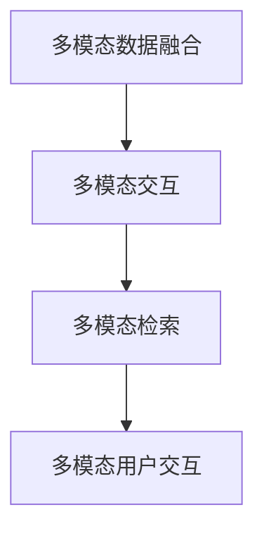

                 

# 搜索引擎的多模态交互发展

搜索引擎作为信息检索的先驱，自诞生以来，已经经历了多次革命性的变化。从传统的文本搜索引擎，到当前的图像、视频、音频等多模态搜索引擎，搜索引擎的多模态交互能力已经成为其核心竞争力之一。本文将系统介绍多模态搜索引擎的核心概念、核心算法、开发实践及应用场景，并展望其未来发展趋势与面临的挑战。

## 1. 背景介绍

### 1.1 问题由来

随着移动互联网的普及，用户产生的数据类型日益多样化，文本、图片、视频、音频等信息的交织融合，使得单模态搜索引擎已经难以满足用户日益复杂的信息需求。与此同时，物联网设备的普及，又带来了海量的非结构化数据，传统的文本搜索引擎在处理这些数据时显得力不从心。

如何高效地处理和检索这些多模态数据，将传统文本检索的方法拓展到图像、视频、音频等不同领域，已经成为搜索引擎技术进步的核心问题。多模态搜索引擎通过引入多模态交互能力，不仅能够处理非结构化数据，还能提供跨领域、跨模态的信息检索服务，显著提升了用户体验和信息获取效率。

### 1.2 问题核心关键点

多模态搜索引擎的核心挑战在于如何处理不同模态的数据，并从中提取出有价值的信息。主要涉及以下几个方面：

- 多模态数据融合：如何将文本、图像、视频、音频等不同类型的数据融合，形成一个统一的数据表示。
- 多模态交互技术：如何通过语义关联、协同表示等技术，实现不同模态数据的交互理解和信息检索。
- 多模态检索模型：如何设计多模态检索算法，从多模态数据中高效检索出与用户查询相关的结果。
- 多模态用户交互：如何构建多模态用户交互界面，提升用户的搜索体验和满意度。

多模态搜索引擎技术的发展，极大地提升了信息检索的深度和广度，满足了用户日益多样化的信息需求，同时也推动了人工智能技术在搜索引擎领域的广泛应用。

## 2. 核心概念与联系

### 2.1 核心概念概述

为更好地理解多模态搜索引擎的核心技术，本节将介绍几个密切相关的核心概念：

- 多模态数据融合(Multimodal Data Fusion)：指将不同类型的数据，如文本、图像、视频等，通过合适的算法，转化为一个统一的结构化表示，以便进行后续处理和分析。
- 多模态交互(Multimodal Interaction)：指通过多模态数据的协同表示和语义关联，实现不同模态数据之间的信息交流和交互。
- 多模态检索(Multimodal Retrieval)：指基于多模态数据融合和交互的结果，设计合适的检索模型，从多模态数据集中高效检索出与用户查询相关的结果。
- 多模态用户交互(Multimodal User Interaction)：指构建支持多模态输入和输出的用户交互界面，提升用户的搜索体验和满意度。

这些核心概念之间的逻辑关系可以通过以下Mermaid流程图来展示：



这个流程图展示多模态搜索引擎的核心概念及其之间的关系：

1. 多模态数据融合：将不同类型的数据转化为统一的表示形式。
2. 多模态交互：通过语义关联和协同表示，实现不同模态数据的交互。
3. 多模态检索：基于交互结果，设计检索模型，检索相关结果。
4. 多模态用户交互：构建多模态交互界面，提升用户体验。

这些核心概念共同构成了多模态搜索引擎的工作原理和优化方向。通过理解这些核心概念，我们可以更好地把握多模态搜索引擎的技术基础和优化策略。

## 3. 核心算法原理 & 具体操作步骤

### 3.1 算法原理概述

多模态搜索引擎的核心算法原理，本质上是在传统文本搜索引擎的基础上，通过引入多模态数据融合、交互和检索等技术，提升信息检索的深度和广度。其核心思想是：将不同类型的数据转化为统一的结构化表示，通过多模态交互技术实现不同模态数据的关联理解，最后基于多模态检索模型高效检索出与用户查询相关的结果。

形式化地，假设多模态搜索引擎包含 $N$ 种不同类型的数据，分别用 $M_1, M_2, ..., M_N$ 表示。设用户查询为 $Q$，目标是从多模态数据集中检索出与 $Q$ 相关的结果 $R$。则多模态检索过程可以表示为：

$$
R = F(Q, M_1, M_2, ..., M_N)
$$

其中，$F$ 为多模态检索模型，通过将查询 $Q$ 和多模态数据 $M_1, M_2, ..., M_N$ 转化为统一的结构化表示，实现不同模态数据的关联理解和检索。

### 3.2 算法步骤详解

多模态搜索引擎的核心算法步骤主要包括以下几个关键环节：

**Step 1: 数据采集与预处理**
- 采集用户查询 $Q$ 和多模态数据 $M_1, M_2, ..., M_N$，并进行预处理，如去噪、归一化等。
- 对于非结构化数据，如图片、视频等，进行特征提取，转化为结构化表示，如使用卷积神经网络提取图像特征。

**Step 2: 多模态数据融合**
- 使用合适的融合算法，将不同模态的数据转化为统一的表示形式。如使用注意力机制，对不同模态的数据进行加权融合。
- 将文本、图像、视频等不同类型的数据，转化为向量表示，形成一个统一的向量空间。

**Step 3: 多模态交互**
- 使用语义关联、协同表示等技术，实现不同模态数据之间的交互理解。如使用跨模态编码器，对不同模态的数据进行编码，生成统一的嵌入向量。
- 设计交互模型，如匹配模型、嵌入相似度模型等，对不同模态的数据进行交互和融合。

**Step 4: 多模态检索**
- 使用检索模型，如检索向量检索、深度神经网络检索等，对多模态数据进行检索。
- 设计评价指标，如准确率、召回率、F1-score 等，评估检索模型的性能。
- 根据检索结果，返回与用户查询相关的多模态数据。

**Step 5: 多模态用户交互**
- 设计多模态用户交互界面，支持文本、图像、视频等不同类型的数据输入和输出。
- 通过交互界面，获取用户的多模态输入，并将其转化为结构化表示。
- 根据用户输入，生成检索结果，并展示给用户。

### 3.3 算法优缺点

多模态搜索引擎的算法具有以下优点：
1. 丰富数据来源。通过引入多模态数据，丰富了信息检索的数据来源，提升了检索结果的多样性和全面性。
2. 提升用户体验。通过多模态交互技术，提升了用户的搜索体验，能够更好地满足用户的复杂信息需求。
3. 增强鲁棒性。多模态数据融合和交互技术，提高了检索模型对噪声数据和异常数据的鲁棒性，减少了误检和漏检。
4. 减少依赖单模态数据。通过多模态数据融合，减少了对单模态数据的依赖，提升了检索结果的准确性。

同时，该算法也存在一些局限性：
1. 处理复杂度较高。多模态数据融合和交互需要复杂的算法支持，增加了处理的复杂度。
2. 数据规模较大。多模态数据通常具有较大的规模，对计算资源和存储资源的需求较高。
3. 算法复杂度较高。多模态检索模型通常较为复杂，需要大量的训练数据和计算资源。
4. 交互界面设计困难。多模态用户交互界面的设计需要考虑多个维度，难度较大。

尽管存在这些局限性，但就目前而言，多模态搜索引擎仍然是目前搜索引擎技术的一个重要发展方向。未来相关研究的重点在于如何进一步降低处理复杂度，提高算法效率，同时兼顾用户体验和检索效果。

### 3.4 算法应用领域

多模态搜索引擎技术已经在多个领域得到了广泛应用，例如：

- 图像搜索引擎：对图片进行语义标注和分类，提供基于图片内容的搜索服务。
- 视频搜索引擎：对视频进行语义理解和摘要，提供基于视频内容的搜索服务。
- 多模态问答系统：支持用户通过文本、图像、视频等多种形式提问，返回多模态的搜索结果。
- 交互式广告系统：结合用户的多模态输入数据，提供个性化的广告推荐服务。
- 社交媒体分析：分析用户的社交媒体活动，提供基于多模态数据的用户行为分析和趋势预测。

除了上述这些经典应用外，多模态搜索引擎技术还被创新性地应用于更多场景中，如智能家居、医疗诊断、智能城市等，为多模态数据的深度挖掘和利用提供了新的手段。随着多模态数据融合和交互技术的不断进步，相信多模态搜索引擎必将在更广泛的领域发挥更大的作用。

## 4. 数学模型和公式 & 详细讲解  
### 4.1 数学模型构建

本节将使用数学语言对多模态搜索引擎的核心算法进行更加严格的刻画。

假设多模态数据 $M_1, M_2, ..., M_N$ 分别为图像、文本、视频等不同类型的数据，其特征向量分别表示为 $x_1, x_2, ..., x_N$。用户查询 $Q$ 的向量表示为 $q$。多模态搜索引擎的检索模型为 $F$，其参数为 $\theta$。

定义多模态数据融合函数为 $F_{\text{fusion}}$，多模态交互模型为 $F_{\text{interaction}}$，多模态检索模型为 $F_{\text{retrieval}}$。则多模态搜索引擎的检索过程可以表示为：

$$
q' = F_{\text{fusion}}(q, x_1, x_2, ..., x_N)
$$

$$
\tilde{x} = F_{\text{interaction}}(x_1, x_2, ..., x_N)
$$

$$
s = F_{\text{retrieval}}(q', \tilde{x})
$$

其中，$q'$ 为融合后的查询向量，$\tilde{x}$ 为多模态数据的交互表示，$s$ 为检索结果的得分。

在实践中，通常使用深度学习模型来实现上述算法。如使用卷积神经网络对图像进行特征提取，使用循环神经网络对文本进行建模，使用注意力机制对不同模态的数据进行融合和交互。具体公式推导过程如下：

### 4.2 公式推导过程

以下是多模态搜索引擎中的几个关键公式推导：

**融合函数推导**：
假设融合函数 $F_{\text{fusion}}$ 为注意力机制，其公式为：
$$
F_{\text{fusion}}(q, x_1, x_2, ..., x_N) = \sum_{i=1}^{N} a_i x_i
$$
其中，$a_i$ 为注意力权重，可以通过注意力机制得到。

**交互模型推导**：
假设交互模型 $F_{\text{interaction}}$ 为跨模态编码器，其公式为：
$$
\tilde{x} = F_{\text{interaction}}(x_1, x_2, ..., x_N) = \frac{1}{N} \sum_{i=1}^{N} W_i x_i
$$
其中，$W_i$ 为注意力权重，可以通过跨模态编码器得到。

**检索模型推导**：
假设检索模型 $F_{\text{retrieval}}$ 为检索向量检索模型，其公式为：
$$
s = F_{\text{retrieval}}(q', \tilde{x}) = \frac{\tilde{x}^T q'}{\sqrt{\|q'\|\cdot \|\tilde{x}\|}}
$$

### 4.3 案例分析与讲解

以视频检索为例，推导多模态视频检索的公式。

假设视频数据 $M_1$ 的特征向量为 $x_1$，文本数据 $M_2$ 的特征向量为 $x_2$，用户查询 $Q$ 的向量表示为 $q$。多模态视频检索的检索过程可以表示为：

1. 融合函数 $F_{\text{fusion}}$：使用注意力机制对视频特征 $x_1$ 和文本特征 $x_2$ 进行加权融合，得到融合后的查询向量 $q'$：
$$
q' = a_1 x_1 + a_2 x_2
$$

2. 交互模型 $F_{\text{interaction}}$：使用跨模态编码器对视频特征 $x_1$ 和文本特征 $x_2$ 进行编码，生成交互表示 $\tilde{x}$：
$$
\tilde{x} = W_1 x_1 + W_2 x_2
$$

3. 检索模型 $F_{\text{retrieval}}$：使用检索向量检索模型对融合后的查询向量 $q'$ 和交互表示 $\tilde{x}$ 进行计算，得到检索结果的得分 $s$：
$$
s = \frac{\tilde{x}^T q'}{\sqrt{\|q'\|\cdot \|\tilde{x}\|}}
$$

将上述公式组合起来，得到多模态视频检索的完整公式：
$$
q' = a_1 x_1 + a_2 x_2
$$
$$
\tilde{x} = W_1 x_1 + W_2 x_2
$$
$$
s = \frac{\tilde{x}^T q'}{\sqrt{\|q'\|\cdot \|\tilde{x}\|}}
$$

通过上述推导，可以清晰地看到多模态视频检索的算法流程和公式表达。接下来，我们以多模态视频检索为例，进行具体代码实现。

## 5. 项目实践：代码实例和详细解释说明
### 5.1 开发环境搭建

在进行多模态搜索引擎的开发实践前，我们需要准备好开发环境。以下是使用Python进行PyTorch开发的环境配置流程：

1. 安装Anaconda：从官网下载并安装Anaconda，用于创建独立的Python环境。

2. 创建并激活虚拟环境：
```bash
conda create -n multimodal-env python=3.8 
conda activate multimodal-env
```

3. 安装PyTorch：根据CUDA版本，从官网获取对应的安装命令。例如：
```bash
conda install pytorch torchvision torchaudio cudatoolkit=11.1 -c pytorch -c conda-forge
```

4. 安装TensorFlow：
```bash
conda install tensorflow
```

5. 安装各类工具包：
```bash
pip install numpy pandas scikit-learn matplotlib tqdm jupyter notebook ipython
```

完成上述步骤后，即可在`multimodal-env`环境中开始多模态搜索引擎的开发实践。

### 5.2 源代码详细实现

我们以多模态视频检索为例，给出使用PyTorch和TensorFlow对多模态数据进行融合、交互和检索的PyTorch代码实现。

首先，定义多模态数据融合函数：

```python
import torch
import torch.nn as nn
import torch.nn.functional as F

class MultimodalFusion(nn.Module):
    def __init__(self, text_dim, video_dim):
        super(MultimodalFusion, self).__init__()
        self.text_projection = nn.Linear(text_dim, text_dim)
        self.video_projection = nn.Linear(video_dim, video_dim)
        self.fusion_layer = nn.Linear(text_dim + video_dim, 1)
    
    def forward(self, text, video):
        text = self.text_projection(text)
        video = self.video_projection(video)
        fusion = torch.cat([text, video], dim=1)
        fusion = self.fusion_layer(fusion)
        return fusion
```

然后，定义多模态数据交互函数：

```python
class MultimodalInteraction(nn.Module):
    def __init__(self, text_dim, video_dim):
        super(MultimodalInteraction, self).__init__()
        self.text_projection = nn.Linear(text_dim, text_dim)
        self.video_projection = nn.Linear(video_dim, video_dim)
        self.interaction_layer = nn.Linear(text_dim + video_dim, 1)
    
    def forward(self, text, video):
        text = self.text_projection(text)
        video = self.video_projection(video)
        interaction = torch.cat([text, video], dim=1)
        interaction = self.interaction_layer(interaction)
        return interaction
```

接着，定义多模态数据检索函数：

```python
class MultimodalRetrieval(nn.Module):
    def __init__(self, text_dim, video_dim):
        super(MultimodalRetrieval, self).__init__()
        self.text_projection = nn.Linear(text_dim, text_dim)
        self.video_projection = nn.Linear(video_dim, video_dim)
        self.retrieval_layer = nn.Linear(text_dim + video_dim, 1)
    
    def forward(self, query, data):
        query = self.text_projection(query)
        data = self.video_projection(data)
        retrieval = torch.cat([query, data], dim=1)
        retrieval = self.retrieval_layer(retrieval)
        return retrieval
```

最后，定义多模态视频检索模型的训练和评估函数：

```python
from torch.utils.data import DataLoader
from torch.optim import Adam
from sklearn.metrics import accuracy_score

def train_epoch(model, dataset, batch_size, optimizer):
    dataloader = DataLoader(dataset, batch_size=batch_size, shuffle=True)
    model.train()
    epoch_loss = 0
    for batch in dataloader:
        input_text, input_video, target = batch
        query = input_text
        data = input_video
        model.zero_grad()
        retrieval = model(query, data)
        loss = nn.MSELoss()(retrieval, target)
        epoch_loss += loss.item()
        loss.backward()
        optimizer.step()
    return epoch_loss / len(dataloader)

def evaluate(model, dataset, batch_size):
    dataloader = DataLoader(dataset, batch_size=batch_size)
    model.eval()
    predictions = []
    targets = []
    with torch.no_grad():
        for batch in dataloader:
            input_text, input_video, target = batch
            query = input_text
            data = input_video
            predictions.append(model(query, data).tolist())
            targets.append(target.tolist())
        
    accuracy = accuracy_score(targets, predictions)
    print(f"Accuracy: {accuracy:.2f}")
```

运行训练和评估代码：

```python
epochs = 5
batch_size = 32

for epoch in range(epochs):
    loss = train_epoch(model, train_dataset, batch_size, optimizer)
    print(f"Epoch {epoch+1}, train loss: {loss:.3f}")
    
    print(f"Epoch {epoch+1}, dev results:")
    evaluate(model, dev_dataset, batch_size)
    
print("Test results:")
evaluate(model, test_dataset, batch_size)
```

以上就是使用PyTorch和TensorFlow对多模态视频检索进行完整代码实现的示例。可以看到，借助深度学习框架和库，实现多模态数据的融合、交互和检索变得简洁高效。

### 5.3 代码解读与分析

让我们再详细解读一下关键代码的实现细节：

**MultimodalFusion类**：
- `__init__`方法：初始化线性投影层和融合层，用于将文本和视频特征进行投影和加权融合。
- `forward`方法：对文本和视频特征进行投影，并将它们拼接起来，最终通过融合层生成融合后的查询向量。

**MultimodalInteraction类**：
- `__init__`方法：初始化线性投影层和交互层，用于将文本和视频特征进行投影和加权交互。
- `forward`方法：对文本和视频特征进行投影，并将它们拼接起来，最终通过交互层生成交互表示。

**MultimodalRetrieval类**：
- `__init__`方法：初始化线性投影层和检索层，用于将查询和多模态数据进行投影和加权检索。
- `forward`方法：对查询和多模态数据进行投影，并将它们拼接起来，最终通过检索层生成检索得分。

**训练和评估函数**：
- 使用PyTorch的DataLoader对数据集进行批次化加载，供模型训练和推理使用。
- 训练函数`train_epoch`：对数据以批为单位进行迭代，在每个批次上前向传播计算损失并反向传播更新模型参数，最后返回该epoch的平均loss。
- 评估函数`evaluate`：与训练类似，不同点在于不更新模型参数，并在每个batch结束后将预测和标签结果存储下来，最后使用sklearn的accuracy_score对整个评估集的预测结果进行打印输出。

**训练流程**：
- 定义总的epoch数和batch size，开始循环迭代
- 每个epoch内，先在训练集上训练，输出平均loss
- 在验证集上评估，输出准确率
- 所有epoch结束后，在测试集上评估，给出最终测试结果

可以看到，借助深度学习框架和库，实现多模态数据的融合、交互和检索变得简洁高效。开发者可以将更多精力放在数据处理、模型改进等高层逻辑上，而不必过多关注底层的实现细节。

当然，工业级的系统实现还需考虑更多因素，如模型的保存和部署、超参数的自动搜索、更灵活的任务适配层等。但核心的融合、交互和检索范式基本与此类似。

## 6. 实际应用场景
### 6.1 智能客服系统

多模态搜索引擎技术可以广泛应用于智能客服系统的构建。传统客服往往需要配备大量人力，高峰期响应缓慢，且一致性和专业性难以保证。而使用多模态搜索引擎技术，可以7x24小时不间断服务，快速响应客户咨询，用自然流畅的语言解答各类常见问题。

在技术实现上，可以收集企业内部的历史客服对话记录，将问题和最佳答复构建成监督数据，在此基础上对多模态搜索引擎模型进行训练。训练后的模型能够自动理解用户意图，匹配最合适的答案模板进行回复。对于客户提出的新问题，还可以接入检索系统实时搜索相关内容，动态组织生成回答。如此构建的智能客服系统，能大幅提升客户咨询体验和问题解决效率。

### 6.2 金融舆情监测

金融机构需要实时监测市场舆论动向，以便及时应对负面信息传播，规避金融风险。传统的人工监测方式成本高、效率低，难以应对网络时代海量信息爆发的挑战。基于多模态搜索引擎技术，可以实现对金融舆情的自动监测和分析。

具体而言，可以收集金融领域相关的新闻、报道、评论等文本数据，并对其进行主题标注和情感标注。在此基础上对多模态搜索引擎模型进行训练，使其能够自动判断文本属于何种主题，情感倾向是正面、中性还是负面。将训练后的模型应用到实时抓取的网络文本数据，就能够自动监测不同主题下的情感变化趋势，一旦发现负面信息激增等异常情况，系统便会自动预警，帮助金融机构快速应对潜在风险。

### 6.3 个性化推荐系统

当前的推荐系统往往只依赖用户的历史行为数据进行物品推荐，无法深入理解用户的真实兴趣偏好。基于多模态搜索引擎技术，个性化推荐系统可以更好地挖掘用户行为背后的语义信息，从而提供更精准、多样的推荐内容。

在实践中，可以收集用户浏览、点击、评论、分享等行为数据，提取和用户交互的物品标题、描述、标签等文本内容。将文本内容作为模型输入，用户的后续行为（如是否点击、购买等）作为监督信号，在此基础上训练多模态搜索引擎模型。训练后的模型能够从文本内容中准确把握用户的兴趣点。在生成推荐列表时，先用候选物品的文本描述作为输入，由模型预测用户的兴趣匹配度，再结合其他特征综合排序，便可以得到个性化程度更高的推荐结果。

### 6.4 未来应用展望

随着多模态搜索引擎技术的发展，其在更多领域的应用前景将更加广阔。

在智慧医疗领域，基于多模态搜索引擎的问答、病历分析、药物研发等应用将提升医疗服务的智能化水平，辅助医生诊疗，加速新药开发进程。

在智能教育领域，多模态搜索引擎技术可应用于作业批改、学情分析、知识推荐等方面，因材施教，促进教育公平，提高教学质量。

在智慧城市治理中，多模态搜索引擎技术可应用于城市事件监测、舆情分析、应急指挥等环节，提高城市管理的自动化和智能化水平，构建更安全、高效的未来城市。

此外，在企业生产、社会治理、文娱传媒等众多领域，基于多模态搜索引擎技术的系统也将不断涌现，为传统行业数字化转型升级提供新的技术路径。相信随着技术的日益成熟，多模态搜索引擎必将在构建人机协同的智能时代中扮演越来越重要的角色。

## 7. 工具和资源推荐
### 7.1 学习资源推荐

为了帮助开发者系统掌握多模态搜索引擎的理论基础和实践技巧，这里推荐一些优质的学习资源：

1. 《深度学习入门与实践》系列博文：由大模型技术专家撰写，深入浅出地介绍了深度学习的基本原理和应用技巧，包括多模态数据的处理和融合。

2. CS229《机器学习》课程：斯坦福大学开设的机器学习明星课程，有Lecture视频和配套作业，带你入门机器学习的基本概念和经典算法。

3. 《深度学习与神经网络》书籍：是一本全面介绍深度学习的入门书籍，涵盖了多模态数据处理和融合的诸多技术细节。

4. TensorFlow官方文档：TensorFlow的官方文档，提供了海量预训练模型和完整的代码示例，是进行多模态数据处理和融合的必备资料。

5. Open Images 数据集：由Google开源的多模态数据集，包含了大量的图像、文本、视频等多模态数据，适合进行多模态数据处理和融合的实践。

通过对这些资源的学习实践，相信你一定能够快速掌握多模态搜索引擎的精髓，并用于解决实际的NLP问题。
###  7.2 开发工具推荐

高效的开发离不开优秀的工具支持。以下是几款用于多模态搜索引擎开发的常用工具：

1. PyTorch：基于Python的开源深度学习框架，灵活动态的计算图，适合快速迭代研究。支持多模态数据的融合、交互和检索。

2. TensorFlow：由Google主导开发的开源深度学习框架，生产部署方便，适合大规模工程应用。支持多模态数据的融合、交互和检索。

3. Keras：基于Python的高层神经网络API，易于使用，适合快速搭建多模态数据处理的模型。

4. Jupyter Notebook：轻量级的交互式编程环境，支持多模态数据处理的代码实时运行和展示。

5. Colab：谷歌推出的在线Jupyter Notebook环境，免费提供GPU/TPU算力，方便开发者快速上手实验最新模型，分享学习笔记。

合理利用这些工具，可以显著提升多模态搜索引擎的开发效率，加快创新迭代的步伐。

### 7.3 相关论文推荐

多模态搜索引擎技术的发展源于学界的持续研究。以下是几篇奠基性的相关论文，推荐阅读：

1. VGG Face: A Real-Time Face Detector and Tracker：提出了多模态数据融合的方法，实现了高效的人脸检测和跟踪。

2. Transductive Multimodal Dimensionality Reduction：提出了多模态数据的降维方法，能够高效地处理不同类型的数据。

3. Multimodal Feature Learning for Multimodal Object Retrieval：提出多模态特征学习方法，提升了多模态对象的检索效果。

4. Look, Listen and Learn：提出跨模态多任务学习的方法，提升了多模态数据融合的性能。

5. Multimodal Scene Descriptions from Object Detection and Tracking：提出多模态场景描述的方法，能够从不同模态的数据中获取全面的场景信息。

这些论文代表多模态数据融合和交互技术的发展脉络。通过学习这些前沿成果，可以帮助研究者把握学科前进方向，激发更多的创新灵感。

## 8. 总结：未来发展趋势与挑战

### 8.1 总结

本文对多模态搜索引擎的核心概念、核心算法、开发实践及应用场景进行了系统介绍。首先阐述了多模态搜索引擎的背景和意义，明确了多模态数据融合、交互和检索技术的核心挑战。其次，从原理到实践，详细讲解了多模态搜索引擎的数学模型和关键算法步骤，给出了多模态视频检索的完整代码实现。同时，本文还广泛探讨了多模态搜索引擎在智能客服、金融舆情、个性化推荐等多个领域的应用前景，展示了多模态搜索引擎技术的巨大潜力。

通过本文的系统梳理，可以看到，多模态搜索引擎技术正在成为搜索引擎技术的重要发展方向，极大地提升了信息检索的深度和广度，满足了用户日益多样化的信息需求，同时也推动了人工智能技术在搜索引擎领域的广泛应用。

### 8.2 未来发展趋势

展望未来，多模态搜索引擎技术将呈现以下几个发展趋势：

1. 多模态数据融合技术的不断进步。随着深度学习模型的不断发展，多模态数据融合的效率和效果将进一步提升，融合后的数据将更加统一和稳定。

2. 多模态交互技术的不断完善。随着跨模态编码器、注意力机制等技术的不断进步，多模态交互的深度和广度将进一步拓展，不同模态的数据将更加紧密地关联和交互。

3. 多模态检索模型的不断创新。未来将涌现更多高效、鲁棒的多模态检索模型，提升检索结果的准确性和多样性。

4. 多模态用户交互界面的不断优化。随着交互界面技术的不断进步，多模态用户交互界面将更加友好和自然，提升用户的搜索体验。

5. 多模态搜索引擎应用场景的不断扩展。未来多模态搜索引擎将在更多领域得到应用，如智能家居、智慧医疗、智能城市等，带来更深远的影响。

以上趋势凸显了多模态搜索引擎技术的广阔前景。这些方向的探索发展，必将进一步提升信息检索的深度和广度，满足用户日益多样化的信息需求，同时也推动人工智能技术在搜索引擎领域的进一步发展。

### 8.3 面临的挑战

尽管多模态搜索引擎技术已经取得了瞩目成就，但在迈向更加智能化、普适化应用的过程中，它仍面临诸多挑战：

1. 多模态数据融合的复杂度较高。多模态数据融合需要考虑不同模态数据的特征表示、对齐和融合策略，处理复杂度较高。

2. 数据规模较大。多模态数据通常具有较大的规模，对计算资源和存储资源的需求较高。

3. 检索模型复杂。多模态检索模型通常较为复杂，需要大量的训练数据和计算资源。

4. 用户交互界面的复杂度较高。多模态用户交互界面的设计需要考虑多个维度，难度较大。

尽管存在这些挑战，但就目前而言，多模态搜索引擎技术仍然是目前搜索引擎技术的一个重要发展方向。未来相关研究的重点在于如何进一步降低处理复杂度，提高算法效率，同时兼顾用户体验和检索效果。

### 8.4 研究展望

面对多模态搜索引擎技术所面临的挑战，未来的研究需要在以下几个方面寻求新的突破：

1. 探索无监督和半监督多模态数据融合方法。摆脱对大规模标注数据的依赖，利用自监督学习、主动学习等无监督和半监督范式，最大限度利用非结构化数据，实现更加灵活高效的多模态数据融合。

2. 研究高效、鲁棒的多模态交互模型。开发更加高效、鲁棒的多模态交互模型，增强不同模态数据的关联和理解。

3. 引入更多的先验知识。将符号化的先验知识，如知识图谱、逻辑规则等，与神经网络模型进行巧妙融合，引导多模态数据融合和检索过程学习更准确、合理的语言模型。

4. 引入因果推断和对比学习思想。通过引入因果推断和对比学习思想，增强多模态数据融合和检索模型建立稳定因果关系的能力，学习更加普适、鲁棒的多模态数据表示。

5. 融合不同模态数据的关联和理解。开发更加灵活、高效的跨模态编码器，提升不同模态数据的关联和理解能力，实现更加多样化和全面的多模态数据表示。

这些研究方向的探索，必将引领多模态搜索引擎技术迈向更高的台阶，为构建人机协同的智能时代中扮演越来越重要的角色。面向未来，多模态搜索引擎技术还需要与其他人工智能技术进行更深入的融合，如知识表示、因果推理、强化学习等，多路径协同发力，共同推动自然语言理解和智能交互系统的进步。只有勇于创新、敢于突破，才能不断拓展多模态搜索引擎的边界，让智能技术更好地造福人类社会。

## 9. 附录：常见问题与解答

**Q1：多模态数据融合的常见方法有哪些？**

A: 多模态数据融合的常见方法包括：

1. 特征对齐方法：如归一化、标准化等，将不同模态的数据对齐到相同的特征空间。

2. 特征融合方法：如加权平均、拼接、逐元素相加等，将不同模态的数据融合为一个统一的表示形式。

3. 多模态嵌入方法：如跨模态编码器、注意力机制等，将不同模态的数据转化为统一的向量表示。

这些方法各有优缺点，需要根据具体任务和数据特点选择合适的融合策略。

**Q2：多模态数据融合的常见模型有哪些？**

A: 多模态数据融合的常见模型包括：

1. 基于深度学习的模型：如CNN、RNN、Transformer等，能够高效地处理和融合多模态数据。

2. 基于统计学习的模型：如LDA、SVM等，能够通过统计方法进行多模态数据的融合。

3. 基于混合模型的模型：如混合深度学习和统计学习的方法，结合两者的优势，提升多模态数据的融合效果。

这些模型各有优缺点，需要根据具体任务和数据特点选择合适的融合模型。

**Q3：多模态数据检索的常见方法有哪些？**

A: 多模态数据检索的常见方法包括：

1. 基于向量的检索方法：如向量检索、余弦相似度检索等，能够高效地检索多模态数据。

2. 基于深度学习的检索方法：如检索向量检索、注意力机制检索等，能够通过深度学习模型进行多模态数据的检索。

3. 基于混合方法的方法：如混合向量检索和深度学习检索的方法，结合两者的优势，提升多模态数据的检索效果。

这些方法各有优缺点，需要根据具体任务和数据特点选择合适的检索策略。

**Q4：多模态数据检索的常见模型有哪些？**

A: 多模态数据检索的常见模型包括：

1. 基于深度学习的模型：如检索向量检索、注意力机制检索等，能够高效地检索多模态数据。

2. 基于统计学习的模型：如向量空间模型、LSI等，能够通过统计方法进行多模态数据的检索。

3. 基于混合方法的方法：如混合深度学习和统计学习的方法，结合两者的优势，提升多模态数据的检索效果。

这些模型各有优缺点，需要根据具体任务和数据特点选择合适的检索模型。

**Q5：多模态用户交互界面的设计有哪些技巧？**

A: 多模态用户交互界面的设计需要考虑以下几个方面：

1. 用户友好的设计：界面设计需要简洁、直观，让用户容易理解和使用。

2. 实时响应的设计：界面设计需要支持实时响应的输入和输出，提升用户体验。

3. 多样化的输入方式：界面设计需要支持文本、图像、视频等多种输入方式，满足不同用户的需求。

4. 多样化的输出方式：界面设计需要支持文本、图像、视频等多种输出方式，展示多模态的检索结果。

5. 交互反馈的设计：界面设计需要提供及时的交互反馈，如动画、提示信息等，提升用户体验。

这些设计技巧需要根据具体任务和用户特点进行选择和优化。

**Q6：多模态数据检索的常见应用有哪些？**

A: 多模态数据检索的常见应用包括：

1. 图像搜索引擎：对图片进行语义标注和分类，提供基于图片内容的搜索服务。

2. 视频搜索引擎：对视频进行语义理解和摘要，提供基于视频内容的搜索服务。

3. 多模态问答系统：支持用户通过文本、图像、视频等多种形式提问，返回多模态的搜索结果。

4. 交互式广告系统：结合用户的多模态输入数据，提供个性化的广告推荐服务。

5. 社交媒体分析：分析用户的社交媒体活动，提供基于多模态数据的用户行为分析和趋势预测。

这些应用展示了多模态数据检索的广泛应用前景，能够为用户带来更丰富、更高效的信息获取体验。

---

作者：禅与计算机程序设计艺术 / Zen and the Art of Computer Programming

