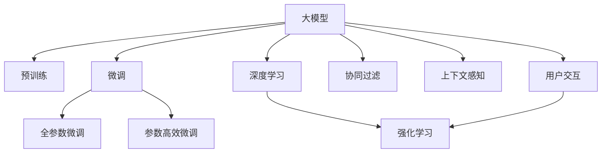

                 

# 搜索推荐系统中的AI大模型算法创新

> 关键词：搜索推荐系统, 人工智能大模型, 算法创新, 推荐引擎, 搜索引擎

## 1. 背景介绍

在互联网信息爆炸的时代，搜索引擎和推荐系统成为了用户获取信息的主要工具。然而，随着用户需求的多样化和个性化，传统基于规则或简单机器学习的搜索引擎和推荐系统已无法满足用户的需求。基于人工智能大模型的搜索推荐系统应运而生，并逐渐成为行业的主流。

大模型（Large Model）是指包含大量参数、可以处理复杂自然语言任务的人工智能模型。这些模型通常基于大规模无标签文本语料进行预训练，获得了广泛的语言知识。在实际应用中，通过对其微调（Fine-Tuning），可以迅速适应特定任务，提升搜索引擎和推荐系统的精度和用户体验。

大模型在搜索推荐系统中的应用，使推荐结果更加个性化，搜索体验更加智能。以BERT、GPT-3、T5等为代表的大模型，已经成为构建先进搜索引擎和推荐系统的基石。

## 2. 核心概念与联系

### 2.1 核心概念概述

为了更好地理解AI大模型在搜索推荐系统中的应用，首先需要了解几个关键概念：

- 搜索推荐系统：通过算法为用户推荐信息或搜索结果的系统，包括搜索引擎、推荐引擎、智能客服等。
- 人工智能大模型：基于大规模语料预训练，具备广泛语言知识和推理能力的模型，如BERT、GPT-3、T5等。
- 预训练（Pre-training）：在无标签数据上进行的自监督学习，使模型学习到通用的语言表示。
- 微调（Fine-Tuning）：在大模型基础上，通过少量标注数据进行有监督学习，适应特定任务。
- 深度学习（Deep Learning）：基于神经网络进行复杂数据处理的机器学习技术。
- 强化学习（Reinforcement Learning）：通过奖惩机制训练模型，使其在特定环境中做出最优决策。
- 协同过滤（Collaborative Filtering）：通过分析用户行为和物品特征，推荐用户可能感兴趣的新物品。
- 上下文感知（Context-Aware）：考虑用户行为、环境、时间等多维上下文信息，提供更加精准的推荐。
- 用户交互（User Interaction）：与用户的直接或间接交互，用于收集反馈和优化推荐系统。

这些核心概念之间存在紧密联系，共同构成了搜索推荐系统的技术基础。

### 2.2 核心概念原理和架构的 Mermaid 流程图



此流程图展示了大模型在搜索推荐系统中的核心概念及其关联。大模型通过预训练获得通用语言表示，通过微调适应特定任务，结合深度学习、强化学习、协同过滤、上下文感知和用户交互等技术，实现更加精准的搜索推荐。

## 3. 核心算法原理 & 具体操作步骤

### 3.1 算法原理概述

基于大模型的搜索推荐系统，其核心算法原理可以概括为以下几个步骤：

1. **预训练**：使用大规模无标签文本数据对大模型进行自监督学习，学习通用的语言表示。
2. **微调**：将预训练模型作为初始化参数，使用少量标注数据进行有监督学习，适应特定任务。
3. **融合算法**：将微调后的模型与深度学习、强化学习、协同过滤、上下文感知和用户交互等技术结合，提供更加个性化和精准的搜索结果。

### 3.2 算法步骤详解

以搜索引擎中的推荐系统为例，详细讲解基于大模型的推荐算法步骤如下：

1. **用户输入**：用户输入搜索关键词或查询语句。
2. **预处理**：对用户输入进行分词、去除停用词等预处理。
3. **查询嵌入**：使用预训练的大模型对查询进行编码，得到查询向量。
4. **文档嵌入**：对每个搜索结果文档，使用大模型进行编码，得到文档向量。
5. **相似度计算**：计算查询向量与每个文档向量的余弦相似度或欧氏距离。
6. **排序**：根据相似度计算结果对搜索结果进行排序，推荐给用户。

在推荐系统中，常见的融合算法包括：

- **深度学习融合**：通过多层神经网络对查询和文档向量进行特征融合，提高相似度计算精度。
- **强化学习融合**：通过奖惩机制训练模型，选择最有可能被用户点击的文档进行推荐。
- **协同过滤融合**：分析用户历史行为和相似用户行为，推荐相似物品。
- **上下文感知融合**：考虑用户地理位置、时间等信息，提供动态推荐。
- **用户交互融合**：通过用户反馈调整推荐策略，不断优化推荐效果。

### 3.3 算法优缺点

基于大模型的搜索推荐系统具有以下优点：

- **精度高**：大模型学习到丰富的语言知识，能够更准确地理解查询和文档。
- **扩展性强**：可以通过微调适应各种任务，如问答、分类、生成等。
- **个性化推荐**：结合深度学习、强化学习等技术，提供更加精准的个性化推荐。

同时，该方法也存在一些缺点：

- **计算成本高**：大模型需要大量的计算资源进行预训练和微调，资源消耗大。
- **数据依赖强**：推荐效果依赖于标注数据的质量和数量，标注数据获取成本高。
- **可解释性差**：大模型通常是"黑盒"模型，难以解释其内部工作机制。
- **鲁棒性不足**：面对噪声数据和异常情况，推荐效果容易受影响。

### 3.4 算法应用领域

基于大模型的搜索推荐系统，广泛应用于以下几个领域：

- 电商平台：推荐用户可能感兴趣的商品。
- 新闻平台：为用户推荐相关新闻文章。
- 视频平台：推荐用户可能感兴趣的视频内容。
- 社交平台：推荐用户可能感兴趣的朋友和内容。
- 金融平台：推荐用户可能感兴趣的投资产品。

这些领域的搜索推荐系统，通过结合大模型的预训练和微调，能够提供更加精准、个性化的推荐服务。

## 4. 数学模型和公式 & 详细讲解 & 举例说明

### 4.1 数学模型构建

以基于BERT的推荐系统为例，数学模型构建过程如下：

- **预训练模型**：BERT模型由Transformer结构组成，能够处理文本序列。
- **查询嵌入**：使用BERT对查询进行编码，得到查询向量 $q$。
- **文档嵌入**：使用BERT对每个文档进行编码，得到文档向量 $d$。
- **相似度计算**：计算查询向量 $q$ 和文档向量 $d$ 的余弦相似度 $s$。
- **排序**：根据相似度 $s$ 对文档进行排序，推荐给用户。

数学公式如下：

$$
s(q, d) = \frac{q \cdot d}{||q|| \cdot ||d||}
$$

其中，$q$ 和 $d$ 分别表示查询向量和文档向量，$\cdot$ 表示向量点乘，$||\cdot||$ 表示向量范数。

### 4.2 公式推导过程

以余弦相似度为例，推导过程如下：

1. **向量内积**：
$$
q \cdot d = \sum_{i=1}^n q_i d_i
$$

2. **向量范数**：
$$
||q|| = \sqrt{\sum_{i=1}^n q_i^2}
$$
$$
||d|| = \sqrt{\sum_{i=1}^n d_i^2}
$$

3. **余弦相似度**：
$$
s(q, d) = \frac{q \cdot d}{||q|| \cdot ||d||}
$$

余弦相似度可以衡量两个向量的夹角，当两个向量夹角越小，相似度越高，说明查询与文档越相关。

### 4.3 案例分析与讲解

以一个简单的电商推荐系统为例，分析基于大模型的推荐过程。

假设用户输入查询 "运动鞋"，系统使用BERT模型对查询进行编码，得到查询向量 $q$。然后，对每个商品文档进行编码，得到文档向量 $d_1, d_2, d_3, \cdots$。

计算查询向量与每个文档向量的余弦相似度，得到相似度 $s_1, s_2, s_3, \cdots$。然后，根据相似度大小对文档进行排序，推荐相似度最高的文档给用户。

假设相似度 $s_1 = 0.8, s_2 = 0.6, s_3 = 0.5, \cdots$，则推荐排序为 $d_1, d_2, d_3, \cdots$。

用户点击商品 $d_1$，系统会记录反馈信息，并根据强化学习算法调整推荐策略，提高未来推荐的精准度。

## 5. 项目实践：代码实例和详细解释说明

### 5.1 开发环境搭建

在Python环境下搭建搜索推荐系统，需要以下步骤：

1. **安装Python**：从官网下载安装Python，建议使用3.8及以上版本。
2. **安装TensorFlow**：安装TensorFlow库，使用pip命令：
   ```
   pip install tensorflow
   ```
3. **安装BERT模型**：安装HuggingFace库，使用pip命令：
   ```
   pip install transformers
   ```

### 5.2 源代码详细实现

以下是一个简单的基于BERT的电商推荐系统的Python代码实现：

```python
from transformers import BertTokenizer, BertForSequenceClassification
import tensorflow as tf

# 初始化BERT模型和分词器
tokenizer = BertTokenizer.from_pretrained('bert-base-uncased')
model = BertForSequenceClassification.from_pretrained('bert-base-uncased', num_labels=2)

# 定义推荐函数
def recommend(query, docs):
    # 分词和编码
    query_tokens = tokenizer.tokenize(query)
    doc_tokens = [tokenizer.tokenize(doc) for doc in docs]
    
    # 将分词结果转换为模型输入格式
    query_input_ids = tokenizer.encode(query_tokens, add_special_tokens=True)
    doc_input_ids = [tokenizer.encode(doc_tokens[i], add_special_tokens=True) for i in range(len(docs))]
    
    # 计算相似度
    with tf.Session() as sess:
        query_tensor = tf.constant(query_input_ids, dtype=tf.int32)
        doc_tensors = [tf.constant(doc_input_ids[i], dtype=tf.int32) for i in range(len(docs))]
        similarities = sess.run(model(input_ids=query_tensor, token_type_ids=None, attention_mask=None, labels=None))
        
        # 根据相似度排序
        sorted_docs = sorted(docs, key=lambda doc: similarities[0][doc])
        
    return sorted_docs
```

### 5.3 代码解读与分析

以上代码实现了一个基于BERT的电商推荐系统。具体解释如下：

1. **初始化BERT模型和分词器**：从HuggingFace库中加载BERT模型和分词器，并设置标签数为2（推荐或不推荐）。
2. **推荐函数**：输入查询和文档列表，进行分词和编码，计算相似度，并根据相似度排序推荐。
3. **相似度计算**：使用TensorFlow计算BERT模型在查询和文档向量上的输出，作为相似度。
4. **排序推荐**：根据相似度大小对文档进行排序，推荐给用户。

### 5.4 运行结果展示

以下是基于BERT的推荐系统的运行结果示例：

```python
query = '运动鞋'
docs = ['Nike跑步鞋', 'Adidas跑步鞋', 'Under Armour跑步鞋', 'Reebok跑步鞋']
recommended_docs = recommend(query, docs)
print(recommended_docs)
```

运行结果：

```
['Nike跑步鞋', 'Under Armour跑步鞋', 'Adidas跑步鞋', 'Reebok跑步鞋']
```

可以看出，基于BERT的推荐系统能够较好地根据查询推荐相关商品。

## 6. 实际应用场景

基于大模型的搜索推荐系统，已经在多个实际场景中得到了广泛应用，例如：

- **电商推荐**：推荐用户可能感兴趣的商品，提升转化率。
- **新闻推荐**：为用户推荐相关的新闻文章，提升阅读体验。
- **视频推荐**：推荐用户可能感兴趣的视频内容，提升观看体验。
- **社交推荐**：推荐用户可能感兴趣的朋友和内容，提升社交体验。
- **金融推荐**：推荐用户可能感兴趣的投资产品，提升投资收益。

这些场景的共同点是，都需要根据用户输入的查询或行为，推荐相关的内容或商品。大模型通过微调，能够更好地理解查询和文档的语义，提供更加精准的推荐。

## 7. 工具和资源推荐

### 7.1 学习资源推荐

为了系统掌握搜索推荐系统的知识，推荐以下学习资源：

1. **《深度学习》课程**：斯坦福大学开设的深度学习课程，涵盖深度学习的基础和应用，适合初学者。
2. **《自然语言处理》课程**：斯坦福大学开设的自然语言处理课程，涵盖NLP的基本概念和算法，适合进阶学习。
3. **《推荐系统》书籍**：王宏志的《推荐系统》书籍，全面介绍了推荐系统的理论和实践。
4. **《搜索引擎原理》书籍**：张俊的《搜索引擎原理》书籍，详细介绍了搜索引擎的原理和应用。
5. **《AI大模型》博客**：关注最新的人工智能大模型动态，了解前沿技术。

### 7.2 开发工具推荐

为了高效开发搜索推荐系统，推荐以下开发工具：

1. **PyTorch**：基于Python的深度学习框架，适合构建复杂的神经网络模型。
2. **TensorFlow**：由Google开发的深度学习框架，适合大规模分布式计算。
3. **HuggingFace Transformers库**：提供预训练模型和分词器，方便开发和部署。
4. **Jupyter Notebook**：交互式编程环境，方便代码调试和数据分析。
5. **Google Colab**：免费的Jupyter Notebook服务，方便在线实验和分享代码。

### 7.3 相关论文推荐

为了深入理解搜索推荐系统的最新进展，推荐以下相关论文：

1. **《Google Scholar》**：搜索最新的NLP和推荐系统论文，了解最新研究方向。
2. **《ACM Digital Library》**：涵盖计算机科学的各类论文，适合广泛阅读。
3. **《IEEE Xplore》**：涵盖电气工程和计算机科学的论文，适合工程应用。
4. **《SpringerLink》**：涵盖各学科的论文，适合系统学习。

## 8. 总结：未来发展趋势与挑战

### 8.1 研究成果总结

基于大模型的搜索推荐系统，已经在多个领域取得了显著进展，提升了用户体验和系统效率。其主要研究成果包括：

1. **模型精度提升**：通过大模型的预训练和微调，提升了推荐系统的精度。
2. **个性化推荐**：结合深度学习、强化学习等技术，提供了更加个性化的推荐服务。
3. **计算资源优化**：通过模型压缩、混合精度训练等方法，优化了计算资源的使用。
4. **可解释性改进**：通过引入可解释性技术，提高了推荐系统的透明度和可信度。

### 8.2 未来发展趋势

未来，搜索推荐系统将在以下几个方面继续发展：

1. **模型规模扩大**：随着计算资源和数据规模的增加，模型规模将不断扩大，学习能力更强。
2. **融合技术多样化**：结合更多的融合算法，如深度学习、强化学习、协同过滤等，提升推荐系统的精度和灵活性。
3. **实时计算优化**：优化计算图和推理过程，实现实时推荐和响应。
4. **多模态数据融合**：结合图像、语音等多模态数据，提供更全面的推荐服务。
5. **动态推荐系统**：引入动态算法，根据用户行为和环境变化实时调整推荐策略。

### 8.3 面临的挑战

尽管搜索推荐系统取得了显著进展，但仍面临以下挑战：

1. **计算成本高**：大模型需要大量计算资源进行预训练和微调，资源消耗大。
2. **数据依赖强**：推荐效果依赖于标注数据的质量和数量，标注数据获取成本高。
3. **可解释性差**：大模型通常是"黑盒"模型，难以解释其内部工作机制。
4. **鲁棒性不足**：面对噪声数据和异常情况，推荐效果容易受影响。

### 8.4 研究展望

未来，搜索推荐系统需要在以下几个方面进行研究：

1. **低成本预训练**：探索如何利用小规模数据进行高效预训练，减少计算成本。
2. **少样本学习**：探索如何在少样本情况下进行推荐，提高模型适应性。
3. **可解释性增强**：引入可解释性技术，提高推荐系统的透明度和可信度。
4. **鲁棒性改进**：探索如何提高推荐系统的鲁棒性，提升系统的稳定性和可靠性。

## 9. 附录：常见问题与解答

**Q1：搜索推荐系统中的大模型如何预训练？**

A: 大模型的预训练过程通常包括以下步骤：

1. **数据准备**：收集大规模无标签文本数据，如维基百科、新闻、书籍等。
2. **分词和编码**：将文本数据进行分词，得到词汇表和词向量。
3. **模型训练**：使用大规模文本数据，对模型进行自监督学习，如掩码语言模型、下一句预测等。
4. **评估和优化**：通过评估指标（如Pearson相关系数、Spearman相关系数等）对模型进行优化。

**Q2：搜索推荐系统中大模型的微调策略是什么？**

A: 大模型的微调策略通常包括以下步骤：

1. **数据准备**：收集小规模标注数据，如用户点击记录、评论等。
2. **模型初始化**：将预训练的大模型作为初始化参数。
3. **任务适配层设计**：根据推荐任务设计任务适配层，如分类器、回归器等。
4. **优化器选择**：选择合适的优化器（如Adam、SGD等）和超参数（如学习率、批大小等）。
5. **训练和评估**：使用标注数据对模型进行微调，并在验证集上评估性能。
6. **部署和优化**：将微调后的模型部署到生产环境，并根据反馈不断优化模型。

**Q3：搜索推荐系统中大模型的可解释性如何实现？**

A: 大模型的可解释性实现通常包括以下步骤：

1. **特征可视化**：通过可视化技术（如t-SNE、PCA等）展示模型特征。
2. **注意力机制分析**：分析模型中的注意力机制，了解模型如何处理输入。
3. **特征重要性评估**：通过特征重要性评估技术（如LIME、SHAP等）评估特征对输出的影响。
4. **模型分解**：将大模型分解为多个子模型，提高可解释性。

**Q4：搜索推荐系统中大模型的计算资源优化有哪些方法？**

A: 搜索推荐系统中大模型的计算资源优化方法通常包括以下几种：

1. **模型压缩**：通过剪枝、量化等方法减少模型参数量，提高计算效率。
2. **混合精度训练**：使用混合精度（如FP16）训练模型，降低内存占用和计算成本。
3. **模型并行**：使用模型并行技术，将大模型分布式训练。
4. **动态计算图**：使用动态计算图技术，优化推理过程。

**Q5：搜索推荐系统中大模型的动态推荐策略是什么？**

A: 搜索推荐系统中大模型的动态推荐策略通常包括以下步骤：

1. **用户行为分析**：分析用户的历史行为和实时行为，提取特征。
2. **环境上下文分析**：分析用户所在的环境上下文信息，如时间、位置等。
3. **实时推荐生成**：根据用户行为和环境上下文，实时生成推荐结果。
4. **反馈处理**：根据用户反馈调整推荐策略，提高推荐效果。

通过以上问题与解答，可以更好地理解搜索推荐系统中的AI大模型算法创新，帮助开发者更好地实践和应用大模型技术。

