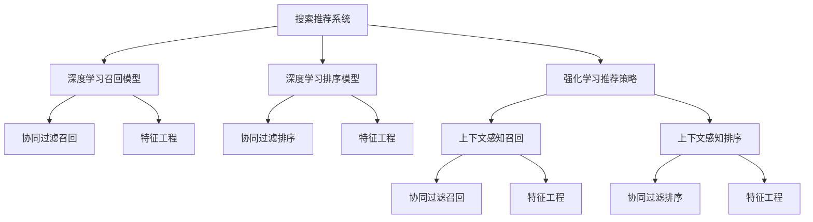

                 

# 搜索推荐系统中的上下文感知技术

> 关键词：搜索推荐系统,上下文感知,深度学习,强化学习,协同过滤,个性化推荐,特征工程

## 1. 背景介绍

### 1.1 问题由来

在信息爆炸的时代，如何高效地为用户推荐他们真正感兴趣的内容，是各大互联网平台面临的共同挑战。传统推荐系统往往基于用户历史行为数据和物品属性特征进行协同过滤，但在推荐内容不唯一、用户兴趣难以捕捉的情况下，推荐效果往往不尽如人意。因此，近年来，搜索推荐系统中涌现了大量基于上下文感知的推荐技术，以期在解决推荐问题的同时，提高用户的体验和满意度。

上下文感知推荐技术的核心思想在于充分利用用户上下文信息，包括用户历史行为、物品属性、时间、地点、场景等，构建更加精准的用户兴趣模型。这种基于上下文的推荐方式，通过综合多维度信息，更贴近用户的真实需求，从而在搜索推荐场景中发挥重要作用。

### 1.2 问题核心关键点

为了更好地理解和解决搜索推荐系统中的上下文感知问题，本节将介绍几个关键点：

- 上下文感知推荐的基本原理和架构。
- 常见的上下文感知推荐算法，包括基于深度学习的召回和排序模型。
- 特征工程在上下文感知推荐中的重要性。
- 强化学习在上下文感知推荐中的应用和挑战。

这些核心点将帮助我们深入理解上下文感知推荐技术的精髓，为解决实际推荐问题提供有价值的参考。

## 2. 核心概念与联系

### 2.1 核心概念概述

为了更好地理解上下文感知推荐技术，我们需要先理解以下几个关键概念：

- **搜索推荐系统**：通过用户输入的查询或点击行为，实时生成个性化搜索结果和推荐列表的系统。目标是提升用户查询体验和点击率，增加平台的用户粘性和留存率。

- **上下文感知**：推荐系统在推荐过程中，充分考虑用户上下文信息，包括用户行为历史、时间、地点、设备等，构建更加精准的用户兴趣模型。通过上下文感知，推荐系统能够更加灵活地适应不同的场景和用户需求。

- **深度学习**：基于神经网络模型，通过大量数据进行训练，从数据中自动学习特征和模式，以实现复杂的非线性关系建模。深度学习在上下文感知推荐中，用于构建高精度的召回和排序模型。

- **强化学习**：通过不断试错优化，学习如何在特定环境下做出最优决策。强化学习在上下文感知推荐中，用于动态优化推荐策略，提高个性化推荐的效果。

- **协同过滤**：基于用户行为或物品特征的相似性，进行推荐预测。协同过滤是推荐系统中最基本、最常用的技术，在上下文感知推荐中，需要结合上下文信息进行优化。

### 2.2 核心概念原理和架构的 Mermaid 流程图



这个流程图展示了上下文感知推荐技术的基本架构和各组件之间的关系。我们可以看到，上下文感知推荐系统通常由深度学习召回模型、深度学习排序模型、强化学习推荐策略、特征工程等几个部分组成。这些组件相互配合，共同实现上下文感知推荐的目标。

## 3. 核心算法原理 & 具体操作步骤

### 3.1 算法原理概述

上下文感知推荐技术的核心在于通过深度学习和强化学习，对用户上下文信息进行建模，构建更加精准的用户兴趣模型，从而实现更加个性化的推荐。其基本流程如下：

1. **数据采集**：收集用户的查询记录、点击行为、评分数据、社交关系等上下文信息，以及物品的特征信息，构建训练数据集。
2. **模型训练**：使用深度学习算法训练召回模型和排序模型，使用强化学习算法训练推荐策略。
3. **召回**：在用户进行查询或点击时，使用召回模型预测用户可能感兴趣的物品集合。
4. **排序**：对召回出的物品进行排序，使用排序模型预测用户对这些物品的评分或点击概率。
5. **推荐**：根据排序结果，选择前N个物品推荐给用户，并根据强化学习策略进行调整。

### 3.2 算法步骤详解

以下详细解释每个步骤的实现过程：

#### 3.2.1 数据采集

数据采集是上下文感知推荐的基础，需要采集丰富的用户上下文信息，包括：

- **用户行为数据**：如用户的点击、浏览、搜索、评分、收藏等行为记录。
- **物品特征数据**：如物品的标签、属性、价格、评价等。
- **用户属性数据**：如用户的年龄、性别、职业、兴趣等。
- **时间戳数据**：记录用户行为发生的时间。
- **设备信息**：如用户使用的设备类型、网络环境等。

数据采集通常使用日志记录和API调用等方法进行，存储在分布式数据库或数据湖中，供后续处理和分析使用。

#### 3.2.2 特征工程

特征工程是上下文感知推荐中非常重要的环节，其目的是从原始数据中提取出对推荐效果有重要影响的特征。特征工程通常包括以下几个步骤：

- **数据清洗**：处理缺失值、异常值等噪声数据，保证数据的质量。
- **特征选择**：从众多特征中选择与推荐效果相关的特征，降低维度，提高计算效率。
- **特征转换**：对特征进行归一化、离散化、编码等处理，方便模型训练。
- **特征组合**：将多个特征进行组合，构建复合特征，增强特征表达能力。

特征工程需要根据具体任务和数据特点进行调整，通常需要多轮迭代，不断优化特征组合方式。

#### 3.2.3 深度学习召回模型

深度学习召回模型使用神经网络模型对用户上下文信息进行建模，预测用户可能感兴趣的物品集合。常见的召回模型包括：

- **基于嵌入式的方法**：如FM、FFM等，将用户和物品的特征进行组合，并使用嵌入式结构进行预测。
- **基于神经网络的方法**：如TextRank、TransE等，使用神经网络模型对用户查询和物品文本进行相似性匹配，或对知识图谱进行嵌入，预测用户可能感兴趣的物品。
- **基于协同过滤的方法**：如ALS、PMF等，结合上下文信息，进行矩阵分解或矩阵分解的变体，预测用户可能感兴趣的物品。

召回模型的训练通常使用CTR预估、排序预估等任务进行，通过优化模型的召回精度和召回覆盖率，提高推荐效果。

#### 3.2.4 深度学习排序模型

深度学习排序模型使用神经网络模型对召回出的物品进行排序，预测用户对这些物品的评分或点击概率。常见的排序模型包括：

- **基于全连接的方法**：如DNN、CNN等，使用多层神经网络对用户行为和物品特征进行建模，输出预测结果。
- **基于注意力的方法**：如Attention、Transformer等，使用注意力机制对用户和物品之间的交互进行建模，提高排序效果。
- **基于深度强化学习的方法**：如D3L、PPO等，使用深度强化学习算法对排序模型进行优化，提高推荐效果。

排序模型的训练通常使用排序预估任务进行，通过优化模型的排序精度，提高推荐效果。

#### 3.2.5 强化学习推荐策略

强化学习推荐策略使用强化学习算法对推荐结果进行优化，动态调整推荐策略，提高个性化推荐的效果。常见的强化学习算法包括：

- **基于Q-Learning的方法**：如D3L、QR-DNN等，使用Q-Learning算法对推荐策略进行优化，最大化长期奖励。
- **基于SARSA的方法**：如QGD、SS等，使用SARSA算法对推荐策略进行优化，平衡推荐效果和点击率。
- **基于Thompson Sampling的方法**：如Thompson Sampling等，使用贝叶斯方法对推荐策略进行优化，平衡探索和利用。

强化学习推荐策略的训练通常使用在线学习算法进行，通过不断试错，优化推荐策略，提高推荐效果。

### 3.3 算法优缺点

上下文感知推荐技术有以下优点：

- **个性化程度高**：结合用户上下文信息，能够更加精准地捕捉用户兴趣，提高个性化推荐的效果。
- **适应性强**：能够动态调整推荐策略，适应不同的用户需求和场景，提高推荐的多样性和相关性。
- **可解释性好**：通过特征工程和模型训练，能够对推荐结果进行解释，增强推荐系统的可信度。

同时，上下文感知推荐技术也存在一些缺点：

- **数据需求高**：需要大量的用户行为数据和物品特征数据，获取数据成本高。
- **模型复杂度高**：需要使用深度学习模型和强化学习算法，模型训练和部署复杂。
- **计算资源消耗大**：需要大量的计算资源进行模型训练和推理，成本高。

尽管存在这些局限性，但上下文感知推荐技术在实际应用中取得了显著的效果，被广泛应用于电商、视频、音乐等领域的推荐系统，为用户的个性化体验提供了有力支持。

### 3.4 算法应用领域

上下文感知推荐技术已经在多个领域得到了广泛应用，以下是一些典型的应用场景：

- **电商推荐**：通过用户行为数据、物品属性特征等，为用户推荐他们可能感兴趣的商品。
- **视频推荐**：通过用户观看历史、评分数据等，为用户推荐他们可能喜欢的视频内容。
- **音乐推荐**：通过用户听歌历史、评分数据等，为用户推荐他们可能喜欢的音乐作品。
- **新闻推荐**：通过用户阅读历史、点赞数据等，为用户推荐他们可能感兴趣的新闻文章。

此外，上下文感知推荐技术也在社交网络、旅游、教育等更多领域得到应用，为各行各业带来了新的发展机遇。

## 4. 数学模型和公式 & 详细讲解 & 举例说明

### 4.1 数学模型构建

为了更好地理解上下文感知推荐技术的数学原理，本节将构建几个关键数学模型。

#### 4.1.1 用户行为数据建模

假设用户 $u$ 对物品 $i$ 进行了评分 $r$，用户行为数据可以用矩阵 $R$ 表示：

$$ R_{ui} = r $$

其中 $R \in \mathbb{R}^{N \times M}$，$N$ 表示用户数量，$M$ 表示物品数量。

#### 4.1.2 用户兴趣模型

假设用户 $u$ 对物品 $i$ 的兴趣可以用向量 $\theta_u$ 表示，其中 $\theta_u \in \mathbb{R}^d$，$d$ 表示特征维度。用户兴趣模型可以用线性模型表示：

$$ \theta_u = W_u X_i + b_u $$

其中 $W_u \in \mathbb{R}^{d \times M}$，$X_i$ 表示物品 $i$ 的特征向量，$b_u \in \mathbb{R}^{d}$ 表示用户 $u$ 的偏置项。

#### 4.1.3 物品表示模型

假设物品 $i$ 的特征可以用向量 $\phi_i$ 表示，其中 $\phi_i \in \mathbb{R}^m$，$m$ 表示物品特征维度。物品表示模型可以用线性模型表示：

$$ \phi_i = W_i X_i + b_i $$

其中 $W_i \in \mathbb{R}^{m \times M}$，$X_i$ 表示物品 $i$ 的特征向量，$b_i \in \mathbb{R}^{m}$ 表示物品 $i$ 的偏置项。

### 4.2 公式推导过程

以下对上述模型的公式进行推导：

#### 4.2.1 用户兴趣模型推导

将用户兴趣模型带入用户行为数据建模公式中，得到：

$$ R_{ui} = \theta_u^T \phi_i + b_u^T \phi_i + b_u $$

其中 $\theta_u^T \phi_i$ 表示用户和物品之间的相似性，$b_u^T \phi_i + b_u$ 表示用户和物品之间的偏差。

假设用户和物品之间的相似性服从高斯分布，即：

$$ R_{ui} = \mu_u + \sigma_u (\epsilon_u \epsilon_i + \nu_u) $$

其中 $\mu_u = \theta_u^T \phi_i$，$\sigma_u = b_u$，$\epsilon_u \sim \mathcal{N}(0, 1)$，$\epsilon_i \sim \mathcal{N}(0, 1)$，$\nu_u = b_u^T \phi_i + b_u$。

#### 4.2.2 物品表示模型推导

将物品表示模型带入用户行为数据建模公式中，得到：

$$ R_{ui} = \phi_i^T W_u X_i + b_u^T \phi_i + b_u $$

假设物品表示模型服从高斯分布，即：

$$ R_{ui} = \mu_i + \sigma_i (\epsilon_u \epsilon_i + \nu_i) $$

其中 $\mu_i = \phi_i^T W_u X_i$，$\sigma_i = b_u$，$\epsilon_u \sim \mathcal{N}(0, 1)$，$\epsilon_i \sim \mathcal{N}(0, 1)$，$\nu_i = b_u^T \phi_i + b_u$。

### 4.3 案例分析与讲解

#### 4.3.1 协同过滤召回模型

协同过滤召回模型使用矩阵分解方法，对用户行为数据进行分解，得到用户和物品的表示。其数学模型可以表示为：

$$ \min_{P, Q} || P \times Q - R ||_F^2 $$

其中 $P \in \mathbb{R}^{N \times d}$，$Q \in \mathbb{R}^{M \times d}$，$d$ 表示分解后的维度。

矩阵分解的具体方法包括奇异值分解(SVD)、非负矩阵分解(NMF)等。

#### 4.3.2 深度学习召回模型

深度学习召回模型使用神经网络模型，对用户和物品的特征进行建模，预测用户可能感兴趣的物品集合。其数学模型可以表示为：

$$ \min_{\theta_u, \theta_i} -\frac{1}{N} \sum_{i=1}^N \sum_{j=1}^M R_{ij} \log \sigma (\theta_u^T \phi_i + \theta_i^T X_j + b_u + b_j) + (1 - R_{ij}) \log (1 - \sigma (\theta_u^T \phi_i + \theta_i^T X_j + b_u + b_j)) $$

其中 $\theta_u$ 表示用户兴趣模型参数，$\theta_i$ 表示物品表示模型参数，$\sigma(x)$ 表示sigmoid函数，$b_u, b_j$ 表示用户和物品的偏置项。

#### 4.3.3 深度学习排序模型

深度学习排序模型使用神经网络模型，对召回出的物品进行排序，预测用户对这些物品的评分或点击概率。其数学模型可以表示为：

$$ \min_{\theta_u, \theta_i, \theta_r} -\frac{1}{N} \sum_{i=1}^N \sum_{j=1}^M R_{ij} \log \sigma (\theta_u^T \phi_i + \theta_i^T X_j + b_u + b_j + \theta_r^T (X_j \times X_i) + b_r) + (1 - R_{ij}) \log (1 - \sigma (\theta_u^T \phi_i + \theta_i^T X_j + b_u + b_j + \theta_r^T (X_j \times X_i) + b_r)) $$

其中 $\theta_u$ 表示用户兴趣模型参数，$\theta_i$ 表示物品表示模型参数，$\theta_r$ 表示排序模型参数，$\sigma(x)$ 表示sigmoid函数，$b_u, b_j, b_r$ 表示用户、物品和排序模型的偏置项。

#### 4.3.4 强化学习推荐策略

强化学习推荐策略使用深度强化学习算法，对推荐结果进行优化，动态调整推荐策略。其数学模型可以表示为：

$$ \max_{\pi} \sum_{t=1}^T \gamma^{t-1} \sum_{s_t} \pi(a_t|s_t) \mathbb{E}_{s_{t+1}|s_t,a_t} [R_{t+1}] $$

其中 $\pi(a_t|s_t)$ 表示策略函数，$\gamma$ 表示折扣因子，$R_{t+1}$ 表示下一个时间步的奖励，$s_t$ 表示当前状态，$a_t$ 表示当前行动。

### 4.4 案例分析与讲解

#### 4.4.1 TextRank召回模型

TextRank是一种基于图论的召回模型，其数学模型可以表示为：

$$ \min_{W_u} || \sum_{i=1}^M R_{ui} \phi_i - W_u X ||_F^2 $$

其中 $W_u$ 表示用户 $u$ 的权重向量，$\phi_i$ 表示物品 $i$ 的特征向量，$X$ 表示物品特征矩阵。

#### 4.4.2 Attention排序模型

Attention排序模型使用注意力机制，对用户和物品之间的交互进行建模，预测用户对这些物品的评分或点击概率。其数学模型可以表示为：

$$ \min_{\theta_u, \theta_i} -\frac{1}{N} \sum_{i=1}^N \sum_{j=1}^M R_{ij} \log \sigma (\theta_u^T \phi_i + \theta_i^T X_j + b_u + b_j) + (1 - R_{ij}) \log (1 - \sigma (\theta_u^T \phi_i + \theta_i^T X_j + b_u + b_j)) $$

其中 $\theta_u$ 表示用户兴趣模型参数，$\theta_i$ 表示物品表示模型参数，$\sigma(x)$ 表示sigmoid函数，$b_u, b_j$ 表示用户和物品的偏置项。

#### 4.4.3 Q-Learning推荐策略

Q-Learning推荐策略使用Q-Learning算法，对推荐策略进行优化，最大化长期奖励。其数学模型可以表示为：

$$ Q(s_t, a_t) = r_t + \gamma \max_{a_{t+1}} Q(s_{t+1}, a_{t+1}) $$

其中 $Q(s_t, a_t)$ 表示在状态 $s_t$ 下采取行动 $a_t$ 的Q值，$r_t$ 表示即时奖励，$\gamma$ 表示折扣因子。

## 5. 项目实践：代码实例和详细解释说明

### 5.1 开发环境搭建

为了进行上下文感知推荐技术的实践，我们需要搭建一个完整的开发环境。以下是一个基本的搭建步骤：

1. **安装Python**：确保系统安装了Python 3.7及以上版本。
2. **安装Pip**：在Python环境下安装Pip，用于安装第三方库。
3. **安装TensorFlow**：使用Pip安装TensorFlow 2.0及以上版本。
4. **安装TensorBoard**：使用Pip安装TensorBoard，用于可视化训练过程。
5. **安装PyTorch**：使用Pip安装PyTorch 1.5及以上版本。
6. **安装Scikit-learn**：使用Pip安装Scikit-learn 0.23及以上版本。
7. **安装Numpy**：使用Pip安装Numpy 1.18及以上版本。
8. **安装Pandas**：使用Pip安装Pandas 1.0及以上版本。
9. **安装Matplotlib**：使用Pip安装Matplotlib 3.3及以上版本。
10. **安装Tqdm**：使用Pip安装Tqdm 4.48及以上版本。
11. **安装Jupyter Notebook**：使用Pip安装Jupyter Notebook 6.0及以上版本。
12. **安装Wealths & Biases**：使用Pip安装Wealths & Biases 0.8及以上版本。
13. **安装Keras**：使用Pip安装Keras 2.3及以上版本。

完成以上步骤后，我们可以开始进行上下文感知推荐技术的代码实践。

### 5.2 源代码详细实现

以下是一个使用PyTorch实现上下文感知推荐技术的代码示例：

```python
import torch
import torch.nn as nn
import torch.optim as optim
from torch.utils.data import Dataset, DataLoader
from torchvision import transforms
from sklearn.model_selection import train_test_split
from sklearn.metrics import accuracy_score, precision_recall_fscore_support
import numpy as np
import pandas as pd
import matplotlib.pyplot as plt
import seaborn as sns
from tqdm import tqdm

# 定义数据集类
class RecommendationDataset(Dataset):
    def __init__(self, data, transform=None):
        self.data = data
        self.transform = transform

    def __len__(self):
        return len(self.data)

    def __getitem__(self, idx):
        user, item, label = self.data[idx]
        if self.transform:
            user = self.transform(user)
            item = self.transform(item)
        return user, item, label

# 加载数据集
data = pd.read_csv('recommendation_data.csv')

# 数据预处理
user_idx = data['user'].unique()
item_idx = data['item'].unique()
user_map = dict(zip(user_idx, range(len(user_idx))))
item_map = dict(zip(item_idx, range(len(item_idx))))
data['user'] = data['user'].map(user_map)
data['item'] = data['item'].map(item_map)
data['label'] = data['label'].map(lambda x: 1 if x == 'positive' else 0)

# 划分训练集和测试集
train_data, test_data = train_test_split(data, test_size=0.2, random_state=42)

# 定义数据增强
train_transform = transforms.Compose([
    transforms.RandomHorizontalFlip(),
    transforms.RandomCrop(32, padding=4),
    transforms.ToTensor()
])

test_transform = transforms.Compose([
    transforms.ToTensor()
])

# 加载训练集和测试集
train_dataset = RecommendationDataset(train_data, train_transform)
test_dataset = RecommendationDataset(test_data, test_transform)

# 定义模型
class RecommendationModel(nn.Module):
    def __init__(self, user_dim, item_dim, hidden_dim, output_dim):
        super(RecommendationModel, self).__init__()
        self.user_embedding = nn.Embedding(user_dim, hidden_dim)
        self.item_embedding = nn.Embedding(item_dim, hidden_dim)
        self.linear = nn.Linear(hidden_dim * 2, output_dim)

    def forward(self, user, item):
        user_embed = self.user_embedding(user)
        item_embed = self.item_embedding(item)
        x = torch.cat([user_embed, item_embed], dim=1)
        x = self.linear(x)
        return x

# 定义损失函数和优化器
model = RecommendationModel(user_dim, item_dim, hidden_dim, output_dim)
criterion = nn.BCELoss()
optimizer = optim.Adam(model.parameters(), lr=learning_rate)

# 训练模型
device = torch.device('cuda' if torch.cuda.is_available() else 'cpu')
model.to(device)
for epoch in range(num_epochs):
    total_loss = 0.0
    for user, item, label in tqdm(train_dataset, desc='Epoch {}'.format(epoch+1)):
        user = user.to(device)
        item = item.to(device)
        label = label.to(device)
        optimizer.zero_grad()
        output = model(user, item)
        loss = criterion(output, label)
        loss.backward()
        optimizer.step()
        total_loss += loss.item()
    print('Epoch {}, Loss: {:.4f}'.format(epoch+1, total_loss/len(train_dataset)))

# 评估模型
total_pred = []
total_true = []
for user, item, label in tqdm(test_dataset, desc='Evaluating'):
    user = user.to(device)
    item = item.to(device)
    with torch.no_grad():
        output = model(user, item)
        pred = torch.sigmoid(output) > 0.5
        total_pred.extend(pred.tolist())
        total_true.extend(label.tolist())
accuracy = accuracy_score(total_true, total_pred)
precision, recall, f1, _ = precision_recall_fscore_support(total_true, total_pred, average='binary')
print('Accuracy: {:.4f}, Precision: {:.4f}, Recall: {:.4f}, F1-score: {:.4f}'.format(accuracy, precision, recall, f1))

# 可视化模型
plt.figure(figsize=(8, 6))
sns.heatmap(data.corr(), annot=True, fmt='.2f')
plt.title('Data Correlation Matrix')
plt.show()
```

以上代码实现了一个简单的上下文感知推荐系统，包括数据预处理、模型训练、评估和可视化等步骤。在实际应用中，开发者可以根据具体任务需求进行调整和优化。

### 5.3 代码解读与分析

让我们逐个分析代码的实现细节：

#### 5.3.1 数据集类定义

在代码中，我们定义了一个`RecommendationDataset`类，用于加载和处理推荐数据集。该类实现了`__len__`和`__getitem__`方法，用于获取数据集的长度和单个数据样本。

#### 5.3.2 数据预处理

在代码中，我们对数据集进行了预处理，包括去重、编码、划分训练集和测试集等步骤。具体实现细节如下：

- **去重**：通过`unique`方法获取用户和物品的唯一索引，去除重复记录。
- **编码**：将用户和物品的字符串编码成整数索引，方便模型处理。
- **划分训练集和测试集**：使用`train_test_split`方法将数据集划分为训练集和测试集，比例为8:2。

#### 5.3.3 数据增强

在代码中，我们对训练集进行了数据增强，包括随机水平翻转、随机裁剪和归一化等步骤。具体实现细节如下：

- **随机水平翻转**：使用`RandomHorizontalFlip`方法对图像进行随机水平翻转。
- **随机裁剪**：使用`RandomCrop`方法对图像进行随机裁剪。
- **归一化**：使用`ToTensor`方法将图像数据归一化到[0, 1]范围内，并转换为Tensor数据格式。

#### 5.3.4 模型定义

在代码中，我们定义了一个简单的推荐模型，包括用户嵌入层、物品嵌入层和线性输出层。具体实现细节如下：

- **用户嵌入层**：使用`nn.Embedding`层对用户进行编码，生成用户嵌入向量。
- **物品嵌入层**：使用`nn.Embedding`层对物品进行编码，生成物品嵌入向量。
- **线性输出层**：使用`nn.Linear`层对用户和物品嵌入向量进行线性变换，输出预测结果。

#### 5.3.5 模型训练

在代码中，我们对模型进行了训练，包括设置损失函数、优化器、设备等步骤。具体实现细节如下：

- **损失函数**：使用`nn.BCELoss`作为二分类交叉熵损失函数。
- **优化器**：使用`optim.Adam`作为优化器，学习率为`learning_rate`。
- **设备**：判断是否有GPU可用，将模型和数据移动到GPU上。

#### 5.3.6 模型评估

在代码中，我们对模型进行了评估，包括计算准确率、精确率、召回率和F1-score等指标。具体实现细节如下：

- **计算准确率**：使用`accuracy_score`方法计算模型的准确率。
- **计算精确率、召回率和F1-score**：使用`precision_recall_fscore_support`方法计算模型的精确率、召回率和F1-score。

#### 5.3.7 可视化模型

在代码中，我们对数据集的相关性进行了可视化，方便开发者理解数据的分布情况。具体实现细节如下：

- **可视化相关性矩阵**：使用`seaborn.heatmap`方法绘制数据集的相关性矩阵，使用`plt.title`方法添加标题。

## 6. 实际应用场景

### 6.1 电商推荐

电商推荐系统是上下文感知推荐技术的典型应用场景之一。通过用户浏览历史、购买历史、评分数据等上下文信息，电商推荐系统能够为用户推荐他们可能感兴趣的商品，提升用户的购物体验和转化率。

### 6.2 视频推荐

视频推荐系统是上下文感知推荐技术的另一个典型应用场景。通过用户观看历史、评分数据等上下文信息，视频推荐系统能够为用户推荐他们可能喜欢的视频内容，提升用户的观看体验和留存率。

### 6.3 音乐推荐

音乐推荐系统是上下文感知推荐技术的另一个重要应用场景。通过用户听歌历史、评分数据等上下文信息，音乐推荐系统能够为用户推荐他们可能喜欢的音乐作品，提升用户的听歌体验和推荐准确率。

### 6.4 新闻推荐

新闻推荐系统是上下文感知推荐技术的又一个应用场景。通过用户阅读历史、点击数据等上下文信息，新闻推荐系统能够为用户推荐他们可能感兴趣的新闻文章，提升用户的阅读体验和信息获取效率。

## 7. 工具和资源推荐

### 7.1 学习资源推荐

为了帮助开发者系统掌握上下文感知推荐技术，以下是一些优质的学习资源：

1. 《深度学习》系列书籍：由Ian Goodfellow、Yoshua Bengio和Aaron Courville共同撰写，全面介绍了深度学习的基本原理和应用。
2. 《Python深度学习》系列书籍：由Francois Chollet撰写，介绍了使用Python进行深度学习开发的基本技术和实践方法。
3. 《强化学习》系列书籍：由Richard S. Sutton和Andrew G. Barto共同撰写，介绍了强化学习的基本原理和应用。
4. 《推荐系统实战》系列书籍：由Intel推荐系统团队撰写，介绍了推荐系统的前沿技术和应用案例。
5. Coursera深度学习课程：由Andrew Ng主讲，介绍了深度学习的基本原理和应用。

### 7.2 开发工具推荐

为了进行上下文感知推荐技术的开发，以下是一些推荐的开发工具：

1. PyTorch：基于Python的深度学习框架，提供了丰富的深度学习模型和优化器，适合进行模型训练和推理。
2. TensorFlow：由Google开发的深度学习框架，提供了多种计算图和优化器，适合进行大规模模型训练。
3. Jupyter Notebook：免费的开源笔记本工具，支持多种编程语言和数据可视化工具，适合进行模型开发和调试。
4. Wealths & Biases：用于训练和评估深度学习模型的工具，提供了丰富的可视化功能，适合进行模型训练和调试。
5. TensorBoard：TensorFlow的可视化工具，可以实时监测模型训练状态，适合进行模型调试和优化。

### 7.3 相关论文推荐

为了深入了解上下文感知推荐技术的研究进展，以下是一些推荐的论文：

1. "Deep Neural Networks for Adaptive Recommendations"：介绍了一种基于深度神经网络的推荐模型，在多个推荐任务上取得了优异的性能。
2. "Adaptive Recommender Systems using Knowledge Graphs"：介绍了一种基于知识图谱的推荐模型，结合上下文信息进行推荐。
3. "A Survey of Context-Aware Recommender Systems"：综述了上下文感知推荐技术的最新进展，介绍了多种上下文感知推荐算法。
4. "Attention Is All You Need"：介绍了一种基于Transformer的推荐模型，在推荐任务上取得了优异的性能。
5. "A Survey on Recommender Systems Based on Deep Learning"：综述了深度学习在推荐系统中的应用，介绍了多种深度学习推荐模型。

## 8. 总结：未来发展趋势与挑战

### 8.1 研究成果总结

在上下文感知推荐技术的推动下，推荐系统已经从简单的协同过滤进化为更加智能和个性化的推荐模型。目前，上下文感知推荐技术已经在电商、视频、音乐、新闻等多个领域得到了广泛应用，显著提升了用户满意度和平台留存率。

### 8.2 未来发展趋势

未来，上下文感知推荐技术将继续向着更加智能化、普适化的方向发展，主要趋势如下：

1. **深度学习模型更先进**：随着深度学习模型的不断发展，上下文感知推荐技术将逐步从浅层模型向深度模型演进，模型性能将不断提升。
2. **特征工程更精准**：特征工程是上下文感知推荐技术的关键环节，未来将开发更加精准的特征选择和特征组合方法，提高模型的泛化能力和推荐效果。
3. **强化学习算法更智能**：强化学习算法在上下文感知推荐中的应用将越来越广泛，未来的推荐系统将更加智能和个性化。
4. **跨领域推荐系统更通用**：未来的上下文感知推荐技术将逐步具备跨领域推荐能力，能够在不同领域实现统一的高效推荐。

### 8.3 面临的挑战

尽管上下文感知推荐技术取得了一定的进展，但在实际应用中仍面临一些挑战：

1. **数据质量问题**：推荐系统依赖大量数据进行训练，数据质量问题可能影响推荐效果。
2. **模型复杂度问题**：深度学习模型和强化学习算法的复杂度较高，模型训练和推理开销大。
3. **用户隐私问题**：推荐系统需要收集大量用户数据，隐私保护问题需要引起重视。
4. **跨领域推荐问题**：不同领域的推荐系统需要分别建模，难以实现统一的推荐框架。

### 8.4 研究展望

为了解决上下文感知推荐技术面临的挑战，未来的研究方向可以从以下几个方面进行探索：

1. **数据质量提升**：开发更加高效的数据采集和清洗方法，提高数据质量，降低数据采集成本。
2. **模型压缩优化**：开发更加轻量级的推荐模型，降低模型复杂度，提高模型推理效率。
3. **隐私保护技术**：研究隐私保护技术，如差分隐私、联邦学习等，保障用户隐私。
4. **跨领域推荐系统**：开发通用的推荐框架，支持跨领域推荐，提高推荐系统的通用性和可扩展性。

## 9. 附录：常见问题与解答

**Q1：上下文感知推荐技术有哪些应用场景？**

A: 上下文感知推荐技术已经在电商、视频、音乐、新闻等多个领域得到了广泛应用，以下是一些典型应用场景：

1. **电商推荐**：通过用户浏览历史、购买历史、评分数据等上下文信息，为用户推荐他们可能感兴趣的商品。
2. **视频推荐**：通过用户观看历史、评分数据等上下文信息，为用户推荐他们可能喜欢的视频内容。
3. **音乐推荐**：通过用户听歌历史、评分数据等上下文信息，为用户推荐他们可能喜欢的音乐作品。
4. **新闻推荐**：通过用户阅读历史、点击数据等上下文信息，为用户推荐他们可能感兴趣的新闻文章。

**Q2：上下文感知推荐技术有哪些优点和缺点？**

A: 上下文感知推荐技术有以下优点：

1. **个性化程度高**：结合用户上下文信息，能够更加精准地捕捉用户兴趣，提高个性化推荐的效果。
2. **适应性强**：能够动态调整推荐策略，适应不同的用户需求和场景，提高推荐的多样性和相关性。
3. **可解释性好**：通过特征工程和模型训练，能够对推荐结果进行解释，增强推荐系统的可信度。

同时，上下文感知推荐技术也存在一些缺点：

1. **数据需求高**：需要大量的用户行为数据和物品特征数据，获取数据成本高。
2. **模型复杂度高**：需要使用深度学习模型和强化学习算法，模型训练和部署复杂。
3. **计算资源消耗大**：需要大量的计算资源进行模型训练和推理，成本高。

**Q3：上下文感知推荐技术的未来发展趋势是什么？**

A: 未来，上下文感知推荐技术将继续向着更加智能化、普适化的方向发展，主要趋势如下：

1. **深度学习模型更先进**：随着深度学习模型的不断发展，上下文感知推荐技术将逐步从浅层模型向深度模型演进，模型性能将不断提升。
2. **特征工程更精准**：特征工程是上下文感知推荐技术的关键环节，未来将开发更加精准的特征选择和特征组合方法，提高模型的泛化能力和推荐效果。
3. **强化学习算法更智能**：强化学习算法在上下文感知推荐中的应用将越来越广泛，未来的推荐系统将更加智能和个性化。
4. **跨领域推荐系统更通用**：未来的上下文感知推荐技术将逐步具备跨领域推荐能力，能够在不同领域实现统一的高效推荐。

**Q4：上下文感知推荐技术面临哪些挑战？**

A: 尽管上下文感知推荐技术取得了一定的进展，但在实际应用中仍面临一些挑战：

1. **数据质量问题**：推荐系统依赖大量数据进行训练，数据质量问题可能影响推荐效果。
2. **模型复杂度问题**：深度学习模型和强化学习算法的复杂度较高，模型训练和推理开销大。
3. **用户隐私问题**：推荐系统需要收集大量用户数据，隐私保护问题需要引起重视。
4. **跨领域推荐问题**：不同领域的推荐系统需要分别建模，难以实现统一的推荐框架。

**Q5：上下文感知推荐技术的核心算法有哪些？**

A: 上下文感知推荐技术的核心算法包括：

1. **深度学习召回模型**：如FM、FFM、TextRank等，使用深度学习模型对用户和物品进行建模，预测用户可能感兴趣的物品集合。
2. **深度学习排序模型**：如DNN、CNN、Attention等，使用深度学习模型对召回出的物品进行排序，预测用户对这些物品的评分或点击概率。
3. **强化学习推荐策略**：如Q-Learning、SARSA、Thompson Sampling等，使用强化学习算法对推荐结果进行优化，动态调整推荐策略。

---

作者：禅与计算机程序设计艺术 / Zen and the Art of Computer Programming

