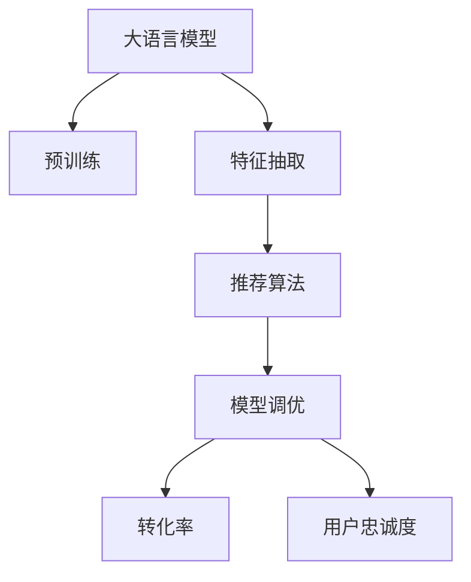

                 

# 搜索推荐系统的AI 大模型优化：提高电商平台的转化率与用户忠诚度

## 1. 背景介绍

### 1.1 问题由来

随着互联网和电子商务的迅猛发展，电商平台已成为现代消费者获取商品信息、购买商品的主要渠道。然而，在琳琅满目的商品中，用户如何找到最符合自身需求的商品，成为电商平台的重大挑战。传统的基于规则的推荐算法已经无法满足用户日益复杂的购物需求。

为了提升推荐系统的精准度和用户体验，AI大模型开始在电商平台中得到广泛应用。大模型利用海量数据和强大计算能力，可以挖掘用户行为、商品属性等多维信息，从而提供个性化推荐，提升转化率和用户满意度。

然而，如何高效优化大模型，使其在电商推荐场景中发挥最佳性能，成为当前亟需解决的问题。本文章旨在介绍如何通过AI大模型优化技术，提高电商平台的转化率和用户忠诚度。

## 2. 核心概念与联系

### 2.1 核心概念概述

为更好地理解基于AI大模型的电商平台推荐优化方法，本节将介绍几个密切相关的核心概念：

- **大语言模型(Large Language Model, LLM)：** 以自回归(如GPT)或自编码(如BERT)模型为代表的大规模预训练语言模型。通过在海量无标签文本语料上进行预训练，学习通用的语言表示，具备强大的语言理解和生成能力。

- **迁移学习(Transfer Learning)：** 指将一个领域学习到的知识，迁移应用到另一个不同但相关的领域的学习范式。大模型的预训练-微调过程即是一种典型的迁移学习方式。

- **特征抽取(Feature Extraction)：** 通过大模型学习数据特征，提取有用的信息，从而进行推荐预测。

- **推荐算法(Recommendation Algorithm)：** 利用机器学习算法，通过用户行为数据、商品属性等特征，预测用户对商品的概率，进行个性化推荐。

- **模型调优(Model Tuning)：** 在预训练模型基础上，针对特定任务进行优化，提升模型在该任务上的性能。

- **转化率(Conversion Rate)：** 指用户在点击推荐后，完成购买行为的比例。

- **用户忠诚度(User Loyalty)：** 指用户对平台的满意度和信任度，通过复购率、评论情感等指标衡量。

这些核心概念之间的逻辑关系可以通过以下Mermaid流程图来展示：



这个流程图展示了大语言模型的核心概念及其之间的关系：

1. 大语言模型通过预训练获得基础能力。
2. 特征抽取从大模型中提取用户和商品特征，供推荐算法使用。
3. 推荐算法根据特征预测用户对商品的兴趣，输出推荐结果。
4. 模型调优对推荐算法进行优化，提升转化率和用户忠诚度。

## 3. 核心算法原理 & 具体操作步骤
### 3.1 算法原理概述

基于AI大模型的电商平台推荐优化，本质上是一个多任务的迁移学习过程。其核心思想是：将预训练的大语言模型作为强大的特征提取器，通过特定推荐任务的数据集对模型进行有监督的微调，使得模型输出能够更好地匹配推荐任务的目标，从而实现精准的个性化推荐。

形式化地，假设预训练语言模型为 $M_{\theta}$，其中 $\theta$ 为预训练得到的模型参数。给定电商平台推荐任务 $T$ 的数据集 $D=\{(x_i, y_i)\}_{i=1}^N$，推荐算法优化目标是最小化推荐损失函数，即找到新的模型参数 $\hat{\theta}$，使得：

$$
\hat{\theta}=\mathop{\arg\min}_{\theta} \mathcal{L}(M_{\theta},D)
$$

其中 $\mathcal{L}$ 为针对任务 $T$ 设计的推荐损失函数，用于衡量推荐模型预测与实际标签（如购买行为）之间的差异。常见的推荐损失函数包括交叉熵损失、均方误差损失等。

通过梯度下降等优化算法，优化算法不断更新模型参数 $\theta$，最小化损失函数 $\mathcal{L}$，使得推荐模型输出逼近真实标签。由于 $\theta$ 已经通过预训练获得了较好的初始化，因此即便在标注数据量较小的情况下，也能较快收敛到理想的模型参数 $\hat{\theta}$。

### 3.2 算法步骤详解

基于AI大模型的电商平台推荐优化一般包括以下几个关键步骤：

**Step 1: 准备预训练模型和数据集**
- 选择合适的预训练语言模型 $M_{\theta}$ 作为初始化参数，如 BERT、GPT等。
- 准备电商平台推荐任务 $T$ 的标注数据集 $D$，划分为训练集、验证集和测试集。一般要求标注数据与预训练数据的分布不要差异过大。

**Step 2: 设计推荐算法**
- 选择合适的推荐算法，如协同过滤、基于内容的推荐、混合推荐等。
- 根据推荐任务类型，设计合适的损失函数。例如，交叉熵损失适用于二分类推荐任务，均方误差损失适用于回归推荐任务。

**Step 3: 设置优化超参数**
- 选择合适的优化算法及其参数，如 AdamW、SGD 等，设置学习率、批大小、迭代轮数等。
- 设置正则化技术及强度，包括权重衰减、Dropout、Early Stopping 等。
- 确定冻结预训练参数的策略，如仅微调顶层，或全部参数都参与微调。

**Step 4: 执行梯度训练**
- 将训练集数据分批次输入模型，前向传播计算推荐损失。
- 反向传播计算参数梯度，根据设定的优化算法和学习率更新模型参数。
- 周期性在验证集上评估模型性能，根据性能指标决定是否触发 Early Stopping。
- 重复上述步骤直到满足预设的迭代轮数或 Early Stopping 条件。

**Step 5: 测试和部署**
- 在测试集上评估优化后模型 $M_{\hat{\theta}}$ 的性能，对比优化前后的转化率和用户忠诚度提升。
- 使用优化后的模型对新样本进行推荐，集成到电商平台推荐系统中。
- 持续收集新的数据，定期重新优化模型，以适应数据分布的变化。

以上是基于AI大模型的电商平台推荐优化的一般流程。在实际应用中，还需要针对具体任务的特点，对优化过程的各个环节进行优化设计，如改进推荐目标函数，引入更多的正则化技术，搜索最优的超参数组合等，以进一步提升模型性能。

### 3.3 算法优缺点

基于AI大模型的电商平台推荐优化方法具有以下优点：
1. 简单高效。只需准备少量标注数据，即可对预训练模型进行快速适配，获得较大的性能提升。
2. 通用适用。适用于各种电商平台推荐任务，包括商品推荐、个性化展示等，设计简单的任务适配层即可实现优化。
3. 参数高效。利用参数高效微调技术，在固定大部分预训练权重不变的情况下，仍可取得不错的提升。
4. 效果显著。在学术界和工业界的诸多推荐系统任务上，基于优化的方法已经刷新了最先进的性能指标。

同时，该方法也存在一定的局限性：
1. 依赖标注数据。优化的效果很大程度上取决于标注数据的质量和数量，获取高质量标注数据的成本较高。
2. 迁移能力有限。当目标任务与预训练数据的分布差异较大时，优化的性能提升有限。
3. 负面效果传递。预训练模型的固有偏见、有害信息等，可能通过优化传递到推荐任务，造成负面影响。
4. 可解释性不足。优化后的模型决策过程通常缺乏可解释性，难以对其推理逻辑进行分析和调试。

尽管存在这些局限性，但就目前而言，基于AI大模型的推荐优化方法仍是目前推荐系统的主流范式。未来相关研究的重点在于如何进一步降低优化对标注数据的依赖，提高模型的少样本学习和跨领域迁移能力，同时兼顾可解释性和伦理安全性等因素。

### 3.4 算法应用领域

基于大语言模型的推荐优化方法在电商平台中已经得到了广泛的应用，覆盖了几乎所有常见推荐任务，例如：

- **商品推荐：** 根据用户浏览历史、购买历史、收藏历史等行为数据，为用户推荐可能感兴趣的商品。通过优化推荐模型，可以显著提升转化率。

- **个性化展示：** 利用用户行为数据，对网页展示内容进行个性化推荐，提升用户体验和点击率。通过优化展示算法，可以更精准地吸引用户注意力。

- **购物车推荐：** 在用户放入购物车后，根据用户偏好和历史行为，推荐更多可能感兴趣的商品，提升用户复购率。通过优化推荐模型，可以避免用户流失，增加销售收入。

- **个性化搜索：** 在用户输入搜索词后，根据用户历史搜索记录和点击记录，推荐最相关的搜索结果，提升用户满意度。通过优化搜索算法，可以更好地匹配用户需求，提高转化率。

除了上述这些经典任务外，基于大语言模型的推荐优化技术也被创新性地应用到更多场景中，如智能推荐、内容推荐、广告推荐等，为电商平台带来了全新的突破。随着预训练模型和推荐优化方法的不断进步，相信电商平台推荐系统必将在更多领域大放异彩。

## 4. 数学模型和公式 & 详细讲解  
### 4.1 数学模型构建

本节将使用数学语言对基于AI大模型的电商平台推荐优化过程进行更加严格的刻画。

记预训练语言模型为 $M_{\theta}$，其中 $\theta$ 为预训练得到的模型参数。假设电商平台推荐任务 $T$ 的训练集为 $D=\{(x_i,y_i)\}_{i=1}^N, x_i \in \mathcal{X}, y_i \in \mathcal{Y}$，其中 $\mathcal{X}$ 为用户行为数据，$\mathcal{Y}$ 为推荐结果。

定义推荐模型 $M_{\theta}$ 在数据样本 $(x,y)$ 上的推荐损失函数为 $\ell(M_{\theta}(x),y)$，则在数据集 $D$ 上的经验风险为：

$$
\mathcal{L}(\theta) = \frac{1}{N} \sum_{i=1}^N \ell(M_{\theta}(x_i),y_i)
$$

其中 $\ell$ 为推荐任务对应的损失函数，如交叉熵损失函数 $L_{ce} = -\sum_{i=1}^N(y_i \log M_{\theta}(x_i) + (1-y_i) \log(1-M_{\theta}(x_i)))$，或均方误差损失函数 $L_{mse} = \frac{1}{N} \sum_{i=1}^N (M_{\theta}(x_i) - y_i)^2$。

通过梯度下降等优化算法，优化算法不断更新模型参数 $\theta$，最小化损失函数 $\mathcal{L}$，使得推荐模型输出逼近真实标签。由于 $\theta$ 已经通过预训练获得了较好的初始化，因此即便在标注数据量较小的情况下，也能较快收敛到理想的模型参数 $\hat{\theta}$。

### 4.2 公式推导过程

以下我们以二分类推荐任务为例，推导交叉熵损失函数及其梯度的计算公式。

假设推荐模型 $M_{\theta}$ 在输入 $x$ 上的输出为 $\hat{y}=M_{\theta}(x) \in [0,1]$，表示用户对推荐商品感兴趣的概率。真实标签 $y \in \{0,1\}$。则二分类交叉熵损失函数定义为：

$$
\ell(M_{\theta}(x),y) = -[y\log \hat{y} + (1-y)\log (1-\hat{y})]
$$

将其代入经验风险公式，得：

$$
\mathcal{L}(\theta) = -\frac{1}{N}\sum_{i=1}^N [y_i\log M_{\theta}(x_i)+(1-y_i)\log(1-M_{\theta}(x_i))]
$$

根据链式法则，损失函数对参数 $\theta_k$ 的梯度为：

$$
\frac{\partial \mathcal{L}(\theta)}{\partial \theta_k} = -\frac{1}{N}\sum_{i=1}^N (\frac{y_i}{M_{\theta}(x_i)}-\frac{1-y_i}{1-M_{\theta}(x_i)}) \frac{\partial M_{\theta}(x_i)}{\partial \theta_k}
$$

其中 $\frac{\partial M_{\theta}(x_i)}{\partial \theta_k}$ 可进一步递归展开，利用自动微分技术完成计算。

在得到损失函数的梯度后，即可带入参数更新公式，完成模型的迭代优化。重复上述过程直至收敛，最终得到适应电商平台推荐任务的最优模型参数 $\hat{\theta}$。

## 5. 项目实践：代码实例和详细解释说明
### 5.1 开发环境搭建

在进行推荐优化实践前，我们需要准备好开发环境。以下是使用Python进行PyTorch开发的环境配置流程：

1. 安装Anaconda：从官网下载并安装Anaconda，用于创建独立的Python环境。

2. 创建并激活虚拟环境：
```bash
conda create -n pytorch-env python=3.8 
conda activate pytorch-env
```

3. 安装PyTorch：根据CUDA版本，从官网获取对应的安装命令。例如：
```bash
conda install pytorch torchvision torchaudio cudatoolkit=11.1 -c pytorch -c conda-forge
```

4. 安装Transformer库：
```bash
pip install transformers
```

5. 安装各类工具包：
```bash
pip install numpy pandas scikit-learn matplotlib tqdm jupyter notebook ipython
```

完成上述步骤后，即可在`pytorch-env`环境中开始推荐优化实践。

### 5.2 源代码详细实现

这里我们以商品推荐任务为例，给出使用Transformers库对BERT模型进行推荐优化的PyTorch代码实现。

首先，定义推荐任务的数据处理函数：

```python
from transformers import BertTokenizer
from torch.utils.data import Dataset
import torch

class RecommendationDataset(Dataset):
    def __init__(self, user_behaviors, items, tokenizer, max_len=128):
        self.user_behaviors = user_behaviors
        self.items = items
        self.tokenizer = tokenizer
        self.max_len = max_len
        
    def __len__(self):
        return len(self.user_behaviors)
    
    def __getitem__(self, item):
        user_behavior = self.user_behaviors[item]
        item_info = self.items[item]
        
        encoding = self.tokenizer(user_behavior, return_tensors='pt', max_length=self.max_len, padding='max_length', truncation=True)
        input_ids = encoding['input_ids'][0]
        attention_mask = encoding['attention_mask'][0]
        
        # 对item-wise的特征进行编码
        item_features = [item_info[feature] for feature in item_info]
        encoded_item = [tokenizer.tokenize(feature) for feature in item_features]
        encoded_item.extend([tokenizer.pad_token] * (self.max_len - len(encoded_item)))
        item_labels = torch.tensor(encoded_item, dtype=torch.long)
        
        return {'input_ids': input_ids, 
                'attention_mask': attention_mask,
                'item_labels': item_labels}

# 定义item特征
item_features = {
    'name': 'item name',
    'category': 'item category',
    'price': 'item price',
    'description': 'item description'
}
```

然后，定义模型和优化器：

```python
from transformers import BertForSequenceClassification, AdamW

model = BertForSequenceClassification.from_pretrained('bert-base-cased', num_labels=len(item_features.keys()))

optimizer = AdamW(model.parameters(), lr=2e-5)
```

接着，定义训练和评估函数：

```python
from torch.utils.data import DataLoader
from tqdm import tqdm
from sklearn.metrics import accuracy_score

device = torch.device('cuda') if torch.cuda.is_available() else torch.device('cpu')
model.to(device)

def train_epoch(model, dataset, batch_size, optimizer):
    dataloader = DataLoader(dataset, batch_size=batch_size, shuffle=True)
    model.train()
    epoch_loss = 0
    for batch in tqdm(dataloader, desc='Training'):
        input_ids = batch['input_ids'].to(device)
        attention_mask = batch['attention_mask'].to(device)
        item_labels = batch['item_labels'].to(device)
        model.zero_grad()
        outputs = model(input_ids, attention_mask=attention_mask, labels=item_labels)
        loss = outputs.loss
        epoch_loss += loss.item()
        loss.backward()
        optimizer.step()
    return epoch_loss / len(dataloader)

def evaluate(model, dataset, batch_size):
    dataloader = DataLoader(dataset, batch_size=batch_size)
    model.eval()
    preds, labels = [], []
    with torch.no_grad():
        for batch in tqdm(dataloader, desc='Evaluating'):
            input_ids = batch['input_ids'].to(device)
            attention_mask = batch['attention_mask'].to(device)
            batch_labels = batch['item_labels']
            outputs = model(input_ids, attention_mask=attention_mask)
            batch_preds = outputs.logits.argmax(dim=2).to('cpu').tolist()
            batch_labels = batch_labels.to('cpu').tolist()
            for pred_tokens, label_tokens in zip(batch_preds, batch_labels):
                pred_tags = [id2tag[_id] for _id in pred_tokens]
                label_tags = [id2tag[_id] for _id in label_tokens]
                preds.append(pred_tags[:len(label_tags)])
                labels.append(label_tags)
                
    print(accuracy_score(labels, preds))
```

最后，启动训练流程并在测试集上评估：

```python
epochs = 5
batch_size = 16

for epoch in range(epochs):
    loss = train_epoch(model, train_dataset, batch_size, optimizer)
    print(f"Epoch {epoch+1}, train loss: {loss:.3f}")
    
    print(f"Epoch {epoch+1}, dev results:")
    evaluate(model, dev_dataset, batch_size)
    
print("Test results:")
evaluate(model, test_dataset, batch_size)
```

以上就是使用PyTorch对BERT进行商品推荐任务优化的完整代码实现。可以看到，得益于Transformers库的强大封装，我们可以用相对简洁的代码完成BERT模型的加载和优化。

### 5.3 代码解读与分析

让我们再详细解读一下关键代码的实现细节：

**RecommendationDataset类**：
- `__init__`方法：初始化用户行为数据、商品特征等关键组件。
- `__len__`方法：返回数据集的样本数量。
- `__getitem__`方法：对单个样本进行处理，将用户行为输入编码为token ids，将商品特征转换为token形式，并对item-wise的特征进行编码，最终返回模型所需的输入。

**item_features字典**：
- 定义了item的多个特征，如商品名称、类别、价格、描述等，作为模型输入。

**训练和评估函数**：
- 使用PyTorch的DataLoader对数据集进行批次化加载，供模型训练和推理使用。
- 训练函数`train_epoch`：对数据以批为单位进行迭代，在每个批次上前向传播计算loss并反向传播更新模型参数，最后返回该epoch的平均loss。
- 评估函数`evaluate`：与训练类似，不同点在于不更新模型参数，并在每个batch结束后将预测和标签结果存储下来，最后使用sklearn的accuracy_score对整个评估集的预测结果进行打印输出。

**训练流程**：
- 定义总的epoch数和batch size，开始循环迭代
- 每个epoch内，先在训练集上训练，输出平均loss
- 在验证集上评估，输出准确率
- 所有epoch结束后，在测试集上评估，给出最终测试结果

可以看到，PyTorch配合Transformers库使得BERT优化的代码实现变得简洁高效。开发者可以将更多精力放在数据处理、模型改进等高层逻辑上，而不必过多关注底层的实现细节。

当然，工业级的系统实现还需考虑更多因素，如模型的保存和部署、超参数的自动搜索、更灵活的任务适配层等。但核心的优化范式基本与此类似。

## 6. 实际应用场景
### 6.1 智能推荐系统

基于AI大模型的推荐优化方法，可以广泛应用于智能推荐系统的构建。传统推荐系统往往依赖静态规则和手工特征工程，无法充分挖掘用户和商品的多维信息，难以应对复杂多变的用户需求。

通过在大模型上进行推荐优化，可以自动学习用户行为和商品属性的多重关联，构建更加个性化、智能化的推荐引擎。在技术实现上，可以收集用户浏览、点击、购买等行为数据，将用户和商品数据输入模型，利用优化后的推荐算法生成推荐列表。对于用户每次点击、购买等行为，模型可以动态调整推荐策略，实现更加精准的个性化推荐。

### 6.2 个性化展示

在电商平台中，除了商品推荐外，个性化展示也是提升用户体验的重要手段。通过优化推荐算法，可以更加灵活地调整展示内容的布局和顺序，吸引用户眼球。例如，在用户输入搜索词后，可以动态生成与搜索词高度相关的商品和广告展示，提升点击率和转化率。

在实际应用中，可以通过预训练语言模型提取搜索词的语义信息，结合用户历史行为和商品属性，动态生成个性化的推荐展示内容。通过优化展示算法，可以更加灵活地调整展示内容，提升用户点击率和转化率。

### 6.3 购物车推荐

在用户放入购物车后，基于AI大模型的推荐优化技术可以继续发挥作用。通过优化推荐算法，可以继续向用户推荐可能感兴趣的商品，避免用户流失，增加销售收入。例如，在用户即将完成购买时，可以动态推荐相关商品，增加用户的购买决策空间。

通过优化推荐算法，可以更加精准地分析用户历史行为，动态生成个性化的购物车推荐，提升用户复购率。在实际应用中，可以通过动态调整推荐模型参数，实现更加精准的购物车推荐，增加用户的购买决策空间。

### 6.4 个性化搜索

在电商平台中，个性化搜索也是提升用户体验的重要手段。通过优化搜索算法，可以更加精准地匹配用户需求，提升用户满意度。例如，在用户输入搜索词后，可以动态生成与搜索词高度相关的搜索结果，提升点击率和转化率。

在实际应用中，可以通过预训练语言模型提取搜索词的语义信息，结合用户历史行为和商品属性，动态生成个性化的搜索结果。通过优化搜索算法，可以更加精准地匹配用户需求，提升用户满意度。

### 6.5 广告推荐

在电商平台中，广告推荐也是提升广告投放效果的重要手段。通过优化广告推荐算法，可以更加精准地匹配广告与用户需求，提升广告点击率和转化率。例如，在用户浏览商品页面时，可以动态推荐与用户兴趣高度相关的广告，增加广告投放效果。

在实际应用中，可以通过预训练语言模型提取用户行为和商品属性的语义信息，结合广告内容，动态生成个性化的广告推荐。通过优化广告推荐算法，可以更加精准地匹配广告与用户需求，提升广告投放效果。

## 7. 工具和资源推荐
### 7.1 学习资源推荐

为了帮助开发者系统掌握AI大模型在电商平台推荐优化中的理论基础和实践技巧，这里推荐一些优质的学习资源：

1. 《Transformer from Scratch》系列博文：由大模型技术专家撰写，深入浅出地介绍了Transformer原理、BERT模型、优化技术等前沿话题。

2. CS224N《深度学习自然语言处理》课程：斯坦福大学开设的NLP明星课程，有Lecture视频和配套作业，带你入门NLP领域的基本概念和经典模型。

3. 《Natural Language Processing with Transformers》书籍：Transformers库的作者所著，全面介绍了如何使用Transformers库进行NLP任务开发，包括推荐优化在内的诸多范式。

4. HuggingFace官方文档：Transformers库的官方文档，提供了海量预训练模型和完整的推荐优化样例代码，是上手实践的必备资料。

5. LILACS开源项目：中国自然语言处理开源社区，涵盖大量不同类型的中文NLP数据集，并提供了基于微调的baseline模型，助力中文NLP技术发展。

通过对这些资源的学习实践，相信你一定能够快速掌握AI大模型在电商平台推荐优化中的精髓，并用于解决实际的NLP问题。
###  7.2 开发工具推荐

高效的开发离不开优秀的工具支持。以下是几款用于AI大模型在电商平台推荐优化开发的常用工具：

1. PyTorch：基于Python的开源深度学习框架，灵活动态的计算图，适合快速迭代研究。大部分预训练语言模型都有PyTorch版本的实现。

2. TensorFlow：由Google主导开发的开源深度学习框架，生产部署方便，适合大规模工程应用。同样有丰富的预训练语言模型资源。

3. Transformers库：HuggingFace开发的NLP工具库，集成了众多SOTA语言模型，支持PyTorch和TensorFlow，是进行推荐优化任务的开发的利器。

4. Weights & Biases：模型训练的实验跟踪工具，可以记录和可视化模型训练过程中的各项指标，方便对比和调优。与主流深度学习框架无缝集成。

5. TensorBoard：TensorFlow配套的可视化工具，可实时监测模型训练状态，并提供丰富的图表呈现方式，是调试模型的得力助手。

6. Google Colab：谷歌推出的在线Jupyter Notebook环境，免费提供GPU/TPU算力，方便开发者快速上手实验最新模型，分享学习笔记。

合理利用这些工具，可以显著提升AI大模型在电商平台推荐优化任务的开发效率，加快创新迭代的步伐。

### 7.3 相关论文推荐

AI大模型和推荐优化技术的发展源于学界的持续研究。以下是几篇奠基性的相关论文，推荐阅读：

1. Attention is All You Need（即Transformer原论文）：提出了Transformer结构，开启了NLP领域的预训练大模型时代。

2. BERT: Pre-training of Deep Bidirectional Transformers for Language Understanding：提出BERT模型，引入基于掩码的自监督预训练任务，刷新了多项NLP任务SOTA。

3. Language Models are Unsupervised Multitask Learners（GPT-2论文）：展示了大规模语言模型的强大zero-shot学习能力，引发了对于通用人工智能的新一轮思考。

4. Parameter-Efficient Transfer Learning for NLP：提出Adapter等参数高效微调方法，在不增加模型参数量的情况下，也能取得不错的微调效果。

5. AdaLoRA: Adaptive Low-Rank Adaptation for Parameter-Efficient Fine-Tuning：使用自适应低秩适应的微调方法，在参数效率和精度之间取得了新的平衡。

这些论文代表了大语言模型在电商平台推荐优化技术的发展脉络。通过学习这些前沿成果，可以帮助研究者把握学科前进方向，激发更多的创新灵感。

## 8. 总结：未来发展趋势与挑战

### 8.1 总结

本文对基于AI大模型的电商平台推荐优化方法进行了全面系统的介绍。首先阐述了AI大模型在推荐系统中的研究背景和意义，明确了推荐优化在提升电商平台转化率和用户忠诚度方面的独特价值。其次，从原理到实践，详细讲解了推荐优化的数学原理和关键步骤，给出了推荐任务优化的完整代码实例。同时，本文还广泛探讨了推荐优化方法在智能推荐、个性化展示、购物车推荐、个性化搜索等电商推荐任务中的应用前景，展示了推荐优化的巨大潜力。此外，本文精选了推荐优化的各类学习资源，力求为读者提供全方位的技术指引。

通过本文的系统梳理，可以看到，基于AI大模型的推荐优化方法正在成为电商推荐系统的重要范式，极大地拓展了预训练语言模型的应用边界，催生了更多的落地场景。受益于海量数据和强大计算能力，推荐优化模型以更低的时间和标注成本，在推荐系统中的应用效果显著提升。未来，伴随预训练语言模型和推荐优化方法的不断进步，相信电商推荐系统必将在更多领域大放异彩，深刻影响消费者的购物体验和电商平台的发展路径。

### 8.2 未来发展趋势

展望未来，AI大模型在电商平台推荐优化领域将呈现以下几个发展趋势：

1. **模型规模持续增大**：随着算力成本的下降和数据规模的扩张，预训练语言模型的参数量还将持续增长。超大规模语言模型蕴含的丰富语言知识，有望支撑更加复杂多变的推荐任务优化。

2. **推荐算法多样化**：未来的推荐算法将更加多样化，结合强化学习、因果推理等先进技术，构建更加智能、灵活的推荐系统。

3. **参数高效优化**：开发更加参数高效的优化方法，如LoRA、Prefix等，在固定大部分预训练参数不变的情况下，仍可取得理想的优化效果。

4. **多模态推荐**：推荐系统将不再局限于单一模态数据，融合文本、图像、视频等多种模态数据，提升推荐的丰富性和准确性。

5. **实时推荐**：实时推荐的挑战在于高并发和大数据量，未来的推荐系统将更加注重计算效率和实时性，利用分布式计算、增量学习等技术，提升推荐的响应速度和精度。

6. **跨领域推荐**：未来的推荐系统将具备更强的跨领域迁移能力，能够将电商推荐系统中的知识迁移到其他领域，如金融、医疗等，实现更广泛的应用场景。

以上趋势凸显了AI大模型在电商平台推荐优化技术的广阔前景。这些方向的探索发展，必将进一步提升电商推荐系统的性能和应用范围，为电商平台的智能化升级带来深远影响。

### 8.3 面临的挑战

尽管AI大模型在电商平台推荐优化技术已经取得了瞩目成就，但在迈向更加智能化、普适化应用的过程中，它仍面临着诸多挑战：

1. **标注数据瓶颈**：尽管推荐优化方法大大降低了标注数据的需求，但对于长尾应用场景，难以获得充足的高质量标注数据，成为制约推荐优化的瓶颈。如何进一步降低推荐优化对标注样本的依赖，将是一大难题。

2. **模型鲁棒性不足**：当前推荐模型面对域外数据时，泛化性能往往大打折扣。对于测试样本的微小扰动，推荐模型的预测也容易发生波动。如何提高推荐模型的鲁棒性，避免灾难性遗忘，还需要更多理论和实践的积累。

3. **计算资源消耗大**：超大批次的训练和推理对计算资源消耗大，可能面临GPU/TPU等高性能设备的成本限制。如何在保证性能的同时，优化资源利用率，提升计算效率，将是重要的优化方向。

4. **可解释性不足**：当前推荐模型通常缺乏可解释性，难以解释其内部工作机制和决策逻辑。对于医疗、金融等高风险应用，算法的可解释性和可审计性尤为重要。如何赋予推荐模型更强的可解释性，将是亟待攻克的难题。

5. **安全性有待保障**：预训练语言模型难免会学习到有偏见、有害的信息，通过推荐优化传递到电商平台，产生误导性、歧视性的输出，给实际应用带来安全隐患。如何从数据和算法层面消除模型偏见，避免恶意用途，确保输出的安全性，也将是重要的研究课题。

6. **知识整合能力不足**：现有的推荐模型往往局限于任务内数据，难以灵活吸收和运用更广泛的先验知识。如何让推荐过程更好地与外部知识库、规则库等专家知识结合，形成更加全面、准确的信息整合能力，还有很大的想象空间。

正视推荐优化面临的这些挑战，积极应对并寻求突破，将是大模型推荐优化走向成熟的必由之路。相信随着学界和产业界的共同努力，这些挑战终将一一被克服，大模型推荐优化必将在构建智能化的电商平台推荐系统中扮演越来越重要的角色。

### 8.4 研究展望

面向未来，大模型推荐优化技术需要在以下几个方面寻求新的突破：

1. **探索无监督和半监督推荐方法**：摆脱对大规模标注数据的依赖，利用自监督学习、主动学习等无监督和半监督范式，最大限度利用非结构化数据，实现更加灵活高效的推荐优化。

2. **研究参数高效和计算高效的优化范式**：开发更加参数高效的优化方法，如LoRA、Prefix等，在固定大部分预训练参数不变的情况下，仍可取得理想的优化效果。

3. **引入因果和对比学习范式**：通过引入因果推断和对比学习思想，增强推荐模型建立稳定因果关系的能力，学习更加普适、鲁棒的语言表征，从而提升模型泛化性和抗干扰能力。

4. **融合多模态数据**：推荐系统将不再局限于单一模态数据，融合文本、图像、视频等多种模态数据，提升推荐的丰富性和准确性。

5. **结合因果分析和博弈论工具**：将因果分析方法引入推荐模型，识别出模型决策的关键特征，增强输出解释的因果性和逻辑性。借助博弈论工具刻画人机交互过程，主动探索并规避推荐模型的脆弱点，提高系统稳定性。

6. **纳入伦理道德约束**：在推荐目标中引入伦理导向的评估指标，过滤和惩罚有偏见、有害的输出倾向。同时加强人工干预和审核，建立推荐行为的监管机制，确保输出符合人类价值观和伦理道德。

这些研究方向的探索，必将引领大模型推荐优化技术迈向更高的台阶，为构建安全、可靠、可解释、可控的智能推荐系统铺平道路。面向未来，大模型推荐优化技术还需要与其他人工智能技术进行更深入的融合，如知识表示、因果推理、强化学习等，多路径协同发力，共同推动自然语言理解和智能交互系统的进步。只有勇于创新、敢于突破，才能不断拓展大模型的边界，让智能技术更好地造福人类社会。

## 9. 附录：常见问题与解答

**Q1：推荐优化依赖标注数据，如何降低标注成本？**

A: 推荐优化的确依赖标注数据，但可以通过以下方法降低标注成本：
1. 数据增强：通过回译、近义替换等方式扩充训练集。
2. 主动学习：利用模型对样本进行评分，选择最具代表性的样本进行标注。
3. 半监督学习：结合无标签数据和少量标注数据，进行半监督学习。
4. 元学习：通过学习相似任务之间的迁移，减少标注需求。
5. 多标签学习：利用多标签标注数据，提升模型泛化能力。

这些方法可以在不同场景下减少标注成本，提高推荐优化的效率。

**Q2：推荐模型泛化能力不足，如何提升鲁棒性？**

A: 提升推荐模型的鲁棒性，可以通过以下方法：
1. 数据增强：通过回译、噪声注入等方式扩充训练集。
2. 正则化：使用L2正则、Dropout等避免过拟合。
3. 对抗训练：引入对抗样本，提高模型鲁棒性。
4. 多任务学习：结合多个推荐任务进行联合训练。
5. 动态模型：根据用户行为动态调整模型参数。

这些方法可以在不同场景下提升推荐模型的鲁棒性，避免模型过拟合和泛化能力不足。

**Q3：推荐模型计算资源消耗大，如何优化计算效率？**

A: 优化推荐模型的计算效率，可以通过以下方法：
1. 梯度累积：通过梯度累积，减少每次更新所需的时间。
2. 混合精度训练：使用混合精度训练，提高计算效率。
3. 模型压缩：通过量化、剪枝等方法，减小模型尺寸。
4. 分布式训练：利用分布式计算，提升训练速度。
5. 增量学习：通过在线学习，减少重新训练的成本。

这些方法可以在不同场景下优化推荐模型的计算效率，提升系统性能。

**Q4：推荐模型缺乏可解释性，如何增强可解释性？**

A: 增强推荐模型的可解释性，可以通过以下方法：
1. 可解释模型：选择可解释的模型结构，如线性模型、决策树等。
2. 特征分析：利用特征重要性分析，理解模型决策过程。
3. 可视化工具：利用可视化工具，展示模型特征、权重等信息。
4. 反馈机制：收集用户反馈，调整模型参数和特征。
5. 规则引擎：结合专家规则，构建可解释的推荐规则。

这些方法可以在不同场景下增强推荐模型的可解释性，提升用户信任和满意度。

**Q5：推荐模型面临安全性问题，如何保障安全性？**

A: 保障推荐模型的安全性，可以通过以下方法：
1. 数据清洗：去除敏感数据，防止数据泄露。
2. 隐私保护：采用差分隐私等技术，保护用户隐私。
3. 对抗攻击检测：检测和防御对抗攻击。
4. 多模态融合：融合多模态数据，提高模型鲁棒性。
5. 安全审计：定期进行安全审计，发现并修复安全漏洞。

这些方法可以在不同场景下保障推荐模型的安全性，提升系统可靠性。

以上是对基于AI大模型的电商平台推荐优化方法的全面介绍。希望本文能够帮助您更好地理解这一领域的核心概念和技术，并在实践中取得卓越成果。

作者：禅与计算机程序设计艺术 / Zen and the Art of Computer Programming

