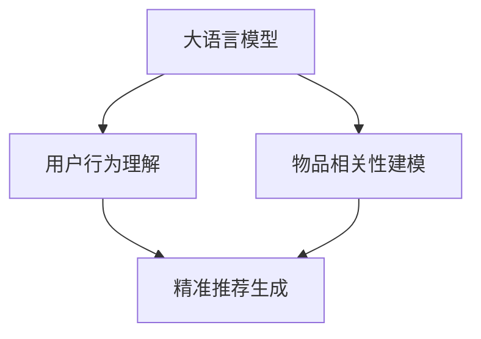

                 

# 搜索推荐系统的AI 大模型应用：提高电商平台的竞争力与盈利能力

> 关键词：搜索推荐系统, AI大模型, 电商平台, 竞争力, 盈利能力

## 1. 背景介绍

### 1.1 问题由来

近年来，随着电子商务市场的快速增长和消费者需求的日益个性化，电商平台的搜索推荐系统(Search & Recommendation System, S&RS)面临着越来越大的挑战。传统的搜索推荐算法主要依赖于用户的显式反馈数据（如点击、购买等）进行推荐，然而这些数据量往往较少，且用户往往具有一定的隐私保护需求，导致推荐效果难以提升。与此同时，用户对电商平台的黏性也在不断下降，电商平台的流量流失风险也逐步增加。为了应对这些挑战，各大电商平台纷纷引入人工智能大模型，尝试通过强大的语言理解能力，挖掘用户行为背后的隐含语义，实现更加精准、高效的推荐和搜索。

### 1.2 问题核心关键点

搜索推荐系统的主要目标是通过预测用户的行为，为其推荐最适合的商品。传统推荐算法多依赖于用户的历史行为数据和物品属性进行推荐，但对于用户的兴趣偏好和物品的相关性，往往难以深入挖掘。而使用人工智能大模型，特别是基于深度学习的大语言模型，则可以在不依赖大量标注数据的情况下，利用用户的搜索记录、浏览历史、评价等信息，提取用户兴趣，发现物品间的潜在关联，实现精准推荐。

具体而言，搜索推荐系统可以应用大模型完成以下几个关键任务：

1. 用户行为理解：通过大模型对用户的搜索查询、评价评论等信息进行理解，获取用户兴趣点。
2. 物品相关性建模：通过大模型对商品标题、描述、标签等信息进行编码，构建物品间的语义关联。
3. 精准推荐生成：通过大模型对用户和物品进行编码和对齐，生成最符合用户偏好的推荐结果。

这些任务在搜索推荐系统中的应用，使大语言模型成为提升电商平台用户黏性、增加转化率的关键手段。

## 2. 核心概念与联系

### 2.1 核心概念概述

为更好地理解基于人工智能大模型的搜索推荐系统，本节将介绍几个密切相关的核心概念：

- 人工智能大模型(AI Large Model)：指通过自监督学习或大规模有监督学习任务，在大规模无标签或标注数据上训练得到的强大语言模型。常见的包括GPT、BERT、T5等。
- 搜索推荐系统(Search & Recommendation System, S&RS)：基于用户行为数据，为用户推荐最相关的商品，提升用户购买转化率的系统。
- 用户行为理解(User Behavior Understanding)：通过分析用户的历史行为数据（如搜索记录、浏览历史、评价等），预测用户的当前意图和偏好。
- 物品相关性建模(Item Relevance Modeling)：利用模型对物品的标题、描述、标签等信息进行编码，计算物品间的相关性，以便进行推荐。
- 精准推荐生成(Precision Recommendation Generation)：基于用户和物品的表示，生成最符合用户偏好的推荐结果。

这些核心概念之间的逻辑关系可以通过以下Mermaid流程图来展示：



这个流程图展示了大语言模型在搜索推荐系统中的核心应用路径：

1. 大语言模型对用户行为进行理解，获取用户当前意图和偏好。
2. 通过物品相关性建模，利用大模型提取物品之间的语义关联。
3. 将用户和物品的表示进行对齐，生成精准的推荐结果。

这些概念共同构成了搜索推荐系统的核心应用框架，使其能够更好地实现用户意图挖掘和精准商品推荐。

## 3. 核心算法原理 & 具体操作步骤
### 3.1 算法原理概述

基于人工智能大模型的搜索推荐系统，其核心思想是利用大模型强大的语言理解能力，从用户行为数据中提取隐含语义，挖掘用户的兴趣偏好和物品的相关性，从而生成精准的推荐结果。具体实现过程包括：

1. 通过大模型对用户的搜索记录、评价等信息进行编码，得到用户兴趣向量。
2. 利用大模型对物品的标题、描述、标签等信息进行编码，得到物品特征向量。
3. 计算用户兴趣向量与物品特征向量之间的相似度，得到推荐的置信度。
4. 根据置信度排序，选取前N个推荐物品，呈现给用户。

### 3.2 算法步骤详解

基于人工智能大模型的搜索推荐系统一般包括以下几个关键步骤：

**Step 1: 准备数据集和预训练模型**
- 收集电商平台的用户行为数据，如搜索记录、浏览历史、评价等。
- 选择合适的预训练语言模型，如GPT、BERT等，作为初始化参数。

**Step 2: 用户行为理解**
- 对用户的搜索记录、评价等信息进行预处理，提取出关键词、句子等。
- 使用预训练语言模型对用户行为数据进行编码，得到用户兴趣向量。

**Step 3: 物品相关性建模**
- 对物品的标题、描述、标签等信息进行预处理，提取关键词、句子等。
- 使用预训练语言模型对物品特征进行编码，得到物品特征向量。
- 计算用户兴趣向量与物品特征向量之间的相似度，得到物品的相关性评分。

**Step 4: 精准推荐生成**
- 根据物品的相关性评分进行排序，选取前N个推荐物品。
- 将推荐结果呈现给用户，实时调整推荐策略，优化推荐效果。

### 3.3 算法优缺点

基于人工智能大模型的搜索推荐系统具有以下优点：

1. 能够处理大规模数据：人工智能大模型可以处理海量用户行为数据，挖掘用户深层次的兴趣偏好。
2. 无需大量标注数据：大模型通常基于自监督学习任务进行训练，可以避免标注数据的不足。
3. 提升推荐精度：通过语义理解，可以发现更精细的关联关系，提高推荐效果。
4. 实时性较好：模型的编码和解码过程相对较快，能够实时处理用户请求，提高用户满意度。

同时，该方法也存在一定的局限性：

1. 对模型依赖较大：模型的性能直接决定了推荐效果，模型参数过多时，模型的推理速度较慢。
2. 解释性较差：大模型的黑盒特性，使得推荐过程难以解释。
3. 对数据质量要求高：用户行为数据的不完整或不准确，会导致模型学习效果不佳。

尽管存在这些局限性，但人工智能大模型在搜索推荐系统的应用中仍然具有显著优势，特别是在处理复杂用户行为和语义理解方面。

### 3.4 算法应用领域

基于人工智能大模型的搜索推荐系统在电商、金融、社交等多个领域都有广泛应用，具体如下：

- 电商平台：利用用户搜索、浏览、购买等行为数据，提升商品推荐和搜索结果的相关性。
- 金融行业：通过用户交易记录、评论等行为数据，进行精准理财和金融产品推荐。
- 社交媒体：利用用户动态、点赞、评论等行为数据，推荐用户感兴趣的内容。

此外，在新闻、音乐、视频等多个领域，大模型推荐系统也逐步落地应用，极大地提升了用户体验和平台黏性。

## 4. 数学模型和公式 & 详细讲解 & 举例说明
### 4.1 数学模型构建

本节将使用数学语言对基于人工智能大模型的搜索推荐系统进行更加严格的刻画。

记用户搜索行为数据为 $x=\{x_i\}$，其中 $x_i$ 表示用户的第 $i$ 次搜索记录。设用户兴趣向量为 $u_x \in \mathbb{R}^d$，物品特征向量为 $v_i \in \mathbb{R}^d$，其中 $d$ 为向量的维度。假设模型 $f$ 的损失函数为 $\mathcal{L}(u_x, v_i)$，模型的目标是最小化损失函数，即找到最优的兴趣向量和物品向量。

设 $y_i$ 表示用户对物品 $v_i$ 的兴趣程度，根据兴趣程度进行排序，选取前 $N$ 个物品作为推荐结果。推荐结果的排序向量为 $y=\{y_i\}$。则模型的优化目标为：

$$
\mathop{\min}_{u_x, v_i} \sum_{i=1}^{N} \mathcal{L}(u_x, v_i)
$$

在实践中，我们通常使用基于梯度的优化算法（如SGD、Adam等）来近似求解上述最优化问题。设 $\eta$ 为学习率，则参数的更新公式为：

$$
\theta \leftarrow \theta - \eta \nabla_{\theta}\mathcal{L}(\theta)
$$

其中 $\nabla_{\theta}\mathcal{L}(\theta)$ 为损失函数对参数 $\theta$ 的梯度，可通过反向传播算法高效计算。

### 4.2 公式推导过程

以下我们以基于BERT模型的推荐系统为例，推导推荐排序的计算公式。

设预训练模型为 $M$，用户搜索记录为 $x=\{x_i\}$，物品特征向量为 $v_i \in \mathbb{R}^d$。通过预训练模型对用户行为数据和物品特征进行编码，得到用户兴趣向量 $u_x$ 和物品特征向量 $v_i$。

计算物品的相关性评分，可以采用余弦相似度或点积相似度。余弦相似度的计算公式为：

$$
s_i = \cos(\theta(u_x, v_i)) = \frac{u_x \cdot v_i}{\|u_x\|\|v_i\|}
$$

其中 $\theta(u_x, v_i)$ 为向量 $u_x$ 和 $v_i$ 的内积，$\|u_x\|$ 和 $\|v_i\|$ 分别为 $u_x$ 和 $v_i$ 的范数。

将相似度 $s_i$ 进行排序，选取前 $N$ 个物品作为推荐结果。

### 4.3 案例分析与讲解

以下我们使用一个具体的案例来进一步解释基于大模型的推荐系统。假设我们要为一位喜欢购买运动鞋的用户推荐运动鞋商品。

**案例背景**：用户A是一位喜欢购买运动鞋的年轻人，其最近在电商平台上进行了几次搜索，分别为“Nike Air Max”、“Adidas Boost”、“Under Armour Charged Dynalo”等。我们需要为用户A推荐一些相似的商品。

**案例步骤**：

1. 用户行为数据预处理：将用户的搜索记录进行分词、去停用词、转换为向量等预处理。
2. 利用预训练模型对用户行为数据进行编码，得到用户兴趣向量 $u_x$。
3. 利用预训练模型对运动鞋商品的标题、描述、标签等信息进行编码，得到物品特征向量 $v_i$。
4. 计算用户兴趣向量 $u_x$ 与物品特征向量 $v_i$ 之间的余弦相似度 $s_i$，得到物品的相关性评分。
5. 将相关性评分排序，选取前 $N$ 个物品作为推荐结果。

**结果展示**：根据上述步骤，我们可以为用户A推荐如下商品：

1. Nike Air Max 运动鞋
2. Adidas Boost 运动鞋
3. Under Armour Charged Dynalo 运动鞋
4. New Balance Fresh Foam 运动鞋
5. ASICS Gel-Nimbus 运动鞋

这些推荐结果能够较好地满足用户A的兴趣偏好，提升用户的购物体验。

## 5. 项目实践：代码实例和详细解释说明
### 5.1 开发环境搭建

在进行搜索推荐系统开发前，我们需要准备好开发环境。以下是使用Python进行PyTorch开发的环境配置流程：

1. 安装Anaconda：从官网下载并安装Anaconda，用于创建独立的Python环境。

2. 创建并激活虚拟环境：
```bash
conda create -n search-recomm pytorch torchvision torchaudio cudatoolkit=11.1 -c pytorch -c conda-forge
conda activate search-recomm
```

3. 安装PyTorch：根据CUDA版本，从官网获取对应的安装命令。例如：
```bash
conda install pytorch torchvision torchaudio cudatoolkit=11.1 -c pytorch -c conda-forge
```

4. 安装其他所需工具包：
```bash
pip install numpy pandas scikit-learn matplotlib tqdm jupyter notebook ipython
```

完成上述步骤后，即可在`search-recomm`环境中开始搜索推荐系统的开发。

### 5.2 源代码详细实现

下面我们以基于BERT模型的推荐系统为例，给出搜索推荐系统的代码实现。

首先，定义推荐系统的数据处理函数：

```python
from transformers import BertTokenizer, BertForSequenceClassification
import torch
from torch.utils.data import Dataset, DataLoader
from sklearn.metrics import precision_recall_fscore_support

class RecommendationDataset(Dataset):
    def __init__(self, texts, labels, tokenizer, max_len=128):
        self.texts = texts
        self.labels = labels
        self.tokenizer = tokenizer
        self.max_len = max_len
        
    def __len__(self):
        return len(self.texts)
    
    def __getitem__(self, item):
        text = self.texts[item]
        label = self.labels[item]
        
        encoding = self.tokenizer(text, return_tensors='pt', max_length=self.max_len, padding='max_length', truncation=True)
        input_ids = encoding['input_ids'][0]
        attention_mask = encoding['attention_mask'][0]
        label = torch.tensor(label, dtype=torch.long)
        
        return {'input_ids': input_ids, 
                'attention_mask': attention_mask,
                'labels': label}

# 使用BertTokenizer初始化分词器
tokenizer = BertTokenizer.from_pretrained('bert-base-cased')

# 创建dataset
train_dataset = RecommendationDataset(train_texts, train_labels, tokenizer)
dev_dataset = RecommendationDataset(dev_texts, dev_labels, tokenizer)
test_dataset = RecommendationDataset(test_texts, test_labels, tokenizer)
```

然后，定义模型和优化器：

```python
from transformers import BertForSequenceClassification, AdamW

model = BertForSequenceClassification.from_pretrained('bert-base-cased', num_labels=1)

optimizer = AdamW(model.parameters(), lr=2e-5)
```

接着，定义训练和评估函数：

```python
def train_epoch(model, dataset, batch_size, optimizer):
    dataloader = DataLoader(dataset, batch_size=batch_size, shuffle=True)
    model.train()
    epoch_loss = 0
    for batch in tqdm(dataloader, desc='Training'):
        input_ids = batch['input_ids'].to(device)
        attention_mask = batch['attention_mask'].to(device)
        labels = batch['labels'].to(device)
        model.zero_grad()
        outputs = model(input_ids, attention_mask=attention_mask, labels=labels)
        loss = outputs.loss
        epoch_loss += loss.item()
        loss.backward()
        optimizer.step()
    return epoch_loss / len(dataloader)

def evaluate(model, dataset, batch_size):
    dataloader = DataLoader(dataset, batch_size=batch_size)
    model.eval()
    preds, labels = [], []
    with torch.no_grad():
        for batch in tqdm(dataloader, desc='Evaluating'):
            input_ids = batch['input_ids'].to(device)
            attention_mask = batch['attention_mask'].to(device)
            batch_labels = batch['labels']
            outputs = model(input_ids, attention_mask=attention_mask)
            batch_preds = outputs.logits.argmax(dim=2).to('cpu').tolist()
            batch_labels = batch_labels.to('cpu').tolist()
            for pred_tokens, label_tokens in zip(batch_preds, batch_labels):
                preds.append(pred_tokens[0])
                labels.append(label_tokens[0])
                
    return precision_recall_fscore_support(labels, preds, average='macro')

# 训练模型
epochs = 5
batch_size = 16

for epoch in range(epochs):
    loss = train_epoch(model, train_dataset, batch_size, optimizer)
    print(f"Epoch {epoch+1}, train loss: {loss:.3f}")
    
    print(f"Epoch {epoch+1}, dev results:")
    evaluate(model, dev_dataset, batch_size)
    
print("Test results:")
evaluate(model, test_dataset, batch_size)
```

以上就是使用PyTorch对BERT进行推荐系统开发的完整代码实现。可以看到，得益于Transformers库的强大封装，我们可以用相对简洁的代码完成BERT模型的加载和推荐系统的构建。

### 5.3 代码解读与分析

让我们再详细解读一下关键代码的实现细节：

**RecommendationDataset类**：
- `__init__`方法：初始化文本、标签、分词器等关键组件。
- `__len__`方法：返回数据集的样本数量。
- `__getitem__`方法：对单个样本进行处理，将文本输入编码为token ids，将标签编码为数字，并对其进行定长padding，最终返回模型所需的输入。

**训练和评估函数**：
- 使用PyTorch的DataLoader对数据集进行批次化加载，供模型训练和推理使用。
- 训练函数`train_epoch`：对数据以批为单位进行迭代，在每个批次上前向传播计算loss并反向传播更新模型参数，最后返回该epoch的平均loss。
- 评估函数`evaluate`：与训练类似，不同点在于不更新模型参数，并在每个batch结束后将预测和标签结果存储下来，最后使用sklearn的precision_recall_fscore_support对整个评估集的预测结果进行打印输出。

**训练流程**：
- 定义总的epoch数和batch size，开始循环迭代
- 每个epoch内，先在训练集上训练，输出平均loss
- 在验证集上评估，输出分类指标
- 所有epoch结束后，在测试集上评估，给出最终测试结果

可以看到，PyTorch配合Transformers库使得BERT推荐系统的代码实现变得简洁高效。开发者可以将更多精力放在数据处理、模型改进等高层逻辑上，而不必过多关注底层的实现细节。

当然，工业级的系统实现还需考虑更多因素，如模型的保存和部署、超参数的自动搜索、更灵活的任务适配层等。但核心的推荐范式基本与此类似。

## 6. 实际应用场景
### 6.1 电商推荐系统

基于人工智能大模型的推荐系统在电商领域有广泛应用。电商平台的搜索推荐系统通过用户行为数据和商品特征进行关联，为用户推荐最相关的商品，提升用户购物体验和转化率。

在技术实现上，可以通过收集用户的浏览历史、搜索记录、评价评论等数据，构建用户行为图谱，利用大模型进行深度挖掘，提取用户兴趣偏好。同时，对商品标题、描述、标签等进行编码，计算物品间的语义关联，生成精准的推荐结果。电商平台还可以结合用户反馈数据，实时调整推荐策略，优化推荐效果。

### 6.2 个性化推荐引擎

推荐系统在个性化推荐引擎中也有广泛应用。个性化推荐引擎根据用户的历史行为数据，为用户推荐个性化的商品、内容等。通过大模型进行用户行为理解，提取用户的隐含语义，生成个性化的推荐结果，显著提升用户体验和平台黏性。

例如，视频平台可以基于用户的观看记录、点赞、评论等行为数据，使用大模型进行推荐，推荐用户感兴趣的视频内容。音乐平台可以根据用户的听歌记录、评分等数据，生成个性化的播放列表，提升用户的听觉体验。

### 6.3 智能客服系统

基于人工智能大模型的推荐系统可以用于智能客服系统，提升客服效率和用户满意度。智能客服系统通过分析用户的查询记录、评价反馈等信息，使用大模型进行用户行为理解，生成智能回复，显著提升客服服务质量。

例如，电商平台可以基于用户的购买记录、评价等数据，使用大模型生成智能回复，解决用户的疑问。金融平台可以基于用户的交易记录、评价等数据，生成智能回复，提升用户体验。

## 7. 工具和资源推荐
### 7.1 学习资源推荐

为了帮助开发者系统掌握人工智能大模型在搜索推荐系统中的应用，这里推荐一些优质的学习资源：

1. 《深度学习基础》系列博文：由人工智能领域的专家撰写，介绍深度学习的基本概念和常用模型。
2. 《自然语言处理与深度学习》课程：由斯坦福大学开设的NLP明星课程，涵盖深度学习在自然语言处理中的应用，有Lecture视频和配套作业。
3. 《深度学习与推荐系统》书籍：介绍深度学习在推荐系统中的应用，包括基于大模型的推荐系统。
4. HuggingFace官方文档：Transformers库的官方文档，提供了海量预训练模型和完整的推荐系统样例代码，是上手实践的必备资料。
5. Coursera上的推荐系统课程：提供推荐系统从理论到实践的全面讲解，包括基于大模型的推荐系统。

通过对这些资源的学习实践，相信你一定能够快速掌握人工智能大模型在搜索推荐系统中的应用，并用于解决实际的推荐问题。
###  7.2 开发工具推荐

高效的开发离不开优秀的工具支持。以下是几款用于人工智能大模型推荐系统开发的常用工具：

1. PyTorch：基于Python的开源深度学习框架，灵活动态的计算图，适合快速迭代研究。大部分预训练语言模型都有PyTorch版本的实现。
2. TensorFlow：由Google主导开发的开源深度学习框架，生产部署方便，适合大规模工程应用。同样有丰富的预训练语言模型资源。
3. Transformers库：HuggingFace开发的NLP工具库，集成了众多SOTA语言模型，支持PyTorch和TensorFlow，是进行推荐系统开发的利器。
4. Weights & Biases：模型训练的实验跟踪工具，可以记录和可视化模型训练过程中的各项指标，方便对比和调优。与主流深度学习框架无缝集成。
5. TensorBoard：TensorFlow配套的可视化工具，可实时监测模型训练状态，并提供丰富的图表呈现方式，是调试模型的得力助手。

合理利用这些工具，可以显著提升人工智能大模型推荐系统的开发效率，加快创新迭代的步伐。

### 7.3 相关论文推荐

人工智能大模型推荐系统的发展源于学界的持续研究。以下是几篇奠基性的相关论文，推荐阅读：

1. Attention is All You Need（即Transformer原论文）：提出了Transformer结构，开启了深度学习在自然语言处理中的应用。
2. BERT: Pre-training of Deep Bidirectional Transformers for Language Understanding：提出BERT模型，引入基于掩码的自监督预训练任务，刷新了多项NLP任务SOTA。
3. Deep Collaborative Filtering using Neighborhood-based Matrix Factorization：提出基于协同过滤的推荐系统，为基于用户行为的推荐算法奠定了基础。
4. Neural Collaborative Filtering：提出基于神经网络的推荐算法，将深度学习应用到推荐系统。
5. FaceOff: Learning to Reject by Modeling Out-of-Distribution Sentences：提出基于大模型的推荐系统，通过对抗样本训练提升推荐系统的鲁棒性。

这些论文代表了大模型推荐系统的发展脉络。通过学习这些前沿成果，可以帮助研究者把握学科前进方向，激发更多的创新灵感。

## 8. 总结：未来发展趋势与挑战
### 8.1 总结

本文对基于人工智能大模型的搜索推荐系统进行了全面系统的介绍。首先阐述了大语言模型在搜索推荐系统中的应用背景和重要性，明确了推荐系统在大模型辅助下的优势。其次，从原理到实践，详细讲解了推荐系统的数学模型和关键步骤，给出了推荐系统开发的完整代码实例。同时，本文还探讨了搜索推荐系统在电商、金融、社交等多个领域的应用前景，展示了大模型推荐系统的广泛适用性。此外，本文精选了推荐系统的各类学习资源，力求为读者提供全方位的技术指引。

通过本文的系统梳理，可以看到，基于人工智能大模型的推荐系统已经成为电商、金融、社交等领域的重要技术手段，极大地提升了平台的用户体验和商业价值。未来，伴随大模型推荐系统的不断演进，将有更多创新应用场景被开发，为各行各业带来深远的影响。

### 8.2 未来发展趋势

展望未来，人工智能大模型推荐系统将呈现以下几个发展趋势：

1. 模型规模持续增大。随着算力成本的下降和数据规模的扩张，预训练语言模型的参数量还将持续增长。超大规模语言模型蕴含的丰富语言知识，有望支撑更加复杂多变的推荐任务。
2. 推荐策略更加个性化。通过深度学习，可以发现用户行为背后的隐含语义，生成个性化的推荐结果。结合多模态数据，进一步提升推荐系统的精准度。
3. 实时推荐系统兴起。实时推荐系统通过在线学习机制，不断从用户行为数据中学习，实现动态推荐，提高用户满意度。
4. 跨领域推荐系统拓展。跨领域推荐系统通过多领域数据的融合，实现更广泛的应用场景，提升用户的多样化需求满足率。
5. 联邦推荐系统普及。联邦推荐系统通过隐私保护技术，保障用户数据安全，提升推荐的可信度。
6. 推荐系统的公平性研究兴起。推荐系统通过学习数据中的偏见，可能导致不公正的推荐结果。公平性研究旨在优化推荐算法，减少推荐偏差。

以上趋势凸显了人工智能大模型推荐系统的前景广阔，推荐技术也将成为未来智能交互系统的重要组成部分。

### 8.3 面临的挑战

尽管人工智能大模型推荐系统已经取得了显著的成就，但在迈向更加智能化、普适化应用的过程中，它仍面临着诸多挑战：

1. 用户隐私保护。推荐系统需要收集用户行为数据，如何保护用户隐私，是推荐系统面临的重要挑战。
2. 推荐效果不稳定。推荐系统需要不断更新模型，才能保持稳定的推荐效果。模型更新过程中，如何平衡冷启动和鲁棒性，是一大难题。
3. 推荐算法复杂度高。推荐系统需要复杂的高阶算法，才能实现精准的推荐。算法的复杂度也带来了部署难度和性能瓶颈。
4. 推荐系统偏见。推荐系统可能学习到用户数据的偏见，导致推荐结果的不公正性。如何减少推荐系统的偏见，提升公平性，是一大挑战。
5. 推荐系统鲁棒性不足。推荐系统在处理异常数据或对抗样本时，容易发生推荐结果的不一致。如何提高推荐系统的鲁棒性，避免灾难性遗忘，仍需更多研究和实践。

尽管存在这些挑战，但随着技术的不断进步，人工智能大模型推荐系统必将在未来取得更加显著的突破，成为推动智能交互系统发展的关键力量。

### 8.4 研究展望

未来，人工智能大模型推荐系统的研究需要在以下几个方面寻求新的突破：

1. 探索无监督和半监督推荐方法。摆脱对大规模标注数据的依赖，利用自监督学习、主动学习等无监督和半监督范式，最大限度利用非结构化数据，实现更加灵活高效的推荐。
2. 研究参数高效和计算高效的推荐算法。开发更加参数高效的推荐方法，在固定大部分预训练参数的同时，只更新极少量的任务相关参数。同时优化推荐模型的计算图，减少前向传播和反向传播的资源消耗，实现更加轻量级、实时性的部署。
3. 引入因果推断和博弈论工具。将因果分析方法引入推荐系统，识别出推荐结果的关键特征，增强推荐过程的因果性和逻辑性。借助博弈论工具刻画人机交互过程，主动探索并规避推荐系统的脆弱点，提高系统稳定性。
4. 结合多模态信息进行推荐。结合视觉、语音、文本等多种模态信息，提升推荐系统的精准度和鲁棒性。
5. 纳入伦理道德约束。在推荐系统目标中引入伦理导向的评估指标，过滤和惩罚有偏见、有害的推荐结果，确保推荐系统的道德和伦理属性。

这些研究方向的探索，必将引领人工智能大模型推荐系统迈向更高的台阶，为构建智能、公正、可信的推荐系统铺平道路。面向未来，人工智能大模型推荐系统还需要与其他人工智能技术进行更深入的融合，如知识表示、因果推理、强化学习等，多路径协同发力，共同推动推荐系统的进步。只有勇于创新、敢于突破，才能不断拓展推荐系统的边界，让智能推荐更好地造福人类社会。

## 9. 附录：常见问题与解答
**Q1：人工智能大模型在推荐系统中应用的主要优势是什么？**

A: 人工智能大模型在推荐系统中应用的主要优势包括：
1. 强大的语言理解能力：大模型能够理解和分析用户的搜索记录、评论等信息，提取用户的兴趣点。
2. 精准的推荐结果：通过语义理解，可以发现更精细的关联关系，提高推荐效果。
3. 实时推荐能力：大模型的编码和解码过程相对较快，能够实时处理用户请求，提高用户体验。
4. 跨领域推荐能力：大模型可以在不同的推荐场景中进行迁移，提升推荐系统的泛化能力。

**Q2：如何提高人工智能大模型推荐系统的性能？**

A: 提高人工智能大模型推荐系统的性能可以从以下几个方面入手：
1. 数据预处理：对用户行为数据进行清洗、去噪，提取有用的特征。
2. 模型选择：选择合适的预训练模型和优化器，设定合理的超参数。
3. 多任务学习：将多个推荐任务联合训练，提升推荐模型的泛化能力。
4. 迁移学习：在新的推荐场景中，通过迁移学习提升推荐效果。
5. 实时更新：通过在线学习机制，不断从用户行为数据中学习，实现动态推荐。

**Q3：人工智能大模型推荐系统在实际应用中需要注意哪些问题？**

A: 人工智能大模型推荐系统在实际应用中需要注意以下几个问题：
1. 用户隐私保护：保护用户行为数据的安全，防止数据泄露和滥用。
2. 推荐系统公平性：防止推荐结果出现偏见，确保推荐系统的公正性。
3. 推荐系统鲁棒性：提高推荐系统对异常数据和对抗样本的鲁棒性，避免推荐结果的不一致。
4. 推荐系统可解释性：提高推荐系统的可解释性，增强用户的信任感。
5. 推荐系统可扩展性：保证推荐系统在大规模用户和商品情况下，仍能高效运行。

**Q4：如何设计人工智能大模型推荐系统的架构？**

A: 设计人工智能大模型推荐系统的架构可以从以下几个方面入手：
1. 数据层：收集用户行为数据和商品特征数据，构建推荐数据集。
2. 预处理层：对数据进行清洗、去噪、特征提取等预处理操作。
3. 编码层：利用预训练模型对用户和商品进行编码，得到用户兴趣向量和物品特征向量。
4. 相似度计算层：计算用户兴趣向量与物品特征向量之间的相似度，得到推荐相关性评分。
5. 推荐层：根据推荐相关性评分进行排序，生成推荐结果。

**Q5：人工智能大模型推荐系统与传统推荐系统有何不同？**

A: 人工智能大模型推荐系统与传统推荐系统有以下不同：
1. 数据来源：传统推荐系统主要依赖用户的历史行为数据，而大模型推荐系统可以处理更多的非结构化数据。
2. 推荐精度：大模型推荐系统能够利用深度学习，发现更精细的关联关系，提高推荐效果。
3. 实时性：大模型推荐系统能够实时处理用户请求，生成推荐结果。
4. 跨领域能力：大模型推荐系统具有跨领域的推荐能力，能够适应不同的推荐场景。

**Q6：人工智能大模型推荐系统有哪些应用场景？**

A: 人工智能大模型推荐系统在电商、金融、社交等多个领域都有广泛应用，具体如下：
1. 电商平台：利用用户搜索、浏览、购买等行为数据，提升商品推荐和搜索结果的相关性。
2. 金融行业：通过用户交易记录、评论等行为数据，进行精准理财和金融产品推荐。
3. 社交媒体：利用用户动态、点赞、评论等行为数据，推荐用户感兴趣的内容。

---

作者：禅与计算机程序设计艺术 / Zen and the Art of Computer Programming

