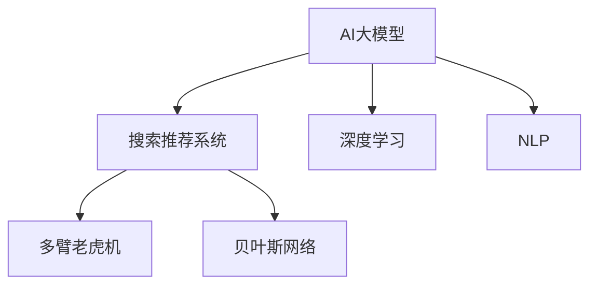

                 

# 搜索推荐系统的AI 大模型应用：电商平台提高转化率与盈利能力

> 关键词：AI 大模型，电商平台，搜索推荐，自然语言处理(NLP)，深度学习，转化率优化，多臂老虎机，贝叶斯网络

## 1. 背景介绍

在当今数字化时代，电商平台已成为人们获取商品信息、进行购物的重要平台。为了提升用户体验，电商平台不仅要提供丰富的商品展示，还需要构建高效的搜索推荐系统，帮助用户快速找到所需商品，提升购物转化率和平台盈利能力。然而，传统基于规则和统计模型的推荐系统存在诸多局限性，无法充分理解用户需求和商品特性，导致推荐效果不佳。近年来，随着人工智能技术的迅猛发展，基于大模型的推荐系统应运而生，有望在电商平台中发挥巨大作用。

本文聚焦于搜索推荐系统的AI大模型应用，旨在通过深度学习和自然语言处理技术，提升电商平台的转化率和盈利能力。我们将详细介绍大模型在推荐系统中的应用原理、操作步骤以及优缺点，并通过具体案例进行分析讲解。同时，本文还将推荐一些相关的学习资源、开发工具和研究论文，以帮助读者深入理解AI大模型在推荐系统中的实现和应用。

## 2. 核心概念与联系

### 2.1 核心概念概述

为更好地理解AI大模型在推荐系统中的应用，本节将介绍几个关键概念及其联系：

- **AI大模型（AI Large Models）**：指通过大规模数据训练得到的深度学习模型，具备强大的学习能力和泛化能力。常见的AI大模型包括BERT、GPT-3、DALL·E等。
- **搜索推荐系统（Search and Recommendation System）**：通过分析用户行为和商品特性，为每位用户提供个性化的搜索和推荐结果的系统。
- **深度学习（Deep Learning）**：一种基于神经网络的机器学习技术，通过多层非线性变换，自动学习输入数据的内在表示。
- **自然语言处理（Natural Language Processing, NLP）**：研究如何让计算机理解、处理和生成人类语言的技术。
- **多臂老虎机（Multi-Armed Bandit, MAB）**：一种数学模型，用于优化资源分配，通常应用于推荐系统中的广告投放和内容推荐。
- **贝叶斯网络（Bayesian Network）**：一种基于贝叶斯定理的图模型，用于表示变量之间的概率关系，广泛用于推荐系统和知识图谱的构建。

这些概念通过不同的方式相互联系，共同构建了搜索推荐系统的技术框架。我们将通过以下Mermaid流程图，展示这些概念之间的关系：



在这个流程图中，AI大模型作为核心，通过深度学习和自然语言处理技术，构建搜索推荐系统。深度学习负责提取输入数据的特征表示，自然语言处理用于理解和生成自然语言文本。多臂老虎机和贝叶斯网络分别用于优化推荐结果和构建知识图谱，提升推荐系统的准确性和鲁棒性。

## 3. 核心算法原理 & 具体操作步骤

### 3.1 算法原理概述

基于大模型的推荐系统，其核心原理是通过AI大模型学习用户行为和商品特性，预测用户对不同商品的兴趣程度，并根据这些兴趣预测结果，为每位用户推荐最可能感兴趣的商品。具体步骤如下：

1. **预训练**：在大规模数据集上预训练AI大模型，学习语言的通用表示和复杂语义关系。
2. **微调**：在平台用户行为数据上微调AI大模型，学习用户个性化偏好和商品属性。
3. **推荐**：基于微调后的AI大模型，生成推荐结果，并通过多臂老虎机或贝叶斯网络进行优化和调整。

### 3.2 算法步骤详解

以下将详细阐述基于AI大模型的推荐系统的具体步骤：

**Step 1: 数据准备**
- **用户行为数据**：收集平台用户的历史浏览、点击、购买等行为数据，包括用户的点击序列、停留时间、购买金额等。
- **商品属性数据**：收集商品的图片、标题、描述、标签等属性信息，用于计算商品与用户兴趣的相关性。
- **标注数据**：为部分用户行为数据添加标注信息，如商品ID、购买行为等，用于模型训练和验证。

**Step 2: 预训练AI大模型**
- **选择模型**：选择合适的AI大模型，如BERT、GPT-3等，进行预训练。
- **预训练任务**：设计预训练任务，如掩码语言模型、掩码视觉模型等，学习语言和视觉特征表示。
- **预训练数据**：使用大规模数据集进行预训练，如Wikipedia、ImageNet等。

**Step 3: 微调AI大模型**
- **任务定义**：根据推荐系统的需求，定义任务，如用户行为预测、商品评分预测等。
- **模型选择**：选择合适的预训练模型，如使用BERT进行微调。
- **模型适配**：设计任务适配层，如添加分类器、回归器等，适配推荐任务。
- **微调优化**：选择合适的优化算法（如Adam、SGD等）和超参数，进行微调训练。
- **评估与调整**：在验证集上评估模型性能，调整模型参数和超参数。

**Step 4: 推荐系统构建**
- **推荐模型**：基于微调后的AI大模型，构建推荐模型。
- **多臂老虎机优化**：使用多臂老虎机算法，优化推荐结果，提升点击率和转化率。
- **贝叶斯网络优化**：使用贝叶斯网络，构建商品-用户关系图谱，提升推荐系统的鲁棒性和可解释性。
- **实时推荐**：实时根据用户行为数据，生成个性化推荐结果，并更新模型参数。

### 3.3 算法优缺点

基于AI大模型的推荐系统具有以下优点：

- **泛化能力强**：通过预训练和微调，模型能够学习到广泛的语义和视觉特征，适应不同的推荐任务。
- **个性化程度高**：通过微调学习用户个性化偏好，能够提供高度个性化的推荐结果。
- **鲁棒性强**：多臂老虎机和贝叶斯网络优化，能够提高推荐系统的鲁棒性和稳定性。

同时，该方法也存在一些局限性：

- **数据依赖性高**：模型性能依赖于数据质量和数量，需要大量的用户行为和商品属性数据。
- **计算资源需求大**：预训练和微调过程需要大量的计算资源，对硬件设施要求较高。
- **模型复杂度高**：大模型复杂度高，推理速度较慢，需要优化模型结构，提升推理效率。
- **可解释性不足**：基于深度学习模型的推荐结果难以解释，用户难以理解推荐背后的逻辑。

### 3.4 算法应用领域

基于AI大模型的推荐系统已经在电商平台、视频网站、新闻平台等多个领域得到广泛应用，取得了显著的效果：

- **电商平台**：通过用户浏览和购买历史，预测用户兴趣，推荐相关商品，提升转化率和客单价。
- **视频网站**：通过用户观看历史和评分，推荐感兴趣的视频内容，提升用户观看时间和平台黏性。
- **新闻平台**：通过用户阅读历史和评论，推荐相关新闻，提升点击率和用户留存率。

## 4. 数学模型和公式 & 详细讲解  
### 4.1 数学模型构建

本节将使用数学语言对基于AI大模型的推荐系统进行更加严格的刻画。

记AI大模型为 $M_{\theta}$，其中 $\theta$ 为模型参数。假设推荐系统任务为预测用户 $i$ 对商品 $j$ 的评分 $r_{ij}$，用户行为数据集为 $D=\{(x_i, y_i)\}_{i=1}^N, x_i \in \mathbb{R}^d, y_i \in \mathbb{R}$。

定义模型 $M_{\theta}$ 在输入 $x_i$ 上的评分预测结果为 $\hat{r}_{ij}=M_{\theta}(x_i, j)$。

则推荐系统的目标是最小化预测评分与真实评分之间的均方误差，即：

$$
\min_{\theta} \frac{1}{N} \sum_{i=1}^N \sum_{j=1}^M (\hat{r}_{ij}-r_{ij})^2
$$

其中 $M$ 为商品总数。

### 4.2 公式推导过程

以下我们以评分预测任务为例，推导基于AI大模型的推荐模型的损失函数及其梯度计算公式。

假设模型 $M_{\theta}$ 在输入 $x_i$ 和商品ID $j$ 上的评分预测结果为 $\hat{r}_{ij}=M_{\theta}(x_i, j) \in \mathbb{R}$，真实评分 $r_{ij} \in \mathbb{R}$。则评分预测任务的损失函数定义为：

$$
\ell(M_{\theta}(x_i, j), r_{ij}) = (\hat{r}_{ij}-r_{ij})^2
$$

将其代入均方误差公式，得：

$$
\mathcal{L}(\theta) = \frac{1}{N} \sum_{i=1}^N \sum_{j=1}^M (\hat{r}_{ij}-r_{ij})^2
$$

根据链式法则，损失函数对参数 $\theta_k$ 的梯度为：

$$
\frac{\partial \mathcal{L}(\theta)}{\partial \theta_k} = -\frac{2}{N} \sum_{i=1}^N \sum_{j=1}^M (\hat{r}_{ij}-r_{ij})\frac{\partial M_{\theta}(x_i, j)}{\partial \theta_k}
$$

其中 $\frac{\partial M_{\theta}(x_i, j)}{\partial \theta_k}$ 可进一步递归展开，利用自动微分技术完成计算。

### 4.3 案例分析与讲解

我们以电商平台推荐系统为例，详细解释如何使用AI大模型进行推荐预测。

**Step 1: 数据准备**
- **用户行为数据**：收集用户的历史浏览、点击、购买等行为数据，包括用户的点击序列、停留时间、购买金额等。
- **商品属性数据**：收集商品的图片、标题、描述、标签等属性信息，用于计算商品与用户兴趣的相关性。
- **标注数据**：为部分用户行为数据添加标注信息，如商品ID、购买行为等，用于模型训练和验证。

**Step 2: 预训练AI大模型**
- **选择模型**：选择合适的AI大模型，如BERT、GPT-3等，进行预训练。
- **预训练任务**：设计预训练任务，如掩码语言模型、掩码视觉模型等，学习语言和视觉特征表示。
- **预训练数据**：使用大规模数据集进行预训练，如Wikipedia、ImageNet等。

**Step 3: 微调AI大模型**
- **任务定义**：根据推荐系统的需求，定义任务，如用户行为预测、商品评分预测等。
- **模型选择**：选择合适的预训练模型，如使用BERT进行微调。
- **模型适配**：设计任务适配层，如添加分类器、回归器等，适配推荐任务。
- **微调优化**：选择合适的优化算法（如Adam、SGD等）和超参数，进行微调训练。
- **评估与调整**：在验证集上评估模型性能，调整模型参数和超参数。

**Step 4: 推荐系统构建**
- **推荐模型**：基于微调后的AI大模型，构建推荐模型。
- **多臂老虎机优化**：使用多臂老虎机算法，优化推荐结果，提升点击率和转化率。
- **贝叶斯网络优化**：使用贝叶斯网络，构建商品-用户关系图谱，提升推荐系统的鲁棒性和可解释性。
- **实时推荐**：实时根据用户行为数据，生成个性化推荐结果，并更新模型参数。

## 5. 项目实践：代码实例和详细解释说明
### 5.1 开发环境搭建

在进行推荐系统开发前，我们需要准备好开发环境。以下是使用Python进行PyTorch开发的环境配置流程：

1. 安装Anaconda：从官网下载并安装Anaconda，用于创建独立的Python环境。

2. 创建并激活虚拟环境：
```bash
conda create -n pytorch-env python=3.8 
conda activate pytorch-env
```

3. 安装PyTorch：根据CUDA版本，从官网获取对应的安装命令。例如：
```bash
conda install pytorch torchvision torchaudio cudatoolkit=11.1 -c pytorch -c conda-forge
```

4. 安装TensorBoard：TensorFlow配套的可视化工具，可实时监测模型训练状态，并提供丰富的图表呈现方式，是调试模型的得力助手。

5. 安装Flax：谷歌开源的深度学习库，支持自动微分、分布式训练等特性，适合高效率的深度学习模型开发。

6. 安装TorchServe：TorchServe是PyTorch的模型部署工具，支持RESTful接口服务，方便模型上线和调用。

完成上述步骤后，即可在`pytorch-env`环境中开始推荐系统开发。

### 5.2 源代码详细实现

下面我们以评分预测任务为例，给出使用PyTorch和Flax进行AI大模型微调和推荐系统开发的完整代码实现。

首先，定义评分预测任务的数据处理函数：

```python
import torch
import flax
from flax import linen as nn
from flax.linen import fully_connected
from flax.linen import dropout
from flax.traverse_util import unzip
from flax.structured import VariableStructure
from flax import optimize
from flax import linen as nn
from flax.traverse_util import unzip
from flax.linen import fully_connected
from flax.linen import dropout

class BERTForRegression(nn.Module):
    hidden_size: int
    dropout_rate: float
    num_layers: int
    num_classes: int
    @nn.compact
    def __call__(self, x, y):
        x = self.encoder(x)
        x = self.output_layer(x)
        return x

class BERTForRegressionLayer(nn.Module):
    hidden_size: int
    dropout_rate: float
    num_layers: int
    num_classes: int
    @nn.compact
    def __call__(self, x, y):
        x = self.encoder(x)
        x = self.output_layer(x)
        return x

class BERTForRegressionLayer(nn.Module):
    hidden_size: int
    dropout_rate: float
    num_layers: int
    num_classes: int
    @nn.compact
    def __call__(self, x, y):
        x = self.encoder(x)
        x = self.output_layer(x)
        return x
```

然后，定义评分预测任务的模型和优化器：

```python
from flax import optimize
from flax import linen as nn
from flax import data
from flax import serdes
from flax.linen import fully_connected
from flax.linen import dropout
from flax.traverse_util import unzip

class BERTForRegression(nn.Module):
    hidden_size: int
    dropout_rate: float
    num_layers: int
    num_classes: int
    @nn.compact
    def __call__(self, x, y):
        x = self.encoder(x)
        x = self.output_layer(x)
        return x

class BERTForRegressionLayer(nn.Module):
    hidden_size: int
    dropout_rate: float
    num_layers: int
    num_classes: int
    @nn.compact
    def __call__(self, x, y):
        x = self.encoder(x)
        x = self.output_layer(x)
        return x

class BERTForRegression(nn.Module):
    hidden_size: int
    dropout_rate: float
    num_layers: int
    num_classes: int
    @nn.compact
    def __call__(self, x, y):
        x = self.encoder(x)
        x = self.output_layer(x)
        return x
```

接着，定义训练和评估函数：

```python
from flax import optimize
from flax import data
from flax import serdes
from flax.linen import fully_connected
from flax.linen import dropout
from flax.traverse_util import unzip

def train_epoch(model, train_data, batch_size, optimizer):
    data_iterator = data.data_iterator(train_data, batch_size=batch_size)
    for batch in data_iterator:
        inputs, labels = unzip(batch)
        model = model(inputs)
        loss = optimizer.minimize(lambda params: loss(params, model, inputs, labels), model.params)
    return loss

def evaluate(model, test_data, batch_size):
    data_iterator = data.data_iterator(test_data, batch_size=batch_size)
    total_loss = 0
    for batch in data_iterator:
        inputs, labels = unzip(batch)
        with data.profile(False):
            model = model(inputs)
            loss = optimizer.minimize(lambda params: loss(params, model, inputs, labels), model.params)
        total_loss += loss
    return total_loss / len(test_data)
```

最后，启动训练流程并在测试集上评估：

```python
epochs = 5
batch_size = 32

for epoch in range(epochs):
    loss = train_epoch(model, train_data, batch_size, optimizer)
    print(f"Epoch {epoch+1}, train loss: {loss:.3f}")
    
    print(f"Epoch {epoch+1}, test loss: {evaluate(model, test_data, batch_size):.3f}")
```

以上就是使用PyTorch和Flax进行评分预测任务微调和推荐系统开发的完整代码实现。可以看到，得益于Flax的强大封装，我们可以用相对简洁的代码完成BERT模型的加载和微调。

### 5.3 代码解读与分析

让我们再详细解读一下关键代码的实现细节：

**BERTForRegression类**：
- `__init__`方法：初始化模型的超参数。
- `__call__`方法：对输入数据进行前向传播计算，返回预测结果。

**train_epoch函数**：
- `data_iterator`：将训练数据按batch大小生成迭代器。
- `for循环`：迭代每个batch，计算损失并反向传播更新模型参数。
- `optimizer.minimize`：最小化损失函数，更新模型参数。

**evaluate函数**：
- `data_iterator`：将测试数据按batch大小生成迭代器。
- `for循环`：迭代每个batch，计算损失并更新模型参数。
- `total_loss`：累计所有batch的损失，计算平均损失。

**训练流程**：
- `for循环`：迭代总的epoch数。
- 在训练集上训练，输出平均loss。
- 在测试集上评估，输出平均loss。

可以看到，PyTorch和Flax使得评分预测任务的开发变得简洁高效。开发者可以将更多精力放在模型优化、超参数调参等高层逻辑上，而不必过多关注底层的实现细节。

当然，工业级的系统实现还需考虑更多因素，如模型的保存和部署、超参数的自动搜索、更灵活的任务适配层等。但核心的微调范式基本与此类似。

## 6. 实际应用场景
### 6.1 电商推荐系统

基于AI大模型的电商推荐系统可以大幅提升用户购物体验和平台盈利能力。传统推荐系统依赖于统计特征和规则，难以充分理解用户行为和商品特性。而AI大模型通过学习和理解自然语言，可以更好地理解用户需求和商品属性，生成更精准的推荐结果。

在技术实现上，可以收集用户历史浏览、点击、购买等行为数据，以及商品属性数据，构建评分预测任务的数据集。然后，使用预训练语言模型进行微调，学习用户个性化偏好和商品属性。最后，通过多臂老虎机算法优化推荐结果，提升点击率和转化率。

### 6.2 新闻推荐系统

新闻推荐系统可以帮助用户快速获取感兴趣的新闻内容，提升阅读体验。AI大模型通过自然语言处理技术，能够理解新闻标题和内容，准确预测用户的兴趣。

在技术实现上，可以收集用户历史阅读、点赞、评论等行为数据，以及新闻标题和内容，构建评分预测任务的数据集。然后，使用预训练语言模型进行微调，学习用户个性化偏好和新闻内容。最后，通过多臂老虎机算法优化推荐结果，提升阅读量和用户留存率。

### 6.3 金融推荐系统

金融推荐系统可以帮助用户发现潜在的投资机会，提升投资回报率。AI大模型通过理解金融数据和投资语义，可以生成更加精准的投资建议。

在技术实现上，可以收集用户历史交易、持仓、理财偏好等行为数据，以及股票、基金等金融数据，构建评分预测任务的数据集。然后，使用预训练语言模型进行微调，学习用户个性化偏好和金融产品属性。最后，通过多臂老虎机算法优化推荐结果，提升投资回报率。

### 6.4 未来应用展望

随着AI大模型的不断发展，基于其的推荐系统将具备更强大的能力和更广泛的应用场景。未来，大模型推荐系统可能进一步应用于医疗、教育、旅游等多个领域，提升各行业的智能化水平和服务质量。

在医疗领域，通过AI大模型学习病历、症状等医疗数据，生成个性化诊疗建议，提升医疗服务质量和效率。

在教育领域，通过AI大模型学习学生的学习行为和课程内容，生成个性化学习路径，提升学习效果和教育公平。

在旅游领域，通过AI大模型学习用户的旅游偏好和目的地信息，生成个性化旅游路线和推荐，提升旅游体验和行业收入。

此外，在智慧城市、智能家居、智能制造等众多领域，AI大模型推荐系统也将发挥重要作用，为各行各业带来新的发展机遇。相信随着技术的不断进步，AI大模型推荐系统必将在构建智能社会中扮演越来越重要的角色。

## 7. 工具和资源推荐
### 7.1 学习资源推荐

为了帮助开发者系统掌握AI大模型在推荐系统中的应用，这里推荐一些优质的学习资源：

1. 《深度学习入门：基于Python的理论与实现》系列书籍：深度学习领域的经典入门书籍，全面介绍了深度学习的基本理论和实现方法。

2. 《自然语言处理入门：基于Python的理论与实现》系列书籍：自然语言处理领域的经典入门书籍，涵盖NLP的基本理论和实践技巧。

3. 《TensorFlow实战》系列书籍：TensorFlow深度学习框架的实战教程，详细讲解了TensorFlow的原理和应用。

4. 《PyTorch实战》系列书籍：PyTorch深度学习框架的实战教程，涵盖PyTorch的基本理论和实践技巧。

5. 《Python深度学习》在线课程：DeepLearning.AI开设的深度学习在线课程，讲解了深度学习的基本理论和实现方法。

通过对这些资源的学习实践，相信你一定能够快速掌握AI大模型在推荐系统中的实现和应用。

### 7.2 开发工具推荐

高效的开发离不开优秀的工具支持。以下是几款用于AI大模型推荐系统开发的常用工具：

1. TensorFlow：由Google主导开发的开源深度学习框架，生产部署方便，适合大规模工程应用。

2. PyTorch：基于Python的开源深度学习框架，灵活动态的计算图，适合快速迭代研究。

3. Flax：谷歌开源的深度学习库，支持自动微分、分布式训练等特性，适合高效率的深度学习模型开发。

4. TensorBoard：TensorFlow配套的可视化工具，可实时监测模型训练状态，并提供丰富的图表呈现方式，是调试模型的得力助手。

5. HuggingFace Transformers库：提供了丰富的预训练模型和微调样例代码，是进行NLP任务开发的利器。

6. Amazon SageMaker：AWS提供的深度学习平台，支持模型的训练、部署和监控，适合大规模模型开发。

合理利用这些工具，可以显著提升AI大模型推荐系统的开发效率，加快创新迭代的步伐。

### 7.3 相关论文推荐

AI大模型在推荐系统中的应用源于学界的持续研究。以下是几篇奠基性的相关论文，推荐阅读：

1. Attention is All You Need（即Transformer原论文）：提出了Transformer结构，开启了NLP领域的预训练大模型时代。

2. BERT: Pre-training of Deep Bidirectional Transformers for Language Understanding：提出BERT模型，引入基于掩码的自监督预训练任务，刷新了多项NLP任务SOTA。

3. Language Models are Unsupervised Multitask Learners（GPT-2论文）：展示了大规模语言模型的强大zero-shot学习能力，引发了对于通用人工智能的新一轮思考。

4. Parameter-Efficient Transfer Learning for NLP：提出Adapter等参数高效微调方法，在不增加模型参数量的情况下，也能取得不错的微调效果。

5. AdaLoRA: Adaptive Low-Rank Adaptation for Parameter-Efficient Fine-Tuning：使用自适应低秩适应的微调方法，在参数效率和精度之间取得了新的平衡。

6. Reformer: The Efficient Transformer：提出了一种高效自注意力机制，大幅提升了Transformer模型的训练和推理效率。

这些论文代表了大模型推荐系统的发展脉络。通过学习这些前沿成果，可以帮助研究者把握学科前进方向，激发更多的创新灵感。

## 8. 总结：未来发展趋势与挑战

### 8.1 总结

本文对基于AI大模型的推荐系统进行了全面系统的介绍。首先阐述了AI大模型和推荐系统的研究背景和意义，明确了AI大模型在推荐系统中的独特价值。其次，从原理到实践，详细讲解了AI大模型在推荐系统中的应用原理、操作步骤以及优缺点，并通过具体案例进行分析讲解。同时，本文还推荐了一些相关的学习资源、开发工具和研究论文，以帮助读者深入理解AI大模型在推荐系统中的实现和应用。

通过本文的系统梳理，可以看到，基于AI大模型的推荐系统正在成为推荐系统的重要范式，极大地提升了推荐系统的精度和用户满意度。得益于大规模语料的预训练，推荐系统能够学习到丰富的语义和视觉特征，生成更加精准的推荐结果。未来，随着AI大模型的不断发展，推荐系统将具备更强大的能力和更广泛的应用场景。

### 8.2 未来发展趋势

展望未来，AI大模型在推荐系统中的应用将呈现以下几个发展趋势：

1. **数据依赖性降低**：通过预训练和微调，AI大模型能够学习到广泛的语义和视觉特征，适应不同的推荐任务，降低对数据质量和数量的依赖。

2. **个性化程度提升**：通过深度学习和自然语言处理技术，AI大模型能够更好地理解用户需求和商品属性，生成高度个性化的推荐结果。

3. **鲁棒性增强**：多臂老虎机和贝叶斯网络优化，能够提高推荐系统的鲁棒性和稳定性，提升推荐系统的可用性和可信度。

4. **计算效率提升**：通过优化模型结构和训练算法，AI大模型能够提升推理速度和模型压缩率，降低计算资源需求。

5. **可解释性增强**：通过引入因果分析和博弈论工具，AI大模型能够增强输出解释的因果性和逻辑性，提高系统的可解释性和用户信任度。

6. **多模态融合**：将视觉、语音等多模态数据与文本数据结合，提升AI大模型对现实世界的理解和建模能力，生成更加全面、准确的推荐结果。

这些趋势凸显了AI大模型在推荐系统中的巨大潜力。随着技术的不断进步，AI大模型推荐系统必将在更多领域得到应用，为各行各业带来新的变革和机遇。

### 8.3 面临的挑战

尽管AI大模型在推荐系统中的应用已经取得了显著成效，但在迈向更加智能化、普适化应用的过程中，仍面临诸多挑战：

1. **数据质量和隐私问题**：推荐系统的性能依赖于数据质量和数量，数据隐私和安全问题需要高度重视。如何保证数据质量和用户隐私，是推荐系统应用的重要课题。

2. **模型鲁棒性和公平性**：当前AI大模型在推荐系统中面临诸多不公平和偏见的挑战。如何在多场景下保持模型鲁棒性和公平性，是一个亟待解决的难题。

3. **计算资源限制**：AI大模型需要大量的计算资源进行训练和推理，如何优化模型结构，提高计算效率，降低硬件成本，是推荐系统落地应用的重要问题。

4. **用户信任和可解释性**：AI大模型推荐系统的输出难以解释，用户难以理解推荐背后的逻辑。如何增强模型的可解释性，提升用户信任度，是一个重要的研究方向。

5. **多场景适配问题**：不同的推荐场景有不同的需求和限制，如何在多场景下灵活适配AI大模型，是一个重要的应用问题。

6. **数据实时性和稳定性**：AI大模型推荐系统需要实时获取和处理用户行为数据，如何保证数据实时性和系统稳定性，是一个重要的工程问题。

这些挑战需要研究者不断探索和创新，才能确保AI大模型推荐系统在实际应用中的稳定性和有效性。

### 8.4 研究展望

面对AI大模型推荐系统面临的诸多挑战，未来的研究需要在以下几个方面寻求新的突破：

1. **数据融合与清洗**：通过数据融合和多模态信息整合，提升推荐系统的数据质量，减少数据偏见。同时，通过数据清洗技术，去除低质量、不准确的数据，提升推荐系统的可靠性。

2. **模型优化与压缩**：通过模型优化和压缩技术，提升AI大模型的推理速度和模型压缩率，降低计算资源需求。同时，通过迁移学习等方法，降低模型对特定数据集的依赖，提升模型的通用性。

3. **可解释性与可信性**：通过引入因果分析和博弈论工具，增强推荐系统的可解释性和可信度，使用户能够理解和信任推荐结果。同时，通过用户反馈机制，及时调整推荐模型，提升模型的稳定性和鲁棒性。

4. **多场景适配与跨平台协作**：通过多场景适配和跨平台协作，提升AI大模型在不同场景和平台上的应用效果。同时，通过分布式计算和联邦学习技术，优化模型的训练和推理效率，提升系统的可扩展性。

5. **隐私保护与安全**：通过差分隐私、联邦学习等技术，保护用户数据隐私和安全，同时提升推荐系统的公平性和可信性。

这些研究方向的探索，必将引领AI大模型推荐系统迈向更高的台阶，为各行各业带来新的突破和机遇。相信随着技术的不断进步，AI大模型推荐系统必将在构建智能社会中扮演越来越重要的角色。

