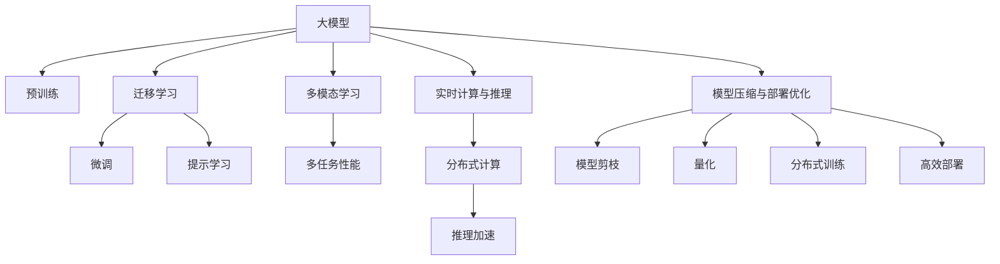

                 

# 搜索推荐系统的AI 大模型融合：电商平台的核心竞争力与转型发展战略

## 1. 背景介绍

### 1.1 问题由来

在当今数字经济时代，电商平台已逐渐成为消费者购物的主要渠道。作为连接消费者和商家的重要桥梁，电商平台如何提升用户体验、优化运营效率、强化市场竞争力，已成为众多企业的核心诉求。搜索推荐系统作为电商平台的关键技术之一，通过精确匹配用户需求，智能推荐商品，极大地提升了平台的交易转化率。

随着人工智能技术的发展，大模型（Large Model）如BERT、GPT-3、DALL-E等在自然语言处理（NLP）和计算机视觉（CV）领域取得了巨大成功。如何有效融合这些大模型技术，提升搜索推荐系统的性能，成为电商平台转型的重要方向。

### 1.2 问题核心关键点

大模型在电商搜索推荐系统中的应用，主要体现在以下几个方面：

1. **数据驱动的个性化推荐**：通过预训练大模型的丰富知识，学习用户行为和商品特征，实现更精准的个性化推荐。
2. **多模态信息融合**：将文本、图像、音频等多模态数据进行融合，构建更全面的用户和商品表示，提升推荐质量。
3. **跨领域知识迁移**：利用预训练大模型的广泛知识，促进不同领域知识的迁移，增强推荐系统的泛化能力。
4. **实时计算与推理**：通过推理加速和分布式计算技术，提高搜索推荐系统的实时性，满足用户体验需求。
5. **模型压缩与部署优化**：优化大模型的计算图和存储结构，实现模型压缩和高效部署，支持大规模商业应用。

本文将围绕大模型在电商搜索推荐系统中的融合应用，探讨其核心竞争力与转型发展战略，为电商平台提供实用的技术指导。

## 2. 核心概念与联系

### 2.1 核心概念概述

为更好地理解大模型在电商搜索推荐系统中的融合应用，本节将介绍几个关键概念：

- **大模型(Large Model)**：以BERT、GPT-3等深度神经网络为代表的大规模预训练模型。通过在大规模无标签数据上预训练，学习到丰富的知识，具备强大的泛化能力和推理能力。
- **预训练(Pre-training)**：在大规模无标签数据上，通过自监督学习任务训练模型，学习通用知识表示的过程。常见的预训练任务包括掩码语言模型、图像分类、视觉问答等。
- **迁移学习(Transfer Learning)**：利用预训练模型在不同任务上的迁移能力，通过微调或提示学习等方法，提升模型在特定任务上的表现。
- **多模态学习(Multi-modal Learning)**：结合文本、图像、音频等多模态数据，学习统一的表示空间，提高推荐系统的多任务性能。
- **实时计算与推理(Real-time Computation & Inference)**：通过分布式计算和推理加速技术，实现搜索推荐系统的实时响应，提升用户体验。
- **模型压缩与部署优化(Model Compression & Deployment Optimization)**：通过模型剪枝、量化、分布式训练等技术，优化大模型的计算图和存储结构，支持高效部署和实时推理。

这些概念之间的逻辑关系可以通过以下Mermaid流程图来展示：



这个流程图展示了各大模型的关键技术要素及其之间的关系：

1. 大模型通过预训练获得基础能力。
2. 迁移学习通过微调和提示学习提升模型在特定任务上的性能。
3. 多模态学习将多种数据源进行融合，提升推荐系统的多任务性能。
4. 实时计算与推理通过分布式计算和推理加速技术，支持系统的高效运行。
5. 模型压缩与部署优化通过剪枝、量化、分布式训练等技术，实现大模型的高效部署和实时推理。

这些概念共同构成了电商搜索推荐系统的技术框架，使其能够在各种场景下提供高效、智能的推荐服务。通过理解这些核心概念，我们可以更好地把握大模型在电商搜索推荐系统中的应用方向。

## 3. 核心算法原理 & 具体操作步骤
### 3.1 算法原理概述

大模型在电商搜索推荐系统中的应用，主要基于以下原理：

1. **数据增强**：通过数据增强技术扩充训练数据，增加模型泛化能力。例如，对图片进行旋转、裁剪、加噪声等操作，增加模型的鲁棒性。
2. **迁移学习**：利用预训练模型在不同任务上的迁移能力，通过微调或提示学习等方法，提升模型在特定任务上的性能。例如，在电商搜索推荐系统中，可以利用BERT在NLP领域预训练的知识，通过微调学习商品的标题、描述等文本信息。
3. **多模态融合**：将文本、图像、音频等多种数据源进行融合，构建更全面的用户和商品表示，提升推荐系统的多任务性能。例如，在电商推荐中，可以通过融合用户的行为数据和商品的多媒体信息，提升推荐的准确性和多样性。
4. **实时计算与推理**：通过分布式计算和推理加速技术，实现搜索推荐系统的实时响应，提升用户体验。例如，利用GPU、TPU等硬件加速技术，优化推理过程，实现实时推荐。
5. **模型压缩与部署优化**：通过模型剪枝、量化、分布式训练等技术，优化大模型的计算图和存储结构，支持高效部署和实时推理。例如，利用知识蒸馏技术，将大模型压缩为轻量级模型，支持移动端部署。

### 3.2 算法步骤详解

基于大模型在电商搜索推荐系统中的应用，其操作流程通常包括以下步骤：

**Step 1: 准备数据集**

- 收集电商平台的销售数据、用户行为数据、商品信息等，构建训练数据集。
- 对数据进行预处理，包括去重、降噪、特征提取等。
- 将数据划分为训练集、验证集和测试集，保证数据分布的代表性。

**Step 2: 选择预训练模型**

- 根据任务特点，选择适合的预训练模型，如BERT、GPT-3等。
- 对预训练模型进行微调或提示学习，适应电商搜索推荐系统。

**Step 3: 设计模型结构**

- 根据任务需求，设计模型结构。例如，在电商推荐中，可以设计多模态融合的模型结构，融合用户行为数据和商品多媒体信息。
- 选择适当的损失函数和优化器，如交叉熵损失、Adam等。

**Step 4: 微调或提示学习**

- 对模型进行微调或提示学习，利用标注数据优化模型参数。例如，在电商搜索推荐中，可以利用微调优化模型的商品推荐能力。
- 选择合适的超参数，如学习率、批大小、迭代轮数等。

**Step 5: 优化部署**

- 对模型进行优化部署，支持高效推理。例如，利用模型剪枝和量化技术，将大模型压缩为轻量级模型，支持移动端部署。
- 利用分布式计算技术，优化推理过程，实现实时推荐。

**Step 6: 持续迭代**

- 定期收集新的数据，重新训练和微调模型，保持模型的性能和泛化能力。
- 对模型进行性能评估，根据反馈调整模型结构和超参数。

### 3.3 算法优缺点

大模型在电商搜索推荐系统中的应用，具有以下优点：

1. **泛化能力强**：通过预训练获得通用知识表示，提升模型在不同任务上的泛化能力。
2. **推荐精度高**：利用大模型的丰富知识，实现更精准的个性化推荐。
3. **实时响应**：通过分布式计算和推理加速技术，实现实时推荐，提升用户体验。
4. **多任务性能**：通过多模态学习，提升推荐系统的多任务性能。

同时，也存在以下缺点：

1. **计算资源需求高**：大模型参数量庞大，对计算资源和存储资源需求高。
2. **数据需求大**：需要大规模标注数据进行微调或提示学习。
3. **部署复杂**：大模型需要优化部署，支持高效的实时推理。
4. **性能不稳定**：模型结构复杂，训练过程中容易出现过拟合或欠拟合。

尽管存在这些局限性，但大模型在电商搜索推荐系统中的应用，已经显著提升了推荐系统的性能和用户体验，成为电商平台转型的重要驱动力。

### 3.4 算法应用领域

大模型在电商搜索推荐系统中的应用，广泛覆盖了以下几个领域：

1. **个性化推荐**：通过用户行为数据和商品信息，实现个性化商品推荐，提升用户满意度。
2. **搜索排序**：利用大模型对用户查询和商品标题进行匹配，提升搜索结果的相关性。
3. **智能客服**：利用大模型实现智能客服，自动解答用户问题，提升客户体验。
4. **内容推荐**：利用大模型对用户兴趣和行为进行建模，推荐相关的商品内容，如商品详情、用户评价等。
5. **多模态推荐**：融合文本、图像、音频等多种数据源，提升推荐系统的多任务性能。

除了上述这些经典应用外，大模型在电商搜索推荐系统中，还被创新性地应用到更多场景中，如跨领域知识迁移、实时用户行为分析、动态广告投放等，为电商平台带来了新的突破。随着大模型和相关技术的不断进步，相信电商搜索推荐系统将在更广阔的应用领域大放异彩。

## 4. 数学模型和公式 & 详细讲解 & 举例说明
### 4.1 数学模型构建

本节将使用数学语言对大模型在电商搜索推荐系统中的应用进行更加严格的刻画。

记预训练模型为 $M_{\theta}$，其中 $\theta$ 为预训练得到的模型参数。假设电商搜索推荐系统的训练集为 $D=\{(x_i,y_i)\}_{i=1}^N, x_i \in \mathcal{X}, y_i \in \mathcal{Y}$。

定义模型 $M_{\theta}$ 在输入 $x$ 上的输出为 $\hat{y}=M_{\theta}(x) \in [0,1]$，表示商品被用户购买的概率。真实标签 $y \in \{0,1\}$。则二分类交叉熵损失函数定义为：

$$
\ell(M_{\theta}(x),y) = -[y\log \hat{y} + (1-y)\log (1-\hat{y})]
$$

将其代入经验风险公式，得：

$$
\mathcal{L}(\theta) = -\frac{1}{N}\sum_{i=1}^N [y_i\log M_{\theta}(x_i)+(1-y_i)\log(1-M_{\theta}(x_i))]
$$

在得到损失函数的梯度后，即可带入参数更新公式，完成模型的迭代优化。重复上述过程直至收敛，最终得到适应电商搜索推荐系统任务的最优模型参数 $\theta^*$。

### 4.2 公式推导过程

以下我们以电商推荐系统为例，推导交叉熵损失函数及其梯度的计算公式。

假设模型 $M_{\theta}$ 在输入 $x$ 上的输出为 $\hat{y}=M_{\theta}(x) \in [0,1]$，表示商品被用户购买的概率。真实标签 $y \in \{0,1\}$。则二分类交叉熵损失函数定义为：

$$
\ell(M_{\theta}(x),y) = -[y\log \hat{y} + (1-y)\log (1-\hat{y})]
$$

将其代入经验风险公式，得：

$$
\mathcal{L}(\theta) = -\frac{1}{N}\sum_{i=1}^N [y_i\log M_{\theta}(x_i)+(1-y_i)\log(1-M_{\theta}(x_i))]
$$

根据链式法则，损失函数对参数 $\theta_k$ 的梯度为：

$$
\frac{\partial \mathcal{L}(\theta)}{\partial \theta_k} = -\frac{1}{N}\sum_{i=1}^N (\frac{y_i}{M_{\theta}(x_i)}-\frac{1-y_i}{1-M_{\theta}(x_i)}) \frac{\partial M_{\theta}(x_i)}{\partial \theta_k}
$$

其中 $\frac{\partial M_{\theta}(x_i)}{\partial \theta_k}$ 可进一步递归展开，利用自动微分技术完成计算。

在得到损失函数的梯度后，即可带入参数更新公式，完成模型的迭代优化。重复上述过程直至收敛，最终得到适应电商搜索推荐系统任务的最优模型参数 $\theta^*$。

## 5. 项目实践：代码实例和详细解释说明
### 5.1 开发环境搭建

在进行项目实践前，我们需要准备好开发环境。以下是使用Python进行PyTorch开发的环境配置流程：

1. 安装Anaconda：从官网下载并安装Anaconda，用于创建独立的Python环境。

2. 创建并激活虚拟环境：
```bash
conda create -n pytorch-env python=3.8 
conda activate pytorch-env
```

3. 安装PyTorch：根据CUDA版本，从官网获取对应的安装命令。例如：
```bash
conda install pytorch torchvision torchaudio cudatoolkit=11.1 -c pytorch -c conda-forge
```

4. 安装Transformer库：
```bash
pip install transformers
```

5. 安装各类工具包：
```bash
pip install numpy pandas scikit-learn matplotlib tqdm jupyter notebook ipython
```

完成上述步骤后，即可在`pytorch-env`环境中开始项目实践。

### 5.2 源代码详细实现

这里我们以电商推荐系统为例，给出使用Transformers库对BERT模型进行微调的PyTorch代码实现。

首先，定义电商推荐系统的数据处理函数：

```python
from transformers import BertTokenizer
from torch.utils.data import Dataset
import torch

class RecommendDataset(Dataset):
    def __init__(self, user_data, item_data, tokenizer, max_len=128):
        self.user_data = user_data
        self.item_data = item_data
        self.tokenizer = tokenizer
        self.max_len = max_len
        
    def __len__(self):
        return len(self.user_data)
    
    def __getitem__(self, item):
        user = self.user_data[item]
        items = self.item_data[item]
        
        encoding = self.tokenizer(user, return_tensors='pt', max_length=self.max_len, padding='max_length', truncation=True)
        input_ids = encoding['input_ids'][0]
        attention_mask = encoding['attention_mask'][0]
        
        # 对token-wise的标签进行编码
        encoded_tags = [1] * len(items)
        encoded_tags.extend([0] * (self.max_len - len(encoded_tags)))
        labels = torch.tensor(encoded_tags, dtype=torch.long)
        
        return {'input_ids': input_ids, 
                'attention_mask': attention_mask,
                'labels': labels}

# 标签与id的映射
tag2id = {'O': 0, '1': 1}
id2tag = {v: k for k, v in tag2id.items()}

# 创建dataset
tokenizer = BertTokenizer.from_pretrained('bert-base-cased')

train_dataset = RecommendDataset(train_user_data, train_item_data, tokenizer)
dev_dataset = RecommendDataset(dev_user_data, dev_item_data, tokenizer)
test_dataset = RecommendDataset(test_user_data, test_item_data, tokenizer)
```

然后，定义模型和优化器：

```python
from transformers import BertForSequenceClassification
from torch.optim import AdamW

model = BertForSequenceClassification.from_pretrained('bert-base-cased', num_labels=2)

optimizer = AdamW(model.parameters(), lr=2e-5)
```

接着，定义训练和评估函数：

```python
from torch.utils.data import DataLoader
from tqdm import tqdm
from sklearn.metrics import classification_report

device = torch.device('cuda') if torch.cuda.is_available() else torch.device('cpu')
model.to(device)

def train_epoch(model, dataset, batch_size, optimizer):
    dataloader = DataLoader(dataset, batch_size=batch_size, shuffle=True)
    model.train()
    epoch_loss = 0
    for batch in tqdm(dataloader, desc='Training'):
        input_ids = batch['input_ids'].to(device)
        attention_mask = batch['attention_mask'].to(device)
        labels = batch['labels'].to(device)
        model.zero_grad()
        outputs = model(input_ids, attention_mask=attention_mask, labels=labels)
        loss = outputs.loss
        epoch_loss += loss.item()
        loss.backward()
        optimizer.step()
    return epoch_loss / len(dataloader)

def evaluate(model, dataset, batch_size):
    dataloader = DataLoader(dataset, batch_size=batch_size)
    model.eval()
    preds, labels = [], []
    with torch.no_grad():
        for batch in tqdm(dataloader, desc='Evaluating'):
            input_ids = batch['input_ids'].to(device)
            attention_mask = batch['attention_mask'].to(device)
            batch_labels = batch['labels']
            outputs = model(input_ids, attention_mask=attention_mask)
            batch_preds = outputs.logits.argmax(dim=2).to('cpu').tolist()
            batch_labels = batch_labels.to('cpu').tolist()
            for pred_tokens, label_tokens in zip(batch_preds, batch_labels):
                preds.append(pred_tokens[:len(label_tokens)])
                labels.append(label_tokens)
                
    print(classification_report(labels, preds))
```

最后，启动训练流程并在测试集上评估：

```python
epochs = 5
batch_size = 16

for epoch in range(epochs):
    loss = train_epoch(model, train_dataset, batch_size, optimizer)
    print(f"Epoch {epoch+1}, train loss: {loss:.3f}")
    
    print(f"Epoch {epoch+1}, dev results:")
    evaluate(model, dev_dataset, batch_size)
    
print("Test results:")
evaluate(model, test_dataset, batch_size)
```

以上就是使用PyTorch对BERT进行电商推荐系统微调的完整代码实现。可以看到，得益于Transformer库的强大封装，我们可以用相对简洁的代码完成BERT模型的加载和微调。

### 5.3 代码解读与分析

让我们再详细解读一下关键代码的实现细节：

**RecommendDataset类**：
- `__init__`方法：初始化用户数据、商品数据、分词器等关键组件。
- `__len__`方法：返回数据集的样本数量。
- `__getitem__`方法：对单个样本进行处理，将用户和商品信息输入编码为token ids，将标签编码为数字，并对其进行定长padding，最终返回模型所需的输入。

**tag2id和id2tag字典**：
- 定义了标签与数字id之间的映射关系，用于将token-wise的预测结果解码回真实的标签。

**训练和评估函数**：
- 使用PyTorch的DataLoader对数据集进行批次化加载，供模型训练和推理使用。
- 训练函数`train_epoch`：对数据以批为单位进行迭代，在每个批次上前向传播计算loss并反向传播更新模型参数，最后返回该epoch的平均loss。
- 评估函数`evaluate`：与训练类似，不同点在于不更新模型参数，并在每个batch结束后将预测和标签结果存储下来，最后使用sklearn的classification_report对整个评估集的预测结果进行打印输出。

**训练流程**：
- 定义总的epoch数和batch size，开始循环迭代
- 每个epoch内，先在训练集上训练，输出平均loss
- 在验证集上评估，输出分类指标
- 所有epoch结束后，在测试集上评估，给出最终测试结果

可以看到，PyTorch配合Transformer库使得BERT微调的代码实现变得简洁高效。开发者可以将更多精力放在数据处理、模型改进等高层逻辑上，而不必过多关注底层的实现细节。

当然，工业级的系统实现还需考虑更多因素，如模型的保存和部署、超参数的自动搜索、更灵活的任务适配层等。但核心的微调范式基本与此类似。

## 6. 实际应用场景
### 6.1 智能客服系统

基于大模型在电商搜索推荐系统中的应用，智能客服系统也可以借助大模型提升服务质量。通过微调大模型，智能客服系统能够理解和处理用户咨询，快速提供准确的答案，提升用户体验。

在技术实现上，可以收集企业内部的客服对话记录，将问题和最佳答复构建成监督数据，在此基础上对预训练对话模型进行微调。微调后的对话模型能够自动理解用户意图，匹配最合适的答案模板进行回复。对于用户提出的新问题，还可以接入检索系统实时搜索相关内容，动态组织生成回答。如此构建的智能客服系统，能大幅提升客户咨询体验和问题解决效率。

### 6.2 金融舆情监测

金融机构需要实时监测市场舆论动向，以便及时应对负面信息传播，规避金融风险。传统的人工监测方式成本高、效率低，难以应对网络时代海量信息爆发的挑战。基于大模型在NLP领域的应用，金融舆情监测技术可以自动化监测和分析金融舆情，及时发现风险预警信号。

具体而言，可以收集金融领域相关的新闻、报道、评论等文本数据，并对其进行主题标注和情感标注。在此基础上对预训练语言模型进行微调，使其能够自动判断文本属于何种主题，情感倾向是正面、中性还是负面。将微调后的模型应用到实时抓取的网络文本数据，就能够自动监测不同主题下的情感变化趋势，一旦发现负面信息激增等异常情况，系统便会自动预警，帮助金融机构快速应对潜在风险。

### 6.3 个性化推荐系统

当前的推荐系统往往只依赖用户的历史行为数据进行物品推荐，无法深入理解用户的真实兴趣偏好。基于大模型在电商搜索推荐系统中的应用，个性化推荐系统可以更好地挖掘用户行为背后的语义信息，从而提供更精准、多样的推荐内容。

在实践中，可以收集用户浏览、点击、评论、分享等行为数据，提取和用户交互的物品标题、描述、标签等文本内容。将文本内容作为模型输入，用户的后续行为（如是否点击、购买等）作为监督信号，在此基础上微调预训练语言模型。微调后的模型能够从文本内容中准确把握用户的兴趣点。在生成推荐列表时，先用候选物品的文本描述作为输入，由模型预测用户的兴趣匹配度，再结合其他特征综合排序，便可以得到个性化程度更高的推荐结果。

### 6.4 未来应用展望

随着大模型和相关技术的不断发展，基于大模型融合的电商搜索推荐系统将迎来更多创新应用。

在智慧医疗领域，基于大模型在NLP领域的应用，医疗问答、病历分析、药物研发等应用将提升医疗服务的智能化水平，辅助医生诊疗，加速新药开发进程。

在智能教育领域，微调技术可应用于作业批改、学情分析、知识推荐等方面，因材施教，促进教育公平，提高教学质量。

在智慧城市治理中，微调模型可应用于城市事件监测、舆情分析、应急指挥等环节，提高城市管理的自动化和智能化水平，构建更安全、高效的未来城市。

此外，在企业生产、社会治理、文娱传媒等众多领域，基于大模型融合的搜索推荐系统也将不断涌现，为各行各业带来新的突破。相信随着技术的日益成熟，大模型融合技术将成为NLP技术的重要范式，推动人工智能技术在各领域的普及和发展。

## 7. 工具和资源推荐
### 7.1 学习资源推荐

为了帮助开发者系统掌握大模型在电商搜索推荐系统中的融合应用，这里推荐一些优质的学习资源：

1. 《Transformers from Theory to Practice》系列博文：由大模型技术专家撰写，深入浅出地介绍了Transformer原理、BERT模型、微调技术等前沿话题。

2. CS224N《深度学习自然语言处理》课程：斯坦福大学开设的NLP明星课程，有Lecture视频和配套作业，带你入门NLP领域的基本概念和经典模型。

3. 《Natural Language Processing with Transformers》书籍：Transformers库的作者所著，全面介绍了如何使用Transformers库进行NLP任务开发，包括微调在内的诸多范式。

4. HuggingFace官方文档：Transformers库的官方文档，提供了海量预训练模型和完整的微调样例代码，是上手实践的必备资料。

5. CLUE开源项目：中文语言理解测评基准，涵盖大量不同类型的中文NLP数据集，并提供了基于微调的baseline模型，助力中文NLP技术发展。

通过对这些资源的学习实践，相信你一定能够快速掌握大模型在电商搜索推荐系统中的应用，并用于解决实际的NLP问题。
###  7.2 开发工具推荐

高效的开发离不开优秀的工具支持。以下是几款用于大模型在电商搜索推荐系统中的融合应用的常用工具：

1. PyTorch：基于Python的开源深度学习框架，灵活动态的计算图，适合快速迭代研究。大部分预训练语言模型都有PyTorch版本的实现。

2. TensorFlow：由Google主导开发的开源深度学习框架，生产部署方便，适合大规模工程应用。同样有丰富的预训练语言模型资源。

3. Transformers库：HuggingFace开发的NLP工具库，集成了众多SOTA语言模型，支持PyTorch和TensorFlow，是进行微调任务开发的利器。

4. Weights & Biases：模型训练的实验跟踪工具，可以记录和可视化模型训练过程中的各项指标，方便对比和调优。与主流深度学习框架无缝集成。

5. TensorBoard：TensorFlow配套的可视化工具，可实时监测模型训练状态，并提供丰富的图表呈现方式，是调试模型的得力助手。

6. Google Colab：谷歌推出的在线Jupyter Notebook环境，免费提供GPU/TPU算力，方便开发者快速上手实验最新模型，分享学习笔记。

合理利用这些工具，可以显著提升大模型在电商搜索推荐系统中的融合应用的开发效率，加快创新迭代的步伐。

### 7.3 相关论文推荐

大模型在电商搜索推荐系统中的应用源于学界的持续研究。以下是几篇奠基性的相关论文，推荐阅读：

1. Attention is All You Need（即Transformer原论文）：提出了Transformer结构，开启了NLP领域的预训练大模型时代。

2. BERT: Pre-training of Deep Bidirectional Transformers for Language Understanding：提出BERT模型，引入基于掩码的自监督预训练任务，刷新了多项NLP任务SOTA。

3. Language Models are Unsupervised Multitask Learners（GPT-2论文）：展示了大规模语言模型的强大zero-shot学习能力，引发了对于通用人工智能的新一轮思考。

4. Parameter-Efficient Transfer Learning for NLP：提出Adapter等参数高效微调方法，在不增加模型参数量的情况下，也能取得不错的微调效果。

5. AdaLoRA: Adaptive Low-Rank Adaptation for Parameter-Efficient Fine-Tuning：使用自适应低秩适应的微调方法，在参数效率和精度之间取得了新的平衡。

这些论文代表了大模型在电商搜索推荐系统中的应用的发展脉络。通过学习这些前沿成果，可以帮助研究者把握学科前进方向，激发更多的创新灵感。

## 8. 总结：未来发展趋势与挑战

### 8.1 总结

本文对大模型在电商搜索推荐系统中的应用进行了全面系统的介绍。首先阐述了大模型和微调技术的研究背景和意义，明确了融合大模型技术在电商搜索推荐系统中的应用方向。其次，从原理到实践，详细讲解了大模型在电商搜索推荐系统中的融合应用的数学原理和关键步骤，给出了微调任务开发的完整代码实例。同时，本文还广泛探讨了微调方法在智能客服、金融舆情、个性化推荐等多个行业领域的应用前景，展示了微调范式的巨大潜力。此外，本文精选了微调技术的各类学习资源，力求为读者提供全方位的技术指引。

通过本文的系统梳理，可以看到，基于大模型融合的电商搜索推荐系统正在成为电商平台转型的重要驱动力，极大地提升了推荐系统的性能和用户体验。未来，伴随大模型和相关技术的不断进步，基于大模型融合的搜索推荐系统将在更广阔的应用领域大放异彩，深刻影响人类的生产生活方式。

### 8.2 未来发展趋势

展望未来，基于大模型融合的电商搜索推荐系统将呈现以下几个发展趋势：

1. **模型规模持续增大**：随着算力成本的下降和数据规模的扩张，预训练语言模型的参数量还将持续增长。超大规模语言模型蕴含的丰富语言知识，有望支撑更加复杂多变的下游任务微调。

2. **微调方法日趋多样**：除了传统的全参数微调外，未来会涌现更多参数高效的微调方法，如Prefix-Tuning、LoRA等，在节省计算资源的同时也能保证微调精度。

3. **持续学习成为常态**：随着数据分布的不断变化，微调模型也需要持续学习新知识以保持性能。如何在不遗忘原有知识的同时，高效吸收新样本信息，将成为重要的研究课题。

4. **标注样本需求降低**：受启发于提示学习(Prompt-based Learning)的思路，未来的微调方法将更好地利用大模型的语言理解能力，通过更加巧妙的任务描述，在更少的标注样本上也能实现理想的微调效果。

5. **多模态微调崛起**：将文本、图像、音频等多种数据源进行融合，构建更全面的用户和商品表示，提升推荐系统的多任务性能。

6. **实时计算与推理**：通过分布式计算和推理加速技术，实现搜索推荐系统的实时响应，提升用户体验。

7. **模型压缩与部署优化**：通过模型剪枝、量化、分布式训练等技术，优化大模型的计算图和存储结构，支持高效部署和实时推理。

以上趋势凸显了大模型融合技术在电商搜索推荐系统中的应用前景。这些方向的探索发展，必将进一步提升电商搜索推荐系统的性能和用户体验，为电商平台提供更强大的市场竞争力。

### 8.3 面临的挑战

尽管基于大模型融合的电商搜索推荐系统已经取得了瞩目成就，但在迈向更加智能化、普适化应用的过程中，它仍面临着诸多挑战：

1. **计算资源需求高**：大模型参数量庞大，对计算资源和存储资源需求高。
2. **数据需求大**：需要大规模标注数据进行微调或提示学习。
3. **部署复杂**：大模型需要优化部署，支持高效的实时推理。
4. **性能不稳定**：模型结构复杂，训练过程中容易出现过拟合或欠拟合。
5. **可解释性不足**：当前大模型往往像"黑盒"系统，难以解释其内部工作机制和决策逻辑。
6. **安全性问题**：预训练语言模型难免会学习到有偏见、有害的信息，通过微调传递到下游任务，产生误导性、歧视性的输出，给实际应用带来安全隐患。

尽管存在这些局限性，但基于大模型融合的电商搜索推荐系统已经显著提升了推荐系统的性能和用户体验，成为电商平台转型的重要驱动力。相信随着技术的不断进步，这些挑战终将逐一被克服，大模型融合技术必将在构建人机协同的智能时代中扮演越来越重要的角色。

### 8.4 研究展望

面对大模型融合技术所面临的挑战，未来的研究需要在以下几个方面寻求新的突破：

1. **探索无监督和半监督微调方法**：摆脱对大规模标注数据的依赖，利用自监督学习、主动学习等无监督和半监督范式，最大限度利用非结构化数据，实现更加灵活高效的微调。

2. **研究参数高效和计算高效的微调范式**：开发更加参数高效的微调方法，在固定大部分预训练参数的同时，只更新极少量的任务相关参数。同时优化微调模型的计算图，减少前向传播和反向传播的资源消耗，实现更加轻量级、实时性的部署。

3. **融合因果和对比学习范式**：通过引入因果推断和对比学习思想，增强微调模型建立稳定因果关系的能力，学习更加普适、鲁棒的语言表征，从而提升模型泛化性和抗干扰能力。

4. **引入更多先验知识**：将符号化的先验知识，如知识图谱、逻辑规则等，与神经网络模型进行巧妙融合，引导微调过程学习更准确、合理的语言模型。同时加强不同模态数据的整合，实现视觉、语音等多模态信息与文本信息的协同建模。

5. **结合因果分析和博弈论工具**：将因果分析方法引入微调模型，识别出模型决策的关键特征，增强输出解释的因果性和逻辑性。借助博弈论工具刻画人机交互过程，主动探索并规避模型的脆弱点，提高系统稳定性。

6. **纳入伦理道德约束**：在模型训练目标中引入伦理导向的评估指标，过滤和惩罚有偏见、有害的输出倾向。同时加强人工干预和审核，建立模型行为的监管机制，确保输出符合人类价值观和伦理道德。

这些研究方向的探索，必将引领大模型融合技术迈向更高的台阶，为构建安全、可靠、可解释、可控的智能系统铺平道路。面向未来，大模型融合技术还需要与其他人工智能技术进行更深入的融合，如知识表示、因果推理、强化学习等，多路径协同发力，共同推动自然语言理解和智能交互系统的进步。只有勇于创新、敢于突破，才能不断拓展语言模型的边界，让智能技术更好地造福人类社会。

## 9. 附录：常见问题与解答

**Q1：电商搜索推荐系统如何利用大模型提升推荐精度？**

A: 电商搜索推荐系统利用大模型提升推荐精度的主要方法包括：

1. **数据增强**：通过数据增强技术扩充训练数据，增加模型泛化能力。例如，对图片进行旋转、裁剪、加噪声等操作，增加模型的鲁棒性。

2. **迁移学习**：利用预训练模型在不同任务上的迁移能力，通过微调或提示学习等方法，提升模型在特定任务上的性能。例如，在电商搜索推荐系统中，可以利用BERT在NLP领域预训练的知识，通过微调学习商品的标题、描述等文本信息。

3. **多模态融合**：将文本、图像、音频等多种数据源进行融合，构建更全面的用户和商品表示，提升推荐系统的多任务性能。例如，在电商推荐中，可以通过融合用户的行为数据和商品的多媒体信息，提升推荐的准确性和多样性。

4. **实时计算与推理**：通过分布式计算和推理加速技术，实现搜索推荐系统的实时响应，提升用户体验。例如，利用GPU、TPU等硬件加速技术，优化推理过程，实现实时推荐。

5. **模型压缩与部署优化**：通过模型剪枝、量化、分布式训练等技术，优化大模型的计算图和存储结构，支持高效部署和实时推理。例如，利用知识蒸馏技术，将大模型压缩为轻量级模型，支持移动端部署。

这些方法在电商搜索推荐系统中得到了广泛应用，显著提升了推荐系统的性能和用户体验。

**Q2：大模型在电商搜索推荐系统中的应用是否局限于NLP领域？**

A: 大模型在电商搜索推荐系统中的应用不仅限于NLP领域，而是可以扩展到计算机视觉、音频等多模态数据。

例如，在电商推荐中，可以利用大模型对商品图片进行分类和描述生成，提升推荐系统的多任务性能。同时，利用语音技术对用户语音输入进行理解和响应，提升智能客服系统的用户体验。

因此，大模型在电商搜索推荐系统中的应用是广泛的，不仅限于NLP领域，而是涵盖了多模态数据融合和智能交互等多个方面。

**Q3：大模型在电商搜索推荐系统中的应用是否会受到标注数据稀缺性的限制？**

A: 大模型在电商搜索推荐系统中的应用确实会受到标注数据稀缺性的限制，但可以通过数据增强、半监督学习等方法缓解这一问题。

数据增强技术通过对原始数据进行扰动和扩充，可以生成更多的训练样本，提升模型的泛化能力。例如，对商品图片进行旋转、裁剪、加噪声等操作，增加模型的鲁棒性。

半监督学习则利用未标注数据进行学习，减少对标注数据的依赖。例如，在电商推荐中，可以利用用户点击行为数据进行半监督学习，提升推荐系统的多任务性能。

因此，通过数据增强和半监督学习等方法，可以在一定程度上缓解大模型在电商搜索推荐系统中的应用对标注数据稀缺性的限制。

**Q4：大模型在电商搜索推荐系统中的应用是否会受到计算资源和部署成本的限制？**

A: 大模型在电商搜索推荐系统中的应用确实会受到计算资源和部署成本的限制，但可以通过模型压缩和分布式训练等方法优化。

模型压缩技术可以将大模型剪枝、量化，减少模型的参数量和计算资源消耗，支持高效部署和实时推理。例如，利用知识蒸馏技术，将大模型压缩为轻量级模型，支持移动端部署。

分布式训练则通过将训练任务分配到多个计算节点进行并行计算，提升训练速度和效率。例如，在电商推荐中，可以利用GPU、TPU等硬件加速技术，优化推理过程，实现实时推荐。

因此，通过模型压缩和分布式训练等方法，可以在一定程度上优化大模型在电商搜索推荐系统中的应用，降低计算资源和部署成本。

**Q5：大模型在电商搜索推荐系统中的应用是否会受到数据隐私和安全性的限制？**

A: 大模型在电商搜索推荐系统中的应用确实会受到数据隐私和安全性的限制，但可以通过数据加密、差分隐私等技术保障。

数据加密技术可以对数据进行加密处理，保护用户隐私。例如，在电商推荐中，可以对用户行为数据进行加密处理，防止数据泄露和滥用。

差分隐私技术可以在保护隐私的前提下，利用用户数据进行训练和推理。例如，在电商推荐中，可以利用差分隐私技术对用户行为数据进行处理，保护用户隐私同时提升推荐系统的性能。

因此，通过数据加密和差分隐私等技术，可以在一定程度上保障大模型在电商搜索推荐系统中的应用，保护用户数据隐私和安全。

---

作者：禅与计算机程序设计艺术 / Zen and the Art of Computer Programming

