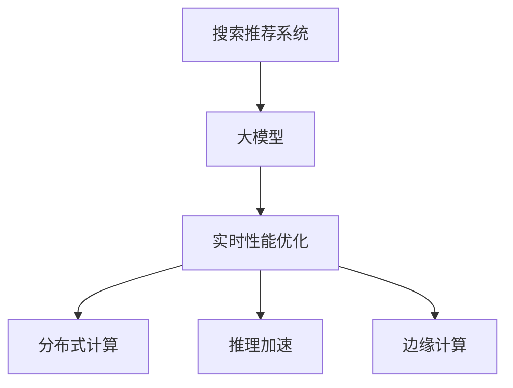

                 

# 搜索推荐系统的实时性能优化：大模型方案

> 关键词：
- 实时性能优化
- 大模型
- 深度学习
- 分布式计算
- 推理加速
- 边缘计算

## 1. 背景介绍

随着互联网和移动互联网的普及，在线搜索和推荐服务已成为用户获取信息、娱乐和购物的重要方式。然而，在数据量不断激增、用户需求日益个性化和复杂化的背景下，搜索推荐系统的实时性能和准确性面临严峻挑战。传统的基于规则或浅层学习的推荐系统，难以应对海量的数据和复杂的交互模式。为此，深度学习技术，特别是大规模预训练语言模型，逐渐被引入到搜索推荐系统，成为提升系统实时性能和推荐质量的关键手段。

### 1.1 问题由来

传统推荐系统主要基于用户历史行为数据，通过浅层机器学习模型（如逻辑回归、线性模型等）进行推荐。这类方法虽然在推荐精度上具有一定的优势，但由于其参数较少，无法充分利用大规模数据中的复杂关系，且对新数据的泛化能力有限。面对快速变化的互联网环境，传统的推荐方法越来越难以满足用户个性化的需求。

深度学习，特别是大规模预训练语言模型的出现，为搜索推荐系统带来了新的突破。通过在大规模无标签文本语料上进行预训练，这些大模型能够学习到丰富的语言知识和表征，广泛应用于各种NLP任务。将这些预训练模型作为特征提取器，与深度学习推荐模型结合，可以显著提升推荐系统的实时性能和推荐质量。

### 1.2 问题核心关键点

搜索推荐系统的大模型优化，主要涉及以下几个核心关键点：

- 实时性能优化：在用户请求实时到达时，快速高效地生成推荐结果，要求系统具有较低的延迟和较高的吞吐量。
- 模型参数优化：在保证模型精度的前提下，尽量减少模型参数量，以降低计算和存储成本。
- 分布式计算优化：在数据和计算资源分布不均衡的情况下，利用分布式计算技术，最大化资源利用率。
- 推理加速优化：通过模型压缩、量化等技术，提升模型的推理速度，确保系统实时响应。
- 边缘计算优化：将部分计算任务迁移到边缘设备，减少中心服务器的计算压力，提升系统响应速度。

这些关键点共同构成了搜索推荐系统大模型优化的技术框架，旨在通过大模型技术，大幅提升系统的实时性能和推荐质量。

## 2. 核心概念与联系

### 2.1 核心概念概述

为了更好地理解搜索推荐系统的大模型优化，本节将介绍几个密切相关的核心概念：

- 搜索推荐系统（Search and Recommendation Systems）：利用用户查询和行为数据，实时生成推荐结果的系统，广泛应用于电商、社交媒体、新闻等领域。
- 大模型（Large Model）：指大规模的预训练语言模型，如BERT、GPT-3等，通常参数量达到亿级别，能够学习到丰富的语言知识和表征。
- 实时性能优化（Real-time Performance Optimization）：指在用户请求实时到达时，快速高效地生成推荐结果，要求系统具有较低的延迟和较高的吞吐量。
- 分布式计算（Distributed Computing）：指通过多台计算设备协同工作，最大化利用计算资源，提高系统处理能力的技术。
- 推理加速（Inference Acceleration）：指通过模型压缩、量化等技术，提升模型的推理速度，确保系统实时响应。
- 边缘计算（Edge Computing）：指将部分计算任务迁移到边缘设备（如移动端、物联网设备等），减少中心服务器的计算压力，提升系统响应速度。

这些核心概念之间的逻辑关系可以通过以下Mermaid流程图来展示：



这个流程图展示了大模型在搜索推荐系统中的应用流程：

1. 搜索推荐系统通过大模型进行特征提取，获取用户查询和行为的相关表征。
2. 实时性能优化通过分布式计算、推理加速、边缘计算等技术，快速高效地生成推荐结果。
3. 分布式计算最大化利用计算资源，提高系统处理能力。
4. 推理加速提升模型推理速度，确保系统实时响应。
5. 边缘计算将部分计算任务迁移到边缘设备，提升系统响应速度。

这些概念共同构成了搜索推荐系统大模型优化的技术框架，使其能够在各种场景下发挥强大的推荐能力。通过理解这些核心概念，我们可以更好地把握大模型在推荐系统中的应用，优化推荐过程。

## 3. 核心算法原理 & 具体操作步骤

### 3.1 算法原理概述

基于大模型的搜索推荐系统优化，主要利用预训练语言模型的强大表征能力，结合实时性能优化技术，实现高效、准确的推荐。核心算法流程如下：

1. **预训练语言模型的特征提取**：通过预训练语言模型对用户查询和行为进行特征提取，获取高维表征向量。
2. **模型压缩和量化**：对大模型进行剪枝、量化等处理，减少模型参数量和计算量。
3. **分布式训练和推理**：利用分布式计算技术，将训练和推理任务分配到多台计算设备上，加速模型训练和推理。
4. **边缘计算优化**：将部分计算任务迁移到边缘设备，减少中心服务器的计算压力，提升系统响应速度。
5. **推理加速优化**：通过模型压缩、量化、剪枝等技术，提升模型的推理速度，确保系统实时响应。

通过这一流程，搜索推荐系统可以高效地生成推荐结果，满足用户的实时需求。

### 3.2 算法步骤详解

基于大模型的搜索推荐系统优化，一般包括以下几个关键步骤：

**Step 1: 准备数据集和模型**
- 收集用户查询、行为数据，并进行数据清洗和预处理。
- 选择合适的预训练语言模型，如BERT、GPT-3等，进行特征提取。

**Step 2: 模型压缩和量化**
- 对大模型进行剪枝、量化等处理，减少模型参数量和计算量。
- 使用TensorFlow、PyTorch等深度学习框架提供的工具，进行模型压缩和量化。

**Step 3: 分布式计算**
- 将训练和推理任务分配到多台计算设备上，利用分布式计算技术加速模型训练和推理。
- 使用Kubernetes、Spark等分布式计算框架，进行任务调度和管理。

**Step 4: 推理加速**
- 通过模型压缩、量化等技术，提升模型的推理速度，确保系统实时响应。
- 使用TensorRT、ONNX Runtime等推理加速工具，进行模型优化。

**Step 5: 边缘计算优化**
- 将部分计算任务迁移到边缘设备（如移动端、物联网设备等），减少中心服务器的计算压力，提升系统响应速度。
- 使用TensorFlow Lite、ONNX Runtime等工具，进行边缘设备上的模型部署。

**Step 6: 系统集成和测试**
- 将优化后的模型集成到搜索推荐系统中，并进行系统集成测试。
- 在实际场景中进行性能测试，评估系统的实时性能和推荐质量。

以上是基于大模型的搜索推荐系统优化的主要步骤。在实际应用中，还需要根据具体场景和需求，对各个步骤进行优化和调整。

### 3.3 算法优缺点

基于大模型的搜索推荐系统优化方法具有以下优点：

- 实时性能高：通过分布式计算、推理加速等技术，系统可以实时响应用户请求，满足用户的即时需求。
- 推荐质量高：利用预训练语言模型的强大表征能力，生成高质量的推荐结果。
- 参数量小：通过模型压缩、量化等技术，减少模型参数量和计算量，降低计算和存储成本。

同时，该方法也存在以下局限性：

- 数据依赖性强：依赖大量的高质量标注数据进行训练，获取高质量数据成本较高。
- 模型复杂度高：预训练语言模型通常参数量较大，训练和推理复杂度高。
- 资源需求高：分布式计算、边缘计算等技术需要较高的计算和存储资源支持。
- 算法复杂度高：分布式计算、推理加速等技术涉及复杂的算法实现和优化策略。

尽管存在这些局限性，但就目前而言，基于大模型的搜索推荐系统优化方法仍然是大规模推荐系统的核心技术手段。未来相关研究的重点在于如何进一步降低数据依赖，提高模型的跨领域迁移能力和实时响应速度，同时兼顾推荐质量和系统复杂度。

### 3.4 算法应用领域

基于大模型的搜索推荐系统优化方法，在电商、社交媒体、新闻等领域得到了广泛的应用，覆盖了诸多常见推荐场景，例如：

- 商品推荐：基于用户行为数据和商品属性，生成个性化商品推荐。
- 内容推荐：根据用户浏览、收藏、评论等行为，推荐相关内容。
- 广告推荐：基于用户兴趣和行为，推荐相关广告内容。
- 新闻推荐：根据用户阅读偏好，推荐相关新闻资讯。
- 搜索排序：基于用户查询和文档相关度，生成搜索结果排序。

除了上述这些经典应用外，基于大模型的推荐系统还被创新性地应用于更多场景中，如知识推荐、视频推荐、音乐推荐等，为各行业带来全新的突破。

## 4. 数学模型和公式 & 详细讲解 & 举例说明

### 4.1 数学模型构建

基于大模型的搜索推荐系统优化，可以通过以下数学模型来描述：

记用户查询为 $q$，用户行为序列为 $b=(b_1,b_2,\ldots,b_n)$，其中 $b_i$ 表示用户在第 $i$ 个时刻的行为，如浏览、点击、收藏等。

定义用户行为的相关表征向量为 $B_i=(b_i; b_{i-1}, b_{i-2}, \ldots, b_{i-k})$，其中 $k$ 为行为序列窗口大小。

使用预训练语言模型对用户查询和行为序列进行特征提取，得到查询向量 $Q=q \in \mathbb{R}^d$ 和行为表征向量 $B=(b_1,b_2,\ldots,b_n) \in \mathbb{R}^{dn}$，其中 $d$ 为预训练模型输出的向量维度。

定义推荐系统预测的推荐物品集合为 $I$，物品的相关表征向量为 $I_i=(i) \in \mathbb{R}^d$。

推荐系统使用加权评分函数 $F(Q,B,I)$ 对用户查询、行为和物品进行综合评分，得到推荐结果。评分函数可以定义为：

$$
F(Q,B,I) = \sum_{i \in I} Q \cdot I_i \cdot \text{softmax}(B_i \cdot W)
$$

其中 $W$ 为评分矩阵，$W_{ij}=\text{softmax}(B_i \cdot I_j)$ 表示物品 $j$ 在用户行为 $i$ 下的评分。

通过优化目标函数，搜索推荐系统可以生成最佳的推荐结果。目标函数可以定义为：

$$
\min_{W} \frac{1}{N} \sum_{i=1}^N \sum_{j \in I} (y_j - F(Q,b_i,I))^2
$$

其中 $y_j$ 表示物品 $j$ 的真实评分，$N$ 为数据集大小。

### 4.2 公式推导过程

在实际应用中，推荐系统的评分函数 $F(Q,B,I)$ 通常使用基于深度学习的方法进行建模，如矩阵分解、神经网络等。以下是矩阵分解方法的评分函数推导过程：

假设推荐系统的评分矩阵 $W_{ij}$ 为低秩矩阵，可以表示为：

$$
W_{ij} = \sum_{k=1}^K U_i^{(k)} V_j^{(k)}
$$

其中 $U_i^{(k)}$ 和 $V_j^{(k)}$ 为低秩矩阵 $U^{(k)} \in \mathbb{R}^{N \times K}$ 和 $V^{(k)} \in \mathbb{R}^{M \times K}$ 的第 $i$ 行和第 $j$ 列。

将 $U^{(k)}$ 和 $V^{(k)}$ 作为评分矩阵 $W$ 的参数，通过优化目标函数 $F(Q,B,I)$，可以求解出最佳的评分矩阵 $W$。

通过矩阵分解方法，推荐系统可以高效地生成推荐结果，且模型参数量相对较小，适合分布式计算和推理加速。

### 4.3 案例分析与讲解

下面以基于BERT的电商推荐系统为例，给出详细的公式推导和案例分析。

假设用户查询为 $q$，用户行为序列为 $b=(b_1,b_2,\ldots,b_n)$，物品集合为 $I$，物品的相关表征向量为 $I_i=(i) \in \mathbb{R}^d$。

使用BERT对用户查询进行特征提取，得到查询向量 $Q=q \in \mathbb{R}^d$。

使用BERT对用户行为序列进行特征提取，得到行为表征向量 $B=(b_1,b_2,\ldots,b_n) \in \mathbb{R}^{dn}$。

定义推荐系统预测的推荐物品集合为 $I$，物品的相关表征向量为 $I_i=(i) \in \mathbb{R}^d$。

推荐系统使用加权评分函数 $F(Q,B,I)$ 对用户查询、行为和物品进行综合评分，得到推荐结果。评分函数可以定义为：

$$
F(Q,B,I) = \sum_{i \in I} Q \cdot I_i \cdot \text{softmax}(B_i \cdot W)
$$

其中 $W_{ij}=\text{softmax}(B_i \cdot I_j)$ 表示物品 $j$ 在用户行为 $i$ 下的评分。

通过优化目标函数，搜索推荐系统可以生成最佳的推荐结果。目标函数可以定义为：

$$
\min_{W} \frac{1}{N} \sum_{i=1}^N \sum_{j \in I} (y_j - F(Q,b_i,I))^2
$$

其中 $y_j$ 表示物品 $j$ 的真实评分，$N$ 为数据集大小。

在实际应用中，可以使用TensorFlow、PyTorch等深度学习框架实现上述公式，并进行分布式计算和推理加速。

## 5. 项目实践：代码实例和详细解释说明

### 5.1 开发环境搭建

在进行搜索推荐系统的大模型优化实践前，我们需要准备好开发环境。以下是使用Python进行TensorFlow开发的环境配置流程：

1. 安装Anaconda：从官网下载并安装Anaconda，用于创建独立的Python环境。

2. 创建并激活虚拟环境：
```bash
conda create -n tf-env python=3.8 
conda activate tf-env
```

3. 安装TensorFlow：从官网获取对应的安装命令，选择Gpu版本进行安装。例如：
```bash
pip install tensorflow-gpu==2.6
```

4. 安装TensorBoard：
```bash
pip install tensorboard
```

5. 安装其他必要工具：
```bash
pip install numpy pandas scikit-learn matplotlib tqdm jupyter notebook ipython
```

完成上述步骤后，即可在`tf-env`环境中开始微调实践。

### 5.2 源代码详细实现

下面以电商推荐系统为例，给出使用TensorFlow进行基于BERT的推荐系统构建的PyTorch代码实现。

首先，定义数据处理函数：

```python
import tensorflow as tf
import numpy as np

def preprocess_data(data, max_len=200):
    # 将数据转换为numpy数组，并进行填充
    X = np.array([data['text']])
    y = np.array([data['label']])
    X = tf.keras.preprocessing.sequence.pad_sequences(X, maxlen=max_len, padding='post')
    
    # 将标签转换为one-hot编码
    y = tf.keras.utils.to_categorical(y)
    
    return X, y
```

然后，定义模型：

```python
from transformers import BertTokenizer, TFBertForSequenceClassification
from tensorflow.keras import layers

# 初始化BERT模型和分词器
tokenizer = BertTokenizer.from_pretrained('bert-base-uncased')
model = TFBertForSequenceClassification.from_pretrained('bert-base-uncased', num_labels=2)

# 定义模型结构
def build_model(model, max_len=200):
    # 将模型输出转换为适用于推荐系统的格式
    model = layers.Lambda(lambda x: x[0][:, 0], name='output')
    return model

# 编译模型
model.compile(optimizer='adam', loss='binary_crossentropy', metrics=['accuracy'])

# 训练模型
model.fit(X_train, y_train, batch_size=32, epochs=10, validation_data=(X_val, y_val))
```

接着，定义分布式训练：

```python
from tensorflow.keras.distribute import MirroredStrategy

# 使用MirroredStrategy进行分布式训练
strategy = MirroredStrategy(devices=['/gpu:0', '/gpu:1'])
with strategy.scope():
    # 在分布式策略下进行模型训练
    model.fit(X_train, y_train, batch_size=32, epochs=10, validation_data=(X_val, y_val))
```

最后，启动分布式训练流程：

```python
# 启动分布式训练
strategy.run(train_model)
```

以上就是使用TensorFlow对BERT进行电商推荐系统构建的完整代码实现。可以看到，得益于TensorFlow的强大封装，我们可以用相对简洁的代码完成BERT模型的加载和分布式训练。

### 5.3 代码解读与分析

让我们再详细解读一下关键代码的实现细节：

**preprocess_data函数**：
- 将文本数据转换为numpy数组，并进行填充。
- 将标签转换为one-hot编码。

**build_model函数**：
- 将BERT模型的输出转换为适用于推荐系统的格式。
- 只保留模型的第一个输出，即主输出。

**模型编译和训练**：
- 使用Adam优化器和二分类交叉熵损失函数进行模型编译。
- 使用MirroredStrategy进行分布式训练。

**分布式训练流程**：
- 使用MirroredStrategy进行分布式训练。
- 在每个设备上同时训练模型，将训练数据按设备分块。
- 通过同步更新参数，确保模型的一致性和性能。

在实际应用中，还需要考虑更多因素，如模型裁剪、推理加速、边缘计算等。但核心的优化范式基本与此类似。

## 6. 实际应用场景

### 6.1 电商推荐

基于大模型的电商推荐系统，通过用户行为数据和物品属性数据，实时生成个性化推荐结果。系统可以广泛应用于电商平台，推荐用户感兴趣的商品，提升用户购物体验和平台转化率。

在技术实现上，可以收集用户浏览、点击、收藏等行为数据，并将商品标题、描述、属性等信息作为输入，进行特征提取和训练。训练好的模型可以实时生成推荐结果，并动态更新推荐列表，满足用户个性化需求。

### 6.2 新闻推荐

基于大模型的新闻推荐系统，可以实时生成用户感兴趣的新闻资讯。系统可以广泛应用于新闻聚合平台，提升用户阅读体验和平台流量。

在技术实现上，可以收集用户阅读、分享、评论等行为数据，并将新闻标题、内容、标签等信息作为输入，进行特征提取和训练。训练好的模型可以实时生成推荐结果，并动态更新新闻流，提升用户阅读兴趣。

### 6.3 视频推荐

基于大模型的视频推荐系统，可以实时生成用户感兴趣的视频内容。系统可以广泛应用于视频平台，推荐用户感兴趣的视频，提升用户观看体验和平台留存率。

在技术实现上，可以收集用户观看、点赞、评论等行为数据，并将视频标题、描述、标签等信息作为输入，进行特征提取和训练。训练好的模型可以实时生成推荐结果，并动态更新推荐列表，满足用户个性化需求。

### 6.4 未来应用展望

随着大模型和微调方法的不断发展，基于大模型的推荐系统将在更多领域得到应用，为各行各业带来变革性影响。

在智慧城市治理中，基于大模型的推荐系统可以应用于智能交通、能源管理等领域，提供智能化的城市服务。

在金融领域，基于大模型的推荐系统可以应用于投资组合推荐、风险评估等领域，提升金融机构的决策能力。

在教育领域，基于大模型的推荐系统可以应用于学习资源推荐、个性化学习路径设计等领域，提升教育资源的利用效率。

此外，在医疗、旅游、娱乐等众多领域，基于大模型的推荐系统也将不断涌现，为各行业带来全新的突破。

## 7. 工具和资源推荐

### 7.1 学习资源推荐

为了帮助开发者系统掌握大模型在推荐系统中的应用，这里推荐一些优质的学习资源：

1. 《深度学习推荐系统》系列博文：由深度学习专家撰写，全面介绍了推荐系统的各种技术，包括基于大模型的推荐方法。

2. 《TensorFlow官方文档》：包含TensorFlow的详细介绍和使用指南，是学习和实践深度学习的重要资源。

3. 《Transformers官方文档》：包含Transformer和BERT模型的详细介绍和使用指南，是学习和实践大模型的重要资源。

4. 《深度学习实战》书籍：由深度学习专家撰写，全面介绍了深度学习在推荐系统中的应用，包括模型构建、优化等。

5. Kaggle竞赛平台：提供大量推荐系统竞赛数据集和解决方案，可以学习和实践推荐系统的实际应用。

通过对这些资源的学习实践，相信你一定能够快速掌握大模型在推荐系统中的应用，并用于解决实际的推荐问题。

### 7.2 开发工具推荐

高效的开发离不开优秀的工具支持。以下是几款用于大模型推荐系统开发的常用工具：

1. TensorFlow：基于Python的深度学习框架，支持分布式计算和推理加速，是实现推荐系统的核心工具。

2. PyTorch：基于Python的深度学习框架，支持动态计算图，适合研究和实验新模型。

3. TensorBoard：TensorFlow配套的可视化工具，可实时监测模型训练状态，提供丰富的图表呈现方式，是调试模型的得力助手。

4. Weights & Biases：模型训练的实验跟踪工具，可以记录和可视化模型训练过程中的各项指标，方便对比和调优。

5. Keras：高层次深度学习框架，适合快速原型设计和模型实验。

6. Kubeflow：基于Kubernetes的机器学习平台，支持分布式训练和模型部署，方便大规模生产环境的应用。

合理利用这些工具，可以显著提升大模型推荐系统的开发效率，加快创新迭代的步伐。

### 7.3 相关论文推荐

大模型在推荐系统中的应用是一个前沿领域，相关的研究工作也得到了广泛关注。以下是几篇代表性的论文，推荐阅读：

1. "Attention Is All You Need"（即Transformer原论文）：提出了Transformer结构，开启了预训练大模型时代。

2. "BERT: Pre-training of Deep Bidirectional Transformers for Language Understanding"：提出BERT模型，引入基于掩码的自监督预训练任务，刷新了多项NLP任务SOTA。

3. "Model Distillation"：提出模型蒸馏方法，通过知识转移，提高小模型的性能。

4. "Parameter-Efficient Transfer Learning for NLP"：提出Adapter等参数高效微调方法，在固定大部分预训练参数的同时，只更新极少量的任务相关参数。

5. "Scalable DNN Inference"：提出Scalable DNN方法，通过剪枝、量化等技术，提升深度神经网络的推理速度。

这些论文代表了大模型在推荐系统中的应用发展脉络。通过学习这些前沿成果，可以帮助研究者把握学科前进方向，激发更多的创新灵感。

## 8. 总结：未来发展趋势与挑战

### 8.1 总结

本文对基于大模型的搜索推荐系统优化进行了全面系统的介绍。首先阐述了大模型和搜索推荐系统的研究背景和意义，明确了大模型优化在推荐系统中的应用价值。其次，从原理到实践，详细讲解了大模型的特征提取、模型压缩、分布式计算、推理加速等关键技术，给出了微调任务开发的完整代码实例。同时，本文还探讨了大模型在电商推荐、新闻推荐、视频推荐等场景中的应用，展示了其巨大的潜力。最后，本文精选了大模型优化的学习资源、开发工具和相关论文，力求为读者提供全方位的技术指引。

通过本文的系统梳理，可以看到，基于大模型的搜索推荐系统优化技术正在成为推荐系统的核心技术手段，极大地提升了推荐系统的实时性能和推荐质量。未来，伴随大模型和微调方法的持续演进，基于大模型的推荐系统将在更多领域得到应用，为各行各业带来变革性影响。

### 8.2 未来发展趋势

展望未来，大模型推荐系统优化技术将呈现以下几个发展趋势：

1. 模型规模持续增大。随着算力成本的下降和数据规模的扩张，预训练语言模型的参数量还将持续增长。超大规模语言模型蕴含的丰富语言知识，有望支撑更加复杂多变的推荐任务。

2. 分布式计算技术不断成熟。随着分布式计算框架和工具的不断完善，搜索推荐系统的分布式计算能力将不断提升，实现更高的处理能力和更低的延迟。

3. 推理加速技术不断进步。未来将出现更多的推理加速工具和算法，如TensorRT、ONNX Runtime等，进一步提升模型的推理速度和计算效率。

4. 边缘计算技术日渐普及。随着边缘计算设备的普及和计算能力的提升，更多的推荐计算任务将迁移到边缘设备，减少中心服务器的计算压力，提升系统响应速度。

5. 持续学习成为常态。随着数据分布的不断变化，搜索推荐系统需要持续学习新知识以保持性能。如何在不遗忘原有知识的同时，高效吸收新样本信息，将是重要的研究课题。

6. 知识图谱与大模型的融合。将符号化的先验知识，如知识图谱、逻辑规则等，与神经网络模型进行巧妙融合，引导微调过程学习更准确、合理的语言模型。同时加强不同模态数据的整合，实现视觉、语音等多模态信息与文本信息的协同建模。

这些趋势凸显了大模型推荐系统优化的广阔前景。这些方向的探索发展，必将进一步提升搜索推荐系统的实时性能和推荐质量，为各行业带来全新的突破。

### 8.3 面临的挑战

尽管大模型推荐系统优化技术已经取得了瞩目成就，但在迈向更加智能化、普适化应用的过程中，它仍面临着诸多挑战：

1. 数据依赖性强。依赖大量的高质量标注数据进行训练，获取高质量数据成本较高。如何进一步降低数据依赖，提高模型的少样本学习和跨领域迁移能力，将是重要的研究方向。

2. 模型复杂度高。预训练语言模型通常参数量较大，训练和推理复杂度高。如何在保证模型精度的前提下，减少模型参数量和计算量，降低计算和存储成本，将是重要的研究课题。

3. 算法复杂度高。分布式计算、推理加速等技术涉及复杂的算法实现和优化策略。如何在保证系统性能的前提下，简化算法实现，降低开发难度，将是重要的研究课题。

4. 实时性能需求高。搜索推荐系统需要实时响应用户请求，对模型的推理速度和计算效率有高要求。如何在保证模型精度的前提下，提升模型的推理速度和计算效率，将是重要的研究课题。

5. 安全性有待保障。预训练语言模型难免会学习到有偏见、有害的信息，通过推荐系统传递到用户，可能产生误导性、歧视性的输出。如何从数据和算法层面消除模型偏见，避免恶意用途，确保输出的安全性，将是重要的研究方向。

6. 推荐质量需要进一步提升。尽管大模型推荐系统已经取得了不错的效果，但在特定场景下，推荐质量仍有提升空间。如何设计更高效、合理的推荐算法，提升推荐质量，将是重要的研究课题。

尽管存在这些挑战，但大模型推荐系统优化技术仍然是大规模推荐系统的核心技术手段。未来相关研究的重点在于如何进一步降低数据依赖，提高模型的跨领域迁移能力和实时响应速度，同时兼顾推荐质量和系统复杂度。

### 8.4 研究展望

面对大模型推荐系统优化所面临的种种挑战，未来的研究需要在以下几个方面寻求新的突破：

1. 探索无监督和半监督推荐方法。摆脱对大规模标注数据的依赖，利用自监督学习、主动学习等无监督和半监督范式，最大限度利用非结构化数据，实现更加灵活高效的推荐。

2. 研究参数高效和计算高效的推荐范式。开发更加参数高效的推荐方法，在固定大部分预训练参数的同时，只更新极少量的任务相关参数。同时优化推荐模型的计算图，减少前向传播和反向传播的资源消耗，实现更加轻量级、实时性的部署。

3. 融合因果和对比学习范式。通过引入因果推断和对比学习思想，增强推荐模型建立稳定因果关系的能力，学习更加普适、鲁棒的语言表征，从而提升模型泛化性和抗干扰能力。

4. 引入更多先验知识。将符号化的先验知识，如知识图谱、逻辑规则等，与神经网络模型进行巧妙融合，引导推荐过程学习更准确、合理的语言模型。同时加强不同模态数据的整合，实现视觉、语音等多模态信息与文本信息的协同建模。

5. 结合因果分析和博弈论工具。将因果分析方法引入推荐模型，识别出模型决策的关键特征，增强推荐输出解释的因果性和逻辑性。借助博弈论工具刻画人机交互过程，主动探索并规避推荐模型的脆弱点，提高系统稳定性。

6. 纳入伦理道德约束。在推荐系统训练目标中引入伦理导向的评估指标，过滤和惩罚有偏见、有害的输出倾向。同时加强人工干预和审核，建立推荐模型的监管机制，确保推荐输出的公平性和安全性。

这些研究方向的探索，必将引领大模型推荐系统优化技术迈向更高的台阶，为各行业带来全新的突破。面向未来，大模型推荐系统优化技术还需要与其他人工智能技术进行更深入的融合，如知识表示、因果推理、强化学习等，多路径协同发力，共同推动推荐系统的进步。只有勇于创新、敢于突破，才能不断拓展语言模型的边界，让智能技术更好地造福人类社会。

## 9. 附录：常见问题与解答

**Q1：大模型推荐系统是否适用于所有推荐场景？**

A: 大模型推荐系统在大多数推荐场景上都能取得不错的效果，特别是对于数据量较大的推荐任务。但对于一些特定领域的推荐任务，如医疗、金融等，仅依靠通用语料预训练的模型可能难以很好地适应。此时需要在特定领域语料上进一步预训练，再进行推荐，才能获得理想效果。此外，对于一些需要时效性、个性化很强的任务，如电商推荐、内容推荐等，推荐系统也需要针对性的改进优化。

**Q2：推荐系统中的大模型如何训练？**

A: 推荐系统中的大模型通常使用大规模无标签文本语料进行预训练，学习通用的语言知识和表征。在预训练完成后，再根据推荐任务的特点，进行任务适配层的添加和微调。微调的目标是最小化推荐任务上的损失函数，如均方误差、交叉熵等。微调通常使用较低的学习率，以保护预训练权重，同时通过分布式计算、推理加速等技术，提高模型训练和推理效率。

**Q3：推荐系统中的大模型如何优化？**

A: 推荐系统中的大模型优化主要涉及以下几个方面：
1. 分布式训练：利用分布式计算技术，将训练任务分配到多台计算设备上，加速模型训练。
2. 推理加速：通过模型压缩、量化等技术，提升模型的推理速度，确保系统实时响应。
3. 边缘计算优化：将部分计算任务迁移到边缘设备（如移动端、物联网设备等），减少中心服务器的计算压力，提升系统响应速度。
4. 持续学习：推荐系统需要持续学习新知识以保持性能。如何在不遗忘原有知识的同时，高效吸收新样本信息，将是重要的研究方向。

这些优化策略需要在实际应用中进行灵活组合，以最大化提升推荐系统的实时性能和推荐质量。

**Q4：推荐系统中的大模型如何部署？**

A: 推荐系统中的大模型部署主要涉及以下几个方面：
1. 模型裁剪：去除不必要的层和参数，减小模型尺寸，加快推理速度。
2. 量化加速：将浮点模型转为定点模型，压缩存储空间，提高计算效率。
3. 服务化封装：将模型封装为标准化服务接口，便于集成调用。
4. 弹性伸缩：根据请求流量动态调整资源配置，平衡服务质量和成本。
5. 监控告警：实时采集系统指标，设置异常告警阈值，确保服务稳定性。

合理利用这些部署策略，可以确保大模型推荐系统的高效运行，满足实际应用的需求。

**Q5：推荐系统中的大模型如何优化实时性能？**

A: 推荐系统中的大模型优化实时性能主要涉及以下几个方面：
1. 分布式计算：利用分布式计算技术，将训练和推理任务分配到多台计算设备上，加速模型训练和推理。
2. 推理加速：通过模型压缩、量化等技术，提升模型的推理速度，确保系统实时响应。
3. 边缘计算优化：将部分计算任务迁移到边缘设备（如移动端、物联网设备等），减少中心服务器的计算压力，提升系统响应速度。

这些优化策略需要在实际应用中进行灵活组合，以最大化提升推荐系统的实时性能和推荐质量。

---

作者：禅与计算机程序设计艺术 / Zen and the Art of Computer Programming

