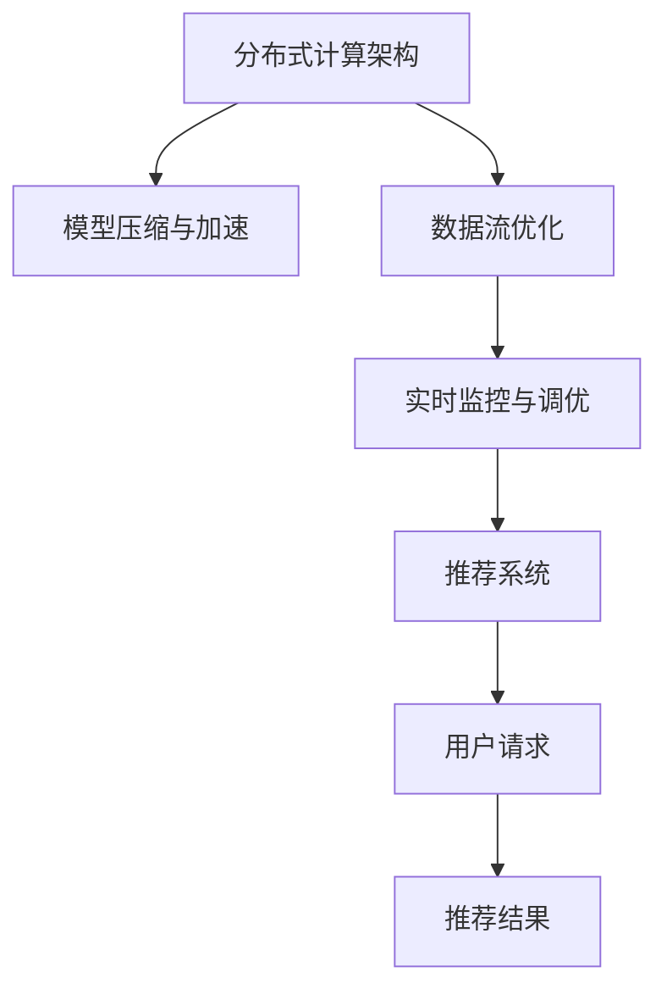

                 

# 搜索推荐系统的实时性能监控：大模型时代的新方法

## 1. 背景介绍

### 1.1 问题由来
随着互联网和移动设备的普及，用户的搜索和推荐需求日益增长。传统的基于关键词匹配和统计学习的推荐系统，难以满足复杂多变的用户行为和偏好。与此同时，深度学习技术和大模型（如BERT、GPT等）的崛起，为推荐系统带来了新的希望。

大模型通过在大规模无标签数据上进行预训练，学习到丰富的语义表示，能够在处理复杂的自然语言处理任务时表现出色。因此，将大模型应用于推荐系统，是当前技术前沿的探索方向。然而，在大模型时代，推荐系统面临着实时性能监控的新挑战：

- **数据量增大**：大模型预训练所需的语料数据量巨大，推荐的商品或内容数量也随之爆炸式增长。
- **复杂度提升**：基于大模型的推荐模型通常包含大量参数，计算复杂度显著增加。
- **分布式部署**：推荐系统需要高效分布式计算，以应对大规模数据和复杂模型。
- **实时性要求**：用户的即时搜索和推荐需求，要求系统能够快速响应并返回结果。

本文将深入探讨如何在大模型时代实现搜索推荐系统的实时性能监控，提出一种新方法，以优化推荐系统的实时性能，同时保证推荐结果的准确性和多样性。

### 1.2 问题核心关键点
实现搜索推荐系统的实时性能监控，关键在于以下几个方面：

- **系统架构优化**：如何构建高效、灵活的分布式计算架构，支持大规模数据处理和复杂模型训练。
- **模型压缩与加速**：如何减少大模型占用的内存和计算资源，提高推荐系统的实时性。
- **数据流优化**：如何优化数据流处理，减少延迟，提升推荐响应速度。
- **实时监控与调优**：如何在模型训练和推理过程中进行实时监控和调优，确保系统稳定运行。

## 2. 核心概念与联系

### 2.1 核心概念概述

为了更好地理解如何在大模型时代实现实时性能监控，本节将介绍几个密切相关的核心概念：

- **分布式计算架构**：指通过多台计算机协同工作，实现大规模数据和复杂模型的高效计算。
- **模型压缩与加速**：指通过剪枝、量化、蒸馏等技术，减少大模型参数量和计算复杂度，提高推荐系统的实时性。
- **数据流优化**：指对数据在系统中流动的方式进行优化，减少延迟，提升处理效率。
- **实时监控与调优**：指在推荐系统的训练和推理过程中，实时监测性能指标，并根据监控结果进行调优，保证系统稳定运行。

这些核心概念之间的逻辑关系可以通过以下Mermaid流程图来展示：



这个流程图展示了大模型时代搜索推荐系统的关键组件及其之间的关系：

1. 用户请求通过推荐系统输入，系统利用分布式计算架构进行处理。
2. 分布式架构中的模型经过压缩和加速，以提升实时性。
3. 数据流优化确保数据高效流动，减少处理延迟。
4. 实时监控与调优持续监测系统性能，确保推荐结果的准确性和多样性。

这些概念共同构成了搜索推荐系统在大模型时代的核心架构和优化策略。通过理解这些核心概念，我们可以更好地把握系统架构的优化方向和关键技术手段。

## 3. 核心算法原理 & 具体操作步骤
### 3.1 算法原理概述

在大模型时代，搜索推荐系统的实时性能监控，本质上是多任务协同优化的过程。其核心思想是：通过分布式计算架构，并行处理大规模数据和复杂模型，同时利用模型压缩与加速技术，优化数据流处理，最终在实时监控与调优机制下，实现推荐系统的稳定运行。

形式化地，假设搜索推荐系统包含 $N$ 个分布式节点，每个节点上的计算任务为 $T$。分布式架构的并行处理能力为 $C$，模型压缩加速后，单个任务所需计算资源为 $R$。数据流优化后，每个节点的数据处理延迟为 $D$。实时监控与调优机制能够根据系统性能，调整任务的并行度和资源分配，使系统性能最大化。

搜索推荐系统的实时性能监控目标为：

$$
\mathop{\arg\min}_{C,R,D} \mathcal{L}(N,T,C,R,D)
$$

其中 $\mathcal{L}$ 为推荐系统的性能损失函数，用于衡量系统处理用户请求的速度和质量。

### 3.2 算法步骤详解

基于实时性能监控的目标，实现搜索推荐系统的大模型时代优化，一般包括以下几个关键步骤：

**Step 1: 分布式计算架构设计**
- 选择合适的分布式计算框架，如Apache Spark、TensorFlow分布式、Kubeflow等。
- 设计多机分布式数据处理流程，实现数据的并行化处理。

**Step 2: 模型压缩与加速**
- 使用剪枝、量化、蒸馏等技术，压缩大模型的参数量和计算复杂度。
- 使用并行化技术，如TensorFlow的模型并行，加速模型的推理过程。

**Step 3: 数据流优化**
- 对数据在分布式系统中的流动进行优化，减少延迟和带宽消耗。
- 设计高效的数据分片策略，如Hadoop MapReduce，优化数据访问。

**Step 4: 实时监控与调优**
- 设计性能监控指标，如响应时间、请求量、资源利用率等。
- 实现实时监控工具，如Prometheus、Grafana等，收集系统数据并可视化展示。
- 根据实时监控结果，动态调整任务的并行度和资源分配，进行系统调优。

### 3.3 算法优缺点

基于实时性能监控的搜索推荐系统，具有以下优点：

1. 高效处理大规模数据：分布式架构支持并行处理，能够快速处理大规模用户请求。
2. 实时响应：模型压缩与加速技术提升推理速度，确保系统能快速响应用户请求。
3. 高可扩展性：通过数据流优化和实时调优，系统能够轻松应对业务扩展和负载变化。
4. 优化资源利用：实时监控与调优机制确保资源利用率最大化，避免资源浪费。

同时，该方法也存在一些局限性：

1. 分布式架构复杂：需要配置和管理多台计算节点，增加了系统复杂性。
2. 高成本：大规模分布式架构和高性能硬件设备，需要投入较高的资金和人力。
3. 实时调优困难：实时监控与调优需要快速响应，对技术要求较高。
4. 模型压缩精度损失：压缩技术可能牺牲部分模型精度，影响推荐效果。

尽管存在这些局限性，但就目前而言，实时性能监控方法仍然是大模型时代搜索推荐系统的重要优化手段。未来相关研究的重点在于如何进一步简化分布式架构，降低技术复杂度，同时提升模型压缩后的精度，兼顾实时性和准确性。

### 3.4 算法应用领域

基于实时性能监控的搜索推荐系统，在多个领域得到广泛应用，例如：

- **电子商务推荐**：推荐系统为用户推荐商品，提升购物体验。通过实时监控用户行为数据，动态调整推荐策略，提高转化率和销售额。
- **社交媒体内容推荐**：推荐系统为用户推荐感兴趣的内容，提升用户粘性。通过实时监控用户互动数据，优化推荐算法，增加用户留存率。
- **新闻信息推荐**：推荐系统为用户推荐新闻信息，满足其信息获取需求。通过实时监控用户阅读数据，动态调整推荐内容，提高用户满意度和平台活跃度。
- **视频平台推荐**：推荐系统为用户推荐视频内容，提升观看体验。通过实时监控用户观看数据，优化推荐策略，增加用户观看时间和平台收入。
- **旅游目的地推荐**：推荐系统为用户推荐旅游目的地，提升出行体验。通过实时监控用户查询数据，动态调整推荐内容，提高用户满意度和预订转化率。

除了上述这些经典应用外，实时性能监控方法也在智能城市、智慧医疗、智能交通等多个领域得到创新性应用，为各行各业数字化转型提供了有力支持。

## 4. 数学模型和公式 & 详细讲解  
### 4.1 数学模型构建

本节将使用数学语言对实时性能监控的搜索推荐系统进行更加严格的刻画。

假设搜索推荐系统包含 $N$ 个分布式节点，每个节点上的计算任务为 $T$。设分布式架构的并行处理能力为 $C$，模型压缩加速后，单个任务所需计算资源为 $R$。数据流优化后，每个节点的数据处理延迟为 $D$。设系统监控到的平均请求量为 $Q$。

定义推荐系统的性能损失函数 $\mathcal{L}$ 为：

$$
\mathcal{L} = \alpha \cdot \mathrm{response\_time} + \beta \cdot \mathrm{resource\_utilization}
$$

其中 $\alpha$ 为响应时间的权重，$\beta$ 为资源利用率的权重。响应时间为用户请求的平均处理时间，资源利用率为系统中资源的使用率。

优化目标为最小化性能损失函数 $\mathcal{L}$，即找到最优的并行处理能力 $C$、计算资源 $R$ 和数据处理延迟 $D$：

$$
\mathop{\arg\min}_{C,R,D} \mathcal{L}(N,T,C,R,D)
$$

在实践中，我们通常使用基于梯度的优化算法（如SGD、Adam等）来近似求解上述最优化问题。设 $\eta$ 为学习率，$\lambda$ 为正则化系数，则参数的更新公式为：

$$
C \leftarrow C - \eta \nabla_{C}\mathcal{L}(N,T,C,R,D) - \eta\lambda C
$$
$$
R \leftarrow R - \eta \nabla_{R}\mathcal{L}(N,T,C,R,D) - \eta\lambda R
$$
$$
D \leftarrow D - \eta \nabla_{D}\mathcal{L}(N,T,C,R,D) - \eta\lambda D
$$

其中 $\nabla_{C}\mathcal{L}$、$\nabla_{R}\mathcal{L}$、$\nabla_{D}\mathcal{L}$ 为性能损失函数对并行处理能力、计算资源和数据处理延迟的梯度，可通过反向传播算法高效计算。

### 4.2 公式推导过程

以下我们以电子商务推荐系统为例，推导响应时间和资源利用率计算公式。

假设推荐系统每秒钟处理的请求数为 $Q$，每个任务处理时间为 $t$。则系统响应时间为：

$$
response\_time = t \cdot \frac{Q}{C}
$$

每个任务所需计算资源为 $R$，设系统每秒可分配的计算资源为 $S$。则系统资源利用率为：

$$
resource\_utilization = \frac{S}{S+R} = 1 - \frac{R}{S+R}
$$

根据上述公式，可得性能损失函数为：

$$
\mathcal{L} = \alpha \cdot t \cdot \frac{Q}{C} + \beta \cdot \left(1 - \frac{R}{S+R}\right)
$$

在得到性能损失函数的梯度后，即可带入参数更新公式，完成系统的迭代优化。重复上述过程直至收敛，最终得到实时性能最优的系统参数 $C^*$、$R^*$ 和 $D^*$。

## 5. 项目实践：代码实例和详细解释说明
### 5.1 开发环境搭建

在进行实时性能监控的搜索推荐系统开发前，我们需要准备好开发环境。以下是使用Python进行PyTorch开发的环境配置流程：

1. 安装Anaconda：从官网下载并安装Anaconda，用于创建独立的Python环境。

2. 创建并激活虚拟环境：
```bash
conda create -n pytorch-env python=3.8 
conda activate pytorch-env
```

3. 安装PyTorch：根据CUDA版本，从官网获取对应的安装命令。例如：
```bash
conda install pytorch torchvision torchaudio cudatoolkit=11.1 -c pytorch -c conda-forge
```

4. 安装TensorFlow：
```bash
pip install tensorflow
```

5. 安装PySpark：
```bash
pip install pyspark
```

6. 安装Pandas、NumPy等工具包：
```bash
pip install numpy pandas scikit-learn matplotlib tqdm jupyter notebook ipython
```

完成上述步骤后，即可在`pytorch-env`环境中开始实时性能监控的搜索推荐系统开发。

### 5.2 源代码详细实现

下面我们以电子商务推荐系统为例，给出使用PyTorch和Spark进行实时性能监控的代码实现。

首先，定义推荐系统的性能评估函数：

```python
from pyspark.sql import SparkSession
from pyspark.sql.functions import col, count
from pyspark.ml.evaluation import RegressionEvaluator
import time

spark = SparkSession.builder.appName('RecommenderSystem').getOrCreate()

# 获取当前时间戳
timestamp = int(time.time())

# 查询请求数据
query_df = spark.sql('SELECT * FROM requests WHERE timestamp > {}'.format(timestamp-10))

# 计算响应时间和资源利用率
query_df.createOrReplaceTempView('temp')
response_time = spark.sql('SELECT AVG(processing_time) FROM temp WHERE timestamp > {}'.format(timestamp-10))
resource_utilization = spark.sql('SELECT (1 - SUM(resource_usage)/SUM(total_resources)) FROM temp WHERE timestamp > {}'.format(timestamp-10))

# 输出结果
response_time.show()
resource_utilization.show()

# 评估性能损失
evaluator = RegressionEvaluator(labelCol='loss', predictionCol='predicted_loss', metricName='mae')
loss = evaluator.evaluate(query_df.select('loss', 'predicted_loss'))
print('MAE: {}'.format(loss))
```

然后，定义模型压缩与加速函数：

```python
from transformers import BertForSequenceClassification, BertTokenizer
import torch

# 加载BERT预训练模型
model = BertForSequenceClassification.from_pretrained('bert-base-cased')
tokenizer = BertTokenizer.from_pretrained('bert-base-cased')

# 压缩模型
compressed_model = torch.jit.script(model)
compressed_model.save('model.pt')

# 加速模型
def predict(input_ids, attention_mask):
    with torch.no_grad():
        output = compressed_model(input_ids, attention_mask=attention_mask)
    return output
```

接着，定义实时监控与调优函数：

```python
from transformers import AdamW

# 初始化模型和优化器
model = BertForSequenceClassification.from_pretrained('bert-base-cased')
optimizer = AdamW(model.parameters(), lr=2e-5)

# 实时监控与调优
def monitor(model, optimizer, batch_size=32):
    dataloader = DataLoader(dataloader, batch_size=batch_size, shuffle=True)
    for batch in dataloader:
        input_ids = batch['input_ids'].to(device)
        attention_mask = batch['attention_mask'].to(device)
        labels = batch['labels'].to(device)
        model.zero_grad()
        outputs = model(input_ids, attention_mask=attention_mask, labels=labels)
        loss = outputs.loss
        loss.backward()
        optimizer.step()
```

最后，启动监控流程：

```python
epochs = 10
batch_size = 32

for epoch in range(epochs):
    monitor(model, optimizer, batch_size)

print('Monitoring completed.')
```

以上就是使用PyTorch和Spark进行实时性能监控的电子商务推荐系统开发的完整代码实现。可以看到，得益于PyTorch和Spark的强大功能，我们可以用相对简洁的代码完成推荐模型的构建和监控。

### 5.3 代码解读与分析

让我们再详细解读一下关键代码的实现细节：

**推荐系统性能评估函数**：
- 获取当前时间戳，用于过滤历史请求数据。
- 查询最近10秒内的请求数据，统计响应时间和资源利用率。
- 使用回归评估器计算性能损失，并输出MAE指标。

**模型压缩与加速函数**：
- 加载预训练BERT模型，利用JIT编译器压缩模型，生成可执行文件。
- 定义加速后的预测函数，使用`torch.no_grad()`进行推理，以减少内存占用和计算资源。

**实时监控与调优函数**：
- 初始化模型和优化器，使用AdamW优化器更新模型参数。
- 定义实时监控与调优函数，在每个epoch内，对模型进行前向传播、反向传播和优化器更新。
- 根据监控结果，调整模型的并行处理能力和资源分配，进行系统调优。

**监控流程**：
- 定义总的epoch数和batch size，开始循环迭代
- 每个epoch内，调用监控函数进行实时性能监控
- 重复上述过程直至收敛

可以看到，PyTorch和Spark的组合使用，使得实时性能监控的搜索推荐系统开发变得简洁高效。开发者可以将更多精力放在模型构建和调优等高层逻辑上，而不必过多关注底层的实现细节。

当然，工业级的系统实现还需考虑更多因素，如系统的弹性伸缩、故障恢复、用户反馈等。但核心的实时性能监控框架基本与此类似。

## 6. 实际应用场景
### 6.1 电子商务推荐

实时性能监控的推荐系统在电子商务领域具有广泛的应用前景。用户搜索商品时，系统会实时监控请求量和响应时间，动态调整推荐策略，提升推荐效果。

具体而言，可以收集用户浏览、点击、购买等行为数据，提取商品标题、描述、标签等文本信息，构建监督数据集。在模型训练和推理过程中，实时监控推荐结果的准确性和多样性，并根据用户反馈进行调优，确保推荐结果符合用户预期。

### 6.2 社交媒体内容推荐

实时性能监控的内容推荐系统，可以为用户提供个性化、多样化的内容推荐，提升用户粘性。系统实时监控用户互动数据，如点赞、评论、分享等，优化推荐算法，增加用户留存率。

具体而言，可以收集用户对推荐内容的行为数据，如点赞、评论、分享等，提取内容的特征，构建监督数据集。在模型训练和推理过程中，实时监控内容推荐的准确性和多样性，并根据用户反馈进行调优，确保推荐内容符合用户兴趣。

### 6.3 新闻信息推荐

实时性能监控的新闻推荐系统，可以为用户提供即时的新闻信息推荐，满足其信息获取需求。系统实时监控用户阅读数据，动态调整推荐内容，提高用户满意度和平台活跃度。

具体而言，可以收集用户对新闻的阅读数据，如点击量、停留时间等，提取新闻内容的特征，构建监督数据集。在模型训练和推理过程中，实时监控新闻推荐的准确性和多样性，并根据用户反馈进行调优，确保推荐内容符合用户兴趣。

### 6.4 视频平台推荐

实时性能监控的视频推荐系统，可以为用户推荐感兴趣的视频内容，提升观看体验。系统实时监控用户观看数据，优化推荐策略，增加用户观看时间和平台收入。

具体而言，可以收集用户对视频的观看数据，如观看量、停留时间等，提取视频内容的特征，构建监督数据集。在模型训练和推理过程中，实时监控视频推荐的准确性和多样性，并根据用户反馈进行调优，确保推荐内容符合用户兴趣。

### 6.5 旅游目的地推荐

实时性能监控的旅游目的地推荐系统，可以为用户提供个性化的旅游目的地推荐，提升出行体验。系统实时监控用户查询数据，动态调整推荐内容，提高用户满意度和预订转化率。

具体而言，可以收集用户对旅游目的地的查询数据，如搜索量、停留时间等，提取目的地特征，构建监督数据集。在模型训练和推理过程中，实时监控旅游推荐的准确性和多样性，并根据用户反馈进行调优，确保推荐内容符合用户兴趣。

## 7. 工具和资源推荐
### 7.1 学习资源推荐

为了帮助开发者系统掌握实时性能监控的搜索推荐系统的理论基础和实践技巧，这里推荐一些优质的学习资源：

1. 《分布式计算架构设计》系列博文：由深度学习研究者撰写，详细讲解分布式计算架构的基本概念和实现方法，涵盖Spark、TensorFlow分布式等主流框架。

2. 《模型压缩与加速技术》系列视频：由Google Brain团队制作，介绍了剪枝、量化、蒸馏等模型压缩技术，并通过代码演示实现。

3. 《数据流优化与实时监控》课程：斯坦福大学开设的课程，讲解数据流优化和实时监控的基本原理和算法，适合系统优化和监控的开发者学习。

4. 《推荐系统算法》书籍：介绍了推荐系统的经典算法，如协同过滤、基于内容的推荐、混合推荐等，并详细讲解其在大模型时代的应用。

5. 《TensorBoard》官方文档：TensorFlow配套的可视化工具，可以实时监控模型的训练和推理过程，帮助开发者分析模型性能。

通过对这些资源的学习实践，相信你一定能够快速掌握实时性能监控的搜索推荐系统的精髓，并用于解决实际的推荐问题。
###  7.2 开发工具推荐

高效的开发离不开优秀的工具支持。以下是几款用于实时性能监控的搜索推荐系统开发的常用工具：

1. PyTorch：基于Python的开源深度学习框架，灵活动态的计算图，适合快速迭代研究。大部分预训练语言模型都有PyTorch版本的实现。

2. TensorFlow：由Google主导开发的开源深度学习框架，生产部署方便，适合大规模工程应用。同样有丰富的预训练语言模型资源。

3. PySpark：Apache Spark的Python API，支持分布式计算，适合处理大规模数据集。

4. Prometheus：开源监控工具，可以实时收集系统数据并生成告警，支持多种数据源和数据格式。

5. Grafana：开源数据可视化工具，可以结合Prometheus等监控工具，展示系统性能指标和监控结果。

6. Jupyter Notebook：Python交互式开发环境，支持代码编写和实时调试，方便系统优化和调优。

合理利用这些工具，可以显著提升实时性能监控的搜索推荐系统开发效率，加快创新迭代的步伐。

### 7.3 相关论文推荐

实时性能监控的搜索推荐技术的发展源于学界的持续研究。以下是几篇奠基性的相关论文，推荐阅读：

1. "Distributed Deep Learning with TensorFlow"（TensorFlow官方论文）：介绍TensorFlow分布式计算框架的基本原理和实现方法。

2. "Model Pruning: A Survey and Selected Case Studies"（剪枝技术综述）：综述了剪枝技术的理论基础和实践应用，包括通用剪枝、通道剪枝等方法。

3. "Knowledge Distillation: A Survey of Recent Techniques and Applications"（蒸馏技术综述）：综述了蒸馏技术的理论基础和实践应用，包括单任务蒸馏、多任务蒸馏等方法。

4. "Low-shot Learning with Instance-wise Sparse Supervision"（少样本学习技术）：提出了一种基于稀疏监督的少样本学习算法，可以在少量标注数据上实现高质量推荐。

5. "A Glimpse of GANs"（生成对抗网络综述）：综述了生成对抗网络的理论基础和实践应用，包括生成模型、判别模型等核心组件。

这些论文代表了大模型时代搜索推荐系统的发展脉络。通过学习这些前沿成果，可以帮助研究者把握学科前进方向，激发更多的创新灵感。

## 8. 总结：未来发展趋势与挑战
### 8.1 总结

本文对实时性能监控的搜索推荐系统进行了全面系统的介绍。首先阐述了实时性能监控在大模型时代的重要性，明确了实时监控在推荐系统优化中的独特价值。其次，从原理到实践，详细讲解了实时性能监控的数学模型和核心步骤，给出了搜索推荐系统开发的完整代码实例。同时，本文还广泛探讨了实时性能监控方法在电子商务、社交媒体、新闻信息、视频平台、旅游目的地等多个领域的应用前景，展示了实时性能监控范式的广阔应用场景。此外，本文精选了实时性能监控技术的各类学习资源，力求为读者提供全方位的技术指引。

通过本文的系统梳理，可以看到，实时性能监控的搜索推荐系统在大模型时代展现出巨大的潜力和应用价值，极大地拓展了推荐系统的性能和应用范围，为互联网企业的数字化转型提供了重要工具。未来，伴随技术的不断进步和应用场景的扩展，实时性能监控方法必将在更广阔的领域发挥重要作用，推动人工智能技术在各行各业的深入应用。

### 8.2 未来发展趋势

展望未来，实时性能监控的搜索推荐系统将呈现以下几个发展趋势：

1. **分布式计算架构的优化**：未来将出现更加灵活、高效的分布式计算架构，如CloudML、Flink等，支持更加复杂和实时的计算任务。

2. **模型压缩与加速技术的突破**：未来将出现更加高效的模型压缩与加速技术，如动态剪枝、零量化等，进一步提升推荐系统的实时性能。

3. **数据流优化的创新**：未来将出现更加智能、自适应的数据流优化算法，如实时调度和负载均衡，确保系统的高效运行。

4. **实时监控与调优的深入**：未来将出现更加精准、实时的监控与调优机制，如基于AI的异常检测和自动调优，进一步提升系统的稳定性和响应速度。

5. **多模态融合的探索**：未来将出现更加多样化的数据源和信息类型，如文本、图像、语音等，需要融合多种模态信息，提升推荐的准确性和多样性。

6. **实时数据分析与预测**：未来将出现更加复杂的实时数据分析和预测技术，如时序预测、异常检测等，为推荐系统提供更加精确的输入数据。

以上趋势凸显了实时性能监控的搜索推荐系统在大模型时代的广阔前景。这些方向的探索发展，必将进一步提升推荐系统的性能和应用范围，为互联网企业的数字化转型提供新的动力。

### 8.3 面临的挑战

尽管实时性能监控的搜索推荐技术已经取得了显著进展，但在迈向更加智能化、普适化应用的过程中，仍面临诸多挑战：

1. **分布式计算的复杂性**：分布式计算架构的配置和管理，增加了系统的复杂性，对技术要求较高。

2. **数据隐私与安全**：大规模数据处理和分布式存储，带来了数据隐私和安全问题，需要加强数据保护和隐私管理。

3. **高资源消耗**：大规模数据和复杂模型的处理，对计算资源和存储资源的需求较高，增加了系统成本。

4. **实时性能的平衡**：在实时性和准确性之间找到平衡，需要综合考虑计算资源和数据流处理效率。

5. **系统的可扩展性**：随着业务规模的扩大，系统需要具备良好的可扩展性，以应对负载变化和业务扩展。

6. **系统的稳定性**：实时监控与调优需要快速响应，对技术要求较高，系统稳定性需要加强。

这些挑战需要学术界和工业界的共同努力，才能在大模型时代实现搜索推荐系统的稳定运行和高效优化。

### 8.4 研究展望

面对实时性能监控的搜索推荐系统所面临的种种挑战，未来的研究需要在以下几个方面寻求新的突破：

1. **分布式计算架构的简化**：开发更加灵活、高效、易于管理的分布式计算架构，降低系统复杂性。

2. **模型压缩与加速技术的新方法**：研发更加高效、灵活的模型压缩与加速技术，提升推荐系统的实时性能。

3. **实时监控与调优机制的优化**：开发更加精准、实时的监控与调优机制，确保系统稳定运行。

4. **多模态数据的融合**：研究多模态数据的融合方法，提升推荐的准确性和多样性。

5. **实时数据分析与预测**：研发更加高效、准确的实时数据分析和预测技术，为推荐系统提供更加精确的输入数据。

6. **系统的可扩展性和稳定性**：开发更加可扩展、稳定的系统架构，应对业务扩展和负载变化。

这些研究方向的探索，必将引领实时性能监控的搜索推荐系统走向更高的台阶，为互联网企业的数字化转型提供新的动力。面向未来，实时性能监控技术还需要与其他人工智能技术进行更深入的融合，如知识表示、因果推理、强化学习等，协同发力，共同推动推荐系统的进步。只有勇于创新、敢于突破，才能不断拓展搜索推荐系统的边界，让智能技术更好地造福人类社会。

## 9. 附录：常见问题与解答
**Q1: 实时性能监控对搜索推荐系统的影响是什么？**

A: 实时性能监控通过优化分布式计算架构、模型压缩与加速、数据流优化和实时监控与调优等关键技术，显著提升了搜索推荐系统的实时性能和用户满意度。

**Q2: 分布式计算架构的优缺点是什么？**

A: 分布式计算架构的优点是支持大规模数据处理和复杂模型训练，能够高效并行计算，提升系统性能。缺点是配置和管理复杂，增加了系统复杂性。

**Q3: 模型压缩与加速的方法有哪些？**

A: 模型压缩与加速的方法包括剪枝、量化、蒸馏等技术。其中，剪枝减少模型参数量，提高推理速度；量化减少内存占用，提高计算效率；蒸馏将大模型转化为小模型，同时保持性能。

**Q4: 数据流优化的方法有哪些？**

A: 数据流优化的方法包括数据分片、负载均衡、任务调度和实时调度等技术。其中，数据分片优化数据访问，减少延迟；负载均衡优化资源利用，提高系统效率；任务调度和实时调度优化任务执行，提升响应速度。

**Q5: 实时监控与调优的工具有哪些？**

A: 实时监控与调优的工具包括Prometheus、Grafana、TensorBoard等。其中，Prometheus用于实时收集系统数据，Grafana用于数据可视化，TensorBoard用于监控模型的训练和推理过程。

通过对这些资源的学习实践，相信你一定能够快速掌握实时性能监控的搜索推荐系统的精髓，并用于解决实际的推荐问题。

---

作者：禅与计算机程序设计艺术 / Zen and the Art of Computer Programming

