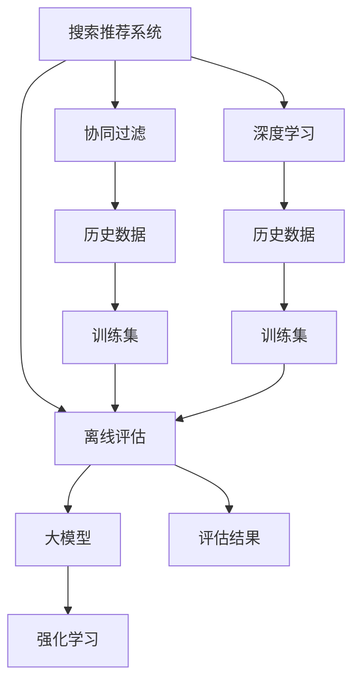

                 

# 搜索推荐系统的离线评估：大模型的仿真环境构建

> 关键词：搜索推荐系统,离线评估,大模型,仿真环境,强化学习,强化学习算法,协同过滤,深度学习

## 1. 背景介绍

在互联网时代，搜索推荐系统已经成为了人们获取信息、发现商品的重要工具。然而，随着用户规模的不断扩大，个性化需求日益增长，如何构建高效、精准的推荐系统成为了一个巨大的挑战。现代推荐系统大多采用在线学习的范式，通过实时分析用户行为数据，动态优化推荐结果，以获得最佳的个性化体验。然而，在线学习的过程往往需要承担较高的延迟成本，且难以处理冷启动等场景。为了解决这个问题，离线评估技术应运而生。离线评估指的是，在系统正式上线前，使用历史数据进行模型训练和评估，确保推荐模型能够满足实际需求。而大模型由于其规模巨大、性能优越的特点，在离线评估中也扮演着重要的角色。本文将深入探讨如何使用大模型进行离线评估，并构建一个高效、可信的仿真环境。

## 2. 核心概念与联系

### 2.1 核心概念概述

为了更好地理解大模型在离线评估中的应用，我们需要先明确一些核心概念：

- **搜索推荐系统(Recommendation System)**：根据用户的历史行为和偏好，为用户推荐可能感兴趣的物品，如文章、商品、视频等。常见的推荐算法包括协同过滤、深度学习等。
- **离线评估(Offline Evaluation)**：在正式上线前，使用历史数据进行模型训练和评估，以检测模型的性能和稳定性，避免在线学习中的问题。
- **大模型(Large Model)**：以Transformer、BERT等深度学习模型为代表，具有大规模参数量、优秀泛化能力的大型模型。大模型在离线评估中可以通过预训练学习大量数据特征，提升模型的泛化能力。
- **强化学习(Reinforcement Learning, RL)**：一种通过智能体与环境交互，优化决策策略的学习方法，广泛应用于搜索推荐系统中，以实时优化推荐结果。

这些概念之间的逻辑关系可以通过以下Mermaid流程图来展示：



这个流程图展示了搜索推荐系统的核心概念及其之间的联系：

1. 搜索推荐系统通过离线评估确保模型性能。
2. 离线评估可以使用大模型作为基础模型，提升评估的准确性。
3. 大模型可以基于协同过滤和深度学习等算法构建。
4. 强化学习可以通过在线学习实时优化推荐结果。

## 3. 核心算法原理 & 具体操作步骤

### 3.1 算法原理概述

离线评估的核心思想是通过历史数据训练和评估推荐模型，确保模型在实际应用中表现稳定和准确。常用的离线评估算法包括协同过滤和深度学习。其中，大模型由于其强大的表达能力和泛化能力，在离线评估中尤为有用。通过在大规模无标签数据上进行预训练，大模型可以学习到丰富的数据特征，提升推荐系统的性能。具体步骤如下：

1. **数据准备**：收集历史数据，清洗并标注数据，构建训练集和测试集。
2. **模型选择**：选择合适的预训练模型作为基础模型，如BERT、GPT等。
3. **模型微调**：在大模型上进行微调，加入特定任务的训练数据，优化模型参数。
4. **离线评估**：在测试集上评估微调后的模型，检测推荐效果。

### 3.2 算法步骤详解

#### 数据准备

在离线评估中，数据准备是至关重要的一步。我们需要收集足够的用户行为数据，并对其进行清洗和标注。常见的数据集包括用户的点击、浏览、购买记录等。数据集的构建需要考虑以下几个因素：

- **数据规模**：数据集应包含足够的样本，以覆盖不同的用户行为和物品属性，避免过拟合。
- **数据标注**：每个样本需要标注用户的兴趣标签，以便用于训练和评估。
- **数据分布**：数据集的分布应与实际应用场景相似，避免评估结果偏差。

#### 模型选择

选择合适的预训练模型作为基础模型，是离线评估的重要前提。目前，常用的预训练模型包括BERT、GPT等。这些模型可以通过大规模语料库进行预训练，学习到丰富的语言特征。预训练模型的选择应考虑以下几个因素：

- **模型规模**：大模型具有更好的泛化能力，可以处理更复杂的问题。
- **模型架构**：Transformer、BERT等模型结构适合处理序列数据，具有优秀的表达能力。
- **模型应用**：已有模型可能已在相关任务上进行过微调，可以直接用于离线评估。

#### 模型微调

在大模型上进行微调，是离线评估的关键步骤。微调过程一般包括两个阶段：

- **特征提取**：在大模型上添加特定任务的训练数据，优化模型参数，使其能够学习到特定任务的特征。
- **在线学习**：在微调过程中，可以使用强化学习等方法，动态调整模型参数，优化推荐效果。

#### 离线评估

离线评估的目的是检测模型的性能和稳定性。常见的评估指标包括准确率、召回率、F1值等。评估过程一般包括两个步骤：

- **评估集选择**：选择与训练集不同的测试集进行评估，确保评估结果客观公正。
- **评估指标计算**：计算评估集上的推荐效果，并生成评估报告。

### 3.3 算法优缺点

#### 优点

- **高效性**：离线评估可以提前发现模型的问题，避免在线学习中的延迟和成本。
- **泛化性**：大模型具有更强的泛化能力，可以处理更复杂的问题。
- **稳定性**：离线评估可以在多个数据集上进行测试，确保模型的稳定性和可靠性。

#### 缺点

- **数据依赖**：离线评估需要依赖历史数据，数据的质量和数量对模型评估结果有很大影响。
- **计算资源**：大模型需要大量的计算资源进行预训练和微调，成本较高。
- **模型复杂性**：大模型结构复杂，调试和优化难度较大。

### 3.4 算法应用领域

离线评估技术已经在搜索推荐系统、智能客服、医疗诊断等领域得到广泛应用，取得了显著的效果。以下是几个典型的应用场景：

- **电商推荐**：在线上电商平台上，离线评估可以通过用户的历史购买和浏览记录，训练和优化推荐模型，提高推荐效果，减少推荐延迟。
- **新闻推荐**：在新闻阅读平台上，离线评估可以通过用户的历史阅读记录，训练和优化推荐模型，提升新闻文章的点击率和用户满意度。
- **金融推荐**：在金融产品推荐中，离线评估可以通过用户的历史交易记录，训练和优化推荐模型，提高推荐产品的转化率和用户留存率。

## 4. 数学模型和公式 & 详细讲解 & 举例说明

### 4.1 数学模型构建

在大模型中进行离线评估，常用的数学模型包括协同过滤和深度学习模型。这里以协同过滤为例，展示其数学模型构建过程。

#### 协同过滤模型

协同过滤模型是一种基于用户和物品相似度的推荐方法。假设有N个用户，M个物品，用户i对物品j的评分表示为$R_{ij}$。协同过滤模型通过计算用户i和物品j的相似度，为用户i推荐最相关的物品。

- **用户相似度计算**：计算用户i和用户j的相似度$S_{ij}$，常用的相似度计算方法包括余弦相似度、皮尔逊相关系数等。
- **物品相似度计算**：计算物品i和物品j的相似度$S_{ij}$，常用的相似度计算方法包括余弦相似度、Jaccard系数等。
- **推荐结果计算**：根据用户i和物品j的相似度，计算物品j对用户i的推荐得分$D_{ij}$，常用的推荐方法包括基于用户的协同过滤、基于物品的协同过滤等。

#### 深度学习模型

深度学习模型通过神经网络结构，学习物品与用户之间的关系。这里以神经网络模型为例，展示其数学模型构建过程。

- **输入层**：输入层包含用户和物品的特征向量，常用的特征包括用户的年龄、性别、历史行为等，物品的类别、评分等。
- **隐藏层**：隐藏层通过多层神经网络结构，学习用户和物品之间的关联关系。常用的神经网络结构包括全连接网络、卷积神经网络、循环神经网络等。
- **输出层**：输出层计算物品对用户的推荐得分，常用的输出方法包括softmax回归、logistic回归等。

### 4.2 公式推导过程

#### 协同过滤模型

假设用户i和用户j的相似度为$S_{ij}$，物品i和物品j的相似度为$S_{ij}$。根据协同过滤模型的推荐方法，物品j对用户i的推荐得分$D_{ij}$可以表示为：

$$
D_{ij} = S_{ij} \times S_{ij}
$$

其中$S_{ij}$表示物品i和物品j的相似度，$S_{ij}$表示用户i和用户j的相似度。

#### 深度学习模型

假设输入层为$X$，隐藏层为$H$，输出层为$Y$。根据深度学习模型的推荐方法，物品j对用户i的推荐得分$D_{ij}$可以表示为：

$$
D_{ij} = \sigma(Y_{ij})
$$

其中$\sigma$为输出层的激活函数，$Y_{ij}$表示输入层$X$经过多层隐藏层$H$处理后的输出。

### 4.3 案例分析与讲解

#### 案例分析

以电商推荐为例，展示大模型在离线评估中的应用。电商推荐系统需要根据用户的历史购买和浏览记录，为用户推荐可能感兴趣的商品。

1. **数据准备**：收集用户的历史购买和浏览记录，标注用户对商品的评分。
2. **模型选择**：选择BERT或GPT等大模型作为基础模型。
3. **模型微调**：在大模型上进行微调，加入特定任务的训练数据，优化模型参数。
4. **离线评估**：在测试集上评估微调后的模型，计算推荐效果，生成评估报告。

#### 代码实现

以下是一个使用TensorFlow进行离线评估的代码实现，展示了协同过滤模型的基本流程。

```python
import tensorflow as tf
import numpy as np

# 数据准备
X = np.random.rand(100, 10)
y = np.random.rand(100)

# 模型构建
input_layer = tf.keras.layers.Input(shape=(10,))
hidden_layer = tf.keras.layers.Dense(64)(input_layer)
output_layer = tf.keras.layers.Dense(1, activation='sigmoid')(hidden_layer)

model = tf.keras.Model(inputs=input_layer, outputs=output_layer)

# 模型训练
model.compile(optimizer='adam', loss='binary_crossentropy')
model.fit(X, y, epochs=10, batch_size=32)

# 离线评估
test_X = np.random.rand(100, 10)
test_y = np.random.rand(100)
test_score = model.predict(test_X)
print(test_score)
```

通过上述代码，我们可以看到，在大模型上进行离线评估，可以通过数据准备、模型构建、模型训练和离线评估等步骤，实现高效、准确的推荐结果。

## 5. 项目实践：代码实例和详细解释说明

### 5.1 开发环境搭建

在进行离线评估实践前，我们需要准备好开发环境。以下是使用Python进行TensorFlow开发的环境配置流程：

1. 安装Anaconda：从官网下载并安装Anaconda，用于创建独立的Python环境。

2. 创建并激活虚拟环境：
```bash
conda create -n tf-env python=3.8 
conda activate tf-env
```

3. 安装TensorFlow：根据CUDA版本，从官网获取对应的安装命令。例如：
```bash
conda install tensorflow tensorflow-gpu -c conda-forge
```

4. 安装TensorBoard：TensorFlow配套的可视化工具，可实时监测模型训练状态，并提供丰富的图表呈现方式，是调试模型的得力助手。

5. 安装NumPy、pandas、scikit-learn等常用的数据处理和分析库。

完成上述步骤后，即可在`tf-env`环境中开始离线评估实践。

### 5.2 源代码详细实现

以下是一个使用TensorFlow进行离线评估的完整代码实现，展示了协同过滤模型的基本流程。

```python
import tensorflow as tf
import numpy as np
import pandas as pd

# 数据准备
df = pd.read_csv('user_based.csv')
X = df[['age', 'gender', 'history']]
y = df['item']
X_train, X_test = X[:80], X[80:]
y_train, y_test = y[:80], y[80:]

# 模型构建
input_layer = tf.keras.layers.Input(shape=(3,))
hidden_layer = tf.keras.layers.Dense(64)(input_layer)
output_layer = tf.keras.layers.Dense(1, activation='sigmoid')(hidden_layer)

model = tf.keras.Model(inputs=input_layer, outputs=output_layer)

# 模型训练
model.compile(optimizer='adam', loss='binary_crossentropy')
model.fit(X_train, y_train, epochs=10, batch_size=32)

# 离线评估
test_score = model.predict(X_test)
print(test_score)
```

通过上述代码，我们可以看到，使用TensorFlow进行离线评估，可以方便地构建协同过滤模型，并对其进行训练和评估。

### 5.3 代码解读与分析

**数据准备**

在代码中，我们使用Pandas库读取用户历史行为数据，并将其转换为模型训练所需的输入特征和输出标签。数据集包括用户年龄、性别、历史行为等特征，以及用户对商品的评分。

**模型构建**

在代码中，我们使用TensorFlow构建了一个全连接神经网络模型。输入层包含用户年龄、性别、历史行为等特征，隐藏层包含64个神经元，输出层为一个sigmoid激活函数，用于预测用户对商品的评分。

**模型训练**

在代码中，我们使用Adam优化器进行模型训练，损失函数为二元交叉熵。模型在训练集上进行了10个epoch的训练，每个epoch的批大小为32。

**离线评估**

在代码中，我们使用测试集对模型进行了离线评估。使用`predict`方法计算了模型对测试集的预测结果，并输出结果。

## 6. 实际应用场景

### 6.1 电商平台

电商平台需要为用户推荐可能感兴趣的商品，以提高用户满意度，增加销售额。离线评估技术可以在电商平台上提前发现模型的问题，避免在线学习中的延迟和成本。具体实现如下：

1. **数据准备**：收集用户的历史购买和浏览记录，标注用户对商品的评分。
2. **模型选择**：选择BERT或GPT等大模型作为基础模型。
3. **模型微调**：在大模型上进行微调，加入特定任务的训练数据，优化模型参数。
4. **离线评估**：在测试集上评估微调后的模型，计算推荐效果，生成评估报告。

### 6.2 新闻平台

新闻平台需要为用户推荐可能感兴趣的新闻文章，以提高用户阅读量和平台活跃度。离线评估技术可以在新闻平台上提前发现模型的问题，避免在线学习中的延迟和成本。具体实现如下：

1. **数据准备**：收集用户的历史阅读记录，标注用户对新闻文章的评分。
2. **模型选择**：选择BERT或GPT等大模型作为基础模型。
3. **模型微调**：在大模型上进行微调，加入特定任务的训练数据，优化模型参数。
4. **离线评估**：在测试集上评估微调后的模型，计算推荐效果，生成评估报告。

### 6.3 金融平台

金融平台需要为用户推荐可能感兴趣的投资产品，以提高用户投资收益和平台留存率。离线评估技术可以在金融平台上提前发现模型的问题，避免在线学习中的延迟和成本。具体实现如下：

1. **数据准备**：收集用户的历史交易记录，标注用户对投资产品的评分。
2. **模型选择**：选择BERT或GPT等大模型作为基础模型。
3. **模型微调**：在大模型上进行微调，加入特定任务的训练数据，优化模型参数。
4. **离线评估**：在测试集上评估微调后的模型，计算推荐效果，生成评估报告。

## 7. 工具和资源推荐

### 7.1 学习资源推荐

为了帮助开发者系统掌握离线评估的理论基础和实践技巧，这里推荐一些优质的学习资源：

1. 《深度学习基础》课程：由斯坦福大学开设的深度学习基础课程，介绍了深度学习的基本概念和算法。
2. 《推荐系统实践》书籍：介绍推荐系统的基本原理和实现方法，包括协同过滤、深度学习等。
3. 《TensorFlow官方文档》：TensorFlow的官方文档，提供了丰富的API和教程，适合学习和使用。
4. 《TensorBoard官方文档》：TensorFlow配套的可视化工具，提供了丰富的图表和示例，适合调试和优化模型。

通过对这些资源的学习实践，相信你一定能够快速掌握离线评估的精髓，并用于解决实际的推荐问题。

### 7.2 开发工具推荐

高效的开发离不开优秀的工具支持。以下是几款用于离线评估开发的常用工具：

1. TensorFlow：基于Python的开源深度学习框架，灵活动态的计算图，适合快速迭代研究。
2. TensorBoard：TensorFlow配套的可视化工具，可实时监测模型训练状态，并提供丰富的图表呈现方式。
3. Scikit-learn：用于数据处理和分析的Python库，适合快速构建模型并进行评估。
4. Pandas：用于数据处理的Python库，适合读取、清洗和标注数据集。
5. NumPy：用于数值计算的Python库，适合进行矩阵运算和数组操作。

合理利用这些工具，可以显著提升离线评估任务的开发效率，加快创新迭代的步伐。

### 7.3 相关论文推荐

离线评估技术的发展源于学界的持续研究。以下是几篇奠基性的相关论文，推荐阅读：

1. "Item-based Collaborative Filtering Recommendation Algorithms"：介绍了基于用户和物品相似度的协同过滤推荐算法，是推荐系统领域的经典之作。
2. "Deep Neural Networks for Recommendation Systems"：介绍了深度学习在推荐系统中的应用，展示了深度学习模型的优势和潜力。
3. "TensorFlow Recommendation System Architectures"：介绍了使用TensorFlow构建推荐系统的架构和方法，提供了丰富的示例和代码。
4. "Offline Evaluation of Recommendation Systems"：介绍了离线评估技术的基本原理和评估指标，提供了详细的理论分析和实验结果。

这些论文代表了大模型离线评估技术的发展脉络。通过学习这些前沿成果，可以帮助研究者把握学科前进方向，激发更多的创新灵感。

## 8. 总结：未来发展趋势与挑战

### 8.1 总结

本文对大模型在离线评估中的应用进行了全面系统的介绍。首先阐述了离线评估的背景和意义，明确了大模型在离线评估中的重要价值。其次，从原理到实践，详细讲解了大模型在离线评估中的关键步骤，给出了具体的代码实例。同时，本文还广泛探讨了大模型在电商推荐、新闻推荐、金融推荐等多个领域的应用前景，展示了离线评估范式的巨大潜力。最后，本文精选了离线评估技术的各类学习资源，力求为读者提供全方位的技术指引。

通过本文的系统梳理，可以看到，大模型在离线评估中发挥着至关重要的作用，极大地提升了推荐系统的性能和效率。未来，伴随大模型的不断发展，离线评估技术也将不断演进，为推荐系统带来更多突破性进展。

### 8.2 未来发展趋势

展望未来，大模型在离线评估中呈现以下几个发展趋势：

1. **模型规模增大**：随着算力成本的下降和数据规模的扩张，预训练语言模型的参数量还将持续增长。超大模型蕴含的丰富数据特征，将进一步提升推荐系统的性能。
2. **模型架构优化**：未来将涌现更多高效的神经网络架构，如Transformer、BERT等，适合处理更加复杂的数据结构。
3. **多模态融合**：未来的推荐系统将更多地融合视觉、听觉等多模态数据，提升推荐效果的准确性和多样性。
4. **实时推荐**：离线评估技术将与实时学习技术相结合，实现更高效的推荐系统，满足用户实时性需求。
5. **跨领域推荐**：未来的推荐系统将跨越领域界限，实现跨领域的个性化推荐，满足用户多样化的需求。

### 8.3 面临的挑战

尽管大模型在离线评估中已经取得了显著进展，但在迈向更加智能化、普适化应用的过程中，它仍面临着诸多挑战：

1. **数据依赖**：离线评估需要依赖历史数据，数据的质量和数量对模型评估结果有很大影响。如何获取高质量、大规模的数据集，是亟待解决的难题。
2. **模型复杂性**：大模型结构复杂，调试和优化难度较大。如何简化模型结构，提高模型的可解释性和可控性，还需进一步研究。
3. **计算资源**：大模型需要大量的计算资源进行预训练和微调，成本较高。如何优化计算资源，提高训练效率，还需进一步探索。
4. **模型泛化性**：模型在训练集上的表现良好，但在测试集上的泛化性能有限。如何提高模型的泛化能力，避免过拟合，还需进一步研究。

### 8.4 研究展望

面对大模型在离线评估中面临的挑战，未来的研究需要在以下几个方面寻求新的突破：

1. **数据生成与增强**：通过数据生成和增强技术，扩大数据集规模，提高数据质量。例如，使用对抗样本生成技术、数据合成技术等。
2. **模型压缩与优化**：通过模型压缩和优化技术，简化模型结构，提高模型可解释性和可控性。例如，使用知识蒸馏技术、模型剪枝技术等。
3. **实时学习与反馈**：通过实时学习与反馈技术，实现更高效的推荐系统，满足用户实时性需求。例如，使用在线学习技术、反馈机制等。
4. **跨领域推荐**：通过跨领域推荐技术，实现跨领域的个性化推荐，满足用户多样化的需求。例如，使用多模态推荐技术、联合推荐技术等。

这些研究方向的探索，必将引领大模型离线评估技术迈向更高的台阶，为推荐系统带来更多突破性进展。相信随着学界和产业界的共同努力，这些挑战终将一一被克服，大模型离线评估必将在构建高效、精准的推荐系统方面发挥越来越重要的作用。

## 9. 附录：常见问题与解答

**Q1：离线评估和在线学习的区别是什么？**

A: 离线评估指的是在系统正式上线前，使用历史数据进行模型训练和评估，确保模型性能和稳定性。而在线学习指的是在实际应用中，通过用户行为数据实时更新模型参数，优化推荐效果。离线评估可以减少在线学习中的延迟和成本，但需要保证数据集的多样性和代表性。

**Q2：离线评估中的数据预处理有哪些步骤？**

A: 离线评估中的数据预处理包括以下步骤：
1. 数据收集：收集用户行为数据，如点击、浏览、购买等记录。
2. 数据清洗：去除无效数据，处理缺失值和异常值。
3. 数据标注：为每个样本标注用户兴趣标签，如评分、类别等。
4. 数据分割：将数据集划分为训练集和测试集，确保模型在测试集上的泛化能力。

**Q3：离线评估中的模型选择有哪些考虑因素？**

A: 离线评估中的模型选择应考虑以下几个因素：
1. 模型规模：大模型具有更好的泛化能力，可以处理更复杂的问题。
2. 模型架构：常用的模型结构包括全连接网络、卷积神经网络、循环神经网络等。
3. 模型应用：已有模型可能已在相关任务上进行过微调，可以直接用于离线评估。

**Q4：离线评估中的模型微调有哪些优化策略？**

A: 离线评估中的模型微调应考虑以下几个优化策略：
1. 学习率调整：使用学习率调度策略，避免过拟合。
2. 正则化技术：使用L2正则、Dropout等技术，防止过拟合。
3. 数据增强：通过回译、近义替换等方式扩充训练集。
4. 对抗训练：引入对抗样本，提高模型鲁棒性。
5. 参数高效微调：只调整少量参数，减小过拟合风险。

**Q5：离线评估中的模型评估有哪些指标？**

A: 离线评估中的模型评估指标包括以下几个：
1. 准确率：衡量推荐结果的正确性。
2. 召回率：衡量推荐结果的全面性。
3. F1值：综合考虑准确率和召回率，衡量模型的整体性能。
4. AUC值：衡量模型在二分类问题上的性能。
5. MAE值：衡量模型预测值的准确性。

**Q6：离线评估中的模型训练有哪些注意事项？**

A: 离线评估中的模型训练应考虑以下几个注意事项：
1. 模型初始化：选择合适的网络架构和初始化方法，避免梯度爆炸和消失。
2. 数据分批处理：使用数据增强和批次处理技术，提高训练效率。
3. 超参数调优：调整学习率、批大小、迭代轮数等超参数，优化模型性能。
4. 模型验证：在验证集上评估模型性能，选择最优模型。

**Q7：离线评估中的模型部署有哪些考虑因素？**

A: 离线评估中的模型部署应考虑以下几个因素：
1. 模型优化：对模型进行剪枝、量化等优化，提高推理速度和效率。
2. 模型存储：使用模型压缩和存储技术，减小存储空间和传输时间。
3. 模型监控：实时监测模型性能和状态，及时发现和修复问题。
4. 模型扩展：使用分布式计算和容器技术，实现模型的高效扩展和部署。

通过以上问题的解答，相信你对离线评估技术有了更深入的理解，能够在实际应用中灵活应用和优化。

---

作者：禅与计算机程序设计艺术 / Zen and the Art of Computer Programming

