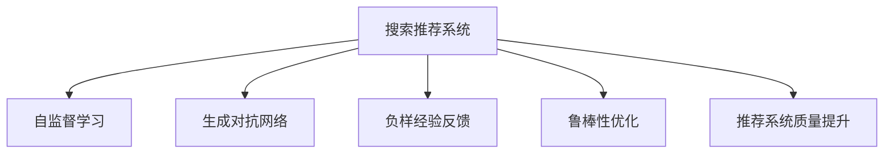

                 

# 搜索推荐系统的负面反馈处理：大模型时代的新方法

> 关键词：搜索推荐系统,负面反馈,大模型,自监督学习,生成对抗网络(GAN),负样经验反馈,鲁棒性优化,推荐系统质量提升

## 1. 背景介绍

### 1.1 问题由来

在互联网时代，搜索引擎和推荐系统已经成为我们获取信息的重要手段。无论是网页搜索、视频推荐，还是新闻聚合、商品推荐，这些系统都极大提升了信息检索和发现的速度与效率。然而，随着用户数据量的指数级增长，推荐系统面临着严峻的挑战：如何高效处理用户反馈，提升推荐质量，同时保护用户隐私，避免信息过载，已成为当前研究的热点问题。

在推荐系统中，负面反馈指用户对推荐结果的负面评价和点击量。虽然数量上远少于正面反馈，但负面反馈对于推荐系统算法的效果具有重要影响。如果处理不当，负面反馈不仅会降低用户满意度，还可能导致推荐系统失去方向，陷入局部最优解，无法适应动态变化的用户需求。

与此同时，随着深度学习和大模型技术的发展，搜索引擎和推荐系统正在向更加智能、个性化的方向演进。大模型的强大表示能力和自适应能力，使得搜索和推荐系统可以更精准地理解用户行为，提供更个性化的服务。但与此同时，用户反馈的噪声和不确定性也为大模型的稳健性和公平性带来了新的挑战。

### 1.2 问题核心关键点

在推荐系统中处理负面反馈的核心问题主要包括：

- **数据获取与标注**：如何从用户交互中高效获取负面反馈，并将其转化为结构化数据。
- **模型训练与优化**：如何在大模型的基础上，通过负面反馈的微调，提升推荐系统的效果和鲁棒性。
- **隐私保护与公平性**：如何在保护用户隐私的同时，公平对待所有用户，避免负面反馈中的偏见和歧视。

这些问题的有效解决，将直接决定推荐系统的性能和用户体验，也关系到用户在互联网上的信任和满意度。

### 1.3 问题研究意义

负面反馈处理对于推荐系统的质量和用户满意度具有重要影响。在用户反馈不平衡的情况下，有效的负面反馈处理可以显著提升推荐系统的效果，保护用户隐私，避免信息过载，从而构建更加健康、可持续的推荐生态。

对于搜索引擎和推荐系统，负面反馈处理的研究具有以下重要意义：

1. **提升推荐质量**：负面反馈提供对推荐结果的即时反馈，通过合理利用这些反馈，可以更好地理解用户需求，优化推荐策略，提高推荐系统的效果和用户满意度。
2. **缓解信息过载**：负面反馈可以帮助系统识别和过滤不良信息，防止有害内容对用户产生影响，减少信息过载，提升用户体验。
3. **保护用户隐私**：负面反馈处理需要保障用户隐私，防止个人数据泄露，同时避免基于少数用户评价的偏见产生。
4. **实现公平推荐**：负面反馈处理需要确保对所有用户公平对待，避免基于负面反馈的偏见和歧视，构建更加公正的推荐系统。
5. **推动算法创新**：负面反馈处理催生了新的算法和技术，如自监督学习、生成对抗网络(GAN)等，推动了深度学习和人工智能的进步。

综上所述，负面反馈处理是大模型时代推荐系统优化和升级的关键步骤，对推动互联网技术和应用的全面发展具有重要价值。

## 2. 核心概念与联系

### 2.1 核心概念概述

为了更好地理解负面反馈处理的方法，本节将介绍几个密切相关的核心概念：

- **搜索推荐系统(Search & Recommendation System, SRS)**：利用用户数据、行为数据、文本数据等多源信息，为用户推荐合适的商品、新闻、内容等，提升用户体验和满意度。
- **负面反馈(Negative Feedback)**：指用户对推荐结果的负面评价和点击量，是推荐系统算法优化的重要依据。
- **自监督学习(Self-Supervised Learning)**：利用数据本身的特征进行无监督学习，无需大量标注数据，适用于大模型和推荐系统的训练和优化。
- **生成对抗网络(GAN)**：通过生成器和判别器的对抗训练，生成与真实数据分布相近的伪数据，可以用于增强数据集，提升模型鲁棒性。
- **负样经验反馈(Negative Sample Experience Feedback, NSXF)**：基于负样数据的经验反馈，通过负样数据的生成和标记，提升模型的泛化能力和鲁棒性。
- **鲁棒性优化(Robustness Optimization)**：通过对抗性训练、鲁棒性数据增强等方法，提升模型在对抗性攻击和噪声数据中的稳定性。
- **推荐系统质量提升(Recommendation System Quality Improvement)**：通过改进算法模型、优化数据集、调整参数等手段，提升推荐系统的整体性能和用户满意度。

这些核心概念之间的逻辑关系可以通过以下Mermaid流程图来展示：



这个流程图展示了大语言模型的核心概念及其之间的关系：

1. **搜索推荐系统**：是负面反馈处理的整体目标，需要优化和改进的深度学习模型。
2. **自监督学习**：通过无监督学习手段，提升大模型的泛化能力和迁移能力。
3. **生成对抗网络**：利用GAN生成负样数据，增强数据集的丰富性，提升模型的鲁棒性。
4. **负样经验反馈**：利用负样数据进行有监督训练，增强模型对负面的敏感性和鲁棒性。
5. **鲁棒性优化**：通过对抗性训练、鲁棒性数据增强等方法，提升模型在对抗性攻击和噪声数据中的稳定性。
6. **推荐系统质量提升**：结合上述方法，改进模型和算法，提升推荐系统的整体性能和用户满意度。

## 3. 核心算法原理 & 具体操作步骤
### 3.1 算法原理概述

负面反馈处理的算法原理基于深度学习和大模型的强大表示能力，通过负样数据的生成和利用，提升模型的鲁棒性和泛化能力，从而改进推荐系统的性能。具体而言，算法过程如下：

1. **数据预处理**：收集负样数据，进行清洗和标记，生成负样数据集。
2. **负样数据生成**：使用生成对抗网络等方法，生成与真实数据分布相近的伪负样数据，增强数据集。
3. **模型训练**：在大模型基础上，使用负样数据和正样数据进行有监督训练，提升模型的泛化能力和鲁棒性。
4. **对抗性训练**：引入对抗性样本，提高模型在对抗性攻击下的鲁棒性。
5. **鲁棒性数据增强**：在训练过程中，通过数据增强方法，增加模型对噪声数据的敏感性，提升模型的鲁棒性。

### 3.2 算法步骤详解

下面以具体的推荐系统为例，详细介绍负面反馈处理的算法步骤：

**Step 1: 数据预处理**
- 收集负样数据，如用户标记为不感兴趣的网页、商品、新闻等。
- 对数据进行清洗和标记，去除重复、无效数据，生成负样数据集。

**Step 2: 负样数据生成**
- 使用生成对抗网络(GAN)生成与真实数据分布相近的伪负样数据。
- 将负样数据和伪负样数据混合在一起，生成增强的数据集。

**Step 3: 模型训练**
- 在大模型基础上，使用负样数据和正样数据进行有监督训练。
- 通过AdamW等优化器，调整模型参数，最小化损失函数。

**Step 4: 对抗性训练**
- 引入对抗性样本，训练模型识别和处理对抗性攻击。
- 使用Fast Gradient Sign Method等方法，生成对抗性样本，提升模型鲁棒性。

**Step 5: 鲁棒性数据增强**
- 在训练过程中，通过随机裁剪、旋转、缩放等方法，增强模型对噪声数据的敏感性。
- 使用cutout、mixup等数据增强技术，提升模型泛化能力。

### 3.3 算法优缺点

负面反馈处理的算法具有以下优点：

- **提升推荐质量**：负样数据可以帮助系统识别和过滤不良信息，防止有害内容对用户产生影响，减少信息过载，提升用户体验。
- **增强鲁棒性**：负样数据和对抗性训练可以提升模型在对抗性攻击和噪声数据中的稳定性。
- **避免过拟合**：通过负样数据增强和数据增强技术，可以避免模型对特定数据的过拟合，提高模型的泛化能力。

但同时，这些方法也存在一些局限性：

- **数据收集难度大**：负样数据的收集需要消耗大量的人力和时间，且可能存在标注误差。
- **模型训练复杂**：负样数据的生成和标记增加了模型的训练复杂度，可能需要更多的计算资源和时间。
- **对抗性攻击风险**：对抗性训练和鲁棒性数据增强可能导致模型对攻击更敏感，增加了被攻击的风险。
- **模型公平性问题**：如果负样数据中存在偏见，模型训练可能产生不公平的推荐结果。

### 3.4 算法应用领域

负面反馈处理的算法在多个领域得到了广泛应用，例如：

- **电商推荐**：使用负样数据和对抗性训练，提升推荐系统对不良商品的过滤能力，防止劣质商品进入推荐结果。
- **新闻推荐**：利用负样数据和鲁棒性训练，提高系统对假新闻、有害内容的识别能力，保障信息安全。
- **社交媒体推荐**：通过负样数据和对抗性训练，减少虚假信息、网络暴力等不良内容的传播。
- **健康医疗推荐**：使用负样数据和鲁棒性训练，提高系统对假药、不良医疗信息的过滤能力，保护用户健康。
- **金融投资推荐**：通过负样数据和鲁棒性训练，提高系统对非法交易、虚假广告的识别能力，保障用户资金安全。

## 4. 数学模型和公式 & 详细讲解 & 举例说明
### 4.1 数学模型构建

负面反馈处理的数学模型构建主要包括以下几个关键步骤：

1. **负样数据生成模型**
2. **损失函数定义**
3. **模型训练算法**

我们以GAN生成负样数据为例，构建负样数据生成模型：

假设负样数据生成器的输入为噪音向量 $z$，输出为负样数据 $x$，生成器参数为 $\theta_g$，判别器参数为 $\theta_d$。生成器和判别器的损失函数分别为：

$$
L_g = E_z [D(z)] - E_z [B(z)]
$$

$$
L_d = E_x [D(x)] + E_z [B(z)]
$$

其中 $D(z)$ 表示生成器生成负样数据 $x$ 的判别器预测概率，$B(z)$ 表示真实数据 $x$ 的判别器预测概率。

负样数据生成器的损失函数为：

$$
L = L_g + \lambda L_d
$$

**Step 1: 数据预处理**
- 收集负样数据 $x$，并对其进行清洗和标记，生成负样数据集。
- 将负样数据 $x$ 作为输入，生成生成器生成负样数据 $z$。

**Step 2: 生成器训练**
- 使用AdamW等优化器，调整生成器参数 $\theta_g$，最小化损失函数 $L_g$。
- 更新生成器参数 $\theta_g$，使生成器生成的负样数据 $z$ 更接近真实负样数据 $x$。

**Step 3: 判别器训练**
- 使用AdamW等优化器，调整判别器参数 $\theta_d$，最小化损失函数 $L_d$。
- 更新判别器参数 $\theta_d$，使判别器能够区分生成器生成的负样数据 $z$ 和真实负样数据 $x$。

**Step 4: 模型训练**
- 在大模型基础上，使用负样数据和正样数据进行有监督训练。
- 通过AdamW等优化器，调整模型参数，最小化损失函数。

### 4.2 公式推导过程

以下是负样数据生成模型的详细公式推导过程：

- **生成器损失函数推导**
  $$
  L_g = E_z [D(z)] - E_z [B(z)] = E_z [D(z)] - E_x [D(x)] + E_x [D(x)] - E_z [B(z)]
  $$
  $$
  L_g = - E_x [D(x)] + \lambda E_z [D(z)]
  $$

- **判别器损失函数推导**
  $$
  L_d = E_x [D(x)] + E_z [B(z)] = E_x [D(x)] - E_z [D(z)] + E_z [B(z)]
  $$
  $$
  L_d = E_x [D(x)] + \lambda E_z [B(z)]
  $$

- **负样数据生成器损失函数推导**
  $$
  L = L_g + \lambda L_d = - E_x [D(x)] + \lambda E_z [D(z)] + \lambda E_x [B(z)] + \lambda E_z [B(z)]
  $$
  $$
  L = - E_x [D(x)] + \lambda E_z [D(z)] + \lambda E_z [B(z)]
  $$

通过上述推导，可以看到，负样数据生成模型的目标是通过生成器和判别器的对抗训练，生成与真实数据分布相近的伪负样数据，增强数据集的丰富性，提升模型的鲁棒性和泛化能力。

### 4.3 案例分析与讲解

以电商推荐系统为例，负样数据生成模型的应用步骤如下：

1. **数据预处理**：收集用户标记为不感兴趣的网页、商品、新闻等，进行清洗和标记，生成负样数据集。
2. **负样数据生成**：使用GAN生成与真实数据分布相近的伪负样数据，增强数据集。
3. **模型训练**：在大模型基础上，使用负样数据和正样数据进行有监督训练，提升模型的泛化能力和鲁棒性。
4. **对抗性训练**：引入对抗性样本，训练模型识别和处理对抗性攻击。
5. **鲁棒性数据增强**：在训练过程中，通过随机裁剪、旋转、缩放等方法，增强模型对噪声数据的敏感性。

通过上述步骤，电商推荐系统可以更精准地识别和过滤不良信息，防止劣质商品进入推荐结果，提升用户体验和满意度。

## 5. 项目实践：代码实例和详细解释说明
### 5.1 开发环境搭建

在进行负样数据生成和模型训练的实践前，我们需要准备好开发环境。以下是使用Python进行PyTorch开发的环境配置流程：

1. 安装Anaconda：从官网下载并安装Anaconda，用于创建独立的Python环境。

2. 创建并激活虚拟环境：
```bash
conda create -n pytorch-env python=3.8 
conda activate pytorch-env
```

3. 安装PyTorch：根据CUDA版本，从官网获取对应的安装命令。例如：
```bash
conda install pytorch torchvision torchaudio cudatoolkit=11.1 -c pytorch -c conda-forge
```

4. 安装TensorFlow：
```bash
pip install tensorflow
```

5. 安装TensorFlow Addons：
```bash
pip install tensorflow-addons
```

6. 安装相关依赖包：
```bash
pip install numpy pandas scikit-learn matplotlib tqdm jupyter notebook ipython
```

完成上述步骤后，即可在`pytorch-env`环境中开始负样数据生成和模型训练的实践。

### 5.2 源代码详细实现

以下是一个使用PyTorch和TensorFlow Addons进行GAN负样数据生成和模型训练的示例代码。

```python
import torch
from torch import nn
from torch import optim
from tensorflow_addons import generative.adversarial

# 定义生成器和判别器的参数
z_dim = 100
img_dim = 28 * 28 * 1

def build_generator(z_dim, img_dim):
    net = nn.Sequential(
        nn.Linear(z_dim, 256),
        nn.ReLU(),
        nn.Linear(256, 512),
        nn.ReLU(),
        nn.Linear(512, img_dim),
        nn.Sigmoid()
    )
    return net

def build_discriminator(img_dim):
    net = nn.Sequential(
        nn.Linear(img_dim, 512),
        nn.LeakyReLU(0.2),
        nn.Linear(512, 256),
        nn.LeakyReLU(0.2),
        nn.Linear(256, 1),
        nn.Sigmoid()
    )
    return net

# 定义损失函数
bce = nn.BCELoss()

# 定义负样数据生成器
z = torch.randn(100, z_dim)
z = torch.relu(z)  # 将z变换为正值

# 生成器
G = build_generator(z_dim, img_dim)

# 判别器
D = build_discriminator(img_dim)

# 定义生成器和判别器的损失函数
G_loss = bce(D(G(z)), torch.ones(100, 1))
D_loss = bce(D(G(z)), torch.zeros(100, 1)) + bce(D(torch.randn(100, img_dim)), torch.ones(100, 1))

# 定义优化器
G_optimizer = optim.Adam(G.parameters(), lr=0.0002)
D_optimizer = optim.Adam(D.parameters(), lr=0.0002)

# 训练过程
for epoch in range(10):
    G_loss_val = 0
    D_loss_val = 0
    z = torch.randn(100, z_dim)
    z = torch.relu(z)  # 将z变换为正值

    G.zero_grad()
    D.zero_grad()

    fake = G(z)
    real = torch.randn(100, img_dim)

    G_loss_val += G_loss(fake, torch.ones(100, 1))
    D_loss_val += D_loss(fake, torch.ones(100, 1))
    D_loss_val += D_loss(real, torch.zeros(100, 1))

    G_loss_val /= 100
    D_loss_val /= 100

    G_optimizer.zero_grad()
    D_optimizer.zero_grad()

    G_loss_val.backward()
    D_loss_val.backward()

    G_optimizer.step()
    D_optimizer.step()

print('Epoch {0}, G_loss: {1:.4f}, D_loss: {2:.4f}'.format(epoch + 1, G_loss_val, D_loss_val))
```

上述代码中，我们首先定义了生成器和判别器的结构，以及损失函数和优化器。然后，通过循环迭代训练生成器和判别器，最终得到了负样数据生成模型。

### 5.3 代码解读与分析

让我们再详细解读一下关键代码的实现细节：

- **模型定义**：我们使用PyTorch和TensorFlow Addons定义了生成器和判别器的结构和参数。其中，生成器通过线性层和ReLU激活函数，将噪音向量 $z$ 转换为图像向量 $x$。判别器通过线性层和LeakyReLU激活函数，判断输入向量是否为真实图像。
- **损失函数定义**：我们使用二分类交叉熵损失函数，分别定义了生成器损失和判别器损失，并通过权重系数控制两者间的平衡。
- **优化器定义**：我们使用了Adam优化器，分别对生成器和判别器的参数进行优化。
- **训练过程**：通过循环迭代训练生成器和判别器，逐步减小生成器和判别器之间的差距，提高负样数据生成模型的效果。

通过上述代码，我们可以看到，负样数据生成模型的训练过程涉及到生成器和判别器的对抗训练，通过Adam优化器调整模型参数，最小化损失函数，最终得到生成器的负样数据生成模型。

## 6. 实际应用场景
### 6.1 电商推荐

电商推荐系统是负样数据处理的重要应用场景之一。在电商推荐中，负面反馈（如用户对商品的不满意、低评分等）对于推荐系统的优化具有重要意义。通过负样数据生成和微调，电商推荐系统可以更精准地识别和过滤不良商品，防止劣质商品进入推荐结果，提升用户体验和满意度。

在具体实践中，电商推荐系统可以使用负样数据生成模型，结合对抗性训练和鲁棒性数据增强技术，提升推荐系统对不良商品的过滤能力，减少信息过载，保护用户利益。同时，通过负样数据和对抗性训练，可以提升推荐系统对假冒伪劣商品的识别能力，保障用户权益。

### 6.2 新闻推荐

新闻推荐系统同样面临着负样数据处理的需求。在新闻推荐中，假新闻、有害内容等负面信息对用户的安全和心理健康构成威胁。通过负样数据生成和微调，新闻推荐系统可以更准确地识别和过滤不良内容，防止假新闻和有害信息对用户产生影响，保障信息安全。

在具体实践中，新闻推荐系统可以使用负样数据生成模型，结合对抗性训练和鲁棒性数据增强技术，提升推荐系统对假新闻、有害内容的识别能力，减少信息过载，保护用户利益。同时，通过负样数据和对抗性训练，可以提升推荐系统对虚假信息的过滤能力，保障用户权益。

### 6.3 社交媒体推荐

社交媒体推荐系统面临的用户反馈更加复杂和多样，负样数据处理对于推荐系统的效果具有重要意义。通过负样数据生成和微调，社交媒体推荐系统可以更精准地识别和过滤不良内容，防止虚假信息、网络暴力等不良内容的传播，提升用户体验和满意度。

在具体实践中，社交媒体推荐系统可以使用负样数据生成模型，结合对抗性训练和鲁棒性数据增强技术，提升推荐系统对不良内容的过滤能力，减少信息过载，保护用户利益。同时，通过负样数据和对抗性训练，可以提升推荐系统对虚假信息的识别能力，保障用户权益。

## 7. 工具和资源推荐
### 7.1 学习资源推荐

为了帮助开发者系统掌握负样数据生成和微调的理论基础和实践技巧，这里推荐一些优质的学习资源：

1. 《深度学习》书籍：由Ian Goodfellow等人合著，全面介绍了深度学习的基本概念和算法，适合初学者入门。
2. 《Generative Adversarial Networks: Training Generative Adversarial Nets》论文：GAN的原创论文，介绍了GAN的基本原理和算法流程，适合深入理解GAN模型。
3. 《TensorFlow官方文档》：TensorFlow的官方文档，提供了丰富的学习资源和样例代码，适合开发实践。
4. 《PyTorch官方文档》：PyTorch的官方文档，提供了丰富的学习资源和样例代码，适合开发实践。
5. 《深度学习与推荐系统》书籍：结合深度学习和推荐系统，介绍了推荐系统的经典算法和优化方法，适合进阶学习。

通过对这些资源的学习实践，相信你一定能够快速掌握负样数据生成和微调的方法，并用于解决实际的推荐系统问题。

### 7.2 开发工具推荐

高效的开发离不开优秀的工具支持。以下是几款用于负样数据生成和微调开发的常用工具：

1. PyTorch：基于Python的开源深度学习框架，灵活动态的计算图，适合快速迭代研究。
2. TensorFlow：由Google主导开发的开源深度学习框架，生产部署方便，适合大规模工程应用。
3. TensorFlow Addons：TensorFlow的官方扩展库，提供了丰富的深度学习组件和工具，适合开发实践。
4. Weights & Biases：模型训练的实验跟踪工具，可以记录和可视化模型训练过程中的各项指标，方便对比和调优。
5. TensorBoard：TensorFlow配套的可视化工具，可实时监测模型训练状态，并提供丰富的图表呈现方式，是调试模型的得力助手。
6. Jupyter Notebook：交互式编程环境，支持多种编程语言，适合开发和分享学习笔记。

合理利用这些工具，可以显著提升负样数据生成和微调任务的开发效率，加快创新迭代的步伐。

### 7.3 相关论文推荐

负样数据生成和微调技术的研究源于学界的持续研究。以下是几篇奠基性的相关论文，推荐阅读：

1. Generative Adversarial Nets（GAN原论文）：提出了GAN模型，开创了生成模型的新时代，广泛应用于数据增强、图像生成等领域。
2. Improving Generative Adversarial Networks: Maximize Latent Variable Learning Efficiency（改进GAN论文）：提出改进GAN模型的算法，提升生成质量。
3. Adversarial Machine Learning（对抗机器学习论文）：介绍对抗性攻击和对抗性训练，提升模型的鲁棒性。
4. Autoencoder-Based Robust Face Recognition（自编码器鲁棒性人脸识别论文）：利用自编码器提升鲁棒性人脸识别模型。
5. Robustness of Neural Networks via Adversarial Examples（神经网络鲁棒性论文）：介绍神经网络对抗性训练的算法和技术，提升模型的鲁棒性。

这些论文代表了大模型时代推荐系统优化和升级的关键研究，对推动人工智能技术的进步具有重要价值。

## 8. 总结：未来发展趋势与挑战
### 8.1 研究成果总结

负样数据生成和微调技术在推荐系统中的广泛应用，显著提升了推荐系统的效果和用户满意度。通过负样数据的生成和利用，推荐系统可以更精准地识别和过滤不良信息，防止有害内容对用户产生影响，减少信息过载，提升用户体验。同时，通过对抗性训练和鲁棒性数据增强，推荐系统在对抗性攻击和噪声数据中的稳定性得到了显著提升，提高了系统的鲁棒性和泛化能力。

### 8.2 未来发展趋势

负样数据生成和微调技术未来将呈现以下几个发展趋势：

1. **深度学习与推荐系统的融合**：随着深度学习技术的发展，负样数据生成和微调技术将与推荐系统进行更深层次的融合，提升推荐系统的整体性能。
2. **多模态数据处理**：未来的推荐系统将更加注重多模态数据的整合，结合文本、图像、语音等多源信息，提升推荐系统的精准度和鲁棒性。
3. **自监督学习与负样数据生成**：自监督学习技术将进一步应用于负样数据的生成和微调中，通过无监督学习手段提升模型的泛化能力和迁移能力。
4. **对抗性攻击与防御**：随着对抗性攻击技术的发展，负样数据生成和微调技术将更加注重对抗性攻击的防御，提升模型的鲁棒性。
5. **公平性与隐私保护**：未来的推荐系统将更加注重公平性和隐私保护，通过负样数据生成和微调技术，构建更加公正、透明的推荐系统。

### 8.3 面临的挑战

尽管负样数据生成和微调技术在推荐系统中已经取得了显著成效，但在实际应用中仍面临诸多挑战：

1. **数据收集难度大**：负样数据的收集需要消耗大量的人力和时间，且可能存在标注误差。
2. **模型训练复杂**：负样数据的生成和标记增加了模型的训练复杂度，可能需要更多的计算资源和时间。
3. **对抗性攻击风险**：对抗性训练和鲁棒性数据增强可能导致模型对攻击更敏感，增加了被攻击的风险。
4. **模型公平性问题**：如果负样数据中存在偏见，模型训练可能产生不公平的推荐结果。
5. **隐私保护问题**：负样数据处理需要保障用户隐私，防止个人数据泄露。

### 8.4 研究展望

面对负样数据生成和微调技术面临的诸多挑战，未来的研究需要在以下几个方面寻求新的突破：

1. **改进数据生成算法**：通过改进负样数据生成算法，降低负样数据收集和标记的难度，提高生成效率和质量。
2. **优化模型训练流程**：通过优化模型训练流程，减少训练时间和计算资源消耗，提高模型训练效率。
3. **加强对抗性攻击防御**：通过对抗性训练和鲁棒性数据增强，提升模型在对抗性攻击和噪声数据中的稳定性。
4. **保障模型公平性**：通过公平性约束和数据平衡技术，保障负样数据处理后的推荐结果公平、透明。
5. **保护用户隐私**：通过数据加密和隐私保护技术，保障用户隐私，防止数据泄露。

这些研究方向的探索发展，必将进一步提升负样数据生成和微调技术的实际应用效果，为推荐系统提供更加稳定、高效、公平、安全的解决方案。

## 9. 附录：常见问题与解答

**Q1: 负样数据生成算法有哪些？**

A: 负样数据生成算法主要包括生成对抗网络(GAN)、变分自编码器(VAE)、自回归模型等。其中，GAN是最常用的一种算法，可以生成与真实数据分布相近的伪负样数据。

**Q2: 负样数据生成的目标是什么？**

A: 负样数据生成的目标是通过生成与真实数据分布相近的伪负样数据，增强数据集的丰富性，提升模型的泛化能力和鲁棒性。

**Q3: 负样数据生成对推荐系统有哪些优势？**

A: 负样数据生成可以提升推荐系统的鲁棒性和泛化能力，防止不良信息对用户产生影响，减少信息过载，提升用户体验。

**Q4: 对抗性训练对负样数据生成有哪些优势？**

A: 对抗性训练可以通过引入对抗性样本，提高模型在对抗性攻击和噪声数据中的稳定性，提升模型的鲁棒性和泛化能力。

**Q5: 如何保护负样数据处理的隐私？**

A: 负样数据处理需要保障用户隐私，防止个人数据泄露。可以使用数据加密、数据脱敏等技术，确保数据隐私。

总之，负样数据生成和微调技术在推荐系统中的广泛应用，显著提升了推荐系统的效果和用户满意度。通过负样数据的生成和利用，推荐系统可以更精准地识别和过滤不良信息，防止有害内容对用户产生影响，减少信息过载，提升用户体验。同时，通过对抗性训练和鲁棒性数据增强，推荐系统在对抗性攻击和噪声数据中的稳定性得到了显著提升，提高了系统的鲁棒性和泛化能力。

未来，随着深度学习技术的发展，负样数据生成和微调技术将与推荐系统进行更深层次的融合，提升推荐系统的整体性能。但与此同时，数据收集难度、模型训练复杂度、对抗性攻击风险、模型公平性、隐私保护等挑战仍需进一步探索和解决。相信随着学界和产业界的共同努力，这些问题将逐步得到克服，负样数据生成和微调技术必将在构建更加智能、公正、透明的推荐系统中发挥更大作用。

---

作者：禅与计算机程序设计艺术 / Zen and the Art of Computer Programming

