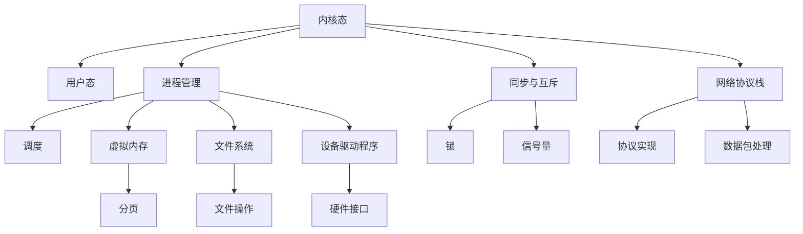

                 

# 操作系统内核开发：深入理解系统底层

> 关键词：
1. 内核态和用户态
2. 进程管理与调度
3. 虚拟内存与分页机制
4. 文件系统
5. 设备驱动程序
6. 同步与互斥
7. 网络协议栈

## 1. 背景介绍

操作系统是现代计算机系统中不可或缺的一部分，它负责管理计算机硬件资源、提供抽象接口、调度进程等核心功能。深入理解操作系统的底层工作原理，对于软件开发、系统优化和故障排查都具有重要的意义。本文将从内核态和用户态、进程管理、虚拟内存、文件系统、设备驱动程序、同步与互斥、网络协议栈等多个方面，深入探索操作系统内核的底层实现。

## 2. 核心概念与联系

### 2.1 核心概念概述

为更好地理解操作系统的底层原理，本节将介绍几个核心概念：

- **内核态和用户态**：操作系统将系统资源分为内核态和用户态，内核态具有更高的权限，用户态进程只能访问预定义的资源。
- **进程管理与调度**：操作系统负责进程的创建、撤销、状态切换和调度。
- **虚拟内存与分页机制**：虚拟内存提供了一致且高效的内存管理方式，而分页机制则是其实现的基础。
- **文件系统**：操作系统提供的文件系统接口，用于管理和访问文件和目录。
- **设备驱动程序**：设备驱动程序负责将用户态请求转化为设备操作，提供硬件的抽象接口。
- **同步与互斥**：操作系统通过锁、信号量等机制，实现进程间的同步与互斥，保证共享资源的安全访问。
- **网络协议栈**：操作系统实现的网络协议栈，提供了网络通信的基础设施和接口。

这些概念之间的逻辑关系可以通过以下Mermaid流程图来展示：



这个流程图展示了一些关键概念及其之间的关系：

1. 内核态通过进程管理调度用户态进程。
2. 虚拟内存与分页机制在用户态与内核态间提供了一致性。
3. 文件系统提供了文件操作的接口。
4. 设备驱动程序将用户请求转化为硬件操作。
5. 同步与互斥机制保证进程间的安全访问。
6. 网络协议栈提供网络通信的基础设施。

## 3. 核心算法原理 & 具体操作步骤
### 3.1 算法原理概述

操作系统内核的底层实现涉及多个核心算法，以下将逐一介绍：

- **进程管理与调度算法**：包括进程的创建、撤销、调度算法（如FIFO、RR、多级反馈队列）等。
- **虚拟内存与分页机制**：涉及分页表的设计与优化，如多级页表、页面置换策略等。
- **文件系统算法**：包括文件系统的组织结构、磁盘调度算法、缓存策略等。
- **设备驱动程序算法**：包括I/O调度算法、缓冲区管理等。
- **同步与互斥算法**：包括锁、信号量、读写锁等同步机制。
- **网络协议栈算法**：包括TCP/IP协议的实现、路由算法等。

### 3.2 算法步骤详解

#### 3.2.1 进程管理与调度

1. **进程创建**：用户提交创建请求，操作系统进行资源分配，包括内存空间、进程控制块、系统资源等。
   
2. **进程挂起与唤醒**：通过阻塞和唤醒操作，控制进程的运行状态，实现I/O等待等。

3. **进程撤销**：操作系统回收已结束或异常终止的进程资源。

4. **调度算法**：确定下一个执行的进程，选择算法如FIFO、RR、多级反馈队列等，保证系统公平性和效率。

#### 3.2.2 虚拟内存与分页机制

1. **分页表设计**：维护页表，实现虚拟内存与物理内存的映射。

2. **页面置换策略**：选择替换策略如LRU、LFU、最佳置换算法等，保证页面命中率。

3. **虚拟地址转换**：将虚拟地址转换为物理地址，确保地址转换的快速和安全。

#### 3.2.3 文件系统算法

1. **文件系统组织**：设计文件系统的树形结构，如树型目录、B树索引等。

2. **磁盘调度**：通过算法如电梯算法、C-SCAN算法等，优化磁盘的读写效率。

3. **缓存策略**：采用缓存技术，减少磁盘I/O操作，提高文件访问速度。

#### 3.2.4 设备驱动程序算法

1. **I/O调度**：实现I/O请求的调度与优化，减少延迟。

2. **缓冲区管理**：管理缓冲区，优化I/O操作。

3. **硬件接口**：提供硬件操作的抽象接口，简化上层软件的开发。

#### 3.2.5 同步与互斥算法

1. **锁机制**：实现互斥访问，保证资源的安全性。

2. **信号量机制**：用于进程间的同步和通信。

3. **读写锁**：优化读写操作，提高并发性能。

#### 3.2.6 网络协议栈算法

1. **TCP/IP协议**：实现TCP/IP协议，提供可靠的网络通信。

2. **路由算法**：优化路由选择，提高网络效率。

### 3.3 算法优缺点

- **进程管理与调度**：调度算法复杂度较高，但通过优化能显著提升系统性能。
- **虚拟内存与分页机制**：减少了内存碎片，提高了内存利用率，但增加了系统开销。
- **文件系统算法**：优化磁盘I/O效率，但复杂度较高，需要细致的设计与实现。
- **设备驱动程序算法**：提供了硬件操作的抽象接口，但I/O性能优化具有挑战性。
- **同步与互斥算法**：保证资源安全访问，但可能影响系统性能。
- **网络协议栈算法**：提供可靠的网络通信，但算法复杂度较高。

### 3.4 算法应用领域

基于操作系统内核的算法，广泛应用于以下几个领域：

- **服务器操作系统**：如Linux、Windows等，提供稳定的内核服务和丰富的API接口。
- **嵌入式操作系统**：如RTOS、μC/OS等，提供精简内核和高效资源管理。
- **桌面操作系统**：如MacOS、Windows等，提供丰富的图形界面和用户交互功能。
- **移动操作系统**：如iOS、Android等，提供高效的网络连接和用户数据管理。
- **网络服务器**：如Nginx、Apache等，提供高性能的Web服务和高并发处理能力。

## 4. 数学模型和公式 & 详细讲解 & 举例说明

### 4.1 数学模型构建

为了更好地理解操作系统内核的算法原理，本节将构建一些数学模型，并详细讲解其构建过程。

#### 4.1.1 进程管理与调度算法

假设系统中N个进程，每个进程执行周期为T，令$\tau$为上下文切换时间，则系统开销为$\tau N$。通过FIFO调度算法，平均等待时间为$(T-\tau)$，调度时间开销为$(T-\tau)N$。若采用RR调度算法，令$Q=1$（时间片为1），则每个进程平均等待时间为$(T-Q-\tau)$，调度时间开销为$(N-1)(T-Q-\tau)+QN$。

### 4.2 公式推导过程

#### 4.2.1 虚拟内存与分页机制

假设系统页面大小为$P$，页面数$M$，页表大小为$S$，每次地址转换时间为$T$，分页表命中率为$R$，则页面访问时间为$T_0=R\cdot T+(1-R)(T+S/P)$。

### 4.3 案例分析与讲解

#### 4.3.1 文件系统算法

假设磁盘转速为$S$，读取时间为$T$，磁盘扇区为$B$，文件大小为$F$，缓存大小为$C$，缓存命中率$R$，则磁盘读写时间为$T_0=(1-R)C/T+(1-R)F/B+R \cdot T$。

## 5. 项目实践：代码实例和详细解释说明

### 5.1 开发环境搭建

为了进行内核开发，首先需要搭建开发环境。以下是Linux环境下的一般步骤：

1. 安装依赖软件包，如gcc、make、libncurses等。
2. 安装调试工具，如gdb、valgrind等。
3. 配置编译环境，包括环境变量、编译器选项等。

### 5.2 源代码详细实现

以下是一个简单的进程创建示例代码：

```c
#include <linux/kernel.h>
#include <linux/sched.h>

void create_process(int pid, char* args[])
{
    struct task_struct* task;
    
    task = kmalloc(sizeof(struct task_struct), GFP_KERNEL);
    if (!task) {
        printk("Unable to allocate task structure\n");
        return;
    }
    
    task->pid = pid;
    task->args = args;
    
    // 将任务加入到运行队列
    add_task_to_runqueue(task);
    
    printk("Process %d created\n", pid);
}
```

### 5.3 代码解读与分析

- `create_process`函数实现了进程的创建，包括分配任务结构体、设置进程参数、将任务加入到运行队列等。
- 内核代码通常直接与硬件交互，编写时需要注意内存管理、锁机制等复杂问题。
- 调试内核代码可以使用`gdb`、`kdb`等工具，进行内存分析、断点调试等。

### 5.4 运行结果展示

- 可以使用`ps`命令查看进程状态。
- 可以使用`top`命令监控系统资源使用情况。
- 可以使用`cat /proc/cmdline`查看内核参数。

## 6. 实际应用场景

### 6.1 服务器操作系统

服务器操作系统如Linux、Windows，广泛应用于服务器、数据中心、云计算等场景。其内核提供高效的进程管理、内存管理、I/O操作等功能，支持高并发、高吞吐量的应用需求。

### 6.2 嵌入式操作系统

嵌入式操作系统如RTOS、μC/OS，适用于资源受限、实时性要求高的场景。其内核提供轻量级、高效资源管理的能力，支持微控制器、传感器等硬件设备。

### 6.3 桌面操作系统

桌面操作系统如MacOS、Windows，提供图形界面、丰富的应用程序和用户交互功能，适用于个人计算机和办公场景。

### 6.4 移动操作系统

移动操作系统如iOS、Android，提供高效的网络连接、数据管理功能，支持手机、平板电脑等移动设备。

### 6.5 网络服务器

网络服务器如Nginx、Apache，提供高性能的Web服务和高并发处理能力，适用于Web应用、在线游戏等场景。

## 7. 工具和资源推荐

### 7.1 学习资源推荐

- **Linux内核源码**：Github上的Linux内核源码，提供详细的内核设计和技术细节。
- **UNIX Network Programming**：UNIX网络编程经典教材，介绍网络编程的底层原理和实现技术。
- **Linux Device Drivers**：Linux设备驱动程序开发手册，详细介绍了内核驱动程序的开发流程。
- **Linux Kernel Development**：Linux内核开发入门指南，提供完整的内核开发流程和技术细节。
- **Real-Time Linux**：实时Linux系统设计，介绍实时系统内核开发和优化技术。

### 7.2 开发工具推荐

- **GCC**：Linux下的C/C++编译器，支持gdb调试和优化选项。
- **GDB**：调试器，用于内核代码的调试和问题排查。
- **Valgrind**：内存检查工具，用于检测内存泄漏和非法访问。
- **KDB**：内核调试器，支持内核级别的调试和问题排查。
- **Linux Kernel Module**：开发和管理内核模块的工具，提供简单的开发和调试接口。

### 7.3 相关论文推荐

- **Process Scheduling: A Survey**：介绍进程调度算法的研究进展，包括FIFO、RR、多级反馈队列等。
- **Virtual Memory: Concepts and Design**：虚拟内存系统设计，包括分页机制、缓存策略等。
- **File System Structure and Storage Management**：文件系统结构和管理，介绍磁盘调度、缓存技术等。
- **Network Protocols**：网络协议栈设计，包括TCP/IP协议、路由算法等。

## 8. 总结：未来发展趋势与挑战

### 8.1 研究成果总结

操作系统内核开发涉及多个复杂算法和系统设计，掌握其核心原理和实现细节需要大量的时间和实践。本文对内核态和用户态、进程管理、虚拟内存、文件系统、设备驱动程序、同步与互斥、网络协议栈等多个方面进行了详细讲解，希望能为读者提供系统的内核开发指南。

### 8.2 未来发展趋势

未来操作系统内核的发展趋势如下：

1. **容器技术**：容器化技术如Docker、Kubernetes等，提供高效的资源管理和应用程序部署。
2. **云原生**：云原生架构如Kubernetes、Prometheus等，提供高性能、可伸缩的云服务。
3. **微内核架构**：微内核架构如L4微内核，提供轻量级、高安全性的系统设计。
4. **分布式系统**：分布式系统如Hadoop、Spark等，提供高效的大数据处理和分布式计算能力。
5. **边缘计算**：边缘计算平台如AWS IoT、Azure IoT等，提供高效、低延迟的计算能力。

### 8.3 面临的挑战

操作系统内核开发面临的挑战如下：

1. **复杂性**：内核系统复杂度高，需要深入理解硬件架构和操作系统原理。
2. **性能优化**：内核优化需要高深的系统调度和算法设计，需要大量实验和调试。
3. **安全性**：内核系统需要保证系统安全性和稳定性，需要严密的安全机制和漏洞检测。
4. **兼容性**：不同操作系统之间的兼容性问题，需要跨平台开发和测试。
5. **维护成本**：操作系统内核需要持续维护和更新，需要专业的技术团队和资源投入。

### 8.4 研究展望

未来操作系统内核的研究展望如下：

1. **自动化开发**：采用自动化工具和AI技术，简化内核开发和调试流程。
2. **边缘计算优化**：优化边缘计算平台，提高计算效率和实时性。
3. **分布式系统优化**：优化分布式系统架构，提高系统性能和可扩展性。
4. **微内核架构优化**：优化微内核架构，提高系统安全性和可移植性。
5. **容器化技术优化**：优化容器化技术，提高资源利用率和系统性能。

## 9. 附录：常见问题与解答

**Q1: 操作系统内核开发难度大吗？**

A: 操作系统内核开发难度较大，需要深入理解系统原理和硬件架构。但通过系统学习和实践，逐步掌握内核开发技能也是完全可能的。

**Q2: 学习内核开发需要哪些基础知识？**

A: 学习内核开发需要掌握操作系统原理、计算机网络、数据结构、C/C++编程等基础知识。建议先从简单的内核模块开发开始，逐步深入理解内核核心功能。

**Q3: 如何优化内核性能？**

A: 优化内核性能需要综合考虑系统调度和算法设计。具体措施包括：
1. 优化页面置换算法，提高页面命中率。
2. 优化I/O调度，减少磁盘等待时间。
3. 优化缓存策略，提高文件访问速度。
4. 优化同步互斥机制，减少锁竞争和上下文切换。

**Q4: 如何保证内核安全性？**

A: 内核安全性需要通过严密的安全机制和漏洞检测来保障。具体措施包括：
1. 采用ACID原则，保证数据一致性和原子性。
2. 使用权限控制，限制进程和用户访问权限。
3. 进行安全审计，定期检测和修复漏洞。
4. 采用加密和安全协议，保护敏感数据和通信安全。

**Q5: 内核开发常用的调试工具有哪些？**

A: 内核开发常用的调试工具包括：
1. GDB：调试器，用于内核代码的调试和问题排查。
2. KDB：内核调试器，支持内核级别的调试和问题排查。
3. Valgrind：内存检查工具，用于检测内存泄漏和非法访问。
4. perf：性能分析工具，用于内核性能的实时监测和优化。

---

作者：禅与计算机程序设计艺术 / Zen and the Art of Computer Programming

