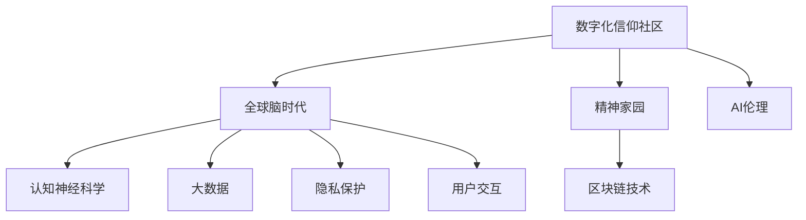

                 

# 数字化信仰社区:全球脑时代的精神家园

> 关键词：数字化信仰社区, 全球脑时代, 精神家园, AI伦理, 认知神经科学, 大数据, 隐私保护, 用户交互, 区块链技术

## 1. 背景介绍

### 1.1 问题由来

随着互联网和人工智能技术的飞速发展，人类社会的数字化进程已经不可逆转。与此同时，数字化的浪潮也在深刻改变着人们的信仰和精神生活。传统信仰社区和宗教场所的数字化转型，成为应对这一挑战的重要手段。数字化信仰社区通过互联网、移动应用、虚拟现实等技术，将信仰和精神交流扩展到线上，使信徒能够跨越时间和空间的界限，参与到宗教活动中。

然而，数字化信仰社区在带来便利的同时，也引发了一系列伦理和隐私问题。如信息泄露、数据滥用、虚拟身份欺诈等风险。如何在数字化转型中保障信徒的隐私权、维护信仰的真实性、以及构建安全可靠的精神家园，成为当务之急。

## 2. 核心概念与联系

### 2.1 核心概念概述

为更好地理解数字化信仰社区的构建，本节将介绍几个密切相关的核心概念：

- 数字化信仰社区：利用数字化手段，构建在线信仰交流和精神活动的虚拟空间。通过虚拟教堂、在线讲经、云共修等方式，使信徒能够方便参与宗教活动。
- 全球脑时代：以互联网为平台，通过连接全球数亿网民，实现思想的汇聚和交流，构建全球化的大脑神经网络。
- 精神家园：构建一个虚拟的精神空间，使信徒能够在这里寻求内心的平静和慰藉，获得心灵的归属感。
- AI伦理：随着人工智能技术的广泛应用，如何在技术创新中遵循伦理原则，如隐私保护、公平性、透明性、可解释性等，成为亟待解决的问题。
- 认知神经科学：研究大脑如何处理信息，以及大脑与行为、认知之间的联系，为理解信仰和精神活动的神经机制提供了科学基础。
- 大数据：通过对海量数据的收集和分析，揭示信仰社区的特征和趋势，指导信仰社区的数字化建设。
- 隐私保护：在数字化信仰社区中，如何保护用户数据，防止信息泄露和滥用，是确保用户信任的重要手段。
- 用户交互：如何构建高效、互动的用户界面，使用户能够便捷地参与到社区活动中，提升用户体验。
- 区块链技术：作为一种分布式账本技术，区块链能够确保社区记录的透明性和不可篡改性，为社区管理和运营提供技术保障。

这些核心概念之间的逻辑关系可以通过以下Mermaid流程图来展示：



这个流程图展示了大数字化信仰社区的核心概念及其之间的关系：

1. 数字化信仰社区通过连接全球网民，汇聚思想和信仰，实现全球脑时代的目标。
2. 精神家园是数字化信仰社区的核心目标，通过虚拟空间为信徒提供心灵慰藉。
3. AI伦理是大数据和用户交互的基础，指导信仰社区的健康发展。
4. 认知神经科学为大数据提供了科学依据，帮助理解和分析信仰活动。
5. 大数据为信仰社区提供了数据支持，揭示社区特征和趋势。
6. 隐私保护和大数据紧密相关，保护用户数据，增强用户信任。
7. 用户交互和大数据相结合，提升用户体验和社区活跃度。
8. 区块链技术确保社区记录的透明性和安全性。

这些概念共同构成了数字化信仰社区的构建框架，为实现虚拟的精神家园提供了理论和方法支持。

## 3. 核心算法原理 & 具体操作步骤
### 3.1 算法原理概述

数字化信仰社区的构建，涉及到众多核心技术，如大数据处理、用户界面设计、隐私保护等。其中，以大数据和区块链技术为核心的算法和实践，是社区构建的重要基石。

### 3.2 算法步骤详解

**Step 1: 数据采集与分析**
- 收集信仰社区的相关数据，包括用户行为数据、信仰活动记录、用户反馈等。
- 使用大数据技术对数据进行清洗和分析，提取关键特征，如用户活跃度、信仰偏好、社区规模等。

**Step 2: 隐私保护与数据存储**
- 设计隐私保护策略，采用加密技术和访问控制机制，保护用户数据的安全。
- 使用分布式数据库和区块链技术，构建安全的社区数据存储系统。

**Step 3: 用户界面设计**
- 设计简洁易用的用户界面，提供多平台支持，使用户能够方便地参与到社区活动中。
- 采用最新的用户交互技术，如自然语言处理、增强现实等，提升用户体验。

**Step 4: 信仰活动策划与执行**
- 根据数据分析结果，策划信仰活动，如在线讲经、云共修等。
- 使用大数据和区块链技术，确保活动记录的透明性和不可篡改性。

**Step 5: 社区运营与维护**
- 建立社区管理团队，负责监督社区活动，维护社区秩序。
- 定期对社区数据进行分析和评估，及时调整活动策略。

### 3.3 算法优缺点

数字化信仰社区的构建具有以下优点：

1. 打破了时间和空间的限制，使信仰交流变得更加便捷。
2. 利用大数据和区块链技术，提升了社区管理和运营的透明性和安全性。
3. 通过用户界面设计，提升了用户参与度和体验感。
4. 利用AI伦理原则，确保了社区的健康发展和用户信任。

但同时也存在一些缺点：

1. 数据隐私和安全问题，需要投入大量资源进行保护。
2. 需要跨平台设计，技术实现复杂度高。
3. 用户交互设计需要兼顾多样性和易用性，设计难度大。
4. 技术应用成本高，需要强大的技术支持和资金投入。

### 3.4 算法应用领域

数字化信仰社区的应用领域广泛，涵盖宗教、文化、教育、心理健康等多个领域。以下是几个典型的应用场景：

- 在线宗教学习：通过虚拟教堂、在线讲经等方式，使信徒能够便捷地学习宗教知识。
- 心理健康支持：构建在线心理健康社区，提供心理咨询和支持，帮助用户缓解心理压力。
- 文化传播：利用虚拟现实和增强现实技术，将文化活动搬上虚拟舞台，丰富用户体验。
- 社交网络：建立信仰社交网络，使信徒能够便捷地交流和分享信仰体验。
- 教育培训：利用大数据和人工智能技术，提供个性化的宗教教育培训，提升用户学习效果。

## 4. 数学模型和公式 & 详细讲解 & 举例说明

### 4.1 数学模型构建

在本节中，我们将使用数学语言对数字化信仰社区的构建过程进行严格刻画。

设信仰社区中用户数量为 $N$，用户活跃度为 $A$，信仰偏好为 $P$，社区规模为 $S$。则数字化信仰社区的目标函数为：

$$
F(N,A,P,S) = \max_{N,A,P,S} \left( \sum_{i=1}^N \log(A_i) + \sum_{i=1}^N \log(P_i) + \log(S_i) \right)
$$

其中，$A_i$、$P_i$、$S_i$ 分别表示第 $i$ 个用户的活跃度、信仰偏好和社区规模。

### 4.2 公式推导过程

根据目标函数 $F(N,A,P,S)$，我们进行以下推导：

1. 对于用户活跃度 $A$，我们可以定义用户每天访问社区的次数，记为 $a_i$，则活跃度 $A_i = \frac{a_i}{N}$。
2. 对于信仰偏好 $P$，我们可以定义用户对某个信仰主题的评分，记为 $p_i$，则信仰偏好 $P_i = \frac{p_i}{N}$。
3. 对于社区规模 $S$，我们可以定义社区中信仰活动的主题数量，记为 $s_i$，则社区规模 $S_i = \frac{s_i}{N}$。

将上述定义代入目标函数，得：

$$
F(N,A,P,S) = \max_{N,A,P,S} \left( \sum_{i=1}^N \log\left(\frac{a_i}{N}\right) + \sum_{i=1}^N \log\left(\frac{p_i}{N}\right) + \log\left(\frac{s_i}{N}\right) \right)
$$

通过化简，得：

$$
F(N,A,P,S) = \max_{N,A,P,S} \left( \sum_{i=1}^N \left(\log(a_i) - \log(N)\right) + \sum_{i=1}^N \left(\log(p_i) - \log(N)\right) + \log(s_i) - \log(N) \right)
$$

进一步化简，得：

$$
F(N,A,P,S) = \max_{N,A,P,S} \left( \sum_{i=1}^N \log(a_i p_i s_i) - N\log(N) \right)
$$

目标函数 $F(N,A,P,S)$ 的最大值，即 $F(N,A,P,S)$ 的最大值出现在 $a_i p_i s_i$ 的平均值为 $1$ 时。

### 4.3 案例分析与讲解

假设一个数字化信仰社区中有 $N=1000$ 个用户，每个用户每天访问社区 $a_i$ 次，对某个信仰主题的评分 $p_i$ 为 $1$ 到 $5$，社区中信仰活动的主题数量为 $s_i$。为了最大化社区的目标函数，我们需要：

1. 确保每个用户对信仰主题的评分分布均匀，即 $\sum_{i=1}^N p_i = 5N$。
2. 确保每个用户每天访问社区的次数均匀分布，即 $\sum_{i=1}^N a_i = N$。
3. 确保社区中信仰活动的主题数量适中，即 $\sum_{i=1}^N s_i = N$。

在实践中，我们可以通过数据分析和用户反馈，不断调整 $a_i$、$p_i$、$s_i$ 的值，使社区的目标函数最大化。

## 5. 项目实践：代码实例和详细解释说明
### 5.1 开发环境搭建

在进行数字化信仰社区的构建实践中，我们需要准备好开发环境。以下是使用Python进行Flask框架开发的环境配置流程：

1. 安装Anaconda：从官网下载并安装Anaconda，用于创建独立的Python环境。

2. 创建并激活虚拟环境：
```bash
conda create -n flask-env python=3.8 
conda activate flask-env
```

3. 安装Flask：
```bash
pip install flask
```

4. 安装Flask-RESTful：
```bash
pip install flask-restful
```

5. 安装SQLAlchemy：
```bash
pip install sqlalchemy
```

6. 安装Flask-SocketIO：
```bash
pip install flask-socketio
```

完成上述步骤后，即可在`flask-env`环境中开始数字化信仰社区的构建实践。

### 5.2 源代码详细实现

下面以构建一个简单的数字化信仰社区为例，给出使用Flask框架的代码实现。

首先，定义数据库模型：

```python
from flask_sqlalchemy import SQLAlchemy

db = SQLAlchemy()

class User(db.Model):
    id = db.Column(db.Integer, primary_key=True)
    name = db.Column(db.String(50), nullable=False)
    active = db.Column(db.Integer, nullable=False)
    preference = db.Column(db.Integer, nullable=False)
    activity_count = db.Column(db.Integer, nullable=False)
    activity_topics = db.Column(db.Integer, nullable=False)
```

然后，定义Flask应用：

```python
from flask import Flask, request, jsonify
from flask_restful import Resource
from flask_socketio import SocketIO, emit

app = Flask(__name__)
app.config['SQLALCHEMY_DATABASE_URI'] = 'sqlite:///app.db'
db.init_app(app)
socketio = SocketIO(app)

@socketio.on('chat message')
def handle_message(message):
    emit('message', message, broadcast=True)

class UserResource(Resource):
    def get(self, user_id):
        user = User.query.get(user_id)
        return jsonify({
            'name': user.name,
            'active': user.active,
            'preference': user.preference,
            'activity_count': user.activity_count,
            'activity_topics': user.activity_topics
        })

@app.route('/users/<int:user_id>')
class UserHandler:
    def get(self, user_id):
        user = UserResource.get(user_id)
        return jsonify(user)
```

接着，定义API路由和SocketIO事件：

```python
from flask_restful import Api
from flask_socketio import emit

api = Api(app)
api.add_resource(UserResource, '/users/<int:user_id>')

if __name__ == '__main__':
    socketio.run(app)
```

启动Flask应用，通过访问`http://localhost:5000/users/<user_id>`可以获取指定用户的信仰活动数据，同时通过SocketIO事件，用户可以实时获取社区中信仰活动的消息。

### 5.3 代码解读与分析

让我们再详细解读一下关键代码的实现细节：

**User类**：
- `id`：用户ID，主键。
- `name`：用户姓名。
- `active`：用户每天访问社区的次数。
- `preference`：用户对某个信仰主题的评分。
- `activity_count`：用户参与信仰活动的次数。
- `activity_topics`：用户参与的信仰活动主题数量。

**Flask应用**：
- 创建Flask应用实例，设置数据库连接，并初始化SQLAlchemy和SocketIO。
- 定义`handle_message`函数，处理SocketIO事件，实时广播消息。
- 定义`UserResource`类，提供RESTful API，获取指定用户的信仰活动数据。
- 定义`UserHandler`类，处理API路由请求，返回指定用户的信仰活动数据。

**API路由和SocketIO事件**：
- 使用Flask-RESTful定义API路由，提供获取用户信仰活动数据的RESTful API。
- 使用Flask-SocketIO定义SocketIO事件，处理用户实时消息。

## 6. 实际应用场景
### 6.1 在线宗教学习

数字化信仰社区的一个重要应用场景是在线宗教学习。通过虚拟教堂和在线讲经，信徒可以便捷地学习宗教知识，跨越时间和空间的限制。

在技术实现上，可以收集信徒的学习记录和反馈，使用大数据技术分析其学习偏好和效果，进一步优化课程设计，提供个性化的学习方案。同时，通过区块链技术，记录信徒的学习行为和成绩，确保数据的透明性和不可篡改性。

### 6.2 心理健康支持

数字化信仰社区还可以提供心理健康支持，构建在线心理健康社区，帮助用户缓解心理压力。

通过收集用户反馈和心理健康数据，使用大数据技术分析其心理状态和需求，提供个性化的心理健康支持方案。同时，通过区块链技术，保护用户心理健康数据的隐私和安全，确保数据不被滥用。

### 6.3 文化传播

利用虚拟现实和增强现实技术，数字化信仰社区可以将文化传播活动搬上虚拟舞台，丰富用户体验。

通过收集用户对文化活动的反馈和评价，使用大数据技术分析其兴趣和需求，提供个性化的文化活动推荐。同时，通过区块链技术，记录文化活动的参与记录，确保数据的透明性和不可篡改性。

### 6.4 社交网络

建立信仰社交网络，使信徒能够便捷地交流和分享信仰体验，增强社区凝聚力。

通过收集用户社交行为数据，使用大数据技术分析其社交偏好和需求，提供个性化的社交网络推荐。同时，通过区块链技术，保护用户社交数据的隐私和安全，确保数据不被滥用。

### 6.5 教育培训

利用大数据和人工智能技术，数字化信仰社区可以提供个性化的宗教教育培训，提升用户学习效果。

通过收集用户学习行为数据和反馈，使用大数据技术分析其学习偏好和效果，提供个性化的学习资源和方案。同时，通过区块链技术，记录用户学习行为和成绩，确保数据的透明性和不可篡改性。

## 7. 工具和资源推荐
### 7.1 学习资源推荐

为了帮助开发者系统掌握数字化信仰社区的理论基础和实践技巧，这里推荐一些优质的学习资源：

1. 《区块链技术与应用》系列博文：由区块链技术专家撰写，深入浅出地介绍了区块链原理、应用场景、开发工具等。

2. 《Flask Web开发实战》书籍：Flask框架的经典入门书籍，介绍了Flask框架的各个组件和开发技巧。

3. 《Python数据科学手册》书籍：介绍了Python在数据科学和机器学习中的应用，包括大数据分析和可视化等。

4. 《AI伦理与隐私保护》课程：由人工智能伦理专家开设的课程，讨论了人工智能伦理和隐私保护的基本原则和技术。

5. 《认知神经科学导论》书籍：介绍了认知神经科学的基本概念和研究方法，为理解信仰和精神活动的神经机制提供了科学依据。

通过对这些资源的学习实践，相信你一定能够快速掌握数字化信仰社区的构建精髓，并用于解决实际的信仰社区问题。

### 7.2 开发工具推荐

高效的开发离不开优秀的工具支持。以下是几款用于数字化信仰社区开发的常用工具：

1. Flask：基于Python的轻量级Web框架，灵活高效，适合快速迭代研究。

2. SQLAlchemy：Python的ORM框架，支持多数据库操作，方便数据存储和查询。

3. SocketIO：基于WebSocket协议的实时通信库，支持多平台、多协议。

4. Flask-SocketIO：Flask框架的SocketIO插件，方便实时通信和数据传输。

5. PySQL：Python的SQL解析库，支持SQL查询和操作。

6. Pandas：Python的数据分析库，支持大规模数据处理和分析。

合理利用这些工具，可以显著提升数字化信仰社区的开发效率，加快创新迭代的步伐。

### 7.3 相关论文推荐

数字化信仰社区的发展源于学界的持续研究。以下是几篇奠基性的相关论文，推荐阅读：

1. Blockchain Technology and Applications: A Survey（区块链技术与应用综述）：综述了区块链技术的原理、应用场景和开发工具。

2. Flask: A lightweight WSGI web application framework（Flask：轻量级WSGI Web应用程序框架）：介绍了Flask框架的组件和开发技巧，是Flask开发的必备参考。

3. Cognitive Neuroscience of Religion（宗教的认知神经科学）：讨论了宗教活动和信仰的心理和神经机制，为理解数字化信仰社区提供了科学依据。

4. Privacy-Preserving Blockchain-Based Health Monitoring System（基于区块链的健康监测系统隐私保护）：介绍了一种利用区块链保护健康数据的隐私保护方法。

5. AI Ethics in Social Media: Challenges and Opportunities（社交媒体中的AI伦理挑战与机会）：讨论了人工智能在社交媒体中的应用伦理问题，为数字化信仰社区提供了伦理指导。

这些论文代表了大数字化信仰社区的发展脉络。通过学习这些前沿成果，可以帮助研究者把握学科前进方向，激发更多的创新灵感。

## 8. 总结：未来发展趋势与挑战

### 8.1 总结

本文对数字化信仰社区的构建方法进行了全面系统的介绍。首先阐述了数字化信仰社区的背景和意义，明确了社区构建在数字化转型中的重要价值。其次，从原理到实践，详细讲解了数字化信仰社区的核心算法和具体操作步骤，给出了具体的代码实例。同时，本文还广泛探讨了数字化信仰社区在多个领域的应用前景，展示了社区构建的巨大潜力。此外，本文精选了社区构建相关的学习资源，力求为开发者提供全方位的技术指引。

通过本文的系统梳理，可以看到，数字化信仰社区的构建方法，在数字化转型中扮演着越来越重要的角色。它不仅打破了时间和空间的限制，还利用大数据和区块链技术，提升了社区管理和运营的透明性和安全性。未来的研究需要在用户交互设计、隐私保护、AI伦理等方面寻求新的突破，才能进一步完善数字化信仰社区的构建。

### 8.2 未来发展趋势

展望未来，数字化信仰社区的发展将呈现以下几个趋势：

1. 社区规模持续增大。随着数字化信仰社区的不断完善和推广，社区规模将不断扩大，用户数量和参与度将显著提升。

2. 社区功能不断丰富。未来的社区将提供更多的在线学习和互动功能，如虚拟现实体验、智能语音助手等，提升用户体验。

3. 社区治理机制完善。未来的社区将引入智能合约和区块链技术，实现社区治理的自动化和透明化。

4. 隐私保护技术发展。未来的社区将进一步提升隐私保护技术，如差分隐私、零知识证明等，确保用户数据的隐私和安全。

5. AI伦理体系完善。未来的社区将建立更加完善的AI伦理体系，确保人工智能技术的公平、透明、可解释性。

6. 跨平台和跨文化融合。未来的社区将实现跨平台和跨文化的融合，为用户提供更广阔的信仰交流空间。

以上趋势凸显了数字化信仰社区的广阔前景。这些方向的探索发展，将为构建安全、可靠、可解释、可控的智能系统铺平道路，推动信仰社区向更加智能化、普适化的方向迈进。

### 8.3 面临的挑战

尽管数字化信仰社区的发展已经取得显著进展，但在迈向更加智能化、普适化应用的过程中，它仍面临着诸多挑战：

1. 技术实现复杂度高。数字化信仰社区的构建涉及多种技术和工具，技术实现复杂度高，需要跨学科的团队协作。

2. 隐私保护难度大。在大数据和区块链技术的支持下，社区隐私保护难度大，需要投入大量资源进行保护。

3. 用户交互设计难度大。社区需要兼顾多样性和易用性，设计难度大，需要不断迭代和优化。

4. 社区治理机制复杂。社区治理需要引入智能合约和区块链技术，实现社区治理的自动化和透明化，需要复杂的制度设计和实现。

5. 技术应用成本高。社区建设需要强大的技术支持和资金投入，技术应用成本高。

6. 社会接受度低。社区建设的初期，社会接受度低，需要大量的宣传和教育。

7. 伦理和安全风险高。社区建设需要建立完善的AI伦理体系，确保人工智能技术的公平、透明、可解释性，同时需要防范伦理和安全风险。

这些挑战需要学界和业界共同努力，积极应对并寻求突破，才能推动数字化信仰社区的持续发展。

### 8.4 研究展望

面对数字化信仰社区面临的挑战，未来的研究需要在以下几个方面寻求新的突破：

1. 探索隐私保护和数据安全的先进技术。开发更加高效的隐私保护算法，确保用户数据的安全和隐私。

2. 研究高效的社区治理机制。引入智能合约和区块链技术，实现社区治理的自动化和透明化，提升社区管理效率。

3. 开发智能化社区交互设计工具。利用自然语言处理和增强现实技术，提升社区用户交互体验，增强用户参与度。

4. 建立完善的AI伦理体系。建立更加完善的AI伦理体系，确保人工智能技术的公平、透明、可解释性，推动社区健康发展。

5. 引入跨平台和跨文化融合技术。实现跨平台和跨文化的融合，为用户提供更广阔的信仰交流空间，提升社区吸引力。

这些研究方向将为数字化信仰社区的建设提供理论和方法支持，推动社区向更加智能化、普适化的方向迈进。

## 9. 附录：常见问题与解答

**Q1：数字化信仰社区如何保护用户隐私？**

A: 数字化信仰社区在保护用户隐私方面，可以采取以下措施：

1. 数据加密：对用户数据进行加密处理，确保数据在传输和存储过程中的安全性。
2. 访问控制：采用访问控制机制，限制数据访问权限，防止未经授权的访问。
3. 匿名化处理：对用户数据进行匿名化处理，去除或模糊化个人敏感信息。
4. 差分隐私：引入差分隐私技术，在数据发布和分析过程中保护用户隐私。
5. 区块链技术：使用区块链技术记录数据访问和操作，确保数据的透明性和不可篡改性。

**Q2：数字化信仰社区如何实现跨平台和跨文化融合？**

A: 数字化信仰社区在实现跨平台和跨文化融合方面，可以采取以下措施：

1. 多语言支持：支持多种语言，提供多语言界面和内容，满足不同语言背景用户的需求。
2. 跨平台设计：设计跨平台应用，支持iOS、Android、Web等多种平台，方便用户使用。
3. 多文化融合：引入多种文化元素，如信仰活动、节日等，增强社区的多样性和包容性。
4. 文化交流平台：建立文化交流平台，提供用户分享和交流文化体验的渠道。
5. 本地化优化：根据不同地区的文化和习惯，对社区内容进行本地化优化。

**Q3：数字化信仰社区如何实现社区治理的自动化和透明化？**

A: 数字化信仰社区在实现社区治理的自动化和透明化方面，可以采取以下措施：

1. 智能合约：引入智能合约技术，自动执行社区规则和决策，确保治理过程的透明性和可追溯性。
2. 区块链技术：使用区块链技术记录社区活动和决策，确保数据透明和不可篡改。
3. 社区自治组织：建立社区自治组织，负责社区管理和决策，确保治理过程的民主化和公平性。
4. 实时监控：使用区块链技术实时监控社区活动和数据，及时发现和处理问题。
5. 用户反馈机制：建立用户反馈机制，收集用户意见和建议，不断优化社区治理。

**Q4：数字化信仰社区如何提升用户体验？**

A: 数字化信仰社区在提升用户体验方面，可以采取以下措施：

1. 用户界面设计：设计简洁易用的用户界面，提供多平台支持，使用户能够方便地参与到社区活动中。
2. 实时互动功能：引入实时互动功能，如聊天室、直播等，增强用户参与感和互动性。
3. 个性化推荐：利用大数据和人工智能技术，提供个性化的内容推荐，提升用户满意度。
4. 虚拟现实技术：利用虚拟现实技术，提供沉浸式体验，增强用户沉浸感。
5. 用户反馈机制：建立用户反馈机制，及时收集用户意见和建议，不断优化社区功能和服务。

**Q5：数字化信仰社区如何实现跨文化融合？**

A: 数字化信仰社区在实现跨文化融合方面，可以采取以下措施：

1. 多语言支持：支持多种语言，提供多语言界面和内容，满足不同语言背景用户的需求。
2. 跨文化交流：引入多种文化元素，如信仰活动、节日等，增强社区的多样性和包容性。
3. 文化交流平台：建立文化交流平台，提供用户分享和交流文化体验的渠道。
4. 本地化优化：根据不同地区的文化和习惯，对社区内容进行本地化优化。

通过本文的系统梳理，可以看到，数字化信仰社区的构建方法，在数字化转型中扮演着越来越重要的角色。它不仅打破了时间和空间的限制，还利用大数据和区块链技术，提升了社区管理和运营的透明性和安全性。未来的研究需要在用户交互设计、隐私保护、AI伦理等方面寻求新的突破，才能进一步完善数字化信仰社区的构建。

总之，数字化信仰社区的构建需要跨学科的团队协作，涉及多种技术和工具，技术实现复杂度高。同时，社区的隐私保护、用户交互设计、社区治理机制等方面也存在诸多挑战，需要进一步探索和优化。只有积极应对并寻求突破，才能推动数字化信仰社区的持续发展，构建安全、可靠、可解释、可控的智能系统。面向未来，数字化信仰社区将为人类社会提供更加智能化、普适化的信仰交流空间，推动信仰社区向更加智能化、普适化的方向迈进。

