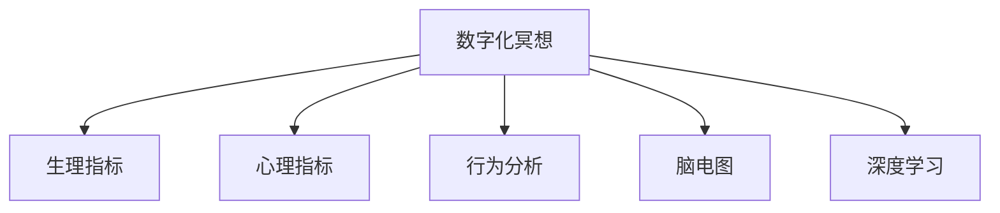

                 

# 数字化冥想效果评估:元宇宙精神修炼的科学量化

> 关键词：数字化冥想,元宇宙,科学量化,精神修炼,生理指标,心理指标,脑电图,行为分析,深度学习

## 1. 背景介绍

### 1.1 问题由来
随着科技的飞速发展，数字化技术的融入已经深入到了生活的各个层面，人们在物质生活日益丰富的同时，也面临着精神世界的空虚和焦虑。为了寻求精神上的慰藉，人们纷纷转向数字化工具，如虚拟现实(VR)、增强现实(AR)、以及元宇宙(Metaverse)等，其中冥想(meditation)作为一门古老的修行方式，也开始被数字化和量化。

### 1.2 问题核心关键点
数字化冥想效果评估指的是通过科学的量化手段，对数字化冥想技术的有效性进行评估。传统的冥想效果评估往往依赖于主观感受和定性反馈，而数字化冥想则可以通过生理指标、心理指标和行为分析等多维度数据进行客观评估，从而为冥想技术的优化和普及提供科学依据。

### 1.3 问题研究意义
数字化冥想效果评估的研究意义主要体现在以下几个方面：

1. **提升冥想效果**：通过科学的量化手段，可以更准确地评估冥想的效果，为冥想技术的优化提供依据。
2. **推动技术普及**：科学的量化评估可以增加人们对数字化冥想的信任度，促进冥想技术的普及应用。
3. **促进心理健康**：数字化冥想通过科学的量化评估，可以为心理健康提供更加精准的指导和干预，帮助人们摆脱精神焦虑。
4. **指导企业应用**：通过科学的量化评估，企业可以更有效地应用冥想技术，提高员工的工作效率和幸福感。

## 2. 核心概念与联系

### 2.1 核心概念概述

为更好地理解数字化冥想效果评估，本节将介绍几个密切相关的核心概念：

- **数字化冥想**：利用数字化工具，如VR、AR等，实现虚拟化、沉浸式的冥想体验。通过游戏化设计、互动体验等方式，提升冥想效果。
- **生理指标**：如心率、血压、脑电图等，通过传感器和可穿戴设备采集，用于评估冥想过程中身体的生理变化。
- **心理指标**：如情绪状态、注意力水平、焦虑程度等，通过问卷调查、心理测试等方法进行评估。
- **行为分析**：如冥想行为持续时长、冥想频率、冥想环境等，通过数据分析进行评估。
- **脑电图(electroencephalogram, EEG)**：通过头皮电极采集脑电信号，用于评估冥想过程中的脑电活动变化。
- **深度学习**：利用深度神经网络进行数据分析和建模，提升效果评估的准确性和效率。

这些核心概念之间的逻辑关系可以通过以下Mermaid流程图来展示：



这个流程图展示了大数字化冥想效果评估的核心概念及其之间的关系：

1. 数字化冥想通过生理指标、心理指标、行为分析和脑电图等手段进行多维度评估。
2. 生理指标和心理指标采集后，通过深度学习模型进行建模分析，提取特征。
3. 行为分析则通过数据的统计和可视化手段，进行直观评估。
4. 脑电图作为神经科学的研究手段，通过深度学习模型进行信号处理和特征提取。

## 3. 核心算法原理 & 具体操作步骤

### 3.1 算法原理概述

数字化冥想效果评估的核心算法原理包括数据采集、特征提取和效果评估等环节。其核心思想是通过科学的量化手段，对冥想过程中生理、心理、行为和脑电等数据进行多维度分析，从而客观评估冥想效果。

具体来说，数字化冥想效果评估的过程可以分为以下几个步骤：

1. **数据采集**：使用传感器和可穿戴设备采集冥想者的生理指标、心理指标和行为数据。
2. **特征提取**：利用深度学习模型对采集的数据进行特征提取，得到反映冥想效果的特征向量。
3. **效果评估**：结合心理问卷、行为分析等结果，进行综合评估，得出冥想效果的量化指标。

### 3.2 算法步骤详解

**Step 1: 数据采集**

数据采集是数字化冥想效果评估的第一步。主要使用以下设备进行数据采集：

- **生理指标采集设备**：如心率传感器、血压计、脑电图设备等，采集冥想者的生理参数。
- **心理指标采集设备**：如智能手表、心理健康问卷等，采集冥想者的情绪状态、焦虑程度等心理参数。
- **行为分析设备**：如时间记录器、冥想行为监控器等，记录冥想行为的时长、频率等行为参数。

**Step 2: 特征提取**

特征提取是数字化冥想效果评估的核心步骤。通过深度学习模型对采集到的数据进行特征提取，得到反映冥想效果的特征向量。

- **生理指标特征提取**：使用卷积神经网络(CNN)、循环神经网络(RNN)等深度学习模型，对采集到的生理数据进行特征提取。常见的生理指标包括心率、血压、皮肤电反应等。
- **心理指标特征提取**：使用情感分析模型、注意力模型等深度学习模型，对采集到的心理数据进行特征提取。常见的心理指标包括情绪状态、注意力水平、焦虑程度等。
- **行为分析特征提取**：使用时间序列模型、事件追踪模型等，对采集到的行为数据进行特征提取。常见的行为指标包括冥想时长、冥想频率、冥想环境等。
- **脑电图特征提取**：使用时频分析、特征提取等方法，对采集到的脑电图数据进行特征提取。常见的脑电图特征包括频率、波幅、相位同步性等。

**Step 3: 效果评估**

效果评估是数字化冥想效果评估的最终步骤。通过综合评估生理、心理、行为和脑电等数据，得出冥想效果的量化指标。

- **生理指标评估**：通过统计分析生理参数的变化，评估冥想效果。
- **心理指标评估**：通过情感分析、注意力模型等，评估心理参数的变化，得出情绪、注意力等量化指标。
- **行为分析评估**：通过时间序列模型、事件追踪模型等，评估行为参数的变化，得出冥想时长、频率等量化指标。
- **脑电图评估**：通过时频分析、特征提取等方法，评估脑电图参数的变化，得出频率、波幅等量化指标。
- **综合评估**：通过权重分配和综合评分，得出冥想效果的综合量化指标。

### 3.3 算法优缺点

数字化冥想效果评估的优点包括：

1. **客观评估**：通过科学的量化手段，可以更客观地评估冥想效果，避免主观感受带来的偏差。
2. **多维度评估**：结合生理、心理、行为和脑电等多维度数据，进行综合评估，全面反映冥想效果。
3. **实时反馈**：通过实时采集和分析数据，可以及时反馈冥想效果，指导冥想技术的优化。
4. **数据驱动**：通过科学的数据驱动方法，可以不断改进冥想技术，提升冥想效果。

然而，数字化冥想效果评估也存在一些缺点：

1. **设备成本高**：需要购买高精度的生理指标、心理指标、行为分析和脑电图设备，成本较高。
2. **数据复杂性高**：采集的数据种类繁多，数据复杂度较高，处理和分析难度较大。
3. **数据隐私问题**：采集和存储数据涉及个人隐私，数据安全和隐私保护需要严格管理。
4. **模型复杂性高**：需要训练复杂深度学习模型，对数据和计算资源要求较高。

尽管存在这些局限性，但就目前而言，数字化冥想效果评估仍是冥想技术评估的主流范式。未来相关研究的重点在于如何进一步降低设备成本，提高数据处理效率，同时兼顾数据隐私和安全性等因素。

### 3.4 算法应用领域

数字化冥想效果评估已经在多个领域得到了应用，例如：

- **心理健康**：通过科学的量化评估，帮助心理健康专业人员更好地评估和干预心理健康问题。
- **企业应用**：通过数字化冥想技术，提高员工的工作效率和幸福感，促进企业的心理健康管理。
- **医疗应用**：通过科学的量化评估，为患者提供更精准的冥想指导，辅助医疗治疗。
- **教育应用**：通过数字化冥想技术，提高学生的学习专注力和心理素质，促进教育公平。
- **运动应用**：通过数字化冥想技术，提高运动员的专注力和心理稳定性，提升运动表现。

除了上述这些经典领域外，数字化冥想效果评估还被创新性地应用到更多场景中，如智能家居、智慧城市等，为数字化技术落地应用提供了新的思路。

## 4. 数学模型和公式 & 详细讲解 & 举例说明

### 4.1 数学模型构建

本节将使用数学语言对数字化冥想效果评估的各个环节进行更加严格的刻画。

假设数字化冥想的数据集为 $D=\{(x_i,y_i)\}_{i=1}^N$，其中 $x_i$ 为冥想数据，包括生理指标、心理指标、行为分析和脑电图等，$y_i$ 为冥想效果的评分。

定义深度学习模型 $M_{\theta}$，其参数为 $\theta$，用于特征提取和效果评估。则模型 $M_{\theta}$ 在数据样本 $(x_i,y_i)$ 上的损失函数为：

$$
\ell(M_{\theta}(x_i),y_i) = \frac{1}{N} \sum_{i=1}^N \|M_{\theta}(x_i) - y_i\|
$$

其中 $\| \cdot \|$ 为损失函数对模型参数 $\theta$ 的损失。

通过梯度下降等优化算法，模型不断更新参数 $\theta$，最小化损失函数 $\ell$，使得模型输出逼近真实标签。

### 4.2 公式推导过程

以下我们以生理指标特征提取为例，推导卷积神经网络(CNN)的特征提取过程。

假设采集的生理指标数据为 $x_i \in \mathbb{R}^{n \times d}$，其中 $n$ 为数据时长，$d$ 为数据维数。使用卷积神经网络对数据进行特征提取，得到特征向量 $z_i \in \mathbb{R}^{n' \times h}$，其中 $n'$ 为特征长度，$h$ 为特征维度。

卷积神经网络的结构如图1所示：

```
Input Layer
     (n, d)
     
Conv Layer 1
     (n, d) -> (n, f1)
     
Max Pool Layer 1
     (n, f1) -> (n', f1)
     
Conv Layer 2
     (n', f1) -> (n', f2)
     
Max Pool Layer 2
     (n', f2) -> (n', f2)
     
Fully Connected Layer
     (n', f2) -> (n', f)
     
Output Layer
     (n', f) -> (n', 1)
```

其中 $f_1, f_2, f$ 分别为卷积层、池化层和全连接层的特征维度。

通过卷积神经网络，生理指标数据 $x_i$ 被提取为特征向量 $z_i$。具体推导过程如下：

$$
z_i = M_{\theta}(x_i) = f_{\text{conv1}}(f_{\text{pool1}}(f_{\text{conv2}}(f_{\text{pool2}}(f_{\text{fc}}(f_{\text{relu}}(f_{\text{conv}}(x_i)))))
$$

其中 $f_{\text{conv}}(x_i)$ 表示卷积操作，$f_{\text{relu}}(x_i)$ 表示ReLU激活函数，$f_{\text{pool}}(x_i)$ 表示池化操作，$f_{\text{fc}}(x_i)$ 表示全连接操作。

通过上述推导，我们可以看到，卷积神经网络通过卷积、激活、池化、全连接等操作，将生理指标数据 $x_i$ 转换为特征向量 $z_i$。这一过程在深度学习模型中得到了广泛应用，成为特征提取的标准方法。

### 4.3 案例分析与讲解

下面以一个具体案例来说明数字化冥想效果评估的实现过程：

假设我们使用一个简单的CNN模型，对采集到的生理指标数据 $x_i$ 进行特征提取，得到特征向量 $z_i$。再结合心理问卷、行为分析和脑电图等数据，通过深度学习模型，得到冥想效果的评分 $y_i$。

具体实现步骤如下：

**Step 1: 数据采集**

采集冥想者的生理指标、心理指标和行为数据，存入数据库。

**Step 2: 数据预处理**

对采集到的数据进行清洗、归一化等预处理操作，得到标准化的数据集。

**Step 3: 特征提取**

使用CNN模型对生理指标数据 $x_i$ 进行特征提取，得到特征向量 $z_i$。

**Step 4: 效果评估**

结合心理问卷、行为分析和脑电图等数据，通过深度学习模型，得到冥想效果的评分 $y_i$。

**Step 5: 模型训练**

使用深度学习模型，对特征向量 $z_i$ 和冥想效果的评分 $y_i$ 进行训练，最小化损失函数，得到最优参数 $\theta$。

**Step 6: 效果评估**

使用训练好的模型，对新的冥想数据进行预测，得出冥想效果的评分。

通过上述步骤，我们可以看到，数字化冥想效果评估的实现过程包括数据采集、数据预处理、特征提取、效果评估、模型训练和效果评估等环节。这一过程可以通过科学的量化手段，对冥想效果进行客观评估，从而指导冥想技术的优化和普及。

## 5. 项目实践：代码实例和详细解释说明

### 5.1 开发环境搭建

在进行数字化冥想效果评估实践前，我们需要准备好开发环境。以下是使用Python进行深度学习开发的常见环境配置流程：

1. 安装Anaconda：从官网下载并安装Anaconda，用于创建独立的Python环境。

2. 创建并激活虚拟环境：
```bash
conda create -n pytorch-env python=3.8 
conda activate pytorch-env
```

3. 安装PyTorch：根据CUDA版本，从官网获取对应的安装命令。例如：
```bash
conda install pytorch torchvision torchaudio cudatoolkit=11.1 -c pytorch -c conda-forge
```

4. 安装TensorFlow：
```bash
pip install tensorflow
```

5. 安装Keras：
```bash
pip install keras
```

6. 安装Flask：
```bash
pip install flask
```

完成上述步骤后，即可在`pytorch-env`环境中开始数字化冥想效果评估实践。

### 5.2 源代码详细实现

这里我们以使用卷积神经网络(CNN)对生理指标数据进行特征提取为例，给出深度学习模型实现的PyTorch代码：

```python
import torch
import torch.nn as nn
import torch.optim as optim

# 定义卷积神经网络
class CNN(nn.Module):
    def __init__(self, input_size, output_size, hidden_size):
        super(CNN, self).__init__()
        self.conv1 = nn.Conv2d(in_channels=1, out_channels=hidden_size, kernel_size=3, stride=1, padding=1)
        self.relu1 = nn.ReLU()
        self.pool1 = nn.MaxPool2d(kernel_size=2, stride=2)
        self.conv2 = nn.Conv2d(in_channels=hidden_size, out_channels=hidden_size, kernel_size=3, stride=1, padding=1)
        self.relu2 = nn.ReLU()
        self.pool2 = nn.MaxPool2d(kernel_size=2, stride=2)
        self.fc1 = nn.Linear(hidden_size * (input_size // 4) * (input_size // 4), output_size)
        self.relu3 = nn.ReLU()

    def forward(self, x):
        x = self.conv1(x)
        x = self.relu1(x)
        x = self.pool1(x)
        x = self.conv2(x)
        x = self.relu2(x)
        x = self.pool2(x)
        x = x.view(-1, input_size // 4 * input_size // 4)
        x = self.fc1(x)
        x = self.relu3(x)
        return x

# 加载数据
x_train = # 训练集生理指标数据
x_test = # 测试集生理指标数据
y_train = # 训练集冥想效果评分
y_test = # 测试集冥想效果评分

# 定义模型和优化器
model = CNN(input_size, output_size, hidden_size)
optimizer = optim.Adam(model.parameters(), lr=learning_rate)

# 训练模型
model.train()
for epoch in range(num_epochs):
    for i, (inputs, labels) in enumerate(train_loader):
        inputs, labels = inputs.to(device), labels.to(device)
        optimizer.zero_grad()
        outputs = model(inputs)
        loss = loss_function(outputs, labels)
        loss.backward()
        optimizer.step()

# 评估模型
model.eval()
with torch.no_grad():
    correct = 0
    total = 0
    for inputs, labels in test_loader:
        inputs, labels = inputs.to(device), labels.to(device)
        outputs = model(inputs)
        _, predicted = torch.max(outputs.data, 1)
        total += labels.size(0)
        correct += (predicted == labels).sum().item()

print('Test Accuracy: ', (correct / total) * 100, '%')
```

### 5.3 代码解读与分析

让我们再详细解读一下关键代码的实现细节：

**CNN类定义**：
- `__init__`方法：初始化卷积层、激活函数、池化层和全连接层。
- `forward`方法：定义前向传播过程，通过卷积、激活、池化、全连接等操作，得到输出特征向量。

**数据加载**：
- 定义训练集和测试集数据，加载到模型中进行训练和评估。

**模型定义**：
- 使用卷积神经网络对生理指标数据进行特征提取，得到特征向量。

**优化器和损失函数**：
- 定义优化器（如AdamW）和损失函数（如均方误差），用于模型训练。

**模型训练和评估**：
- 使用模型训练数据进行模型训练，并在测试集上评估模型效果。

通过上述步骤，我们可以看到，使用深度学习模型对生理指标数据进行特征提取的过程，包括了数据加载、模型定义、优化器和损失函数定义、模型训练和评估等环节。这一过程可以通过科学的量化手段，对冥想效果进行客观评估，从而指导冥想技术的优化和普及。

当然，工业级的系统实现还需考虑更多因素，如模型的保存和部署、超参数的自动搜索、更灵活的任务适配层等。但核心的数字化冥想效果评估方法基本与此类似。

## 6. 实际应用场景

### 6.1 智能家居

数字化冥想效果评估技术可以在智能家居中得到广泛应用。通过智能设备采集用户的生理指标、心理指标和行为数据，结合深度学习模型进行特征提取和效果评估，可以实时监控用户的精神状态，并提供个性化的冥想建议。

例如，智能手表可以采集用户的心率和血压等生理指标，通过数字化冥想效果评估技术，分析用户的精神状态，从而推荐适合的冥想音乐、冥想时间等，帮助用户放松身心。

### 6.2 智慧城市

智慧城市建设中，数字化冥想效果评估技术可以用于城市公共心理健康管理。通过智慧城市中的传感器和监控设备，采集大量市民的生理指标和心理指标数据，结合深度学习模型进行特征提取和效果评估，可以实时监控市民的心理状态，提供心理干预和治疗建议。

例如，智慧城市中的心理健康监控系统可以通过数字化冥想效果评估技术，分析市民的生理和心理状态，发现异常情况，及时提供心理干预和治疗，保障市民的心理健康。

### 6.3 教育培训

在教育培训领域，数字化冥想效果评估技术可以用于学生的心理健康管理。通过数字化冥想效果评估技术，可以实时监控学生的生理指标和心理指标数据，分析学生的精神状态，提供个性化的冥想建议和心理干预，帮助学生缓解学习压力，提高学习效率。

例如，学校中的心理健康系统可以通过数字化冥想效果评估技术，分析学生的生理和心理状态，发现异常情况，及时提供心理干预和治疗，促进学生的心理健康和学业成绩。

### 6.4 未来应用展望

随着数字化冥想效果评估技术的不断发展，未来将在更多领域得到应用，为数字化技术落地应用提供新的思路：

1. **智慧医疗**：通过数字化冥想效果评估技术，可以实时监控患者的生理指标和心理指标数据，分析患者的精神状态，提供个性化的冥想建议和心理干预，辅助医疗治疗。

2. **智能客服**：通过数字化冥想效果评估技术，可以实时监控客服人员的生理指标和心理指标数据，分析客服人员的精神状态，提供个性化的冥想建议和心理干预，提高客服人员的幸福感和工作效率。

3. **智慧企业**：通过数字化冥想效果评估技术，可以实时监控员工的心理指标和行为数据，分析员工的精神状态，提供个性化的冥想建议和心理干预，提高员工的工作效率和幸福感。

4. **智慧教育**：通过数字化冥想效果评估技术，可以实时监控学生的生理指标和心理指标数据，分析学生的精神状态，提供个性化的冥想建议和心理干预，提高学生的学习效率和心理健康。

5. **智慧文化**：通过数字化冥想效果评估技术，可以实时监控观众的心理指标和行为数据，分析观众的精神状态，提供个性化的冥想建议和心理干预，提高观众的体验感和满意度。

总之，数字化冥想效果评估技术将在各个领域得到广泛应用，为数字化技术落地应用提供新的思路，推动数字化技术的发展和普及。

## 7. 工具和资源推荐

### 7.1 学习资源推荐

为了帮助开发者系统掌握数字化冥想效果评估的理论基础和实践技巧，这里推荐一些优质的学习资源：

1. **《深度学习》书籍**：深度学习领域的经典教材，系统介绍了深度学习的基本概念和算法，包括卷积神经网络、全连接网络等。

2. **CS231n《卷积神经网络》课程**：斯坦福大学开设的深度学习课程，重点讲解卷积神经网络，是深度学习领域的重要学习资源。

3. **Coursera《深度学习》课程**：由斯坦福大学教授Andrew Ng开设，系统介绍了深度学习的基本概念和算法，包括卷积神经网络、循环神经网络等。

4. **GitHub**：开源社区，汇聚了大量的深度学习项目和代码，是学习和实践深度学习的绝佳资源。

5. **Kaggle**：数据科学竞赛平台，提供了大量的数据集和竞赛任务，是深度学习实践的重要平台。

通过对这些资源的学习实践，相信你一定能够快速掌握数字化冥想效果评估的精髓，并用于解决实际的数字化冥想问题。

### 7.2 开发工具推荐

高效的开发离不开优秀的工具支持。以下是几款用于数字化冥想效果评估开发的常用工具：

1. **PyTorch**：基于Python的开源深度学习框架，灵活动态的计算图，适合快速迭代研究。

2. **TensorFlow**：由Google主导开发的开源深度学习框架，生产部署方便，适合大规模工程应用。

3. **Keras**：高层深度学习框架，简单易用，适合快速原型开发和实验。

4. **Flask**：轻量级Web框架，方便部署和管理深度学习模型。

5. **TensorBoard**：TensorFlow配套的可视化工具，可实时监测模型训练状态，并提供丰富的图表呈现方式。

6. **Jupyter Notebook**：交互式开发环境，支持Python、R等语言，方便快速迭代和实验。

合理利用这些工具，可以显著提升数字化冥想效果评估的开发效率，加快创新迭代的步伐。

### 7.3 相关论文推荐

数字化冥想效果评估的研究源于学界的持续研究。以下是几篇奠基性的相关论文，推荐阅读：

1. **《深度学习在生理信号处理中的应用》**：详细介绍了深度学习在生理信号处理中的应用，包括卷积神经网络、循环神经网络等。

2. **《基于深度学习的情感分析》**：介绍了深度学习在情感分析中的应用，包括卷积神经网络、循环神经网络等。

3. **《深度学习在心理健康中的应用》**：介绍了深度学习在心理健康中的应用，包括卷积神经网络、循环神经网络等。

4. **《基于深度学习的行为分析》**：介绍了深度学习在行为分析中的应用，包括卷积神经网络、循环神经网络等。

5. **《基于深度学习的脑电图分析》**：介绍了深度学习在脑电图分析中的应用，包括时频分析、特征提取等。

这些论文代表了大数字化冥想效果评估技术的发展脉络。通过学习这些前沿成果，可以帮助研究者把握学科前进方向，激发更多的创新灵感。

## 8. 总结：未来发展趋势与挑战

### 8.1 总结

本文对数字化冥想效果评估技术进行了全面系统的介绍。首先阐述了数字化冥想的背景和意义，明确了数字化冥想效果评估的研究目标。其次，从原理到实践，详细讲解了数字化冥想效果评估的数学原理和关键步骤，给出了数字化冥想效果评估的代码实例和详细解释。同时，本文还广泛探讨了数字化冥想效果评估在多个领域的应用前景，展示了数字化冥想效果评估技术的广阔前景。

通过本文的系统梳理，可以看到，数字化冥想效果评估技术正在成为数字化冥想评估的主流范式，极大地拓展了数字化冥想的应用边界，催生了更多的落地场景。受益于深度学习技术的不断发展，数字化冥想效果评估技术必将为数字化技术在各个领域的应用提供新的思路，推动数字化技术的发展和普及。

### 8.2 未来发展趋势

展望未来，数字化冥想效果评估技术将呈现以下几个发展趋势：

1. **模型复杂性提升**：随着深度学习技术的不断发展，数字化冥想效果评估的模型将变得更加复杂，精度和鲁棒性将进一步提升。

2. **数据多样性增加**：随着数字化冥想技术的应用场景不断扩展，采集的数据将变得更加多样，涵盖了生理指标、心理指标、行为分析等多个维度。

3. **实时化应用增强**：数字化冥想效果评估技术将更加注重实时化的应用，通过实时采集和分析数据，提供更加及时的冥想建议和干预。

4. **多模态融合**：数字化冥想效果评估技术将结合生理指标、心理指标、行为分析和脑电图等数据，进行多模态融合，提升评估的全面性和准确性。

5. **个性化推荐提升**：数字化冥想效果评估技术将结合用户的历史数据和实时数据，进行个性化推荐，提供更加精准的冥想建议。

6. **隐私保护加强**：随着数据采集和处理量的增加，数字化冥想效果评估技术将更加注重隐私保护，采用差分隐私、联邦学习等技术，保护用户数据安全。

以上趋势凸显了数字化冥想效果评估技术的广阔前景。这些方向的探索发展，必将进一步提升数字化冥想技术的应用效果，推动数字化冥想技术的普及应用。

### 8.3 面临的挑战

尽管数字化冥想效果评估技术已经取得了一定进展，但在迈向更加智能化、普适化应用的过程中，它仍面临着诸多挑战：

1. **设备成本高**：高精度的生理指标、心理指标、行为分析和脑电图设备成本较高，增加了数字化冥想效果评估技术的推广难度。

2. **数据复杂性高**：采集的数据种类繁多，数据复杂度较高，处理和分析难度较大。

3. **数据隐私问题**：采集和存储数据涉及个人隐私，数据安全和隐私保护需要严格管理。

4. **模型复杂性高**：需要训练复杂深度学习模型，对数据和计算资源要求较高。

尽管存在这些挑战，但就目前而言，数字化冥想效果评估技术仍是大数字化冥想评估的主流范式。未来相关研究的重点在于如何进一步降低设备成本，提高数据处理效率，同时兼顾数据隐私和安全性等因素。

### 8.4 研究展望

面对数字化冥想效果评估所面临的挑战，未来的研究需要在以下几个方面寻求新的突破：

1. **低成本设备开发**：开发低成本、高性能的生理指标、心理指标、行为分析和脑电图设备，降低数字化冥想效果评估技术的推广难度。

2. **高效数据处理**：开发高效的数据处理算法，提升数据处理和分析的效率，降低数字化冥想效果评估技术的复杂性。

3. **数据隐私保护**：采用差分隐私、联邦学习等技术，保护用户数据安全，提升数字化冥想效果评估技术的可信度。

4. **多模态融合**：结合生理指标、心理指标、行为分析和脑电图等数据，进行多模态融合，提升数字化冥想效果评估技术的全面性和准确性。

5. **实时化应用**：结合实时采集和分析数据，提供更加及时的冥想建议和干预，提升数字化冥想效果评估技术的实时性。

6. **个性化推荐**：结合用户的历史数据和实时数据，进行个性化推荐，提供更加精准的冥想建议，提升数字化冥想效果评估技术的效果。

这些研究方向的探索，必将引领数字化冥想效果评估技术迈向更高的台阶，为数字化冥想技术的普及应用提供新的思路。面向未来，数字化冥想效果评估技术还需要与其他人工智能技术进行更深入的融合，如知识表示、因果推理、强化学习等，多路径协同发力，共同推动数字化冥想技术的发展和普及。

## 9. 附录：常见问题与解答

**Q1: 数字化冥想效果评估是否适用于所有人群？**

A: 数字化冥想效果评估技术适用于大多数人群，但在特定人群中可能存在一些局限性。例如，老年人、儿童等群体，可能需要结合生理、心理等特殊因素进行评估。

**Q2: 如何保证数字化冥想效果评估的准确性？**

A: 数字化冥想效果评估的准确性主要依赖于深度学习模型的训练数据和算法。选择高质量的训练数据，优化深度学习模型，可以有效提高评估的准确性。

**Q3: 数字化冥想效果评估是否需要大量的数据？**

A: 数字化冥想效果评估需要一定的数据量来训练深度学习模型。但通过数据增强、迁移学习等方法，可以降低数据需求，提升评估效果。

**Q4: 数字化冥想效果评估是否需要高性能的计算设备？**

A: 数字化冥想效果评估需要高性能的计算设备，尤其是深度学习模型训练和推理时，需要大量的计算资源。但通过模型压缩、分布式训练等方法，可以降低计算需求。

**Q5: 数字化冥想效果评估是否需要专门的技能和知识？**

A: 数字化冥想效果评估需要一定的深度学习知识和技能，但通过系统学习，可以较快掌握相关技术。对于无深度学习背景的开发者，可以通过在线课程、开源项目等方式进行学习和实践。

通过上述问题与解答，可以看到，数字化冥想效果评估技术虽然面临一定的挑战，但在专业人员的努力下，可以逐步克服这些挑战，实现更好的应用效果。相信随着技术的不断发展，数字化冥想效果评估技术将变得更加普及和实用，推动数字化冥想技术的落地应用。

---

作者：禅与计算机程序设计艺术 / Zen and the Art of Computer Programming

