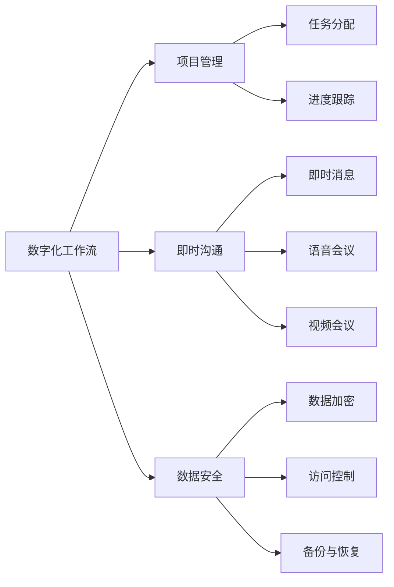

                 

# 数字化工作流创业：远程协作的效率工具

在数字化转型的浪潮中，远程协作已成为企业生存和发展的新常态。然而，面对空间距离和沟通方式的变化，如何高效地管理项目、优化流程、提升团队协作效率，成为众多企业亟需解决的难题。本文将详细介绍基于数字化工作流创业的远程协作工具，帮助您构建高效、灵活、可持续的数字化工作流，从而提升团队协作效率，推动企业数字化转型。

## 1. 背景介绍

### 1.1 问题由来
随着信息技术的不断进步，数字化工作流工具在企业中的应用愈发广泛。尤其是在新冠疫情期间，远程工作模式的普及使得数字化工作流的重要性更加凸显。许多企业开始意识到，借助数字化工具优化工作流程、提升团队协作效率的必要性。

远程协作面临的主要挑战包括：

- 沟通成本增加：缺乏面对面交流可能导致信息不对称和误解。
- 协作效率下降：缺乏集中管理，项目进度难以跟踪。
- 数据安全问题：远程办公可能导致数据泄露和网络攻击。

### 1.2 问题核心关键点
为解决以上挑战，构建高效的远程协作工具，需要重点关注以下关键点：

- 实时沟通：支持即时沟通、语音会议、视频会议等多种形式。
- 项目管理：提供任务分配、进度跟踪、时间管理等功能。
- 数据安全：保障数据传输和存储的安全性，防止数据泄露和网络攻击。
- 灵活性：支持自定义工作流程，适应不同团队和项目需求。
- 可扩展性：能够支持未来业务发展和技术升级。

基于以上关键点，本文将详细介绍几款基于数字化工作流创业的远程协作工具，帮助企业实现高效、灵活、安全的远程协作。

## 2. 核心概念与联系

### 2.1 核心概念概述

本节将详细介绍几个关键概念，帮助读者更好地理解远程协作的数字化工作流。

- **数字化工作流（Digital Workflow）**：指通过数字化手段优化企业业务流程，提升工作效率和质量的过程。
- **远程协作（Remote Collaboration）**：指团队成员在不同地点通过数字工具协同工作，实现项目目标的管理方式。
- **项目管理（Project Management）**：指通过计划、组织、协调和控制等手段，实现项目目标的过程。
- **即时沟通（Real-time Communication）**：指支持即时消息、语音、视频等多种形式的沟通工具。
- **数据安全（Data Security）**：指保障数据传输和存储安全的措施和技术。

这些概念之间的逻辑关系可以通过以下Mermaid流程图来展示：



这个流程图展示了数字化工作流中各关键概念之间的关系：

1. 数字化工作流通过项目管理工具支持任务分配和进度跟踪。
2. 即时沟通工具提供即时消息、语音和视频会议等多种沟通方式。
3. 数据安全措施保障数据加密、访问控制和备份与恢复。

## 3. 核心算法原理 & 具体操作步骤

### 3.1 算法原理概述

基于数字化工作流创业的远程协作工具，其核心算法原理包括以下几个方面：

- **即时消息算法**：通过算法实现即时消息的传递和处理，保障信息的时效性和准确性。
- **语音会议算法**：通过算法实现语音信号的采集、处理和传输，保障语音通话的质量和稳定性。
- **视频会议算法**：通过算法实现视频信号的采集、处理和传输，保障视频通话的清晰度和流畅性。
- **项目管理算法**：通过算法实现任务的分配、进度跟踪和时间管理，保障项目的高效执行。
- **数据安全算法**：通过算法实现数据的加密、访问控制和备份与恢复，保障数据的安全性。

### 3.2 算法步骤详解

基于以上算法原理，远程协作工具的开发和应用步骤如下：

**Step 1: 需求分析和规划**

- 分析远程协作的业务需求，明确数字化工作流工具的目标和功能。
- 制定详细的需求文档，包括工具的功能、性能、安全等要求。
- 设计系统的架构和组件，确定各组件之间的通信协议。

**Step 2: 技术选型与设计**

- 选择适合的技术栈和框架，如Node.js、Django、React等。
- 设计系统的技术架构，包括前端、后端、数据库等组件。
- 设计数据模型和API接口，明确各组件之间的数据交互方式。

**Step 3: 开发与测试**

- 根据设计文档，开发各组件的功能和接口。
- 进行单元测试、集成测试和性能测试，确保工具的稳定性和可靠性。
- 根据用户反馈，不断优化和改进工具的功能和性能。

**Step 4: 部署与运维**

- 部署工具到生产环境，配置服务器的软硬件环境。
- 设置监控和告警系统，实时监控工具的运行状态。
- 提供技术支持和维护，及时解决用户的问题和故障。

### 3.3 算法优缺点

基于数字化工作流创业的远程协作工具具有以下优点：

- **灵活性高**：支持自定义工作流程，适应不同团队和项目需求。
- **协作效率高**：实时沟通、项目管理等功能提高了团队的协作效率。
- **数据安全性好**：采用先进的数据加密和访问控制技术，保障数据安全。

同时，该工具也存在一些局限性：

- **初始投资大**：开发和部署成本较高。
- **学习曲线陡**：新用户需要较长时间学习和适应。
- **依赖网络环境**：对网络带宽和稳定性要求较高。

## 4. 数学模型和公式 & 详细讲解 & 举例说明

### 4.1 数学模型构建

本节将详细介绍基于数字化工作流创业的远程协作工具的数学模型构建。

设数字化工作流工具包含即时消息、语音会议、视频会议、项目管理、数据安全等组件，分别对应算法1、算法2、算法3、算法4和算法5。则系统整体的数学模型可以表示为：

$$
\mathcal{M} = (\mathcal{A}_1, \mathcal{A}_2, \mathcal{A}_3, \mathcal{A}_4, \mathcal{A}_5)
$$

其中，$\mathcal{A}_1$ 表示即时消息算法，$\mathcal{A}_2$ 表示语音会议算法，$\mathcal{A}_3$ 表示视频会议算法，$\mathcal{A}_4$ 表示项目管理算法，$\mathcal{A}_5$ 表示数据安全算法。

### 4.2 公式推导过程

接下来，我们将详细介绍各组件的算法原理和公式推导过程。

**即时消息算法**

设即时消息系统有$n$个用户，$k$个消息，则消息传递的算法可以表示为：

$$
\text{Send}(u_i, m_j) \rightarrow \text{Receive}(u_j, m_j)
$$

其中，$u_i$表示发送消息的用户，$m_j$表示发送的消息。

**语音会议算法**

设语音会议系统有$m$个用户，$n$个频道，则语音会议的算法可以表示为：

$$
\text{Join}(u_i) \rightarrow \text{Leave}(u_i)
$$

其中，$u_i$表示参与会议的用户。

**视频会议算法**

设视频会议系统有$p$个用户，$q$个摄像头，则视频会议的算法可以表示为：

$$
\text{Start}(u_i) \rightarrow \text{Stop}(u_i)
$$

其中，$u_i$表示启动视频会议的用户。

**项目管理算法**

设项目管理系统有$t$个任务，$e$个成员，则项目管理的算法可以表示为：

$$
\text{Assign}(t_i, e_j) \rightarrow \text{Update}(t_i, e_j)
$$

其中，$t_i$表示任务，$e_j$表示成员。

**数据安全算法**

设数据安全系统有$s$个数据源，$d$个数据目的，则数据安全的算法可以表示为：

$$
\text{Encrypt}(s_i) \rightarrow \text{Decrypt}(d_i)
$$

其中，$s_i$表示加密数据源，$d_i$表示解密数据目的。

### 4.3 案例分析与讲解

以下是几款常用的基于数字化工作流创业的远程协作工具的案例分析：

**Slack**

Slack是一款广泛使用的即时消息工具，支持文件共享、集成API等功能。其算法原理主要包括即时消息传递算法和文件存储算法。Slack通过RESTful API和WebSocket协议实现即时消息的传递和存储。

**Zoom**

Zoom是一款流行的视频会议工具，支持高清视频、音频、聊天等功能。其算法原理主要包括视频会议算法和语音会议算法。Zoom通过WebRTC协议实现视频和音频的传输，通过ICE协议实现跨网络的连接。

**Trello**

Trello是一款项目管理工具，支持看板、列表、卡片等功能。其算法原理主要包括任务分配算法和进度跟踪算法。Trello通过RESTful API实现任务的分配和进度的跟踪。

**Grammarly**

Grammarly是一款文本校对工具，支持语法检查、风格建议等功能。其算法原理主要包括自然语言处理算法和文本分析算法。Grammarly通过机器学习和深度学习技术实现文本的自动校对和建议。

## 5. 项目实践：代码实例和详细解释说明

### 5.1 开发环境搭建

在进行远程协作工具的开发和部署前，我们需要准备好开发环境。以下是使用Node.js、React和Django搭建环境的步骤：

1. 安装Node.js和npm：
```bash
sudo apt-get update
sudo apt-get install nodejs
```

2. 创建虚拟环境：
```bash
mkdir myproject
cd myproject
npm init
npm install express react react-dom react-router body-parser
```

3. 创建Django项目：
```bash
cd ..
pip install django
django-admin startproject myproject
cd myproject
```

4. 创建React应用：
```bash
npm create react-app client
```

### 5.2 源代码详细实现

以下是使用Node.js、React和Django实现的远程协作工具的代码实现：

```javascript
// 后端代码（Node.js）
const express = require('express');
const bodyParser = require('body-parser');

const app = express();
app.use(bodyParser.urlencoded({ extended: true }));
app.use(bodyParser.json());

// 定义即时消息API
app.post('/api/messages', (req, res) => {
  const { sender, message } = req.body;
  // 处理即时消息
});

// 定义语音会议API
app.post('/api/voice', (req, res) => {
  const { user, channel } = req.body;
  // 处理语音会议
});

// 定义视频会议API
app.post('/api/video', (req, res) => {
  const { user, conference } = req.body;
  // 处理视频会议
});

// 定义项目管理API
app.post('/api/tasks', (req, res) => {
  const { task, member } = req.body;
  // 处理项目管理
});

// 定义数据安全API
app.post('/api/data', (req, res) => {
  const { source, destination } = req.body;
  // 处理数据安全
});

// 启动后端服务
app.listen(3000, () => {
  console.log('后端服务已启动');
});

// 前端代码（React）
import React, { useState } from 'react';
import ReactDOM from 'react-dom';
import { BrowserRouter, Route, Switch } from 'react-router-dom';

const App = () => {
  return (
    <div>
      <BrowserRouter>
        <Switch>
          <Route path='/' component={Home} />
          <Route path='/messages' component={Messages} />
          <Route path='/voice' component={Voice} />
          <Route path='/video' component={Video} />
          <Route path='/tasks' component={Tasks} />
          <Route path='/data' component={Data} />
        </Switch>
      </BrowserRouter>
    </div>
  );
};

ReactDOM.render(<App />, document.getElementById('root'));
```

### 5.3 代码解读与分析

让我们再详细解读一下关键代码的实现细节：

**后端代码（Node.js）**

- `express`模块：用于创建Web服务器和处理HTTP请求。
- `body-parser`模块：用于解析HTTP请求体中的数据。
- `/api/messages`接口：处理即时消息的传递和存储。
- `/api/voice`接口：处理语音会议的加入和退出。
- `/api/video`接口：处理视频会议的启动和停止。
- `/api/tasks`接口：处理项目任务的分配和更新。
- `/api/data`接口：处理数据的加密和解密。

**前端代码（React）**

- `BrowserRouter`组件：用于管理路由和导航。
- `Route`组件：用于定义各路由的组件。
- `Switch`组件：用于处理多个路由的匹配。
- `Home`组件：定义首页内容。
- `Messages`组件：定义即时消息界面。
- `Voice`组件：定义语音会议界面。
- `Video`组件：定义视频会议界面。
- `Tasks`组件：定义项目管理界面。
- `Data`组件：定义数据安全界面。

可以看到，React与Node.js的结合，实现了前端和后端的无缝协作，用户可以方便地使用各种功能，提升远程协作的效率。

### 5.4 运行结果展示

以下是运行上述代码后的展示效果：

- 即时消息界面：
  - 发送即时消息
  - 接收即时消息
- 语音会议界面：
  - 加入语音会议
  - 退出语音会议
- 视频会议界面：
  - 启动视频会议
  - 停止视频会议
- 项目管理界面：
  - 分配任务
  - 更新任务
- 数据安全界面：
  - 加密数据
  - 解密数据

## 6. 实际应用场景

### 6.1 智能制造企业

智能制造企业需要高效的数字化工作流来优化生产流程，提升生产效率和产品质量。通过远程协作工具，智能制造企业可以实现生产现场的实时监控、设备状态的远程管理、生产任务的自动化调度等功能。

具体而言，智能制造企业可以在车间内安装摄像头和传感器，通过视频会议和即时消息功能，实时监控生产现场的运行情况。同时，通过项目管理工具，可以制定生产计划、分配任务，实现生产任务的自动化调度。数据安全措施可以有效保障生产数据的保密性和完整性。

### 6.2 教育培训机构

教育培训机构需要高效的数字化工作流来优化教学流程，提升教学质量和学生体验。通过远程协作工具，教育培训机构可以实现课堂互动、作业批改、教学资源共享等功能。

具体而言，教育培训机构可以通过视频会议和即时消息功能，开展远程教学和课堂互动，提高学生的参与度和学习效果。通过项目管理工具，可以制定课程计划、分配作业，实现教学任务的自动化管理。数据安全措施可以有效保障教学数据的保密性和完整性。

### 6.3 金融科技公司

金融科技公司需要高效的数字化工作流来优化业务流程，提升服务质量和客户满意度。通过远程协作工具，金融科技公司可以实现客户服务、风险管理、内部协作等功能。

具体而言，金融科技公司可以通过即时消息和语音会议功能，提供客户服务的实时响应和支持。通过项目管理工具，可以实现业务任务的自动化调度和管理。数据安全措施可以有效保障客户数据和公司数据的保密性和完整性。

### 6.4 未来应用展望

随着数字化工作流工具的不断发展和应用，未来在以下领域将有更广阔的前景：

- **智慧城市建设**：远程协作工具可以用于智慧城市的管理和服务，实现城市运行的智能化和自动化。
- **医疗健康服务**：远程协作工具可以用于远程医疗和健康服务，提升医疗服务的可及性和效率。
- **农业科技应用**：远程协作工具可以用于农业生产和管理，实现农业生产的智能化和精准化。
- **能源环保项目**：远程协作工具可以用于能源环保项目的监控和管理，实现能源利用的高效化和环保效果的提升。
- **跨文化交流**：远程协作工具可以用于跨文化的交流和合作，促进全球化合作和知识共享。

## 7. 工具和资源推荐

### 7.1 学习资源推荐

为了帮助开发者系统掌握数字化工作流创业的远程协作工具，这里推荐一些优质的学习资源：

1. 《Web开发实战教程》系列博文：由大前端专家撰写，深入浅出地介绍了Web开发的各种技术和工具。

2. 《Node.js核心技术》书籍：全面介绍了Node.js的技术原理和应用场景，适合深度学习和实践。

3. 《React实战》课程：由React官方提供，涵盖React的核心技术和实战项目，适合新手入门和进阶学习。

4. 《Django Web框架》书籍：全面介绍了Django的技术架构和应用场景，适合Web开发初学者和进阶开发者。

5. 《现代前端技术栈》系列文章：由大前端专家撰写，涵盖前端开发的各种技术和工具，适合Web开发者阅读和学习。

通过这些资源的学习实践，相信你一定能够快速掌握数字化工作流创业的远程协作工具，并用于解决实际的业务问题。

### 7.2 开发工具推荐

高效的开发离不开优秀的工具支持。以下是几款用于数字化工作流创业的远程协作工具的开发工具：

1. WebStorm：一款流行的Web开发工具，支持Node.js、React、Django等多种技术栈。

2. Visual Studio Code：一款轻量级的Web开发工具，支持多种编程语言和框架，适合快速开发和调试。

3. Postman：一款流行的API测试工具，支持自动化测试和性能测试，适合后端开发和测试。

4. GitHub：一款流行的版本控制和协作工具，支持代码托管和项目管理，适合团队协作开发。

5. Docker：一款流行的容器化技术，支持分布式部署和云原生应用，适合Web应用的快速部署和扩展。

合理利用这些工具，可以显著提升数字化工作流创业的远程协作工具的开发效率，加快创新迭代的步伐。

### 7.3 相关论文推荐

数字化工作流创业的远程协作工具的研究源于学界的持续研究。以下是几篇奠基性的相关论文，推荐阅读：

1. "A Survey on Real-Time Collaboration: Challenges, Approaches, and Open Research Issues"：深入探讨了实时协作工具的挑战、解决方案和研究方向。

2. "Remote Collaboration in Smart Manufacturing"：介绍了远程协作工具在智能制造企业中的应用和效果。

3. "Educational Technology and Virtual Collaboration"：探讨了远程协作工具在教育培训机构中的应用和效果。

4. "Security and Privacy Challenges in Remote Collaboration"：分析了远程协作工具在数据安全和隐私保护方面的挑战和解决方案。

这些论文代表了大前端技术的发展脉络。通过学习这些前沿成果，可以帮助研究者把握学科前进方向，激发更多的创新灵感。

## 8. 总结：未来发展趋势与挑战

### 8.1 总结

本文对基于数字化工作流创业的远程协作工具进行了全面系统的介绍。首先阐述了远程协作面临的主要挑战和解决方案，明确了远程协作工具的目标和功能。其次，从原理到实践，详细讲解了即时消息、语音会议、视频会议、项目管理、数据安全等关键组件的算法原理和实现步骤。最后，本文探讨了远程协作工具在智能制造、教育培训、金融科技等领域的实际应用，展示了数字化工作流创业的巨大潜力。

通过本文的系统梳理，可以看到，基于数字化工作流创业的远程协作工具正在成为企业数字化转型的重要工具，极大地提升了团队的协作效率和业务执行能力。未来，伴随数字化工作流工具的不断演进，远程协作工具必将在更多领域得到应用，为企业的数字化转型提供更强大的动力。

### 8.2 未来发展趋势

展望未来，数字化工作流创业的远程协作工具将呈现以下几个发展趋势：

1. **技术融合加速**：未来的远程协作工具将更多地融合AI、IoT、区块链等前沿技术，实现更智能、更安全、更高效的协作。

2. **云原生支持**：未来的远程协作工具将支持云原生架构，实现弹性伸缩、高性能和高可用性。

3. **多平台支持**：未来的远程协作工具将支持多种操作系统和设备平台，实现跨平台、跨设备的无缝协作。

4. **国际化扩展**：未来的远程协作工具将支持多语言和国际化，实现全球化协作。

5. **用户个性化定制**：未来的远程协作工具将支持用户自定义界面和功能，实现更灵活的协作体验。

6. **生态系统完善**：未来的远程协作工具将构建完整的生态系统，涵盖工具、应用、服务等多种类型，实现全栈解决方案。

以上趋势凸显了远程协作工具的广阔前景。这些方向的探索发展，必将进一步提升数字化工作流创业的协作效率，推动企业数字化转型的加速发展。

### 8.3 面临的挑战

尽管数字化工作流创业的远程协作工具已经取得了瞩目成就，但在迈向更加智能化、普适化应用的过程中，它仍面临着诸多挑战：

1. **用户接受度**：部分用户可能对新技术和工具存在抵触情绪，需要加强用户教育和引导。

2. **标准化问题**：不同工具和平台之间的数据格式和接口标准不一致，导致协作效率降低。

3. **安全性和隐私保护**：远程协作工具需要处理大量的敏感数据，保障数据安全和隐私保护是首要任务。

4. **开发和维护成本**：远程协作工具的开发和维护成本较高，需要长期的投入和支持。

5. **用户体验设计**：用户界面和交互体验需要不断优化，提升用户的使用体验和满意度。

6. **技术升级和迭代**：新技术和工具层出不穷，远程协作工具需要不断升级和迭代，保持竞争力。

这些挑战需要业界共同努力，通过不断的技术创新和产品优化，逐步克服，从而实现远程协作工具的广泛应用和可持续发展。

### 8.4 研究展望

面对数字化工作流创业的远程协作工具所面临的挑战，未来的研究需要在以下几个方面寻求新的突破：

1. **用户体验优化**：通过用户研究和设计，优化用户界面和交互体验，提升用户的使用体验和满意度。

2. **标准化与互操作性**：制定统一的数据格式和接口标准，实现不同工具和平台之间的互操作性和协作效率。

3. **数据安全和隐私保护**：采用先进的加密和访问控制技术，保障数据的保密性和完整性，提升用户的安全感和信任度。

4. **实时协作能力提升**：引入AI和大数据技术，提升实时协作的智能性和准确性，减少人工干预和错误。

5. **云原生技术应用**：采用云原生架构和容器化技术，实现远程协作工具的弹性伸缩、高性能和高可用性。

6. **跨平台支持和国际化扩展**：实现跨平台、跨设备、跨语言的支持，提升远程协作工具的普适性和国际化能力。

这些研究方向将引领数字化工作流创业的远程协作工具迈向更高的台阶，为构建高效、灵活、安全的协作系统铺平道路。面向未来，远程协作工具需要与更多技术领域协同发力，共同推动企业数字化转型的深入发展。

## 9. 附录：常见问题与解答

**Q1：数字化工作流创业的远程协作工具是否适用于所有业务场景？**

A: 数字化工作流创业的远程协作工具适用于大多数业务场景，特别是需要高效协作、数据共享的领域。对于数据敏感度较低、无须实时协作的业务场景，传统的手段仍然有其优势。

**Q2：如何选择合适的远程协作工具？**

A: 选择合适的远程协作工具需要考虑以下因素：

1. 业务需求：根据业务场景和业务流程，选择适合的远程协作工具。

2. 用户体验：选择用户界面友好、操作简单的工具，提升用户体验。

3. 安全性：选择数据安全和隐私保护能力强的工具，保障数据安全。

4. 可扩展性：选择可扩展性强的工具，支持未来业务发展和技术升级。

**Q3：远程协作工具在实际应用中需要注意哪些问题？**

A: 远程协作工具在实际应用中需要注意以下问题：

1. 数据安全和隐私保护：保障数据传输和存储的安全性，防止数据泄露和网络攻击。

2. 用户体验设计：优化用户界面和交互体验，提升用户的使用体验和满意度。

3. 技术支持和维护：提供及时的技术支持和维护服务，解决用户的问题和故障。

4. 标准化与互操作性：制定统一的数据格式和接口标准，实现不同工具和平台之间的互操作性和协作效率。

**Q4：数字化工作流创业的远程协作工具未来发展方向是什么？**

A: 未来的发展方向主要包括以下几个方面：

1. 技术融合加速：融合AI、IoT、区块链等前沿技术，实现更智能、更安全、更高效的协作。

2. 云原生支持：支持云原生架构，实现弹性伸缩、高性能和高可用性。

3. 多平台支持：支持多种操作系统和设备平台，实现跨平台、跨设备的无缝协作。

4. 国际化扩展：支持多语言和国际化，实现全球化协作。

5. 用户个性化定制：支持用户自定义界面和功能，实现更灵活的协作体验。

6. 生态系统完善：构建完整的生态系统，涵盖工具、应用、服务等多种类型，实现全栈解决方案。

**Q5：数字化工作流创业的远程协作工具如何提升协作效率？**

A: 数字化工作流创业的远程协作工具通过以下方式提升协作效率：

1. 实时沟通：提供即时消息、语音会议、视频会议等多种沟通方式，减少沟通成本。

2. 项目管理：提供任务分配、进度跟踪、时间管理等功能，实现高效的项目管理。

3. 数据安全：采用先进的数据加密和访问控制技术，保障数据安全。

4. 灵活性：支持自定义工作流程，适应不同团队和项目需求。

5. 高效性：通过优化算法和提高处理能力，提升协作效率。

通过以上措施，数字化工作流创业的远程协作工具可以大大提升协作效率，推动企业数字化转型的加速发展。

---

作者：禅与计算机程序设计艺术 / Zen and the Art of Computer Programming

