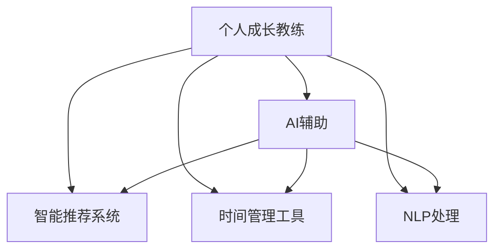

                 

# 数字化自我实现助手开发者：AI辅助的个人成长教练设计师

## 1. 背景介绍

### 1.1 问题由来
在现代社会，人们面临着前所未有的工作和生活压力。如何在繁重的工作和生活中的找到平衡，实现个人成长和自我实现，成为了许多人的追求。数字化自我实现助手（Digital Self-Actualization Assistant, DSA）利用人工智能（AI）技术，为个人提供全方位的成长指导、心理健康支持、学习资源推荐等，帮助用户有效管理时间、提升自我认知和自我管理能力，实现个人成长。

### 1.2 问题核心关键点
DSA的开发涉及到多个关键技术，包括自然语言处理（NLP）、机器学习（ML）、推荐系统、时间管理、心理辅导等。其中，AI辅助的个人成长教练设计是大数据自我实现助手的核心技术之一，其目的是通过AI技术，为个人提供个性化的成长建议、目标设定和行为辅导，帮助用户实现自我实现。

## 2. 核心概念与联系

### 2.1 核心概念概述

为更好地理解基于AI的个人成长教练设计方法，本节将介绍几个密切相关的核心概念：

- 个人成长教练（Personal Growth Coach, PGC）：利用心理学、教育学、行为科学等领域的知识，结合AI技术，为个人提供全方位的成长指导。
- AI辅助个人成长：将人工智能技术应用于个人成长领域，自动收集用户数据，进行分析和推荐，提供个性化建议。
- 智能推荐系统：基于用户的历史行为和偏好，自动推荐相关的学习资源、书籍、课程、工具等，以促进个人成长。
- 自然语言处理（NLP）：使计算机能够理解、处理和生成人类语言的技术，是DSA中关键的一环。
- 时间管理工具：帮助用户合理安排时间，提升时间利用效率，是DSA的重要功能模块。

这些核心概念之间的逻辑关系可以通过以下Mermaid流程图来展示：



这个流程图展示了个体成长教练与DSA中其他关键模块的紧密联系，这些模块共同构成了一个全方位的、智能化的个人成长支持系统。

## 3. 核心算法原理 & 具体操作步骤

### 3.1 算法原理概述

AI辅助的个人成长教练设计基于监督学习和迁移学习的原理。其核心思想是：通过分析用户的历史数据和行为特征，学习到用户的个性偏好和成长需求，再通过迁移学习将这些知识应用到新的场景中，为不同用户提供个性化的建议和指导。

具体来说，DSA中的AI教练设计包括以下几个步骤：

1. **数据收集与预处理**：收集用户的活动日志、社交网络互动、学习历史等数据，并进行清洗和标准化处理。
2. **特征提取与选择**：从处理后的数据中提取用户的行为特征，如学习时间、学习习惯、兴趣爱好等，并选择对成长效果影响较大的特征进行建模。
3. **模型训练与评估**：使用监督学习算法（如随机森林、梯度提升树等）对用户的行为特征进行建模，并根据预测结果与实际效果的差异进行模型评估。
4. **个性化推荐**：基于训练好的模型，对不同用户的行为特征进行预测，生成个性化的成长建议和学习资源推荐。

### 3.2 算法步骤详解

#### 3.2.1 数据收集与预处理
1. **数据来源**：
   - 活动日志：记录用户的操作行为，如浏览网页、观看视频、读书等。
   - 社交网络互动：记录用户在社交媒体上的互动信息，如点赞、评论、分享等。
   - 学习历史：记录用户的在线学习行为，如观看课程、阅读文章、完成作业等。
2. **数据清洗**：
   - 去除无效数据：如缺失值、噪声数据等。
   - 数据标准化：如日期格式化、字符串统一等。
   - 数据集成：将不同来源的数据进行整合，构建统一的数据视图。

#### 3.2.2 特征提取与选择
1. **特征类型**：
   - 行为特征：学习时长、学习频率、书籍阅读量等。
   - 情感特征：情绪变化、心理状态等。
   - 兴趣爱好特征：喜好主题、偏好内容等。
2. **特征选择方法**：
   - 主成分分析（PCA）：将高维数据降维，保留主要特征。
   - 特征重要性分析：如信息增益、卡方检验等，选择对目标变量影响较大的特征。

#### 3.2.3 模型训练与评估
1. **算法选择**：
   - 随机森林（Random Forest）：基于决策树算法，能够处理高维数据和非线性关系。
   - 梯度提升树（Gradient Boosting Trees）：通过迭代优化，逐步提高模型准确率。
2. **模型训练**：
   - 数据划分：将数据集分为训练集、验证集和测试集。
   - 交叉验证：使用K折交叉验证，评估模型的泛化能力。
   - 参数调优：使用网格搜索或贝叶斯优化，调整模型参数，优化性能。

#### 3.2.4 个性化推荐
1. **推荐算法**：
   - 协同过滤（Collaborative Filtering）：根据用户和物品的相似度，推荐相关物品。
   - 矩阵分解（Matrix Factorization）：将用户行为数据分解为低维空间中的用户-物品矩阵，进行推荐。
2. **推荐流程**：
   - 输入用户行为特征。
   - 使用训练好的模型进行预测。
   - 从预测结果中选择推荐的物品或资源。

### 3.3 算法优缺点

AI辅助的个人成长教练设计具有以下优点：
1. **个性化推荐**：能够根据用户的个性化需求，提供定制化的成长建议和学习资源推荐。
2. **动态调整**：能够实时分析用户的行为变化，动态调整推荐策略。
3. **节省时间**：用户不必亲自筛选资源，节省了时间成本。
4. **全面覆盖**：覆盖了学习、工作、生活等多个方面的成长指导。

同时，该方法也存在一些缺点：
1. **数据隐私问题**：收集和分析用户数据可能引发隐私问题。
2. **模型泛化能力**：模型对新用户的泛化能力可能不足，导致推荐效果不佳。
3. **计算资源消耗**：模型训练和推荐过程需要较大的计算资源，对设备性能要求较高。

尽管存在这些缺点，但就目前而言，AI辅助的个人成长教练设计仍是大数据自我实现助手的核心技术之一，为用户的个性化成长提供了强有力的支持。

### 3.4 算法应用领域

基于AI的个人成长教练设计技术，已经在多个领域得到了应用：

- **在线教育**：为学生提供个性化的学习资源推荐，提升学习效果。
- **职业发展**：为职场人士提供职业规划、技能提升等建议，帮助其职业成长。
- **心理健康**：为需要心理支持的用户提供情绪分析、压力管理等建议，提升心理健康水平。
- **时间管理**：帮助用户合理安排时间，提高时间利用效率。
- **兴趣爱好培养**：推荐相关书籍、课程、活动，帮助用户发现并培养兴趣爱好。

此外，AI教练设计技术还应用于智能家居、健康管理等多个领域，为用户的日常生活提供了全方位的智能支持。

## 4. 数学模型和公式 & 详细讲解 & 举例说明

### 4.1 数学模型构建

在DSA中，AI教练设计模型的构建包括数据收集、特征提取、模型训练和个性化推荐等多个环节。以下以协同过滤算法为例，给出其数学模型的构建过程。

设用户集合为 $U$，物品集合为 $I$，用户对物品的评分矩阵为 $R_{ij}$。协同过滤算法通过分析用户之间的相似度，预测用户对新物品的评分。设用户 $u$ 和 $v$ 之间的相似度为 $s_{uv}$，基于用户 $v$ 对物品 $i$ 的评分预测用户 $u$ 对物品 $i$ 的评分，公式如下：

$$
\hat{R}_{iu} = \sum_{v \in U} s_{uv}R_{iv}
$$

### 4.2 公式推导过程

#### 4.2.1 用户相似度计算
1. **余弦相似度**：
   $$
   s_{uv} = \cos(\theta) = \frac{\sum_{j=1}^{n} (R_{uj}R_{vj})}{\sqrt{\sum_{j=1}^{n} R_{uj}^2}\sqrt{\sum_{j=1}^{n} R_{vj}^2}}
   $$
   其中，$\theta$ 为夹角。

#### 4.2.2 评分预测
1. **平均评分**：
   $$
   \bar{R}_{iu} = \frac{1}{N} \sum_{v \in U} s_{uv}R_{iv}
   $$

### 4.3 案例分析与讲解

假设用户 $u$ 对物品 $i$ 的实际评分为 $R_{iu}=4$，用户 $v$ 对物品 $i$ 的评分为 $R_{iv}=5$。设用户 $u$ 和 $v$ 的相似度为 $s_{uv}=0.8$，则根据公式 $\hat{R}_{iu}$ 的计算过程如下：

1. **计算用户 $u$ 和 $v$ 的余弦相似度**：
   $$
   s_{uv} = \cos(\theta) = \frac{4 \times 5}{\sqrt{4^2} \sqrt{5^2}} = 0.8
   $$
2. **计算用户 $u$ 对物品 $i$ 的预测评分**：
   $$
   \hat{R}_{iu} = 0.8 \times 5 = 4
   $$

## 5. 项目实践：代码实例和详细解释说明

### 5.1 开发环境搭建

在进行AI教练设计项目实践前，我们需要准备好开发环境。以下是使用Python进行Scikit-learn开发的环境配置流程：

1. 安装Anaconda：从官网下载并安装Anaconda，用于创建独立的Python环境。

2. 创建并激活虚拟环境：
```bash
conda create -n ai-coach-env python=3.8 
conda activate ai-coach-env
```

3. 安装Scikit-learn：
```bash
pip install scikit-learn
```

4. 安装其他工具包：
```bash
pip install pandas numpy matplotlib seaborn sklearn tqdm
```

完成上述步骤后，即可在`ai-coach-env`环境中开始项目实践。

### 5.2 源代码详细实现

以下是使用Scikit-learn实现协同过滤算法的示例代码：

```python
from sklearn.metrics.pairwise import cosine_similarity
from sklearn.decomposition import TruncatedSVD
from sklearn.impute import SimpleImputer
import pandas as pd
import numpy as np

# 数据准备
data = pd.read_csv('user_item_ratings.csv')
data.fillna(0, inplace=True)

# 数据预处理
item_idx = data['item_id'].unique()
user_idx = data['user_id'].unique()
train_data = data[data['rating'] > 0].drop_duplicates()

# 数据标准化
mean = train_data.groupby('item_id').mean()
train_data['rating'] -= mean

# 协同过滤
svd = TruncatedSVD(n_components=100, random_state=0)
X = svd.fit_transform(train_data.pivot_table('rating', 'user_id', 'item_id'))
U = svd.components_

# 计算用户相似度
similarity_matrix = cosine_similarity(U)

# 预测评分
def predict_score(user_id, item_id):
    user_row = similarity_matrix[user_idx.index(user_id), :]
    predicted_score = np.dot(user_row, U[item_idx.index(item_id)])
    return predicted_score / np.linalg.norm(user_row)

# 测试
test_user = 'user1'
test_item = 'item2'
predicted_score = predict_score(test_user, test_item)
print(f"预测用户 {test_user} 对物品 {test_item} 的评分: {predicted_score}")
```

### 5.3 代码解读与分析

让我们再详细解读一下关键代码的实现细节：

**数据准备**：
- 使用`pandas`读取用户-物品评分数据，并填充缺失值。
- 获取物品和用户集合的索引。
- 过滤掉评分小于等于0的数据，确保训练集的完整性。

**数据标准化**：
- 使用`pandas`对评分数据进行标准化处理，使数据符合协同过滤算法的要求。

**协同过滤**：
- 使用`TruncatedSVD`对用户-物品评分矩阵进行降维，得到低维空间中的用户表示和物品表示。
- 使用`cosine_similarity`计算用户之间的余弦相似度。

**评分预测**：
- `predict_score`函数接收用户ID和物品ID，通过余弦相似度计算预测评分。
- 返回预测评分，以便进行后续的推荐。

**测试**：
- 对用户1和物品2的评分进行预测，输出预测结果。

可以看到，Scikit-learn提供了强大的机器学习库，使得协同过滤算法的实现变得简洁高效。开发者可以将更多精力放在数据处理、模型优化等高层逻辑上，而不必过多关注底层的实现细节。

## 6. 实际应用场景

### 6.1 在线教育平台
在线教育平台可以使用AI教练设计技术，为学生提供个性化的学习资源推荐，提升学习效果。通过对学生的学习行为、成绩和兴趣进行分析，AI教练可以为每个学生定制推荐方案，帮助其克服学习难题，提升学习动力。

例如，某在线教育平台可以使用协同过滤算法，根据学生的历史学习数据和行为特征，推荐相关的课程、视频和习题。同时，AI教练还可以根据学生的情绪状态和学习进展，动态调整推荐策略，帮助学生保持学习兴趣和动力。

### 6.2 职业发展指导
职业发展指导领域可以应用AI教练设计技术，为职场人士提供职业规划、技能提升等建议，帮助其职业成长。通过对员工的历史工作记录、技能评估和职业兴趣进行分析，AI教练可以生成个性化的职业发展建议，帮助员工制定发展计划，提升职业技能。

例如，某人力资源公司可以使用协同过滤算法，根据员工的历史工作记录和技能评估，推荐相关培训课程和职业机会。同时，AI教练还可以根据员工的情绪状态和职业进展，动态调整推荐策略，帮助员工更好地实现职业目标。

### 6.3 心理健康支持
心理健康领域可以应用AI教练设计技术，为需要心理支持的用户提供情绪分析、压力管理等建议，提升心理健康水平。通过对用户的情绪变化和心理健康状况进行分析，AI教练可以生成个性化的心理健康建议，帮助用户缓解压力和焦虑。

例如，某心理健康平台可以使用协同过滤算法，根据用户的历史情绪记录和心理健康数据，推荐相关情绪调节技巧和心理辅导课程。同时，AI教练还可以根据用户的情绪状态和心理健康状况，动态调整推荐策略，帮助用户更好地管理心理健康。

### 6.4 时间管理工具
时间管理领域可以应用AI教练设计技术，帮助用户合理安排时间，提高时间利用效率。通过对用户的时间使用情况和学习行为进行分析，AI教练可以生成个性化的时间管理方案，帮助用户优化时间安排。

例如，某时间管理应用可以使用协同过滤算法，根据用户的历史时间记录和学习行为，推荐相关时间管理策略和学习计划。同时，AI教练还可以根据用户的时间安排和学习进展，动态调整推荐策略，帮助用户更好地实现时间管理目标。

## 7. 工具和资源推荐

### 7.1 学习资源推荐

为了帮助开发者系统掌握AI教练设计的理论基础和实践技巧，这里推荐一些优质的学习资源：

1. 《Python机器学习实战》系列书籍：由知名数据科学家撰写，涵盖机器学习、深度学习、推荐系统等多个主题，适合深入学习。

2. 《机器学习实战》课程：Coursera上由斯坦福大学教授Andrew Ng开设的机器学习课程，系统讲解了机器学习的基本概念和算法。

3. 《推荐系统实践》书籍：李航著，全面介绍了推荐系统的设计、实现和评估方法，适合实用开发。

4. 《深度学习与自然语言处理》课程：DeepLearning.AI开发的深度学习课程，涵盖深度学习、自然语言处理等多个主题，适合系统学习。

5. Scikit-learn官方文档：Scikit-learn的官方文档，提供了丰富的机器学习算法和工具，是实用开发的必备资源。

通过对这些资源的学习实践，相信你一定能够快速掌握AI教练设计的精髓，并用于解决实际的AI辅助个人成长问题。

### 7.2 开发工具推荐

高效的开发离不开优秀的工具支持。以下是几款用于AI教练设计开发的常用工具：

1. Python：作为AI领域的主流编程语言，Python具有丰富的第三方库和工具，适合AI应用开发。

2. Scikit-learn：基于Python的开源机器学习库，提供了丰富的算法和工具，适合快速迭代研究。

3. TensorFlow：由Google主导开发的开源深度学习框架，生产部署方便，适合大规模工程应用。

4. PyTorch：基于Python的开源深度学习框架，灵活动态的计算图，适合快速迭代研究。

5. Jupyter Notebook：交互式编程环境，支持代码编写、数据分析和可视化，适合研究和分享。

6. VS Code：轻量级、高性能的代码编辑器，支持多种编程语言和扩展，适合开发和调试。

合理利用这些工具，可以显著提升AI教练设计任务的开发效率，加快创新迭代的步伐。

### 7.3 相关论文推荐

AI教练设计技术的发展源于学界的持续研究。以下是几篇奠基性的相关论文，推荐阅读：

1. "Collaborative Filtering for Implicit Feedback Datasets"：提出了协同过滤算法的经典模型，广泛应用于推荐系统。

2. "Matrix Factorization Techniques for Recommender Systems"：系统介绍了矩阵分解算法，对推荐系统的设计和优化具有重要意义。

3. "Personalized Recommendation Algorithms: A Survey and Experimental Evaluation"：综述了多种推荐算法，并进行了实验对比，适合全面了解推荐系统的实现和评估。

4. "Adaptive Collaborative Filtering Using Matrix Factorization Techniques"：提出了自适应协同过滤算法，提高了推荐系统的性能和稳定性。

5. "A Collaborative Filtering Recommendation Algorithm for E-Commerce Web Sites"：介绍了基于协同过滤的推荐算法在电子商务网站中的应用。

这些论文代表了大数据自我实现助手的核心技术的发展脉络。通过学习这些前沿成果，可以帮助研究者把握学科前进方向，激发更多的创新灵感。

## 8. 总结：未来发展趋势与挑战

### 8.1 总结

本文对基于AI的个人成长教练设计方法进行了全面系统的介绍。首先阐述了AI辅助个人成长教练设计的研究背景和意义，明确了AI教练在帮助用户实现自我实现方面的独特价值。其次，从原理到实践，详细讲解了AI教练设计的数学模型和算法步骤，给出了详细的代码实例。同时，本文还广泛探讨了AI教练设计在多个行业领域的应用前景，展示了AI教练设计的广泛应用价值。此外，本文精选了AI教练设计的各类学习资源，力求为读者提供全方位的技术指引。

通过本文的系统梳理，可以看到，AI辅助个人成长教练设计正在成为数字化自我实现助手的核心技术之一，为用户的个性化成长提供了强有力的支持。未来，伴随AI技术和数据科学的发展，AI教练设计技术必将不断完善和优化，为用户的全面成长提供更加智能、个性化的支持。

### 8.2 未来发展趋势

展望未来，AI辅助个人成长教练设计技术将呈现以下几个发展趋势：

1. **多模态数据融合**：结合多种数据源（如生理信号、社交网络数据、位置数据等），提供更全面、多维度的个性化成长建议。
2. **智能交互**：引入自然语言处理技术，使AI教练能够与用户进行自然对话，提供更直接、个性化的反馈和建议。
3. **自我反思能力**：开发具备自我反思能力的AI教练，使用户能够通过自述和自问，进行自我反思和自我评估。
4. **跨平台集成**：使AI教练能够跨多个平台（如手机、电脑、智能家居等）无缝集成，提供全方位的个性化服务。
5. **隐私保护**：开发隐私保护技术，确保用户数据的安全和隐私，提升用户信任度。

以上趋势凸显了AI教练设计技术的广阔前景。这些方向的探索发展，必将进一步提升AI教练设计的智能化、个性化和安全性，为用户的全面成长提供更全面的支持。

### 8.3 面临的挑战

尽管AI辅助个人成长教练设计技术已经取得了一定的进展，但在迈向更加智能化、普适化应用的过程中，它仍面临着诸多挑战：

1. **数据隐私问题**：收集和分析用户数据可能引发隐私问题，如何确保数据安全和隐私保护，将是重要的研究课题。
2. **模型泛化能力**：模型对新用户的泛化能力可能不足，导致推荐效果不佳，如何提高模型的泛化能力，是亟待解决的难题。
3. **计算资源消耗**：模型训练和推荐过程需要较大的计算资源，对设备性能要求较高，如何降低计算成本，提高系统效率，将是一大挑战。
4. **用户体验**：如何提升用户体验，使AI教练能够真正融入用户的日常生活，并获得用户的信任，是重要的研究方向。

尽管存在这些挑战，但AI教练设计技术的发展前景广阔，随着技术的不断进步和优化，这些问题终将逐步得到解决。相信在学界和产业界的共同努力下，AI辅助个人成长教练设计技术必将不断完善，为用户的全面成长提供更加智能、个性化的支持。

### 8.4 研究展望

未来，AI辅助个人成长教练设计技术的研究方向将集中在以下几个方面：

1. **跨领域融合**：结合心理学、教育学、行为科学等领域，开发更全面、更深入的AI教练模型。
2. **人机协同**：探索人机协同的工作机制，使AI教练能够与人类专家协同工作，提升系统决策的准确性和可信度。
3. **自我进化**：开发具备自我进化能力的AI教练，使其能够不断学习新的知识和技能，保持系统的更新和优化。
4. **伦理与安全**：研究AI教练的伦理与安全问题，确保系统的公正性、透明性和安全性。
5. **社会责任**：探讨AI教练在社会责任方面的应用，如何帮助用户实现社会价值，提升社会幸福感。

这些研究方向将推动AI教练设计技术不断进步，为用户的全面成长提供更智能、更安全、更可靠的AI支持。

## 9. 附录：常见问题与解答

**Q1：如何实现多模态数据融合？**

A: 多模态数据融合可以通过以下方法实现：
1. **数据对齐**：将不同模态的数据进行对齐，如时间对齐、空间对齐等。
2. **特征融合**：将不同模态的数据进行特征融合，如基于深度学习的方法（如CNN、RNN等），将不同模态的信息进行融合。
3. **联合建模**：将不同模态的数据作为联合训练的目标，构建联合模型，提升模型的性能。

例如，某智能健身应用可以使用多模态数据融合技术，结合用户的生理信号、社交网络数据、位置数据等多种数据源，提供个性化的健身建议和目标规划。

**Q2：如何提高AI教练的智能交互能力？**

A: 提高AI教练的智能交互能力可以通过以下方法实现：
1. **自然语言处理**：使用NLP技术，使AI教练能够理解用户的自然语言输入，进行智能回复和建议。
2. **对话系统**：开发智能对话系统，使用户能够与AI教练进行自然对话，获得个性化的反馈和建议。
3. **上下文感知**：使AI教练能够理解和记忆上下文信息，提升对话的自然度和连贯性。

例如，某智能助手可以使用NLP技术，实现与用户的自然对话，提供个性化的建议和反馈。

**Q3：如何保护用户数据隐私？**

A: 保护用户数据隐私可以通过以下方法实现：
1. **数据匿名化**：对用户数据进行匿名化处理，确保数据无法被识别。
2. **差分隐私**：使用差分隐私技术，在数据统计和分析过程中加入噪声，保护用户隐私。
3. **联邦学习**：使用联邦学习技术，在本地设备上进行模型训练，避免数据集中存储和传输。

例如，某智能健身应用可以使用差分隐私技术，在数据统计和分析过程中加入噪声，保护用户隐私。

**Q4：如何提高AI教练的泛化能力？**

A: 提高AI教练的泛化能力可以通过以下方法实现：
1. **模型优化**：优化模型的结构和参数，提高模型的泛化能力。
2. **数据增强**：使用数据增强技术，扩充训练集的多样性，提升模型的泛化能力。
3. **迁移学习**：使用迁移学习技术，将预训练模型迁移到目标任务中，提升模型的泛化能力。

例如，某智能助手可以使用迁移学习技术，将预训练模型迁移到新的任务中，提升模型的泛化能力。

**Q5：如何提高AI教练的计算效率？**

A: 提高AI教练的计算效率可以通过以下方法实现：
1. **模型压缩**：使用模型压缩技术，如剪枝、量化等，减小模型的参数量和计算量。
2. **分布式训练**：使用分布式训练技术，将训练任务分配到多个设备上进行并行计算，提高计算效率。
3. **硬件优化**：使用硬件加速技术，如GPU、TPU等，提高计算效率。

例如，某智能健身应用可以使用模型压缩技术，减小模型的参数量和计算量，提高计算效率。

---

作者：禅与计算机程序设计艺术 / Zen and the Art of Computer Programming

