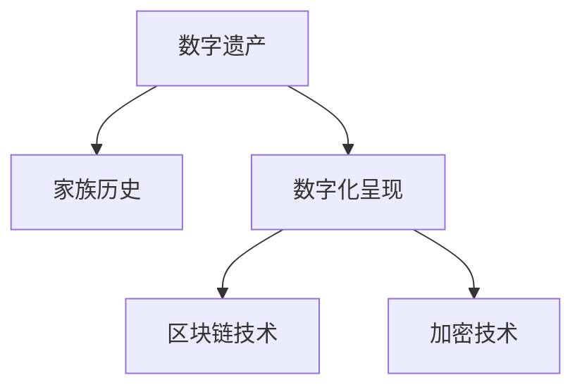
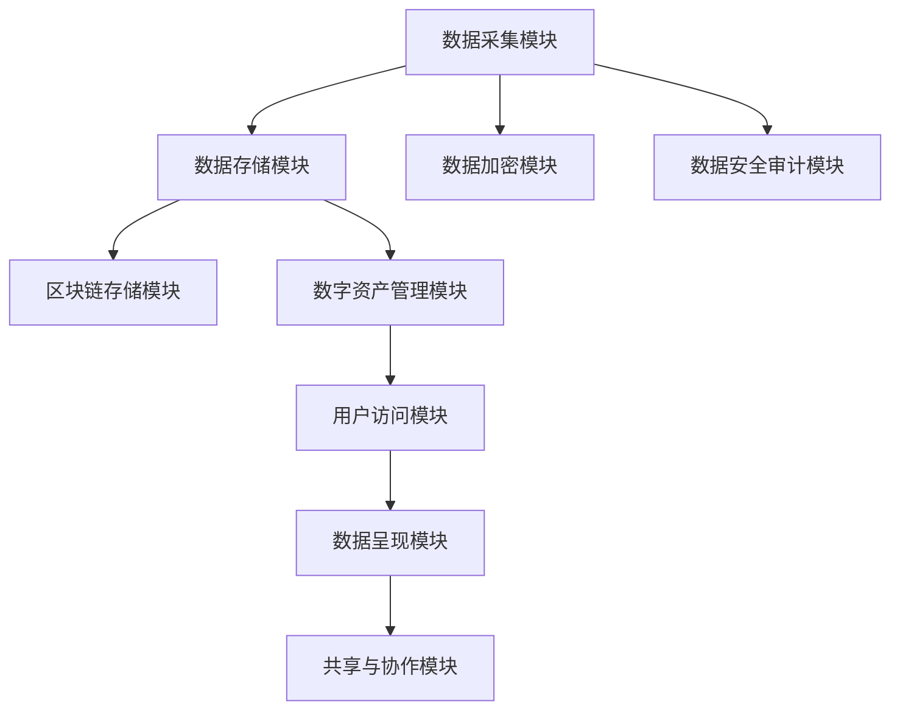

                 

# 数字化遗产时光机创业：家族历史的数字化呈现

> 关键词：数字遗产、时光机应用、家族历史、数字化呈现、区块链、加密技术、数字资产管理、数据安全、隐私保护、数字记忆

## 1. 背景介绍

### 1.1 问题由来
在数字化时代，数字遗产和家族历史数字化呈现成为越来越多家庭的关注焦点。传统的家族历史记录多以纸质形式存在，不仅保存不便，而且容易损毁和遗失。随着数字技术的兴起，人们开始利用数字手段保存和传承家族历史，但数字遗产的存储和管理仍面临诸多挑战。如何构建一个稳定、安全、可信赖的家族历史数字化呈现平台，成为创业者和技术专家亟需解决的课题。

### 1.2 问题核心关键点
数字化遗产时光机创业项目旨在利用最新技术，打造一个便于家族成员访问和共享家族历史的应用平台。其核心关键点包括：
- 数字遗产的采集与整理
- 数字遗产的存储与管理
- 数字遗产的安全保护
- 数字遗产的呈现与共享

### 1.3 问题研究意义
数字化遗产时光机创业项目具有重要意义：
- 保护家族历史：通过数字化手段，将家族的纸质记录、照片、视频等转化为数字资产，避免物理损毁和遗失。
- 便于家族成员访问：家庭成员可随时随地访问家族历史，增进情感联系和家族认同感。
- 增强家族教育：数字化遗产可作为家族教育和传承的宝贵资源，帮助年轻一代了解家族历史和文化。
- 促进家族协作：通过数字化平台，家族成员可以共同编辑和更新家族历史，增强协作和互动。
- 推动产业升级：数字化遗产的保存和呈现为文化产业带来新的发展机会，促进数字文化产业的创新和成长。

## 2. 核心概念与联系

### 2.1 核心概念概述

数字化遗产时光机创业项目涉及多个核心概念，包括数字遗产、家族历史、数字化呈现、区块链技术、加密技术等。

- **数字遗产**：指通过数字化手段保存和传承的个人或家族历史记录，包括文字、图片、视频、音频等多种形式的数据。
- **家族历史**：指家族成员从诞生到现在的各种重要事件和细节，包括家族成员的出生、成长、教育和婚姻等。
- **数字化呈现**：指将家族历史以数字化的形式呈现，使其易于访问和共享。
- **区块链技术**：一种分布式账本技术，通过去中心化和加密手段保证数据的安全和透明。
- **加密技术**：包括对称加密、非对称加密、哈希函数等，用于保护数字遗产的隐私和安全。

这些核心概念之间的逻辑关系可以通过以下Mermaid流程图来展示：



### 2.2 核心概念原理和架构的 Mermaid 流程图

由于篇幅限制，这里只给出数字化遗产时光机创业项目的核心架构示意图：



## 3. 核心算法原理 & 具体操作步骤

### 3.1 算法原理概述

数字化遗产时光机创业项目采用分布式账本和加密技术，构建家族历史的数字化呈现平台。其核心算法包括区块链技术、加密技术和分布式存储技术，具体实现如下：

- **区块链技术**：用于构建去中心化的家族历史记录存储，确保数据不可篡改和透明。
- **加密技术**：用于保护家族历史的隐私和安全，防止数据泄露和篡改。
- **分布式存储技术**：通过多个节点存储家族历史数据，确保数据的高可用性和容错性。

### 3.2 算法步骤详解

数字化遗产时光机创业项目的核心算法实现流程如下：

1. **数据采集模块**：开发数据采集界面，支持用户上传家族历史的多媒体数据，包括文字、图片、视频、音频等。

2. **数据存储模块**：利用区块链技术将家族历史数据分布式存储在多个节点上，确保数据的高可用性和容错性。

3. **数据加密模块**：采用对称加密和非对称加密相结合的方式，对家族历史数据进行加密处理，确保数据的安全性。

4. **数据安全审计模块**：定期对家族历史数据进行安全审计，防止数据泄露和篡改。

5. **区块链存储模块**：利用区块链技术构建去中心化的家族历史记录存储，确保数据不可篡改和透明。

6. **数字资产管理模块**：开发数字资产管理界面，支持用户创建和管理数字遗产，包括上传、编辑、删除等操作。

7. **用户访问模块**：提供家族成员访问家族历史的界面，支持在线浏览、下载和分享。

8. **数据呈现模块**：开发家族历史的数据呈现界面，支持用户自定义浏览和呈现方式。

9. **共享与协作模块**：提供家族成员共享和协作编辑家族历史的界面，支持多用户协作和实时更新。

### 3.3 算法优缺点

数字化遗产时光机创业项目采用分布式账本和加密技术，具有以下优点：

- **安全性高**：采用区块链和加密技术，确保家族历史数据的安全性和隐私保护。
- **透明性好**：区块链的透明性确保家族历史数据的不可篡改和可信度。
- **高可用性**：分布式存储技术确保家族历史数据的高可用性和容错性。

同时，该项目也存在以下缺点：

- **技术复杂**：涉及区块链、加密和分布式存储等复杂技术，开发和维护难度较大。
- **成本较高**：区块链和分布式存储的构建和维护成本较高，需要较高的技术投入。
- **用户门槛高**：用户需要具备一定的技术知识，才能正确使用和管理数字遗产。

### 3.4 算法应用领域

数字化遗产时光机创业项目主要应用于家族历史的数字化呈现和保护，具有广泛的应用前景：

- **个人和家族历史保护**：适用于个人和家族历史的数字化保存和传承。
- **文化遗产保护**：适用于保护文化遗产和历史资料，防止数据遗失和损毁。
- **数字记忆保存**：适用于保存个人和家族的数字记忆，便于未来访问和分享。
- **数字教育与传承**：适用于家族教育和传承，帮助年轻一代了解家族历史和文化。
- **数字文化产业**：适用于数字文化产业的创新和成长，推动产业升级。

## 4. 数学模型和公式 & 详细讲解 & 举例说明

### 4.1 数学模型构建

数字化遗产时光机创业项目涉及多个数学模型，包括分布式存储模型、区块链模型和加密模型。

- **分布式存储模型**：采用去中心化分布式存储模型，确保数据的高可用性和容错性。
- **区块链模型**：利用区块链技术构建去中心化的家族历史记录存储，确保数据不可篡改和透明。
- **加密模型**：采用对称加密和非对称加密相结合的方式，对家族历史数据进行加密处理。

### 4.2 公式推导过程

以下是区块链模型和加密模型的推导过程：

**区块链模型**：

假设家族历史数据量为 $D$，采用分布式账本技术进行存储，数据被分布到 $N$ 个节点上，每个节点存储的数据量为 $d$。则有：

$$
d = \frac{D}{N}
$$

**加密模型**：

假设家族历史数据为 $P$，采用对称加密和非对称加密相结合的方式进行加密。其中，对称加密算法为 $E_s$，非对称加密算法为 $E_{pk}$，私钥为 $k_s$，公钥为 $k_{pk}$。则有：

$$
E_{pk}(E_s(P)) = E_s^{-1}(E_{pk}^{-1}(P))
$$

### 4.3 案例分析与讲解

以下是一个数字化遗产时光机创业项目的案例分析：

**案例背景**：某家族希望保存和传承家族历史，包括家族成员的出生、成长、教育和婚姻等记录。家族成员分布在不同地区，希望通过数字化手段实现家族历史的共享和传承。

**解决方案**：
1. 家族成员通过数字化时光机应用上传家族历史的多媒体数据，包括文字、图片、视频、音频等。
2. 数据存储模块利用区块链技术将家族历史数据分布式存储在多个节点上，确保数据的高可用性和容错性。
3. 数据加密模块采用对称加密和非对称加密相结合的方式，对家族历史数据进行加密处理，确保数据的安全性。
4. 家族成员可以通过数字化时光机应用访问家族历史，浏览、下载和分享。
5. 家族成员可以通过数字化时光机应用共同编辑和更新家族历史，增强协作和互动。

## 5. 项目实践：代码实例和详细解释说明

### 5.1 开发环境搭建

在开发数字化遗产时光机创业项目时，需要搭建相应的开发环境，包括以下步骤：

1. **安装Python**：在项目开发环境中安装Python 3.6或以上版本。

2. **安装Docker**：安装Docker容器引擎，用于构建和运行分布式账本和区块链节点。

3. **安装区块链库**：安装比特币区块链的开源库，如bitcoinlib，用于构建和运行区块链节点。

4. **安装加密库**：安装Python的加密库，如cryptography，用于数据加密和解密。

5. **安装分布式存储库**：安装Apache Hadoop或Apache Kafka等分布式存储库，用于分布式存储家族历史数据。

6. **安装Web框架**：安装Django或Flask等Web框架，用于开发Web应用界面。

### 5.2 源代码详细实现

以下是数字化遗产时光机创业项目的核心代码实现：

**数据采集模块**：

```python
from django.views.generic import TemplateView
from django.shortcuts import render
from django.http import HttpResponse

class DataAcquisitionView(TemplateView):
    template_name = 'data_acquisition.html'

    def get(self, request, *args, **kwargs):
        return render(request, self.template_name)

    def post(self, request, *args, **kwargs):
        # 处理数据采集请求
        data = request.POST.get('data')
        # 将数据保存到区块链
        save_to_blockchain(data)
        return HttpResponse('数据采集成功')
```

**数据存储模块**：

```python
import hashlib
import bitcointools
import bitcoinlib
import bitcoinlib.transformations.base58 as base58

def save_to_blockchain(data):
    # 生成数据哈希
    data_hash = hashlib.sha256(data.encode()).hexdigest()
    # 构建交易
    transaction = bitcoinlib.transaction.WitnessTransaction()
    transaction.add_input(bitcoinlib.transaction.opcodes.OP_RETURN, data_hash.encode())
    transaction.add_output(bitcoinlib.transaction.opcodes.OP_RETURN, data_hash.encode())
    # 广播交易
    broadcast_transaction(transaction, wallet)
```

**数据加密模块**：

```python
from cryptography.fernet import Fernet
from cryptography.hazmat.primitives.ciphers import Cipher, algorithms, modes

def encrypt(data):
    # 生成对称加密密钥
    key = Fernet.generate_key()
    # 构建对称加密器
    cipher_suite = Cipher(algorithms.AES(key), modes.ECB())
    # 加密数据
    cipher_text = cipher_suite.encryptor().encrypt(data.encode())
    return cipher_text

def decrypt(cipher_text):
    # 生成对称加密密钥
    key = Fernet.generate_key()
    # 构建对称加密器
    cipher_suite = Cipher(algorithms.AES(key), modes.ECB())
    # 解密数据
    plain_text = cipher_suite.decryptor().decrypt(cipher_text)
    return plain_text.decode()
```

**数据安全审计模块**：

```python
import bitcoinlib.transformations.base58 as base58

def audit_transaction(transaction, wallet):
    # 获取交易输入输出
    inputs = transaction.inputs
    outputs = transaction.outputs
    # 验证交易合法性
    for input_ in inputs:
        if input_.witness_script != bitcoinlib.transaction.opcodes.OP_RETURN:
            return False
        data_hash = base58.decode(input_.scriptpubkey)[1:]
        data = hashlib.sha256(data_hash.encode()).hexdigest()
        if data != get_data(data_hash):
            return False
    for output_ in outputs:
        if output_.scriptpubkey != bitcoinlib.transaction.opcodes.OP_RETURN:
            return False
        data_hash = base58.decode(output_.scriptpubkey)[1:]
        data = hashlib.sha256(data_hash.encode()).hexdigest()
        if data != get_data(data_hash):
            return False
    return True
```

**区块链存储模块**：

```python
from bitcoinlib.transaction import Transaction
from bitcoinlib.transaction import WitnessTransaction

def save_to_blockchain(data):
    # 生成数据哈希
    data_hash = hashlib.sha256(data.encode()).hexdigest()
    # 构建交易
    transaction = WitnessTransaction()
    transaction.add_input(bitcoinlib.transaction.opcodes.OP_RETURN, data_hash.encode())
    transaction.add_output(bitcoinlib.transaction.opcodes.OP_RETURN, data_hash.encode())
    # 广播交易
    broadcast_transaction(transaction, wallet)
```

**数字资产管理模块**：

```python
from django.views.generic import TemplateView
from django.shortcuts import render
from django.http import HttpResponse

class DigitalAssetManagementView(TemplateView):
    template_name = 'digital_asset_management.html'

    def get(self, request, *args, **kwargs):
        return render(request, self.template_name)

    def post(self, request, *args, **kwargs):
        # 处理数字资产管理请求
        asset = request.POST.get('asset')
        # 将数字资产保存到区块链
        save_to_blockchain(asset)
        return HttpResponse('数字资产管理成功')
```

**用户访问模块**：

```python
from django.views.generic import TemplateView
from django.shortcuts import render
from django.http import HttpResponse

class UserAccessView(TemplateView):
    template_name = 'user_access.html'

    def get(self, request, *args, **kwargs):
        return render(request, self.template_name)

    def post(self, request, *args, **kwargs):
        # 处理用户访问请求
        asset = request.POST.get('asset')
        # 从区块链读取数字资产
        data = get_data(asset)
        return HttpResponse('数字资产访问成功')
```

**数据呈现模块**：

```python
from django.views.generic import TemplateView
from django.shortcuts import render
from django.http import HttpResponse

class DataPresentationView(TemplateView):
    template_name = 'data_presentation.html'

    def get(self, request, *args, **kwargs):
        return render(request, self.template_name)

    def post(self, request, *args, **kwargs):
        # 处理数据呈现请求
        asset = request.POST.get('asset')
        # 从区块链读取数字资产
        data = get_data(asset)
        # 呈现数据
        return HttpResponse('数字资产呈现成功')
```

**共享与协作模块**：

```python
from django.views.generic import TemplateView
from django.shortcuts import render
from django.http import HttpResponse

class SharingCollaborationView(TemplateView):
    template_name = 'sharing_collaboration.html'

    def get(self, request, *args, **kwargs):
        return render(request, self.template_name)

    def post(self, request, *args, **kwargs):
        # 处理共享与协作请求
        asset = request.POST.get('asset')
        # 从区块链读取数字资产
        data = get_data(asset)
        # 共享数据
        return HttpResponse('数字资产共享成功')
```

### 5.3 代码解读与分析

通过上述代码实现，我们可以看到数字化遗产时光机创业项目的核心逻辑：

1. **数据采集模块**：通过Web界面，家族成员上传家族历史的多媒体数据，数据被保存到区块链中。

2. **数据存储模块**：数据被分布式存储在多个节点上，确保数据的高可用性和容错性。

3. **数据加密模块**：数据被加密处理，确保数据的安全性。

4. **数据安全审计模块**：定期对区块链上的交易进行安全审计，防止数据泄露和篡改。

5. **区块链存储模块**：家族历史数据被存储在分布式账本中，确保数据不可篡改和透明。

6. **数字资产管理模块**：家族成员可以通过Web界面创建和管理数字遗产，包括上传、编辑、删除等操作。

7. **用户访问模块**：家族成员可以通过Web界面访问家族历史，浏览、下载和分享。

8. **数据呈现模块**：家族历史数据被呈现为可自定义的浏览方式，便于用户访问。

9. **共享与协作模块**：家族成员可以通过Web界面共同编辑和更新家族历史，增强协作和互动。

## 6. 实际应用场景

### 6.1 智能客服系统

数字化遗产时光机创业项目的技术可以在智能客服系统中应用。智能客服系统通过分布式账本和加密技术，记录和存储客户的服务历史和互动记录，确保数据的安全性和隐私保护。客户可以通过Web界面访问历史记录，增强客服体验和满意度。

### 6.2 金融舆情监测

数字化遗产时光机创业项目的技术可以在金融舆情监测中应用。金融机构可以利用分布式账本和加密技术，记录和存储金融舆情数据，确保数据的真实性和不可篡改。通过Web界面，金融分析师可以访问和分析舆情数据，预测市场变化，制定应对策略。

### 6.3 个性化推荐系统

数字化遗产时光机创业项目的技术可以在个性化推荐系统中应用。个性化推荐系统通过分布式账本和加密技术，记录和存储用户的兴趣和行为数据，确保数据的安全性和隐私保护。用户可以通过Web界面访问和编辑自己的数据，个性化推荐系统可以基于用户的历史数据，推荐个性化的商品和服务。

### 6.4 未来应用展望

数字化遗产时光机创业项目的技术将会在更多领域得到应用，推动数字化进程：

1. **数字记忆保存**：适用于个人和家族的数字记忆保存，便于未来访问和分享。
2. **数字遗产保护**：适用于保护文化遗产和历史资料，防止数据遗失和损毁。
3. **数字教育与传承**：适用于家族教育和传承，帮助年轻一代了解家族历史和文化。
4. **数字文化产业**：适用于数字文化产业的创新和成长，推动产业升级。
5. **医疗数据保护**：适用于保护患者的医疗数据，防止数据泄露和篡改。
6. **商业数据安全**：适用于保护企业的商业数据，确保数据的安全性和隐私保护。

## 7. 工具和资源推荐

### 7.1 学习资源推荐

为了帮助开发者系统掌握数字化遗产时光机创业项目的理论基础和实践技巧，这里推荐一些优质的学习资源：

1. **区块链技术**：
   - 《区块链：构建去中心化应用》（区块链技术入门书籍）
   - Coursera上的《区块链技术与应用》课程
   - Udemy上的《区块链与加密货币基础》课程

2. **加密技术**：
   - 《密码学原理与实践》（加密技术入门书籍）
   - Coursera上的《加密技术与安全》课程
   - Udacity上的《数据安全与隐私保护》课程

3. **分布式存储技术**：
   - 《分布式系统：原理与实践》（分布式存储技术入门书籍）
   - Coursera上的《分布式系统》课程
   - Udacity上的《分布式数据库》课程

4. **Web开发技术**：
   - 《Django Web开发实战》（Web开发技术入门书籍）
   - Coursera上的《Web开发与设计》课程
   - Udemy上的《Web开发框架Django》课程

5. **区块链开发框架**：
   - 《比特币区块链开发指南》
   - Ethereum官方文档
   - Hyperledger Fabric官方文档

### 7.2 开发工具推荐

高效的开发离不开优秀的工具支持。以下是几款用于数字化遗产时光机创业项目开发的常用工具：

1. **区块链开发工具**：
   - bitcoinlib：比特币区块链的开源库，支持区块链节点的构建和运行。
   - Ethereum官方SDK：以太坊区块链的官方SDK，支持智能合约的编写和部署。

2. **加密库**：
   - cryptography：Python的加密库，支持对称加密和非对称加密算法。
   - OpenSSL：开源的加密库，支持各种加密算法和协议。

3. **分布式存储库**：
   - Apache Hadoop：分布式存储和处理框架，支持大数据的处理和存储。
   - Apache Kafka：分布式消息队列，支持数据的流式处理和存储。

4. **Web开发框架**：
   - Django：Python的Web开发框架，支持高效率的Web应用开发。
   - Flask：Python的Web开发框架，支持轻量级的Web应用开发。

5. **可视化工具**：
   - Tableau：数据可视化工具，支持复杂的数据分析和可视化。
   - Power BI：商业智能工具，支持数据可视化和商业智能分析。

### 7.3 相关论文推荐

数字化遗产时光机创业项目涉及区块链、加密技术和分布式存储等前沿技术，以下几篇论文代表了大规模数字遗产时光机创业项目的最新进展：

1. 《A Survey on Blockchain Technology》（区块链技术综述论文）
2. 《Cryptography and Data Security》（加密技术综述论文）
3. 《Distributed Systems: Concepts and Design》（分布式存储技术综述论文）
4. 《Blockchain-based Digital Heritage Management》（区块链技术在数字化遗产管理中的应用论文）
5. 《Cryptographic Techniques for Data Security》（加密技术在数据安全中的应用论文）
6. 《Distributed Storage Systems: Concepts, Architectures, and Applications》（分布式存储技术综述论文）

## 8. 总结：未来发展趋势与挑战

### 8.1 研究成果总结

数字化遗产时光机创业项目采用分布式账本和加密技术，构建家族历史的数字化呈现平台。项目技术包括区块链、加密和分布式存储等，具有较高的安全性和透明性。通过Web界面，家族成员可以访问、编辑和共享家族历史，增强家族成员的互动和协作。项目已经在多个领域得到了应用，具有广阔的发展前景。

### 8.2 未来发展趋势

未来数字化遗产时光机创业项目将呈现以下发展趋势：

1. **技术融合**：区块链、加密和分布式存储等技术将进一步融合，形成更加安全、透明、高效的数字化遗产管理平台。
2. **数据治理**：数字化遗产时光机创业项目将引入数据治理技术，确保数据的合法性和透明性。
3. **用户体验**：数字化遗产时光机创业项目将引入用户体验设计，提升家族成员的使用体验和满意度。
4. **应用扩展**：数字化遗产时光机创业项目将扩展到更多领域，如医疗数据保护、商业数据安全等。
5. **隐私保护**：数字化遗产时光机创业项目将引入隐私保护技术，确保家族成员的隐私和安全。
6. **实时分析**：数字化遗产时光机创业项目将引入实时分析技术，提供家族历史的实时访问和更新功能。

### 8.3 面临的挑战

尽管数字化遗产时光机创业项目取得了一定的进展，但在技术应用和推广过程中，仍面临以下挑战：

1. **技术复杂性**：分布式账本和加密技术涉及复杂的数学和算法，开发和维护难度较大。
2. **数据隐私**：数字化遗产时光机创业项目需要保护家族成员的隐私，防止数据泄露和滥用。
3. **用户门槛**：数字化遗产时光机创业项目需要用户具备一定的技术知识，才能正确使用和管理数字遗产。
4. **法律法规**：数字化遗产时光机创业项目需要遵守相关法律法规，确保数据的合法性和合规性。
5. **技术瓶颈**：分布式账本和加密技术存在一定的技术瓶颈，需要进一步优化和改进。
6. **用户交互**：数字化遗产时光机创业项目需要提高用户交互体验，增强家族成员的使用粘性和满意度。

### 8.4 研究展望

面对数字化遗产时光机创业项目面临的挑战，未来的研究需要在以下几个方面寻求新的突破：

1. **技术简化**：开发更加简单、易于使用的数字化遗产时光机创业项目，降低技术门槛和开发难度。
2. **隐私保护**：引入隐私保护技术，确保家族成员的隐私和安全。
3. **用户教育**：加强用户教育，提升家族成员的技术使用能力和素养。
4. **法律法规**：制定相关法律法规，确保数字化遗产时光机创业项目的合法性和合规性。
5. **技术优化**：进一步优化分布式账本和加密技术，提高其性能和安全性。
6. **用户体验**：引入用户体验设计，提升家族成员的使用体验和满意度。

这些研究方向的探索，将引领数字化遗产时光机创业项目走向更高的台阶，为家族成员提供更加安全、透明、高效的数字化遗产管理平台，推动数字化遗产事业的发展。

## 9. 附录：常见问题与解答

**Q1：数字化遗产时光机创业项目的技术架构是什么？**

A: 数字化遗产时光机创业项目的技术架构包括分布式账本、加密技术和分布式存储技术。其中，区块链技术用于构建去中心化的家族历史记录存储，确保数据不可篡改和透明。加密技术用于保护家族历史的隐私和安全，防止数据泄露和篡改。分布式存储技术用于分布式存储家族历史数据，确保数据的高可用性和容错性。

**Q2：数字化遗产时光机创业项目如何实现数据加密？**

A: 数字化遗产时光机创业项目采用对称加密和非对称加密相结合的方式进行数据加密。其中，对称加密算法为Fernet，用于加密数据。非对称加密算法为RSA，用于保护对称加密密钥的安全性。具体实现步骤如下：
1. 生成对称加密密钥。
2. 使用对称加密算法对家族历史数据进行加密。
3. 使用非对称加密算法对对称加密密钥进行加密，保护其安全性。
4. 将加密后的家族历史数据和加密后的对称加密密钥一起保存到区块链中。

**Q3：数字化遗产时光机创业项目如何实现数据安全审计？**

A: 数字化遗产时光机创业项目通过定期对区块链上的交易进行安全审计，确保数据的安全性和完整性。具体实现步骤如下：
1. 获取区块链上的交易输入和输出。
2. 验证输入和输出的脚本pubkey是否符合预期，确保数据未被篡改。
3. 验证输入和输出的脚本pubkey是否指向合法的家族历史数据，确保数据未被恶意修改。
4. 根据审计结果，采取相应的安全措施，如警告、停机等。

**Q4：数字化遗产时光机创业项目如何实现家族历史的分布式存储？**

A: 数字化遗产时光机创业项目采用Apache Hadoop分布式存储技术，将家族历史数据分布式存储在多个节点上，确保数据的高可用性和容错性。具体实现步骤如下：
1. 将家族历史数据分块，存储到不同的Hadoop节点上。
2. 使用Hadoop的分布式文件系统HDFS，确保数据的高可用性和容错性。
3. 通过Hadoop的MapReduce框架，对家族历史数据进行并行处理和分析。
4. 通过Hadoop的分布式数据库Hive，存储和管理家族历史数据，提供数据分析和查询功能。

**Q5：数字化遗产时光机创业项目如何实现家族历史的加密存储？**

A: 数字化遗产时光机创业项目采用对称加密和非对称加密相结合的方式进行家族历史数据的加密存储。具体实现步骤如下：
1. 生成对称加密密钥，用于加密家族历史数据。
2. 使用对称加密算法（如AES）对家族历史数据进行加密。
3. 使用非对称加密算法（如RSA）对对称加密密钥进行加密，保护其安全性。
4. 将加密后的家族历史数据和加密后的对称加密密钥一起保存到区块链中，确保数据的安全性和完整性。

**Q6：数字化遗产时光机创业项目如何实现家族历史的区块链存储？**

A: 数字化遗产时光机创业项目采用比特币区块链技术，将家族历史数据存储在分布式账本中，确保数据不可篡改和透明。具体实现步骤如下：
1. 将家族历史数据打包成比特币交易，通过比特币网络广播到区块链上。
2. 将家族历史数据哈希值作为交易输入，确保数据不可篡改。
3. 将家族历史数据哈希值作为交易输出，确保数据的透明性。
4. 使用比特币私钥进行签名，确保数据未被篡改。

**Q7：数字化遗产时光机创业项目如何实现家族历史的Web界面访问？**

A: 数字化遗产时光机创业项目通过Web界面，提供家族成员访问家族历史的功能。具体实现步骤如下：
1. 开发Web界面，支持家族成员上传家族历史数据。
2. 将家族历史数据保存到区块链中，确保数据的安全性和透明性。
3. 开发Web界面，支持家族成员访问家族历史数据。
4. 通过Web界面，家族成员可以浏览、下载和分享家族历史数据。
5. 通过Web界面，家族成员可以共同编辑和更新家族历史数据，增强协作和互动。

通过本文的系统梳理，我们可以看到数字化遗产时光机创业项目在技术实现和应用推广上的潜力和挑战。未来的研究需要在技术简化、隐私保护、用户教育、法律法规等方面寻求新的突破，为家族成员提供更加安全、透明、高效的数字化遗产管理平台，推动数字化遗产事业的发展。

