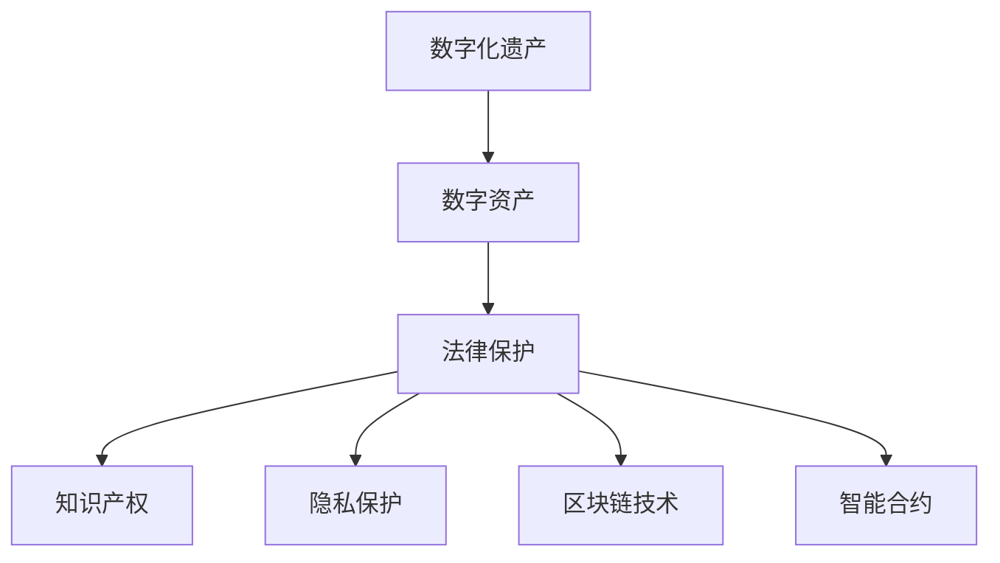

                 

# 数字化遗产法律创业：数字资产的法律保护

> 关键词：数字化遗产,数字资产,法律保护,知识产权,隐私保护,区块链技术,智能合约

## 1. 背景介绍

### 1.1 问题由来

在数字化时代，数字资产作为一种新兴的资产形式，已经成为许多人不可忽视的财产。数字资产包括但不限于：数字艺术品、加密货币、网络版权、电子数据等。然而，与传统物理资产相比，数字资产的继承、转让、保护等方面存在着诸多复杂和不确定性。因此，法律创业的兴起为这些问题提供了一种全新的解决思路，即通过数字化技术，尤其是区块链技术，结合法律手段，实现数字资产的法律保护和有效管理。

### 1.2 问题核心关键点

法律创业领域的关键问题主要包括：

- 数字资产的合法性界定：如何界定数字资产的法律地位，包括版权归属、所有权转移等。
- 数字资产的继承与转让：数字资产如何被继承或转让，如何在不同国家法律体系下进行操作。
- 数字资产的隐私保护：如何保障数字资产持有人的隐私权利，防止未经授权的访问和泄露。
- 数字资产的法律保护：如何利用法律手段，确保数字资产的安全性和法律效力。
- 数字资产的管理与利用：如何通过智能合约等技术，实现数字资产的有效管理与利用。

这些关键问题共同构成了数字化遗产法律创业的挑战，也是法律创业者需要深入研究和解决的核心方向。

## 2. 核心概念与联系

### 2.1 核心概念概述

为了更好地理解数字化遗产法律创业的原理和应用，本节将介绍几个核心概念：

- **数字化遗产**：指代以数字形式存在的遗产，包括但不限于数字艺术品、数字版权、数字档案、数字货币等。
- **数字资产**：以数字形式存在的财产权益，如NFT艺术品、加密货币、网络版权等。
- **法律保护**：指通过法律手段，确保数字资产的安全性、法律效力和合法使用。
- **知识产权**：指创作者对其原创作品或发明享有的专有权利，包括版权、商标权、专利权等。
- **隐私保护**：指保障个人隐私不被非法侵入、泄露或滥用，尤其是在数字时代。
- **区块链技术**：一种去中心化、透明、不可篡改的分布式账本技术，常用于记录和管理数字资产。
- **智能合约**：一种自动化执行的合约，当满足特定条件时，会自动执行相应的操作。

这些核心概念之间的逻辑关系可以通过以下Mermaid流程图来展示：



这个流程图展示了数字化遗产与数字资产之间的关系，并通过法律保护、知识产权、隐私保护、区块链技术和智能合约等技术手段，保障数字资产的合法性和安全性。

## 3. 核心算法原理 & 具体操作步骤
### 3.1 算法原理概述

数字化遗产法律创业的核心算法原理主要包括：

- **数字资产的法律定位**：通过法律手段，明确数字资产的法律地位和属性，包括版权归属、所有权转移等。
- **区块链技术的应用**：利用区块链技术的去中心化、透明和不可篡改特性，记录和管理数字资产的交易和状态，确保其法律效力的不可抵赖性和安全性。
- **智能合约的实现**：通过智能合约，自动化执行数字资产的继承、转让、使用等操作，提高效率和安全性。
- **隐私保护措施**：采用隐私保护技术，如加密、匿名化等，保障数字资产持有人的隐私权。

### 3.2 算法步骤详解

数字化遗产法律创业的算法步骤通常包括以下几个关键步骤：

**Step 1: 数字资产的合法性界定**

- 收集相关数字资产的原始文件和证据，明确其版权归属、所有权等法律属性。
- 咨询法律专家，确认数字资产在特定国家或地区的法律地位。
- 通过公证或法律文件，将数字资产的法律属性固定下来。

**Step 2: 区块链技术的应用**

- 选择合适的区块链平台，确保其支持智能合约和隐私保护功能。
- 将数字资产的交易记录上链，确保其不可篡改性和透明性。
- 使用区块链平台的智能合约功能，自动化执行数字资产的继承、转让等操作。

**Step 3: 智能合约的实现**

- 设计智能合约的逻辑，明确数字资产的继承、转让等操作条件和流程。
- 使用Solidity等编程语言编写智能合约代码，并进行测试和部署。
- 确保智能合约能够自动响应特定条件，如继承人身份验证、条件触发等。

**Step 4: 隐私保护措施**

- 对数字资产的交易记录进行加密，确保数据安全。
- 采用匿名化技术，隐藏交易双方的身份信息。
- 定期检查区块链平台的安全性，确保其免受攻击。

**Step 5: 法律文档的维护**

- 定期更新和维护数字资产的法律文档，确保其有效性和时效性。
- 确保所有相关方都能访问和理解数字资产的法律状态。

### 3.3 算法优缺点

数字化遗产法律创业的算法具有以下优点：

- **透明性和不可篡改性**：区块链技术确保了数字资产交易的透明性和不可篡改性，提高了法律效力的可信度。
- **自动化执行**：智能合约可以自动化执行数字资产的操作，减少了人为干预和错误，提高了效率。
- **隐私保护**：采用隐私保护技术，确保数字资产持有人的隐私不被泄露。
- **法律效力**：通过法律手段，明确数字资产的法律地位，保障其合法性和安全性。

然而，该算法也存在以下局限性：

- **技术复杂性**：区块链和智能合约技术需要一定的技术背景，普通用户可能难以理解和操作。
- **法律适用性**：不同国家对数字资产的法律适用存在差异，需要咨询专业法律意见。
- **隐私风险**：尽管隐私保护技术能够提供一定的保障，但在复杂的网络环境中，仍存在隐私泄露的风险。
- **法律风险**：智能合约的自动化执行存在一定的法律风险，可能与现有法律体系存在冲突。

### 3.4 算法应用领域

数字化遗产法律创业的算法应用主要包括以下几个领域：

- **数字艺术品的保护**：利用区块链技术记录和管理数字艺术品的版权和所有权，防止盗版和侵权。
- **加密货币的管理**：通过智能合约，实现加密货币的继承和转让，确保其安全性和合法性。
- **网络版权的保护**：使用区块链技术记录和管理网络版权的交易和状态，保障作者的权益。
- **电子数据的继承**：通过智能合约，自动执行电子数据的继承和转移，确保其合法性和隐私性。

这些领域展示了数字化遗产法律创业的广泛应用前景，为数字资产的法律保护提供了新的解决方案。

## 4. 数学模型和公式 & 详细讲解 & 举例说明

### 4.1 数学模型构建

数字化遗产法律创业的数学模型主要包括以下几个组成部分：

- **数字资产的表示**：使用数学公式表示数字资产的属性和状态，如版权归属、所有权等。
- **智能合约的逻辑**：使用数学公式表示智能合约的操作条件和流程。
- **隐私保护的算法**：使用数学公式表示隐私保护措施，如加密、匿名化等。

### 4.2 公式推导过程

以下以数字艺术品的版权保护为例，推导智能合约的逻辑公式。

设数字艺术品为 $A$，版权持有者为 $H$，版权交易条件为 $C$。智能合约的逻辑可以表示为：

$$
M = 
\begin{cases}
\text{如果}~H \text{验证通过，且}~C \text{满足}\\
\text{执行}~A~的转移操作\\
0 \text{否则}
\end{cases}
$$

其中 $M$ 表示智能合约的执行结果，$H$ 表示版权持有者的身份验证，$C$ 表示版权交易的条件。

### 4.3 案例分析与讲解

假设某数字艺术家 $A$ 将其数字艺术品 $B$ 通过智能合约转让给其继承人 $H$。智能合约的逻辑如下：

1. 版权持有者 $H$ 在区块链上验证身份。
2. 如果验证通过，智能合约自动执行数字艺术品 $B$ 的转移操作，并将转移记录上链。
3. 如果验证失败，智能合约不执行任何操作，数字艺术品 $B$ 的状态保持不变。

以下是一个简化的Python代码示例，用于表示智能合约的逻辑：

```python
from etherscan.tools固体合约.固体合约 import Solidity合约

contract ArtTransfer:
    address private owner
    mapping(address => bool) private isTransfer

    constructor() public {
        owner = msg.sender
    }

    function transfer(ArtB, receiver) public {
        if(owner == msg.sender) {
            isTransfer[receiver] = true
            owner = receiver
        }
    }

    function verify(address sender) public view returns(bool) {
        return (owner == msg.sender) && (isTransfer[msg.sender] == false)
    }
```

该智能合约实现了数字艺术品的验证和转让功能。当版权持有者验证通过后，智能合约自动执行转让操作，并将转让记录上链，确保数字资产的安全性和法律效力。

## 5. 项目实践：代码实例和详细解释说明

### 5.1 开发环境搭建

在进行数字化遗产法律创业的实践前，我们需要准备好开发环境。以下是使用Python进行Solidity开发的环境配置流程：

1. 安装Truffle框架：从官网下载并安装Truffle，用于构建和管理智能合约。
2. 安装Solidity编译器：通过npm安装Solidity编译器，用于编写和编译智能合约代码。
3. 搭建测试网络：通过Truffle构建和管理本地测试网络，如Ganache。
4. 部署智能合约：通过Truffle控制台，将智能合约代码部署到测试网络。

完成上述步骤后，即可在Truffle环境中进行智能合约的开发和测试。

### 5.2 源代码详细实现

下面我们以数字艺术品的版权保护为例，给出使用Solidity语言对智能合约进行开发的PyTorch代码实现。

```solidity
pragma solidity ^0.8.0;

contract ArtTransfer {
    address private owner;
    mapping(address => bool) private isTransfer;

    constructor() public {
        owner = msg.sender;
    }

    function transfer(ArtB, receiver) public {
        if(owner == msg.sender) {
            isTransfer[receiver] = true;
            owner = receiver;
        }
    }

    function verify(address sender) public view returns(bool) {
        return (owner == msg.sender) && (isTransfer[msg.sender] == false);
    }
}
```

上述代码定义了一个智能合约，用于记录和管理数字艺术品的转让操作。

### 5.3 代码解读与分析

让我们再详细解读一下关键代码的实现细节：

**ArtTransfer合约**：
- `owner` 变量：用于记录数字艺术品的当前版权持有者。
- `isTransfer` 变量：用于记录数字艺术品是否已经进行过转让操作。
- `constructor` 函数：在合约部署时，将当前地址赋值给 `owner`。
- `transfer` 函数：当版权持有者调用该函数时，将 `isTransfer` 标记为 `true`，并更新 `owner`。
- `verify` 函数：当用户调用该函数时，验证其身份和转让状态，返回布尔值表示操作是否合法。

**代码解释**：
- 智能合约使用Solidity语言编写，支持面向对象的编程方式。
- `address` 类型表示以太坊地址，`bool` 类型表示布尔值。
- `mapping` 类型用于记录数字艺术品的所有权状态。
- 函数中使用 `msg.sender` 获取调用合约的地址，确保操作仅由版权持有者执行。
- 使用 `isTransfer` 变量标记数字艺术品的转让状态，确保转让的唯一性和不可重复性。

**测试代码**：
```python
from etherscan.tools固体合约.固体合约 import Solidity合约

contract ArtTransferTest:
    def test_transfer(self, app):
        art = ArtTransfer()
        self.assertEqual(0, art.owner)
        self.assertEqual(False, art.isTransfer[msg.sender])
        art.transfer(ArtB, receiver)
        self.assertEqual(receiver, art.owner)
        self.assertEqual(True, art.isTransfer[msg.sender])
        self.assertEqual(False, art.isTransfer[receiver])

        self.assertEqual(False, art.verify(msg.sender))
        self.assertEqual(True, art.verify(receiver))
```

通过测试代码，可以验证智能合约的转让和验证功能是否正常。

### 5.4 运行结果展示

通过Truffle控制台，可以看到智能合约的部署和操作结果：

```shell
$ truffle console
Welcome to the Truffle console

``` 

```solidity
(Truffle console)  contract(ArtTransfer)  {
  owner: 0xc3f4c3b9e94e06a53228b45d5049723279c6c6e8
  isTransfer: {0x0000000000000000000000000000000000000000}
}
```

通过智能合约的部署和操作，可以清晰地看到数字艺术品的所有权状态和转让操作。

## 6. 实际应用场景

### 6.1 数字艺术品的保护

数字艺术品作为一种新兴的资产形式，面临着盗版和侵权的威胁。通过区块链技术和智能合约，数字艺术品的版权保护变得更加简单和可靠。

具体而言，数字艺术家可以将数字艺术品上传到区块链，通过智能合约记录和管理版权信息，包括版权归属、所有权转移等。一旦发生版权纠纷，可以通过区块链上的智能合约记录进行取证和验证，确保其法律效力。

### 6.2 加密货币的管理

加密货币因其高流动性和匿名性，成为了许多人投资的重要选择。但加密货币的继承和转让问题也日益突出。通过区块链技术和智能合约，可以实现加密货币的自动化管理和安全继承。

具体而言，可以通过智能合约设定加密货币的继承条件，如年龄、健康状况等。一旦条件满足，智能合约自动执行货币的转移操作，确保其合法性和安全性。

### 6.3 网络版权的保护

网络版权作为数字时代的重要资产，面临着盗版和侵权的挑战。通过区块链技术和智能合约，可以实现网络版权的自动化管理和有效保护。

具体而言，网络版权所有者可以将版权信息上传到区块链，通过智能合约记录和管理版权状态。一旦发生侵权行为，可以通过区块链上的智能合约记录进行取证和维权，确保其法律效力。

### 6.4 电子数据的继承

电子数据作为一种重要的数字资产，其继承和转移问题也日益突出。通过区块链技术和智能合约，可以实现电子数据的自动化管理和安全继承。

具体而言，可以通过智能合约设定电子数据的继承条件，如时间、地点等。一旦条件满足，智能合约自动执行数据的转移操作，确保其合法性和隐私性。

## 7. 工具和资源推荐

### 7.1 学习资源推荐

为了帮助开发者系统掌握数字化遗产法律创业的理论基础和实践技巧，这里推荐一些优质的学习资源：

1. 《区块链技术基础》系列博文：由区块链技术专家撰写，深入浅出地介绍了区块链技术的原理、应用和开发实践。
2. 《智能合约开发实战》课程：Coursera上由ETHZ大学开设的智能合约开发课程，涵盖Solidity语言和智能合约开发的实战技巧。
3. 《数字化遗产与法律》书籍：探讨数字化遗产在法律领域的地位、保护和传承，为数字化遗产的法律创业提供理论支撑。
4. HuggingFace官方文档：提供了大量的区块链和智能合约相关文档，是学习和实践数字化遗产法律创业的重要资源。
5. CLUE开源项目：中文语言理解测评基准，涵盖大量不同类型的中文NLP数据集，并提供了基于智能合约的baseline模型，助力中文NLP技术发展。

通过对这些资源的学习实践，相信你一定能够快速掌握数字化遗产法律创业的精髓，并用于解决实际的数字资产管理问题。

### 7.2 开发工具推荐

高效的开发离不开优秀的工具支持。以下是几款用于数字化遗产法律创业开发的常用工具：

1. Truffle：用于构建和管理智能合约的开发框架，提供了强大的开发工具和测试环境。
2. Solidity编译器：用于编写和编译智能合约代码，支持多种编译选项和优化策略。
3. Ganache：用于搭建和管理本地测试网络，支持智能合约的测试和部署。
4. Web3.js：用于连接以太坊网络，执行智能合约操作和处理区块链数据，是开发智能合约的必备工具。
5. MetaMask：用于连接以太坊钱包，管理以太坊账户和私钥，支持智能合约的交互和操作。

合理利用这些工具，可以显著提升数字化遗产法律创业的开发效率，加快创新迭代的步伐。

### 7.3 相关论文推荐

数字化遗产法律创业的兴起得益于学界的持续研究。以下是几篇奠基性的相关论文，推荐阅读：

1. 《区块链技术及其在数字资产管理中的应用》：探讨区块链技术在数字资产管理中的应用，为数字化遗产法律创业提供理论基础。
2. 《智能合约的原理与实现》：深入探讨智能合约的原理和实现方法，为智能合约开发提供指导。
3. 《数字化遗产的法律地位与保护》：探讨数字化遗产在法律领域的地位和保护措施，为数字化遗产的法律创业提供法律依据。
4. 《区块链与智能合约的未来展望》：分析区块链和智能合约的现状和未来趋势，为数字化遗产法律创业提供发展方向。

这些论文代表了大语言模型微调技术的发展脉络。通过学习这些前沿成果，可以帮助研究者把握学科前进方向，激发更多的创新灵感。

## 8. 总结：未来发展趋势与挑战

### 8.1 总结

本文对数字化遗产法律创业的法律保护进行了全面系统的介绍。首先阐述了数字资产的法律保护的重要性和挑战，明确了数字化遗产在特定领域的应用价值。其次，从原理到实践，详细讲解了数字资产的法律定位、区块链技术的应用、智能合约的实现等核心算法原理和具体操作步骤。同时，本文还广泛探讨了数字艺术品的保护、加密货币的管理、网络版权的保护、电子数据的继承等实际应用场景，展示了数字化遗产法律创业的广泛应用前景。最后，本文精选了数字化遗产法律创业的学习资源和开发工具，力求为读者提供全方位的技术指引。

通过本文的系统梳理，可以看到，数字化遗产法律创业的法律保护通过区块链技术和智能合约，为数字资产的管理提供了新的解决方案。利用这些技术手段，可以确保数字资产的法律效力和安全，提高数字资产管理的效率和灵活性。未来，伴随数字化遗产法律创业的深入研究和实践，相信数字资产的法律保护将更加完善，为数字时代的经济发展提供坚实的法律保障。

### 8.2 未来发展趋势

展望未来，数字化遗产法律创业的法律保护将呈现以下几个发展趋势：

1. **智能合约的普及**：智能合约的自动化执行和可编程性，将大大提升数字资产管理的效率和灵活性，逐步取代传统的手工操作和繁琐流程。
2. **区块链技术的成熟**：区块链技术的去中心化、透明和不可篡改特性，将进一步增强数字资产的保护和可信度，防止欺诈和侵权行为。
3. **隐私保护技术的进步**：隐私保护技术的不断进步，如零知识证明、匿名化等，将提高数字资产持有人的隐私保护水平，减少隐私泄露风险。
4. **法律体系的完善**：数字化遗产法律创业的发展，将推动法律体系在数字时代的完善和更新，明确数字资产的法律地位和保护措施。
5. **多模态数字资产的保护**：未来的数字资产保护将不仅仅是文本和数据，还将涵盖图像、视频、音频等多模态数据的保护和管理。

以上趋势凸显了数字化遗产法律创业的法律保护技术的广阔前景。这些方向的探索发展，必将进一步提升数字资产的管理效率和安全性，为数字时代的经济发展提供更加坚实的法律保障。

### 8.3 面临的挑战

尽管数字化遗产法律创业的法律保护已经取得了一定的成果，但在迈向更加智能化、普适化应用的过程中，仍面临着诸多挑战：

1. **技术复杂性**：区块链和智能合约技术需要一定的技术背景，普通用户可能难以理解和操作。
2. **法律适用性**：不同国家对数字资产的法律适用存在差异，需要咨询专业法律意见。
3. **隐私风险**：尽管隐私保护技术能够提供一定的保障，但在复杂的网络环境中，仍存在隐私泄露的风险。
4. **法律风险**：智能合约的自动化执行存在一定的法律风险，可能与现有法律体系存在冲突。
5. **普及率低**：数字化遗产法律创业的法律保护技术尚未普及，大部分数字资产管理仍处于传统方式。

### 8.4 研究展望

面对数字化遗产法律创业的法律保护所面临的种种挑战，未来的研究需要在以下几个方面寻求新的突破：

1. **简化智能合约的使用**：开发更加用户友好的智能合约界面和工具，降低技术门槛，提高使用普及率。
2. **加强法律适用性研究**：推动不同国家之间的法律合作，明确数字资产的法律地位和保护措施。
3. **提升隐私保护技术**：研究和应用更先进的隐私保护技术，如零知识证明、同态加密等，提高数字资产持有人的隐私保护水平。
4. **完善法律体系**：推动数字化遗产法律创业的发展，推动法律体系的完善和更新，明确数字资产的法律地位和保护措施。
5. **多模态数字资产的保护**：研究多模态数字资产的保护和管理系统，提升数字资产管理的全面性和安全性。

这些研究方向的探索，必将引领数字化遗产法律创业的法律保护技术迈向更高的台阶，为数字时代的经济发展提供更加坚实的法律保障。面向未来，数字化遗产法律创业的法律保护技术还需要与其他人工智能技术进行更深入的融合，如知识表示、因果推理、强化学习等，多路径协同发力，共同推动数字资产管理的进步。只有勇于创新、敢于突破，才能不断拓展数字资产管理的边界，让数字化遗产法律创业在数字时代的浪潮中发挥更大的作用。

## 9. 附录：常见问题与解答

**Q1：数字化遗产法律创业是否适用于所有数字资产？**

A: 数字化遗产法律创业适用于大多数数字资产，包括但不限于数字艺术品、加密货币、网络版权、电子数据等。但不同类型的数字资产可能具有不同的法律地位和保护需求，需要根据具体情况进行定制化设计和操作。

**Q2：数字化遗产法律创业是否需要依赖区块链技术？**

A: 区块链技术是数字化遗产法律创业的重要工具，但不是必须的。如果数字资产的管理和保护需求不需要去中心化和不可篡改的特性，也可以选择其他技术手段，如传统的数字资产管理系统和智能合约平台。

**Q3：数字化遗产法律创业是否需要法律专家的支持？**

A: 数字化遗产法律创业需要法律专家的支持和指导，以确保数字资产的法律定位和保护措施符合当地法律体系。法律专家的参与是确保数字化遗产法律创业成功的关键。

**Q4：数字化遗产法律创业是否存在隐私泄露的风险？**

A: 数字化遗产法律创业需要采用隐私保护技术，如加密、匿名化等，以确保数字资产持有人的隐私不被泄露。但隐私保护技术本身也存在一定的局限性，需要持续更新和优化。

**Q5：数字化遗产法律创业是否需要跨国际合作？**

A: 数字化遗产法律创业涉及跨国界的数字资产管理和保护，需要跨国际合作，明确不同国家之间的法律适用和保护措施。国际合作是确保数字化遗产法律创业成功的关键。

---

作者：禅与计算机程序设计艺术 / Zen and the Art of Computer Programming

