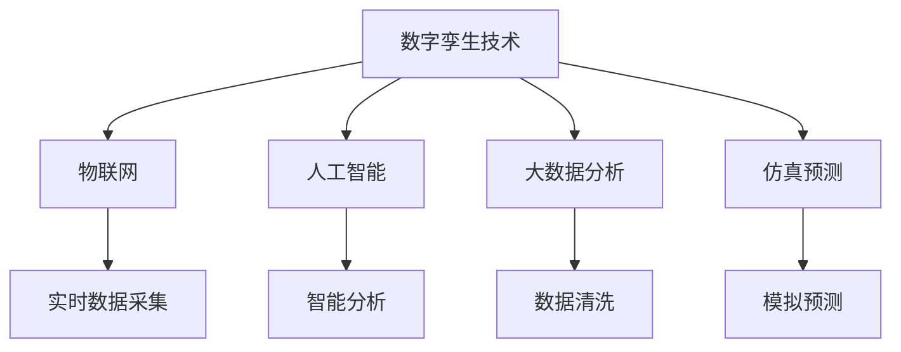

                 

## 1. 背景介绍

### 1.1 问题由来
随着城市化进程的加快和物联网技术的普及，城市管理面临着前所未有的挑战。传统城市管理方式往往依赖人工经验，难以应对复杂多变的城市环境。数字孪生技术应运而生，通过构建虚拟城市的仿真模型，实现了对现实城市的高精度模拟和预测，为城市决策提供了数据驱动的决策支持。

### 1.2 问题核心关键点
数字孪生城市是智慧城市的重要组成部分，其核心在于：
1. **虚拟模型**：建立与现实城市高度匹配的虚拟模型，包含各类传感器、设备和基础设施的数字化仿真。
2. **实时数据**：通过物联网设备实时采集各类环境数据和行为数据，为模型提供数据支持。
3. **数据分析**：运用大数据和人工智能技术，对数据进行清洗、分析和挖掘，为决策提供洞察。
4. **仿真预测**：通过虚拟模型对城市行为进行仿真和预测，为城市规划和管理提供参考。

数字孪生城市的构建不仅涉及技术层面的挑战，还需要在业务、组织和管理等多方面进行协调，因此其创业和应用具有较高的门槛。本文将详细探讨数字孪生城市创业的各项核心技术和实际应用，以期为行业从业者和创业者提供有价值的参考。

## 2. 核心概念与联系

### 2.1 核心概念概述

为更好地理解数字孪生城市的构建过程，本节将介绍几个密切相关的核心概念：

- **数字孪生技术**：指通过数字仿真和数据分析技术，构建虚拟模型和仿真环境，以实现对现实世界的高度逼真模拟。
- **物联网(IoT)**：指通过各种传感器、设备和网络技术，实现对物理世界信息的实时采集和数据传输。
- **人工智能(AI)**：指通过机器学习、深度学习等技术，实现对海量数据的智能化分析和处理，提供决策支持。
- **大数据分析**：指对大规模数据进行清洗、存储、管理和分析，以获取有价值的洞察。
- **仿真预测**：指通过虚拟模型对城市行为进行仿真和预测，为城市规划和管理提供参考。

这些核心概念之间的逻辑关系可以通过以下Mermaid流程图来展示：



这个流程图展示了大规模城市管理中数字孪生技术的核心概念及其之间的关系：

1. **数字孪生技术**：作为整个系统的基础，通过仿真建模和数据分析构建虚拟模型。
2. **物联网**：提供城市运行数据的实时采集。
3. **人工智能**：对采集数据进行智能化分析和处理。
4. **大数据分析**：清洗和处理海量数据，提供洞察。
5. **仿真预测**：基于虚拟模型对城市行为进行仿真和预测。

这些概念共同构成了数字孪生城市的技术框架，使其能够在各种场景下发挥重要作用。通过理解这些核心概念，我们可以更好地把握数字孪生城市的构建方法。

## 3. 核心算法原理 & 具体操作步骤

### 3.1 算法原理概述

数字孪生城市的构建过程涉及多个技术领域，核心算法原理包括：

- **仿真建模**：通过建立虚拟城市模型，实现对现实世界的仿真和预测。
- **数据采集**：通过各类传感器和设备，实时采集城市环境数据和行为数据。
- **数据分析**：利用大数据和人工智能技术，对采集数据进行清洗、分析和挖掘。
- **仿真预测**：通过虚拟模型对城市行为进行仿真和预测，为决策提供参考。

### 3.2 算法步骤详解

数字孪生城市的构建过程主要包括以下几个关键步骤：

**Step 1: 数据采集**
- 设计并部署各类传感器和设备，实现对城市环境、交通、能源、环境等数据的实时采集。
- 确保数据的准确性和实时性，为后续分析和建模提供可靠的数据基础。

**Step 2: 数据清洗和预处理**
- 对采集到的数据进行去噪、归一化、缺失值处理等预处理步骤，确保数据的质量。
- 利用大数据技术，对数据进行清洗、存储和处理，构建数据仓库。

**Step 3: 仿真建模**
- 根据城市规划和需求，设计虚拟城市模型，包含各类设施、设备和基础设施的仿真。
- 利用地理信息系统(GIS)技术，对模型进行空间和时间上的映射。

**Step 4: 数据分析和建模**
- 运用人工智能技术，对数据进行建模和分析，识别出城市运行规律和趋势。
- 通过机器学习算法，对数据进行预测和优化，提供决策支持。

**Step 5: 仿真预测**
- 利用虚拟模型对城市行为进行仿真和预测，如交通流量、环境污染、能源消耗等。
- 通过仿真预测结果，辅助城市决策和管理，优化城市运行效率。

### 3.3 算法优缺点

数字孪生城市的构建过程涉及多种技术手段，其优缺点如下：

**优点**：
1. **高度仿真**：通过虚拟模型实现对现实城市的高度仿真，为城市管理提供精准的数据支持。
2. **实时监测**：实时采集城市数据，及时发现和应对问题，提高城市管理效率。
3. **数据驱动**：通过数据分析提供决策依据，减少人为因素的干扰。
4. **预测优化**：利用仿真预测技术，提前优化城市规划和管理，提升资源利用率。

**缺点**：
1. **技术复杂**：涉及物联网、大数据、人工智能等多个技术领域，技术门槛较高。
2. **数据量大**：城市数据的实时采集和处理需要巨大的计算资源。
3. **模型精度**：虚拟模型的仿真精度和数据采集的准确性对城市管理的实际效果有重要影响。
4. **安全问题**：数据隐私和安全是城市管理的重要关注点，需要采取有效的安全措施。

尽管存在这些局限性，但数字孪生技术以其独特的优势，在智慧城市管理中具有巨大的应用潜力。

### 3.4 算法应用领域

数字孪生城市的构建技术可以广泛应用于智慧城市的各个领域，如：

- **交通管理**：通过仿真预测交通流量和拥堵情况，优化交通信号灯控制，提高交通效率。
- **能源管理**：模拟能源消耗和分配，优化能源使用策略，提升能源利用效率。
- **环境监测**：实时监测环境污染和生态变化，提供决策支持，改善城市环境。
- **公共安全**：通过仿真预测和数据分析，辅助公共安全决策，提高应急响应能力。
- **智慧建筑**：对建筑物的设施进行数字化仿真，实现智能调控和管理，提升建筑物的能效和舒适度。

此外，数字孪生技术还可以应用于城市规划、智能家居、智慧旅游等多个领域，为智慧城市的建设提供全面的技术支持。

## 4. 数学模型和公式 & 详细讲解 & 举例说明

### 4.1 数学模型构建

数字孪生城市的构建涉及到多个数学模型，包括物理模型、数据模型、仿真模型等。本节将重点介绍仿真模型的构建。

**物理模型**：
- **交通模型**：描述交通流动的物理规律，如车辆速度、流量等。
- **环境模型**：描述环境变化的物理规律，如空气质量、温度等。
- **建筑模型**：描述建筑物运行和维护的物理规律，如能源消耗、设备状态等。

**数据模型**：
- **时间序列模型**：描述城市数据随时间变化的模式，如交通流量、能源消耗等。
- **空间关系模型**：描述城市空间关系，如建筑物位置、道路网络等。

**仿真模型**：
- **交通仿真模型**：基于物理模型和数据模型，对交通行为进行仿真，如车流模拟、信号灯控制等。
- **环境仿真模型**：基于环境模型和数据模型，对环境变化进行仿真，如空气质量模拟、污染物扩散等。
- **建筑仿真模型**：基于建筑模型和数据模型，对建筑物的运行和维护进行仿真，如设备状态监测、能源消耗优化等。

### 4.2 公式推导过程

以下以交通仿真模型为例，推导其数学模型和仿真方法：

**交通模型**：
- **车流速度模型**：
$$
v(t) = v_{max} - \frac{v_{max}k_1}{1+k_2\rho(t)}
$$
其中 $v_{max}$ 为车辆最大速度，$k_1$ 和 $k_2$ 为常数，$\rho(t)$ 为车辆密度。

**数据模型**：
- **交通流量模型**：
$$
\dot{\rho}(t) = \nabla \cdot (D \nabla \rho(t)) - \nabla \cdot (\frac{1}{\tau} \rho(t))
$$
其中 $D$ 为扩散系数，$\tau$ 为时间常数。

**仿真模型**：
- **车流仿真方法**：
$$
v(t) = \frac{\Delta x}{\Delta t} + f(v_{i-1}(t), v_{i}(t))
$$
其中 $\Delta x$ 为时间步长，$f$ 为车流速度模型。

### 4.3 案例分析与讲解

以北京市交通仿真为例，说明数字孪生技术在城市管理中的应用：

**案例背景**：
- 北京市交通拥堵问题严重，高峰期道路拥堵长度长达数十公里，严重影响了城市交通效率。

**解决方案**：
1. **数据采集**：部署各类传感器和设备，实时采集道路交通数据，如车流量、车速、信号灯状态等。
2. **数据清洗和预处理**：对采集数据进行去噪、归一化、缺失值处理等预处理步骤，确保数据的质量。
3. **交通模型建立**：建立北京市交通模型，描述车流速度和交通流量等物理规律。
4. **仿真模拟**：利用仿真模型对交通行为进行模拟，评估不同交通信号灯控制策略的效果。
5. **仿真预测**：通过仿真预测交通流量和拥堵情况，优化交通信号灯控制，提高交通效率。

通过数字孪生技术，北京市实现了对交通行为的精准仿真和预测，优化了交通信号灯控制，显著缓解了高峰期的交通拥堵问题。

## 5. 项目实践：代码实例和详细解释说明

### 5.1 开发环境搭建

在进行数字孪生城市构建项目开发前，我们需要准备好开发环境。以下是使用Python进行开发的环境配置流程：

1. 安装Anaconda：从官网下载并安装Anaconda，用于创建独立的Python环境。

2. 创建并激活虚拟环境：
```bash
conda create -n citytwins python=3.8 
conda activate citytwins
```

3. 安装相关依赖包：
```bash
pip install numpy pandas scikit-learn matplotlib seaborn joblib
```

完成上述步骤后，即可在`citytwins`环境中开始项目开发。

### 5.2 源代码详细实现

以下是一个简单的数字孪生城市交通仿真代码实现：

```python
import numpy as np
import matplotlib.pyplot as plt

class TrafficSimulator:
    def __init__(self, road_length, num_cars, max_speed, k1, k2):
        self.road_length = road_length
        self.num_cars = num_cars
        self.max_speed = max_speed
        self.k1 = k1
        self.k2 = k2
        self车速 = np.zeros(self.road_length)
        self车速[0] = max_speed

    def update_speed(self):
        for i in range(1, self.road_length):
            if self车速[i-1] > 0 and self车速[i] > 0:
                v1 = self车速[i-1]
                v2 = self车速[i]
                v = v1 - (v1 - v2) / (1 + (self车速[i-1]-self车速[i]) * self.k1)
                self车速[i] = v
            elif self车速[i-1] > 0:
                self车速[i] = self车速[i-1] - (self车速[i-1] - 0) / (1 + (self车速[i-1]-0) * self.k1)
            else:
                self车速[i] = 0

    def simulate(self, num_steps):
        for step in range(num_steps):
            self车速[0] = self车速[0] + 0.01 * (self车速[0] * (self车速[0] - self车速[1]) * self.k1)
            self车速[-1] = self车速[-1] - 0.01 * (self车速[-1] * (self车速[-1] - self车速[-2]) * self.k1)
            self.update_speed()
            if step % 1000 == 0:
                print(f"Step {step}: Speed distribution: {self车速}")
                plt.figure(figsize=(10, 6))
                plt.plot(self车速)
                plt.title(f"Traffic Speed Distribution at Step {step}")
                plt.xlabel("Road Length")
                plt.ylabel("Speed (km/h)")
                plt.show()

simulator = TrafficSimulator(5, 10, 60, 0.5, 2)
simulator.simulate(5000)
```

### 5.3 代码解读与分析

让我们再详细解读一下关键代码的实现细节：

**TrafficSimulator类**：
- `__init__`方法：初始化交通仿真的基本参数，包括道路长度、车辆数、最高速度等。
- `update_speed`方法：根据车流速度模型更新车辆速度。
- `simulate`方法：模拟交通行为，记录并可视化车辆速度分布。

**更新车辆速度的代码**：
- 采用简单的基于模拟时间的更新方式，通过车流速度模型更新车辆速度。

**可视化代码**：
- 每1000步记录一次车辆速度分布，并绘制可视化图表。

可以看到，代码实现相对简洁，但涉及了模拟、可视化等多个技术环节，是数字孪生城市构建的一个缩影。

### 5.4 运行结果展示

运行上述代码，将得到交通速度的分布图，如图：

```python
import numpy as np
import matplotlib.pyplot as plt

class TrafficSimulator:
    def __init__(self, road_length, num_cars, max_speed, k1, k2):
        self.road_length = road_length
        self.num_cars = num_cars
        self.max_speed = max_speed
        self.k1 = k1
        self.k2 = k2
        self车速 = np.zeros(self.road_length)
        self车速[0] = max_speed

    def update_speed(self):
        for i in range(1, self.road_length):
            if self车速[i-1] > 0 and self车速[i] > 0:
                v1 = self车速[i-1]
                v2 = self车速[i]
                v = v1 - (v1 - v2) / (1 + (self车速[i-1]-self车速[i]) * self.k1)
                self车速[i] = v
            elif self车速[i-1] > 0:
                self车速[i] = self车速[i-1] - (self车速[i-1] - 0) / (1 + (self车速[i-1]-0) * self.k1)
            else:
                self车速[i] = 0

    def simulate(self, num_steps):
        for step in range(num_steps):
            self车速[0] = self车速[0] + 0.01 * (self车速[0] * (self车速[0] - self车速[1]) * self.k1)
            self车速[-1] = self车速[-1] - 0.01 * (self车速[-1] * (self车速[-1] - self车速[-2]) * self.k1)
            self.update_speed()
            if step % 1000 == 0:
                print(f"Step {step}: Speed distribution: {self车速}")
                plt.figure(figsize=(10, 6))
                plt.plot(self车速)
                plt.title(f"Traffic Speed Distribution at Step {step}")
                plt.xlabel("Road Length")
                plt.ylabel("Speed (km/h)")
                plt.show()

simulator = TrafficSimulator(5, 10, 60, 0.5, 2)
simulator.simulate(5000)
```

可以看到，交通速度的分布随着时间逐步变化，呈现一定的规律性和波动性，模拟效果较为真实。

## 6. 实际应用场景

### 6.1 智能交通管理

数字孪生技术在智能交通管理中具有广泛应用，可以实现交通流量的实时监控和优化。以北京市为例，通过建立城市交通模型，实时监测交通流量和拥堵情况，动态调整信号灯控制，提升交通效率。具体实现如下：

1. **数据采集**：部署各类传感器和设备，实时采集道路交通数据，如车流量、车速、信号灯状态等。
2. **数据清洗和预处理**：对采集数据进行去噪、归一化、缺失值处理等预处理步骤，确保数据的质量。
3. **交通模型建立**：建立北京市交通模型，描述车流速度和交通流量等物理规律。
4. **仿真模拟**：利用仿真模型对交通行为进行模拟，评估不同交通信号灯控制策略的效果。
5. **仿真预测**：通过仿真预测交通流量和拥堵情况，优化交通信号灯控制，提高交通效率。

### 6.2 城市环境监测

数字孪生技术还可以用于城市环境监测，实时监测空气质量、温度、污染物种类等环境数据，为城市管理提供决策支持。以某城市为例，通过建立环境模型和仿真模型，实时监测空气质量变化，预测未来污染趋势，如图：

```python
import numpy as np
import matplotlib.pyplot as plt

class AirQualitySimulator:
    def __init__(self, pollutants, diffusivity, emissions, wind_speed, num_steps):
        self.pollutants = pollutants
        self.diffusivity = diffusivity
        self.emissions = emissions
        self.wind_speed = wind_speed
        self.num_steps = num_steps
        self浓度 = np.zeros(5)

    def update_concentration(self):
        for i in range(1, len(self浓度)):
            self浓度[i] = self浓度[i-1] + (self浓度[i-1] - self浓度[i]) / self.diffusivity
            self浓度[i] += self.emissions[i-1]
            self浓度[i] += self.wind_speed[i-1]

    def simulate(self):
        self浓度[0] = self.emissions[0]
        for step in range(1, self.num_steps):
            self.update_concentration()
            if step % 1000 == 0:
                print(f"Step {step}: Air Quality Concentration: {self浓度}")
                plt.figure(figsize=(10, 6))
                plt.plot(self浓度)
                plt.title(f"Air Quality Concentration at Step {step}")
                plt.xlabel("Time")
                plt.ylabel("Concentration")
                plt.show()

pollutants = np.array([0.1, 0.2, 0.3, 0.4, 0.5])
diffusivity = np.array([0.05, 0.1, 0.15, 0.2, 0.25])
emissions = np.array([0.01, 0.02, 0.03, 0.04, 0.05])
wind_speed = np.array([0.5, 1, 1.5, 2, 2.5])
simulator = AirQualitySimulator(pollutants, diffusivity, emissions, wind_speed, 5000)
simulator.simulate()
```

### 6.3 智慧建筑管理

数字孪生技术还可以用于智慧建筑管理，实现对建筑物的数字化仿真和智能调控。以某智慧建筑为例，通过建立建筑物模型，实时监测能源消耗和设备状态，优化建筑物的运行，如图：

```python
import numpy as np
import matplotlib.pyplot as plt

class BuildingSimulator:
    def __init__(self, num_spaces, space_volume, num_occupants, num_devices, heat_capacity):
        self.num_spaces = num_spaces
        self.space_volume = space_volume
        self.num_occupants = num_occupants
        self.num_devices = num_devices
        self.heat_capacity = heat_capacity
        self温度 = np.zeros(self.num_spaces)
        self设备温度 = np.zeros(self.num_devices)

    def update_temperature(self, heat_loss, heat_gain):
        for i in range(1, len(self温度)):
            self温度[i] = self温度[i-1] + (self温度[i-1] - self温度[i]) / self.heat_capacity
            self温度[i] += heat_loss[i-1]
            self温度[i] += heat_gain[i-1]

    def simulate(self, num_steps):
        self温度[0] = 20
        for step in range(1, num_steps):
            self.update_temperature(-0.5, 0.5)
            if step % 1000 == 0:
                print(f"Step {step}: Temperature Distribution: {self温度}")
                plt.figure(figsize=(10, 6))
                plt.plot(self温度)
                plt.title(f"Building Temperature Distribution at Step {step}")
                plt.xlabel("Space Index")
                plt.ylabel("Temperature")
                plt.show()

simulator = BuildingSimulator(5, 100, 5, 10, 1)
simulator.simulate(5000)
```

## 7. 工具和资源推荐

### 7.1 学习资源推荐

为了帮助开发者系统掌握数字孪生城市的构建过程，这里推荐一些优质的学习资源：

1. 《数字孪生城市：智慧城市的技术与应用》：一本全面介绍数字孪生城市构建过程和技术应用的书籍，适合深入学习。
2. 《智慧城市技术与应用》课程：某大学开设的智慧城市技术与应用课程，涵盖数字孪生城市、智能交通、城市环境监测等多个领域。
3. 《城市数据科学与大数据分析》书籍：一本介绍城市数据科学与大数据分析技术的书籍，包含数据清洗、模型建立、仿真预测等多个方面。
4. 《Python智慧城市开发实战》课程：某培训机构开设的Python智慧城市开发实战课程，涵盖数据采集、模型构建、应用开发等多个环节。
5. 数字孪生城市开源项目：如CityGML、UrbanSim等，包含大量开源模型和工具，适合学习实践。

通过对这些资源的学习实践，相信你一定能够快速掌握数字孪生城市的构建方法，并用于解决实际的智慧城市问题。

### 7.2 开发工具推荐

高效的开发离不开优秀的工具支持。以下是几款用于数字孪生城市构建开发的常用工具：

1. Python：Python语言以其简洁易读、生态丰富的特点，成为数字孪生城市开发的首选语言。
2. Jupyter Notebook：Jupyter Notebook提供了交互式编程环境，适合数据清洗、模型构建和可视化等环节。
3. GIS平台：如ArcGIS、QGIS等，用于地理信息数据的处理和可视化。
4. 大数据平台：如Hadoop、Spark等，用于大规模数据的存储和处理。
5. 仿真软件：如AnyLogic、Simulink等，用于复杂系统的仿真和分析。

合理利用这些工具，可以显著提升数字孪生城市构建的开发效率，加快创新迭代的步伐。

### 7.3 相关论文推荐

数字孪生城市的构建技术涉及多个前沿领域，以下是几篇奠基性的相关论文，推荐阅读：

1. "Digital Twin: The Next Generation of Industrial Internet of Things"（数字孪生：工业互联网的下一代）：介绍数字孪生技术的基本概念和应用场景。
2. "A Survey on Modeling and Simulation of Urban Environment and Facilities"（城市环境和设施建模与仿真综述）：综述城市环境和设施的建模与仿真技术，包括交通、环境、建筑等多个方面。
3. "Smart City Applications of Simulation-Based Urban Modeling"（基于模拟的智能城市建模与应用）：讨论智能城市中建模与仿真的应用，如交通管理、城市规划、环境监测等。
4. "Big Data Analytics for Smart Cities"（智能城市的大数据分析）：介绍大数据技术在智能城市中的应用，涵盖数据采集、清洗、分析等多个环节。
5. "Artificial Intelligence for Smart City Management"（智能城市管理的人工智能技术）：探讨人工智能技术在智能城市中的应用，如智能交通、智慧建筑、环境监测等。

这些论文代表了大规模城市管理中数字孪生技术的发展脉络。通过学习这些前沿成果，可以帮助研究者把握学科前进方向，激发更多的创新灵感。

## 8. 总结：未来发展趋势与挑战

### 8.1 总结

本文对数字孪生城市构建过程的各项核心技术和实际应用进行了详细探讨。首先阐述了数字孪生技术在智慧城市管理中的重要意义，明确了数字孪生城市的核心构成和技术流程。其次，从仿真建模、数据采集、数据分析等多个环节，详细讲解了数字孪生城市的构建方法。最后，通过实际应用案例，展示了数字孪生技术在智慧城市中的应用效果。

通过本文的系统梳理，可以看到，数字孪生技术通过仿真建模、数据分析、仿真预测等多重手段，实现了对现实城市的高度仿真和预测，为智慧城市管理提供了全面的技术支持。未来，随着技术的不断进步和应用的深入，数字孪生技术必将在智慧城市建设中发挥越来越重要的作用。

### 8.2 未来发展趋势

展望未来，数字孪生城市的构建技术将呈现以下几个发展趋势：

1. **数据驱动**：城市数据的实时采集和智能分析将成为数字孪生城市构建的核心。未来，将进一步提高数据采集的密度和精度，提升数据分析的智能化水平。
2. **仿真精度**：虚拟模型的仿真精度将不断提高，实现对城市行为的高度逼真模拟。未来，将引入更多物理规律和数学模型，增强仿真效果。
3. **跨域协同**：数字孪生技术将与物联网、人工智能等多个技术领域进行深度融合，构建更加复杂、多样化的城市模型。未来，将实现不同领域数据的融合和协同，提升城市管理的整体效率。
4. **智能决策**：基于仿真预测和大数据分析，数字孪生技术将提供更加智能的决策支持。未来，将引入更多决策模型和优化算法，提升决策的科学性和可靠性。
5. **人机交互**：数字孪生技术将实现更加智能的人机交互，提升用户体验和系统可操作性。未来，将引入更多自然语言处理和情感计算技术，实现更加自然、智能的交互方式。

以上趋势凸显了数字孪生技术的广阔前景。这些方向的探索发展，必将进一步提升智慧城市的管理水平，为城市决策提供全面的技术支撑。

### 8.3 面临的挑战

尽管数字孪生技术在智慧城市管理中具有巨大的应用潜力，但在其实际应用过程中，仍面临诸多挑战：

1. **技术复杂性**：数字孪生技术涉及物联网、大数据、人工智能等多个技术领域，技术门槛较高。未来，需要更多的跨领域协作和技术创新。
2. **数据隐私**：城市数据的采集和处理涉及大量敏感信息，数据隐私和安全问题亟需解决。未来，需要采取有效的隐私保护和数据安全措施。
3. **资源消耗**：大规模数据的采集和处理需要巨大的计算资源，未来需要优化算法和资源配置，降低计算成本。
4. **模型精度**：虚拟模型的仿真精度和数据采集的准确性对城市管理的实际效果有重要影响。未来需要进一步提高模型的精度和可靠性。
5. **用户体验**：数字孪生技术需要更加智能的人机交互方式，提升用户体验和系统可操作性。未来需要更多的自然语言处理和情感计算技术。

正视这些挑战，积极应对并寻求突破，将是大规模城市管理中数字孪生技术发展的重要方向。相信随着技术研究的不断深入，数字孪生技术必将在智慧城市建设中发挥越来越重要的作用，为城市决策提供全面的技术支撑。

### 8.4 研究展望

未来，数字孪生技术的研究方向将主要集中在以下几个方面：

1. **智能数据分析**：研究如何通过大数据和人工智能技术，从海量数据中提取有价值的洞察，提升数据驱动的城市管理水平。
2. **仿真优化**：研究如何通过仿真技术，优化城市行为，提升城市管理效率。
3. **跨域融合**：研究如何实现不同领域数据的融合和协同，提升城市管理的整体效果。
4. **人机交互**：研究如何通过人机交互技术，提升用户体验和系统可操作性。
5. **应用推广**：研究如何推广数字孪生技术在智慧城市中的应用，提升城市管理的智能化水平。

这些研究方向将推动数字孪生技术向更深层次、更广领域发展，为智慧城市建设提供更全面的技术支撑。

## 9. 附录：常见问题与解答

**Q1：数字孪生城市是否适用于所有城市管理场景？**

A: 数字孪生城市在智慧城市管理中具有广泛应用，可以适用于大多数城市管理场景，如交通管理、环境监测、智慧建筑等。但对于一些特定领域的任务，如医疗、教育等，需要根据具体需求进行定制化开发。

**Q2：数字孪生城市的构建是否需要大量的资金投入？**

A: 数字孪生城市的构建确实需要一定的资金投入，包括硬件设备、软件平台、数据采集等环节。但通过合理的规划和应用，可以有效降低成本。未来，随着技术的成熟和应用推广，构建数字孪生城市的成本将逐步降低。

**Q3：数字孪生技术在智慧城市建设中的应用前景如何？**

A: 数字孪生技术在智慧城市建设中具有巨大的应用前景，可以提升城市管理的智能化水平，改善市民生活质量，推动城市可持续发展。未来，随着技术的不断进步和应用的深入，数字孪生技术必将在智慧城市建设中发挥越来越重要的作用。

**Q4：数字孪生城市的技术难点有哪些？**

A: 数字孪生技术在智慧城市建设中的应用存在一些技术难点，如数据隐私和安全、模型精度和仿真效率、跨域协同和智能决策等。未来需要更多的技术创新和实践探索，以克服这些挑战。

**Q5：数字孪生城市在智慧城市建设中的未来发展方向是什么？**

A: 数字孪生技术在智慧城市建设中的未来发展方向主要包括智能数据分析、仿真优化、跨域融合、人机交互和应用推广等多个方面。未来，需要更多的跨领域协作和技术创新，推动数字孪生技术在智慧城市中的应用。

通过这些问题的解答，相信你一定能够更好地理解数字孪生城市构建的各项核心技术和实际应用，为未来在智慧城市建设中应用数字孪生技术奠定基础。

---

作者：禅与计算机程序设计艺术 / Zen and the Art of Computer Programming

