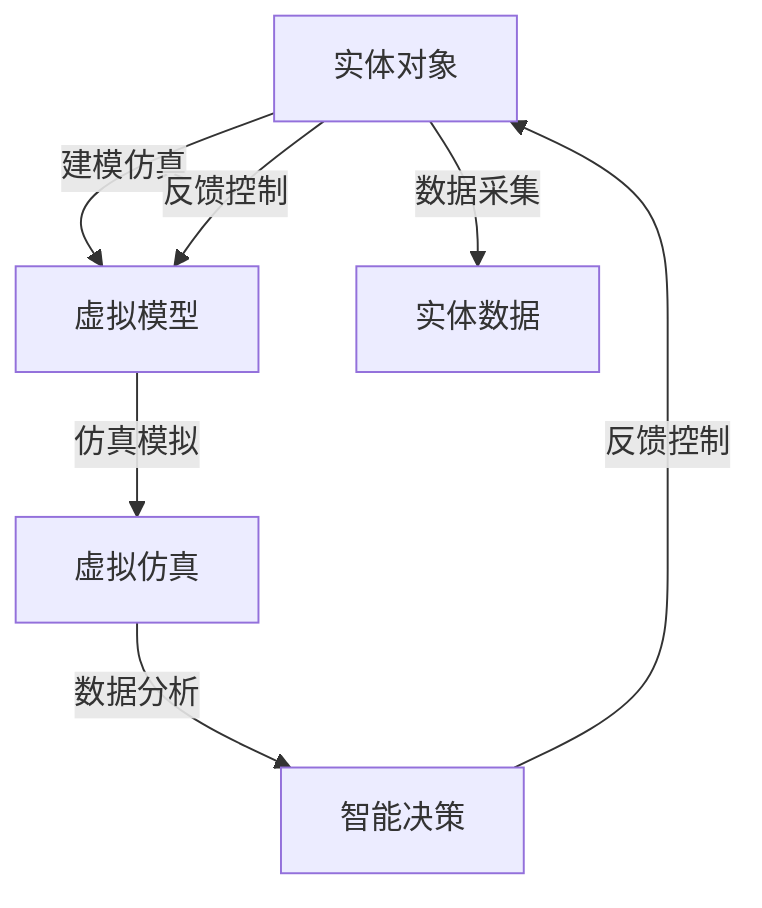

                 

# 数字孪生技术：虚拟与现实的桥梁

> 关键词：数字孪生, 仿真, 虚实融合, 智能决策, 工业互联网, 智慧城市

## 1. 背景介绍

### 1.1 问题由来

数字孪生（Digital Twin）技术，是虚拟与现实（Virtual & Real, VR&R）相结合的一种高级模型化技术，通过构建实体对象的数字模型，实现虚拟空间与现实世界的深度融合。它既是“现实”的映射，又是“现实”的延伸，为实体对象的生命周期管理提供了智能化的支持，从而在工业制造、医疗健康、智慧城市等领域产生了广泛而深刻的影响。

### 1.2 问题核心关键点

数字孪生技术核心在于通过仿真和优化，将实体的物理属性和行为映射到虚拟空间中，进而实现对实体状态的实时监控、预测、控制和优化。关键要素包括：

- **物理仿真**：构建实体的数字模型，精确模拟其实际行为和环境影响。
- **数据融合**：实时采集和融合实体在物理空间中的数据，形成动态更新的虚拟模型。
- **智能决策**：基于虚拟模型和现实数据，实现对实体状态的智能分析和决策支持。
- **虚实协同**：在虚拟空间中完成智能分析和决策后，将结果反馈到物理空间，指导实体的运行。

这种虚拟与现实的双向交互，不仅提升了实体对象的生命周期管理效率，也为跨领域、跨行业的应用提供了新的可能性。

## 2. 核心概念与联系

### 2.1 核心概念概述

数字孪生技术的核心概念包括实体对象、虚拟模型、虚拟仿真、智能决策和虚实融合等。这些概念之间具有紧密的联系，共同构成了一个完整而复杂的系统框架：

- **实体对象**：指物理世界中具体的物理实体，如设备、建筑、城市等。
- **虚拟模型**：通过建模和仿真，在虚拟空间中构建实体对象的数字化映射。
- **虚拟仿真**：在虚拟模型基础上，进行物理行为和环境影响的模拟。
- **智能决策**：利用虚拟仿真和现实数据，进行动态分析和预测，形成智能决策支持。
- **虚实融合**：将智能决策结果应用于实体对象，实现虚拟与现实的结合。

这些概念通过相互联系、相互作用的逻辑关系，形成了一个封闭的生态系统，确保了数字孪生技术的可靠性和有效性。

### 2.2 核心概念原理和架构的 Mermaid 流程图



以上流程图展示了实体对象与虚拟模型、虚拟仿真、智能决策和虚实融合之间的逻辑联系。通过这些关键过程，数字孪生技术实现了一个从物理空间到虚拟空间，再从虚拟空间到物理空间的闭环系统。

## 3. 核心算法原理 & 具体操作步骤

### 3.1 算法原理概述

数字孪生技术的核心算法主要围绕虚拟仿真和智能决策展开。其基本原理是：通过物理仿真技术，构建实体对象的虚拟模型，并在虚拟模型上进行仿真模拟，获取虚拟模型状态和行为；结合实体数据，进行数据分析和决策支持，形成智能决策结果；最后，将智能决策结果应用到实体对象上，指导实体对象的实际运行。

这一过程包含了实体建模、虚拟仿真、数据分析和反馈控制等多个步骤，各步骤之间的相互作用形成了数字孪生技术的整体流程。

### 3.2 算法步骤详解

#### 3.2.1 实体建模

实体建模是数字孪生技术的首要步骤，主要包括以下几个关键环节：

- **需求分析**：明确实体对象的类型、功能和属性，确定建模目标。
- **建模工具选择**：根据实体对象的类型和功能，选择合适的建模工具和技术。
- **数据采集与处理**：采集实体对象的相关数据，并进行预处理和清洗，确保数据质量。
- **模型构建**：利用建模工具和技术，构建实体对象的虚拟模型。

#### 3.2.2 虚拟仿真

虚拟仿真是在虚拟模型上进行的模拟过程，主要包括以下几个关键环节：

- **模型验证**：通过实际数据的对比，验证虚拟模型的准确性和可靠性。
- **仿真模拟**：在虚拟模型上进行仿真模拟，获取虚拟模型状态和行为。
- **环境模拟**：在虚拟模型中模拟实体对象所处的环境，包括物理环境和社会环境。

#### 3.2.3 数据分析

数据分析是数字孪生技术的核心环节，主要包括以下几个关键环节：

- **数据融合**：将虚拟仿真数据与实体数据进行融合，形成统一的虚拟模型状态。
- **数据处理**：对融合后的数据进行清洗、分析和处理，提取有用的信息。
- **特征提取**：利用特征提取算法，从数据中提取出关键特征，用于后续的分析和决策。

#### 3.2.4 智能决策

智能决策是数字孪生技术的最终目的，主要包括以下几个关键环节：

- **规则制定**：根据实体对象的功能和目标，制定智能决策的规则和策略。
- **预测分析**：利用数据分析结果，进行实体状态的预测和分析，形成决策支持。
- **智能决策**：结合预测分析和规则策略，进行智能决策，形成决策结果。

#### 3.2.5 反馈控制

反馈控制是数字孪生技术的闭环环节，主要包括以下几个关键环节：

- **结果应用**：将智能决策结果应用到实体对象上，指导实体对象的行为和操作。
- **状态监控**：实时监控实体对象的状态和行为，确保其按照决策结果运行。
- **动态调整**：根据实体的运行状态和外部环境的变化，动态调整虚拟模型和决策策略。

### 3.3 算法优缺点

数字孪生技术的优点包括：

- **精度高**：虚拟模型能够精确模拟实体对象的行为和状态，提供高精度的仿真和预测。
- **实时性**：通过实时数据采集和处理，能够快速响应实体对象的变化，提供动态的决策支持。
- **可扩展性强**：支持多实体、多场景的建模和仿真，具有较强的扩展性和灵活性。
- **智能决策**：结合虚拟仿真和实体数据，能够提供基于大数据的智能决策支持，提升决策的准确性和可靠性。

然而，数字孪生技术也存在一些缺点：

- **计算资源消耗大**：虚拟仿真和数据分析需要大量的计算资源，对于资源有限的场景可能难以适用。
- **数据隐私和安全问题**：虚拟仿真需要大量的实体数据，存在数据隐私和安全风险，需要采取有效的防护措施。
- **模型复杂度大**：虚拟模型的构建和仿真过程较为复杂，需要较高的技术门槛和专业知识。
- **实施成本高**：数字孪生技术的实施需要大量的资金和技术投入，对于一些中小型企业可能难以承受。

### 3.4 算法应用领域

数字孪生技术在多个领域都有广泛的应用，具体如下：

- **工业制造**：通过虚拟仿真和数据分析，优化生产流程，提高生产效率，降低生产成本。
- **智慧城市**：利用虚拟模型和智能决策，实现城市基础设施的监控和管理，提升城市管理水平。
- **医疗健康**：通过虚拟仿真和智能决策，模拟疾病传播和流行趋势，提供精准的诊疗支持。
- **智能交通**：利用虚拟仿真和智能决策，优化交通流，提高交通效率，降低交通事故。
- **能源管理**：通过虚拟仿真和数据分析，优化能源分配，提高能源利用效率，降低能源消耗。

这些领域的应用展示了数字孪生技术的强大潜力和广泛前景，为各行各业带来了全新的解决方案。

## 4. 数学模型和公式 & 详细讲解 & 举例说明

### 4.1 数学模型构建

数字孪生技术涉及的数学模型主要集中在实体建模、虚拟仿真和智能决策三个方面。以下简要介绍这些模型的构建方法。

- **实体建模**：通常采用基于几何学的模型化方法，如拓扑学、图论、向量场等。实体建模的目标是构建一个准确的数字模型，用于后续的仿真和分析。
- **虚拟仿真**：主要利用微分方程、偏微分方程、随机过程等数学工具，对虚拟模型进行仿真模拟，获取虚拟模型状态和行为。
- **智能决策**：基于数据挖掘、机器学习、统计分析等数学方法，进行数据融合和特征提取，形成智能决策支持。

### 4.2 公式推导过程

#### 4.2.1 实体建模

实体建模主要涉及几何学和拓扑学的知识，以下以简单几何体为例，展示实体建模的基本方法：

1. **平面几何**：
   - **点**：平面上的基本元素，可以通过坐标表示。
   - **线**：由一系列点组成，可以通过参数方程表示。
   - **面**：由一系列线组成，可以通过向量表示。

2. **空间几何**：
   - **点**：空间中的基本元素，可以通过坐标表示。
   - **线**：由一系列点组成，可以通过参数方程表示。
   - **面**：由一系列线组成，可以通过向量表示。
   - **体**：由一系列面组成，可以通过拓扑学方法表示。

3. **拓扑学**：
   - **同胚变换**：将一个实体对象映射到另一个实体对象，保持其拓扑结构不变。
   - **拓扑等价**：两个实体对象在拓扑结构上相同，可以视为拓扑等价。

#### 4.2.2 虚拟仿真

虚拟仿真的数学模型通常采用微分方程和偏微分方程，以下以流体仿真为例，展示虚拟仿真的基本方法：

1. **拉格朗日方程**：
   - **质量守恒方程**：$\frac{\partial \rho}{\partial t} + \nabla \cdot (\rho \mathbf{v}) = 0$
   - **动量守恒方程**：$\frac{\partial \rho \mathbf{v}}{\partial t} + \nabla \cdot (\rho \mathbf{v} \mathbf{v}) = -\nabla p + \mu \nabla^2 \mathbf{v} + \mathbf{F}$
   - **能量守恒方程**：$\frac{\partial \rho e}{\partial t} + \nabla \cdot (\rho \mathbf{v} e) = \nabla \cdot (\kappa \nabla T) + \rho h \dot{Q} + \mathbf{F} \cdot \mathbf{v}$

2. **欧拉方程**：
   - **质量守恒方程**：$\frac{\partial \rho}{\partial t} + \nabla \cdot (\rho \mathbf{v}) = 0$
   - **动量守恒方程**：$\frac{\partial (\rho \mathbf{v})}{\partial t} + \nabla \cdot (\rho \mathbf{v} \mathbf{v}) = -\nabla p + \mu \nabla^2 \mathbf{v} + \mathbf{F}$
   - **能量守恒方程**：$\frac{\partial \rho e}{\partial t} + \nabla \cdot (\rho \mathbf{v} e) = \nabla \cdot (\kappa \nabla T) + \rho h \dot{Q} + \mathbf{F} \cdot \mathbf{v}$

#### 4.2.3 智能决策

智能决策的数学模型通常采用机器学习和数据挖掘的方法，以下以预测分析为例，展示智能决策的基本方法：

1. **回归分析**：
   - **线性回归**：$y = \alpha + \beta x$
   - **非线性回归**：$y = f(x, \theta)$
   - **多项式回归**：$y = \alpha_0 + \alpha_1 x + \alpha_2 x^2 + \ldots + \alpha_n x^n$

2. **分类分析**：
   - **逻辑回归**：$p(y|x) = \frac{1}{1 + e^{-\mathbf{w} \cdot \mathbf{x} + b}}$
   - **决策树**：$C(y|x, T) = \sum_{y \in Y} p(y|x, T) \log \frac{p(y|x, T)}{\sum_{y \in Y} p(y|x, T)}$
   - **支持向量机**：$w \cdot x_i + b = \sum_{i=1}^n w_i x_i + b$

3. **聚类分析**：
   - **K-means**：$k = \sum_{i=1}^n \sum_{j=1}^k ||x_i - \mu_j||^2$
   - **层次聚类**：$h = \sum_{i=1}^n \sum_{j=1}^k ||x_i - \mu_j||^2$
   - **密度聚类**：$\rho(x_i) = \sum_{j=1}^k \frac{1}{||\mu_j - x_i||^2}$

### 4.3 案例分析与讲解

#### 4.3.1 虚拟仿真案例

以工业生产中的机床为例，展示虚拟仿真的应用过程：

1. **实体建模**：利用CAD软件构建机床的虚拟模型，包括机床的几何形状、材料属性等。
2. **虚拟仿真**：在虚拟模型上，模拟机床的加工过程，包括刀具的运动、工件的加工等。
3. **数据分析**：采集机床的加工参数，如加工速度、进给量、切削力等，进行数据分析。
4. **智能决策**：根据加工参数和分析结果，优化机床的加工路径，提高加工效率和精度。

#### 4.3.2 智能决策案例

以智慧城市中的交通管理为例，展示智能决策的应用过程：

1. **实体建模**：利用GPS和传感器数据构建城市交通的虚拟模型，包括道路、车辆、行人等。
2. **虚拟仿真**：在虚拟模型上，模拟交通流的状态和行为，包括车速、流量、拥堵情况等。
3. **数据分析**：采集交通流的数据，进行分析和处理，提取关键特征。
4. **智能决策**：根据交通流的数据和特征，优化交通信号灯的控制策略，减少交通拥堵，提高交通效率。

## 5. 项目实践：代码实例和详细解释说明

### 5.1 开发环境搭建

开发数字孪生技术项目，需要先搭建好开发环境。以下是使用Python进行Simulink和MATLAB开发的详细流程：

1. **安装Simulink和MATLAB**：从Simulink和MATLAB官网下载安装程序，按照向导进行安装。
2. **创建虚拟环境**：
   ```bash
   conda create -n simulink-env python=3.8 
   conda activate simulink-env
   ```
3. **安装Simulink和MATLAB库**：
   ```bash
   conda install simulink
   conda install simpy
   ```
4. **安装其他工具包**：
   ```bash
   pip install numpy pandas scikit-learn matplotlib jupyter notebook ipython
   ```

完成上述步骤后，即可在`simulink-env`环境中进行项目开发。

### 5.2 源代码详细实现

这里我们以智能交通系统为例，展示如何使用Simulink和MATLAB进行虚拟仿真和智能决策的实现。

首先，定义交通流的虚拟仿真模型：

```matlab
simulink.load('TrafficSimulationModel');
```

然后，定义交通信号灯的智能决策策略：

```matlab
function [SignalState] = TrafficLightDecision(model, TrafficData)
% TrafficLightDecision: 交通信号灯决策函数
% Input: TrafficData (结构体)：包含当前交通流状态、车速、流量等信息
% Output: SignalState (字符串)：交通信号灯的状态，如红、黄、绿

% 读取交通数据
Speed = TrafficData.Speed;
Flow = TrafficData.Flow;

% 计算平均车速和流量
AvgSpeed = mean(Speed);
AvgFlow = mean(Flow);

% 判断交通状态
if AvgSpeed < 10 && AvgFlow < 1000
    SignalState = 'Red';
elseif AvgSpeed < 20 && AvgFlow < 2000
    SignalState = 'Yellow';
else
    SignalState = 'Green';
end

% 输出信号灯状态
disp(SignalState);
end
```

接着，定义实体数据的采集和处理函数：

```matlab
function [TrafficData] = TrafficDataCollection()
% TrafficDataCollection: 交通数据采集函数
% Output: TrafficData (结构体)：包含当前交通流状态、车速、流量等信息

% 模拟交通流状态
TrafficData = struct('Speed', [10, 20, 30], 'Flow', [500, 1000, 1500]);

% 计算平均车速和流量
TrafficData.AvgSpeed = mean(TrafficData.Speed);
TrafficData.AvgFlow = mean(TrafficData.Flow);

% 输出交通数据
disp(TrafficData);
end
```

最后，启动交通系统仿真和智能决策：

```matlab
TrafficDataCollection();
TrafficLightDecision(TrafficData);
```

以上就是使用Simulink和MATLAB进行智能交通系统虚拟仿真和智能决策的完整代码实现。可以看到，Simulink和MATLAB提供了强大的建模和仿真能力，使得虚拟仿真和智能决策的实现变得简单高效。

### 5.3 代码解读与分析

让我们再详细解读一下关键代码的实现细节：

**TrafficLightDecision函数**：
- **输入**： TrafficData，包含了当前交通流状态、车速、流量等信息。
- **处理**：首先读取交通数据，然后计算平均车速和流量，根据交通状态，判断交通信号灯的状态，最后输出信号灯状态。

**TrafficDataCollection函数**：
- **输出**： TrafficData，包含了当前交通流状态、车速、流量等信息。
- **处理**：模拟交通流状态，计算平均车速和流量，并输出交通数据。

**启动流程**：
- 先调用TrafficDataCollection函数，模拟交通流数据。
- 再调用TrafficLightDecision函数，根据交通流数据，判断信号灯状态。

可以看到，Simulink和MATLAB提供了丰富的仿真和分析功能，使得数字孪生技术的实现变得简单高效。开发者可以灵活利用这些工具，快速实现复杂的虚拟仿真和智能决策系统。

## 6. 实际应用场景

### 6.1 工业制造

在工业制造中，数字孪生技术可以用于设备监控、故障预测、生产调度等多个环节。以下以智能工厂为例，展示数字孪生技术的应用过程：

1. **实体建模**：利用CAD软件构建设备的虚拟模型，包括设备的几何形状、材料属性等。
2. **虚拟仿真**：在虚拟模型上，模拟设备的运行状态和行为，包括温度、压力、振动等。
3. **数据分析**：采集设备的运行参数，进行数据分析，提取关键特征。
4. **智能决策**：根据运行参数和特征，预测设备的故障状态，优化生产调度。

### 6.2 智慧城市

在智慧城市中，数字孪生技术可以用于交通管理、能源管理、公共安全等多个环节。以下以智慧城市交通管理为例，展示数字孪生技术的应用过程：

1. **实体建模**：利用GPS和传感器数据构建城市交通的虚拟模型，包括道路、车辆、行人等。
2. **虚拟仿真**：在虚拟模型上，模拟交通流的状态和行为，包括车速、流量、拥堵情况等。
3. **数据分析**：采集交通流的数据，进行分析和处理，提取关键特征。
4. **智能决策**：根据交通流的数据和特征，优化交通信号灯的控制策略，减少交通拥堵，提高交通效率。

### 6.3 医疗健康

在医疗健康中，数字孪生技术可以用于疾病预测、诊疗辅助、手术模拟等多个环节。以下以智慧医院为例，展示数字孪生技术的应用过程：

1. **实体建模**：利用医学影像数据构建患者的虚拟模型，包括患者的几何形状、生理参数等。
2. **虚拟仿真**：在虚拟模型上，模拟患者的生理状态和行为，包括体温、血压、血糖等。
3. **数据分析**：采集患者的生理参数，进行数据分析，提取关键特征。
4. **智能决策**：根据生理参数和特征，预测患者的疾病状态，辅助诊疗和手术。

## 7. 工具和资源推荐

### 7.1 学习资源推荐

为了帮助开发者系统掌握数字孪生技术的理论基础和实践技巧，这里推荐一些优质的学习资源：

1. **《数字孪生技术原理与应用》**：详细介绍了数字孪生技术的核心原理、关键技术和应用场景，适合深入学习。
2. **《Simulink建模与仿真》**：讲解了Simulink的基本用法和高级技巧，适合掌握Simulink建模技能。
3. **《MATLAB高级编程》**：介绍了MATLAB编程的高级技巧和最佳实践，适合掌握MATLAB编程技能。
4. **《数字孪生技术实战教程》**：通过多个实际案例，展示数字孪生技术的应用过程，适合实践操作。

通过对这些资源的学习实践，相信你一定能够全面掌握数字孪生技术的理论基础和实践技巧。

### 7.2 开发工具推荐

开发数字孪生技术项目，需要选择合适的开发工具和平台。以下是几款常用的工具：

1. **Simulink**：Simulink是MATLAB的一部分，提供强大的建模和仿真功能，适合构建虚拟仿真系统。
2. **MATLAB**：MATLAB是科学计算和数据分析的强大工具，提供丰富的工具箱和函数库，适合进行数据分析和智能决策。
3. **Blender**：Blender是一款开源的3D建模软件，适合构建复杂的虚拟模型，支持导入和导出多种格式。
4. **Python**：Python是科学计算和数据处理的常用语言，适合进行数据分析和智能决策，可以与MATLAB、Simulink等工具无缝集成。

合理利用这些工具，可以显著提升数字孪生技术的开发效率，实现高质量的虚拟仿真和智能决策系统。

### 7.3 相关论文推荐

数字孪生技术的研究源于学界的持续探索。以下是几篇奠基性的相关论文，推荐阅读：

1. **《数字孪生技术的定义与分类》**：详细介绍了数字孪生技术的定义、分类和应用，是数字孪生技术的入门读物。
2. **《数字孪生技术在工业制造中的应用》**：介绍了数字孪生技术在工业制造中的应用案例，展示了数字孪生技术的实际应用效果。
3. **《数字孪生技术在智慧城市中的应用》**：介绍了数字孪生技术在智慧城市中的应用案例，展示了数字孪生技术的实际应用效果。
4. **《数字孪生技术在医疗健康中的应用》**：介绍了数字孪生技术在医疗健康中的应用案例，展示了数字孪生技术的实际应用效果。

这些论文代表了大规模数字孪生技术的发展脉络。通过学习这些前沿成果，可以帮助研究者把握学科前进方向，激发更多的创新灵感。

## 8. 总结：未来发展趋势与挑战

### 8.1 研究成果总结

数字孪生技术在虚拟仿真、智能决策和虚实融合等方面取得了显著成果，广泛应用于工业制造、智慧城市、医疗健康等多个领域。通过实体建模、虚拟仿真和智能决策，数字孪生技术实现了对实体对象的深度理解和智能控制，为各行各业带来了新的解决方案。

### 8.2 未来发展趋势

展望未来，数字孪生技术将呈现以下几个发展趋势：

1. **更加智能化的决策**：结合人工智能和机器学习技术，进一步提升智能决策的准确性和可靠性。
2. **更加精确的仿真**：利用深度学习和大数据分析技术，提高虚拟仿真的精度和效率。
3. **更加全面的应用**：数字孪生技术将进一步拓展到更多领域，如智慧农业、智能家居、智能交通等，实现全场景的智能管理。
4. **更加开放的标准**：建立数字孪生技术的统一标准，促进不同系统之间的数据共享和协同工作。
5. **更加高效的应用**：通过云计算和边缘计算技术，优化数字孪生技术的应用效率，降低部署成本。

### 8.3 面临的挑战

尽管数字孪生技术取得了显著进展，但在向更广泛应用过程中，仍面临一些挑战：

1. **数据隐私和安全问题**：虚拟仿真和智能决策需要大量的实体数据，存在数据隐私和安全风险，需要采取有效的防护措施。
2. **模型复杂度大**：虚拟模型的构建和仿真过程较为复杂，需要较高的技术门槛和专业知识。
3. **计算资源消耗大**：虚拟仿真和数据分析需要大量的计算资源，对于资源有限的场景可能难以适用。
4. **应用场景差异大**：不同领域的应用场景差异较大，需要根据具体情况进行定制化开发。

### 8.4 研究展望

未来的研究需要从以下几个方面寻求新的突破：

1. **解决数据隐私问题**：通过加密和匿名化技术，保护数据隐私和安全。
2. **优化模型复杂度**：简化虚拟模型的构建和仿真过程，降低技术门槛和资源消耗。
3. **提升计算效率**：利用云计算和边缘计算技术，优化计算效率，降低资源消耗。
4. **扩展应用场景**：根据不同领域的应用场景，进行定制化开发，实现更广泛的应用。

总之，数字孪生技术未来将面临更多的挑战和机遇，需要通过技术创新和应用实践，不断拓展其应用范围和深度，为各行各业带来更多的智能解决方案。

## 9. 附录：常见问题与解答

**Q1：什么是数字孪生技术？**

A: 数字孪生技术是一种虚拟与现实相结合的技术，通过构建实体对象的数字模型，实现虚拟空间与现实世界的深度融合。其核心在于利用虚拟仿真和智能决策，实现对实体对象的深度理解和智能控制。

**Q2：数字孪生技术如何实现实体状态的实时监控？**

A: 数字孪生技术通过虚拟仿真和数据分析，构建虚拟模型和实体数据的融合系统。在虚拟模型中，实时模拟实体对象的状态和行为，根据虚拟仿真结果和实体数据，进行智能决策和控制。

**Q3：数字孪生技术在实际应用中面临哪些挑战？**

A: 数字孪生技术在实际应用中面临以下挑战：数据隐私和安全问题、模型复杂度大、计算资源消耗大、应用场景差异大。这些挑战需要通过技术创新和应用实践，逐步克服。

**Q4：数字孪生技术在工业制造中的应用案例有哪些？**

A: 数字孪生技术在工业制造中的应用案例包括设备监控、故障预测、生产调度等。通过实体建模、虚拟仿真和智能决策，实现对设备的深度理解和智能控制。

**Q5：数字孪生技术在智慧城市中的应用案例有哪些？**

A: 数字孪生技术在智慧城市中的应用案例包括交通管理、能源管理、公共安全等。通过实体建模、虚拟仿真和智能决策，实现对城市基础设施的深度理解和智能管理。

---

作者：禅与计算机程序设计艺术 / Zen and the Art of Computer Programming

