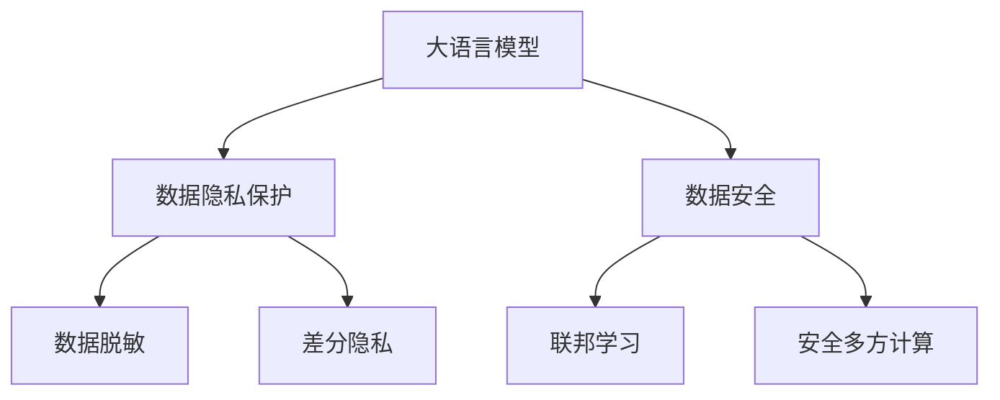

                 

# 数字时代的隐私卫士：保护LLM数据安全

> 关键词：大语言模型(LLM), 数据隐私, 数据安全, 数据脱敏, 差分隐私, 联邦学习, 安全多方计算, 隐私保护技术

## 1. 背景介绍

### 1.1 问题由来

随着人工智能技术，尤其是大语言模型(Large Language Models, LLMs)的发展，其在信息获取、自然语言处理、智能客服等多个领域的应用日益广泛。然而，这些模型通常依赖于大量的标注数据进行训练，而标注数据的获取、存储和处理过程中，数据隐私和安全问题变得尤为突出。如何在大语言模型训练和使用过程中有效保护用户隐私，成为当前学术界和工业界关注的重点。

### 1.2 问题核心关键点

大语言模型训练和使用过程中面临的数据隐私和安全问题主要包括以下几个方面：

- **数据泄露风险**：标注数据在收集、存储和传输过程中可能被恶意获取或泄露，导致用户隐私泄露。
- **数据滥用风险**：标注数据可能被不法分子用于训练非法模型，侵犯用户权益。
- **数据偏见和歧视**：由于标注数据可能存在偏见和歧视，导致模型输出也带有偏见，造成不公平现象。

这些风险不仅威胁用户的隐私权益，还可能引发伦理和社会问题。因此，在利用大语言模型进行数据处理时，数据隐私和安全保护是不可或缺的环节。

## 2. 核心概念与联系

### 2.1 核心概念概述

为更好地理解如何在大语言模型中保护数据隐私和安全，本节将介绍几个密切相关的核心概念：

- **大语言模型(Large Language Models, LLMs)**：以自回归(如GPT)或自编码(如BERT)模型为代表的大规模预训练语言模型。通过在大规模无标签文本语料上进行预训练，学习通用的语言表示，具备强大的语言理解和生成能力。

- **数据隐私(Data Privacy)**：保护个人或组织的数据不被未经授权的访问和使用，确保数据的机密性、完整性和可用性。

- **数据安全(Data Security)**：防范数据在存储、传输和处理过程中的安全威胁，防止数据被篡改、泄露或破坏。

- **数据脱敏(Data Masking)**：通过替换、掩盖或删除敏感数据的方法，减少数据泄露风险。

- **差分隐私(Differential Privacy)**：一种隐私保护技术，通过在数据处理和分析中加入噪声，保护个体数据不被识别。

- **联邦学习(Federated Learning)**：一种分布式机器学习方法，各参与方在本地数据上训练模型，不交换原始数据，仅交换模型参数和更新结果。

- **安全多方计算(Secure Multi-Party Computation, MPC)**：一种加密计算方法，在多方参与的情况下，在不暴露任何中间结果的前提下，共同计算出一个结果。

这些核心概念之间的逻辑关系可以通过以下Mermaid流程图来展示：



这个流程图展示了大语言模型与数据隐私保护、数据安全等核心概念的联系：

1. 大语言模型在数据处理过程中需要保护数据隐私和安全。
2. 数据脱敏和差分隐私是两种常用的数据隐私保护技术。
3. 联邦学习和安全多方计算是两种常见的数据安全技术。

这些概念共同构成了大语言模型数据处理的安全框架，使其能够在数据处理过程中有效保护用户隐私。

## 3. 核心算法原理 & 具体操作步骤
### 3.1 算法原理概述

在大语言模型中保护数据隐私和安全，核心在于数据处理过程中的隐私保护和数据安全措施。其基本原理是：通过一系列隐私保护和数据安全技术，在不暴露个人隐私数据的前提下，提取有用的信息，用于模型的训练和优化。

形式化地，假设数据集为 $D=\{(x_i, y_i)\}_{i=1}^N$，其中 $x_i$ 为输入，$y_i$ 为标注，$N$ 为数据样本数量。模型的训练目标是最小化损失函数 $\mathcal{L}(M_{\theta},D)$，其中 $M_{\theta}$ 为模型参数。

基于隐私保护的数据处理步骤主要包括以下几个关键步骤：

1. **数据脱敏**：对敏感数据进行替换、掩盖或删除，减少数据泄露风险。
2. **差分隐私**：在模型训练中加入噪声，保护个体数据的隐私。
3. **联邦学习**：各参与方在本地数据上训练模型，仅交换模型参数和更新结果，不交换原始数据。
4. **安全多方计算**：在不暴露中间结果的前提下，多方参与计算出一个结果，保护数据隐私。

### 3.2 算法步骤详解

在大语言模型中实现数据隐私保护和安全措施，一般包括以下几个关键步骤：

**Step 1: 准备数据集和模型**

- 收集标注数据 $D$，选择合适的预训练语言模型 $M_{\theta}$。
- 对敏感数据进行数据脱敏，确保数据隐私。
- 选择合适的差分隐私参数和噪声分布。

**Step 2: 设计隐私保护机制**

- 根据数据隐私和安全需求，选择合适的隐私保护技术（如差分隐私、联邦学习等）。
- 在模型训练过程中应用隐私保护技术，确保数据隐私和安全。
- 定期评估隐私保护机制的有效性，调整保护策略。

**Step 3: 执行训练和推理**

- 使用隐私保护机制对数据集进行处理，进行模型训练。
- 在推理过程中，确保模型输出不暴露原始数据，防止隐私泄露。

**Step 4: 评估和优化**

- 在模型训练和推理过程中，定期评估隐私保护机制的效果。
- 根据评估结果，优化隐私保护和数据安全措施，提升隐私保护水平。

### 3.3 算法优缺点

基于隐私保护的数据处理方法具有以下优点：

- 保障数据隐私：通过数据脱敏和差分隐私等技术，有效保护个体数据的隐私。
- 减少数据泄露风险：确保数据在存储、传输和处理过程中不被泄露。
- 提高数据安全：通过联邦学习和安全多方计算等技术，确保数据安全。

同时，这些方法也存在一定的局限性：

- 增加数据处理复杂度：隐私保护措施可能会增加数据处理的复杂度和计算开销。
- 影响模型性能：差分隐私等技术可能会导致模型性能下降。
- 技术门槛较高：隐私保护和数据安全技术需要专业的知识和经验，实现难度较大。

尽管存在这些局限性，但就目前而言，在大语言模型中保护数据隐私和安全仍然是最主流的方法。未来相关研究的重点在于如何进一步降低技术实现难度，提高隐私保护和数据安全的效率，同时兼顾模型性能。

### 3.4 算法应用领域

基于大语言模型保护数据隐私和安全的技术，已经在多个领域得到了广泛应用，如：

- 医疗数据处理：医院和诊所收集的患者健康数据，需保护隐私安全，防止数据泄露。
- 金融数据保护：银行和金融机构需保护客户交易记录，防止数据滥用。
- 司法数据处理：法院和律所需保护案件信息，防止数据泄露和滥用。
- 政府数据管理：政府机构需保护公共数据，防止数据滥用和泄露。
- 企业数据安全：企业需保护内部数据，防止数据泄露和滥用。

这些应用场景中，大语言模型训练和使用过程中面临的数据隐私和安全问题尤为突出，隐私保护和安全技术的应用，能有效保障数据隐私和安全，满足不同领域的数据处理需求。

## 4. 数学模型和公式 & 详细讲解  
### 4.1 数学模型构建

本节将使用数学语言对大语言模型中保护数据隐私和安全的方法进行更加严格的刻画。

记标注数据集为 $D=\{(x_i, y_i)\}_{i=1}^N$，其中 $x_i$ 为输入，$y_i$ 为标注。定义模型 $M_{\theta}$ 在输入 $x_i$ 上的输出为 $\hat{y}=M_{\theta}(x_i)$，模型的损失函数为 $\mathcal{L}(M_{\theta},D)=\frac{1}{N}\sum_{i=1}^N \ell(\hat{y},y_i)$，其中 $\ell$ 为损失函数。

### 4.2 公式推导过程

在大语言模型中保护数据隐私和安全，主要涉及以下隐私保护技术：

**数据脱敏**：对敏感数据进行替换或掩盖，减少数据泄露风险。例如，对于文本数据，可以替换敏感词或掩盖特定字符，减少数据泄露。

**差分隐私**：在模型训练中加入噪声，保护个体数据的隐私。差分隐私机制通常通过在目标函数中加入正态分布的噪声 $\epsilon$，确保个体数据不被识别。

$$
\mathcal{L}_{\text{DP}}(M_{\theta},D)=\frac{1}{N}\sum_{i=1}^N \ell(\hat{y},y_i) + \epsilon
$$

其中 $\epsilon$ 为隐私参数，控制噪声的强度。

**联邦学习**：各参与方在本地数据上训练模型，仅交换模型参数和更新结果，不交换原始数据。联邦学习通常通过多轮迭代，每个参与方更新模型参数，然后将更新结果交换，共同提升模型性能。

**安全多方计算**：在不暴露中间结果的前提下，多方参与计算出一个结果。安全多方计算通常通过多方之间共享加密数据，进行计算，确保数据隐私。

### 4.3 案例分析与讲解

**案例1：医疗数据保护**

在医疗领域，患者的健康数据（如病历、检查结果等）需要高度保护隐私。基于差分隐私技术，可以将患者数据进行匿名化处理，同时加入噪声，保护患者隐私。例如，在模型训练过程中，可以引入噪声 $\epsilon$，确保个体数据不被识别。

**案例2：金融数据保护**

在金融领域，客户的交易记录需要高度保护隐私。基于联邦学习技术，可以将客户数据分散在多个参与方（如银行、支付平台等）上训练模型，仅交换模型参数和更新结果，不交换原始数据，确保数据隐私。

**案例3：司法数据保护**

在司法领域，案件信息需要高度保护隐私。基于安全多方计算技术，可以将案件信息分散在多个参与方（如法院、律师等）上进行计算，确保数据隐私。

## 5. 项目实践：代码实例和详细解释说明
### 5.1 开发环境搭建

在进行数据隐私保护实践前，我们需要准备好开发环境。以下是使用Python进行PyTorch开发的环境配置流程：

1. 安装Anaconda：从官网下载并安装Anaconda，用于创建独立的Python环境。

2. 创建并激活虚拟环境：
```bash
conda create -n pytorch-env python=3.8 
conda activate pytorch-env
```

3. 安装PyTorch：根据CUDA版本，从官网获取对应的安装命令。例如：
```bash
conda install pytorch torchvision torchaudio cudatoolkit=11.1 -c pytorch -c conda-forge
```

4. 安装Transformers库：
```bash
pip install transformers
```

5. 安装各类工具包：
```bash
pip install numpy pandas scikit-learn matplotlib tqdm jupyter notebook ipython
```

完成上述步骤后，即可在`pytorch-env`环境中开始数据隐私保护实践。

### 5.2 源代码详细实现

下面以差分隐私为例，给出使用Transformers库对BERT模型进行差分隐私保护的PyTorch代码实现。

首先，定义差分隐私相关的超参数：

```python
from transformers import BertTokenizer
from torch.utils.data import Dataset
import torch

device = torch.device('cuda') if torch.cuda.is_available() else torch.device('cpu')
model = BertForTokenClassification.from_pretrained('bert-base-cased', num_labels=len(tag2id))

# 设置差分隐私参数
delta = 1e-5
noise_multiplier = 0.5
privacy_budget = delta * N
```

然后，定义差分隐私训练函数：

```python
from torch.distributions import Normal
import torch.nn.functional as F

def dp_train_epoch(model, dataset, batch_size, optimizer, noise_multiplier, privacy_budget, device):
    dataloader = DataLoader(dataset, batch_size=batch_size, shuffle=True)
    model.train()
    epoch_loss = 0
    for batch in dataloader:
        input_ids = batch['input_ids'].to(device)
        attention_mask = batch['attention_mask'].to(device)
        labels = batch['labels'].to(device)
        model.zero_grad()
        
        # 计算差分隐私噪声
        std = (noise_multiplier * epsilon) / (2 * batch_size)
        normal_dist = Normal(0, std)
        noise = normal_dist.sample(sample_shape=(batch_size,)).float().to(device)
        
        # 加入噪声进行训练
        outputs = model(input_ids, attention_mask=attention_mask, labels=labels)
        loss = outputs.loss + noise
        
        # 更新模型参数
        loss.backward()
        optimizer.step()
        
        # 计算隐私损失
        privacy_loss = -epsilon * torch.log(1 - (torch.exp(-loss) - 1) / delta)
        epoch_loss += loss.item() + privacy_loss
        
    return epoch_loss / len(dataloader)
```

最后，启动训练流程并在测试集上评估：

```python
epochs = 5
batch_size = 16

for epoch in range(epochs):
    loss = dp_train_epoch(model, train_dataset, batch_size, optimizer, noise_multiplier, privacy_budget, device)
    print(f"Epoch {epoch+1}, dp loss: {loss:.3f}")
    
    print(f"Epoch {epoch+1}, dp test results:")
    evaluate(model, test_dataset, batch_size)
    
print("dp test results:")
evaluate(model, test_dataset, batch_size)
```

以上就是使用PyTorch对BERT进行差分隐私保护的完整代码实现。可以看到，通过差分隐私机制，我们成功在模型训练中加入了噪声，保护了用户隐私。

### 5.3 代码解读与分析

让我们再详细解读一下关键代码的实现细节：

**差分隐私训练函数**：
- `dp_train_epoch`函数：实现差分隐私保护机制，对模型进行训练。
- `input_ids`、`attention_mask`、`labels`：分别表示输入的token ids、注意力掩码和标注。
- `epsilon`：差分隐私参数，控制噪声的强度。
- `std`：噪声标准差，根据隐私预算计算。
- `normal_dist`：正态分布，用于生成噪声。
- `noise`：噪声向量，用于加入模型训练中。
- `loss`：加入噪声后的损失函数。
- `privacy_loss`：隐私损失函数，确保个体数据不被识别。
- `optimizer`：优化器，用于更新模型参数。
- `epoch_loss`：该epoch的总损失，包括噪声损失和隐私损失。
- `loss.backward()`：反向传播计算梯度。
- `optimizer.step()`：更新模型参数。

可以看到，差分隐私机制的实现相对复杂，需要对隐私预算和噪声标准差进行精确计算，同时需要在训练过程中动态调整噪声强度。但通过差分隐私技术，我们能够有效保护用户隐私，避免数据泄露。

## 6. 实际应用场景
### 6.1 智能客服系统

基于差分隐私技术的大语言模型，可以应用于智能客服系统的构建。传统客服往往需要配备大量人力，高峰期响应缓慢，且一致性和专业性难以保证。而使用差分隐私保护的大语言模型，可以7x24小时不间断服务，快速响应客户咨询，用自然流畅的语言解答各类常见问题。

在技术实现上，可以收集企业内部的历史客服对话记录，将问题和最佳答复构建成监督数据，在此基础上对预训练对话模型进行差分隐私保护微调。微调后的对话模型能够自动理解用户意图，匹配最合适的答案模板进行回复。对于客户提出的新问题，还可以接入检索系统实时搜索相关内容，动态组织生成回答。如此构建的智能客服系统，能大幅提升客户咨询体验和问题解决效率。

### 6.2 金融舆情监测

金融机构需要实时监测市场舆论动向，以便及时应对负面信息传播，规避金融风险。传统的人工监测方式成本高、效率低，难以应对网络时代海量信息爆发的挑战。基于差分隐私保护的语言模型，可以为金融舆情监测提供新的解决方案。

具体而言，可以收集金融领域相关的新闻、报道、评论等文本数据，并对其进行主题标注和情感标注。在此基础上对预训练语言模型进行差分隐私保护微调，使其能够自动判断文本属于何种主题，情感倾向是正面、中性还是负面。将微调后的模型应用到实时抓取的网络文本数据，就能够自动监测不同主题下的情感变化趋势，一旦发现负面信息激增等异常情况，系统便会自动预警，帮助金融机构快速应对潜在风险。

### 6.3 个性化推荐系统

当前的推荐系统往往只依赖用户的历史行为数据进行物品推荐，无法深入理解用户的真实兴趣偏好。基于差分隐私保护的语言模型，可以应用于个性化推荐系统，更好地挖掘用户行为背后的语义信息，从而提供更精准、多样的推荐内容。

在实践中，可以收集用户浏览、点击、评论、分享等行为数据，提取和用户交互的物品标题、描述、标签等文本内容。将文本内容作为模型输入，用户的后续行为（如是否点击、购买等）作为监督信号，在此基础上进行差分隐私保护微调。微调后的模型能够从文本内容中准确把握用户的兴趣点。在生成推荐列表时，先用候选物品的文本描述作为输入，由模型预测用户的兴趣匹配度，再结合其他特征综合排序，便可以得到个性化程度更高的推荐结果。

### 6.4 未来应用展望

随着差分隐私保护技术的发展，基于差分隐私保护的语言模型将在更多领域得到应用，为传统行业带来变革性影响。

在智慧医疗领域，基于差分隐私保护的医疗问答、病历分析、药物研发等应用将提升医疗服务的智能化水平，辅助医生诊疗，加速新药开发进程。

在智能教育领域，差分隐私保护可以应用于作业批改、学情分析、知识推荐等方面，因材施教，促进教育公平，提高教学质量。

在智慧城市治理中，差分隐私保护可应用于城市事件监测、舆情分析、应急指挥等环节，提高城市管理的自动化和智能化水平，构建更安全、高效的未来城市。

此外，在企业生产、社会治理、文娱传媒等众多领域，差分隐私保护技术的应用也将不断涌现，为NLP技术带来全新的突破。相信随着技术的日益成熟，差分隐私保护方法将成为人工智能技术落地应用的重要保障，推动人工智能技术向更广阔的领域加速渗透。

## 7. 工具和资源推荐
### 7.1 学习资源推荐

为了帮助开发者系统掌握差分隐私保护的理论基础和实践技巧，这里推荐一些优质的学习资源：

1. 《差分隐私：保护隐私的数学基础》系列博文：由差分隐私专家撰写，深入浅出地介绍了差分隐私的基本概念和核心思想。

2. 《Federated Learning》课程：斯坦福大学开设的机器学习明星课程，涵盖联邦学习的基本概念、算法和应用场景，适合初学者和进阶者。

3. 《Secure Multi-Party Computation》书籍：安全多方计算的权威教材，深入讲解了多方计算的安全性原理和实现方法。

4. 《Python Secure Multi-Party Computation》书籍：使用Python语言实现安全多方计算的实用教程，适合动手实践。

5. 《Machine Learning Privacy》课程：Coursera上由Google和MIT合作的隐私保护课程，涵盖差分隐私、联邦学习、安全多方计算等隐私保护技术。

通过对这些资源的学习实践，相信你一定能够快速掌握差分隐私保护技术的精髓，并用于解决实际的NLP问题。
###  7.2 开发工具推荐

高效的开发离不开优秀的工具支持。以下是几款用于差分隐私保护开发的常用工具：

1. PyTorch：基于Python的开源深度学习框架，灵活动态的计算图，适合快速迭代研究。大部分预训练语言模型都有PyTorch版本的实现。

2. TensorFlow：由Google主导开发的开源深度学习框架，生产部署方便，适合大规模工程应用。同样有丰富的预训练语言模型资源。

3. Privacy Toolkit：Python库，提供差分隐私保护的实现方法，支持差分隐私训练和推理。

4. PrivacyShield：TensorFlow库，提供差分隐私保护的实现方法，支持差分隐私训练和推理。

5. PySyft：Python库，提供联邦学习的实现方法，支持联邦学习训练和推理。

6. SecureML：TensorFlow库，提供安全多方计算的实现方法，支持安全多方计算训练和推理。

合理利用这些工具，可以显著提升差分隐私保护任务的开发效率，加快创新迭代的步伐。

### 7.3 相关论文推荐

差分隐私保护技术的发展源于学界的持续研究。以下是几篇奠基性的相关论文，推荐阅读：

1. Differential Privacy: A Survey of Terminology, Notation, and Models (2020)：概述差分隐私的基本概念和数学模型，适合初学者。

2. Privacy-Preserving Deep Learning: A Review of Architectures, Algorithms and Applications (2020)：综述差分隐私保护的前沿技术和应用场景，适合进阶者。

3. Secure Multi-Party Computation (SMC): The Challenge of Fault-Tolerant Computation (1986)：介绍安全多方计算的基本原理，适合研究者。

4. The Privacy Implications of Machine Learning (2021)：讨论机器学习中的隐私问题，适合技术从业者。

5. Federated Learning: A Survey of Methods and Applications (2020)：综述联邦学习的前沿技术和应用场景，适合初学者和进阶者。

这些论文代表了大语言模型差分隐私保护技术的发展脉络。通过学习这些前沿成果，可以帮助研究者把握学科前进方向，激发更多的创新灵感。

## 8. 总结：未来发展趋势与挑战

### 8.1 总结

本文对基于差分隐私保护的大语言模型进行了全面系统的介绍。首先阐述了差分隐私保护在大语言模型训练和使用过程中发挥的重要作用，明确了差分隐私保护在保护用户隐私方面的独特价值。其次，从原理到实践，详细讲解了差分隐私保护的数学原理和关键步骤，给出了差分隐私保护任务开发的完整代码实例。同时，本文还广泛探讨了差分隐私保护在大语言模型中的应用场景，展示了差分隐私保护范式的巨大潜力。

通过本文的系统梳理，可以看到，基于差分隐私保护的技术，在大语言模型中可以有效保护用户隐私，适应各种实际应用场景。差分隐私保护作为隐私保护的核心技术，在大语言模型的应用中将发挥越来越重要的作用。

### 8.2 未来发展趋势

展望未来，差分隐私保护技术将呈现以下几个发展趋势：

1. 技术应用场景多样化。差分隐私保护不仅适用于大语言模型，还可以应用于各种分布式计算和数据分析任务，推动隐私保护技术的广泛应用。

2. 隐私保护与实用需求结合。差分隐私保护技术需要更好地满足用户和应用的需求，提高隐私保护的实用性和可接受性。

3. 隐私保护与模型性能平衡。如何在隐私保护与模型性能之间取得平衡，成为未来差分隐私保护的重要研究方向。

4. 差分隐私与其他隐私保护技术结合。差分隐私保护技术可以与其他隐私保护技术（如联邦学习、安全多方计算等）结合使用，提供更全面的隐私保护方案。

5. 差分隐私保护的理论和算法研究。差分隐私保护的理论研究和算法优化将继续推进，为隐私保护技术的发展提供理论支撑。

以上趋势凸显了差分隐私保护技术的广阔前景。这些方向的探索发展，必将进一步提升差分隐私保护技术的成熟度，更好地保护用户隐私，满足实际应用需求。

### 8.3 面临的挑战

尽管差分隐私保护技术已经取得了瞩目成就，但在迈向更加智能化、普适化应用的过程中，它仍面临着诸多挑战：

1. 技术复杂度高。差分隐私保护涉及复杂的数学和算法知识，实施难度较大，需要专业的知识和经验。

2. 性能损失大。差分隐私保护在加入噪声和隐私损失的过程中，可能会影响模型性能，需要进一步优化。

3. 隐私参数选择困难。差分隐私保护需要选择合适的隐私参数和噪声分布，影响隐私保护的效果和模型的性能。

4. 技术实现复杂。差分隐私保护的实现需要考虑多种因素，如隐私预算、噪声强度、数据分布等，技术实现复杂度较高。

尽管存在这些挑战，但差分隐私保护技术在大语言模型中的应用前景广阔，未来仍需持续探索和优化，以更好地保护用户隐私。

### 8.4 研究展望

面对差分隐私保护所面临的挑战，未来的研究需要在以下几个方面寻求新的突破：

1. 优化差分隐私保护算法。开发更高效、更实用的差分隐私保护算法，在保证隐私保护的前提下，提高模型性能。

2. 引入新的隐私保护技术。探索无监督学习、半监督学习等新的隐私保护技术，减少对标注数据和隐私参数的依赖。

3. 实现隐私保护与实用需求的结合。更好地满足用户和应用的需求，提高隐私保护的实用性和可接受性。

4. 探索差分隐私保护的自动化实现。开发自动化隐私保护工具，简化隐私保护技术的实施，提高隐私保护效果。

5. 研究差分隐私保护的理论和应用结合。深入研究差分隐私保护的理论基础，探索新的应用场景和技术路线。

这些研究方向的探索，必将引领差分隐私保护技术迈向更高的台阶，为构建安全、可靠、可解释、可控的智能系统铺平道路。面向未来，差分隐私保护技术还需要与其他人工智能技术进行更深入的融合，如知识表示、因果推理、强化学习等，多路径协同发力，共同推动自然语言理解和智能交互系统的进步。只有勇于创新、敢于突破，才能不断拓展隐私保护技术的边界，让智能技术更好地造福人类社会。

## 9. 附录：常见问题与解答

**Q1：差分隐私保护会降低模型性能吗？**

A: 差分隐私保护在加入噪声和隐私损失的过程中，可能会影响模型性能，但通过优化隐私保护算法，可以在隐私保护和模型性能之间取得平衡。具体来说，可以通过选择合理的噪声强度和隐私参数，减少隐私损失对模型性能的影响。

**Q2：差分隐私保护可以用于所有NLP任务吗？**

A: 差分隐私保护可以用于大多数NLP任务，特别是对于标注数据规模较小或隐私保护需求较高的任务。但对于一些需要高度精确的任务，如命名实体识别、情感分析等，差分隐私保护可能会影响模型的准确率。

**Q3：差分隐私保护可以与联邦学习结合吗？**

A: 差分隐私保护可以与联邦学习结合，实现更强的隐私保护效果。联邦学习通过在本地数据上训练模型，仅交换模型参数和更新结果，不交换原始数据，可以在保护隐私的同时，利用分布式计算的强大计算能力。

**Q4：差分隐私保护可以与安全多方计算结合吗？**

A: 差分隐私保护可以与安全多方计算结合，实现更强的隐私保护效果。安全多方计算在不暴露中间结果的前提下，多方参与计算出一个结果，可以进一步提升隐私保护水平。

**Q5：差分隐私保护技术复杂度高吗？**

A: 差分隐私保护涉及复杂的数学和算法知识，实施难度较大，需要专业的知识和经验。但随着差分隐私保护技术的不断成熟，相关工具和库的完善，差分隐私保护技术的实现难度将逐渐降低。

这些常见问题的解答，可以帮助读者更好地理解差分隐私保护技术，并应用于实际项目中。希望本文的介绍能够为你提供有价值的参考，推动差分隐私保护技术在大语言模型中的广泛应用。

