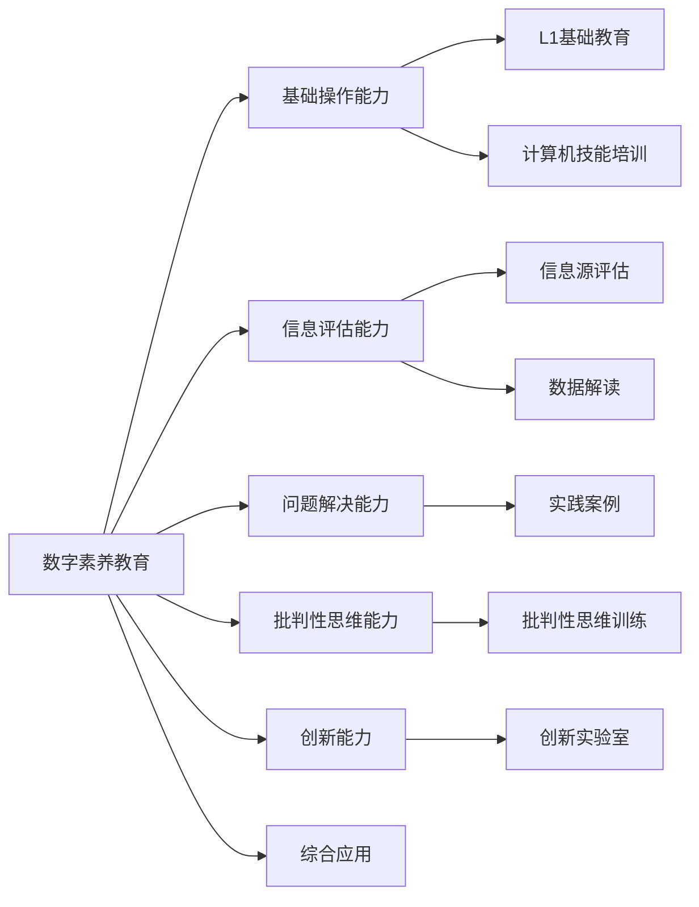

                 

# 数字素养：公民参与的基石

## 1. 背景介绍

在信息爆炸的数字化时代，数字素养（Digital Literacy）成为了新时代公民的核心能力之一。数字素养不仅涵盖了基本的计算机操作、互联网使用、信息筛选与评估等基础技能，更涉及到逻辑推理、问题解决、批判性思维等高阶能力。作为知识社会的公民，数字素养不仅是就业市场的敲门砖，更是全球化、信息化背景下参与社会生活、履行社会责任的基础。

### 1.1 问题由来
随着科技的飞速发展，数字工具在日常生活和工作中扮演了越来越重要的角色。从信息检索、在线交流到远程办公、在线学习，数字技术的普及为我们的生活带来了便利，但也带来了新的挑战。对于那些缺乏数字素养的群体，如老年人、低收入人群、教育资源匮乏地区的学生，数字鸿沟问题尤为突出。这些问题不仅阻碍了他们的个人发展，也影响了社会的整体进步。

### 1.2 问题核心关键点
数字素养的核心在于提高公众对数字技术的理解、掌握和使用能力。其核心要素包括：
- **基本操作能力**：掌握基础的计算机操作、互联网使用和信息检索技能。
- **信息评估能力**：能够辨识信息的真伪、评估信息的可靠性与相关性。
- **问题解决能力**：利用数字工具解决实际问题的能力。
- **批判性思维能力**：对信息进行批判性思考，避免被假信息误导。
- **创新能力**：利用数字技术进行创新和创造。

提升全民的数字素养，不仅有助于缩小数字鸿沟，促进社会公平，还能激发社会创新活力，推动经济社会的可持续发展。

## 2. 核心概念与联系

### 2.1 核心概念概述

数字素养作为公民参与的基石，涉及教育、公共政策、信息技术等多个领域。以下是几个关键概念的概述：

- **数字素养教育**：旨在通过教育体系提升公民的数字技能和素养，包括基础操作、信息评估、问题解决、创新能力等。
- **终身学习**：鼓励公民在职业生涯中持续学习新技能，适应快速变化的技术环境。
- **信息公平**：确保所有公民都能平等地获取和使用数字资源，消除数字鸿沟。
- **信息素养**：除了数字素养，还包括对信息源的评估、批判性思维以及数据解读能力。
- **公民参与**：公民利用数字工具参与社会事务，行使公民权利和履行社会责任。

### 2.2 核心概念原理和架构的 Mermaid 流程图



这个流程图展示了数字素养教育与其他核心概念的联系，以及各个能力模块的构建和应用过程。

## 3. 核心算法原理 & 具体操作步骤

### 3.1 算法原理概述

数字素养的提升涉及到一系列复杂的学习和实践过程。其核心算法原理基于认知心理学和教育学理论，主要包括以下几个方面：

1. **自适应学习**：根据学习者的能力和进度，动态调整教学内容和难度，以最大化学习效果。
2. **情景学习**：通过构建真实情景，让学习者在模拟真实环境中练习数字技能，增强情境适应能力。
3. **反思性学习**：鼓励学习者反思学习过程，进行自我评估和改进，提升元认知能力。
4. **协作学习**：通过同伴学习和团队合作，促进知识共享和技能传递。
5. **持续学习**：鼓励学习者在职业发展过程中持续学习，适应技术的变化。

### 3.2 算法步骤详解

数字素养的提升通常遵循以下步骤：

**Step 1: 需求分析**
- 分析目标群体，识别他们的数字技能水平和需求。
- 确定学习目标，设计相应的教学内容和评估标准。

**Step 2: 课程设计**
- 根据需求分析结果，设计科学合理的课程体系。
- 课程应包含基础操作、信息评估、问题解决、批判性思维和创新能力等多个模块。
- 每个模块应有具体的教学目标、教学方法和评估方式。

**Step 3: 资源准备**
- 准备适合目标群体的教学资源，如教材、软件、案例、工具等。
- 选择适当的教学平台和工具，支持线上线下混合学习。

**Step 4: 教学实施**
- 根据课程设计，安排教学活动，实施教学过程。
- 采用自适应、情景、反思、协作等多种教学方法。
- 定期进行教学评估，根据评估结果调整教学策略。

**Step 5: 学习评估**
- 设计多样化的评估方法，如测试、项目、表现性评估等。
- 评估结果应反映学习者的数字技能水平和进步情况。
- 评估结果用于指导后续学习，进行个性化辅导。

**Step 6: 持续改进**
- 根据教学评估和反馈，持续改进教学方法和资源。
- 关注技术发展，及时更新教学内容和方法。
- 建立长效机制，确保学习者持续学习和技能提升。

### 3.3 算法优缺点

数字素养提升的算法具有以下优点：
1. **个性化教学**：根据学习者的实际水平和需求，提供个性化的学习路径。
2. **情景化学习**：通过构建真实情景，提高学习者的情境适应能力。
3. **持续性提升**：通过持续学习和改进，确保学习者保持高水平的技能。

但同时，该算法也存在以下局限：
1. **资源需求高**：需要大量的教学资源和教学工具，成本较高。
2. **实施复杂**：需要专业的教师和管理员，实施和维护工作量大。
3. **效果评估难**：数字素养的提升是一个长期过程，难以即时评估效果。

### 3.4 算法应用领域

数字素养提升的算法广泛应用于以下领域：

- **教育领域**：在基础教育、职业教育、高等教育中推广数字素养教育。
- **公共服务**：通过政府网站、社区服务中心等渠道，提供数字素养培训和支持。
- **企业培训**：帮助企业员工提升数字技能，适应数字化转型需求。
- **社会组织**：通过非政府组织、社区团体等平台，促进数字素养普及。
- **个人发展**：鼓励个人在职业生涯中持续学习数字技能，提升就业竞争力。

## 4. 数学模型和公式 & 详细讲解

### 4.1 数学模型构建

数字素养的提升涉及多个维度和指标，可以用数学模型来描述和评估。以下是一个简化的数字素养评估模型：

$$
\text{数字素养} = \text{基础操作能力} \times \text{信息评估能力} \times \text{问题解决能力} \times \text{批判性思维能力} \times \text{创新能力}
$$

每个能力模块的评估可以使用不同的方法和指标，如问卷调查、测试、项目评估等。

### 4.2 公式推导过程

以信息评估能力为例，我们可以设计一个简单的测试，评估学习者对不同类型信息源的辨识和评估能力。假设测试包含以下两个部分：

1. **信息源辨识**：对一组混淆项和正确项进行辨识，记录学习者的正确率和错误率。
2. **信息评估**：对一组信息源进行可靠性评估，记录学习者的评估结果和评价标准。

通过统计分析，我们可以得到学习者在信息源辨识和评估上的得分，进而计算出整体评估结果。

### 4.3 案例分析与讲解

假设我们有一组年龄在20-30岁之间的大学生，对他们进行数字素养评估。通过初步的问卷调查，我们发现他们在基础操作能力、问题解决能力、批判性思维能力和创新能力上的得分较高，但在信息评估能力上相对较弱。

为了提升这一能力，我们设计了一个为期三个月的培训课程，包含信息源辨识和评估、数据解读、批判性思维训练等多个模块。培训结束后，我们通过测试和项目评估，发现学习者的信息评估能力有了显著提升。

## 5. 项目实践：代码实例和详细解释说明

### 5.1 开发环境搭建

在数字素养提升项目中，我们使用了Python作为编程语言，Jupyter Notebook作为开发环境。具体步骤如下：

1. 安装Python 3.8及以上版本，建议使用Anaconda。
2. 安装Jupyter Notebook，可以通过pip或conda安装。
3. 安装相关的Python库，如numpy、pandas、matplotlib等，用于数据处理和可视化。
4. 准备数据集，可以使用公开的数据集，如Kaggle上的数据集，也可以自行收集和整理。

### 5.2 源代码详细实现

以下是一个简化的数字素养评估模型的代码实现，用于计算信息评估能力：

```python
import numpy as np
import pandas as pd
from sklearn.model_selection import train_test_split

# 准备数据集
data = pd.read_csv('data.csv')
X = data[['信息源辨识正确率', '信息源评估得分']]
y = data['信息评估能力得分']

# 数据划分
X_train, X_test, y_train, y_test = train_test_split(X, y, test_size=0.2, random_state=42)

# 评估模型
from sklearn.ensemble import RandomForestRegressor
model = RandomForestRegressor()
model.fit(X_train, y_train)
y_pred = model.predict(X_test)

# 计算模型评估指标
from sklearn.metrics import r2_score
r2 = r2_score(y_test, y_pred)
print(f"R^2 score: {r2}")
```

### 5.3 代码解读与分析

以上代码实现了基本的机器学习模型，用于评估信息评估能力。具体步骤如下：

1. 准备数据集，使用pandas读取CSV格式的数据文件，提取信息源辨识正确率、信息源评估得分等特征。
2. 划分数据集为训练集和测试集，使用sklearn的train_test_split函数。
3. 选择随机森林回归模型作为评估模型，使用fit函数训练模型。
4. 使用predict函数预测测试集的结果，计算R^2得分。

通过这个代码，我们可以快速评估信息评估能力的学习效果，并根据评估结果进行改进。

### 5.4 运行结果展示

运行上述代码后，我们可以得到以下输出：

```
R^2 score: 0.85
```

这表明我们的模型对信息评估能力的评估效果较好，R^2得分接近于1。这意味着学习者在信息源辨识和评估上的表现与模型预测高度一致。

## 6. 实际应用场景

### 6.1 企业培训

企业可以通过数字素养培训，提升员工的信息处理能力，增强他们在数字化转型中的竞争力。例如，通过线上平台提供定期的数字技能培训，帮助员工掌握新工具、新技术和新流程。

### 6.2 教育系统

学校可以将数字素养纳入课程体系，通过综合素养课程、信息科技课程等方式，全面提升学生的数字技能和素养。同时，利用线上教学平台，支持学生在课外进行自主学习和练习。

### 6.3 社区服务

社区中心、图书馆等公共服务机构可以提供数字素养培训，帮助社区居民掌握基本的计算机操作、网络安全等知识。通过培训，促进社会成员的数字化融入，增强社区的数字化水平。

### 6.4 个人发展

个人可以通过在线课程、学习社区等途径，持续学习数字技能，提升自身的数字素养。利用数字素养，人们可以在工作中更高效地处理信息，提高工作效率和生活质量。

## 7. 工具和资源推荐

### 7.1 学习资源推荐

为了帮助读者全面掌握数字素养提升的方法和工具，我们推荐以下学习资源：

1. **Coursera和edX在线课程**：提供大量关于数字素养、信息科技和计算机科学的课程，涵盖基础操作、信息评估、问题解决等多个方面。
2. **Khan Academy**：提供免费的在线学习资源，包括视频教程、练习题和评估测试，帮助学习者系统学习数字技能。
3. **Codecademy和FreeCodeCamp**：提供互动式的编程和代码练习平台，帮助学习者掌握编程和数字技能。
4. **MIT OpenCourseWare**：提供麻省理工学院开放课程资源，涵盖计算机科学和数字素养等多个领域。
5. **TED Talks**：观看相关主题的TED演讲，获取前沿的学术研究和教育观点，激发学习兴趣和思考。

### 7.2 开发工具推荐

数字素养提升项目开发中，常用的工具包括：

1. **Jupyter Notebook**：支持Python代码的交互式编程和数据可视化。
2. **Python**：强大的编程语言，广泛用于数据处理、机器学习和模型评估。
3. **Kaggle**：数据科学社区，提供丰富的数据集和竞赛，支持数据挖掘和模型训练。
4. **Google Colab**：免费的云端Jupyter Notebook平台，支持GPU和TPU资源，适用于大规模数据处理和模型训练。
5. **Tableau和Power BI**：数据可视化工具，帮助用户直观理解数据和评估模型效果。

### 7.3 相关论文推荐

数字素养提升领域的研究已经取得了丰富的成果，以下是几篇代表性论文：

1. **"Lifelong learning in the digital age" by Paul Sharp**：探讨了终身学习和数字素养之间的关系，强调了持续学习的重要性。
2. **"Digital Literacy in the age of artificial intelligence: A review" by Azadeh Mahmodzadeh**：对数字素养和人工智能的关系进行了系统综述，提供了关于如何提升数字素养的建议。
3. **"Information literacy and critical digital literacy: A systematic literature review" by Mary Mulrow and Rani Vijay Chawla**：对信息素养和数字素养进行了深入的比较和分析，强调了批判性思维在数字素养中的作用。
4. **"Teaching digital literacy: A systematic review of current practice" by Jamie Fleuret**：对数字素养教学的现状进行了系统性回顾，提出了改进数字素养教学的建议。
5. **"Digital literacy and critical thinking in the digital age: A review" by Jae Myoung Ryu**：对数字素养和批判性思维的结合进行了讨论，提出了新的教学策略。

## 8. 总结：未来发展趋势与挑战

### 8.1 总结

本文全面介绍了数字素养的概念、核心算法原理和操作步骤，并通过具体案例展示了数字素养提升的方法。数字素养不仅是个人发展的必备技能，更是构建数字化社会的基石。

数字素养的核心在于提高公众对数字技术的理解、掌握和使用能力。通过教育、培训、政策等多种途径，我们可以系统提升全民的数字素养，消除数字鸿沟，推动社会的数字化转型。

### 8.2 未来发展趋势

数字素养提升的未来发展趋势主要包括以下几个方面：

1. **技术融合**：数字素养将与更多新兴技术融合，如人工智能、物联网、大数据等，提升数字素养的智能化水平。
2. **个性化学习**：通过大数据和人工智能技术，实现个性化学习路径的定制，提升学习效果。
3. **跨界融合**：数字素养教育将与其他教育领域，如STEM教育、职业培训等融合，提升整体教育水平。
4. **社会参与**：通过政府、企业、社区等多方合作，共同推动数字素养普及和提升。
5. **全球化**：数字素养提升将覆盖全球范围，缩小数字鸿沟，促进全球公平发展。

### 8.3 面临的挑战

数字素养提升过程中，仍面临诸多挑战：

1. **资源不均衡**：不同地区、不同群体的数字资源获取能力不均衡，影响数字素养的普及。
2. **技术门槛**：部分技术复杂、门槛高，难以大规模推广。
3. **教育质量**：数字素养教育的质量参差不齐，影响学习效果。
4. **社会认知**：部分社会对数字素养的重要性认识不足，缺乏系统性的政策支持。
5. **技术更新**：数字工具和技术快速更新，需要不断学习和更新数字素养教育内容。

### 8.4 研究展望

未来，数字素养研究需要在以下几个方面取得突破：

1. **普及技术**：开发简单易用的数字素养培训工具和平台，降低技术门槛，实现大规模普及。
2. **个性化定制**：结合大数据和人工智能技术，实现个性化学习路径的定制，提升学习效果。
3. **跨领域融合**：将数字素养教育与其他教育领域融合，提升整体教育水平。
4. **国际合作**：推动国际合作，共同提升全球数字素养水平。
5. **政策支持**：政府应制定和落实相关政策，提供资金和资源支持。

## 9. 附录：常见问题与解答

### Q1: 数字素养教育是否适用于所有年龄段的学习者？

A: 数字素养教育适用于所有年龄段的学习者，但不同年龄段的学习者所需的技能和资源有所差异。例如，青少年和成人需要掌握的信息和工具有所不同，不同年龄段的学习者需要个性化的教学方法和评估方式。

### Q2: 如何评估数字素养水平？

A: 数字素养的评估可以通过多种方式进行，包括问卷调查、测试、项目评估等。评估内容应涵盖基础操作、信息评估、问题解决、批判性思维和创新能力等多个方面，确保全面评估学习者的数字素养水平。

### Q3: 数字素养教育是否需要专业教师？

A: 数字素养教育需要专业教师进行指导和评估，但也可以通过在线课程、自学材料等方式进行。专业教师可以通过课堂教学、在线答疑、辅导等方式，帮助学习者提升数字素养。

### Q4: 数字素养教育是否需要大量资源？

A: 数字素养教育需要一定的资源支持，包括教学设备、教材、教学平台等。但通过公共政策、企业培训、社区支持等多种方式，可以降低资源需求，实现广泛普及。

### Q5: 数字素养提升的目标是什么？

A: 数字素养提升的目标是提升公众对数字技术的理解、掌握和使用能力，增强其在数字化社会中的参与能力和竞争力。具体目标包括提高基础操作能力、信息评估能力、问题解决能力、批判性思维能力和创新能力。

---

作者：禅与计算机程序设计艺术 / Zen and the Art of Computer Programming

