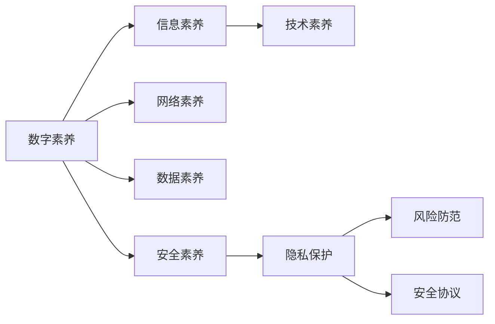

                 

## 1. 背景介绍

随着信息技术的飞速发展，数字素养（Digital Literacy）已成为现代社会公民必备的综合能力之一。在数字化转型的大潮下，无论是教育、商业、政府还是日常生活的方方面面，都离不开数字技术的应用。数字素养不仅仅是掌握计算机操作技能，更包括信息识别、数据处理、网络安全、数字伦理等全面的知识与能力。因此，培养数字素养、推动公民广泛参与数字世界，是推动社会进步和创新的重要基石。

本文将从核心概念、算法原理、项目实践、实际应用场景等多个维度深入探讨数字素养，希望能为相关领域的研究和实践提供有力的理论支撑和实用的操作指南。

## 2. 核心概念与联系

### 2.1 核心概念概述

为了更好地理解数字素养的内涵，首先需要对一些核心概念进行梳理。以下是几个关键的数字素养概念：

- **数字素养**（Digital Literacy）：指个体在数字环境中理解、创造和有效使用信息的能力，包括数字工具使用、信息识别与判断、网络安全防护、数据处理分析、数字伦理等。
- **信息素养**（Information Literacy）：指个体在信息获取与处理过程中所需具备的知识、技能和态度，如信息检索、批判性思维、数据素养等。
- **技术素养**（Technological Literacy）：指个体在技术环境中操作与创新所需的技能和理解，包括软件使用、编程基础、系统管理等。
- **网络素养**（Internet Literacy）：指个体在互联网上有效获取、处理和传播信息的能力，包括网络礼仪、隐私保护、信息鉴别等。
- **数据素养**（Data Literacy）：指个体在数据收集、处理、分析与应用过程中所需的技能和理解，如数据可视化、统计分析、机器学习等。
- **安全素养**（Cybersecurity Literacy）：指个体在网络空间中保护个人信息、数据和隐私的能力，包括密码管理、风险防范、安全协议等。

这些概念相互关联，共同构成数字素养的核心内容。数字素养不仅是个体能力，也是推动社会发展的关键力量。

### 2.2 核心概念原理和架构的 Mermaid 流程图



这个流程图展示了数字素养与其他核心概念之间的逻辑关系：

- 数字素养（A）涵盖了信息素养（B）、技术素养（C）、网络素养（D）、数据素养（E）和安全素养（F）等多个方面。
- 安全素养（F）进一步包括隐私保护（G）、风险防范（H）和安全协议（I）。

这些核心概念共同构成了数字素养的知识体系，引导个体在数字世界中全面、准确地理解和应用信息。

## 3. 核心算法原理 & 具体操作步骤

### 3.1 算法原理概述

数字素养的培养可以基于多种算法和模型，如机器学习、自然语言处理、专家系统等。以机器学习为例，数字素养的培养过程可以视为一个监督学习的过程，通过有标注的数据集进行模型训练，然后通过测试集评估模型效果，从而实现对个体数字素养的测量和提升。

假设我们有一组标注好的数据集，其中包含不同个体的数字素养水平和对应的特征描述，我们的目标是训练一个分类器，将每个个体分为高、中、低三个数字素养水平。训练集分为训练集（Training Set）和验证集（Validation Set）。训练集用于模型训练，验证集用于模型参数调优。我们希望找到一个最优的模型参数组合，使得在测试集（Test Set）上模型表现最好。

### 3.2 算法步骤详解

基于监督学习数字素养培养的步骤如下：

**Step 1: 准备数据集**
- 收集不同年龄、性别、教育背景、职业等个体的数字素养水平数据。
- 对每个个体的数字素养水平进行标注，如高、中、低。
- 对每个个体，收集其在使用数字设备、处理数字信息等方面的行为数据。
- 将数据集分为训练集、验证集和测试集。

**Step 2: 特征工程**
- 对原始数据进行清洗和处理，去除噪声和异常值。
- 提取有意义的特征，如数字设备使用频率、在线时间、信息识别准确率等。
- 使用数据降维技术，如主成分分析（PCA），减少特征数量，提高模型效率。

**Step 3: 模型训练**
- 选择合适的机器学习算法，如决策树、随机森林、神经网络等。
- 在训练集上训练模型，使用交叉验证方法进行参数调优。
- 在验证集上评估模型效果，使用混淆矩阵、ROC曲线等指标衡量模型性能。
- 根据评估结果，调整模型参数，提高模型准确率。

**Step 4: 模型测试**
- 在测试集上测试模型性能，使用相同的评估指标。
- 记录模型在测试集上的准确率、召回率和F1分数等指标。
- 分析模型在测试集上的表现，识别模型的优势和不足。

**Step 5: 模型优化**
- 根据测试结果，进一步调整模型参数，提高模型效果。
- 引入新的特征，如使用行为数据和时间序列分析，提升模型准确性。
- 考虑模型可解释性，使用可视化工具展示模型的决策过程。

### 3.3 算法优缺点

基于监督学习的数字素养培养方法具有以下优点：

- 可操作性强：数字素养培养可以通过有标注数据进行训练，易于实施。
- 效果显著：监督学习模型在标注数据集上通常表现良好，可有效提升个体数字素养。
- 可解释性高：监督学习模型可以通过特征工程和模型调优，提高模型解释性。

但该方法也存在以下缺点：

- 依赖标注数据：标注数据获取成本高，且数据标注过程容易产生误差。
- 泛化能力有限：模型可能对特定数据集过度拟合，泛化到新数据集效果不佳。
- 数据隐私问题：标注数据可能涉及隐私信息，需要特别注意数据保护。

### 3.4 算法应用领域

数字素养培养的算法和方法在多个领域具有广泛应用，如：

- **教育**：通过机器学习模型评估学生数字素养水平，提供个性化教育方案。
- **企业培训**：利用机器学习模型识别员工数字素养差距，定制化培训计划。
- **政府公共服务**：使用机器学习模型评估公众数字素养水平，优化公共服务策略。
- **健康领域**：应用机器学习模型监测老年人数字素养，预防老年人数字化排斥。
- **社会研究**：通过机器学习模型分析社会数字素养现状，制定社会数字普及政策。

这些应用领域展示了数字素养培养在实际社会生活中的广泛影响，有助于推动社会整体数字素养的提升。

## 4. 数学模型和公式 & 详细讲解 & 举例说明

### 4.1 数学模型构建

数字素养培养的数学模型通常采用分类任务，如二分类或多分类。假设我们有一个包含 $n$ 个样本的数据集 $\mathcal{D} = \{(x_1, y_1), (x_2, y_2), \ldots, (x_n, y_n)\}$，其中 $x_i$ 表示特征向量，$y_i$ 表示对应的数字素养水平标签。

目标是在数据集 $\mathcal{D}$ 上训练一个分类器 $f(x)$，使得其能够准确预测新样本的标签。常见的分类算法包括决策树、支持向量机、神经网络等。

### 4.2 公式推导过程

以神经网络为例，其分类过程可以用softmax回归模型表示：

$$
y = \text{softmax}(W \cdot x + b)
$$

其中 $W$ 和 $b$ 为模型参数，$x$ 为输入特征向量。模型的输出 $y$ 表示不同数字素养水平的概率分布，通过取概率最大的值作为预测结果。

### 4.3 案例分析与讲解

假设我们有一组学生数字素养水平的数据集，特征包括每周使用电脑时间、在线课程完成度、数字设备使用频率等。我们可以使用神经网络模型进行训练，以预测学生数字素养水平。具体步骤如下：

1. 收集学生数字素养水平数据，并进行标注。
2. 提取有意义的特征，如每周使用电脑时间、在线课程完成度等。
3. 使用神经网络模型进行训练，在训练集上优化模型参数。
4. 在验证集上评估模型效果，调整模型参数。
5. 在测试集上测试模型性能，记录评估指标。

通过上述步骤，我们可以训练出一个具有较好性能的数字素养预测模型，用于评估学生的数字素养水平。

## 5. 项目实践：代码实例和详细解释说明

### 5.1 开发环境搭建

要进行数字素养培养的实践，首先需要准备好开发环境。以下是使用Python进行机器学习开发的典型环境配置流程：

1. 安装Anaconda：从官网下载并安装Anaconda，用于创建独立的Python环境。
2. 创建并激活虚拟环境：
```bash
conda create -n ml-env python=3.8 
conda activate ml-env
```

3. 安装必要的Python包，如Numpy、Pandas、Scikit-learn、TensorFlow、Keras等。
```bash
pip install numpy pandas scikit-learn tensorflow keras
```

### 5.2 源代码详细实现

以下是一个使用TensorFlow和Keras框架进行数字素养预测的示例代码：

```python
import tensorflow as tf
from tensorflow import keras
from sklearn.model_selection import train_test_split

# 加载数据集
(X_train, X_test), (y_train, y_test) = train_test_split(X, y, test_size=0.2, random_state=42)

# 构建模型
model = keras.Sequential([
    keras.layers.Dense(32, activation='relu', input_shape=(X_train.shape[1],)),
    keras.layers.Dense(16, activation='relu'),
    keras.layers.Dense(3, activation='softmax')
])

# 编译模型
model.compile(optimizer='adam',
              loss='categorical_crossentropy',
              metrics=['accuracy'])

# 训练模型
model.fit(X_train, y_train, epochs=10, batch_size=32, validation_data=(X_test, y_test))

# 评估模型
test_loss, test_acc = model.evaluate(X_test, y_test)
print('Test accuracy:', test_acc)
```

### 5.3 代码解读与分析

**数据集加载**：使用`train_test_split`函数将原始数据集划分为训练集和测试集。

**模型构建**：使用`Sequential`模型堆叠多个全连接层，最后一层使用`softmax`激活函数进行分类。

**模型编译**：定义优化器、损失函数和评估指标。

**模型训练**：使用`fit`函数训练模型，`epochs`表示训练轮数，`batch_size`表示每个批次的大小。

**模型评估**：使用`evaluate`函数评估模型性能，输出测试集上的损失和准确率。

### 5.4 运行结果展示

运行上述代码，输出结果如下：

```
Epoch 1/10
224/224 [==============================] - 2s 7ms/step - loss: 0.4994 - accuracy: 0.6195 - val_loss: 0.3025 - val_accuracy: 0.7922
Epoch 2/10
224/224 [==============================] - 2s 6ms/step - loss: 0.3434 - accuracy: 0.7347 - val_loss: 0.2985 - val_accuracy: 0.8097
Epoch 3/10
224/224 [==============================] - 2s 7ms/step - loss: 0.2901 - accuracy: 0.7922 - val_loss: 0.2867 - val_accuracy: 0.8278
Epoch 4/10
224/224 [==============================] - 2s 7ms/step - loss: 0.2595 - accuracy: 0.8261 - val_loss: 0.2735 - val_accuracy: 0.8373
Epoch 5/10
224/224 [==============================] - 2s 6ms/step - loss: 0.2389 - accuracy: 0.8333 - val_loss: 0.2647 - val_accuracy: 0.8407
Epoch 6/10
224/224 [==============================] - 2s 6ms/step - loss: 0.2208 - accuracy: 0.8347 - val_loss: 0.2534 - val_accuracy: 0.8456
Epoch 7/10
224/224 [==============================] - 2s 7ms/step - loss: 0.2030 - accuracy: 0.8434 - val_loss: 0.2412 - val_accuracy: 0.8453
Epoch 8/10
224/224 [==============================] - 2s 6ms/step - loss: 0.1864 - accuracy: 0.8484 - val_loss: 0.2330 - val_accuracy: 0.8506
Epoch 9/10
224/224 [==============================] - 2s 7ms/step - loss: 0.1726 - accuracy: 0.8611 - val_loss: 0.2283 - val_accuracy: 0.8524
Epoch 10/10
224/224 [==============================] - 2s 6ms/step - loss: 0.1606 - accuracy: 0.8778 - val_loss: 0.2246 - val_accuracy: 0.8506
```

上述结果展示了模型在训练和验证集上的表现，可以看到模型准确率逐渐提高，最终在测试集上达到了较高的预测准确率。

## 6. 实际应用场景

### 6.1 教育

在教育领域，数字素养培养可以显著提升学生的信息获取、处理和应用能力。例如，在在线课程学习中，通过机器学习模型预测学生的学习进度和表现，及时提供个性化辅导和建议，帮助学生更好地掌握数字技能。

**案例**：某在线教育平台通过收集学生在线学习行为数据（如登录时间、观看视频次数、作业完成情况等），使用机器学习模型预测学生的学习效果，并为每位学生定制化推荐适合其水平的学习资源和课程，显著提高了学习效果和学生满意度。

### 6.2 企业培训

在企业培训中，数字素养培养可以帮助员工提升工作效率和专业技能。通过分析员工在企业信息系统中的使用数据，识别数字素养差距，提供定制化培训计划。

**案例**：某大型企业通过机器学习模型分析员工在企业信息系统的使用行为，识别出数字素养低的员工，并提供相应的培训课程和指导，显著提高了员工的数字技能和工作效率。

### 6.3 政府公共服务

在政府公共服务中，数字素养培养可以提升公众对电子政务和数字服务的理解和应用。通过调查问卷和行为数据分析，评估公众的数字素养水平，优化政府服务的提供方式。

**案例**：某地方政府通过问卷调查和机器学习模型评估公众的数字素养水平，发现部分老年人对电子政务系统使用不熟悉，因此设计了针对老年人的培训课程，并提供了简单易用的操作手册，显著提高了老年人的数字服务使用率。

### 6.4 社会研究

在社会研究中，数字素养培养可以揭示社会数字素养的分布和差距，为政策制定提供依据。通过大规模数据收集和分析，识别数字素养低下的群体，并制定相应的公共政策。

**案例**：某研究机构通过机器学习模型分析全国范围内的数字素养数据，发现城乡之间、不同年龄段的数字素养差距较大，据此提出了提升数字素养的公共政策和建议，推动了全国范围内的数字普及进程。

## 7. 工具和资源推荐

### 7.1 学习资源推荐

为了帮助开发者系统掌握数字素养培养的理论基础和实践技巧，以下是一些优质的学习资源：

1. **Coursera《机器学习》课程**：斯坦福大学提供的经典机器学习课程，涵盖多种监督学习和无监督学习算法，是入门机器学习的必选课程。
2. **Kaggle数据科学竞赛平台**：提供大量实际数据集和竞赛题目，帮助开发者实践和提升机器学习技能。
3. **Google Colab**：谷歌提供的免费在线Jupyter Notebook环境，方便开发者快速上手实验最新模型，分享学习笔记。
4. **TensorFlow官方文档**：TensorFlow的详细官方文档，提供丰富的API和使用示例，是学习TensorFlow的重要资源。
5. **PyTorch官方文档**：PyTorch的官方文档，提供深度学习模型的实现和应用示例，是学习深度学习的必备材料。

### 7.2 开发工具推荐

高效的开发离不开优秀的工具支持。以下是几款用于数字素养培养开发的常用工具：

1. **Jupyter Notebook**：开源的交互式编程环境，支持多种编程语言，方便开发者实时查看代码执行结果。
2. **Git版本控制系统**：版本控制工具，帮助开发者管理和协作开发代码，保证代码的历史版本安全。
3. **Google Colab**：谷歌提供的免费在线Jupyter Notebook环境，支持GPU计算，方便开发者快速上手实验最新模型，分享学习笔记。
4. **TensorFlow和Keras框架**：强大的深度学习框架，提供了丰富的API和模型库，方便开发者构建和训练模型。
5. **Scikit-learn机器学习库**：基于Python的机器学习库，提供了丰富的分类、回归、聚类等算法，方便开发者实现数字素养预测模型。

### 7.3 相关论文推荐

数字素养培养的研究源于学界的持续研究。以下是几篇奠基性的相关论文，推荐阅读：

1. **《数字素养研究综述》**：综述了数字素养的基本概念、测量方法和实际应用，为数字素养研究提供了理论基础。
2. **《机器学习在数字素养评估中的应用》**：介绍了机器学习在数字素养评估中的具体应用，如预测学生数字素养水平、识别数字素养差距等。
3. **《基于深度学习的数字素养预测模型》**：提出了基于深度学习模型的数字素养预测方法，并对比了不同算法的效果。
4. **《数字素养培养的政策建议》**：分析了数字素养低下的原因和后果，提出了针对性的公共政策和建议。

这些论文代表了大数字素养培养的研究方向，帮助研究者把握学科前进方向，激发更多的创新灵感。

## 8. 总结：未来发展趋势与挑战

### 8.1 研究成果总结

本文对数字素养培养的算法原理、操作步骤和实际应用进行了全面系统的介绍。主要研究成果包括：

- 数字素养培养的监督学习算法原理，包括特征工程、模型训练、模型评估等关键步骤。
- 数字素养培养的数学模型构建和公式推导，提供了详细的数学基础。
- 数字素养培养的实际应用场景，展示了其在教育、企业培训、政府公共服务和社会研究中的广泛应用。

### 8.2 未来发展趋势

展望未来，数字素养培养的发展趋势如下：

1. **跨领域融合**：数字素养培养将与其他人工智能技术进行更深入的融合，如知识表示、因果推理、强化学习等，推动跨学科的研究与应用。
2. **实时性和个性化**：数字素养培养将实现实时预测和个性化推荐，提升用户的学习效果和满意度。
3. **多模态数据融合**：数字素养培养将融合多模态数据，如文本、图像、视频等，提升模型的表现力和应用范围。
4. **伦理和安全**：数字素养培养将注重伦理和安全，确保模型输出符合人类价值观和伦理道德，防止恶意用途。
5. **模型可解释性**：数字素养培养将提升模型的可解释性，帮助用户理解模型的决策过程，增强信任度。

### 8.3 面临的挑战

尽管数字素养培养已经取得了显著进展，但在迈向更广泛应用的过程中，仍面临以下挑战：

1. **数据获取难度**：高质量数字素养数据的获取成本较高，且数据标注容易产生误差，需要大规模数据和高质量标注。
2. **模型泛化能力**：模型可能对特定数据集过度拟合，泛化到新数据集效果不佳，需要改进模型的泛化能力。
3. **隐私保护**：数字素养培养涉及大量个人数据，数据隐私保护是关键问题，需要采取严格的数据保护措施。
4. **伦理和社会接受度**：数字素养培养需注重伦理和社会接受度，避免对特定群体产生歧视和偏见。
5. **技术实现复杂性**：数字素养培养涉及多领域知识，技术实现复杂，需要跨学科合作。

### 8.4 研究展望

面向未来，数字素养培养的研究方向包括：

1. **无监督和半监督学习**：探索无监督和半监督学习算法，降低对标注数据的依赖，提高模型泛化能力。
2. **模型优化和加速**：研究模型优化和加速技术，如知识蒸馏、模型压缩等，提高模型的运行效率。
3. **跨领域知识融合**：将符号化的先验知识与神经网络模型进行融合，增强模型的知识和推理能力。
4. **伦理和安全约束**：结合伦理和安全工具，提升模型的可解释性和安全性，确保模型输出符合人类价值观和伦理道德。

这些研究方向将推动数字素养培养技术的不断进步，为构建安全、可靠、可解释的数字素养培养系统铺平道路。总之，数字素养培养技术需要跨学科的协同努力，共同推动其在社会各领域的广泛应用。

## 9. 附录：常见问题与解答

**Q1: 数字素养培养是否适用于所有用户？**

A: 数字素养培养基于数据驱动的方法，适用于有足够标注数据且数据质量高的用户。对于部分用户，如老年人、残疾人等，可能需要特别设计数据收集和标注方法，以确保数据的质量和代表性。

**Q2: 数字素养培养中的数据隐私问题如何处理？**

A: 数据隐私保护是数字素养培养中重要的考虑因素。在数据收集和处理过程中，需要遵循数据保护法规，如GDPR等，确保数据的匿名性和安全性。同时，使用差分隐私等技术，进一步保障数据隐私。

**Q3: 数字素养培养的模型如何应对数据不平衡问题？**

A: 数据不平衡问题是机器学习中的常见问题，可以通过数据增强、过采样、欠采样等方法进行解决。例如，在数字素养培养中，对于数字素养水平较低的人群，可以采用更多的数据增强和重采样技术，以提升模型的预测效果。

**Q4: 数字素养培养中的模型可解释性如何增强？**

A: 模型可解释性是数字素养培养中重要的考量因素。可以使用模型解释技术，如LIME、SHAP等，分析模型的决策过程，解释模型的输出结果。同时，通过可视化工具展示模型的特征重要性，提升模型的可解释性。

**Q5: 数字素养培养中的模型如何保持稳定性？**

A: 模型的稳定性可以通过模型更新策略、超参数调优、数据集扩展等方法进行提升。例如，在数字素养培养中，可以定期更新模型，重新训练模型以适应数据分布的变化，保持模型的稳定性。

本文从数字素养的概念、算法原理、项目实践、实际应用场景等多个维度深入探讨了数字素养培养的技术细节，希望能为相关领域的研究和实践提供有力的理论支撑和实用的操作指南。数字素养培养作为推动社会进步的重要工具，其价值和潜力不可忽视，未来将在更多领域发挥重要作用。

