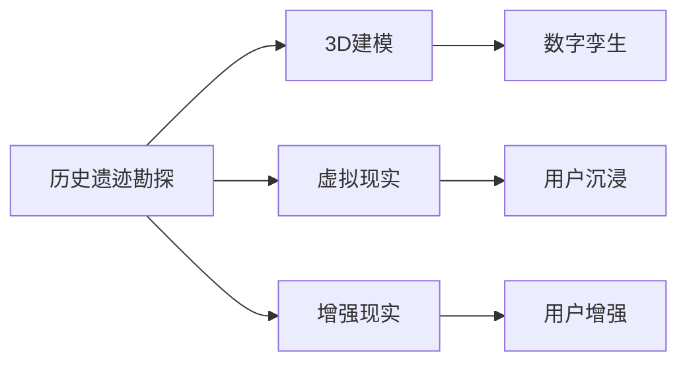

                 

## 1. 背景介绍

### 1.1 历史研究的现状与挑战
历史研究是人类文明传承和发展的基石，旨在通过分析历史事件、文化变迁等要素，了解过去、指导未来。然而，传统历史研究往往受限于资源、技术等因素的制约，难以全面、深入地解析历史事实。随着科技的进步，特别是虚拟技术的兴起，历史研究者正在探索一种全新的研究范式，即数字考古。

### 1.2 数字考古的兴起与意义
数字考古是通过数字化手段，利用虚拟技术复原和分析历史场景，从而进行历史研究的方法。这种新范式不仅能够复原真实历史场景，还能通过模拟推断和虚拟实验，深度揭示历史事件的因果关系和内在规律。数字考古技术包括但不限于3D建模、虚拟现实(VR)、增强现实(AR)、数字孪生等，在历史研究领域展现出巨大的潜力和应用前景。

## 2. 核心概念与联系

### 2.1 核心概念概述
在数字考古领域，核心概念包括：

- **虚拟现实(Virtual Reality, VR)**：通过计算机生成逼真的三维场景，使用户能够沉浸在虚拟环境中进行交互。
- **增强现实(Augmented Reality, AR)**：将虚拟信息叠加在现实世界之上，使用户能够在真实环境中看到虚拟元素。
- **数字孪生(Digital Twin)**：创建与实体对象在物理和虚拟上完全一致的模型，用于模拟、预测和优化实体对象的行为。
- **3D建模(3D Modeling)**：通过数字化手段，构建三维模型以重现历史遗迹和场景。

这些概念共同构成了数字考古的底层技术框架，通过虚拟技术手段，实现对历史场景的深度复原和分析。

### 2.2 核心概念的原理和架构
以下是一个简单的Mermaid流程图，展示了虚拟技术在数字考古中的应用架构：



这个流程图展示了一个典型的工作流程：首先对历史遗迹进行勘探，然后通过3D建模技术将其转化为虚拟场景，之后通过虚拟现实技术提供沉浸式体验，或通过增强现实技术将虚拟信息叠加在实体遗迹之上，最后通过数字孪生技术构建历史场景的模拟模型，便于进行历史分析和实验。

## 3. 核心算法原理 & 具体操作步骤
### 3.1 算法原理概述

数字考古的核心算法原理主要基于虚拟现实和增强现实技术，利用3D建模和数字孪生技术构建历史场景的虚拟模型，并通过传感器、用户交互等手段，获取和分析用户行为数据，从而揭示历史事件的内在规律。

具体而言，数字考古的算法流程包括：

1. **历史遗迹勘探**：通过激光扫描、无人机航拍、遥感技术等手段，获取历史遗迹的详实数据。
2. **3D建模**：利用计算机图形学和逆向工程技术，将勘探数据转化为三维模型。
3. **虚拟现实和增强现实**：在构建的三维模型基础上，通过虚拟现实技术，使用户能够沉浸在虚拟环境中，或通过增强现实技术，在真实环境中叠加虚拟信息。
4. **数字孪生**：将虚拟模型与现实世界中的实体对象关联，进行模拟、预测和优化。
5. **用户行为分析**：通过传感器和用户交互数据，分析用户行为，揭示历史事件的背景和影响。

### 3.2 算法步骤详解

#### 3.2.1 历史遗迹勘探
- **激光扫描**：使用激光扫描仪获取历史遗迹表面的点云数据。
- **无人机航拍**：利用无人机获取高分辨率的历史遗迹影像。
- **遥感技术**：通过卫星或航空摄影，获取大范围的历史遗迹分布信息。

#### 3.2.2 3D建模
- **逆向工程**：对获取的点云数据和影像数据进行逆向工程处理，构建三维模型。
- **建模软件**：使用Autodesk 3ds Max、Blender等软件进行3D建模。
- **纹理贴图**：在3D模型上添加真实纹理，提高模型的逼真度。

#### 3.2.3 虚拟现实和增强现实
- **VR硬件**：选择适合的VR头显设备，如Oculus Rift、HTC Vive等。
- **AR硬件**：选择适合的AR眼镜，如Google Glass、Hololens等。
- **虚拟场景生成**：利用Unity、Unreal Engine等游戏引擎，生成虚拟场景。
- **用户交互**：通过手柄、追踪器等设备，实现用户与虚拟环境的互动。

#### 3.2.4 数字孪生
- **虚拟与实物的关联**：通过物联网(IoT)技术，将虚拟模型与实体对象关联。
- **模拟与预测**：使用仿真软件，进行历史场景的模拟和预测。
- **优化与实验**：在虚拟环境中进行历史实验，优化决策方案。

#### 3.2.5 用户行为分析
- **传感器**：使用位置传感器、姿态传感器等，获取用户行为数据。
- **数据处理**：通过数据分析技术，处理用户行为数据。
- **行为模式识别**：使用机器学习算法，识别用户行为模式。

### 3.3 算法优缺点

#### 3.3.1 优点
- **沉浸体验**：虚拟现实和增强现实技术提供沉浸式体验，使研究者能够更加直观地理解历史场景。
- **多维度分析**：数字孪生技术能够模拟和预测历史场景，提供多维度的分析视角。
- **快速复原**：通过3D建模技术，可以快速复原历史遗迹，加速研究进程。
- **交互式学习**：用户可以通过互动学习历史事件，提高学习效率。

#### 3.3.2 缺点
- **技术门槛高**：虚拟技术和3D建模技术对技术和设备要求较高，成本较高。
- **数据获取难度大**：历史遗迹的勘探和数据获取难度大，需要多种技术手段配合。
- **数据质量问题**：激光扫描、无人机航拍等技术获取的数据可能存在质量问题，需要进一步处理。
- **用户交互复杂**：用户交互设计和实现复杂，需要综合考虑用户需求和技术实现。

### 3.4 算法应用领域

数字考古技术在历史研究领域有广泛的应用，涵盖以下几个方面：

- **考古学**：通过虚拟现实技术，复原考古现场，辅助考古挖掘。
- **历史学**：利用数字孪生技术，进行历史事件的模拟和预测。
- **文化研究**：通过增强现实技术，展示历史遗迹和文物。
- **教育**：通过虚拟现实技术，提供沉浸式学习体验，辅助历史教学。
- **博物馆**：利用数字孪生技术，构建虚拟博物馆，提供互动体验。
- **文化旅游**：通过虚拟现实技术，展示历史遗址，吸引游客。

## 4. 数学模型和公式 & 详细讲解 & 举例说明

### 4.1 数学模型构建

在数字考古中，常用的数学模型包括几何建模、物理模拟和用户行为建模。

- **几何建模**：基于点云数据和影像数据，构建三维模型的数学模型。常用的算法包括三角剖分、多分辨率建模等。
- **物理模拟**：通过力学、热学等物理方程，模拟历史遗迹的物理行为。常用的算法包括粒子系统、流体模拟等。
- **用户行为建模**：基于用户行为数据，构建用户行为模型的数学模型。常用的算法包括时间序列分析、贝叶斯网络等。

### 4.2 公式推导过程

以几何建模为例，假设历史遗迹的3D模型由多个三角形组成，其中三角形的顶点坐标为$\mathbf{P}_1, \mathbf{P}_2, \mathbf{P}_3$，则三角形的面积可以表示为：

$$
A = \frac{1}{2} |\mathbf{P}_1 - \mathbf{P}_3| \times |\mathbf{P}_2 - \mathbf{P}_3| \sin(\theta)
$$

其中，$\theta$为$\mathbf{P}_1 - \mathbf{P}_3$与$\mathbf{P}_2 - \mathbf{P}_3$之间的夹角。

### 4.3 案例分析与讲解

#### 4.3.1 案例背景
某历史考古团队需要复原一座古代城市遗址，通过激光扫描技术获取了大量的点云数据，使用3D建模技术将其转化为三维模型，并通过虚拟现实技术，向公众展示该城市遗址的复原场景。

#### 4.3.2 案例步骤
1. **数据获取**：使用激光扫描仪获取点云数据，无人机航拍获取影像数据。
2. **3D建模**：利用Autodesk 3ds Max进行逆向工程处理，构建三维模型。
3. **虚拟现实**：在Unity引擎中生成虚拟场景，使用Oculus Rift头显设备，提供沉浸式体验。
4. **用户行为分析**：通过位置传感器获取用户行为数据，使用机器学习算法识别行为模式。

#### 4.3.3 案例结果
该考古团队复原了古代城市遗址，通过虚拟现实技术，向公众展示了复原场景，显著提高了历史研究的普及度和互动性。用户行为分析结果显示，公众对虚拟场景的兴趣度显著高于传统历史展品，促进了历史文化的传播和教育。

## 5. 项目实践：代码实例和详细解释说明

### 5.1 开发环境搭建

以下是使用Python和Unity进行数字考古开发的虚拟场景构建流程：

1. **安装Unity**：从Unity官网下载并安装Unity编辑器。
2. **安装Unity Package**：从GitHub下载并安装Unity的3D建模和虚拟现实插件。
3. **安装Python环境**：安装Anaconda，创建Python虚拟环境，安装必要的Python库，如Pillow、NumPy等。
4. **配置开发环境**：设置开发环境变量，配置好Unity和Python环境的路径。

### 5.2 源代码详细实现

以下是一个简单的3D建模和虚拟现实代码实现示例：

```python
import numpy as np
import os
from PIL import Image
from unity3d import UnityEnvironment
import unity3d

# 定义统一数据路径
data_path = os.path.join(os.getcwd(), 'data')

# 定义3D建模函数
def create_model(file_path, output_path):
    # 加载点云数据
    point_cloud = np.loadtxt(file_path, delimiter=',')
    # 生成三角形面
    triangles = []
    for i in range(0, len(point_cloud), 3):
        x, y, z = point_cloud[i:i+3]
        triangles.append([x, y, z])
    # 保存模型文件
    np.savetxt(output_path, triangles, delimiter='\t')

# 定义虚拟现实场景函数
def create_vr_scene(model_path):
    # 创建Unity环境
    env = UnityEnvironment(str(os.path.join(data_path, 'VRScene.unity')))
    # 获取虚拟场景组件
    camera = env.camera
    terrain = env.terrain
    # 加载3D模型
    asset_path = os.path.join(data_path, model_path)
    terrain.LoadAssetFromAssetPath(UnityEnvironmentAssetPathType.File, asset_path)
    # 渲染虚拟场景
    camera.Update(0.01)
    while env.evaluate():
        env.render()

# 主函数
if __name__ == '__main__':
    # 数据路径
    data_path = os.path.join(os.getcwd(), 'data')
    # 点云数据路径
    point_cloud_path = os.path.join(data_path, 'point_cloud.csv')
    # 3D模型路径
    model_path = os.path.join(data_path, 'model.obj')
    # 创建3D模型
    create_model(point_cloud_path, model_path)
    # 创建虚拟现实场景
    create_vr_scene(model_path)
```

### 5.3 代码解读与分析

#### 5.3.1 代码实现细节
1. **3D建模函数**：通过点云数据生成三角形面，并将其保存为.obj文件格式。
2. **虚拟现实场景函数**：通过Unity环境加载3D模型，渲染虚拟场景，并进行交互式体验。

#### 5.3.2 运行结果展示
运行代码后，将生成一个.obj文件格式的三维模型文件，以及一个Unity虚拟现实场景。用户可以通过Unity编辑器打开场景文件，使用Oculus Rift头显设备，体验虚拟现实中的历史遗迹场景。

## 6. 实际应用场景

### 6.1 历史考古

数字考古技术在历史考古中具有广泛的应用，可以用于：

- **历史遗迹勘探**：通过激光扫描、无人机航拍等技术获取历史遗迹数据，生成3D模型。
- **历史场景复原**：利用3D建模和虚拟现实技术，复原历史遗迹场景，辅助考古挖掘。
- **历史事件模拟**：通过数字孪生技术，模拟历史事件，提供多维度分析视角。

### 6.2 历史学研究

数字考古技术在历史学研究中的应用包括：

- **历史事件模拟**：通过物理模拟和数字孪生技术，模拟历史事件，揭示历史事件的因果关系。
- **历史数据可视化**：通过增强现实技术，将历史数据可视化，辅助历史学家的研究。
- **历史模型验证**：通过虚拟实验，验证历史模型的准确性，优化历史模型。

### 6.3 文化教育

数字考古技术在文化教育中的应用包括：

- **历史场景复原**：通过虚拟现实技术，复原历史场景，提供沉浸式学习体验。
- **历史文物展示**：通过增强现实技术，展示历史文物，提升学生的学习兴趣。
- **历史事件互动**：通过交互式学习平台，让学生通过互动了解历史事件。

### 6.4 文化旅游

数字考古技术在文化旅游中的应用包括：

- **历史遗迹展示**：通过虚拟现实技术，展示历史遗迹，吸引游客。
- **历史场景互动**：通过增强现实技术，提供互动体验，增强游客的参与感。
- **历史事件重现**：通过虚拟现实技术，重现历史事件，提供沉浸式旅游体验。

## 7. 工具和资源推荐

### 7.1 学习资源推荐

为了帮助开发者系统掌握数字考古技术，这里推荐一些优质的学习资源：

1. **Unity官方文档**：Unity编辑器和3D建模插件的官方文档，详细介绍了虚拟现实和增强现实开发的技术细节。
2. **ARKit和ARCore官方文档**：Apple和Google提供的增强现实开发框架的官方文档，提供了丰富的开发指南和样例代码。
3. **Virtual Archaeology in a Digital Age**：一本详细介绍虚拟考古技术的书籍，涵盖了虚拟现实、增强现实和3D建模技术。
4. **Digital Archaeology: Techniques, Methods and Tools**：一本详细介绍数字考古技术的书籍，涵盖了虚拟现实、增强现实、数字孪生和3D建模技术。

### 7.2 开发工具推荐

以下是几款用于数字考古开发的常用工具：

1. **Unity**：一个强大的游戏引擎，支持3D建模和虚拟现实开发。
2. **Blender**：一个开源的3D建模软件，支持多种3D建模格式。
3. **Autodesk 3ds Max**：一个广泛使用的3D建模软件，支持复杂的3D建模和动画制作。
4. **Hololens和Oculus Rift**：常用的增强现实和虚拟现实设备，提供了丰富的交互体验。
5. **Unity Analytics**：Unity提供的用户行为分析工具，支持对用户行为数据进行分析和建模。

### 7.3 相关论文推荐

数字考古技术的发展离不开学术研究的推动。以下是几篇奠基性的相关论文，推荐阅读：

1. **Virtual Archaeology: Integrating Historical Research with Computer Science**：探讨虚拟技术在历史考古中的应用，强调了虚拟考古的潜力和前景。
2. **A Survey on Digital Archaeology: Technologies and Applications**：对数字考古技术进行了全面回顾，涵盖了虚拟现实、增强现实、3D建模和数字孪生技术。
3. **Virtual Reality and AR in Historical Research: A Review**：对虚拟现实和增强现实技术在历史研究中的应用进行了深入探讨，强调了虚拟考古的多维度和沉浸体验。

## 8. 总结：未来发展趋势与挑战

### 8.1 研究成果总结
数字考古技术在历史研究领域已经展现出强大的潜力，通过虚拟技术手段，复原和分析历史场景，揭示历史事件的因果关系，提供了多维度的分析视角。虚拟现实、增强现实、3D建模和数字孪生技术构成了数字考古的核心技术框架，在考古学、历史学、文化教育、文化旅游等多个领域具有广泛的应用前景。

### 8.2 未来发展趋势

#### 8.2.1 技术融合
未来的数字考古技术将更多地与其他技术进行融合，如人工智能、物联网、区块链等，实现更为全面和智能的历史研究。

#### 8.2.2 数据共享
随着数据共享技术的不断发展，历史数据将更加开放和可访问，促进全球历史学家的合作研究。

#### 8.2.3 用户参与
数字考古技术将更加注重用户参与，通过虚拟现实和增强现实技术，提供沉浸式学习体验，增强用户的学习兴趣和参与感。

### 8.3 面临的挑战

#### 8.3.1 数据获取
历史遗迹的勘探和数据获取难度大，需要多种技术手段配合，数据获取成本高。

#### 8.3.2 技术门槛
虚拟技术和3D建模技术对技术和设备要求较高，技术门槛高。

#### 8.3.3 数据质量
激光扫描、无人机航拍等技术获取的数据可能存在质量问题，需要进行数据预处理和清洗。

### 8.4 研究展望

#### 8.4.1 自动化建模
开发自动化3D建模算法，减少人工干预，提高建模效率。

#### 8.4.2 智能模拟
引入人工智能算法，提高物理模拟的精度和复杂度，提供更准确的模拟结果。

#### 8.4.3 数据驱动分析
利用大数据分析技术，对历史数据进行深度挖掘，揭示历史事件的深层次规律。

## 9. 附录：常见问题与解答

**Q1: 数字考古技术对历史研究有哪些具体应用？**

A: 数字考古技术在历史研究中有广泛应用，具体包括：

1. **历史遗迹勘探**：通过激光扫描、无人机航拍等技术获取历史遗迹数据，生成3D模型。
2. **历史场景复原**：利用3D建模和虚拟现实技术，复原历史遗迹场景，辅助考古挖掘。
3. **历史事件模拟**：通过数字孪生技术，模拟历史事件，提供多维度分析视角。
4. **历史数据可视化**：通过增强现实技术，将历史数据可视化，辅助历史学家的研究。
5. **历史模型验证**：通过虚拟实验，验证历史模型的准确性，优化历史模型。

**Q2: 数字考古技术在虚拟现实和增强现实开发中，需要注意哪些关键问题？**

A: 数字考古技术在虚拟现实和增强现实开发中，需要注意以下几个关键问题：

1. **数据获取和处理**：历史遗迹的勘探和数据获取难度大，需要多种技术手段配合，数据获取成本高。
2. **技术门槛**：虚拟技术和3D建模技术对技术和设备要求较高，技术门槛高。
3. **数据质量**：激光扫描、无人机航拍等技术获取的数据可能存在质量问题，需要进行数据预处理和清洗。
4. **用户交互设计**：虚拟现实和增强现实技术提供沉浸式体验，用户交互设计和实现复杂，需要综合考虑用户需求和技术实现。

**Q3: 数字考古技术在未来有哪些发展趋势？**

A: 数字考古技术在未来有如下发展趋势：

1. **技术融合**：未来的数字考古技术将更多地与其他技术进行融合，如人工智能、物联网、区块链等，实现更为全面和智能的历史研究。
2. **数据共享**：随着数据共享技术的不断发展，历史数据将更加开放和可访问，促进全球历史学家的合作研究。
3. **用户参与**：数字考古技术将更加注重用户参与，通过虚拟现实和增强现实技术，提供沉浸式学习体验，增强用户的学习兴趣和参与感。

**Q4: 数字考古技术在实际应用中，有哪些挑战和解决方案？**

A: 数字考古技术在实际应用中面临以下几个挑战：

1. **数据获取**：历史遗迹的勘探和数据获取难度大，需要多种技术手段配合，数据获取成本高。
2. **技术门槛**：虚拟技术和3D建模技术对技术和设备要求较高，技术门槛高。
3. **数据质量**：激光扫描、无人机航拍等技术获取的数据可能存在质量问题，需要进行数据预处理和清洗。
4. **用户交互设计**：虚拟现实和增强现实技术提供沉浸式体验，用户交互设计和实现复杂，需要综合考虑用户需求和技术实现。

这些挑战可以通过多种解决方案应对，例如：

- **数据共享**：通过建立开放的数据共享平台，促进数据获取和共享。
- **技术改进**：引入先进的3D建模和虚拟现实技术，降低技术门槛，提高效率。
- **数据清洗**：采用数据清洗技术，提高数据质量，减少噪声干扰。
- **用户参与**：设计用户友好的交互界面，提高用户参与度和体验感。

---

作者：禅与计算机程序设计艺术 / Zen and the Art of Computer Programming

