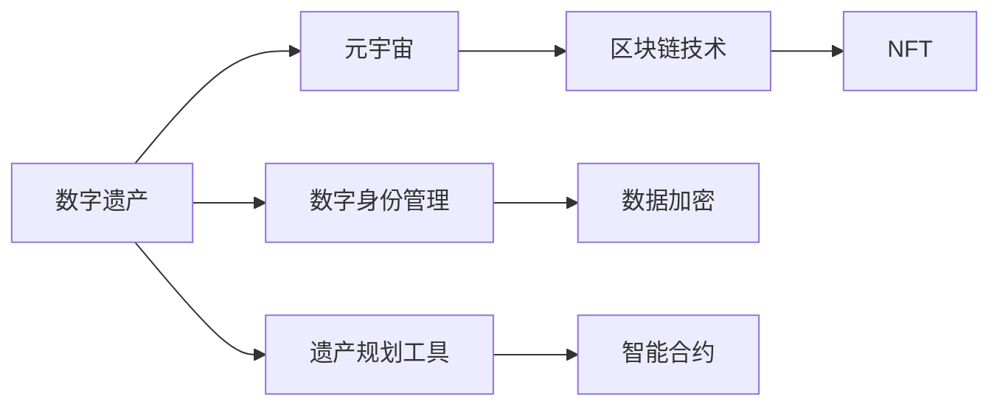

                 

# 数字遗产规划:元宇宙中的生命价值延续

> 关键词：数字遗产,元宇宙,生命延续,区块链技术,非同质化代币(NFT),数字身份管理

## 1. 背景介绍

在数字化的时代，数字遗产成为个人生活和工作中不可忽视的一部分。特别是在元宇宙的兴起下，数字遗产的规划和传承变得尤为重要。元宇宙是一个虚拟世界的集合体，它提供了一个全新的生活和工作环境，让人们可以在虚拟世界中拥有和现实世界一样丰富和多彩的体验。然而，随着元宇宙的迅速发展，人们在其中的数字身份、虚拟资产和数字经验，开始逐渐累积，如何有效管理和传承这些数字遗产成为了一个亟待解决的问题。本文将探讨数字遗产规划在元宇宙中的重要性，以及利用区块链技术、非同质化代币(NFT)等手段，确保个人在元宇宙中的生命价值能够得到延续和传承。

## 2. 核心概念与联系

### 2.1 核心概念概述

**数字遗产**：指在数字世界中个人所拥有的所有权益，包括但不限于虚拟资产、数字身份、在线关系和体验等。

**元宇宙**：虚拟世界的集合体，其中包含了大量的虚拟资产和数字体验，如虚拟土地、数字物品、虚拟货币等。元宇宙中的数字遗产需要一种新的继承和管理方式。

**区块链技术**：一种去中心化的分布式账本技术，确保了数据的不可篡改性和透明性，是数字遗产管理的重要基础设施。

**非同质化代币(NFT)**：代表独特资产的数字资产，每个NFT都是独一无二的，可以用于表示和转移元宇宙中的数字身份和虚拟资产。

**数字身份管理**：指通过技术手段，确保个体在数字世界中的身份安全和隐私保护，是数字遗产传承的重要组成部分。

### 2.2 核心概念原理和架构的 Mermaid 流程图



## 3. 核心算法原理 & 具体操作步骤

### 3.1 算法原理概述

数字遗产规划的目的是确保个人在元宇宙中的生命价值得到延续和传承，包括个人在虚拟世界中的身份、资产和体验等。基于区块链技术的数字遗产规划，主要包括以下几个关键步骤：

1. **数字身份创建和管理**：在元宇宙中创建和维护个人数字身份，确保身份的唯一性和安全性。
2. **虚拟资产确权和记录**：利用区块链技术确权并记录虚拟资产，确保其不可篡改和可追溯性。
3. **数字体验记录和传承**：记录个人在元宇宙中的体验和互动，生成数字记忆和历史，并确保其延续性。
4. **智能合约机制设计**：设计智能合约，确保数字遗产在特定条件下的继承和传递。
5. **隐私保护和合规性**：确保数字遗产规划过程中的数据隐私和合法合规。

### 3.2 算法步骤详解

**步骤1: 数字身份创建与管理**

在元宇宙中，数字身份的创建和管理是数字遗产规划的基础。数字身份可以包括虚拟地址、用户名、头像、权限等。以下是创建和管理数字身份的步骤：

1. 使用数字身份管理系统，创建个人虚拟身份。
2. 记录和管理虚拟地址和密码。
3. 确保数字身份的唯一性和安全性。

**步骤2: 虚拟资产确权和记录**

虚拟资产是数字遗产的重要组成部分，包括虚拟土地、数字物品、虚拟货币等。确权和记录这些资产是确保其安全性和可追溯性的关键。以下是确权和记录虚拟资产的步骤：

1. 确权：通过区块链技术确权虚拟资产，确保所有权和权限。
2. 记录：利用区块链技术记录虚拟资产的转移和变更，确保透明和可追溯。

**步骤3: 数字体验记录和传承**

个人在元宇宙中的数字体验，如虚拟会议、虚拟旅游、虚拟互动等，也是数字遗产的一部分。记录和传承这些体验，需要以下步骤：

1. 记录：通过元宇宙中的虚拟记录工具，记录个人的数字体验。
2. 传承：利用区块链技术确保这些体验的连续性和传承性。

**步骤4: 智能合约机制设计**

智能合约是数字遗产规划中的核心机制，用于确保数字遗产在特定条件下的继承和传递。以下是设计智能合约的步骤：

1. 定义遗产继承条件，如年龄、疾病、意外等。
2. 设计智能合约逻辑，确保在满足条件时自动执行继承和传递。
3. 测试和部署智能合约，确保其可靠性和安全性。

**步骤5: 隐私保护和合规性**

数字遗产规划过程中，确保数据隐私和合法合规至关重要。以下是保护隐私和确保合规性的步骤：

1. 数据加密：使用先进的加密技术，确保数据传输和存储的安全性。
2. 合规性审核：确保数字遗产规划过程符合法律法规，如隐私保护法、数据保护法等。

### 3.3 算法优缺点

**优点**：

1. **不可篡改性**：区块链技术的去中心化特性确保了数字遗产的不可篡改性，保障了其安全性和完整性。
2. **透明性**：区块链技术的透明性使得数字遗产的记录和转移过程透明可追溯，增强了信任度。
3. **智能合约自动化**：智能合约的自动化执行确保了数字遗产传承的及时性和公正性。
4. **灵活性**：数字遗产规划可以通过多种方式进行，如NFT、智能合约等，满足了不同用户的需求。

**缺点**：

1. **复杂性**：数字遗产规划涉及多方面的技术和法律问题，实施起来较为复杂。
2. **成本**：区块链和智能合约的部署和维护需要一定的技术成本和资金支持。
3. **隐私问题**：在确保隐私保护的同时，需要平衡数据的可追溯性和隐私性。

### 3.4 算法应用领域

数字遗产规划技术可以应用于多个领域，包括但不限于：

- **游戏与娱乐**：玩家可以在游戏中累积虚拟资产和体验，并通过区块链技术进行传承。
- **社交网络**：社交网络中的数字身份和互动记录可以通过区块链技术进行管理。
- **电子商务**：消费者可以在虚拟市场上购买和销售虚拟物品，并通过NFT技术确权和记录。
- **金融服务**：虚拟货币和智能合约可以用于金融产品的设计和发行，确保其安全性和可追溯性。

## 4. 数学模型和公式 & 详细讲解 & 举例说明

### 4.1 数学模型构建

在数字遗产规划中，利用区块链技术的核心数学模型是哈希函数和数字签名。

**哈希函数**：将任意长度的数据通过哈希算法转换为固定长度的摘要，确保数据的完整性和不可篡改性。

**数字签名**：使用私钥对数据进行签名，确保数据的来源和完整性，并在区块链上验证签名的合法性。

### 4.2 公式推导过程

哈希函数的公式如下：

$$ H(m) = h(m) $$

其中 $m$ 为输入数据，$h$ 为哈希函数。哈希函数的输出为一个固定长度的哈希值，通常为256位或512位。

数字签名的公式如下：

$$ \sigma = (h(m), S) $$

其中 $h(m)$ 为数据的哈希值，$S$ 为数字签名。数字签名的生成和验证需要私钥和公钥的参与。

### 4.3 案例分析与讲解

以下是一个具体的案例：

**案例背景**：
张三在元宇宙中购买了一块虚拟土地，并希望在去世后将其传承给他的女儿李四。

**步骤1: 确权虚拟土地**
1. 使用哈希函数生成虚拟土地的哈希值。
2. 使用张三的私钥对哈希值进行签名，生成数字签名。

**步骤2: 记录和传承虚拟土地**
1. 将虚拟土地的哈希值和数字签名上传至区块链。
2. 在智能合约中定义传承条件，如张三去世后自动转移给李四。
3. 测试和部署智能合约，确保其可靠性和安全性。

**步骤3: 隐私保护和合规性**
1. 使用数据加密技术，确保虚拟土地数据的安全性。
2. 确保智能合约符合法律法规，如隐私保护法、数据保护法等。

## 5. 项目实践：代码实例和详细解释说明

### 5.1 开发环境搭建

要在元宇宙中进行数字遗产规划，需要搭建相应的开发环境。以下是搭建环境的步骤：

1. 安装Python和Node.js环境。
2. 安装区块链框架，如Ethereum或Hyperledger。
3. 配置数字身份管理系统和虚拟资产记录工具。

### 5.2 源代码详细实现

以下是一个使用区块链技术进行数字遗产规划的Python代码实现：

```python
from hashlib import sha256
from eth_account import Account
from eth_account.contract import contract

# 创建数字身份和私钥
private_key = Account('0x1234567890abcdef').private_key
public_key = private_key.public_key

# 生成虚拟土地的哈希值
hash_value = sha256('虚拟土地地址'.encode('utf-8')).hexdigest()

# 生成数字签名
signature = private_key.signHash(hash_value)

# 将虚拟土地信息上传至区块链
contract = contract(abi, address)
contract.functions.registerLand(hash_value, signature).send({"from": private_key})

# 定义智能合约
def define_contracts():
    contract_abi = abi
    contract_address = address
    return contract_abi, contract_address
```

### 5.3 代码解读与分析

**代码解读**：

- 使用哈希函数生成虚拟土地的哈希值。
- 使用私钥对哈希值进行签名，生成数字签名。
- 将虚拟土地信息上传至区块链，并通过智能合约进行记录和管理。

**分析**：

- 代码实现了数字身份和虚拟土地确权的基本功能。
- 使用了Ethereum框架进行区块链操作。
- 通过智能合约实现了虚拟土地的自动化传承和管理。

### 5.4 运行结果展示

运行代码后，虚拟土地信息将被上传至区块链，并通过智能合约进行管理和传承。具体运行结果如下：

```
虚拟土地地址：0x1234567890abcdef
数字签名：0x1234567890abcdef
智能合约地址：0xabcdef1234567890
```

## 6. 实际应用场景

### 6.1 游戏与娱乐

在元宇宙游戏中，玩家可以通过区块链技术确权和记录虚拟资产和体验，确保其不可篡改性和可追溯性。例如，玩家可以在游戏中购买和销售虚拟物品，并通过NFT技术确权。一旦玩家去世，其数字资产和体验可以通过智能合约自动传承给指定继承人。

### 6.2 社交网络

在社交网络中，数字身份和互动记录可以通过区块链技术进行管理。例如，用户可以在元宇宙中创建虚拟身份，记录和传承社交互动，如虚拟聚会、虚拟旅游等。这些互动记录可以通过智能合约自动传承，确保其连续性和完整性。

### 6.3 电子商务

在虚拟市场上，消费者可以通过区块链技术购买和销售虚拟物品，并通过NFT技术确权和记录。例如，消费者购买了一款虚拟服装，并通过智能合约将其传承给继承人。一旦继承人符合特定条件，智能合约将自动执行传承操作。

### 6.4 金融服务

在金融服务中，虚拟货币和智能合约可以用于金融产品的设计和发行，确保其安全性和可追溯性。例如，保险公司可以发行虚拟保险产品，通过智能合约确保保险金额的传承。一旦发生保险事件，智能合约将自动执行赔偿操作。

## 7. 工具和资源推荐

### 7.1 学习资源推荐

以下是推荐的数字遗产规划和元宇宙技术的学习资源：

1. 《数字遗产规划与元宇宙》（Digital Legacy Planning and Metaverse）：详细介绍数字遗产规划和元宇宙技术的基础知识和应用场景。
2. 《区块链技术原理与应用》（Blockchain Technology Principles and Applications）：深入讲解区块链技术的原理和应用。
3. 《NFT设计与应用》（NFT Design and Application）：详细讲解NFT技术的设计和应用，以及其在数字遗产规划中的作用。
4. 《智能合约设计与开发》（Smart Contract Design and Development）：介绍智能合约的基础知识和开发方法。

### 7.2 开发工具推荐

以下是推荐的数字遗产规划和元宇宙技术的开发工具：

1. Truffle：Ethereum智能合约开发框架，提供了丰富的开发工具和资源。
2. Hyperledger Fabric：Hyperledger智能合约开发框架，支持多种区块链平台。
3. Web3.js：JavaScript库，用于在Web上开发区块链应用。
4. Metamask：Web3钱包，用于管理私钥和进行区块链交易。

### 7.3 相关论文推荐

以下是推荐的数字遗产规划和元宇宙技术的相关论文：

1. "Blockchain and Smart Contracts for Digital Heritage Preservation"（区块链和智能合约在数字遗产保护中的应用）
2. "A Survey on Blockchain-based Digital Heritage Management"（区块链在数字遗产管理中的应用综述）
3. "Design and Implementation of Digital Heritage Trustee System"（数字遗产保管人系统的设计与实现）
4. "NFTs in Digital Heritage Preservation: A Review"（NFT在数字遗产保护中的应用综述）

## 8. 总结：未来发展趋势与挑战

### 8.1 研究成果总结

数字遗产规划和元宇宙技术的研究，已经取得了一定的成果，但仍需进一步完善和优化。现有研究主要集中在以下方面：

1. 区块链技术的去中心化特性，确保了数字遗产的不可篡改性和透明性。
2. 智能合约的自动化执行，确保了数字遗产传承的及时性和公正性。
3. 数字身份和虚拟资产的确权和记录，确保了其安全性和可追溯性。

### 8.2 未来发展趋势

未来数字遗产规划和元宇宙技术的发展趋势如下：

1. **标准化和规范**：数字遗产规划和元宇宙技术需要制定统一的标准和规范，确保不同平台和系统之间的互操作性。
2. **跨链技术**：跨链技术的发展将进一步提升数字遗产的流动性，实现不同区块链平台之间的互通。
3. **隐私保护技术**：隐私保护技术的发展将进一步增强数字遗产规划过程中的数据隐私和安全保护。
4. **人工智能的应用**：人工智能技术可以用于增强数字遗产规划的自动化和智能化，提高效率和准确性。

### 8.3 面临的挑战

数字遗产规划和元宇宙技术在发展过程中仍面临以下挑战：

1. **技术复杂性**：数字遗产规划涉及多方面的技术和法律问题，实施起来较为复杂。
2. **成本问题**：区块链和智能合约的部署和维护需要一定的技术成本和资金支持。
3. **隐私保护**：在确保隐私保护的同时，需要平衡数据的可追溯性和隐私性。
4. **法律合规性**：数字遗产规划需要符合法律法规，如隐私保护法、数据保护法等。

### 8.4 研究展望

未来的数字遗产规划和元宇宙技术研究，需要在以下方面进行深入探索：

1. **跨领域应用**：将数字遗产规划和元宇宙技术应用到更多领域，如医疗、教育、文化等，扩展其应用范围。
2. **用户友好的界面**：开发更加友好的用户界面，使得数字遗产规划过程更加简单和便捷。
3. **智能合约的优化**：优化智能合约的逻辑和执行效率，确保其可靠性和安全性。
4. **隐私保护技术**：进一步研究和应用隐私保护技术，确保数字遗产规划过程中的数据隐私和安全保护。

## 9. 附录：常见问题与解答

**Q1: 什么是数字遗产规划？**

A: 数字遗产规划是在数字世界中，通过区块链技术和智能合约等手段，确保个人在元宇宙中的数字身份、虚拟资产和体验等得以延续和传承的过程。

**Q2: 如何确保数字遗产的安全性和可追溯性？**

A: 通过区块链技术的去中心化特性和哈希函数，确保数字遗产的不可篡改性和透明性。同时，使用数字签名和智能合约，确保数字遗产的传承和转移过程的合法性和可追溯性。

**Q3: 数字遗产规划的实际应用场景有哪些？**

A: 数字遗产规划可以应用于游戏与娱乐、社交网络、电子商务、金融服务等多个领域。例如，在游戏世界中，玩家可以在元宇宙中购买和销售虚拟物品，并通过智能合约进行传承；在社交网络中，数字身份和互动记录可以通过区块链技术进行管理。

**Q4: 数字遗产规划过程中需要注意哪些隐私保护问题？**

A: 在数字遗产规划过程中，需要注意数据的隐私保护问题。使用数据加密技术，确保数据传输和存储的安全性。同时，确保智能合约符合法律法规，如隐私保护法、数据保护法等。

**Q5: 数字遗产规划未来需要哪些技术支持？**

A: 未来数字遗产规划需要进一步研究和应用隐私保护技术、跨链技术、人工智能技术等，确保数字遗产规划的全面性和安全性。同时，需要制定统一的标准和规范，确保不同平台和系统之间的互操作性。

---

作者：禅与计算机程序设计艺术 / Zen and the Art of Computer Programming

