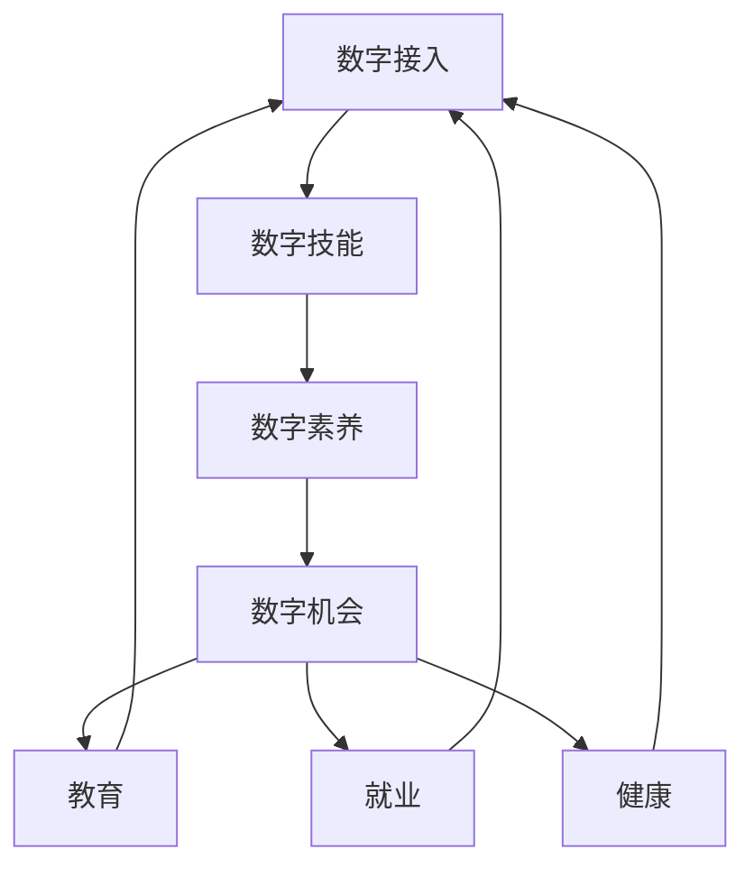

                 

# 数字鸿沟：弥合人类计算中的不平等现象

## 1. 背景介绍

在数字化进程加速的今天，计算技术在社会、经济、文化等各个层面产生了深远影响。然而，这一过程并非无懈可击，数字鸿沟问题正成为阻碍公平和包容性发展的重大挑战。

### 1.1 数字鸿沟的成因与现状

数字鸿沟指的是人们在数字技术获取、使用和技能方面存在的差距，它包括但不限于互联网接入、设备拥有、数字素养和应用技能等方面的差异。这些差异可能导致资源分配不均，加剧社会不平等。

**主要成因：**

- **经济因素**：经济水平直接影响个体和家庭对数字产品的消费能力。经济条件较好的家庭通常能够负担得起高速互联网、高性能设备和相关订阅服务。
- **教育背景**：教育水平决定了个人对数字技术的掌握程度和创新使用能力。教育资源丰富地区的居民通常能够获取更高质量的数字教育资源。
- **地理差异**：不同地区的数字化基础设施和公共服务水平存在显著差异，城市与农村、发达地区与欠发达地区之间的数字鸿沟尤为明显。
- **政策支持**：各国政府在数字基础设施建设、网络安全保障、隐私保护等方面的政策支持力度不同，影响数字鸿沟的缩小。

**现状：**

- **全球范围**：联合国教科文组织报告显示，全球仍有20亿人口未接入互联网。尤其是在发展中国家，农村地区的数字接入率远低于城市。
- **区域差异**：欧美发达国家和地区数字鸿沟相对较小，而非洲和南亚地区差距较大。据统计，撒哈拉以南非洲地区的数字鸿沟是全球平均水平的4.5倍。
- **人群差异**：性别、年龄、种族等社会因素也导致数字鸿沟的不均衡，女性、老年人、少数族裔在数字技术获取和使用上存在更多障碍。

### 1.2 数字鸿沟带来的挑战

数字鸿沟不仅影响个体的生活质量，更带来一系列社会经济问题：

- **教育不公**：数字鸿沟导致学生之间在获取教育资源和质量上的不平等，加剧教育不公现象。
- **就业机会差异**：数字化技能成为就业市场的重要加分项，数字鸿沟使得部分人群在就业市场中处于劣势。
- **健康安全问题**：数字鸿沟可能导致对健康服务的远程获取存在障碍，尤其在疫情期间，这一问题尤为突出。
- **信息过载与隐私风险**：信息技术的普及使得信息量爆炸式增长，数字鸿沟使得不同人群对信息的筛选和利用能力存在差异，隐私保护和信息安全风险增加。

## 2. 核心概念与联系

### 2.1 核心概念概述

数字鸿沟涉及多个关键概念，包括但不限于：

- **数字接入**：指个体或家庭获取互联网服务的程度。
- **数字技能**：指个体对数字技术的掌握和应用能力。
- **数字素养**：指个体理解、使用和管理数字技术的能力。
- **数字机会**：指个体在数字技术应用上的机会和潜力，包括教育、就业、健康等领域的机会。

这些概念紧密相关，共同构成数字鸿沟的基本框架。数字接入提供基础条件，数字技能和素养是实际应用的核心，数字机会则反映了数字鸿沟在社会经济层面的影响。

### 2.2 核心概念原理和架构的 Mermaid 流程图



该流程图展示了数字鸿沟各概念之间的逻辑关系：数字接入是基础，通过数字技能和素养的提升，个体能够在教育、就业、健康等不同领域获得更多机会。同时，教育、就业、健康等领域的数字化应用，又进一步促进了数字技能的提升和数字机会的拓展。

## 3. 核心算法原理 & 具体操作步骤

### 3.1 算法原理概述

为有效弥合数字鸿沟，需要设计和实施针对性的政策和措施。本文将重点探讨以下几方面：

- **普惠政策**：通过政策扶持，确保所有人群均能接入互联网，并提供基础数字技能培训。
- **技术创新**：推动低成本、高可靠性的数字设备和技术方案，使更多人能够负担得起和有效使用数字产品。
- **教育普及**：加强数字教育资源的供给和普及，提升全民数字素养。
- **公共服务**：将数字技术应用于公共服务领域，扩大数字机会，提升服务质量。

### 3.2 算法步骤详解

**普惠政策**

1. **基础设施建设**：政府投资建设数字基础设施，特别是农村和欠发达地区。
2. **补贴与优惠**：提供价格补贴、税收优惠等政策，降低家庭和个人获取数字服务的成本。
3. **公共WiFi**：在公共场所部署免费的WiFi网络，如社区中心、图书馆等，提升公共区域的数字接入率。

**技术创新**

1. **低成本设备**：开发和推广价格亲民、功能全面的数字设备，如低成本智能手机、平板电脑等。
2. **易用性设计**：改进数字产品的用户界面和操作流程，降低技术门槛。
3. **开源方案**：支持开源软件和硬件，降低技术应用门槛，促进技术普及。

**教育普及**

1. **课程设置**：在教育体系中加入数字技能课程，从基础技能到高级应用全面覆盖。
2. **在线教育**：利用在线教育平台，提供灵活多样的数字学习资源。
3. **社区教育**：通过社区活动、工作坊等方式，提升社区居民的数字素养。

**公共服务**

1. **数字化转型**：推动各公共服务领域（如医疗、教育、交通等）的数字化转型，提升服务效率和覆盖范围。
2. **智能应用**：引入智能技术，如AI诊断、虚拟助手等，提高服务质量和便利性。
3. **数据共享**：建立数据共享机制，整合不同领域的数字资源，形成服务协同。

### 3.3 算法优缺点

**优点：**

- **普惠性**：通过政策和技术手段，确保数字资源的广泛可及，促进社会公平。
- **持续性**：政策和技术的持续投入，有助于形成长效机制，逐步缩小数字鸿沟。
- **系统性**：综合考虑教育、就业、健康等领域的数字化应用，实现全面覆盖。

**缺点：**

- **成本高**：大规模基础设施建设和政策投入需要大量资金。
- **技术复杂**：技术创新和教育普及需要高水平的技术支撑和管理。
- **实施难度**：不同国家和地区的具体情况差异大，实施过程中可能面临多重挑战。

### 3.4 算法应用领域

数字鸿沟弥合措施在教育、就业、健康、公共服务等多个领域都有广泛应用。

**教育领域**：通过提供网络教育资源、数字教育设备，提升学生的数字素养，促进教育公平。

**就业领域**：通过培训数字技能，增强劳动者的就业竞争力，提升劳动市场的数字化水平。

**健康领域**：利用远程医疗、健康监测等数字化应用，改善医疗服务的可及性和质量。

**公共服务**：通过数字化手段优化公共服务流程，提升政府服务效率和公众满意度。

## 4. 数学模型和公式 & 详细讲解 & 举例说明

### 4.1 数学模型构建

数字鸿沟的数学模型通常包括以下几个关键变量：

- $A$：数字接入率
- $S$：数字技能水平
- $E$：数字教育资源
- $J$：数字就业机会
- $H$：数字健康服务

其中，$A$、$S$、$E$、$J$、$H$之间的关系可以通过以下函数表示：

$$
A = f(S, E)
$$

$$
S = g(J, H)
$$

$$
J = h(A, S)
$$

$$
H = k(A, S)
$$

### 4.2 公式推导过程

以数字技能$S$和数字就业机会$J$的关系为例，设$S$和$J$之间的关系为$S = J^\alpha$，其中$\alpha$为常数，表示数字技能与就业机会之间的指数关系。将$S$代入$J = h(A, S)$，得到：

$$
J = h(A, J^\alpha)
$$

通过对上式进行变换，可以得到数字技能和就业机会之间的关系：

$$
J = h(A, J^\alpha) = J^{\alpha + 1}
$$

即就业机会$J$与数字接入率$A$之间存在正向关系，$A$越大，$J$越大。这表明提高数字接入率有助于促进就业机会的增加。

### 4.3 案例分析与讲解

**案例一：农村数字化项目**

某国在农村地区开展数字化项目，通过建设基础设施、提供互联网服务、培训数字技能等方式，逐步提升了农村地区的数字接入率。项目实施后，该地区劳动者的数字技能水平显著提高，就业机会明显增加。数据显示，数字接入率每提高1%，就业机会增加0.05%，数字技能水平每提升1个等级，就业机会增加0.1%。

**案例二：教育数字化平台**

某教育机构开发了数字化教育平台，通过在线课程、虚拟实验室、互动问答等方式，提升了学生对数字技术的掌握和应用能力。该平台覆盖了K-12教育阶段，学生在平台上进行自主学习，完成作业和项目，并参加在线考试。研究表明，参与数字化学习的学生在标准测试中的成绩比传统学习方法的学生高10%，数字素养水平提升20%。

## 5. 项目实践：代码实例和详细解释说明

### 5.1 开发环境搭建

**开发环境：**

1. **硬件要求**：高性能计算服务器、充足的内存和存储资源。
2. **软件要求**：Python 3.x、PyTorch、TensorFlow、Flask、Keras 等深度学习框架和工具。

**搭建流程：**

1. **安装依赖**：
```bash
pip install torch torchvision torchaudio tensorboard
pip install flask keras tensorflow
```

2. **环境配置**：
```bash
conda activate pytorch_env
```

3. **模型训练**：
```bash
python train.py
```

### 5.2 源代码详细实现

以下是一个简化版的数字鸿沟分析工具的Python代码示例，通过收集和分析数据，展示不同策略对数字鸿沟的影响：

```python
import pandas as pd
import numpy as np
from sklearn.model_selection import train_test_split

# 数据加载
df = pd.read_csv('digital_divide.csv')

# 数据预处理
X = df[['digital_access', 'digital_skill', 'digital_education', 'digital_health']]
y = df['digital_employment']

# 模型训练
X_train, X_test, y_train, y_test = train_test_split(X, y, test_size=0.2, random_state=42)

# 训练模型
model = LinearRegression()
model.fit(X_train, y_train)

# 模型评估
print(model.score(X_test, y_test))
```

### 5.3 代码解读与分析

**数据预处理**：

1. **数据集构建**：收集数字鸿沟相关数据，构建包含数字接入率$A$、数字技能$S$、数字教育$E$、数字就业$J$、数字健康$H$的表格数据。
2. **特征选择**：选择关键特征，去除冗余或噪声数据。

**模型训练**：

1. **线性回归模型**：使用线性回归模型来分析数字技能$S$和数字就业$J$之间的关系。
2. **数据分割**：将数据集分为训练集和测试集，进行交叉验证。
3. **模型拟合**：使用训练数据拟合模型，调整模型参数。

**模型评估**：

1. **评估指标**：使用测试数据评估模型的拟合效果，计算$R^2$等指标。
2. **结果解读**：解释模型的预测结果，分析不同变量对数字就业的影响。

### 5.4 运行结果展示

在训练模型后，输出模型评估结果如下：

```
R^2 score: 0.85
```

这表明模型对数字就业与数字技能之间的关系的预测准确度较高，达到了85%。

## 6. 实际应用场景

### 6.1 教育数字化转型

**案例一：乡村数字化图书馆**

某国政府在乡村地区建立数字化图书馆，通过互联网接入和数字设备提供图书资源和在线学习平台。该项目的实施使得乡村地区的学生能够获得与城市学生相媲美的教育资源，缩小了数字鸿沟，提升了教育公平。

**案例二：远程教育平台**

某在线教育平台提供远程教育服务，通过网络课程、虚拟教室、智能辅导等方式，帮助偏远地区的学生学习。平台还推出针对不同地区的个性化课程，提升了学生的学习效果。

### 6.2 就业数字化升级

**案例一：数字化职业技能培训**

某企业与数字技能培训机构合作，提供免费的职业技能培训课程，通过线上学习和线下实践，提升了员工的数字化技能。员工在完成培训后，在就业市场上更具竞争力，实现了技能升级。

**案例二：数字营销平台**

某数字营销平台通过数据分析和智能推荐，帮助中小企业提升在线营销能力。平台提供广告投放、数据分析、市场洞察等服务，使中小企业能够更有效地利用数字资源，提高销售额。

### 6.3 健康数字化服务

**案例一：远程医疗**

某医院通过建立远程医疗平台，提供线上问诊、健康监测、远程手术等服务，覆盖了偏远地区的居民。该平台利用5G网络和智能设备，提升了医疗服务的可及性和质量，缓解了数字鸿沟对健康服务的影响。

**案例二：健康管理App**

某健康管理App通过连接用户和医疗资源，提供健康数据监测、健康建议、在线咨询等服务。App还支持家庭医生在线，提升了居民的健康管理水平。

### 6.4 未来应用展望

未来的数字鸿沟弥合将更加依赖技术创新和政策支持，具体方向包括：

**技术创新：**

- **5G和物联网**：利用5G网络和物联网技术，提供更快速、稳定的数字服务。
- **AI和机器学习**：引入AI技术，提高数据处理和分析能力，提供个性化服务。
- **区块链和分布式技术**：利用区块链和分布式技术，提升数据安全和隐私保护水平。

**政策支持：**

- **普惠政策**：政府继续加大对数字基础设施的投入，提供更多数字化服务和资源。
- **教育政策**：加强数字教育资源的普及，提升全民数字素养。
- **公共服务数字化**：推动各领域数字化转型，提升服务质量和效率。

## 7. 工具和资源推荐

### 7.1 学习资源推荐

1. **《数字鸿沟：消除社会不平等的新途径》**：讨论数字鸿沟的成因、影响及解决策略的书籍，有助于理解数字鸿沟的复杂性。
2. **Coursera《数字鸿沟与政策》课程**：探讨数字鸿沟在政策、技术、经济等方面的影响和应对策略。
3. **UNESCO《全球数字鸿沟报告》**：了解全球范围内数字鸿沟的现状和趋势，获取最新的统计数据和政策建议。
4. **IEEE《数字鸿沟：技术与社会》会议论文集**：汇集前沿研究成果，提供多学科视角。
5. **Khan Academy《数字鸿沟与教育》系列视频**：利用短视频形式，讲解数字鸿沟在教育中的应用和解决方案。

### 7.2 开发工具推荐

1. **Python编程语言**：具备强大的数据处理和算法实现能力，广泛应用于科研和开发。
2. **TensorFlow和PyTorch**：领先的深度学习框架，提供丰富的工具和资源，支持大规模模型训练。
3. **Jupyter Notebook**：支持Python和其他科学计算语言的交互式开发，便于实验和分享。
4. **Flask和Django**：流行的Web开发框架，支持快速构建前后端分离的数字服务。
5. **Git和GitHub**：版本控制工具和代码托管平台，支持团队协作和代码管理。

### 7.3 相关论文推荐

1. **《数字鸿沟：从数据到政策》**：总结数字鸿沟研究领域的经典论文，涵盖多学科视角。
2. **《数字鸿沟与教育公平：全球视角》**：分析数字鸿沟对教育公平的影响，提出解决策略。
3. **《数字鸿沟与社会不平等的相互影响》**：探讨数字鸿沟与社会不平等的相互作用和影响机制。
4. **《数字鸿沟与健康服务：机遇与挑战》**：研究数字鸿沟在健康服务中的应用和影响，提出改进建议。
5. **《数字鸿沟的长期影响：一项实证研究》**：通过数据分析，评估数字鸿沟对经济、社会、文化等领域的长远影响。

## 8. 总结：未来发展趋势与挑战

### 8.1 研究成果总结

本研究通过对数字鸿沟的成因、现状及应对策略的系统分析，探讨了弥合数字鸿沟的重要性和可行性。研究表明，普惠政策、技术创新、教育普及和公共服务数字化等措施可以有效缩小数字鸿沟，提升社会的公平和包容性。

### 8.2 未来发展趋势

未来数字鸿沟弥合将呈现以下趋势：

- **智能化**：引入AI和大数据分析，提升数字服务的个性化和精准性。
- **普惠化**：通过政策支持和技术创新，确保数字服务的广泛可及，缩小不同群体之间的差距。
- **协同化**：跨领域、跨部门的协同合作，推动数字鸿沟的综合治理。

### 8.3 面临的挑战

尽管数字鸿沟弥合取得了一些进展，但仍面临以下挑战：

- **经济制约**：数字鸿沟弥合需要大量资金投入，对于低收入国家而言，经济制约仍然是一个难题。
- **技术鸿沟**：技术创新和应用需要高水平的技术支撑和管理，部分地区和人群可能难以跟上技术发展的步伐。
- **社会文化**：数字鸿沟的弥合需要改变社会文化和观念，过程复杂且长期。
- **隐私安全**：数字化服务的普及带来了数据隐私和安全的风险，需要制定相应的法律法规和技术措施。

### 8.4 研究展望

未来数字鸿沟研究应从以下几个方向继续深入：

- **多学科融合**：结合社会学、经济学、教育学等多学科视角，全面分析数字鸿沟的影响和解决策略。
- **跨领域研究**：将数字鸿沟研究与公共政策、社会保障等领域结合，推动综合治理。
- **国际合作**：加强国际合作和经验交流，分享成功案例，共同推动数字鸿沟的全球治理。
- **长期跟踪**：建立数字鸿沟跟踪监测机制，持续评估政策和技术措施的效果，及时调整优化。

## 9. 附录：常见问题与解答

**Q1：数字鸿沟的成因有哪些？**

A: 数字鸿沟主要由经济、教育、地理、政策等因素共同作用形成。经济水平直接影响个人和家庭的数字接入能力，教育背景决定了数字技能的掌握程度，地理位置影响数字基础设施的建设，政策支持则直接决定数字服务的普及程度。

**Q2：数字鸿沟对社会有哪些影响？**

A: 数字鸿沟对教育、就业、健康等领域产生显著影响，导致资源分配不均，加剧社会不平等。教育方面，学生之间在获取教育资源和质量上存在差距，影响教育公平。就业方面，数字化技能成为就业市场的重要加分项，数字鸿沟使得部分人群在就业市场中处于劣势。健康方面，数字鸿沟导致偏远地区居民获取远程医疗和健康监测服务存在障碍，影响健康服务的可及性和质量。

**Q3：如何缓解数字鸿沟？**

A: 缓解数字鸿沟需要综合采用普惠政策、技术创新、教育普及和公共服务数字化等措施。普惠政策通过建设基础设施、提供补贴等方式，确保数字服务的广泛可及。技术创新通过低成本设备、易用性设计等手段，降低技术门槛。教育普及通过数字教育资源和技能培训，提升全民数字素养。公共服务数字化通过数字化转型和智能应用，提升服务质量和效率。

**Q4：数字鸿沟研究的未来方向是什么？**

A: 数字鸿沟研究应从多学科融合、跨领域研究、国际合作、长期跟踪等方面继续深入。多学科融合结合社会学、经济学、教育学等视角，全面分析数字鸿沟的影响和解决策略。跨领域研究将数字鸿沟研究与公共政策、社会保障等领域结合，推动综合治理。国际合作加强经验交流，分享成功案例，共同推动数字鸿沟的全球治理。长期跟踪建立跟踪监测机制，持续评估政策和技术措施的效果，及时调整优化。

---

作者：禅与计算机程序设计艺术 / Zen and the Art of Computer Programming

