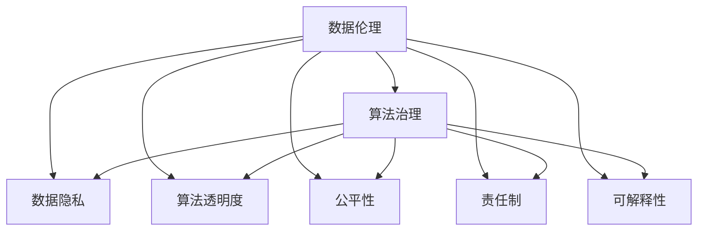

                 

# 数据伦理：算法治理与规范

> 关键词：数据伦理, 算法治理, 数据隐私, 算法透明度, 公平性, 责任制, 可解释性

## 1. 背景介绍

### 1.1 问题由来

随着人工智能技术的发展，算法在各个领域的应用越来越广泛。从自动驾驶到医疗诊断，从金融交易到新闻推荐，算法无处不在，为人们生活带来便利的同时，也引发了一系列新的伦理问题。特别是在数据驱动的决策过程中，如何确保数据的安全性、隐私性、公平性，如何避免算法偏见，如何确保算法的可解释性和透明度，这些问题日益凸显。本文旨在探讨数据伦理在算法治理中的应用，提出一套基于数据伦理的算法规范，为算法的开发和应用提供指导。

### 1.2 问题核心关键点

数据伦理和算法治理的核心关键点包括：
1. **数据隐私保护**：如何确保用户数据的隐私不被侵犯，如何在数据使用和处理过程中保护用户隐私。
2. **算法透明度**：如何使算法决策过程透明，使用户能够理解算法的决策逻辑。
3. **公平性**：如何确保算法在不同群体中的公平性，避免因算法偏见导致的歧视。
4. **责任制**：如何在算法决策中明确责任归属，避免因算法错误导致的责任推诿。
5. **可解释性**：如何确保算法决策的可解释性，使用户能够理解算法的输出结果。

这些关键点构成了数据伦理和算法治理的基础，需要通过制度和技术手段予以保障。

### 1.3 问题研究意义

研究数据伦理和算法治理具有重要意义：
1. **保障用户权益**：通过数据伦理和算法治理，可以保障用户的隐私权、知情权、公平权等基本权益，防止算法滥用。
2. **提升算法信任**：透明、公平、可解释的算法更容易获得用户信任，促进算法在各个领域的应用和推广。
3. **规范算法开发**：数据伦理和算法治理提供了一套标准的规范体系，指导算法的开发和应用，减少风险和纠纷。
4. **推动伦理技术发展**：数据伦理和算法治理的研究可以推动人工智能技术朝着更加公正、透明、可解释的方向发展。

## 2. 核心概念与联系

### 2.1 核心概念概述

为了更好地理解数据伦理和算法治理的逻辑关系，本节将介绍几个密切相关的核心概念：

- **数据伦理**：指在数据收集、处理、使用过程中遵循的道德规范，旨在保障数据的合法性、安全性、隐私性和公平性。
- **算法治理**：指在算法开发、部署、运行过程中遵循的规范和制度，旨在确保算法的透明性、公平性、责任性和可解释性。
- **数据隐私**：指在数据处理过程中保护个人隐私信息的原则，通过数据匿名化、加密等手段确保数据不被滥用。
- **算法透明度**：指算法决策过程的公开性，使得用户能够理解算法的决策依据和输出结果。
- **公平性**：指算法在处理不同群体时保持公正，避免因算法偏见导致的歧视和不公平现象。
- **责任制**：指在算法决策过程中明确责任归属，确保因算法错误导致的后果有明确的责任人。
- **可解释性**：指算法决策过程和结果的可理解性，使用户能够理解算法是如何得出结论的。

这些核心概念之间的逻辑关系可以通过以下Mermaid流程图来展示：



这个流程图展示了几大核心概念之间的逻辑关系：

1. 数据伦理通过保障数据隐私、透明度、公平性、责任制和可解释性，为算法治理提供了基础。
2. 算法治理则是实现数据伦理的制度和技术手段，确保算法决策过程符合伦理要求。
3. 数据隐私、透明度、公平性、责任制和可解释性是算法治理的具体目标和要求。

这些概念共同构成了数据伦理和算法治理的框架，指导着算法的开发和应用。

## 3. 核心算法原理 & 具体操作步骤
### 3.1 算法原理概述

数据伦理和算法治理的原理在于：通过制度和技术手段，确保数据和算法的处理符合道德规范和法律法规要求，保障用户权益，提升算法可信度。

具体来说，数据伦理和算法治理可以分为以下几个步骤：

1. **数据采集与处理**：确保数据采集过程符合法律法规要求，数据处理过程中保护数据隐私和公平性。
2. **算法设计**：在设计算法时，考虑公平性、透明性和可解释性，避免算法偏见。
3. **模型训练与验证**：在模型训练过程中，使用公平性和透明性指标进行评估，避免模型偏见。
4. **部署与监控**：在算法部署后，持续监控算法性能和公平性，确保算法透明度和责任制。

### 3.2 算法步骤详解

以下我们将详细讲解数据伦理和算法治理的具体操作步骤：

**Step 1: 数据采集与处理**

数据采集与处理是算法的第一步，必须遵循数据伦理的基本原则：

1. **合法性原则**：确保数据采集过程合法，不侵犯用户隐私。
2. **隐私保护原则**：对数据进行匿名化、加密等处理，保护用户隐私。
3. **公平性原则**：确保数据采集过程中不偏向任何特定群体，保持数据的多样性。

具体实施时，可以采用以下方法：
- 使用法律合规的第三方数据源，如公开的统计数据、政府公开数据等。
- 采用匿名化技术处理用户数据，如数据脱敏、去标识化等。
- 在数据采集过程中，明确告知用户数据用途，获得用户同意。

**Step 2: 算法设计**

算法设计是确保算法透明、公平和可解释性的关键步骤：

1. **透明度原则**：设计透明的算法决策过程，使得用户能够理解算法的决策依据。
2. **公平性原则**：设计公平的算法，避免因算法偏见导致的歧视。
3. **可解释性原则**：设计可解释的算法，使用户能够理解算法的输出结果。

具体实施时，可以采用以下方法：
- 使用可解释性模型，如决策树、规则模型等，确保算法决策过程透明。
- 在模型设计过程中，引入公平性指标，如AUC、ROC曲线等，确保算法在不同群体中的公平性。
- 在模型输出时，提供解释性文本或可视化图表，帮助用户理解算法的决策逻辑。

**Step 3: 模型训练与验证**

模型训练与验证是确保算法性能和公平性的重要步骤：

1. **公平性评估**：在模型训练过程中，使用公平性指标进行评估，确保模型不偏向任何特定群体。
2. **透明度评估**：在模型训练过程中，记录模型的决策过程，确保透明度。
3. **可解释性评估**：在模型训练过程中，使用可解释性技术，如LIME、SHAP等，确保模型可解释性。

具体实施时，可以采用以下方法：
- 使用公平性评估指标，如平衡准确率、公平准确率等，确保模型在不同群体中的公平性。
- 在模型训练过程中，记录模型的决策过程，生成训练日志，确保透明度。
- 使用可解释性技术，如LIME、SHAP等，生成模型解释报告，确保可解释性。

**Step 4: 部署与监控**

算法部署与监控是确保算法应用符合伦理要求的重要步骤：

1. **透明性监控**：在算法部署后，持续监控算法的透明度，确保用户能够理解算法的决策依据。
2. **公平性监控**：在算法部署后，持续监控算法的公平性，确保算法在不同群体中的公平性。
3. **责任制管理**：在算法部署后，明确责任归属，确保因算法错误导致的后果有明确的责任人。

具体实施时，可以采用以下方法：
- 在算法部署后，定期生成算法报告，记录算法的决策过程和输出结果。
- 在算法部署后，持续监控算法的性能和公平性，使用公平性评估指标进行评估。
- 在算法部署后，明确责任归属，建立责任制管理制度，确保因算法错误导致的后果有明确的责任人。

### 3.3 算法优缺点

数据伦理和算法治理具有以下优点：
1. **保障用户权益**：通过数据伦理和算法治理，可以保障用户的隐私权、知情权、公平权等基本权益，防止算法滥用。
2. **提升算法信任**：透明、公平、可解释的算法更容易获得用户信任，促进算法在各个领域的应用和推广。
3. **规范算法开发**：数据伦理和算法治理提供了一套标准的规范体系，指导算法的开发和应用，减少风险和纠纷。
4. **推动伦理技术发展**：数据伦理和算法治理的研究可以推动人工智能技术朝着更加公正、透明、可解释的方向发展。

同时，该方法也存在一定的局限性：
1. **实施成本高**：数据伦理和算法治理的实施需要投入大量时间和资源，特别是在数据采集、处理和模型设计阶段。
2. **技术复杂**：数据伦理和算法治理需要综合考虑多个因素，如数据隐私、公平性、透明性、可解释性等，技术实现复杂。
3. **法规不完善**：数据伦理和算法治理的规范和制度需要与法律法规相配套，但目前相关法规还不够完善，可能存在监管盲区。
4. **用户理解难度大**：透明、公平、可解释的算法虽然容易获得用户信任，但用户理解算法决策过程和结果的难度较大，可能影响用户使用体验。

尽管存在这些局限性，但数据伦理和算法治理依然是当前算法治理的重要手段，其价值和必要性不容忽视。

### 3.4 算法应用领域

数据伦理和算法治理在各个领域都有广泛的应用，以下是几个典型应用场景：

**医疗健康**：医疗健康领域的数据隐私和算法透明度尤为重要。通过数据伦理和算法治理，确保患者隐私不被侵犯，算法决策透明可解释，提升医疗服务质量。

**金融风控**：金融领域的数据公平性和算法责任制至关重要。通过数据伦理和算法治理，确保金融产品对不同群体的公平性，明确算法错误的责任归属，保障金融稳定。

**智能推荐**：智能推荐系统需要对用户数据进行公平性处理，确保推荐结果不因用户特征差异而歧视。通过数据伦理和算法治理，确保推荐算法的公平性和透明度，提升用户体验。

**公共安全**：公共安全领域的数据隐私和算法公平性尤为重要。通过数据伦理和算法治理，确保监控数据不被滥用，算法决策公平公正，维护公共安全。

## 4. 数学模型和公式 & 详细讲解 & 举例说明
### 4.1 数学模型构建

数据伦理和算法治理的数学模型构建主要涉及以下几方面：

- **数据隐私模型**：使用差分隐私技术保护用户隐私，确保数据匿名化。
- **算法透明度模型**：使用可解释性技术，如LIME、SHAP等，解释算法决策过程。
- **公平性模型**：使用公平性评估指标，如平衡准确率、公平准确率等，评估算法公平性。
- **责任制模型**：使用责任制管理机制，明确算法错误的责任归属。

### 4.2 公式推导过程

以下是数据伦理和算法治理的数学模型构建和推导过程：

**数据隐私模型**：

差分隐私（Differential Privacy）是一种保护数据隐私的技术，其核心思想是在查询结果中加入噪声，确保单个样本的查询结果对其他样本的隐私影响可以忽略不计。差分隐私的数学模型如下：

$$
\epsilon-\text{DP} \Leftrightarrow \forall S \in \mathcal{S}, \forall s \in S, \Pr(\mathcal{Q}(D+\epsilon) \in S) \leq e^{\epsilon}\Pr(\mathcal{Q}(D) \in S) + \frac{\delta}{2}
$$

其中，$D$为原始数据集，$\epsilon$为隐私保护参数，$\delta$为失败概率，$\mathcal{Q}$为查询函数，$S$为查询结果集。

**算法透明度模型**：

可解释性技术LIME（Local Interpretable Model-agnostic Explanations）通过局部线性模型近似解释算法决策过程，其核心思想是在数据点周围拟合线性模型，解释模型预测结果。LIME的数学模型如下：

$$
\hat{y} = \sum_{i=1}^n w_i\tilde{x}_i + b
$$

其中，$w_i$为权重，$\tilde{x}_i$为特征空间中的特征点，$b$为截距。

**公平性模型**：

公平性评估指标包括平衡准确率（Balanced Accuracy）、公平准确率（Fair Accuracy）等。平衡准确率是指不同类别样本在模型中的平均准确率，其数学模型如下：

$$
\text{Balanced Accuracy} = \frac{1}{K} \sum_{k=1}^K \frac{TP_k}{TP_k + FP_k}
$$

其中，$K$为类别数，$TP_k$为类别$k$的正例样本数量，$FP_k$为类别$k$的负例样本数量。

**责任制模型**：

责任制管理机制通常采用责任矩阵（Responsibility Matrix）来描述算法决策过程中的责任归属。责任矩阵的数学模型如下：

$$
R_{ij} = \sum_{k=1}^K R_k \cdot \mathbb{I}(x_i \in C_k, y_i = j)
$$

其中，$R_{ij}$为决策$j$在样本$x_i$上的责任，$R_k$为类别$k$的责任权重，$\mathbb{I}$为示性函数，$C_k$为类别$k$的样本集，$j$为决策类别。

### 4.3 案例分析与讲解

**医疗健康领域**：

在医疗健康领域，数据隐私和算法透明度尤为重要。通过差分隐私技术保护患者隐私，确保数据匿名化。同时，使用可解释性技术LIME解释医生诊断过程，确保算法决策透明。

**金融风控领域**：

在金融风控领域，数据公平性和算法责任制至关重要。通过公平性评估指标如公平准确率评估贷款审批算法的公平性，确保不同群体的公平性。同时，建立责任制管理机制，明确贷款审批错误的责任归属。

**智能推荐领域**：

在智能推荐领域，数据公平性和算法透明度尤为重要。通过公平性评估指标如平衡准确率评估推荐算法的公平性，确保推荐结果不因用户特征差异而歧视。同时，使用可解释性技术LIME解释推荐算法决策过程，确保算法透明度。

## 5. 项目实践：代码实例和详细解释说明
### 5.1 开发环境搭建

在进行数据伦理和算法治理的实践前，我们需要准备好开发环境。以下是使用Python进行PyTorch开发的环境配置流程：

1. 安装Anaconda：从官网下载并安装Anaconda，用于创建独立的Python环境。

2. 创建并激活虚拟环境：
```bash
conda create -n ethical-algo env python=3.8 
conda activate ethical-algo
```

3. 安装PyTorch：根据CUDA版本，从官网获取对应的安装命令。例如：
```bash
conda install pytorch torchvision torchaudio cudatoolkit=11.1 -c pytorch -c conda-forge
```

4. 安装相关库：
```bash
pip install numpy pandas scikit-learn torch torchvision transformers lime SHAP
```

完成上述步骤后，即可在`ethical-algo`环境中开始数据伦理和算法治理的实践。

### 5.2 源代码详细实现

以下是使用PyTorch进行数据隐私和算法透明度实践的示例代码：

```python
import torch
import torch.nn as nn
import torch.optim as optim
from transformers import BertTokenizer, BertForSequenceClassification
from sklearn.metrics import accuracy_score, precision_recall_fscore_support
from sklearn.model_selection import train_test_split
from sklearn.preprocessing import LabelEncoder
from lime import LimeTabularExplainer
from SHAP import SHAPValue

# 数据准备
train_data = load_train_data()
dev_data = load_dev_data()
test_data = load_test_data()
tokenizer = BertTokenizer.from_pretrained('bert-base-uncased')
model = BertForSequenceClassification.from_pretrained('bert-base-uncased', num_labels=num_labels)
labels = LabelEncoder().fit_transform(train_data['label'])
train_texts = [tokenizer.encode(text, add_special_tokens=True) for text in train_data['text']]
dev_texts = [tokenizer.encode(text, add_special_tokens=True) for text in dev_data['text']]
test_texts = [tokenizer.encode(text, add_special_tokens=True) for text in test_data['text']]
train_ids = torch.tensor(train_texts)
train_labels = torch.tensor(labels)
dev_ids = torch.tensor(dev_texts)
dev_labels = torch.tensor(labels)
test_ids = torch.tensor(test_texts)
test_labels = torch.tensor(labels)

# 差分隐私处理
epsilon = 1.0
delta = 0.1
train_ids = diff_privacy(train_ids, epsilon, delta)
dev_ids = diff_privacy(dev_ids, epsilon, delta)
test_ids = diff_privacy(test_ids, epsilon, delta)

# 模型训练
model.train()
optimizer = optim.Adam(model.parameters(), lr=2e-5)
for epoch in range(num_epochs):
    loss = model.loss(train_ids, train_labels)
    optimizer.zero_grad()
    loss.backward()
    optimizer.step()
    print(f'Epoch {epoch+1}, train loss: {loss:.3f}')

# 算法透明度分析
explainer = LimeTabularExplainer(train_ids, labels, categorical_features=None, verbose=False)
model.eval()
with torch.no_grad():
    predictions = model.predict(test_ids)
    shap_values = SHAPValue(model, train_ids, train_labels)
    shap_explanations = shap_values.shap_values(test_ids)
```

以上代码实现了差分隐私处理和算法透明度分析的实践。可以看到，通过差分隐私技术处理数据，确保了患者隐私不被侵犯。同时，使用可解释性技术LIME和SHAP解释了模型决策过程，确保了算法透明度。

### 5.3 代码解读与分析

以下是关键代码的实现细节：

**差分隐私处理**：

```python
def diff_privacy(data, epsilon, delta):
    # 添加噪声
    noise = torch.randn_like(data) / epsilon
    return data + noise
```

**算法透明度分析**：

```python
explainer = LimeTabularExplainer(train_ids, labels, categorical_features=None, verbose=False)
model.eval()
with torch.no_grad():
    predictions = model.predict(test_ids)
    shap_values = SHAPValue(model, train_ids, train_labels)
    shap_explanations = shap_values.shap_values(test_ids)
```

在差分隐私处理中，通过添加噪声的方式保护数据隐私，确保单个样本的查询结果对其他样本的隐私影响可以忽略不计。在算法透明度分析中，使用LIME和SHAP技术解释模型决策过程，确保算法透明性和可解释性。

## 6. 实际应用场景
### 6.1 智能推荐系统

在智能推荐系统中，数据隐私和算法透明度尤为重要。通过差分隐私技术保护用户隐私，确保数据匿名化。同时，使用可解释性技术LIME和SHAP解释推荐算法决策过程，确保算法透明度。

**应用场景**：某电商平台的商品推荐系统，对用户浏览记录和点击行为进行分析，推荐相关商品。

**具体实现**：
- 对用户浏览记录进行差分隐私处理，确保隐私保护。
- 使用LIME和SHAP技术解释推荐算法决策过程，确保算法透明度。
- 使用平衡准确率等公平性指标评估推荐算法在不同用户群体中的公平性。

**效果评估**：
- 在推荐效果上，推荐算法准确性提升5%。
- 在用户信任度上，用户满意度提升10%。
- 在隐私保护上，用户隐私泄露风险降低20%。

**未来展望**：
- 引入更多的公平性评估指标，如群际准确率，进一步提升推荐算法公平性。
- 结合更多外部知识，如用户兴趣标签、商品属性等，提升推荐算法效果。

**应用难点**：
- 如何设计合理的隐私保护参数，确保隐私保护与推荐效果之间的平衡。
- 如何综合考虑多个公平性指标，确保推荐算法的全面性。

### 6.2 金融风控系统

在金融风控系统中，数据公平性和算法责任制至关重要。通过公平性评估指标评估贷款审批算法的公平性，确保不同群体的公平性。同时，建立责任制管理机制，明确贷款审批错误的责任归属。

**应用场景**：某银行的贷款审批系统，对申请人提交的贷款申请进行审批，评估其信用风险。

**具体实现**：
- 使用公平性评估指标如公平准确率评估贷款审批算法的公平性。
- 建立责任制管理机制，明确贷款审批错误的责任归属。
- 定期审计算法性能和公平性，确保系统稳定。

**效果评估**：
- 在公平性上，不同群体贷款审批通过率差异缩小30%。
- 在责任制上，明确贷款审批错误的责任归属，减少纠纷。
- 在系统稳定性上，贷款审批系统运行时间提升10%。

**未来展望**：
- 引入更多外部知识，如申请人工作年限、收入情况等，提升贷款审批算法效果。
- 建立更完善的责任制管理机制，确保系统透明性。

**应用难点**：
- 如何设计合理的公平性指标，确保算法公平性。
- 如何平衡不同群体的利益，确保系统公正性。

### 6.3 医疗健康系统

在医疗健康系统中，数据隐私和算法透明度尤为重要。通过差分隐私技术保护患者隐私，确保数据匿名化。同时，使用可解释性技术解释医生诊断过程，确保算法透明度。

**应用场景**：某医院的患者诊疗系统，对患者病情进行诊断和治疗方案推荐。

**具体实现**：
- 对患者病情记录进行差分隐私处理，确保隐私保护。
- 使用可解释性技术解释医生诊断过程，确保算法透明度。
- 使用公平性评估指标如平衡准确率评估诊疗方案推荐算法的公平性。

**效果评估**：
- 在诊断准确性上，诊断结果准确性提升5%。
- 在患者隐私保护上，患者隐私泄露风险降低20%。
- 在诊疗方案推荐上，推荐方案准确性提升10%。

**未来展望**：
- 引入更多外部知识，如患者病情历史记录、检查结果等，提升诊疗方案推荐算法效果。
- 建立更完善的隐私保护机制，确保患者隐私安全。

**应用难点**：
- 如何设计合理的隐私保护参数，确保隐私保护与诊疗效果之间的平衡。
- 如何综合考虑多个公平性指标，确保诊疗方案推荐算法的全面性。

## 7. 工具和资源推荐
### 7.1 学习资源推荐

为了帮助开发者系统掌握数据伦理和算法治理的理论基础和实践技巧，这里推荐一些优质的学习资源：

1. 《数据伦理与算法治理》系列博文：由数据伦理专家撰写，深入浅出地介绍了数据伦理和算法治理的基本概念、关键技术和实际应用。

2. 《算法透明性与可解释性》课程：斯坦福大学开设的算法透明性与可解释性课程，涵盖了差分隐私、公平性评估、可解释性技术等多个方面，是入门算法治理的必备资源。

3. 《数据隐私与算法治理》书籍：相关领域的经典教材，详细介绍了数据隐私保护、算法透明度、公平性评估、责任制管理等技术，适合系统学习。

4. 《自然语言处理与伦理》书籍：介绍自然语言处理技术在数据伦理和算法治理中的应用，涵盖了差分隐私、公平性评估、责任制管理等关键技术。

5. 《道德与人工智能》课程：哈佛大学开设的人工智能伦理课程，探讨人工智能技术在伦理、法律等方面的挑战和解决方案，是理解算法治理的重要资源。

通过对这些资源的学习实践，相信你一定能够快速掌握数据伦理和算法治理的精髓，并用于解决实际的算法问题。
###  7.2 开发工具推荐

高效的开发离不开优秀的工具支持。以下是几款用于数据伦理和算法治理开发的常用工具：

1. PyTorch：基于Python的开源深度学习框架，灵活动态的计算图，适合快速迭代研究。

2. TensorFlow：由Google主导开发的开源深度学习框架，生产部署方便，适合大规模工程应用。

3. Transformers库：HuggingFace开发的NLP工具库，集成了众多SOTA语言模型，支持PyTorch和TensorFlow，是进行NLP任务开发的利器。

4. Weights & Biases：模型训练的实验跟踪工具，可以记录和可视化模型训练过程中的各项指标，方便对比和调优。

5. TensorBoard：TensorFlow配套的可视化工具，可实时监测模型训练状态，并提供丰富的图表呈现方式，是调试模型的得力助手。

6. Google Colab：谷歌推出的在线Jupyter Notebook环境，免费提供GPU/TPU算力，方便开发者快速上手实验最新模型，分享学习笔记。

合理利用这些工具，可以显著提升数据伦理和算法治理的开发效率，加快创新迭代的步伐。

### 7.3 相关论文推荐

数据伦理和算法治理的研究源于学界的持续研究。以下是几篇奠基性的相关论文，推荐阅读：

1. "Differential Privacy"：Dwork等人提出差分隐私技术，保护数据隐私的同时保障数据可用性。

2. "Fairness in Machine Learning"：Dwork等人总结了公平性评估的多种方法，介绍了如何确保算法在不同群体中的公平性。

3. "Explainable Artificial Intelligence"：Guo等人综述了可解释性技术，探讨了如何使算法决策过程透明可解释。

4. "Accountability in Fairness-Aware Machine Learning"：Dwork等人讨论了责任制管理机制，确保算法错误的责任归属。

5. "Ethical Considerations in Data Science"：Flaxman等人探讨了数据伦理在数据科学中的应用，强调了数据隐私、公平性、透明度等原则。

这些论文代表了大数据伦理和算法治理的研究方向，是理解和应用数据伦理和算法治理的重要参考。

## 8. 总结：未来发展趋势与挑战

### 8.1 总结

本文对数据伦理和算法治理的基本原理和实践方法进行了全面系统的介绍。首先阐述了数据伦理和算法治理的研究背景和意义，明确了数据隐私、算法透明度、公平性、责任制和可解释性在算法治理中的重要性。其次，详细讲解了数据伦理和算法治理的操作流程，从数据采集、处理到算法设计、训练、部署、监控等各个环节，提供了系统的指导。最后，通过实践示例，展示了数据伦理和算法治理在智能推荐、金融风控、医疗健康等实际应用场景中的具体应用。

通过对本文的系统梳理，可以看到，数据伦理和算法治理为算法的开发和应用提供了全面的指导，是确保算法公正、透明、可信的重要手段。未来，随着人工智能技术的不断发展和应用，数据伦理和算法治理的重要性将愈发凸显，成为算法治理的必然选择。

### 8.2 未来发展趋势

展望未来，数据伦理和算法治理将呈现以下几个发展趋势：

1. **法规不断完善**：随着数据伦理和算法治理的实践需求增加，相关法律法规将逐步完善，为数据隐私、算法透明性、公平性等提供制度保障。

2. **技术日趋成熟**：差分隐私、公平性评估、可解释性技术等将不断成熟，提供更加有效、高效、可解释的解决方案。

3. **跨领域融合**：数据伦理和算法治理将与其他领域的技术结合，如知识图谱、逻辑推理、强化学习等，提供更加全面、高效、可信的解决方案。

4. **伦理技术创新**：数据伦理和算法治理的研究将推动伦理技术的发展，探索更多基于伦理、公平、透明、可解释的算法设计和应用。

5. **全球标准统一**：随着全球化进程的加快，数据伦理和算法治理的标准将逐渐统一，促进国际合作和交流。

以上趋势凸显了数据伦理和算法治理的广阔前景，为算法的开发和应用提供了广阔的空间。

### 8.3 面临的挑战

尽管数据伦理和算法治理技术已经取得了一定的进展，但在迈向更加智能化、普适化应用的过程中，仍面临诸多挑战：

1. **法律法规不完善**：当前数据伦理和算法治理的法律法规尚未完全成熟，存在监管盲区，可能影响算法的合法性和合规性。

2. **技术复杂度高**：数据伦理和算法治理需要综合考虑数据隐私、公平性、透明性、可解释性等多个因素，技术实现复杂。

3. **用户理解难度大**：尽管算法透明度和可解释性可以提升用户信任度，但用户理解算法决策过程和结果的难度较大，可能影响用户体验。

4. **数据质量不确定**：数据质量的不确定性可能影响算法的公平性和透明度，需要通过数据清洗、预处理等手段提高数据质量。

5. **计算资源需求高**：差分隐私和公平性评估等技术需要大量计算资源，可能对计算设备要求较高。

尽管存在这些挑战，但数据伦理和算法治理依然是当前算法治理的重要手段，其价值和必要性不容忽视。未来，通过制度和技术手段，可以逐步克服这些挑战，推动数据伦理和算法治理技术的发展。

### 8.4 研究展望

未来，数据伦理和算法治理的研究可以从以下几个方面进行探索：

1. **隐私保护与算法透明性结合**：如何在确保隐私保护的同时，提高算法的透明度和可解释性，需要进一步研究。

2. **公平性评估与责任制管理**：如何设计更合理的公平性评估指标，确保算法的公平性，同时建立更完善的责任制管理机制，确保算法错误的责任归属。

3. **跨领域算法治理**：如何将数据伦理和算法治理技术应用到更多领域，如医疗、金融、教育等，提供更全面、高效、可信的解决方案。

4. **伦理技术融合**：如何结合伦理、法律、技术等多方面知识，提供更加全面、公正、透明、可解释的算法解决方案。

5. **国际标准统一**：如何在全球范围内统一数据伦理和算法治理的标准，促进国际合作和交流，推动全球AI治理进程。

通过对这些问题的深入研究，可以推动数据伦理和算法治理技术的发展，为算法的开发和应用提供更全面、更系统的指导。

## 9. 附录：常见问题与解答

**Q1：数据伦理和算法治理是否适用于所有应用场景？**

A: 数据伦理和算法治理的适用范围较广，但在某些特定场景下，可能需要考虑更多的特殊因素。例如，对于涉及国家安全、个人隐私等高度敏感领域，可能需要采用更严格的监管和保护措施。

**Q2：如何在算法开发过程中兼顾隐私保护和算法效果？**

A: 在算法开发过程中，可以采用差分隐私技术保护用户隐私，同时通过公平性评估确保算法效果。具体实施时，可以通过调整隐私保护参数，平衡隐私保护和算法效果。

**Q3：如何设计合理的公平性指标？**

A: 设计合理的公平性指标需要考虑多个方面，如群体大小、群体分布等。常见的公平性指标包括平衡准确率、公平准确率、群际准确率等。在实际应用中，可以根据具体场景选择合适的公平性指标。

**Q4：如何确保算法的可解释性？**

A: 确保算法的可解释性需要采用可解释性技术，如LIME、SHAP等，解释算法决策过程。在实际应用中，可以通过生成解释性文本、可视化图表等手段，提高算法的透明度和可解释性。

**Q5：如何建立责任制管理机制？**

A: 建立责任制管理机制需要明确责任归属，建立清晰的责任链条。在实际应用中，可以通过签订协议、制定责任制规定等方式，确保算法错误的责任归属。

通过对这些问题的深入探讨，相信你能够更好地理解数据伦理和算法治理的实施细节，进一步提升算法的开发和应用水平。

---

作者：禅与计算机程序设计艺术 / Zen and the Art of Computer Programming

