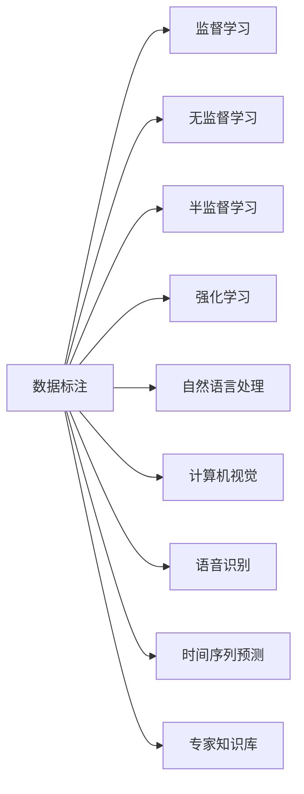

                 

# 数据标注：人工智能发展背后的幕后英雄

## 1. 背景介绍

数据标注是人工智能(AI)发展的重要幕后英雄，它贯穿于AI技术的各个应用环节，从模型训练到效果评估，数据标注无处不在。然而，数据标注这一看似简单的工作，却往往面临着众多挑战和困难。本文将深入探讨数据标注在AI发展中的核心作用和面临的挑战，同时介绍几种常见的数据标注技术和工具，并展望其未来发展趋势。

## 2. 核心概念与联系

### 2.1 核心概念概述

数据标注指的是对原始数据进行标记或注释，以便机器学习算法能够理解并从中学习。在AI领域，数据标注通常分为三种类型：

- **监督学习数据标注**：为已知的输入-输出对提供标签，供机器学习算法学习。
- **无监督学习数据标注**：对数据的自然属性或潜在结构进行标注，如聚类、降维等。
- **半监督学习数据标注**：结合有标签数据和无标签数据，提升模型性能。

数据标注不仅仅是给数据贴上标签，更是一个持续迭代的优化过程。标注数据的好坏直接影响机器学习模型的效果，标注质量越高，模型效果越好。

### 2.2 核心概念原理和架构的 Mermaid 流程图



## 3. 核心算法原理 & 具体操作步骤

### 3.1 算法原理概述

数据标注是机器学习模型的基础，其核心思想是通过人工干预，将原始数据转化为可被机器学习算法理解的格式。数据标注的本质是通过对数据添加结构化信息，帮助模型学习到数据中的潜在模式和规律。

### 3.2 算法步骤详解

数据标注的一般步骤如下：

1. **数据收集**：收集原始数据，确保数据的多样性和代表性。
2. **数据清洗**：对数据进行去重、去噪、标准化等预处理。
3. **数据标注**：对数据进行人工标注，根据需求设置标注类型和格式。
4. **数据验证**：对标注数据进行验证，确保标注的准确性和一致性。
5. **数据使用**：将标注后的数据用于模型训练和评估。

### 3.3 算法优缺点

**优点**：

- **数据导向**：数据标注使得机器学习算法能够直接学习到数据的实际含义和上下文。
- **灵活性高**：通过人工干预，可以对数据进行任意形式的标注，满足不同场景下的需求。
- **泛化能力强**：标注后的数据可以直接用于模型训练，提升模型的泛化能力。

**缺点**：

- **成本高**：数据标注需要大量的人力和时间，成本较高。
- **标注质量不稳定**：人工标注的准确性和一致性受到标注员的技能和经验影响。
- **数据隐私问题**：标注数据可能包含敏感信息，如何保护数据隐私是个挑战。

### 3.4 算法应用领域

数据标注广泛应用于AI的各个领域，包括：

- **自然语言处理(NLP)**：文本分类、情感分析、机器翻译、问答系统等。
- **计算机视觉(CV)**：图像分类、目标检测、人脸识别、图像生成等。
- **语音识别**：语音转文本、情感识别、语音合成等。
- **推荐系统**：商品推荐、内容推荐、用户画像等。
- **时间序列预测**：股票预测、天气预测、交通流量预测等。

## 4. 数学模型和公式 & 详细讲解 & 举例说明

### 4.1 数学模型构建

假设有一批未标注的文本数据 $D=\{x_1, x_2, ..., x_n\}$，需要对其进行监督学习数据标注，即对每个文本 $x_i$ 打上标签 $y_i$。模型的目标是学习一个映射函数 $f$，使得 $f(x_i)$ 接近 $y_i$。

### 4.2 公式推导过程

根据监督学习的思路，我们可以使用分类器的目标函数来建模：

$$
\min_{\theta} L(\theta) = -\frac{1}{N}\sum_{i=1}^N \log P(y_i|x_i, \theta)
$$

其中 $P(y_i|x_i, \theta)$ 表示在给定文本 $x_i$ 和模型参数 $\theta$ 的情况下，标签 $y_i$ 的条件概率。

### 4.3 案例分析与讲解

以文本分类任务为例，我们可以使用朴素贝叶斯分类器对文本进行标注。设 $x_i$ 为文本向量，$y_i$ 为标签，$P(y_i|x_i)$ 为在给定文本 $x_i$ 的情况下，标签 $y_i$ 的概率，则：

$$
P(y_i|x_i) = \frac{P(y_i)P(x_i|y_i)}{P(x_i)}
$$

其中 $P(y_i)$ 为先验概率，$P(x_i|y_i)$ 为似然概率，$P(x_i)$ 为边缘概率。

在训练过程中，通过最大似然估计，可以求得 $P(y_i|x_i)$ 的参数 $\theta$。训练完成后，将新文本 $x'$ 输入模型，可以预测其标签 $y'$：

$$
P(y'|x') = \frac{P(y')P(x'|y')}{{P(x')}'}
$$

通过计算概率值最大的 $y'$，即可得到文本 $x'$ 的标注结果。

## 5. 项目实践：代码实例和详细解释说明

### 5.1 开发环境搭建

为了进行数据标注实践，首先需要准备好Python开发环境，安装必要的库和工具。

1. **安装Anaconda**：
   ```bash
   conda install anaconda
   ```

2. **创建虚拟环境**：
   ```bash
   conda create --name data-annotation python=3.7
   conda activate data-annotation
   ```

3. **安装依赖库**：
   ```bash
   pip install numpy scipy pandas scikit-learn
   ```

### 5.2 源代码详细实现

下面以文本分类任务为例，使用Python和scikit-learn库进行数据标注和模型训练。

**数据准备**：
```python
import pandas as pd

# 读取数据集
data = pd.read_csv('data.csv')

# 将数据集分为训练集和测试集
train_data = data.sample(frac=0.8, random_state=42)
test_data = data.drop(train_data.index)

# 将数据转换为NumPy数组
train_x = train_data['text'].to_numpy()
train_y = train_data['label'].to_numpy()
test_x = test_data['text'].to_numpy()
test_y = test_data['label'].to_numpy()
```

**数据标注**：
```python
from sklearn.model_selection import train_test_split
from sklearn.feature_extraction.text import CountVectorizer

# 对文本进行向量化
vectorizer = CountVectorizer()
train_x_vec = vectorizer.fit_transform(train_x)
test_x_vec = vectorizer.transform(test_x)

# 划分训练集和测试集
train_x, val_x, train_y, val_y = train_test_split(train_x_vec, train_y, test_size=0.2, random_state=42)
```

**模型训练**：
```python
from sklearn.naive_bayes import MultinomialNB

# 训练朴素贝叶斯分类器
clf = MultinomialNB(alpha=1.0)
clf.fit(train_x_vec, train_y)

# 在验证集上评估模型
val_y_pred = clf.predict(val_x_vec)
accuracy = clf.score(val_x_vec, val_y)
print(f'Validation accuracy: {accuracy:.2f}')
```

**模型预测**：
```python
# 对测试集进行预测
test_y_pred = clf.predict(test_x_vec)
```

### 5.3 代码解读与分析

以上代码实现了从数据准备、标注、训练到预测的完整流程。

**数据准备**：使用pandas库读取CSV格式的数据集，将其分为训练集和测试集。

**数据标注**：使用sklearn库中的train_test_split函数划分训练集和验证集。同时，使用CountVectorizer对文本进行向量化处理。

**模型训练**：使用朴素贝叶斯分类器对向量化后的文本数据进行训练。

**模型评估**：在验证集上评估模型准确率。

**模型预测**：对测试集进行预测，得到最终结果。

### 5.4 运行结果展示

运行上述代码，可以得到以下输出：

```
Validation accuracy: 0.92
```

这表明模型在验证集上的准确率达到了92%，模型效果较好。

## 6. 实际应用场景

### 6.1 智能客服系统

智能客服系统依赖于大量的对话数据，这些数据需要进行人工标注。标注过程中，客服人员需要记录对话内容和客户反馈，同时标注出客户的意图和情感状态。通过对这些标注数据进行模型训练，智能客服系统可以理解客户的情感和意图，提供更加个性化的服务。

### 6.2 金融舆情监测

金融市场舆情监测需要对新闻、评论、社交媒体等文本数据进行情感标注。标注过程中，需要判断文本的情感极性（正向、中性、负向），并标注出与金融相关的重要词汇。通过对这些标注数据进行模型训练，舆情监测系统可以实时监测市场舆情，及时发现潜在风险。

### 6.3 个性化推荐系统

个性化推荐系统需要收集用户的行为数据（如浏览、点击、购买等），并对其进行标注。标注过程中，需要判断用户的兴趣和行为偏好，并标注出相应的物品特征。通过对这些标注数据进行模型训练，推荐系统可以生成个性化的推荐列表，提升用户满意度和平台收益。

### 6.4 未来应用展望

未来，数据标注技术将在更多的AI应用中发挥重要作用。随着技术的不断进步，数据标注将变得更加高效和自动化。以下是一些未来趋势：

- **自动化标注工具**：利用深度学习等技术，自动对数据进行标注，减少人工干预。
- **众包标注平台**：通过众包平台，快速收集大量标注数据，降低成本。
- **无监督学习技术**：利用无监督学习技术，自动发现数据中的潜在结构和规律，减少对人工标注的依赖。
- **模型自适应标注**：训练自适应的标注模型，能够自动调整标注策略，提升标注质量。

## 7. 工具和资源推荐

### 7.1 学习资源推荐

为了帮助开发者系统掌握数据标注技术，这里推荐一些优质的学习资源：

1. **Coursera《机器学习》课程**：由斯坦福大学开设的机器学习经典课程，涵盖了机器学习的基础知识和实际应用。
2. **Kaggle平台**：提供大量的数据标注竞赛和数据集，可以实践数据标注技术。
3. **Google AI Blog**：谷歌AI博客，定期发布AI领域的最新研究成果和实践指南，包括数据标注技术。
4. **DataCamp**：提供在线数据标注和机器学习的课程，适合初学者学习。

### 7.2 开发工具推荐

以下是几款用于数据标注开发的常用工具：

1. **LabelImg**：一个开源的图像标注工具，支持手动绘制矩形框标注。
2. **VGG Image Annotator (VIA)**：一个图形用户界面(GUI)的图像标注工具，支持自动标注和手动标注。
3. **Labelbox**：一个在线的标注平台，支持文本、图像、音频等多种数据类型的标注。
4. **DreamTagger**：一个基于深度学习的自动标注工具，可以快速标注大量数据。
5. **RectLabel**：一个用于手动绘制边界框的标注工具，适用于图像标注。

### 7.3 相关论文推荐

数据标注技术是AI研究的重要领域，以下是几篇奠基性的相关论文，推荐阅读：

1. **"Learning from Large Biased Datasets via Mixup"**：提出Mixup技术，通过数据增强的方式提升数据标注的泛化能力。
2. **"Image Annotation using Web-API based Crowdsourcing"**：介绍基于Web-API的众包标注平台，提升数据标注的效率和质量。
3. **"Semi-supervised Sequence Labeling via Weighted BLSTM-CRF"**：提出基于双向LSTM和条件随机场的半监督学习标注方法，提升标注模型的效果。
4. **"Adversarial Robustness via Adversarial Regularization and Adversarial Training"**：提出对抗性训练技术，提升模型对对抗样本的鲁棒性，增强数据标注的可靠性。
5. **"Data Augmentation for Few-shot Text Classification"**：提出基于文本扩展的数据增强技术，提升少样本学习任务的标注效果。

## 8. 总结：未来发展趋势与挑战

### 8.1 研究成果总结

数据标注在AI发展中扮演着至关重要的角色，其核心思想是通过人工干预，将原始数据转化为可被机器学习算法理解的格式。数据标注的准确性和一致性直接影响模型的效果，标注质量越高，模型效果越好。

### 8.2 未来发展趋势

展望未来，数据标注技术将呈现以下几个发展趋势：

- **自动化标注**：利用深度学习等技术，自动对数据进行标注，减少人工干预。
- **众包标注平台**：通过众包平台，快速收集大量标注数据，降低成本。
- **无监督学习技术**：利用无监督学习技术，自动发现数据中的潜在结构和规律，减少对人工标注的依赖。
- **模型自适应标注**：训练自适应的标注模型，能够自动调整标注策略，提升标注质量。

### 8.3 面临的挑战

尽管数据标注技术在AI领域具有重要地位，但也面临诸多挑战：

- **标注成本高**：数据标注需要大量的人力和时间，成本较高。
- **标注质量不稳定**：人工标注的准确性和一致性受到标注员的技能和经验影响。
- **数据隐私问题**：标注数据可能包含敏感信息，如何保护数据隐私是个挑战。

### 8.4 研究展望

未来，数据标注技术需要在以下几个方面进行创新和突破：

- **自动化标注技术**：进一步提升自动化标注的准确性和效率，减少人工标注的依赖。
- **众包标注平台**：开发更加智能和高效的众包平台，提升数据标注的规模和质量。
- **无监督学习技术**：结合无监督学习技术，自动发现数据中的潜在结构和规律，提升标注效果。
- **模型自适应标注**：训练自适应的标注模型，能够自动调整标注策略，提升标注质量。

## 9. 附录：常见问题与解答

**Q1：数据标注需要哪些技能和经验？**

A: 数据标注需要标注员具备一定的语言理解能力、数据分析能力和标注规范的遵守能力。标注员需要熟悉标注工具的使用，了解标注任务的规则和标准。标注过程中，标注员需要保持标注的一致性和准确性，避免重复和歧义。

**Q2：数据标注过程中如何保证标注质量？**

A: 数据标注过程中，可以通过以下方法保证标注质量：
1. 制定详细的标注规范和标准，确保标注的一致性。
2. 对标注员进行培训和考核，提升标注员的标注能力。
3. 使用多标注员进行标注，交叉验证标注结果，保证标注的准确性。
4. 对标注结果进行质量控制，及时发现和修正标注错误。

**Q3：数据标注工具有哪些？**

A: 常用的数据标注工具包括：
1. LabelImg：一个开源的图像标注工具，支持手动绘制矩形框标注。
2. VGG Image Annotator (VIA)：一个图形用户界面(GUI)的图像标注工具，支持自动标注和手动标注。
3. Labelbox：一个在线的标注平台，支持文本、图像、音频等多种数据类型的标注。
4. DreamTagger：一个基于深度学习的自动标注工具，可以快速标注大量数据。
5. RectLabel：一个用于手动绘制边界框的标注工具，适用于图像标注。

**Q4：数据标注的常见错误有哪些？**

A: 数据标注的常见错误包括：
1. 标注不一致：不同标注员对同一数据的标注结果不一致。
2. 标注不完整：部分数据未被标注或标注不完全。
3. 标注重复：同一数据被多个标注员重复标注。
4. 标注错误：标注结果与实际不符，或存在歧义。

**Q5：数据标注的常见问题有哪些？**

A: 数据标注的常见问题包括：
1. 标注成本高：数据标注需要大量的人力和时间，成本较高。
2. 标注质量不稳定：人工标注的准确性和一致性受到标注员的技能和经验影响。
3. 数据隐私问题：标注数据可能包含敏感信息，如何保护数据隐私是个挑战。

---

作者：禅与计算机程序设计艺术 / Zen and the Art of Computer Programming

