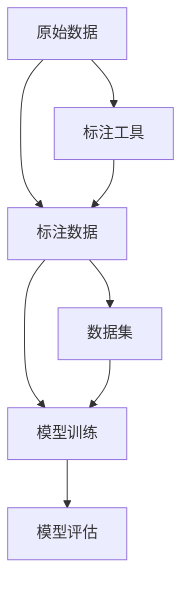

                 

## 1. 背景介绍

### 1.1 问题由来
数据标注（Data Annotation）是人工智能（AI）领域的一项基础且耗时的工作，它对模型训练的精度和泛化能力有着重要影响。然而，数据标注常常被忽视，被认为是AI技术的“幕后英雄”，其实它们的价值不容小觑。在AI驱动的各种应用中，数据标注扮演着不可或缺的角色，无论是在图像识别、语音识别、自然语言处理还是自动化驾驶等领域，准确而高质量的标注数据都是确保模型性能的前提。

### 1.2 问题核心关键点
数据标注的核心关键点主要包括：
- **标注数据的来源和类型**：数据标注的来源可以是各种类型的文本、图像、音频、视频等，其标注方式可以是手动标注、自动标注或半自动标注。
- **标注数据的数量和质量**：数据标注的数量决定了模型训练的规模，标注质量则直接影响模型的准确性和鲁棒性。
- **标注工具和流程**：标注工具和流程的效率和准确性对标注质量至关重要，同时也决定了标注任务的成本。

## 2. 核心概念与联系

### 2.1 核心概念概述

数据标注是确保AI模型从原始数据中学习并泛化到新数据的重要步骤。以下是对核心概念的简要介绍：

- **数据标注（Data Annotation）**：将原始数据转化为标注数据的过程。标注数据通常包括原始数据及其对应的标签或注释。
- **标注工具（Annotation Tools）**：用于数据标注的软件或平台，支持高效、准确的标注操作。
- **数据集（Datasets）**：经过标注处理后的数据集合，用于模型训练和测试。
- **标注者（Annotators）**：负责执行数据标注工作的人员或系统。
- **标注误差（Annotation Error）**：标注过程中可能出现的错误，影响模型训练的准确性。

### 2.2 核心概念原理和架构的 Mermaid 流程图



这个流程图展示了数据标注的核心流程：从原始数据到标注数据，再到模型训练和评估的完整路径。标注工具作为关键环节，直接影响了标注质量和数据集的构建，最终影响模型的训练效果。

## 3. 核心算法原理 & 具体操作步骤

### 3.1 算法原理概述

数据标注的算法原理主要围绕如何高效、准确地进行数据标注，以确保标注数据的可靠性和一致性。其核心在于如何设计标注工具、标注流程和标注标准，以最小化标注误差和提高标注效率。

### 3.2 算法步骤详解

数据标注的主要步骤包括：

1. **确定标注任务和标准**：明确标注任务的具体内容、目标和标准，制定详细的标注规范和指南。
2. **选择工具和平台**：根据标注任务和数据类型选择合适的标注工具和平台，如Labelbox、Prodigy、CrowdFlower等。
3. **招募和培训标注者**：选择合适的标注者，并通过培训提升其标注能力和一致性。
4. **执行标注任务**：在标注工具上进行数据标注，记录标注结果。
5. **审核和修正标注**：对标注结果进行审核和修正，确保标注数据的质量。
6. **分析和报告结果**：对标注结果进行分析，生成标注报告，评估标注质量和效率。

### 3.3 算法优缺点

数据标注的优点在于：
- 确保模型的训练数据具有高度的可靠性和一致性。
- 提高模型的准确性和泛化能力，减少过拟合风险。
- 为模型的开发和优化提供重要的反馈信息。

然而，数据标注也存在一些缺点：
- 标注成本高，特别是在大规模数据集上。
- 标注质量和效率受标注者技能和工具影响较大。
- 标注过程中可能存在人为误差和偏差。

### 3.4 算法应用领域

数据标注广泛应用于各种AI应用领域，包括但不限于：

- **计算机视觉**：如图像分类、目标检测、人脸识别等。
- **自然语言处理**：如文本分类、情感分析、机器翻译等。
- **语音识别**：如语音转文本、语音命令识别等。
- **自动化驾驶**：如图像识别、道路标志识别等。

## 4. 数学模型和公式 & 详细讲解 & 举例说明

### 4.1 数学模型构建

数据标注的数学模型通常基于统计学和信息论原理，旨在量化标注误差和标注效率，并通过优化算法提升标注质量。以下是一个简化的标注误差模型：

$$
P(e|a) = \frac{P(e|x)a}{P(e|x)a + P(e|x^c)(1-a)}
$$

其中：
- $P(e|a)$ 表示标注误差 $e$ 在标注为 $a$ 时的概率。
- $P(e|x)$ 表示标注误差 $e$ 在数据 $x$ 上的概率。
- $a$ 表示数据标注为 $a$ 的概率。
- $x^c$ 表示数据未标注为 $a$ 的概率。

### 4.2 公式推导过程

在上述公式中，$P(e|a)$ 可以理解为在标注为 $a$ 的条件下，标注误差 $e$ 的概率。根据贝叶斯公式，可以将 $P(e|a)$ 分解为 $P(e|x)a$ 和 $P(e|x^c)(1-a)$ 的加权平均，其中 $a$ 和 $x^c$ 分别表示数据标注为 $a$ 和未标注为 $a$ 的概率。

这个公式表明，标注误差 $e$ 的概率不仅与 $e$ 在数据 $x$ 上的概率 $P(e|x)$ 相关，还与数据是否被标注为 $a$ 的概率 $a$ 有关。当 $a$ 较高时，标注误差 $e$ 的概率更可能反映在标注结果中；当 $a$ 较低时，未标注数据带来的误差概率更容易影响标注结果。

### 4.3 案例分析与讲解

以图像分类为例，假设我们有一个包含10类物体的图像数据集，使用标注者对其中5000张图像进行了分类标注。标注误差模型可以帮助我们量化不同类别和不同标注者带来的误差。通过优化标注流程和选择最佳标注工具，可以最小化标注误差，提升数据集的质量。

## 5. 项目实践：代码实例和详细解释说明

### 5.1 开发环境搭建

为了进行数据标注实践，需要搭建一个完整的开发环境。以下是一个典型的Python开发环境配置：

1. **安装Anaconda**：下载并安装Anaconda，创建一个Python虚拟环境。
2. **安装依赖库**：安装必要的Python库，如Pillow、opencv-python、PyTorch等。
3. **搭建标注工具**：选择合适的标注工具，如Labelbox、Prodigy等，进行配置和安装。

### 5.2 源代码详细实现

以下是一个使用Labelbox进行数据标注的Python代码示例：

```python
from labelbox import LabelboxClient, LabelboxDataset, LabelboxAnnotation, LabelboxAnnotationType

# 创建Labelbox客户端
client = LabelboxClient(api_key='YOUR_API_KEY', project_id='YOUR_PROJECT_ID')

# 创建标注集
dataset = LabelboxDataset(client, id='YOUR_DATASET_ID', mode='train')

# 创建标注任务
task = LabelboxAnnotationType.CLASSIFICATION

# 添加标注任务
task = client.add_annotation_type(project_id='YOUR_PROJECT_ID', annotation_type=task)

# 查询标注结果
result = client.get_annotations(project_id='YOUR_PROJECT_ID', task_id=task.id)

# 处理标注结果
for annotation in result:
    image_url = annotation.image.url
    label = annotation.annotation.value
    print(f"Image URL: {image_url}, Label: {label}")
```

### 5.3 代码解读与分析

上述代码实现了使用Labelbox进行数据标注的基本流程。通过Labelbox客户端，我们可以创建标注集、添加标注任务、获取标注结果等。Labelbox提供了丰富的功能和灵活的配置选项，支持多种数据类型和标注方式，是数据标注的强大工具。

### 5.4 运行结果展示

运行上述代码，我们将获取标注结果并打印出来，示例如下：

```
Image URL: https://example.com/image1.jpg, Label: 1
Image URL: https://example.com/image2.jpg, Label: 2
...
```

## 6. 实际应用场景

### 6.1 智能推荐系统

在智能推荐系统中，数据标注起着至关重要的作用。通过标注用户的历史行为数据和偏好信息，推荐系统可以更准确地预测用户对不同推荐内容的兴趣。例如，电商平台可以通过标注用户浏览、购买、评分等数据，训练推荐模型，为用户提供个性化的商品推荐。

### 6.2 自动驾驶

自动驾驶系统依赖大量的标注数据进行训练。通过标注道路标志、交通信号、行人等数据，自动驾驶车辆可以学习识别和响应不同的道路环境。标注数据的准确性和一致性直接影响自动驾驶系统的安全性和可靠性。

### 6.3 医疗诊断

在医疗诊断中，数据标注是确保诊断模型准确性的关键步骤。通过标注病人的病历、影像、基因数据等，医疗诊断模型可以学习识别不同的疾病和病理特征。标注数据的准确性直接关系到病人的健康和治疗效果。

### 6.4 未来应用展望

未来，数据标注技术将更加智能化和自动化，提升标注效率和质量。例如，通过使用AI辅助标注工具，可以自动标注部分数据，减少人工标注的工作量。同时，随着数据标注技术的不断发展，可以进一步提高数据标注的准确性和一致性，为更多的AI应用提供高质量的标注数据。

## 7. 工具和资源推荐

### 7.1 学习资源推荐

为了提升数据标注的能力，以下是一些推荐的学习资源：

1. **《数据标注：从原理到实践》**：详细介绍了数据标注的原理、流程和最佳实践，适合初学者和有经验的数据标注人员。
2. **Udacity数据标注课程**：提供了系统的数据标注培训，涵盖数据标注的基础知识、工具使用和案例分析。
3. **Labelbox官方文档**：提供了丰富的标注工具和API文档，帮助开发者快速上手使用。
4. **Kaggle数据标注竞赛**：通过参与数据标注竞赛，可以提升数据标注技能，学习不同的标注工具和技巧。

### 7.2 开发工具推荐

以下是一些推荐的数据标注开发工具：

1. **Labelbox**：功能强大的标注工具，支持多种数据类型和标注方式，提供了丰富的API接口。
2. **Prodigy**：一款灵活的数据标注平台，支持自定义标注任务和标注流程。
3. **CrowdFlower**：提供自动标注和人工标注相结合的解决方案，支持大规模数据标注任务。

### 7.3 相关论文推荐

以下是一些推荐的相关论文：

1. **《数据标注：理论与实践》**：介绍了数据标注的基本原理、方法和工具，适合数据标注人员阅读。
2. **《自动数据标注：一种新方法》**：提出了一种自动标注方法，减少了人工标注的工作量，提升了标注效率。
3. **《大规模数据标注的挑战与解决方案》**：探讨了大规模数据标注的挑战和解决方案，为数据标注实践提供参考。

## 8. 总结：未来发展趋势与挑战

### 8.1 研究成果总结

数据标注作为人工智能背后的重要环节，其发展已经取得了显著进展。从传统的手动标注到自动标注，再到半自动标注，数据标注技术和工具不断创新，提升了标注效率和准确性。未来，数据标注技术将更加智能化和自动化，为更多的AI应用提供高质量的标注数据。

### 8.2 未来发展趋势

数据标注的未来发展趋势包括：
- 智能化和自动化：通过AI辅助标注工具，自动标注部分数据，减少人工标注的工作量。
- 高质量标注数据：提高数据标注的准确性和一致性，为更多的AI应用提供高质量的标注数据。
- 多模态数据标注：支持图像、语音、文本等多种模态的数据标注，提升AI系统的综合能力。

### 8.3 面临的挑战

数据标注面临的挑战包括：
- 标注成本高：特别是在大规模数据集上，人工标注成本较高。
- 标注质量受限制：标注者的技能和经验对标注质量有重要影响。
- 标注数据隐私问题：标注数据可能包含敏感信息，需要采取适当的隐私保护措施。

### 8.4 研究展望

未来的研究需要在以下几个方面寻求新的突破：
- 开发更多智能化和自动化的标注工具，减少人工标注的工作量。
- 提升标注数据的准确性和一致性，确保AI模型的可靠性。
- 解决标注数据隐私问题，确保数据标注的合法性和安全性。

## 9. 附录：常见问题与解答

**Q1：数据标注是否需要专业知识？**

A: 数据标注虽然需要一定的专业知识和技能，但通过适当的培训和工具使用，普通人员也可以胜任数据标注工作。标注过程通常不需要深入理解模型和算法的原理，更多的是对数据和标签的识别和处理。

**Q2：如何保证数据标注的质量？**

A: 数据标注的质量通常取决于标注者的技能和标注工具的准确性。为了保证标注质量，可以采取以下措施：
- 使用高质量的标注工具和平台。
- 对标注者进行系统的培训和考核。
- 引入标注审核机制，对标注结果进行审核和修正。

**Q3：数据标注和机器学习的关系是什么？**

A: 数据标注是机器学习的重要环节，通过标注数据训练模型，机器学习系统才能更好地泛化到新数据。标注数据的准确性和一致性直接影响模型的训练效果和性能。

**Q4：数据标注的工作流程包括哪些步骤？**

A: 数据标注的工作流程通常包括：
1. 确定标注任务和标准。
2. 选择工具和平台。
3. 招募和培训标注者。
4. 执行标注任务。
5. 审核和修正标注。
6. 分析和报告结果。

**Q5：如何选择适合的数据标注工具？**

A: 选择适合的数据标注工具需要考虑以下几个因素：
- 工具的功能和灵活性。
- 工具的使用难度和成本。
- 工具的兼容性和扩展性。

通过合理选择和使用数据标注工具，可以显著提升数据标注的效率和质量，为AI应用提供高质量的标注数据。

---

作者：禅与计算机程序设计艺术 / Zen and the Art of Computer Programming

