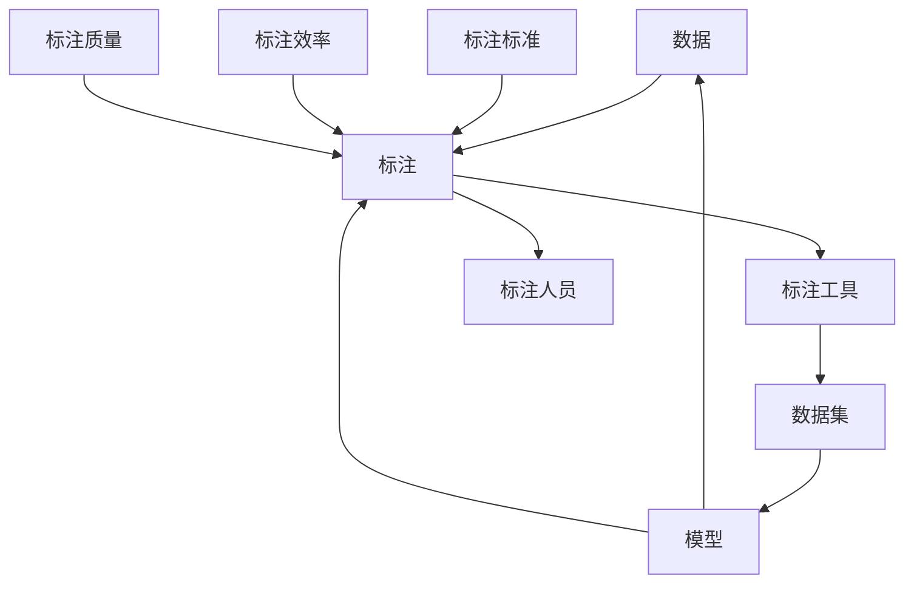

                 

## 1. 背景介绍

### 1.1 问题由来
在人工智能(AI)和机器学习(ML)领域，有一个被频繁提及却常常被忽略的角色：数据标注。数据标注指的是给原始数据打上结构化的标签，使得机器学习模型可以理解和处理这些数据。尽管数据标注并非直接参与模型的训练，但它的重要性丝毫不亚于模型本身。

在过去几十年里，数据标注的工作几乎无处不在。从语音识别、图像分类、自然语言处理(NLP)到医学影像诊断、自动驾驶等众多领域，高质量的数据标注都扮演着至关重要的角色。但是，数据标注往往需要耗费大量人力物力，且标注的质量直接影响到模型的性能。

### 1.2 问题核心关键点
数据标注的核心问题在于其成本、质量和效率。高质量标注数据的获取通常需要专业的标注人员，他们需要具备丰富的领域知识和标注技巧。但即便如此，仍然存在诸多挑战：

- **成本高昂**：标注一个样本可能需要几秒钟到几分钟不等，高昂的标注成本使得数据集构建成为一个难题。
- **标注质量不稳定**：即使是经验丰富的标注员，也难以保证每次标注的一致性和准确性。
- **标注效率低**：人工标注往往受限于标注员的工作速度和精度，效率较低。

这些挑战使得数据标注成为人工智能和机器学习研究中的一道难题。本文将深入探讨数据标注的关键原理和实际操作，介绍几种常见的高效数据标注方法，并展望未来的发展趋势。

## 2. 核心概念与联系

### 2.1 核心概念概述

为了更好地理解数据标注的重要性，本节将介绍几个关键概念及其相互联系：

- **数据标注**：给原始数据打上结构化标签的过程。标注通常分为语义标签、位置标签、实体标签等，用于指导模型的训练和推理。
- **数据集**：经过标注处理后，具有明确结构和标签的数据集合。数据集的质量直接影响模型的学习效果。
- **标注工具**：用于辅助标注人员进行数据标注的软件工具，如Labelbox、VGG Image Annotator(ViRA)、Prodigy等。
- **标注标准**：标注过程中需要遵循的标准和规范，如标签命名规范、标注工具操作规范等，以确保标注质量的一致性。
- **标注效率**：标注人员完成一定量标注所需的时间，通常受标注人员的标注速度和准确性影响。
- **标注质量**：标注结果与实际标签的一致性程度，通常通过标注样本的质量评估指标（如Inter-Annotator Agreement，IAA）来衡量。

这些概念共同构成了数据标注的基础框架，使得模型能够通过学习标注数据，进行有效推理和决策。

### 2.2 核心概念原理和架构的 Mermaid 流程图



这个流程图展示了数据标注的核心流程：数据通过标注工具辅助，由标注人员进行标注，生成数据集，数据集进一步输入模型进行训练和推理，同时也对标注过程的质量和效率进行评估和优化。

## 3. 核心算法原理 & 具体操作步骤

### 3.1 算法原理概述

数据标注的核心算法原理主要基于信息论和统计学，目标是最大化模型的训练效果。在标注过程中，通常需要遵循以下几个原则：

- **标记准确性**：保证标注结果与实际标签的一致性。
- **标记一致性**：标注结果在不同标注员之间的一致性，通常通过Inter-Annotator Agreement（IAA）指标来衡量。
- **标记效率**：标注人员完成标注所需的时间和精力，需要合理分配标注资源，提高标注效率。

数据标注的过程可以分解为以下几个步骤：

1. **数据预处理**：清洗原始数据，去除噪声，确保数据质量。
2. **标注设计**：根据任务需求设计标注规范，包括标签类型、标注格式等。
3. **标注实施**：使用标注工具辅助标注人员进行标注，生成标注结果。
4. **标注评估**：对标注结果进行质量评估，识别标注误差和一致性问题。
5. **标注修正**：根据评估结果修正标注错误，提高标注质量。
6. **标注发布**：发布最终标注结果，供模型训练使用。

### 3.2 算法步骤详解

#### 3.2.1 数据预处理

数据预处理是数据标注的第一步，通常包括以下几个步骤：

1. **数据清洗**：去除噪声、异常值和重复数据，确保数据的一致性和准确性。
2. **数据归一化**：将数据转换为统一格式，便于标注工具处理和分析。
3. **数据分割**：将数据集划分为训练集、验证集和测试集，以便后续的标注和模型训练。

例如，对于图像数据集，预处理步骤可能包括图像增强、裁剪、归一化等操作。对于文本数据集，可能需要进行分词、去除停用词等处理。

#### 3.2.2 标注设计

标注设计是数据标注的核心环节，需要根据任务需求设计合适的标注规范。标注规范通常包括以下几个方面：

1. **标签类型**：根据任务需求，设计合适的标签类型，如分类标签、位置标签、关系标签等。
2. **标注格式**：定义标注结果的格式，通常包括标签名称、标签位置、标注时间等信息。
3. **标注工具**：选择合适的标注工具，如Labelbox、VGG Image Annotator(ViRA)、Prodigy等，辅助标注人员进行标注。

例如，对于图像分类任务，标签类型可能包括背景、前景、人、车等；对于文本分类任务，标签类型可能包括正面、负面、中性等。标注格式和工具的选择则取决于任务的复杂度和标注人员的经验。

#### 3.2.3 标注实施

标注实施是数据标注的具体执行阶段，主要通过标注工具辅助标注人员进行标注。标注工具通常具备以下功能：

1. **标注界面**：提供直观的标注界面，帮助标注人员快速进行标注。
2. **标注功能**：支持标注人员的标注操作，如选择、删除、添加、修改等。
3. **标注质量控制**：提供标注质量控制功能，如自动纠错、标注一致性检查等。

标注实施过程中，需要严格遵循标注规范，确保标注结果的一致性和准确性。标注人员需要具备一定的领域知识和标注技巧，以保证标注质量。

#### 3.2.4 标注评估

标注评估是数据标注的重要环节，通常包括以下几个步骤：

1. **标注一致性评估**：通过Inter-Annotator Agreement（IAA）指标，评估不同标注员之间的一致性，确保标注结果的一致性。
2. **标注准确性评估**：通过标注质量评估指标，如F1-score、Precision、Recall等，评估标注结果与实际标签的一致性。
3. **标注误差识别**：通过标注误差分析，识别标注过程中存在的问题，如标注不完整、标注错误等。

标注评估结果将指导后续的标注修正工作，进一步提高标注质量。

#### 3.2.5 标注修正

标注修正是数据标注的最后一个环节，主要根据标注评估结果进行标注错误的修正。标注修正通常包括以下几个步骤：

1. **标注错误识别**：通过标注评估结果，识别标注错误和标注不一致的问题。
2. **标注修正**：根据标注错误和标注不一致的问题，进行标注修正。
3. **标注验证**：对修正后的标注结果进行验证，确保标注修正的有效性。

标注修正过程中，需要严格遵循标注规范，确保修正后的标注结果一致性和准确性。

#### 3.2.6 标注发布

标注发布是数据标注的最后一个环节，主要将最终的标注结果发布，供模型训练使用。标注发布通常包括以下几个步骤：

1. **标注格式转换**：将标注结果转换为模型训练所需的数据格式。
2. **标注文件生成**：生成标注文件，如CSV、JSON等格式，供模型训练使用。
3. **标注数据发布**：将标注数据发布到模型训练系统中，供模型训练使用。

标注发布过程中，需要确保标注结果的正确性和完整性，以供模型训练和推理使用。

### 3.3 算法优缺点

数据标注具有以下几个优点：

1. **标注质量高**：通过专业标注人员进行标注，标注质量通常较高。
2. **标注结果可控**：标注结果具有明确的结构和格式，便于模型训练和推理。
3. **标注效果显著**：高质量标注数据能够显著提升模型的性能。

数据标注也存在一些缺点：

1. **成本高昂**：标注成本高，需要大量人力和物力投入。
2. **时间周期长**：标注时间周期长，影响项目进度。
3. **依赖标注人员**：标注质量依赖于标注人员的领域知识和标注技巧，难以保证一致性。

尽管存在这些缺点，但数据标注仍然是机器学习和人工智能研究中的重要环节，需要不断优化和改进，以提高标注效率和质量。

### 3.4 算法应用领域

数据标注在众多领域得到了广泛应用，包括但不限于以下几个方面：

1. **计算机视觉**：如图像分类、目标检测、图像分割等。标注工具如Labelbox、VGG Image Annotator(ViRA)等，在计算机视觉领域得到了广泛应用。
2. **自然语言处理**：如命名实体识别、情感分析、机器翻译等。标注工具如Prodigy、Amazon Mechanical Turk等，在自然语言处理领域得到了广泛应用。
3. **语音识别**：如语音转文本、语音识别等。标注工具如VTT、Forvo等，在语音识别领域得到了广泛应用。
4. **医疗影像**：如医学影像分类、病变检测等。标注工具如Segment、Cellex等，在医疗影像领域得到了广泛应用。
5. **自动驾驶**：如交通标志识别、车辆检测等。标注工具如Labelbox、VGG Image Annotator(ViRA)等，在自动驾驶领域得到了广泛应用。

这些领域的数据标注工作，为机器学习模型提供了高质量的训练数据，推动了人工智能技术在这些领域的应用和发展。

## 4. 数学模型和公式 & 详细讲解 & 举例说明

### 4.1 数学模型构建

数据标注的数学模型通常基于信息论和统计学，目标是最大化模型的训练效果。在标注过程中，通常需要遵循以下几个原则：

- **标记准确性**：保证标注结果与实际标签的一致性。
- **标记一致性**：标注结果在不同标注员之间的一致性，通常通过Inter-Annotator Agreement（IAA）指标来衡量。
- **标记效率**：标注人员完成标注所需的时间和精力，需要合理分配标注资源，提高标注效率。

数据标注的过程可以分解为以下几个步骤：

1. **数据预处理**：清洗原始数据，去除噪声，确保数据质量。
2. **标注设计**：根据任务需求设计标注规范，包括标签类型、标注格式等。
3. **标注实施**：使用标注工具辅助标注人员进行标注，生成标注结果。
4. **标注评估**：对标注结果进行质量评估，识别标注误差和一致性问题。
5. **标注修正**：根据评估结果修正标注错误，提高标注质量。
6. **标注发布**：发布最终标注结果，供模型训练使用。

### 4.2 公式推导过程

以下是一些常见的数据标注相关公式：

#### 4.2.1 标注一致性评估（Inter-Annotator Agreement, IAA）

Inter-Annotator Agreement（IAA）是评估标注一致性的常用指标，通常通过Cohen’s Kappa系数来计算。假设有两个标注员A和B，对于n个样本，每个样本的标注结果为c_i，IAA公式如下：

$$
IAA = \frac{P(A \cap B) - P(A)P(B)}{1 - P(B)}
$$

其中，P(A)和P(B)分别为标注员A和B的标注一致性概率，P(A ∩ B)为两个标注员的一致性概率。

#### 4.2.2 标注准确性评估（Precision, Recall, F1-score）

标注准确性评估通常通过Precision、Recall和F1-score等指标来衡量。假设有一个二分类任务，标注结果为y，模型预测结果为y_hat，标注准确性评估公式如下：

$$
Precision = \frac{TP}{TP + FP}
$$

$$
Recall = \frac{TP}{TP + FN}
$$

$$
F1-score = 2 \times \frac{Precision \times Recall}{Precision + Recall}
$$

其中，TP、FP、FN分别为真正例、假正例和假反例。

### 4.3 案例分析与讲解

#### 4.3.1 图像分类任务

对于图像分类任务，标注过程通常包括以下步骤：

1. **数据预处理**：清洗原始图像数据，去除噪声和异常值。
2. **标注设计**：设计合适的标注规范，如标签类型、标注格式等。
3. **标注实施**：使用标注工具如Labelbox、VGG Image Annotator(ViRA)等，辅助标注人员进行标注。
4. **标注评估**：通过IAA指标，评估不同标注员之间的一致性。
5. **标注修正**：根据IAA评估结果，修正标注错误和标注不一致的问题。
6. **标注发布**：将标注结果转换为CSV格式，供模型训练使用。

以COCO数据集为例，标注过程如下：

1. **数据预处理**：清洗原始图像数据，去除噪声和异常值。
2. **标注设计**：设计合适的标注规范，如标签类型、标注格式等。
3. **标注实施**：使用标注工具如Labelbox、VGG Image Annotator(ViRA)等，辅助标注人员进行标注。
4. **标注评估**：通过IAA指标，评估不同标注员之间的一致性。
5. **标注修正**：根据IAA评估结果，修正标注错误和标注不一致的问题。
6. **标注发布**：将标注结果转换为CSV格式，供模型训练使用。

#### 4.3.2 自然语言处理任务

对于自然语言处理任务，标注过程通常包括以下步骤：

1. **数据预处理**：清洗原始文本数据，去除噪声和异常值。
2. **标注设计**：设计合适的标注规范，如标签类型、标注格式等。
3. **标注实施**：使用标注工具如Prodigy、Amazon Mechanical Turk等，辅助标注人员进行标注。
4. **标注评估**：通过F1-score等指标，评估标注结果与实际标签的一致性。
5. **标注修正**：根据评估结果，修正标注错误和标注不一致的问题。
6. **标注发布**：将标注结果转换为JSON格式，供模型训练使用。

以SST-2情感分类任务为例，标注过程如下：

1. **数据预处理**：清洗原始文本数据，去除噪声和异常值。
2. **标注设计**：设计合适的标注规范，如标签类型、标注格式等。
3. **标注实施**：使用标注工具如Prodigy、Amazon Mechanical Turk等，辅助标注人员进行标注。
4. **标注评估**：通过F1-score等指标，评估标注结果与实际标签的一致性。
5. **标注修正**：根据评估结果，修正标注错误和标注不一致的问题。
6. **标注发布**：将标注结果转换为JSON格式，供模型训练使用。

## 5. 项目实践：代码实例和详细解释说明

### 5.1 开发环境搭建

在进行数据标注实践前，我们需要准备好开发环境。以下是使用Python进行Labelbox开发的开发环境配置流程：

1. 安装Anaconda：从官网下载并安装Anaconda，用于创建独立的Python环境。

2. 创建并激活虚拟环境：
```bash
conda create -n labelbox-env python=3.8 
conda activate labelbox-env
```

3. 安装Labelbox：
```bash
pip install labelbox
```

4. 安装各类工具包：
```bash
pip install numpy pandas scikit-learn matplotlib tqdm jupyter notebook ipython
```

完成上述步骤后，即可在`labelbox-env`环境中开始数据标注实践。

### 5.2 源代码详细实现

以下是使用Labelbox进行图像分类任务数据标注的Python代码实现：

```python
from labelbox import Labelbox, LabelboxError
from labelbox.server import LabelboxBase

# 创建Labelbox连接
connection = Labelbox.new_connection()

# 加载图像数据集
image_dataset = LabelboxDataset(connection, "path/to/image_dataset", "image", ["label"])

# 创建标注任务
labelbox_task = LabelboxTask(connection, "path/to/labelbox_task", "image-classification", image_dataset, {"tags": ["label1", "label2"]})

# 打开标注界面
labelbox_task.open()

# 进行标注
def annotate_sample(sample):
    sample = sample.copy()
    sample["tags"] = ["label1"]
    return sample

# 标注完成后保存标注结果
labelbox_task.finish(annotate_sample, save=True)
```

### 5.3 代码解读与分析

让我们再详细解读一下关键代码的实现细节：

**Labelbox连接**：
- 使用Labelbox.new_connection()方法创建与Labelbox服务器的连接。
- 连接建立后，可以通过LabelboxBase对象进行数据集和标注任务的创建和管理。

**LabelboxDataset**：
- 定义数据集对象，包含数据集的路径和标签类型。
- 将数据集对象传入LabelboxTask对象，用于创建标注任务。

**LabelboxTask**：
- 定义标注任务对象，包含任务名称、任务类型、数据集和标签信息。
- 使用open()方法打开标注界面，标注人员可以在该界面上进行标注。
- 使用annotate_sample()函数对每个样本进行标注，标注完成后保存标注结果。

**annotate_sample()函数**：
- 对每个样本进行标注，返回标注后的样本。
- 标注函数中，可以对样本进行增删改等操作，生成最终的标注结果。

通过Labelbox提供的标注工具，标注人员可以方便地进行标注，无需过多关注底层实现细节。Labelbox还提供了丰富的标注功能，如自动纠错、标注一致性检查等，进一步提高了标注效率和质量。

当然，工业级的系统实现还需考虑更多因素，如标注人员的分配、标注结果的审核、标注质量的控制等。但核心的标注范式基本与此类似。

## 6. 实际应用场景

### 6.1 智能客服系统

基于数据标注的智能客服系统，可以通过收集历史客服对话记录，进行标注和微调，构建具有自主问答能力的智能客服。智能客服可以7x24小时不间断服务，快速响应客户咨询，用自然流畅的语言解答各类常见问题。

在技术实现上，可以收集企业内部的历史客服对话记录，将问题和最佳答复构建成监督数据，在此基础上对预训练对话模型进行微调。微调后的对话模型能够自动理解用户意图，匹配最合适的答案模板进行回复。对于客户提出的新问题，还可以接入检索系统实时搜索相关内容，动态组织生成回答。如此构建的智能客服系统，能大幅提升客户咨询体验和问题解决效率。

### 6.2 金融舆情监测

金融机构需要实时监测市场舆论动向，以便及时应对负面信息传播，规避金融风险。传统的人工监测方式成本高、效率低，难以应对网络时代海量信息爆发的挑战。基于数据标注的文本分类和情感分析技术，为金融舆情监测提供了新的解决方案。

具体而言，可以收集金融领域相关的新闻、报道、评论等文本数据，并对其进行主题标注和情感标注。在此基础上对预训练语言模型进行微调，使其能够自动判断文本属于何种主题，情感倾向是正面、中性还是负面。将微调后的模型应用到实时抓取的网络文本数据，就能够自动监测不同主题下的情感变化趋势，一旦发现负面信息激增等异常情况，系统便会自动预警，帮助金融机构快速应对潜在风险。

### 6.3 个性化推荐系统

当前的推荐系统往往只依赖用户的历史行为数据进行物品推荐，无法深入理解用户的真实兴趣偏好。基于数据标注的个性化推荐系统可以更好地挖掘用户行为背后的语义信息，从而提供更精准、多样的推荐内容。

在实践中，可以收集用户浏览、点击、评论、分享等行为数据，提取和用户交互的物品标题、描述、标签等文本内容。将文本内容作为模型输入，用户的后续行为（如是否点击、购买等）作为监督信号，在此基础上微调预训练语言模型。微调后的模型能够从文本内容中准确把握用户的兴趣点。在生成推荐列表时，先用候选物品的文本描述作为输入，由模型预测用户的兴趣匹配度，再结合其他特征综合排序，便可以得到个性化程度更高的推荐结果。

### 6.4 未来应用展望

随着数据标注技术的不断发展，未来在更多领域将得到应用，为传统行业带来变革性影响。

在智慧医疗领域，基于数据标注的医疗问答、病历分析、药物研发等应用将提升医疗服务的智能化水平，辅助医生诊疗，加速新药开发进程。

在智能教育领域，基于数据标注的作业批改、学情分析、知识推荐等方面，因材施教，促进教育公平，提高教学质量。

在智慧城市治理中，基于数据标注的城市事件监测、舆情分析、应急指挥等环节，提高城市管理的自动化和智能化水平，构建更安全、高效的未来城市。

此外，在企业生产、社会治理、文娱传媒等众多领域，基于数据标注的人工智能应用也将不断涌现，为经济社会发展注入新的动力。相信随着技术的日益成熟，数据标注技术将成为人工智能落地应用的重要环节，推动人工智能技术在各行各业的普及和应用。

## 7. 工具和资源推荐

### 7.1 学习资源推荐

为了帮助开发者系统掌握数据标注的关键原理和实践技巧，这里推荐一些优质的学习资源：

1. **《机器学习实战》**：一本经典的机器学习入门书籍，涵盖数据标注的基本概念和实践技巧。
2. **Coursera《机器学习基础》**：斯坦福大学开设的机器学习课程，有Lecture视频和配套作业，帮助你系统掌握机器学习的基本原理。
3. **Kaggle平台**：一个开源数据标注平台，提供大量的标注数据和标注任务，供开发者实践和学习。
4. **Labelbox官方文档**：Labelbox的官方文档，提供了丰富的标注工具和实践案例，帮助你快速上手标注任务。
5. **VGG Image Annotator (ViRA)官方文档**：ViRA的官方文档，提供了详细的标注工具和实践案例，帮助你快速上手标注任务。

通过对这些资源的学习实践，相信你一定能够快速掌握数据标注的精髓，并用于解决实际的标注问题。

### 7.2 开发工具推荐

高效的开发离不开优秀的工具支持。以下是几款用于数据标注开发的常用工具：

1. **Labelbox**：一个开源的数据标注平台，提供丰富的标注功能和在线协作工具，支持图像、视频、文本等多种标注类型。
2. **VGG Image Annotator (ViRA)**：一个开源的图像标注工具，支持多种标注类型和自动纠错功能，支持在线协作和离线标注。
3. **Prodigy**：一个开源的标注工具，支持图像、文本等多种标注类型，提供丰富的标注功能和在线协作工具。
4. **Amazon Mechanical Turk**：一个在线标注平台，支持大规模数据标注任务，提供自动支付机制和标注质量控制功能。
5. **CrowdFlower**：一个在线标注平台，支持大规模数据标注任务，提供自动支付机制和标注质量控制功能。

合理利用这些工具，可以显著提升数据标注的效率和质量，加快创新迭代的步伐。

### 7.3 相关论文推荐

数据标注技术的发展源于学界的持续研究。以下是几篇奠基性的相关论文，推荐阅读：

1. **《机器学习》**：Tom Mitchell所著，介绍了机器学习的基本概念、算法和应用，包括数据标注的相关内容。
2. **《数据标注：系统、技术和应用》**：Bangert等所著，介绍了数据标注的系统、技术和应用，涵盖了多个领域的标注案例。
3. **《深度学习：案例研究》**：Goodfellow等所著，介绍了深度学习的基本概念和应用，包括数据标注的相关内容。
4. **《自然语言处理：统计方法》**：Brown等所著，介绍了自然语言处理的基本概念、算法和应用，包括数据标注的相关内容。

这些论文代表了大语言模型微调技术的发展脉络。通过学习这些前沿成果，可以帮助研究者把握学科前进方向，激发更多的创新灵感。

## 8. 总结：未来发展趋势与挑战

### 8.1 总结

本文对数据标注的关键原理和实践技巧进行了全面系统的介绍。首先阐述了数据标注的重要性，明确了数据标注在机器学习和人工智能研究中的核心地位。其次，从原理到实践，详细讲解了数据标注的数学模型和关键步骤，给出了数据标注任务开发的完整代码实例。同时，本文还广泛探讨了数据标注在多个领域的应用场景，展示了数据标注的广泛应用前景。此外，本文精选了数据标注的各类学习资源，力求为读者提供全方位的技术指引。

通过本文的系统梳理，可以看到，数据标注在大规模机器学习和人工智能应用中扮演了至关重要的角色，是模型训练和推理的基础保障。尽管数据标注面临诸多挑战，但通过不断优化和改进，数据标注技术将能够更好地服务于人工智能应用，推动技术的发展和普及。

### 8.2 未来发展趋势

展望未来，数据标注技术将呈现以下几个发展趋势：

1. **自动化标注**：通过引入自动化标注技术，如深度学习、迁移学习、主动学习等，提高标注效率和质量。
2. **大规模数据标注**：利用无监督和半监督标注技术，如自监督学习、主动学习等，最大限度地利用数据标注资源，实现大规模数据标注。
3. **多模态数据标注**：融合视觉、语音、文本等多种模态数据的标注技术，提高模型的多模态表示能力。
4. **智能标注工具**：开发更加智能化的标注工具，如自动纠错、标注一致性检查等，提高标注人员的工作效率和标注质量。
5. **边缘计算**：将数据标注任务分布到边缘设备，如智能手机、物联网设备等，实现本地标注和实时反馈。
6. **隐私保护**：在数据标注过程中，采取隐私保护措施，保护用户隐私和数据安全。

这些趋势展示了数据标注技术的广阔前景，将进一步推动人工智能技术在各个领域的应用和发展。

### 8.3 面临的挑战

尽管数据标注技术已经取得了显著进展，但在迈向更加智能化、普适化应用的过程中，它仍面临着诸多挑战：

1. **标注成本高昂**：尽管自动化标注技术能够提高标注效率，但依然无法完全替代人工标注。大规模数据标注仍需要大量人力和物力投入。
2. **标注质量不稳定**：即使是自动标注工具，也无法完全保证标注结果的一致性和准确性。标注过程中存在噪声和误差。
3. **标注效率低**：尽管自动化标注技术能够提高标注效率，但依然需要大量人工审核和修正，标注周期较长。
4. **依赖标注人员**：标注质量依赖于标注人员的领域知识和标注技巧，难以保证一致性。
5. **标注隐私保护**：在数据标注过程中，需要采取隐私保护措施，保护用户隐私和数据安全。

尽管存在这些挑战，但数据标注仍然是机器学习和人工智能研究中的重要环节，需要不断优化和改进，以提高标注效率和质量。

### 8.4 研究展望

未来的数据标注研究需要在以下几个方面寻求新的突破：

1. **自动化标注技术**：开发更加智能化的标注工具，如自动纠错、标注一致性检查等，提高标注人员的工作效率和标注质量。
2. **大规模数据标注**：利用无监督和半监督标注技术，如自监督学习、主动学习等，最大限度地利用数据标注资源，实现大规模数据标注。
3. **多模态数据标注**：融合视觉、语音、文本等多种模态数据的标注技术，提高模型的多模态表示能力。
4. **智能标注工具**：开发更加智能化的标注工具，如自动纠错、标注一致性检查等，提高标注人员的工作效率和标注质量。
5. **边缘计算**：将数据标注任务分布到边缘设备，如智能手机、物联网设备等，实现本地标注和实时反馈。
6. **隐私保护**：在数据标注过程中，采取隐私保护措施，保护用户隐私和数据安全。

这些研究方向的探索，必将引领数据标注技术迈向更高的台阶，为人工智能技术在各个领域的应用和发展提供更加坚实的保障。面向未来，数据标注技术还需要与其他人工智能技术进行更深入的融合，如知识表示、因果推理、强化学习等，多路径协同发力，共同推动人工智能技术的发展和应用。

## 9. 附录：常见问题与解答

**Q1：数据标注是否适用于所有NLP任务？**

A: 数据标注在大多数NLP任务上都能取得不错的效果，特别是对于数据量较小的任务。但对于一些特定领域的任务，如医学、法律等，仅仅依靠通用语料预训练的模型可能难以很好地适应。此时需要在特定领域语料上进一步预训练，再进行微调，才能获得理想效果。此外，对于一些需要时效性、个性化很强的任务，如对话、推荐等，微调方法也需要针对性的改进优化。

**Q2：如何选择数据标注工具？**

A: 选择合适的数据标注工具，需要考虑以下几个因素：
1. **标注类型**：不同的标注工具支持不同类型的标注，如图像、文本、语音等。
2. **标注复杂度**：一些工具支持复杂的标注功能，如自动纠错、标注一致性检查等，可以大幅提高标注质量。
3. **在线协作**：一些工具支持在线协作功能，方便多人共同进行标注。
4. **用户界面**：选择用户界面友好的工具，可以提高标注人员的标注效率。
5. **平台支持**：一些工具支持多种平台，如Web、移动端等，方便不同场景下的标注。

**Q3：如何提高数据标注的效率？**

A: 提高数据标注的效率，可以从以下几个方面入手：
1. **自动化标注**：利用自动化标注技术，如深度学习、迁移学习、主动学习等，提高标注效率。
2. **分布式标注**：将数据标注任务分布到多个标注人员，并行处理，提高标注效率。
3. **标注质量控制**：通过标注质量控制功能，自动检测和修正标注错误，提高标注质量。
4. **标注一致性检查**：通过标注一致性检查功能，保证不同标注员之间的标注结果一致。

通过合理利用这些技术，可以有效提高数据标注的效率和质量。

**Q4：如何进行数据标注的隐私保护？**

A: 在进行数据标注时，需要采取隐私保护措施，保护用户隐私和数据安全。具体措施包括：
1. **数据脱敏**：在标注过程中，对敏感数据进行脱敏处理，保护用户隐私。
2. **数据加密**：对标注数据进行加密处理，防止数据泄露。
3. **匿名化处理**：对标注数据进行匿名化处理，防止数据滥用。
4. **访问控制**：限制数据标注工具的访问权限，防止数据泄露。

通过采取这些措施，可以有效保护用户隐私和数据安全，确保数据标注过程的合法性和合规性。

---

作者：禅与计算机程序设计艺术 / Zen and the Art of Computer Programming

