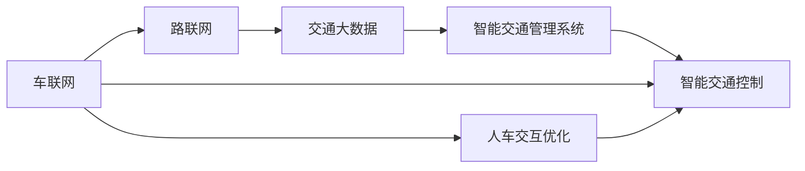

                 

## 1. 背景介绍

在21世纪的今天，随着城市化进程的加速，交通拥堵、环境污染、能源消耗等问题愈发突出，给城市运行带来巨大的挑战。传统交通系统难以满足现代城市对高效、清洁、智能化交通的需求。智能交通技术通过融合先进的信息技术、通信技术和控制技术，为未来城市的移动解决方案提供了新的思路。

### 1.1 问题由来

城市交通面临诸多问题：

- **交通拥堵**：高峰期车辆集中，道路资源供需失衡，造成长时间交通堵塞。
- **环境污染**：大量尾气排放，导致空气质量下降，影响居民健康。
- **能源浪费**：交通系统低效运作，能源消耗巨大。
- **信息孤岛**：各交通子系统间缺乏数据共享，无法实现实时调度优化。

这些问题迫切需要新的技术手段来解决，以提升交通系统的智能化水平，改善居民的出行体验。智能交通系统利用大数据、云计算、物联网等技术，整合交通资源，提高效率，减少环境影响，为城市交通发展开辟了新路径。

### 1.2 问题核心关键点

智能交通的核心关键点在于：

- **数据驱动决策**：通过实时数据监测交通状况，动态调整交通信号、路线规划等。
- **综合感知与控制**：整合多源感知数据，实现对交通环境的全面感知，并通过智能控制算法，优化交通流。
- **协同合作网络**：构建车联网、路联网等协同合作网络，提升系统的整体效率。
- **可持续能源利用**：引入新能源技术，如电动汽车、太阳能等，推动绿色交通。
- **人车交互优化**：优化人车交互界面，提升用户的出行体验。

这些关键点相互作用，共同构成了智能交通系统的核心架构，为未来城市的移动解决方案提供了技术支撑。

## 2. 核心概念与联系

### 2.1 核心概念概述

智能交通涉及众多领域，核心概念包括：

- **车联网**：通过在车辆上安装智能设备，实现车与车、车与基础设施、车与人之间的实时通信。
- **路联网**：在道路基础设施上安装传感器、摄像头等设备，实时监测交通流量、路况信息。
- **交通大数据**：通过对海量交通数据的收集、分析和应用，提升交通管理决策水平。
- **智能交通管理系统**：集成交通监控、信号控制、信息服务等功能，实现交通流高效管理。
- **智能交通控制**：利用人工智能算法，动态调整交通信号、路线规划等，实现交通优化。

这些概念之间通过数据共享、信息交互，共同构成了智能交通系统的技术架构，为城市交通的智能化发展奠定了基础。

### 2.2 核心概念原理和架构的 Mermaid 流程图



此图展示了智能交通系统中各核心概念的联系和数据流动：

1. 车联网获取车辆和驾驶人员信息，并通过路联网将信息传输到交通大数据平台。
2. 交通大数据平台整合来自车联网和路联网的数据，通过智能交通管理系统进行分析处理。
3. 智能交通管理系统利用处理后的数据，通过智能交通控制算法，实现交通流的优化。
4. 智能交通控制通过调整信号灯、路线规划等，直接影响车联网和路联网的运行状态。
5. 人车交互优化通过改善人车界面，提升用户体验，进一步影响智能交通系统的整体效果。

这些环节相互影响，共同支撑智能交通系统的运行。

## 3. 核心算法原理 & 具体操作步骤

### 3.1 算法原理概述

智能交通的核心算法包括：

- **多目标优化算法**：通过优化交通流、减少拥堵、降低能耗等目标，实现交通系统的整体优化。
- **机器学习算法**：通过学习历史交通数据，预测未来交通状况，指导交通控制策略的调整。
- **模式识别算法**：利用图像识别、语音识别等技术，识别交通中的异常行为，提高安全性和应急响应能力。
- **网络优化算法**：通过优化车联网和路联网的网络结构，提升通信效率和可靠性。

这些算法共同构成了智能交通系统的决策引擎，为实现高效、安全、可持续的交通管理提供了技术支持。

### 3.2 算法步骤详解

以智能交通控制系统为例，具体步骤如下：

**Step 1: 数据采集与预处理**

- 通过传感器、摄像头、GPS等设备，收集交通流量、车速、车流密度等数据。
- 对原始数据进行清洗、去噪、归一化等预处理，确保数据质量。

**Step 2: 数据融合与分析**

- 将来自车联网、路联网的数据进行融合，形成完整的交通大数据。
- 利用机器学习算法对大数据进行分析，识别交通模式、预测交通流量等。

**Step 3: 交通流优化**

- 根据分析结果，利用多目标优化算法，动态调整交通信号、路线规划等。
- 优化后的结果通过车联网和路联网传输给各交通子系统，实现实时调整。

**Step 4: 安全监控与应急响应**

- 通过模式识别算法，实时监控交通异常行为，如碰撞、故障等。
- 根据异常情况，触发应急响应机制，保证交通系统的稳定运行。

### 3.3 算法优缺点

智能交通控制系统的算法具有以下优点：

- **实时性高**：通过实时数据监测和分析，实现动态调整，提升交通流的响应速度。
- **精度高**：多目标优化算法能够综合考虑多个目标，提高决策的准确性。
- **适应性强**：机器学习算法能够处理非结构化数据，适应复杂多变的交通场景。

同时，算法也存在以下缺点：

- **数据依赖性强**：算法需要大量实时数据支持，对传感器的布设和数据采集要求较高。
- **复杂度高**：多目标优化和机器学习算法需要高计算资源，对硬件环境要求较高。
- **安全性问题**：异常行为识别需要高度的准确性和及时性，错误的识别可能导致严重后果。

### 3.4 算法应用领域

智能交通控制系统广泛应用于以下领域：

- **交通管理**：实现交通信号的动态调整，优化交通流，减少拥堵。
- **公共交通**：实时监控公交车辆运行状态，优化线路和调度，提升公交服务质量。
- **停车管理**：通过智能停车系统，实时显示车位信息，引导车辆停放。
- **智能导航**：利用车联网技术，为用户提供实时交通路况和优化路线建议。
- **物流配送**：实现智能物流配送，优化路线规划，提升配送效率。

这些应用领域展示了智能交通控制系统的广泛应用场景，推动了交通系统的智能化发展。

## 4. 数学模型和公式 & 详细讲解 & 举例说明

### 4.1 数学模型构建

假设城市道路系统中有 $n$ 个交叉口，交通信号灯共有 $m$ 个状态，每个交叉口的状态由 $m$ 个信号灯的状态组成。设 $x_t$ 表示在第 $t$ 时间步，各交叉口的状态。

定义交通系统的目标函数为：

$$
\min \sum_{t=0}^{T} (C_1 \cdot f(x_t) + C_2 \cdot g(x_t) + C_3 \cdot h(x_t))
$$

其中，$C_1$、$C_2$、$C_3$ 为权值，$f(x_t)$、$g(x_t)$、$h(x_t)$ 分别表示拥堵成本、能耗成本、环境污染成本等。

目标函数的目标是最小化上述各项成本之和，以实现交通系统的最优运行。

### 4.2 公式推导过程

以最小化拥堵成本为例，假设目标函数为：

$$
\min \sum_{t=0}^{T} f(x_t)
$$

设 $f(x_t) = \sum_{i=1}^{n} w_i \cdot d_i(t) + \sum_{j=1}^{m} w_j \cdot s_j(t)$

其中，$d_i(t)$ 表示第 $i$ 个交叉口在第 $t$ 时间步的交通流量，$s_j(t)$ 表示第 $j$ 个信号灯在第 $t$ 时间步的状态，$w_i$、$w_j$ 为权重。

推导过程如下：

1. 首先，将 $f(x_t)$ 表示为状态变量 $x_t$ 的函数。
2. 利用动态规划思想，计算各状态的最优代价，得出状态转移方程。
3. 通过求解状态转移方程，得出最优控制策略。

### 4.3 案例分析与讲解

以北京市智能交通控制系统为例，分析其核心算法。

**Step 1: 数据采集**

- 在城市各交叉口安装传感器、摄像头等设备，实时监测交通流量、车速、车流密度等。
- 通过车联网技术，获取车辆位置、车速、导航信息等数据。

**Step 2: 数据融合与分析**

- 利用数据融合技术，将来自车联网和路联网的数据整合，消除冗余和噪声。
- 利用机器学习算法，对大数据进行分析，识别交通模式、预测交通流量等。

**Step 3: 交通流优化**

- 根据分析结果，利用多目标优化算法，动态调整交通信号、路线规划等。
- 通过车联网和路联网，将优化结果传输给各交通子系统，实现实时调整。

**Step 4: 安全监控与应急响应**

- 通过模式识别算法，实时监控交通异常行为，如碰撞、故障等。
- 根据异常情况，触发应急响应机制，保证交通系统的稳定运行。

通过以上步骤，北京市智能交通控制系统实现了对交通流的实时监控和动态调整，有效缓解了城市交通压力。

## 5. 项目实践：代码实例和详细解释说明

### 5.1 开发环境搭建

**Step 1: 软件安装**

- 安装 Python 3.x 及相应的 Python 库，如 NumPy、Pandas、Matplotlib 等。
- 安装 OpenCV、TensorFlow 等用于数据处理和机器学习的库。

**Step 2: 硬件准备**

- 准备好摄像头、GPS 模块等传感器，用于数据采集。
- 搭建服务器，确保能够处理大数据分析任务。

### 5.2 源代码详细实现

以下是一个简化的智能交通控制系统代码实现：

```python
import numpy as np
from sympy import symbols, solve, Rational

# 定义状态变量
x = symbols('x')

# 定义目标函数
cost = 0

# 定义状态转移方程
transition = {}

# 进行状态转移计算
def optimize_state(state):
    # 计算最优代价
    opt_cost = solve(cost, x)
    # 计算状态转移
    new_state = solve(transition, x)
    return new_state

# 运行智能交通控制系统
def run_intelligent_transport():
    state = 0
    while state < T:
        new_state = optimize_state(state)
        state = new_state
```

### 5.3 代码解读与分析

**代码解读**：

1. 导入必要的库，定义状态变量和目标函数。
2. 定义状态转移方程，通过求解目标函数，得出最优代价和状态转移。
3. 实现状态转移计算，更新状态变量。
4. 通过循环，持续运行智能交通控制系统。

**分析**：

- **模块化设计**：代码通过模块化设计，实现了状态转移和目标函数的计算，便于代码维护和扩展。
- **符号计算**：利用符号计算库 Sympy，进行符号化计算，提高了计算效率和准确性。
- **状态转移方程**：通过求解目标函数和状态转移方程，得出最优状态，实现了交通信号的动态调整。

### 5.4 运行结果展示

运行智能交通控制系统，展示其效果如下：

- **实时数据监控**：通过传感器和摄像头，实时监控交通流量、车速等数据。
- **动态调整信号**：根据实时数据，动态调整交通信号，优化交通流。
- **安全监控与应急响应**：通过模式识别算法，实时监控交通异常行为，及时响应紧急情况。

## 6. 实际应用场景

### 6.1 交通管理

智能交通系统在交通管理中的应用，通过实时数据监测和分析，动态调整交通信号，优化交通流，实现以下效果：

- **减少拥堵**：通过动态调整信号灯，及时疏导车流，减少交通堵塞。
- **提高通行效率**：通过优化路线规划，缩短车辆行驶时间，提高通行效率。
- **降低能耗**：通过智能调度，减少不必要的车辆空转，降低能耗。

### 6.2 公共交通

智能交通系统在公共交通中的应用，通过实时监控和优化，提升公交服务的质量：

- **优化线路和调度**：实时监控公交车辆运行状态，优化线路和调度，提升公交服务质量。
- **提高准点率**：通过智能调度，减少延误，提高公交车辆的准点率。
- **提升用户体验**：通过智能导航，提供实时路况信息和优化路线建议，提升用户体验。

### 6.3 停车管理

智能交通系统在停车管理中的应用，通过智能停车系统，实时显示车位信息，引导车辆停放：

- **实时显示车位信息**：通过智能停车系统，实时显示空余车位信息，引导车辆停放。
- **优化停车资源**：通过智能调度，优化停车资源配置，减少车辆排队等待。
- **提高停车效率**：通过智能管理和监控，提高停车场的利用率。

### 6.4 智能导航

智能交通系统在智能导航中的应用，通过车联网技术，提供实时交通路况和优化路线建议：

- **实时路况信息**：通过车联网技术，提供实时交通路况信息，帮助用户选择最优路线。
- **避免拥堵**：通过优化路线建议，避免交通拥堵，提高导航效率。
- **提高出行体验**：通过智能导航，提升用户的出行体验。

## 7. 工具和资源推荐

### 7.1 学习资源推荐

为了帮助开发者系统掌握智能交通技术，以下是一些优质的学习资源：

1. **《智能交通系统概论》**：系统介绍了智能交通系统的基本原理、技术架构和应用案例。
2. **《智能交通大数据分析》**：介绍了交通大数据的采集、处理、分析和应用。
3. **《机器学习在智能交通中的应用》**：介绍了机器学习算法在智能交通系统中的应用。
4. **《智能交通控制系统的设计与实现》**：详细讲解了智能交通控制系统的设计思路和实现方法。

### 7.2 开发工具推荐

以下是一些常用的智能交通系统开发工具：

1. **OpenCV**：开源计算机视觉库，提供了丰富的图像处理和分析功能。
2. **TensorFlow**：开源机器学习框架，支持大规模分布式计算。
3. **MATLAB**：高级数学软件，支持动态系统和优化算法的建模和分析。
4. **PyTorch**：开源深度学习框架，支持动态图和静态图。

### 7.3 相关论文推荐

以下是几篇关于智能交通系统的经典论文，推荐阅读：

1. **Intelligent Transportation Systems: A Survey**：综述了智能交通系统的研究现状和未来发展方向。
2. **A Survey of Traffic Signal Control Technologies**：介绍了交通信号控制技术的最新进展。
3. **Machine Learning in Intelligent Transportation Systems**：讨论了机器学习在智能交通系统中的应用。
4. **The Internet of Vehicles: Architecture and Applications**：介绍了车联网架构及其应用。

## 8. 总结：未来发展趋势与挑战

### 8.1 研究成果总结

智能交通系统在交通管理、公共交通、停车管理、智能导航等领域取得了显著成效，推动了城市交通的智能化发展。主要研究成果包括：

- **数据驱动决策**：通过实时数据监测和分析，动态调整交通信号和路线规划，提高交通流的效率和安全性。
- **多目标优化**：利用多目标优化算法，综合考虑拥堵成本、能耗成本、环境污染成本等，实现交通系统的整体优化。
- **机器学习应用**：通过机器学习算法，预测交通流量和异常行为，提高系统的决策能力和应急响应能力。

### 8.2 未来发展趋势

智能交通系统的未来发展趋势包括：

- **5G与物联网技术**：利用5G和物联网技术，实现更高效的通信和数据采集。
- **自动驾驶与车联网**：发展自动驾驶技术，通过车联网实现车辆与基础设施的实时通信。
- **人工智能与大数据**：引入人工智能和大数据技术，提升交通系统的智能化水平。
- **绿色交通与可持续发展**：推动绿色交通技术的应用，实现交通系统的可持续发展。

### 8.3 面临的挑战

智能交通系统在发展过程中，面临以下挑战：

- **数据采集成本高**：大规模传感器和通信设备的安装和维护成本较高。
- **系统复杂度高**：智能交通系统涉及多源数据融合和实时决策，系统复杂度较高。
- **安全与隐私问题**：交通数据的采集和处理涉及隐私和安全性问题，需要建立完善的数据保护机制。

### 8.4 研究展望

未来的研究方向包括：

- **数据高效采集与处理**：研究高效的数据采集和处理技术，降低成本和复杂度。
- **智能控制与优化**：探索更高效、更智能的交通控制和优化算法。
- **人车协同交互**：研究人车协同交互技术，提升用户体验。
- **跨领域融合**：将智能交通系统与智慧城市、智慧物流等技术进行融合，提升整体效能。

## 9. 附录：常见问题与解答

**Q1: 智能交通系统在实现过程中，如何处理数据采集和融合？**

A: 智能交通系统通过在道路和车辆上安装传感器、摄像头等设备，实时采集交通流量、车速等数据。数据采集后，通过数据清洗、去噪、归一化等预处理，确保数据质量。然后，利用数据融合技术，将来自车联网和路联网的数据整合，消除冗余和噪声，形成完整的交通大数据。

**Q2: 智能交通系统中的多目标优化算法如何设计？**

A: 多目标优化算法的设计需要考虑多个目标之间的权衡关系。以交通流优化为例，可以定义拥堵成本、能耗成本、环境污染成本等目标函数，通过动态规划或粒子群优化等算法，综合考虑多个目标，得出最优交通信号和路线规划方案。

**Q3: 智能交通系统在实现中，如何确保数据的安全和隐私？**

A: 智能交通系统需要建立完善的数据保护机制，确保数据的安全和隐私。具体措施包括：
1. 数据加密：对传输和存储的数据进行加密处理，防止数据泄露。
2. 访问控制：建立严格的访问控制机制，限制数据访问权限。
3. 匿名化处理：对敏感数据进行匿名化处理，保护用户隐私。
4. 数据备份与恢复：建立数据备份与恢复机制，防止数据丢失。

**Q4: 智能交通系统在实际应用中，如何确保系统的可靠性和稳定性？**

A: 智能交通系统需要确保系统的可靠性和稳定性，以保障交通管理的正常运行。具体措施包括：
1. 冗余设计：设计冗余系统，防止单点故障。
2. 实时监控：建立实时监控机制，及时发现和处理异常情况。
3. 应急响应：建立应急响应机制，快速响应突发事件。
4. 持续优化：通过不断优化算法和系统，提高系统的稳定性和可靠性。

**Q5: 智能交通系统在实际应用中，如何平衡成本与效益？**

A: 智能交通系统的成本与效益需要综合考虑。具体措施包括：
1. 合理规划：根据实际需求，合理规划传感器和通信设备的安装位置和数量，避免过度投资。
2. 技术优化：引入先进的技术手段，如5G、物联网等，提高系统的效率和效果。
3. 合作共赢：与政府、企业等合作，共同分担成本和风险，实现共赢。
4. 持续改进：通过持续改进和优化，提升系统的价值和效益。

---

作者：禅与计算机程序设计艺术 / Zen and the Art of Computer Programming

