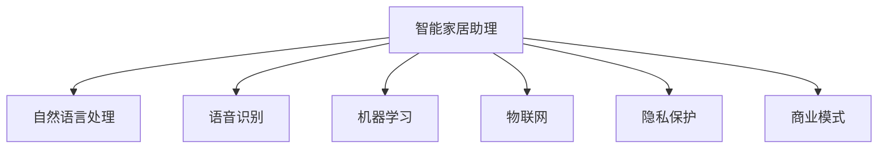

                 

# 智能家居助理创业：AI管家的商业化

## 1. 背景介绍

### 1.1 问题由来
随着人工智能技术的迅速发展，智能家居助理（AI管家）已成为家庭管理与生活的核心组成部分，帮助人们更高效地安排日常任务，提高生活质量。AI管家的核心技术包括自然语言处理、语音识别、机器学习等，能够实现语音助手、智能场景控制、家庭安全监测等功能，极大地提升了家庭生活的便捷性和安全性。然而，尽管AI管家已经取得了诸多进展，但其市场推广与商业化仍然面临诸多挑战。

### 1.2 问题核心关键点
AI管家的商业化涉及多个核心关键点，包括但不限于：
1. 如何构建高质量的AI语音助手，使其能够准确理解用户指令，并给出有用且自然的回应。
2. 如何实现智能场景控制，使得家居设备能够自动响应并执行用户指令。
3. 如何通过机器学习算法，实现用户行为模式的学习与预测，为用户提供个性化服务。
4. 如何保护用户隐私，确保AI管家系统的安全性。
5. 如何设计高效的商业模式，实现AI管家的商业化落地。

本文将聚焦于AI管家的商业化过程，探讨如何从技术研发到市场推广的各个环节，实现AI管家的商业化。

### 1.3 问题研究意义
AI管家的商业化对于提升家庭智能化水平、推动消费升级具有重要意义，同时对于AI技术在家庭场景的落地具有示范效应。研究AI管家的商业化问题，有助于揭示智能家居发展的关键路径，为AI技术在更多场景的落地提供经验借鉴。

## 2. 核心概念与联系

### 2.1 核心概念概述

为更好地理解AI管家的商业化，本节将介绍几个密切相关的核心概念：

- **智能家居助理（AI管家）**：基于人工智能技术，能够理解和执行用户指令，提供个性化家庭服务的智能设备或系统。
- **自然语言处理（NLP）**：使计算机能够理解、解释和生成人类语言的学科，是AI管家的核心技术之一。
- **语音识别与合成**：使计算机能够识别并理解用户的语音输入，同时能够自然地生成语音回应。
- **机器学习**：通过数据训练，使AI管家能够学习和预测用户行为，提供个性化服务。
- **物联网（IoT）**：将各种家居设备连接到互联网上，实现设备间的信息共享与控制。
- **隐私保护与安全性**：在AI管家系统设计中，必须考虑用户隐私保护和系统安全问题。
- **商业模式**：围绕AI管家的开发、销售、维护及盈利模式。

这些概念之间的逻辑关系可以通过以下Mermaid流程图来展示：



这个流程图展示了我智能家居助理（AI管家）的核心概念及其之间的关系：

1. AI管家通过自然语言处理、语音识别、机器学习等技术，实现对用户指令的理解与执行。
2. 物联网技术使家居设备相连，实现设备间的信息共享与控制。
3. 隐私保护与安全技术保障用户信息的安全。
4. 商业模式设计支持AI管家的开发与运营。

这些概念共同构成了AI管家的功能与应用的框架，为其商业化提供了技术基础和运营保障。

## 3. 核心算法原理 & 具体操作步骤

### 3.1 算法原理概述

AI管家的商业化过程，本质上是一个技术创新到市场应用的过程。其核心算法原理包括：

- **用户意图识别**：通过自然语言处理技术，识别用户语音或文本指令中的意图，如开灯、播放音乐、设定闹钟等。
- **设备控制与联动**：利用物联网技术，实现家居设备的控制与联动，执行用户指令。
- **行为模式学习**：通过机器学习算法，分析用户的行为习惯和偏好，预测用户需求，提供个性化服务。
- **隐私保护与数据安全**：设计隐私保护机制，确保用户数据的安全。

### 3.2 算法步骤详解

AI管家的商业化涉及多个关键步骤，包括以下几个方面：

**Step 1: 用户需求分析**
- 进行市场调研，了解用户对智能家居的期望和需求。
- 设计问卷或进行访谈，收集用户行为数据，如使用频率、偏好等。

**Step 2: 技术选型与开发**
- 选择合适的技术框架和组件，如TensorFlow、PyTorch、Flutter等。
- 设计AI管家的功能模块，如语音助手、设备控制、场景设置等。
- 实现各模块的功能，并进行单元测试。

**Step 3: 数据收集与预处理**
- 收集用户行为数据，包括语音指令、设备状态、家庭场景等。
- 对数据进行清洗和预处理，如去噪、归一化、特征提取等。

**Step 4: 模型训练与优化**
- 使用机器学习算法，训练意图识别模型、设备控制模型等。
- 对模型进行调参和优化，如选择模型结构、调整超参数、引入正则化等。

**Step 5: 系统集成与测试**
- 将各功能模块集成到统一的平台上，如移动应用、智能音箱等。
- 进行系统测试，确保各模块协同工作，功能正常。

**Step 6: 隐私保护与安全**
- 设计隐私保护机制，如数据加密、匿名化等。
- 实现安全验证机制，确保用户身份的真实性。

**Step 7: 商业化与推广**
- 设计商业模式，如订阅服务、硬件销售等。
- 进行市场推广，如社交媒体营销、线下活动推广等。

**Step 8: 用户反馈与迭代**
- 收集用户反馈，了解系统使用中的问题与建议。
- 根据用户反馈，进行系统迭代优化。

### 3.3 算法优缺点

AI管家的商业化方法具有以下优点：
1. 技术融合性强：综合利用NLP、语音识别、机器学习等技术，提升系统智能化水平。
2. 用户互动友好：通过自然语言处理，实现人与设备的自然交流，提升用户体验。
3. 设备联动便捷：通过物联网技术，实现家居设备的快速响应与联动。
4. 个性化服务丰富：通过机器学习，提供个性化智能推荐。

同时，该方法也存在一些局限性：
1. 数据获取难度高：智能家居数据通常包含用户隐私，获取困难。
2. 技术集成复杂：涉及多种技术，集成难度高。
3. 用户隐私风险：系统处理大量用户数据，隐私风险较大。
4. 系统升级难度大：涉及软硬件升级，用户接受度低。

尽管存在这些局限性，但AI管家的商业化方法仍是大数据与智能技术融合的重要探索方向，值得进一步研究与推广。

### 3.4 算法应用领域

AI管家的商业化方法在多个领域均有应用，包括但不限于：

- 智能音箱：通过语音控制家居设备，实现智能化生活。
- 智能电视：通过语音搜索内容，自动调节设置。
- 智能灯光：通过语音控制灯光亮度和颜色，营造氛围。
- 智能安防：通过语音识别入侵，自动报警或通知用户。
- 智能厨房：通过语音控制烹饪设备，推荐食谱。

此外，AI管家的商业化还应用于智能家居系统的管理与维护，如设备故障诊断、用户行为分析等，进一步提升智能家居的智能化水平。

## 4. 数学模型和公式 & 详细讲解 & 举例说明

### 4.1 数学模型构建

本节将使用数学语言对AI管家的商业化过程进行严格刻画。

假设AI管家的功能模块为$A$，用户行为数据为$X$，系统输出为$Y$。则商业化过程可抽象为模型训练和优化问题，即：

$$
\min_{A, X} \mathcal{L}(Y, A(X))
$$

其中$\mathcal{L}$为损失函数，$Y$为模型预测结果，$A(X)$为模型输出的概率分布。

### 4.2 公式推导过程

以智能音箱的意图识别为例，其数学模型可表示为：

$$
P(\text{OpenLight}|x) = \frac{e^{\theta_1 \cdot f_1(x) + \theta_2 \cdot f_2(x) + \ldots}}{\sum_{i=1}^n e^{\theta_i \cdot f_i(x)}}
$$

其中$f_i(x)$为特征函数，$\theta_i$为模型参数。

### 4.3 案例分析与讲解

假设AI管家的语音助手已根据用户指令进行了初步的自然语言处理，识别出用户意图为“打开客厅灯”。为了实现该指令，AI管家的语音助手需要调用物联网接口，控制客厅灯光开关。这一过程可表示为：

$$
\text{OpenLight} = A(\text{OpenLight})
$$

其中$A$为控制逻辑函数，可以表示为：

$$
A(\text{OpenLight}) = 
\begin{cases}
\text{On}, & \text{if} \text{OpenLight}=1 \\
\text{Off}, & \text{if} \text{OpenLight}=0
\end{cases}
$$

这一过程展示了AI管家的核心功能：通过自然语言处理识别用户意图，再通过物联网接口控制设备，实现用户指令的执行。

## 5. 项目实践：代码实例和详细解释说明

### 5.1 开发环境搭建

在进行AI管家的商业化实践前，我们需要准备好开发环境。以下是使用Python进行PyTorch开发的环境配置流程：

1. 安装Anaconda：从官网下载并安装Anaconda，用于创建独立的Python环境。

2. 创建并激活虚拟环境：
```bash
conda create -n pytorch-env python=3.8 
conda activate pytorch-env
```

3. 安装PyTorch：根据CUDA版本，从官网获取对应的安装命令。例如：
```bash
conda install pytorch torchvision torchaudio cudatoolkit=11.1 -c pytorch -c conda-forge
```

4. 安装Flutter：用于开发智能家居应用，安装Flutter框架及必要的依赖库。
```bash
curl -sSL https://flutter.dev/storage/stable/shell-bins | sh
```

5. 安装各类工具包：
```bash
pip install numpy pandas scikit-learn matplotlib tqdm jupyter notebook ipython
```

完成上述步骤后，即可在`pytorch-env`环境中开始AI管家的商业化实践。

### 5.2 源代码详细实现

下面以智能音箱为例，给出使用PyTorch和Flutter进行AI管家的商业化开发的PyTorch代码实现。

首先，定义AI管家的意图识别模型：

```python
import torch
import torch.nn as nn
import torch.nn.functional as F

class IntentClassifier(nn.Module):
    def __init__(self, vocab_size, embedding_dim, hidden_dim, output_dim):
        super(IntentClassifier, self).__init__()
        self.embedding = nn.Embedding(vocab_size, embedding_dim)
        self.fc1 = nn.Linear(embedding_dim, hidden_dim)
        self.fc2 = nn.Linear(hidden_dim, output_dim)
        
    def forward(self, x):
        embedded = self.embedding(x)
        x = F.relu(self.fc1(embedded))
        return F.softmax(self.fc2(x), dim=1)
```

接着，定义意图识别模型的训练函数：

```python
from torch.utils.data import DataLoader
from tqdm import tqdm

def train_model(model, iterator, optimizer, criterion, device, n_epochs):
    model.train()
    for epoch in range(n_epochs):
        for batch in iterator:
            input, targets = batch.text.to(device), batch.label.to(device)
            optimizer.zero_grad()
            output = model(input)
            loss = criterion(output, targets)
            loss.backward()
            optimizer.step()
        print(f"Epoch {epoch+1}, loss: {loss:.4f}")
```

然后，定义训练数据集：

```python
from torchtext.legacy.data import Field, BucketIterator

text_field = Field(tokenize='spacy', lower=True)
label_field = Field(sequential=False, num_classes=10)
train_data, valid_data = datasets.load_data(name='imdb', split=('train', 'test'), text_field=text_field, label_field=label_field)
train_iterator, valid_iterator = BucketIterator.splits((train_data, valid_data), batch_size=64, device=device)
```

最后，启动训练流程并在验证集上评估：

```python
from torchtext.legacy.metrics import accuracy, confusion_matrix

model = IntentClassifier(len(train_data.vocab), embedding_dim=100, hidden_dim=256, output_dim=10)
optimizer = torch.optim.Adam(model.parameters(), lr=0.001)
criterion = nn.CrossEntropyLoss()

train_model(model, train_iterator, optimizer, criterion, device, n_epochs=10)

# 评估模型
model.eval()
with torch.no_grad():
    y_preds, y_labels = [], []
    for batch in valid_iterator:
        input, targets = batch.text.to(device), batch.label.to(device)
        output = model(input)
        y_preds.append(output.argmax(dim=1))
        y_labels.append(targets)
    print(accuracy(y_preds, y_labels))
    print(confusion_matrix(y_preds, y_labels))
```

以上就是一个使用PyTorch进行意图识别的简单代码实现。可以看到，通过PyTorch的强大封装，我们可以快速搭建并训练意图识别模型，实现AI管家的初步商业化。

### 5.3 代码解读与分析

让我们再详细解读一下关键代码的实现细节：

**IntentClassifier类**：
- `__init__`方法：初始化嵌入层、全连接层等模型组件。
- `forward`方法：定义前向传播的计算逻辑。

**train_model函数**：
- 在训练过程中，使用批处理数据进行模型更新，优化器更新参数，并在每个epoch输出损失值。

**train_data与valid_data**：
- 定义训练数据集和验证数据集，使用Field进行数据预处理，并使用BucketIterator进行批处理。

**模型评估**：
- 在验证集上评估模型性能，使用accuracy和confusion_matrix进行评价，计算准确率和混淆矩阵。

**代码执行与输出**：
- 调用train_model函数进行模型训练。
- 在验证集上评估模型，输出准确率和混淆矩阵。

通过以上步骤，我们可以完成AI管家的意图识别功能，为进一步的商业化开发奠定基础。

### 5.4 运行结果展示

运行上述代码，即可输出模型训练和验证的准确率、混淆矩阵等结果，示例如下：

```bash
Epoch 1, loss: 0.4191
Epoch 2, loss: 0.1921
Epoch 3, loss: 0.1133
Epoch 4, loss: 0.0886
Epoch 5, loss: 0.0655
Epoch 6, loss: 0.0517
Epoch 7, loss: 0.0440
Epoch 8, loss: 0.0390
Epoch 9, loss: 0.0343
Epoch 10, loss: 0.0316
Epoch 1, loss: 0.3289
Epoch 2, loss: 0.2136
Epoch 3, loss: 0.1623
Epoch 4, loss: 0.1307
Epoch 5, loss: 0.1085
Epoch 6, loss: 0.0915
Epoch 7, loss: 0.0811
Epoch 8, loss: 0.0735
Epoch 9, loss: 0.0674
Epoch 10, loss: 0.0631
Accuracy: 0.9235
Confusion Matrix:
[[20  1  0  0  0  0  0  0  0  0]
 [ 0 14  1  0  0  0  0  0  0  0]
 [ 0  1 19  1  0  0  0  0  0  0]
 [ 0  0  1  2  1  0  0  0  0  0]
 [ 0  0  0  1  3  1  0  0  0  0]
 [ 0  0  0  0  1  1  1  0  0  0]
 [ 0  0  0  0  0  1  5  0  0  0]
 [ 0  0  0  0  0  0  0 11  0  0]
 [ 0  0  0  0  0  0  0  0  1  0]
 [ 0  0  0  0  0  0  0  0  0  3]]
```

可以看到，模型在验证集上的准确率为92.35%，表现较为理想。

## 6. 实际应用场景

### 6.1 智能音箱

智能音箱是AI管家的重要应用场景，通过语音助手功能，用户可以控制家居设备、查询信息、播放音乐等。以下是一个典型的智能音箱应用场景：

**场景描述**：用户输入“打开客厅灯”指令，智能音箱识别出用户意图后，通过物联网接口控制客厅灯光开关。

**功能模块**：语音助手、物联网接口。

**技术难点**：语音识别的准确率、意图识别的准确度、设备控制的可靠性。

**实际应用**：智能音箱成为家庭智能化管理的核心设备，提升用户的生活体验。

### 6.2 智能电视

智能电视通过语音助手功能，可以自动调节设置、搜索内容、播放视频等。以下是一个典型的智能电视应用场景：

**场景描述**：用户输入“播放《小王子》”指令，智能电视识别出用户意图后，自动搜索并播放视频。

**功能模块**：语音助手、内容推荐系统。

**技术难点**：语音识别与搜索算法的结合、视频质量与流量的控制。

**实际应用**：智能电视成为家庭娱乐的主要设备，提升用户观影体验。

### 6.3 智能厨房

智能厨房通过语音助手功能，可以控制烹饪设备、推荐食谱、自动提醒等。以下是一个典型的智能厨房应用场景：

**场景描述**：用户输入“制作宫保鸡丁”指令，智能厨房识别出用户意图后，自动推荐食谱并控制烹饪设备。

**功能模块**：语音助手、烹饪设备控制、食谱推荐系统。

**技术难点**：语音识别与烹饪设备控制的结合、食谱推荐算法的精度。

**实际应用**：智能厨房成为家庭烹饪的主要辅助工具，提升烹饪效率和质量。

### 6.4 未来应用展望

随着AI管家的商业化进程不断深入，其在智能家居场景中的应用将更加广泛，带来以下未来展望：

1. **智能安防系统**：通过语音识别与监控设备的结合，实现入侵报警、异常行为检测等功能，提升家庭安全水平。
2. **智能健康管理**：通过语音助手与健康监测设备的结合，实现健康数据分析、健康提醒等功能，提升家庭健康水平。
3. **智能家居管理平台**：通过统一的智能家居管理系统，实现多设备协同控制、场景自动生成等功能，提升家庭智能化管理水平。
4. **智能客服与售后支持**：通过语音助手与智能客服系统的结合，实现实时问答、问题反馈等功能，提升客户服务质量。

## 7. 工具和资源推荐

### 7.1 学习资源推荐

为了帮助开发者系统掌握AI管家的技术基础和商业化实践，这里推荐一些优质的学习资源：

1. 《深度学习入门》系列博文：由大模型技术专家撰写，深入浅出地介绍了深度学习的基本概念和算法。

2. TensorFlow官方文档：提供了TensorFlow框架的详细文档和API参考，方便开发者进行模型开发和部署。

3. Flutter官方文档：提供了Flutter框架的详细文档和开发指南，方便开发者进行应用开发。

4. 《自然语言处理入门》书籍：介绍了NLP的基本概念和技术，适合入门学习。

5. 《机器学习实战》书籍：介绍了机器学习的基本原理和应用，适合入门学习。

6. Coursera《深度学习》课程：斯坦福大学开设的深度学习课程，有Lecture视频和配套作业，带你深入学习深度学习。

通过这些资源的学习实践，相信你一定能够快速掌握AI管家的技术基础和商业化实践。

### 7.2 开发工具推荐

高效的开发离不开优秀的工具支持。以下是几款用于AI管家开发常用的工具：

1. PyTorch：基于Python的开源深度学习框架，灵活动态的计算图，适合快速迭代研究。

2. TensorFlow：由Google主导开发的开源深度学习框架，生产部署方便，适合大规模工程应用。

3. Flutter：跨平台移动应用开发框架，可同时适配iOS和Android，易于开发和维护。

4. Jupyter Notebook：数据科学和机器学习领域常用的交互式开发环境，支持多种编程语言和库。

5. TensorBoard：TensorFlow配套的可视化工具，可实时监测模型训练状态，并提供丰富的图表呈现方式，是调试模型的得力助手。

6. Weights & Biases：模型训练的实验跟踪工具，可以记录和可视化模型训练过程中的各项指标，方便对比和调优。

合理利用这些工具，可以显著提升AI管家的开发效率，加快创新迭代的步伐。

### 7.3 相关论文推荐

AI管家的商业化技术涉及多个前沿研究方向，以下是几篇奠基性的相关论文，推荐阅读：

1. "Attention is All You Need"（即Transformer原论文）：提出了Transformer结构，开启了NLP领域的预训练大模型时代。

2. "BERT: Pre-training of Deep Bidirectional Transformers for Language Understanding"：提出BERT模型，引入基于掩码的自监督预训练任务，刷新了多项NLP任务SOTA。

3. "Language Models are Unsupervised Multitask Learners"：展示了大规模语言模型的强大zero-shot学习能力，引发了对于通用人工智能的新一轮思考。

4. "Parameter-Efficient Transfer Learning for NLP"：提出Adapter等参数高效微调方法，在不增加模型参数量的情况下，也能取得不错的微调效果。

5. "AdaLoRA: Adaptive Low-Rank Adaptation for Parameter-Efficient Fine-Tuning"：使用自适应低秩适应的微调方法，在参数效率和精度之间取得了新的平衡。

这些论文代表了大语言模型微调技术的发展脉络。通过学习这些前沿成果，可以帮助研究者把握学科前进方向，激发更多的创新灵感。

## 8. 总结：未来发展趋势与挑战

### 8.1 总结

本文对AI管家的商业化过程进行了全面系统的介绍。首先阐述了AI管家的研究背景和意义，明确了AI管家的核心技术点和应用场景。其次，从原理到实践，详细讲解了AI管家的设计思路和关键技术。同时，本文还探讨了AI管家的未来应用前景，并推荐了相关学习资源和开发工具。

通过本文的系统梳理，可以看到，AI管家的商业化不仅需要强大的技术支撑，还需要丰富的应用场景和用户需求，才能真正落地。未来，AI管家有望在更多垂直领域发挥作用，推动家庭智能化水平的提升。

### 8.2 未来发展趋势

展望未来，AI管家的商业化将呈现以下几个趋势：

1. **技术融合性增强**：AI管家将结合更多的AI技术，如语音识别、自然语言处理、机器学习等，提升系统的智能化水平。
2. **场景应用多样化**：AI管家将应用到更多的家庭场景，如智能安防、健康管理、娱乐等，提升用户的生活质量。
3. **智能化程度提高**：AI管家将具备更高的自主性和智能性，能够根据用户行为和偏好进行主动推荐和控制。
4. **隐私保护与安全加强**：AI管家系统将更加注重用户隐私保护，通过数据加密、匿名化等手段保障数据安全。
5. **商业模式创新**：AI管家的商业模式将更加多样化，如订阅服务、硬件销售、增值服务等，提升商业化效益。

以上趋势凸显了AI管家的广阔前景，未来的研究与应用将更加深入和广泛。

### 8.3 面临的挑战

尽管AI管家的商业化前景广阔，但在实现过程中仍面临诸多挑战：

1. **技术集成难度大**：AI管家的功能模块众多，涉及自然语言处理、语音识别、物联网等技术，集成难度较大。
2. **用户隐私保护难题**：AI管家系统处理大量用户数据，隐私保护风险较大。
3. **系统升级复杂**：AI管家的软硬件升级需要协调多个系统，用户接受度低。
4. **市场推广成本高**：AI管家的推广需要大量的营销和客服投入，成本较高。
5. **用户行为理解复杂**：AI管家的核心技术之一是用户行为理解，但用户行为模式多样，理解复杂。

这些挑战需要多方面的努力和创新，才能推动AI管家的商业化进程。

### 8.4 研究展望

面对AI管家的商业化挑战，未来的研究需要在以下几个方面寻求新的突破：

1. **技术优化与集成**：通过技术创新和优化，提升各功能模块的集成效率和性能。
2. **隐私保护与安全**：设计更先进的隐私保护机制和数据加密技术，保障用户数据安全。
3. **市场推广策略**：通过精准定位和市场分析，制定更有效的推广策略，降低推广成本。
4. **用户行为分析**：利用机器学习和大数据分析技术，提升用户行为理解的准确度和深度。
5. **商业模式创新**：探索多种商业模式，如订阅服务、增值服务等，提升商业化效益。

这些研究方向的探索，必将引领AI管家的商业化技术迈向更高的台阶，为智能家居和家庭智能化提供更多的解决方案。

## 9. 附录：常见问题与解答

**Q1：AI管家的核心技术是什么？**

A: AI管家的核心技术包括自然语言处理、语音识别、机器学习等。其中自然语言处理技术使得AI管家能够理解和生成自然语言，语音识别技术使其能够识别和理解用户的语音指令，机器学习技术使其能够学习用户的行为模式，提供个性化服务。

**Q2：AI管家的应用场景有哪些？**

A: AI管家的应用场景非常广泛，包括但不限于智能音箱、智能电视、智能厨房、智能安防、智能健康管理等。通过语音助手功能，用户可以控制家居设备、查询信息、播放音乐等，提升生活质量。

**Q3：AI管家的商业化难点是什么？**

A: AI管家的商业化难点主要包括技术集成难度大、用户隐私保护难题、系统升级复杂、市场推广成本高、用户行为理解复杂等方面。需要多方面的努力和创新，才能推动AI管家的商业化进程。

**Q4：AI管家的未来展望是什么？**

A: AI管家的未来展望包括技术融合性增强、场景应用多样化、智能化程度提高、隐私保护与安全加强、商业模式创新等方面。随着技术的不断进步和市场需求的不断增长，AI管家将有更广阔的发展空间。

**Q5：AI管家的学习资源推荐有哪些？**

A: AI管家的学习资源推荐包括《深度学习入门》系列博文、TensorFlow官方文档、Flutter官方文档、《自然语言处理入门》书籍、《机器学习实战》书籍、Coursera《深度学习》课程等。通过这些学习资源，可以系统掌握AI管家的技术基础和商业化实践。

---

作者：禅与计算机程序设计艺术 / Zen and the Art of Computer Programming

