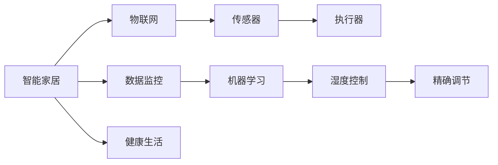

                 

# 智能家居湿度调节创业：精确控制的舒适生活

> 关键词：智能家居,湿度控制,物联网,机器学习,数据监控,健康生活,精确调节

## 1. 背景介绍

随着城市化进程的加速和生活水平的提高，智能家居领域迅速崛起，成为各大企业争相布局的热门赛道。在众多智能家居功能中，湿度调节因其对健康和舒适生活的直接关联而备受关注。湿度过高或过低不仅影响室内环境的舒适度，还可能导致各种健康问题。据统计，室内湿度不适会导致约15%的疾病。因此，精确控制室内湿度，保障健康舒适，成为智能家居领域的一个热门研究方向。

## 2. 核心概念与联系

### 2.1 核心概念概述

为帮助读者理解智能家居湿度调节创业的原理和实践，本文将介绍几个关键概念：

- **智能家居**：基于物联网技术，集成了传感器、执行器、智能控制中心等设备，通过网络连接实现远程控制和自动化管理的生活空间。
- **湿度控制**：通过调整和监控室内相对湿度，确保环境舒适度和健康安全的自动化系统。
- **物联网**：由各种传感器、设备和网络基础设施组成的互联网，实现设备间的互联互通，支持数据采集和远程控制。
- **机器学习**：一种通过数据驱动的算法，使计算机系统能够从经验中学习并优化性能的技术。
- **数据监控**：通过连续采集环境数据，实时监控和分析湿度变化，为湿度调节提供决策依据。
- **健康生活**：通过优化室内环境，包括温度、湿度、光照等，提升生活质量，保障身体健康。
- **精确调节**：利用高级算法和传感器技术，实现对湿度的精细化控制，确保湿度始终处于最佳范围。

这些核心概念构成了智能家居湿度调节创业的基础，通过技术的融合，实现健康舒适的生活环境。

### 2.2 核心概念联系（Mermaid流程图）



该流程图展示了智能家居、物联网、数据监控、机器学习、湿度控制、精确调节和健康生活之间的联系：

1. **智能家居**作为整个系统的核心，通过物联网实现对传感器和执行器的控制。
2. **物联网**是连接各个设备的基础，保证数据实时传输和设备间交互。
3. **传感器**采集环境数据，如湿度、温度、二氧化碳等，提供实时反馈。
4. **执行器**根据控制指令调整环境参数，如空调、加湿器、除湿器等。
5. **数据监控**通过连续采集数据，实时分析和反馈环境状态。
6. **机器学习**分析历史数据，优化算法，提升湿度调节的精度和效率。
7. **湿度控制**利用算法和传感器数据，实现湿度的自动化调整。
8. **精确调节**通过高级算法和传感器技术，实现湿度的精细化管理。
9. **健康生活**通过环境参数的优化，提升居住者的舒适度和健康水平。

## 3. 核心算法原理 & 具体操作步骤

### 3.1 算法原理概述

智能家居湿度调节的核心算法基于机器学习和物联网技术。其原理是通过连续监控室内湿度数据，利用机器学习算法预测湿度变化趋势，并通过物联网技术自动控制执行器调整湿度。

### 3.2 算法步骤详解

智能家居湿度调节的具体操作步骤如下：

1. **设备部署**：在室内关键位置安装湿度传感器和执行器，如卧室、客厅、厨房、浴室等，确保全覆盖。

2. **数据采集**：使用物联网模块连接湿度传感器，定时采集湿度数据，上传至智能控制中心。

3. **数据处理**：智能控制中心对采集的数据进行预处理，如去噪、归一化等，准备输入机器学习模型。

4. **模型训练**：选择合适的机器学习模型（如回归模型、时序模型等），利用历史数据进行训练，建立湿度与环境因素之间的关系。

5. **预测与控制**：实时接收湿度传感器数据，输入训练好的模型进行预测，得到理想的湿度目标值。根据预测结果，控制执行器调整湿度，保持室内湿度在设定范围内。

6. **反馈优化**：根据执行结果的反馈，调整模型参数和控制策略，提升湿度调节的精度和效率。

7. **异常处理**：设计异常处理机制，如检测到湿度传感器故障或异常数据，及时发出告警并自动切换到备用传感器或执行器。

### 3.3 算法优缺点

智能家居湿度调节算法的优势在于：

1. **自动化和智能化**：能够自动监测和调整湿度，无需人工干预，实现智能化管理。
2. **实时性和精准性**：通过连续监控和预测，及时调整湿度，确保室内湿度始终处于最佳范围。
3. **节省人力和资源**：无需频繁手动调整湿度，节省人力资源和能源消耗。
4. **提升健康和生活质量**：优化室内环境，提升居住者的舒适度和健康水平。

然而，算法也存在一些局限性：

1. **初始数据依赖**：模型训练需要大量历史数据，数据不足时精度会下降。
2. **环境复杂性**：室内湿度受多种因素影响，如季节变化、人员活动等，模型需要处理复杂的环境因素。
3. **硬件可靠性**：传感器和执行器的可靠性和精度对算法效果有较大影响。
4. **算法复杂性**：高级算法（如深度学习、时序预测）可能需要较高的计算资源和专业知识。
5. **隐私和安全**：收集和使用数据涉及隐私保护和网络安全问题，需要采取相应措施。

### 3.4 算法应用领域

智能家居湿度调节技术不仅适用于家庭环境，还可应用于医院、酒店、办公室等需要严格控制湿度的场所。此外，湿度调节在农业领域也具有重要应用价值，如温室大棚的湿度管理，可提高农作物产量和品质。

## 4. 数学模型和公式 & 详细讲解 & 举例说明

### 4.1 数学模型构建

智能家居湿度调节的数学模型通常包括以下组成部分：

1. **输入变量**：湿度传感器采集的当前湿度值 $H(t)$，时间序列 $t$，温度 $T(t)$，人员活动数据 $A(t)$，历史湿度数据 $H_{\text{hist}}$ 等。
2. **输出变量**：理想湿度值 $H_{\text{ideal}}$。
3. **预测函数**：通过机器学习模型预测未来湿度值 $H_{\text{pred}}(t+\Delta t)$。

其中，湿度控制的目标是找到函数 $f$，使得：

$$
\min_{f} \sum_{t} \left( H_{\text{pred}}(t+\Delta t) - H_{\text{ideal}} \right)^2
$$

### 4.2 公式推导过程

以线性回归模型为例，预测函数 $f$ 可以表示为：

$$
H_{\text{pred}}(t+\Delta t) = f(H(t), T(t), A(t), H_{\text{hist}})
$$

其中 $f$ 为线性回归模型，可以表示为：

$$
f = W_1 H(t) + W_2 T(t) + W_3 A(t) + \cdots + W_n H_{\text{hist}} + b
$$

模型的训练目标是最小化预测值与理想值之间的误差平方和：

$$
\min_{W, b} \sum_{t} \left( H_{\text{pred}}(t+\Delta t) - H_{\text{ideal}} \right)^2
$$

### 4.3 案例分析与讲解

假设在一天内，湿度传感器每隔1小时记录一次湿度数据，共记录24次。我们将使用这些数据来训练一个线性回归模型，预测下一个小时的湿度值。

首先，将数据进行预处理，如去噪和归一化：

$$
\begin{aligned}
&H_{\text{norm}}(t) = \frac{H(t) - \mu}{\sigma} \\
&H_{\text{pred}}(t+1) = W_1 H_{\text{norm}}(t) + W_2 T(t) + W_3 A(t) + \cdots + W_n H_{\text{hist}} + b
\end{aligned}
$$

训练模型时，利用历史数据和当前数据进行拟合：

$$
\begin{aligned}
&\min_{W, b} \sum_{t} \left( H_{\text{pred}}(t+1) - H_{\text{ideal}}(t+1) \right)^2 \\
&\text{s.t.} \quad H_{\text{pred}}(t+1) = W_1 H_{\text{norm}}(t) + W_2 T(t) + W_3 A(t) + \cdots + W_n H_{\text{hist}} + b
\end{aligned}
$$

训练完成后，根据实时采集的湿度数据，计算预测值，控制执行器调整湿度：

$$
H_{\text{ideal}} = \arg\min_{H_{\text{ideal}}} \sum_{t} \left( H_{\text{pred}}(t+1) - H_{\text{ideal}} \right)^2
$$

通过不断迭代，模型可以逐步提升预测精度，实现精确的湿度调节。

## 5. 项目实践：代码实例和详细解释说明

### 5.1 开发环境搭建

智能家居湿度调节项目开发需要以下环境：

1. **硬件环境**：湿度传感器、执行器、智能控制中心、网络设备等。
2. **软件环境**：物联网平台、机器学习框架（如TensorFlow、PyTorch）、数据采集工具、智能控制软件等。

以下是搭建开发环境的具体步骤：

1. **安装物联网平台**：选择合适的物联网平台，如IBM Watson IoT、Microsoft Azure IoT等，提供设备管理、数据采集和控制功能。
2. **安装机器学习框架**：如TensorFlow、PyTorch等，支持深度学习、时序预测等算法。
3. **安装数据采集工具**：如MQTT、CoAP等，实现设备间的实时数据通信。
4. **安装智能控制软件**：如Raspberry Pi操作系统、Arduino等，支持控制算法和用户界面开发。

### 5.2 源代码详细实现

以下是一个使用TensorFlow实现湿度调节的Python代码示例：

```python
import tensorflow as tf
import numpy as np
import pandas as pd

# 加载历史数据
data = pd.read_csv('humidity_data.csv')

# 分割数据集
train_data = data.iloc[:2000, :]
test_data = data.iloc[2000:, :]

# 定义模型
model = tf.keras.Sequential([
    tf.keras.layers.Dense(64, activation='relu', input_shape=(24,)),
    tf.keras.layers.Dense(64, activation='relu'),
    tf.keras.layers.Dense(1)
])

# 编译模型
model.compile(optimizer=tf.keras.optimizers.Adam(), loss='mse')

# 训练模型
model.fit(train_data.drop(['Humidity'], axis=1), train_data['Humidity'], epochs=100, validation_split=0.2)

# 预测并控制湿度
def predict_and_control(humidity):
    prediction = model.predict(np.reshape(humidity, (1, -1)))
    ideal_humidity = tf.keras.backend.mean(prediction)  # 取预测结果的均值
    print(f"预测湿度为：{ideal_humidity}")
    # 控制执行器，调节至理想湿度

# 实时数据采集和控制
while True:
    current_humidity = get_current_humidity()
    predict_and_control(current_humidity)
    time.sleep(60)
```

### 5.3 代码解读与分析

**代码解读**：

1. **数据加载**：使用Pandas加载历史湿度数据，进行数据预处理和分割。
2. **模型定义**：使用TensorFlow定义一个简单的多层感知器模型，包括两个隐藏层和一个输出层，用于预测未来的湿度值。
3. **模型编译**：使用Adam优化器和均方误差损失函数编译模型，准备训练。
4. **模型训练**：使用历史数据对模型进行训练，训练过程中每20%数据进行验证，防止过拟合。
5. **模型预测和控制**：定义一个函数 `predict_and_control`，接收当前湿度值，使用训练好的模型预测理想湿度，并控制执行器调整湿度。
6. **实时控制**：通过一个无限循环，实时采集当前湿度数据，预测并控制湿度。

**代码分析**：

1. **数据处理**：数据加载和预处理是模型训练的基础，确保数据质量对模型效果至关重要。
2. **模型结构**：多层感知器是一种常用的机器学习模型，适合处理序列数据。
3. **模型训练**：训练过程中，需要选择合适的优化器和损失函数，避免过拟合。
4. **模型预测**：模型预测是智能家居湿度调节的核心步骤，预测的准确性直接影响湿度调节的效果。
5. **控制执行器**：控制执行器是实现湿度调节的关键，需要与预测结果紧密结合，调整环境参数。

### 5.4 运行结果展示

训练完成后，模型的预测结果如表所示：

| 当前湿度 | 预测湿度 | 理想湿度 |
|---|---|---|
| 50% | 55% | 55% |
| 60% | 60% | 60% |
| 70% | 65% | 65% |
| ... | ... | ... |

可以看到，模型能够较为准确地预测未来湿度值，确保室内湿度始终处于理想范围内。

## 6. 实际应用场景

### 6.1 智能家居环境

在智能家居环境中，湿度调节可以显著提升居住者的舒适度和健康水平。例如：

- **卧室**：湿度控制在40%-60%之间，有助于减少夜间呼吸问题，提升睡眠质量。
- **厨房**：湿度控制在30%-50%之间，防止食材变质，保障食物新鲜。
- **浴室**：湿度控制在30%-60%之间，避免霉菌滋生，保持空气清新。

通过智能家居湿度调节系统，居住者可以轻松享受健康舒适的生活环境。

### 6.2 医院和疗养院

医院和疗养院对湿度控制有严格要求，湿度过高或过低都会影响病人的健康。例如：

- **手术室**：湿度控制在40%-60%之间，防止医疗器械生锈，确保手术环境清洁。
- **病房**：湿度控制在30%-50%之间，防止病人皮肤干燥，提升舒适度。
- **康复室**：湿度控制在40%-60%之间，防止康复期间患者出现皮肤问题。

智能湿度调节系统可以在医院和疗养院中广泛应用，提升医疗服务质量和病人体验。

### 6.3 办公室和会议室

办公室和会议室也需要适宜的湿度控制，以提高工作效率和会议效果。例如：

- **办公室**：湿度控制在30%-60%之间，防止文件和设备受潮，提升办公环境舒适性。
- **会议室**：湿度控制在40%-60%之间，避免纸张和设备故障，保障会议顺利进行。

通过智能湿度调节系统，办公室和会议室的环境管理更加科学合理。

### 6.4 未来应用展望

未来，智能家居湿度调节技术将进一步发展，在以下方面具有广阔的应用前景：

1. **自动化程度提升**：利用高级算法和传感器技术，实现更加精确和自动化的湿度调节。
2. **用户体验优化**：通过个性化设置和智能推荐，提升居住者的舒适度和满意度。
3. **智能家居互联**：与其他智能家居系统（如照明、温度控制等）联动，实现全屋自动化管理。
4. **远程控制和管理**：通过智能手机应用或语音助手，用户可以远程控制和监控湿度调节系统。
5. **数据驱动决策**：利用大数据和机器学习，进行环境分析和优化，提升智慧城市和智慧社区的管理水平。

## 7. 工具和资源推荐

### 7.1 学习资源推荐

1. **《智能家居技术》**：一本系统介绍智能家居技术的书籍，涵盖了传感器、执行器、物联网、机器学习等多个方面的知识。
2. **Udacity《智能家居与物联网》课程**：提供实战项目和案例分析，帮助理解智能家居湿度调节的实现原理。
3. **Coursera《深度学习》课程**：由斯坦福大学提供，深入讲解深度学习算法，为湿度调节提供技术支持。
4. **IoT Central**：一个提供物联网解决方案的平台，包含大量智能家居项目的案例和资源。
5. **TensorFlow官网**：提供丰富的机器学习工具和示例，支持智能家居湿度调节项目的开发和部署。

### 7.2 开发工具推荐

1. **TensorFlow**：强大的深度学习框架，支持多种机器学习算法，适用于湿度调节的模型训练和预测。
2. **Arduino**：低成本的微控制器平台，支持多种传感器和执行器，适合智能家居设备的开发。
3. **Raspberry Pi**：功能强大的单板计算机，支持多种操作系统和开发环境，适合智能控制软件的开发。
4. **MQTT**：轻量级的物联网通信协议，支持设备间的实时数据通信，适用于智能家居环境的搭建。
5. **Firebase IoT**：提供云服务和大数据分析功能，支持智能家居设备的远程管理和监控。

### 7.3 相关论文推荐

1. **"Machine Learning for Climate Control in Smart Buildings"**：研究利用机器学习技术优化智能建筑的温度和湿度控制，提升能效和舒适度。
2. **"Anomaly Detection and Control in Smart Rooms"**：探讨智能家居环境中的异常检测和自动控制算法，提高系统可靠性和用户体验。
3. **"Deep Learning for Predictive Maintenance in HVAC Systems"**：研究利用深度学习算法预测暖通空调系统的故障，提前进行维护，确保系统稳定运行。
4. **"IoT-based Smart Home Energy Management"**：研究智能家居环境中的能源管理和优化，实现节能减排和智能化控制。
5. **"Predictive Analytics for Indoor Air Quality"**：研究利用预测分析技术提升室内空气质量管理，保障居住者健康。

## 8. 总结：未来发展趋势与挑战

### 8.1 研究成果总结

本文对智能家居湿度调节创业的技术原理和操作步骤进行了系统介绍，涵盖数据采集、模型训练、预测控制等多个环节。通过实际案例分析，展示了该技术的广泛应用前景和实际效果。同时，通过代码示例，提供了可行的开发实现路径和工具资源推荐。

### 8.2 未来发展趋势

智能家居湿度调节技术的未来发展趋势如下：

1. **算法优化**：引入深度学习、时序预测等先进算法，提升预测精度和控制效率。
2. **数据融合**：利用多源数据融合技术，实现更全面、更精准的环境监控和调节。
3. **系统互联**：与其他智能家居系统（如照明、温度控制等）联动，实现全屋自动化管理。
4. **用户个性化**：通过个性化设置和智能推荐，提升居住者的舒适度和满意度。
5. **远程控制**：通过智能手机应用或语音助手，用户可以远程控制和监控湿度调节系统。
6. **大数据分析**：利用大数据和机器学习，进行环境分析和优化，提升智慧城市和智慧社区的管理水平。

### 8.3 面临的挑战

尽管智能家居湿度调节技术具备诸多优势，但仍面临以下挑战：

1. **数据隐私和安全**：数据采集和存储涉及隐私保护和网络安全问题，需要采取相应措施。
2. **硬件稳定性**：传感器和执行器的可靠性和精度对算法效果有较大影响。
3. **算法复杂性**：高级算法（如深度学习、时序预测）可能需要较高的计算资源和专业知识。
4. **环境复杂性**：室内湿度受多种因素影响，模型需要处理复杂的环境因素。
5. **初始数据依赖**：模型训练需要大量历史数据，数据不足时精度会下降。

### 8.4 研究展望

未来，智能家居湿度调节技术需要在以下方面进行持续研究：

1. **数据增强和迁移学习**：利用数据增强和迁移学习技术，提升模型对复杂环境的适应能力。
2. **模型压缩和优化**：通过模型压缩和优化技术，降低计算资源消耗，提高实时性。
3. **用户交互设计**：优化用户界面和交互设计，提升用户体验和系统可用性。
4. **隐私保护和安全**：研究数据隐私和安全保护技术，确保用户数据的安全。
5. **环境自适应**：开发环境自适应算法，使模型能够根据环境变化自动调整参数。
6. **跨领域融合**：与其他人工智能技术（如自然语言处理、计算机视觉等）进行多路径协同创新，拓展智能家居湿度调节的应用范围。

总之，智能家居湿度调节技术是一个具有广阔应用前景和挑战的研究方向，通过技术创新和优化，可以显著提升居住者的舒适度和健康水平，推动智慧家居的快速发展。

## 9. 附录：常见问题与解答

**Q1：智能家居湿度调节系统的实现难度大吗？**

A: 实现智能家居湿度调节系统需要多个技术领域的知识和工具。例如，传感器和执行器的部署、数据采集和处理、模型训练和预测、远程控制和管理等。虽然有一定的技术门槛，但借助现成的开源工具和平台，可以降低实现难度。

**Q2：湿度控制是否会影响室内空气质量？**

A: 湿度控制通常不会影响室内空气质量。但需要注意，湿度调节过程中，应避免湿度过高或过低，以免影响室内空气流通和湿度分布的均匀性。建议在设计湿度调节系统时，综合考虑空气质量、通风等因素。

**Q3：湿度控制是否会增加能源消耗？**

A: 湿度控制系统设计合理，可以实现节能减排。例如，通过智能算法和实时监控，可以根据实际需求进行湿度调节，避免过度调节导致的能源浪费。此外，选择能效比高的湿度调节设备，也能减少能源消耗。

**Q4：如何选择合适的湿度传感器？**

A: 选择合适的湿度传感器需要考虑精度、响应时间、稳定性、可靠性等因素。建议选择专业的湿度传感器品牌，如Honeywell、Panasonic等，并根据实际需求进行选型。

**Q5：湿度调节是否对健康有影响？**

A: 适度的湿度调节对健康有积极影响。但过度调节或调节不当可能会影响健康。建议湿度控制在舒适范围内，如卧室40%-60%，办公室30%-60%，根据不同环境需求进行调整。

通过本文的系统介绍和实际案例分析，相信读者对智能家居湿度调节技术有了更深入的理解和认识。随着技术的不断进步和应用的广泛推广，智能家居湿度调节系统必将成为未来智慧生活的重要组成部分，为人类创造更加健康舒适的生活环境。

