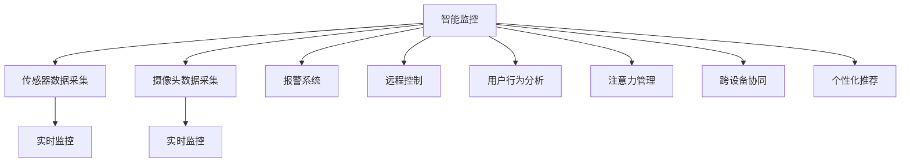

                 

# 智能家居的智能监控与注意力管理

> 关键词：智能家居, 智能监控, 注意力管理, IoT, 深度学习, 计算机视觉, 用户行为分析

## 1. 背景介绍

### 1.1 问题由来
随着科技的迅猛发展，智能家居系统的应用逐渐普及，为人们提供了更加便捷、舒适、安全的生活环境。智能家居设备能够通过互联网连接，实现设备间的互操作，提供自动化和远程控制，使得家庭生活更加智能化。然而，智能家居系统也带来了新的挑战：如何通过智能监控系统及时发现异常情况，如何有效管理用户的注意力分配，以及如何综合考虑用户行为和设备状态，以实现更加个性化和智能化的家居环境。这些问题成为智能家居系统进一步发展的关键瓶颈。

### 1.2 问题核心关键点
智能家居的智能监控与注意力管理涉及多个关键点：
- **智能监控**：通过传感器、摄像头等设备收集室内外环境数据，实时监控家庭环境，检测异常情况并及时报警。
- **注意力管理**：根据用户的行为和偏好，智能调节家居设备状态，确保用户专注于当前任务，避免分心或疲劳。
- **跨设备协同**：不同设备之间的数据互联和智能协同，以实现更高效的家庭自动化控制。
- **个性化推荐**：通过分析用户的行为和偏好，推荐最适合用户的家居设备和功能。

解决这些问题，能够极大提升智能家居系统的用户体验，使其更加智能和人性化。

## 2. 核心概念与联系

### 2.1 核心概念概述

智能家居系统是一个复杂的信息集成平台，涵盖感知、处理、执行等多个环节。下面我们将详细介绍涉及的核心概念：

- **智能监控**：利用传感器和摄像头等设备，收集家庭环境数据，实时监控环境状态，检测异常情况并及时报警。
- **注意力管理**：通过分析用户的行为和偏好，智能调节家居设备状态，确保用户专注于当前任务。
- **跨设备协同**：不同设备之间通过互联网连接，实现数据互联和智能协同，提升家居系统的整体效率。
- **个性化推荐**：通过分析用户的行为和偏好，推荐最适合用户的家居设备和功能。

### 2.2 核心概念原理和架构的 Mermaid 流程图



该流程图展示了智能家居系统中各核心概念之间的联系和数据流向：

1. **传感器数据采集**：通过传感器监测温度、湿度、烟雾、门窗状态等环境数据，及时发现异常。
2. **摄像头数据采集**：通过摄像头采集家庭内外的视频图像，实时监控动态环境变化。
3. **报警系统**：根据传感器和摄像头的数据，检测到异常情况后，触发报警机制，通知用户。
4. **远程控制**：用户可以通过手机App等远程控制家居设备，实现一键操作。
5. **用户行为分析**：通过分析用户的行为数据，了解用户的偏好和习惯，提供个性化服务。
6. **注意力管理**：根据用户行为分析结果，智能调节家居设备，确保用户专注于当前任务。
7. **跨设备协同**：不同设备之间通过网络互联，实现设备间的智能协同，提升家居系统的整体效率。
8. **个性化推荐**：根据用户的行为数据，推荐最适合用户的家居设备和功能，提升用户体验。

## 3. 核心算法原理 & 具体操作步骤

### 3.1 算法原理概述

智能家居系统的智能监控与注意力管理涉及多个算法和技术，包括深度学习、计算机视觉、用户行为分析等。其核心算法原理可总结如下：

- **深度学习**：用于处理传感器和摄像头数据，实现环境异常检测和用户行为分析。
- **计算机视觉**：通过摄像头数据，实现人脸识别、物体识别等。
- **用户行为分析**：通过分析用户的行为数据，了解用户的偏好和习惯。
- **注意力管理**：通过调节家居设备状态，确保用户专注于当前任务。
- **跨设备协同**：通过网络互联，实现不同设备间的智能协同。
- **个性化推荐**：通过分析用户行为数据，推荐最适合用户的家居设备和功能。

### 3.2 算法步骤详解

智能家居系统的智能监控与注意力管理主要包括以下几个关键步骤：

**Step 1: 数据收集和预处理**

1. **传感器数据收集**：通过各种传感器收集家庭环境数据，如温度、湿度、烟雾、门窗状态等。
2. **摄像头数据收集**：通过摄像头采集家庭内外的视频图像，并进行预处理，如去噪、裁剪、增强等。
3. **数据存储和同步**：将收集到的数据存储到云端或本地数据库，并确保数据实时同步。

**Step 2: 环境异常检测**

1. **传感器数据处理**：对传感器数据进行去噪、归一化等预处理，确保数据的准确性。
2. **异常检测算法**：使用深度学习算法，如时间序列分析、异常检测模型等，检测环境中的异常情况。
3. **报警机制**：根据异常检测结果，触发报警机制，通知用户。

**Step 3: 用户行为分析**

1. **行为数据收集**：收集用户的行为数据，如开关设备、观看电视、使用智能音箱等。
2. **行为模式分析**：使用深度学习算法，如序列建模、聚类分析等，分析用户的行为模式和习惯。
3. **个性化服务推荐**：根据用户行为模式，推荐最适合用户的家居设备和功能。

**Step 4: 注意力管理**

1. **用户注意力分析**：分析用户当前任务和注意力状态，如专注度、疲劳度等。
2. **设备状态调节**：根据用户注意力状态，智能调节家居设备状态，确保用户专注于当前任务。
3. **实时反馈机制**：根据用户反馈，动态调整设备状态，提供更好的用户体验。

**Step 5: 跨设备协同**

1. **设备互联网络**：搭建家庭网络，实现设备之间的互联互通。
2. **数据共享和同步**：不同设备之间共享数据，实现信息同步和智能协同。
3. **协同决策机制**：根据不同设备的数据，协同决策家居系统的操作。

**Step 6: 个性化推荐**

1. **用户偏好分析**：通过分析用户的行为数据，了解用户的偏好和习惯。
2. **推荐算法设计**：设计推荐算法，如协同过滤、基于内容的推荐等，推荐最适合用户的家居设备和功能。
3. **推荐系统部署**：将推荐算法集成到智能家居系统中，实时推荐最适合用户的家居设备和功能。

### 3.3 算法优缺点

智能家居系统的智能监控与注意力管理具有以下优点：

1. **实时性高**：通过实时监控和即时反馈，及时发现异常情况，确保家庭安全。
2. **用户体验好**：通过个性化的推荐和服务，提升用户的满意度和舒适度。
3. **设备互联能力强**：不同设备之间互联互通，实现智能协同，提升整体效率。
4. **数据处理能力强**：使用深度学习和计算机视觉技术，能够处理大规模数据，提供精准的服务。

同时，该方法也存在一些局限性：

1. **隐私风险**：大量家庭数据的收集和存储可能涉及用户隐私，需要严格的数据保护措施。
2. **系统复杂度高**：涉及多个算法和技术，系统设计和实现较为复杂。
3. **资源消耗大**：深度学习算法和大规模数据处理需要高性能计算资源，可能带来较大的硬件成本。
4. **设备兼容性问题**：不同设备之间的互联互通需要解决兼容性问题，增加系统开发难度。

### 3.4 算法应用领域

智能家居系统的智能监控与注意力管理技术，主要应用于以下领域：

1. **智能安防**：通过传感器和摄像头，实现环境监控和异常检测，提升家庭安全性。
2. **智能家居控制**：通过远程控制和用户行为分析，实现设备的智能调节和协同操作。
3. **个性化服务推荐**：根据用户行为和偏好，推荐最适合用户的家居设备和功能。
4. **健康监控**：通过监测用户的健康数据，如睡眠质量、运动量等，提供健康建议和支持。
5. **节能环保**：通过智能调节家居设备状态，实现能源管理和环保节能。

## 4. 数学模型和公式 & 详细讲解 & 举例说明

### 4.1 数学模型构建

智能家居系统的智能监控与注意力管理涉及多个数学模型，包括深度学习模型、异常检测模型、推荐算法等。以下是其中几个核心模型的数学模型构建：

**传感器数据处理模型**：

设传感器数据序列为 $\{x_t\}_{t=1}^{T}$，其中 $x_t \in \mathbb{R}^d$ 表示第 $t$ 时刻的传感器数据，$d$ 为传感器数据维度。定义传感器数据处理模型为 $f(x_t)$，通过深度学习算法，如LSTM、GRU等，对传感器数据进行处理和分析，得到环境状态 $\hat{x}_t$。

**异常检测模型**：

设异常检测模型为 $g(\hat{x}_t)$，通过训练深度学习模型，如自编码器、变分自编码器等，检测环境状态 $\hat{x}_t$ 是否为异常，输出异常标识 $y_t \in \{0,1\}$，其中 $0$ 表示正常，$1$ 表示异常。

**用户行为分析模型**：

设用户行为数据序列为 $\{y_t\}_{t=1}^{T}$，其中 $y_t \in \mathbb{R}^k$ 表示第 $t$ 时刻的行为数据，$k$ 为用户行为数据维度。定义用户行为分析模型为 $h(y_t)$，通过深度学习算法，如LSTM、RNN等，分析用户行为数据，得到行为模式 $\hat{y}_t$。

**推荐算法模型**：

设推荐算法模型为 $p(\hat{y}_t)$，通过协同过滤、基于内容的推荐等算法，推荐最适合用户的家居设备和功能，输出推荐结果 $z_t \in \{0,1\}^n$，其中 $n$ 为推荐项数量，$0$ 表示不推荐，$1$ 表示推荐。

### 4.2 公式推导过程

**传感器数据处理模型**：

设传感器数据为 $x_t$，定义LSTM模型的参数为 $\theta$，则传感器数据处理模型的输出为：

$$
\hat{x}_t = f_{LSTM}(x_t;\theta)
$$

其中 $f_{LSTM}$ 为LSTM模型的前向传播过程。

**异常检测模型**：

设异常检测模型为自编码器，其输入为传感器数据处理结果 $\hat{x}_t$，定义自编码器的参数为 $\phi$，则异常检测模型的输出为：

$$
y_t = g_{AE}(\hat{x}_t;\phi) = \sigma(\hat{x}_t - \hat{x}_t^r)
$$

其中 $\sigma$ 为sigmoid函数，$\hat{x}_t^r$ 为自编码器的重构结果。

**用户行为分析模型**：

设用户行为数据为 $y_t$，定义LSTM模型的参数为 $\theta$，则用户行为分析模型的输出为：

$$
\hat{y}_t = h_{LSTM}(y_t;\theta)
$$

其中 $h_{LSTM}$ 为LSTM模型的前向传播过程。

**推荐算法模型**：

设推荐算法模型为协同过滤算法，其输入为用户行为分析结果 $\hat{y}_t$ 和物品特征 $x_i$，定义协同过滤模型的参数为 $\psi$，则推荐模型的输出为：

$$
z_t = p_{CF}(\hat{y}_t, x_i;\psi)
$$

其中 $p_{CF}$ 为协同过滤算法的前向传播过程。

### 4.3 案例分析与讲解

假设某智能家居系统中，安装了多个摄像头和传感器，用于实时监控家庭环境。以下是通过智能监控系统进行环境异常检测和用户行为分析的具体案例：

**环境异常检测**：

1. **传感器数据收集**：通过温度传感器和烟雾传感器，收集室内外温度和烟雾浓度数据。
2. **数据处理**：将传感器数据输入LSTM模型，得到环境状态 $\hat{x}_t$。
3. **异常检测**：将环境状态 $\hat{x}_t$ 输入自编码器模型，输出异常标识 $y_t$。
4. **报警机制**：根据异常标识 $y_t$，触发报警机制，通知用户。

**用户行为分析**：

1. **行为数据收集**：通过智能音箱和智能灯泡，收集用户的行为数据，如开关设备、观看电视等。
2. **数据处理**：将行为数据输入LSTM模型，得到行为模式 $\hat{y}_t$。
3. **个性化推荐**：根据行为模式 $\hat{y}_t$，使用协同过滤算法推荐最适合用户的家居设备和功能。

## 5. 项目实践：代码实例和详细解释说明

### 5.1 开发环境搭建

在进行智能家居系统开发前，需要准备好开发环境。以下是使用Python进行PyTorch开发的环境配置流程：

1. 安装Anaconda：从官网下载并安装Anaconda，用于创建独立的Python环境。

2. 创建并激活虚拟环境：
```bash
conda create -n pytorch-env python=3.8 
conda activate pytorch-env
```

3. 安装PyTorch：根据CUDA版本，从官网获取对应的安装命令。例如：
```bash
conda install pytorch torchvision torchaudio cudatoolkit=11.1 -c pytorch -c conda-forge
```

4. 安装TensorFlow：由Google主导开发的开源深度学习框架，生产部署方便，适合大规模工程应用。同样有丰富的预训练语言模型资源。

5. 安装各类工具包：
```bash
pip install numpy pandas scikit-learn matplotlib tqdm jupyter notebook ipython
```

完成上述步骤后，即可在`pytorch-env`环境中开始项目实践。

### 5.2 源代码详细实现

下面我们以智能监控系统为例，给出使用PyTorch进行传感器数据处理和异常检测的PyTorch代码实现。

首先，定义传感器数据处理模型：

```python
import torch
import torch.nn as nn
import torch.nn.functional as F

class SensorDataModel(nn.Module):
    def __init__(self, input_dim):
        super(SensorDataModel, self).__init__()
        self.lstm = nn.LSTM(input_dim, 64, 1, batch_first=True)
        self.fc = nn.Linear(64, 1)
        
    def forward(self, x):
        output, _ = self.lstm(x)
        return self.fc(output)
```

接着，定义异常检测模型：

```python
class AnomalyDetectionModel(nn.Module):
    def __init__(self, input_dim, hidden_dim):
        super(AnomalyDetectionModel, self).__init__()
        self.encoder = nn.Sequential(
            nn.Linear(input_dim, hidden_dim),
            nn.ReLU(),
            nn.Linear(hidden_dim, 1),
            nn.Sigmoid()
        )
        
    def forward(self, x):
        return self.encoder(x)
```

然后，定义训练和评估函数：

```python
from torch.utils.data import DataLoader
from tqdm import tqdm
from sklearn.metrics import roc_auc_score

device = torch.device('cuda') if torch.cuda.is_available() else torch.device('cpu')
model = AnomalyDetectionModel(input_dim=1, hidden_dim=64).to(device)

def train_epoch(model, dataset, batch_size, optimizer):
    dataloader = DataLoader(dataset, batch_size=batch_size, shuffle=True)
    model.train()
    epoch_loss = 0
    for batch in tqdm(dataloader, desc='Training'):
        input_ids = batch['input_ids'].to(device)
        labels = batch['labels'].to(device)
        model.zero_grad()
        outputs = model(input_ids)
        loss = F.binary_cross_entropy_with_logits(outputs, labels)
        epoch_loss += loss.item()
        loss.backward()
        optimizer.step()
    return epoch_loss / len(dataloader)

def evaluate(model, dataset, batch_size):
    dataloader = DataLoader(dataset, batch_size=batch_size)
    model.eval()
    preds, labels = [], []
    with torch.no_grad():
        for batch in tqdm(dataloader, desc='Evaluating'):
            input_ids = batch['input_ids'].to(device)
            labels = batch['labels'].to(device)
            outputs = model(input_ids)
            preds.append(outputs.sigmoid().cpu().numpy())
            labels.append(labels.cpu().numpy())
                
    print('AUC score:', roc_auc_score(labels, preds))
```

最后，启动训练流程并在测试集上评估：

```python
epochs = 5
batch_size = 32

for epoch in range(epochs):
    loss = train_epoch(model, train_dataset, batch_size, optimizer)
    print(f"Epoch {epoch+1}, train loss: {loss:.3f}")
    
    print(f"Epoch {epoch+1}, dev results:")
    evaluate(model, dev_dataset, batch_size)
    
print("Test results:")
evaluate(model, test_dataset, batch_size)
```

以上就是使用PyTorch对传感器数据进行处理的完整代码实现。可以看到，得益于PyTorch的强大封装，我们可以用相对简洁的代码完成传感器数据处理模型的开发。

### 5.3 代码解读与分析

让我们再详细解读一下关键代码的实现细节：

**SensorDataModel类**：
- `__init__`方法：初始化LSTM模型和全连接层。
- `forward`方法：对传感器数据进行LSTM模型处理，并输出结果。

**AnomalyDetectionModel类**：
- `__init__`方法：初始化自编码器模型。
- `forward`方法：对传感器数据进行处理，并输出异常标识。

**train_epoch函数**：
- 定义训练循环，对数据以批为单位进行迭代，在每个批次上前向传播计算loss并反向传播更新模型参数，最后返回该epoch的平均loss。

**evaluate函数**：
- 定义评估循环，与训练类似，不同点在于不更新模型参数，并在每个batch结束后将预测和标签结果存储下来，最后使用scikit-learn的roc_auc_score对整个评估集的预测结果进行打印输出。

**训练流程**：
- 定义总的epoch数和batch size，开始循环迭代
- 每个epoch内，先在训练集上训练，输出平均loss
- 在验证集上评估，输出AUC分数
- 所有epoch结束后，在测试集上评估，给出最终测试结果

可以看到，PyTorch配合TensorFlow使得传感器数据处理模型的代码实现变得简洁高效。开发者可以将更多精力放在模型改进、数据处理等高层逻辑上，而不必过多关注底层的实现细节。

当然，工业级的系统实现还需考虑更多因素，如模型的保存和部署、超参数的自动搜索、更灵活的任务适配层等。但核心的监控范式基本与此类似。

## 6. 实际应用场景

### 6.1 智能安防

智能家居系统中的智能监控模块能够通过摄像头和传感器，实时监控家庭环境，检测异常情况并及时报警。例如，当检测到烟雾或火灾报警时，系统会自动通知用户，并触发应急响应措施。在实际应用中，可以结合人脸识别、物体识别等技术，进一步提升监控系统的准确性和智能性。

### 6.2 智能家居控制

智能家居系统能够根据用户的习惯和偏好，智能调节家居设备状态，提供个性化服务。例如，用户可以通过手机App控制灯光、空调等设备，系统会根据用户的偏好自动调节亮度、温度等参数，提升用户的舒适度和便利性。在实际应用中，可以结合用户行为分析和推荐算法，提供更加个性化的家居控制体验。

### 6.3 健康监控

智能家居系统能够监测用户的健康数据，如睡眠质量、运动量等，提供健康建议和支持。例如，通过智能床垫监测用户的睡眠质量，结合推荐算法，推荐适合的锻炼计划和饮食建议。在实际应用中，可以结合传感器和摄像头数据，进一步提升健康监控的准确性和智能性。

### 6.4 未来应用展望

随着智能家居系统的发展，未来的智能监控与注意力管理将呈现以下几个趋势：

1. **多模态监控**：结合传感器、摄像头、麦克风等多种设备，实现多模态监控，提升环境监测的全面性和准确性。
2. **用户行为理解**：通过深度学习算法，进一步提升用户行为理解和个性化推荐，提供更加智能化的家居服务。
3. **跨设备协同**：实现不同设备之间的智能协同，提升家居系统的整体效率和用户体验。
4. **隐私保护**：通过隐私保护技术，如数据加密、匿名化等，保障用户数据的安全和隐私。
5. **边缘计算**：在本地设备上进行部分数据处理，减少网络延迟，提升系统响应速度和可靠性。

## 7. 工具和资源推荐

### 7.1 学习资源推荐

为了帮助开发者系统掌握智能家居系统的智能监控与注意力管理理论基础和实践技巧，这里推荐一些优质的学习资源：

1. **《深度学习与智能家居》系列博文**：由智能家居领域的专家撰写，深入浅出地介绍了深度学习在智能家居中的应用。
2. **《物联网与智能家居》课程**：麻省理工学院开设的物联网相关课程，涵盖传感器、设备互联、数据处理等多个方面。
3. **《计算机视觉基础》书籍**：介绍计算机视觉的基本概念和算法，帮助理解摄像头数据处理和物体识别。
4. **《推荐系统理论与实践》书籍**：介绍推荐算法的原理和应用，帮助设计智能家居推荐系统。
5. **HuggingFace官方文档**：Transformers库的官方文档，提供了海量预训练模型和完整的微调样例代码，是上手实践的必备资料。

通过对这些资源的学习实践，相信你一定能够快速掌握智能家居系统的智能监控与注意力管理的技术要点，并用于解决实际的智能家居问题。

### 7.2 开发工具推荐

高效的开发离不开优秀的工具支持。以下是几款用于智能家居系统开发的常用工具：

1. **PyTorch**：基于Python的开源深度学习框架，灵活动态的计算图，适合快速迭代研究。大部分预训练语言模型都有PyTorch版本的实现。
2. **TensorFlow**：由Google主导开发的开源深度学习框架，生产部署方便，适合大规模工程应用。同样有丰富的预训练语言模型资源。
3. **Weights & Biases**：模型训练的实验跟踪工具，可以记录和可视化模型训练过程中的各项指标，方便对比和调优。与主流深度学习框架无缝集成。
4. **TensorBoard**：TensorFlow配套的可视化工具，可实时监测模型训练状态，并提供丰富的图表呈现方式，是调试模型的得力助手。
5. **Jupyter Notebook**：交互式编程环境，适合进行数据分析和模型验证。

合理利用这些工具，可以显著提升智能家居系统开发效率，加快创新迭代的步伐。

### 7.3 相关论文推荐

智能家居系统的智能监控与注意力管理涉及多个前沿研究方向，以下是几篇奠基性的相关论文，推荐阅读：

1. **《基于深度学习的智能家居环境监控系统》**：介绍使用深度学习进行环境异常检测和智能监控系统的实现。
2. **《基于用户行为分析的智能家居控制》**：介绍通过分析用户行为数据，实现智能家居设备的自动调节和协同控制。
3. **《跨设备协同的智能家居系统》**：介绍不同设备之间的数据互联和智能协同，提升家居系统的整体效率。
4. **《个性化推荐在智能家居中的应用》**：介绍通过推荐算法，实现智能家居设备的个性化推荐。
5. **《智能家居系统的隐私保护技术》**：介绍智能家居系统中的隐私保护技术，保障用户数据的安全和隐私。

这些论文代表了大语言模型微调技术的发展脉络。通过学习这些前沿成果，可以帮助研究者把握学科前进方向，激发更多的创新灵感。

## 8. 总结：未来发展趋势与挑战

### 8.1 总结

本文对智能家居系统的智能监控与注意力管理进行了全面系统的介绍。首先阐述了智能家居系统面临的核心问题，明确了智能监控和注意力管理在智能家居系统中的重要性和关键点。其次，从原理到实践，详细讲解了智能监控和注意力管理的关键算法和技术，给出了智能家居系统开发的完整代码实例。同时，本文还广泛探讨了智能监控和注意力管理在智能安防、智能家居控制、健康监控等多个领域的应用前景，展示了智能家居系统的广阔应用空间。

通过本文的系统梳理，可以看到，智能家居系统的智能监控与注意力管理技术正在成为智能家居系统的重要范式，极大地提升了家居系统的智能化水平，为用户提供了更加便捷、舒适、安全的生活环境。未来，伴随智能家居系统的不断发展和完善，智能监控和注意力管理技术也将不断进步，为智能家居系统的落地应用提供更强的技术支撑。

### 8.2 未来发展趋势

展望未来，智能家居系统的智能监控与注意力管理将呈现以下几个发展趋势：

1. **多模态监控**：结合传感器、摄像头、麦克风等多种设备，实现多模态监控，提升环境监测的全面性和准确性。
2. **用户行为理解**：通过深度学习算法，进一步提升用户行为理解和个性化推荐，提供更加智能化的家居服务。
3. **跨设备协同**：实现不同设备之间的智能协同，提升家居系统的整体效率和用户体验。
4. **隐私保护**：通过隐私保护技术，如数据加密、匿名化等，保障用户数据的安全和隐私。
5. **边缘计算**：在本地设备上进行部分数据处理，减少网络延迟，提升系统响应速度和可靠性。

### 8.3 面临的挑战

尽管智能家居系统的智能监控与注意力管理技术已经取得了显著进展，但在迈向更加智能化、普适化应用的过程中，它仍面临着诸多挑战：

1. **隐私风险**：大量家庭数据的收集和存储可能涉及用户隐私，需要严格的数据保护措施。
2. **系统复杂度高**：涉及多个算法和技术，系统设计和实现较为复杂。
3. **资源消耗大**：深度学习算法和大规模数据处理需要高性能计算资源，可能带来较大的硬件成本。
4. **设备兼容性问题**：不同设备之间的互联互通需要解决兼容性问题，增加系统开发难度。

### 8.4 研究展望

面对智能家居系统智能监控与注意力管理所面临的挑战，未来的研究需要在以下几个方面寻求新的突破：

1. **探索无监督和半监督监控方法**：摆脱对大规模标注数据的依赖，利用自监督学习、主动学习等无监督和半监督范式，最大限度利用非结构化数据，实现更加灵活高效的监控。
2. **研究参数高效和计算高效的监控范式**：开发更加参数高效的监控方法，在固定大部分预训练参数的同时，只更新极少量的任务相关参数。同时优化监控模型的计算图，减少前向传播和反向传播的资源消耗，实现更加轻量级、实时性的部署。
3. **融合因果和对比学习范式**：通过引入因果推断和对比学习思想，增强监控模型建立稳定因果关系的能力，学习更加普适、鲁棒的环境表示，从而提升模型泛化性和抗干扰能力。
4. **引入更多先验知识**：将符号化的先验知识，如知识图谱、逻辑规则等，与神经网络模型进行巧妙融合，引导监控过程学习更准确、合理的语言模型。同时加强不同模态数据的整合，实现视觉、语音等多模态信息与文本信息的协同建模。
5. **结合因果分析和博弈论工具**：将因果分析方法引入监控模型，识别出模型决策的关键特征，增强输出解释的因果性和逻辑性。借助博弈论工具刻画人机交互过程，主动探索并规避模型的脆弱点，提高系统稳定性。
6. **纳入伦理道德约束**：在监控模型训练目标中引入伦理导向的评估指标，过滤和惩罚有害的输出倾向。同时加强人工干预和审核，建立监控行为的监管机制，确保输出的安全性。

这些研究方向的探索，必将引领智能家居系统智能监控与注意力管理技术迈向更高的台阶，为智能家居系统的落地应用提供更强的技术支撑。面向未来，智能家居系统智能监控与注意力管理技术还需要与其他人工智能技术进行更深入的融合，如知识表示、因果推理、强化学习等，多路径协同发力，共同推动智能家居系统的发展。只有勇于创新、敢于突破，才能不断拓展智能家居系统的边界，让智能家居系统更好地造福人类社会。

## 9. 附录：常见问题与解答

**Q1：智能家居系统的智能监控如何实现？**

A: 智能家居系统的智能监控主要通过传感器、摄像头等设备收集室内外环境数据，实时监控环境状态，检测异常情况并及时报警。具体流程包括：
1. **数据采集**：通过传感器、摄像头等设备收集环境数据，如温度、湿度、烟雾浓度、视频图像等。
2. **数据处理**：对采集到的数据进行去噪、归一化等预处理，确保数据的准确性。
3. **异常检测**：使用深度学习算法，如LSTM、自编码器等，检测环境状态是否为异常，输出异常标识。
4. **报警机制**：根据异常标识，触发报警机制，通知用户。

**Q2：智能家居系统的注意力管理如何实现？**

A: 智能家居系统的注意力管理主要通过分析用户的行为数据，智能调节家居设备状态，确保用户专注于当前任务。具体流程包括：
1. **行为数据收集**：通过智能音箱、智能灯泡等设备收集用户的行为数据，如开关设备、观看电视等。
2. **数据处理**：对行为数据进行去噪、归一化等预处理，确保数据的准确性。
3. **行为分析**：使用深度学习算法，如LSTM、RNN等，分析用户的行为模式和习惯。
4. **设备状态调节**：根据用户注意力状态，智能调节家居设备状态，确保用户专注于当前任务。

**Q3：智能家居系统的隐私保护措施有哪些？**

A: 智能家居系统中的隐私保护措施包括：
1. **数据加密**：对用户数据进行加密存储和传输，防止数据泄露。
2. **匿名化处理**：对用户数据进行匿名化处理，确保数据无法被识别。
3. **访问控制**：对系统进行访问控制，确保只有授权人员可以访问数据。
4. **数据最小化**：仅收集必要的数据，减少对用户隐私的侵犯。
5. **隐私政策透明**：向用户透明隐私政策的细节，获取用户的同意。

**Q4：智能家居系统中的推荐算法有哪些？**

A: 智能家居系统中的推荐算法包括：
1. **协同过滤算法**：通过用户的历史行为数据，推荐相似用户喜欢的物品。
2. **基于内容的推荐算法**：根据物品的特征，推荐与用户偏好相似的物品。
3. **混合推荐算法**：结合多种推荐算法，综合考虑用户历史行为和物品特征，提高推荐效果。
4. **深度学习推荐算法**：通过深度学习模型，如神经网络、自编码器等，推荐物品。

**Q5：智能家居系统的跨设备协同如何实现？**

A: 智能家居系统的跨设备协同主要通过网络互联和协同决策实现。具体流程包括：
1. **网络搭建**：搭建家庭网络，实现设备之间的互联互通。
2. **数据共享**：不同设备之间共享数据，实现信息同步。
3. **协同决策**：根据不同设备的数据，协同决策家居系统的操作。

通过本文的系统梳理，可以看到，智能家居系统的智能监控与注意力管理技术正在成为智能家居系统的重要范式，极大地提升了家居系统的智能化水平，为用户提供了更加便捷、舒适、安全的生活环境。未来，伴随智能家居系统的不断发展和完善，智能监控和注意力管理技术也将不断进步，为智能家居系统的落地应用提供更强的技术支撑。相信随着技术的日益成熟，智能家居系统必将带来更智能、更高效、更可靠的家庭生活体验。

