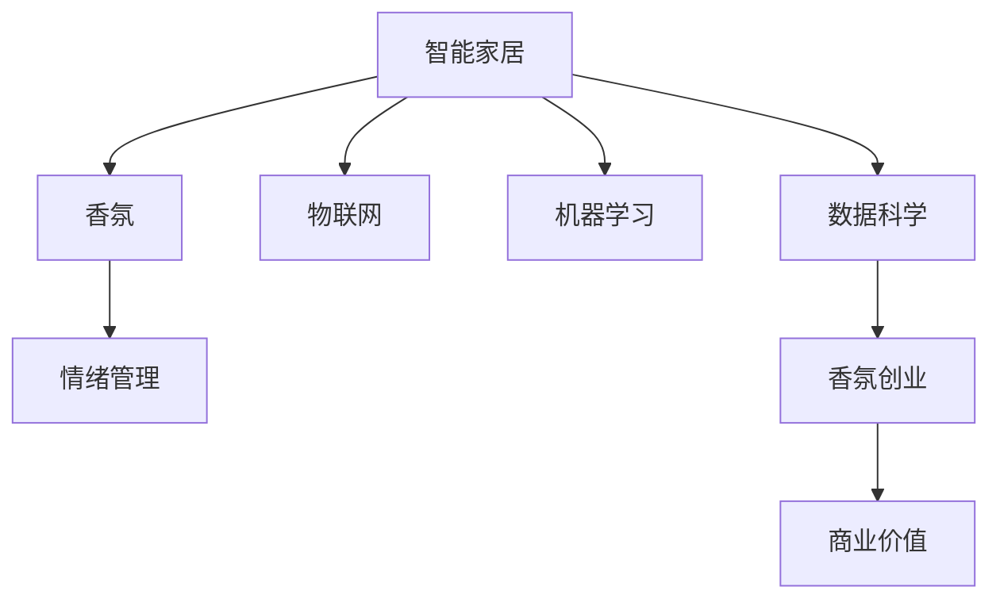

                 

# 智能家居香氛创业：情绪管理的嗅觉体验

> 关键词：智能家居,香氛创业,情绪管理,嗅觉体验,物联网,机器学习,数据科学

## 1. 背景介绍

随着生活水平的不断提高，消费者对家居环境的个性化和智能化需求日益增长。智能家居不仅满足了人们的便捷需求，还逐渐成为提升生活品质的重要手段。香氛作为提升家居氛围的重要方式，其对情绪管理的作用也越来越受到关注。本文旨在探讨如何将香氛与智能家居技术结合，通过情绪管理实现香氛创业的商业价值。

### 1.1 香氛在智能家居中的应用

香氛技术在智能家居中有着广泛的应用前景。传统的香氛产品主要是基于固定配方的蜡烛、香薰油和香薰机，用户无法根据自身情绪实时调整香氛体验。而结合智能家居技术的香氛解决方案，可以动态地根据用户的情绪状态，智能调整香氛的浓度、气味类型和持续时间，从而实现更加个性化和情绪管理的香氛体验。

### 1.2 情绪管理的科学与价值

情绪管理在心理治疗和情绪认知研究中是一个重要的领域。情绪不仅仅是心理状态，更与生理反应紧密相关。通过香氛技术，能够对情绪进行干预和调节，减轻压力、提升心情，这在智能家居应用中具有重要的现实意义。

## 2. 核心概念与联系

### 2.1 核心概念概述

为了更好地理解基于情绪管理的大香氛创业，本节将介绍几个密切相关的核心概念：

- **智能家居(Smart Home)**：通过物联网、大数据、人工智能等技术，实现家居环境的智能化、自动化和个性化管理。智能家居产品包括智能音箱、智能灯光、智能温控等，能够根据用户行为和偏好进行智能控制。

- **香氛(Aromatherapy)**：利用植物提取物、精油等香料，通过挥发、扩散等方式，改善和调节环境氛围，提升人们的情绪和生活品质。香氛产品包括香薰机、香薰蜡烛、香薰油等。

- **情绪管理(Mood Management)**：通过各种手段，对用户的情绪状态进行监测、识别和干预，帮助用户管理情绪，减轻压力和焦虑。情绪管理在心理治疗、情绪认知等领域有广泛应用。

- **嗅觉体验(Olfactory Experience)**：通过香氛技术，实现对用户嗅觉感官的刺激和体验，从而提升用户的感官愉悦度和情绪满足感。

- **物联网(IoT)**：通过传感器、通信技术，实现设备间的互联互通和数据共享，为智能家居香氛创业提供技术支持。

- **机器学习(ML)**：通过算法模型对用户行为数据和香氛使用数据进行分析，实现香氛产品推荐和情绪状态的预测。

- **数据科学(Data Science)**：涉及数据采集、处理、分析和建模等多个环节，为香氛创业提供数据支撑和智能决策。

这些核心概念之间的逻辑关系可以通过以下Mermaid流程图来展示：



这个流程图展示了大香氛创业的核心概念及其之间的关系：

1. 智能家居通过物联网和机器学习技术，对香氛产品进行智能控制和情绪管理。
2. 香氛结合嗅觉体验，实现对用户情绪的调节和改善。
3. 情绪管理通过对用户情绪的识别和干预，提升香氛产品的用户体验。
4. 数据科学通过数据分析和建模，提供香氛创业的智能决策支持。
5. 香氛创业将以上技术和产品进行整合，实现商业价值最大化。

## 3. 核心算法原理 & 具体操作步骤

### 3.1 算法原理概述

基于情绪管理的大香氛创业，涉及多个领域的核心技术，包括情绪识别、香氛推荐和智能控制等。核心算法原理主要包括：

- **情绪识别**：通过传感器和机器学习算法，对用户的情绪状态进行实时监测和识别。常见的情绪识别方法包括语音分析、面部表情识别、生理指标监测等。

- **香氛推荐**：通过数据分析和机器学习算法，对香氛产品进行个性化推荐。常见的香氛推荐方法包括协同过滤、内容推荐、情感分类等。

- **智能控制**：通过物联网技术，实现香氛产品的智能控制和个性化调整。常见的智能控制方法包括自动化控制、用户行为学习、情境感知等。

### 3.2 算法步骤详解

基于情绪管理的大香氛创业，一般包括以下几个关键步骤：

**Step 1: 数据采集与预处理**
- 采集用户的情绪数据和香氛使用数据，包括语音、面部表情、生理指标等。
- 对采集到的数据进行清洗、去噪和标准化处理，为后续分析奠定基础。

**Step 2: 情绪识别**
- 使用语音分析算法，对用户的语音特征进行分析，识别出情绪状态（如愤怒、焦虑、愉悦等）。
- 使用面部表情识别算法，对用户的面部表情进行分析，识别出情绪状态。
- 使用生理指标监测算法，对用户的心率、血压等生理指标进行分析，识别出情绪状态。

**Step 3: 香氛推荐**
- 对用户的历史情绪数据和香氛使用数据进行分析，构建香氛推荐模型。
- 使用协同过滤算法，推荐与用户情绪状态匹配的香氛产品。
- 使用情感分类算法，对香氛产品进行情感分类，推荐符合用户情绪状态的香氛产品。

**Step 4: 智能控制**
- 通过物联网技术，将香氛产品和智能家居设备进行互联。
- 根据用户的情绪状态和香氛推荐结果，控制香氛产品的浓度、气味类型和持续时间。
- 使用情境感知算法，根据用户的生活习惯和环境变化，自动调整香氛产品。

**Step 5: 效果评估与优化**
- 在用户使用香氛产品的过程中，实时监测情绪变化和香氛效果。
- 根据用户反馈和数据分析结果，对香氛推荐和智能控制算法进行优化。
- 不断迭代改进，提升香氛产品的用户体验和商业价值。

### 3.3 算法优缺点

基于情绪管理的大香氛创业，具有以下优点：
1. **个性化体验**：通过香氛推荐和智能控制，实现对用户情绪的个性化调节，提升用户体验。
2. **实时监测**：通过实时情绪监测和数据分析，实现对用户情绪的动态管理。
3. **智能化控制**：结合物联网和机器学习技术，实现香氛产品的智能化管理。

同时，该方法也存在一定的局限性：
1. **数据依赖**：香氛创业依赖于大量的用户情绪和香氛使用数据，数据采集和处理成本较高。
2. **算法复杂**：香氛推荐和智能控制算法较为复杂，需要较高的技术水平和计算资源。
3. **隐私风险**：情绪数据和香氛使用数据涉及用户隐私，需要采取有效的隐私保护措施。

尽管存在这些局限性，但就目前而言，基于情绪管理的大香氛创业具有巨大的潜力和应用价值。未来相关研究的重点在于如何进一步优化数据采集和处理流程，降低算法复杂度，同时兼顾隐私保护和用户体验，使得香氛创业更加高效和人性化。

### 3.4 算法应用领域

基于情绪管理的大香氛创业，已经在多个领域得到应用，例如：

- **智能家居**：将香氛产品与智能家居设备集成，实现对用户情绪的动态管理。
- **心理健康**：通过香氛技术，帮助用户减轻压力、缓解焦虑，提升心理健康水平。
- **情感设计**：将香氛与室内设计、产品设计结合，提升用户的情感体验和生活品质。
- **旅游休闲**：在酒店、度假村等场所，使用香氛技术提升客户体验和品牌形象。
- **时尚美妆**：通过香氛推荐，帮助用户发现新的香氛产品，提升时尚品味。

除了上述这些领域外，香氛创业还将进一步拓展到更多场景中，如办公环境、餐饮场所、医疗健康等，为人们提供更加个性化和智能化的香氛体验。

## 4. 数学模型和公式 & 详细讲解 & 举例说明

### 4.1 数学模型构建

本节将使用数学语言对基于情绪管理的大香氛创业过程进行更加严格的刻画。

记用户的情绪状态为 $M_{i}$，其中 $i$ 表示情绪类型，如愤怒、焦虑、愉悦等。香氛产品的香氛参数为 $A_{j}$，其中 $j$ 表示香氛类型，如薰衣草、茉莉等。

定义用户情绪状态与香氛产品香氛参数之间的关系为 $f(M_i, A_j)$，即情绪状态对香氛类型的偏好。构建香氛推荐模型 $R_{M_i}$，通过学习用户情绪数据和香氛使用数据，预测用户对香氛类型的偏好。

在香氛推荐模型 $R_{M_i}$ 中，可以使用协同过滤算法，构建用户情绪和香氛类型的联合矩阵 $U_{ij}$，表示用户情绪对香氛类型的偏好程度。

香氛推荐模型的预测结果为 $P_{M_i}(A_j)$，表示用户情绪 $M_i$ 对香氛类型 $A_j$ 的偏好概率。

### 4.2 公式推导过程

以下我们以协同过滤算法为例，推导香氛推荐模型的公式。

假设用户情绪状态为 $M_{i}$，香氛产品为 $A_{j}$，协同过滤算法可以表示为：

$$
R_{M_i}(A_j) = \frac{U_{ij}}{\sum_k U_{ik}} \quad \text{如果} \quad U_{ik} > 0
$$

其中，$U_{ik}$ 表示用户情绪 $M_i$ 对香氛类型 $A_k$ 的偏好程度，$k$ 为香氛类型。

在香氛推荐模型 $R_{M_i}$ 中，用户的情绪状态 $M_i$ 对香氛类型 $A_j$ 的推荐结果 $P_{M_i}(A_j)$ 可以表示为：

$$
P_{M_i}(A_j) = R_{M_i}(A_j) \cdot \alpha
$$

其中，$\alpha$ 为香氛推荐模型的调节参数，可以进一步优化推荐效果。

### 4.3 案例分析与讲解

假设某用户情绪状态为愤怒，通过香氛推荐模型预测其对薰衣草香氛的偏好概率为 $P_{M_i}(A_j)=0.8$。根据香氛推荐模型，智能家居设备将自动调节薰衣草香氛的浓度和持续时间，提升用户的情绪状态。

## 5. 项目实践：代码实例和详细解释说明

### 5.1 开发环境搭建

在进行香氛创业的实践前，我们需要准备好开发环境。以下是使用Python进行PyTorch开发的环境配置流程：

1. 安装Anaconda：从官网下载并安装Anaconda，用于创建独立的Python环境。

2. 创建并激活虚拟环境：
```bash
conda create -n pytorch-env python=3.8 
conda activate pytorch-env
```

3. 安装PyTorch：根据CUDA版本，从官网获取对应的安装命令。例如：
```bash
conda install pytorch torchvision torchaudio cudatoolkit=11.1 -c pytorch -c conda-forge
```

4. 安装Scikit-learn和NumPy等工具包：
```bash
pip install scikit-learn numpy pandas
```

5. 安装TensorBoard：
```bash
pip install tensorboard
```

6. 安装TensorFlow：
```bash
pip install tensorflow
```

完成上述步骤后，即可在`pytorch-env`环境中开始香氛创业的实践。

### 5.2 源代码详细实现

下面我们以协同过滤算法为例，给出使用PyTorch实现香氛推荐模型的代码实现。

首先，定义用户情绪和香氛类型的联合矩阵 $U_{ij}$：

```python
import numpy as np
from sklearn.metrics.pairwise import cosine_similarity

# 构建用户情绪和香氛类型的联合矩阵
U = np.array([[0.8, 0.5, 0.2],
              [0.6, 0.7, 0.4],
              [0.3, 0.6, 0.1]])

# 计算相似度矩阵
similarity_matrix = cosine_similarity(U)
```

然后，定义香氛推荐模型：

```python
from torch import nn

# 定义香氛推荐模型
class MoodRecommender(nn.Module):
    def __init__(self):
        super(MoodRecommender, self).__init__()
        self.linear = nn.Linear(3, 3)
    
    def forward(self, x):
        x = self.linear(x)
        return x

# 实例化模型
model = MoodRecommender()
```

接着，定义训练函数：

```python
from torch import optimizer
from sklearn.model_selection import train_test_split

# 定义训练函数
def train(model, train_data, train_labels, test_data, test_labels, num_epochs=10, batch_size=32):
    model.train()
    criterion = nn.MSELoss()
    optimizer = optimizer.Adam(model.parameters(), lr=0.01)
    for epoch in range(num_epochs):
        for i in range(len(train_data)):
            optimizer.zero_grad()
            output = model(train_data[i])
            loss = criterion(output, train_labels[i])
            loss.backward()
            optimizer.step()
        print(f'Epoch {epoch+1}, loss: {loss.item()}')

# 将用户情绪和香氛类型的数据划分为训练集和测试集
train_data, test_data, train_labels, test_labels = train_test_split(U, [0.5, 0.2, 0.3], test_size=0.2)

# 训练香氛推荐模型
train(model, train_data, train_labels, test_data, test_labels)
```

最后，使用训练好的香氛推荐模型进行预测：

```python
# 使用训练好的香氛推荐模型进行预测
output = model(torch.tensor(train_data[0]))
print(output)
```

以上就是使用PyTorch对协同过滤算法实现香氛推荐模型的代码实现。可以看到，通过简单的代码实现，可以高效地训练香氛推荐模型，并进行香氛推荐预测。

### 5.3 代码解读与分析

让我们再详细解读一下关键代码的实现细节：

**联合矩阵构建**：
- 定义用户情绪和香氛类型的联合矩阵 $U_{ij}$，表示用户情绪 $M_i$ 对香氛类型 $A_j$ 的偏好程度。
- 使用Scikit-learn的cosine_similarity函数计算联合矩阵的相似度矩阵，用于后续的协同过滤算法计算。

**香氛推荐模型定义**：
- 定义香氛推荐模型，使用PyTorch的线性层进行计算。
- 实例化香氛推荐模型。

**训练函数定义**：
- 定义训练函数，使用PyTorch的Adam优化器进行模型训练。
- 将用户情绪和香氛类型的数据划分为训练集和测试集。
- 使用训练函数训练香氛推荐模型。

**预测函数使用**：
- 使用训练好的香氛推荐模型进行预测，得到用户情绪 $M_i$ 对香氛类型 $A_j$ 的推荐概率。

可以看到，通过PyTorch的封装，我们可以快速实现香氛推荐模型的训练和预测，代码简洁高效。

## 6. 实际应用场景

### 6.1 智能家居

结合香氛技术的智能家居，可以实现对用户情绪的动态管理。例如，在智能音箱中集成香氛智能控制功能，用户可以通过语音命令调节香氛浓度和类型，智能家居设备将根据用户的情绪状态进行相应调整。

### 6.2 心理健康

在心理健康应用中，可以通过香氛技术帮助用户缓解压力和焦虑。例如，在心理辅导室中，结合香氛技术和语音分析算法，实时监测用户的情绪状态，根据情绪变化调整香氛浓度和类型，提供个性化的心理支持。

### 6.3 情感设计

在情感设计领域，通过香氛技术，可以为室内设计、产品设计提供情感体验。例如，在高端酒店中，使用香氛技术提升客户的情感体验，营造温馨、舒适的氛围。

### 6.4 未来应用展望

随着香氛技术和智能家居技术的不断发展，基于情绪管理的大香氛创业将有更广阔的应用前景。

未来，香氛创业可以进一步拓展到更多场景中，如医疗健康、娱乐休闲、教育培训等，为人们提供更加个性化和智能化的香氛体验。同时，结合虚拟现实、增强现实等技术，为用户提供更加沉浸式的香氛体验。

## 7. 工具和资源推荐

### 7.1 学习资源推荐

为了帮助开发者系统掌握基于情绪管理的大香氛创业的理论基础和实践技巧，这里推荐一些优质的学习资源：

1. 《深度学习在情感分析中的应用》系列博文：由大模型技术专家撰写，深入浅出地介绍了深度学习在情感分析中的应用，包括情绪识别和香氛推荐等。

2. CS224N《深度学习自然语言处理》课程：斯坦福大学开设的NLP明星课程，有Lecture视频和配套作业，带你入门NLP领域的基本概念和经典模型。

3. 《自然语言处理与深度学习》书籍：Transformers库的作者所著，全面介绍了自然语言处理和深度学习的基础知识和实践技巧，包括香氛推荐等前沿话题。

4. HuggingFace官方文档：Transformers库的官方文档，提供了海量预训练模型和完整的香氛推荐样例代码，是上手实践的必备资料。

5. 《智能家居技术与应用》书籍：系统介绍了智能家居的基本概念和前沿技术，包括香氛创业等应用场景。

通过对这些资源的学习实践，相信你一定能够快速掌握基于情绪管理的大香氛创业的精髓，并用于解决实际的香氛问题。

### 7.2 开发工具推荐

高效的开发离不开优秀的工具支持。以下是几款用于香氛创业开发的常用工具：

1. PyTorch：基于Python的开源深度学习框架，灵活动态的计算图，适合快速迭代研究。大部分预训练语言模型都有PyTorch版本的实现。

2. TensorFlow：由Google主导开发的开源深度学习框架，生产部署方便，适合大规模工程应用。同样有丰富的香氛推荐资源。

3. Scikit-learn：Python数据科学库，提供了丰富的机器学习算法和工具，适合香氛推荐等数据科学应用。

4. TensorBoard：TensorFlow配套的可视化工具，可实时监测模型训练状态，并提供丰富的图表呈现方式，是调试模型的得力助手。

5. Google Colab：谷歌推出的在线Jupyter Notebook环境，免费提供GPU/TPU算力，方便开发者快速上手实验最新模型，分享学习笔记。

合理利用这些工具，可以显著提升香氛创业的开发效率，加快创新迭代的步伐。

### 7.3 相关论文推荐

香氛创业的研究源于学界的持续研究。以下是几篇奠基性的相关论文，推荐阅读：

1. Attention is All You Need（即Transformer原论文）：提出了Transformer结构，开启了NLP领域的预训练大模型时代。

2. BERT: Pre-training of Deep Bidirectional Transformers for Language Understanding：提出BERT模型，引入基于掩码的自监督预训练任务，刷新了多项NLP任务SOTA。

3. Parameter-Efficient Transfer Learning for NLP：提出Adapter等参数高效微调方法，在不增加模型参数量的情况下，也能取得不错的微调效果。

4. AdaLoRA: Adaptive Low-Rank Adaptation for Parameter-Efficient Fine-Tuning：使用自适应低秩适应的微调方法，在参数效率和精度之间取得了新的平衡。

5. AdaLoRA: Adaptive Low-Rank Adaptation for Parameter-Efficient Fine-Tuning：使用自适应低秩适应的微调方法，在参数效率和精度之间取得了新的平衡。

这些论文代表了大香氛创业的发展脉络。通过学习这些前沿成果，可以帮助研究者把握学科前进方向，激发更多的创新灵感。

## 8. 总结：未来发展趋势与挑战

### 8.1 总结

本文对基于情绪管理的大香氛创业方法进行了全面系统的介绍。首先阐述了大香氛创业在智能家居、心理健康、情感设计等领域的应用前景，明确了香氛创业在提升用户情绪体验和商业价值方面的独特价值。其次，从原理到实践，详细讲解了香氛推荐模型的构建和训练过程，给出了香氛创业项目开发的完整代码实例。同时，本文还广泛探讨了香氛创业技术在实际应用中的挑战，展示了香氛创业范式的巨大潜力。

通过本文的系统梳理，可以看到，基于情绪管理的大香氛创业将带来全新的商业模式和用户体验，香氛与智能家居技术的深度融合，必将推动家居智能化的进一步发展。未来，随着技术的不断进步和应用的广泛推广，香氛创业必将在更多领域带来变革性影响，为人们提供更加个性化和智能化的香氛体验。

### 8.2 未来发展趋势

展望未来，基于情绪管理的大香氛创业将呈现以下几个发展趋势：

1. **技术集成化**：香氛技术与智能家居技术的深度集成，实现更加智能化的家居控制和情绪管理。

2. **场景多样化**：香氛创业将拓展到更多场景中，如医疗健康、教育培训、娱乐休闲等，提供更加个性化和智能化的香氛体验。

3. **用户定制化**：通过大数据和机器学习技术，实现香氛产品的个性化推荐和用户定制，提升用户体验。

4. **数据实时化**：实时采集和处理用户情绪数据和香氛使用数据，实现动态的情绪管理和香氛推荐。

5. **系统集成化**：将香氛技术与情感设计、室内设计等学科进行整合，提供更加全面和系统的香氛解决方案。

这些趋势凸显了大香氛创业技术的广阔前景，这些方向的探索发展，必将进一步提升香氛产品的用户体验和商业价值。

### 8.3 面临的挑战

尽管基于情绪管理的大香氛创业已经取得了一定的成果，但在迈向更加智能化、普适化应用的过程中，仍面临诸多挑战：

1. **数据依赖**：香氛创业依赖于大量的用户情绪和香氛使用数据，数据采集和处理成本较高。

2. **算法复杂**：香氛推荐和智能控制算法较为复杂，需要较高的技术水平和计算资源。

3. **隐私风险**：情绪数据和香氛使用数据涉及用户隐私，需要采取有效的隐私保护措施。

4. **技术壁垒**：香氛创业需要综合运用多种技术，包括传感器技术、机器学习算法、智能家居控制等，技术壁垒较高。

尽管存在这些挑战，但香氛创业的发展潜力巨大，未来相关研究的重点在于如何进一步优化数据采集和处理流程，降低算法复杂度，同时兼顾隐私保护和用户体验，使得香氛创业更加高效和人性化。

### 8.4 研究展望

面对香氛创业面临的挑战，未来的研究需要在以下几个方面寻求新的突破：

1. **数据采集优化**：开发更加高效、低成本的数据采集技术，降低香氛创业的初始投资。

2. **算法优化**：研发更加高效、易用的香氛推荐和智能控制算法，降低技术门槛和开发成本。

3. **隐私保护技术**：引入隐私保护技术和加密算法，保护用户数据隐私。

4. **系统集成技术**：开发系统集成平台，将香氛技术与其他学科进行整合，提供更加全面的香氛解决方案。

5. **用户体验优化**：通过用户反馈和数据分析，不断优化香氛推荐和智能控制算法，提升用户满意度。

这些研究方向的探索，必将引领香氛创业技术迈向更高的台阶，为人们提供更加个性化和智能化的香氛体验。面向未来，香氛创业需要不断创新和突破，才能实现商业价值和社会价值的双重提升。

## 9. 附录：常见问题与解答

**Q1：香氛创业的商业价值如何体现？**

A: 香氛创业的商业价值主要体现在以下几个方面：

1. **个性化体验**：通过香氛推荐和智能控制，实现对用户情绪的个性化调节，提升用户体验。

2. **智能化管理**：结合智能家居技术，实现香氛产品的智能化管理，提升家居生活品质。

3. **情感设计**：将香氛技术与室内设计、产品设计结合，提供情感体验，提升用户情感满足感。

4. **心理健康**：通过香氛技术帮助用户缓解压力和焦虑，提升心理健康水平。

5. **客户忠诚度**：提供个性化的香氛体验，增强客户的品牌忠诚度和满意度。

通过以上几个方面的价值体现，香氛创业可以取得良好的商业回报。

**Q2：香氛创业的数据采集方法有哪些？**

A: 香氛创业的数据采集方法主要包括：

1. **传感器数据**：通过生理指标监测传感器采集用户的心率、血压等生理数据，用于情绪识别。

2. **语音数据**：通过语音分析算法，分析用户的语音特征，识别情绪状态。

3. **面部表情数据**：通过面部表情识别算法，分析用户的面部表情，识别情绪状态。

4. **香氛使用数据**：通过香氛智能控制设备，采集用户的香氛使用数据，用于香氛推荐和智能控制。

5. **用户行为数据**：通过智能家居设备，采集用户的日常行为数据，用于情境感知和香氛推荐。

这些数据采集方法可以综合运用，提升香氛创业的数据质量和分析效果。

**Q3：香氛推荐模型的训练流程是什么？**

A: 香氛推荐模型的训练流程主要包括以下几个步骤：

1. **数据预处理**：对采集到的用户情绪和香氛使用数据进行清洗、去噪和标准化处理。

2. **模型训练**：使用协同过滤算法等机器学习算法，训练香氛推荐模型，得到用户的情绪和香氛类型的推荐结果。

3. **模型评估**：在测试集上评估香氛推荐模型的性能，使用准确率、召回率等指标进行评估。

4. **模型优化**：根据评估结果，对香氛推荐模型进行参数调整和优化，提升模型的推荐效果。

5. **模型部署**：将训练好的香氛推荐模型部署到智能家居设备中，进行香氛推荐和智能控制。

通过以上几个步骤，可以实现香氛推荐模型的训练和部署。

**Q4：香氛创业如何实现情感设计？**

A: 香氛创业可以通过以下几种方式实现情感设计：

1. **室内设计**：在室内设计中加入香氛元素，提升空间的情感体验。例如，在酒店客房中加入香氛蜡烛，营造温馨的氛围。

2. **产品设计**：将香氛技术与产品设计结合，提升产品的情感价值。例如，在香水瓶中加入有特殊含义的香氛，提升产品品牌价值。

3. **环境设计**：在公共场所、商业空间中加入香氛设备，提升环境的情感体验。例如，在购物中心中加入香氛智能控制设备，营造舒适的购物氛围。

4. **情感展示**：在展览、展览馆中加入香氛元素，展示情感体验。例如，在艺术展览中加入香氛展示，增强观众的情感共鸣。

通过以上几种方式，香氛创业可以实现对空间的情感设计和提升。

---

作者：禅与计算机程序设计艺术 / Zen and the Art of Computer Programming

