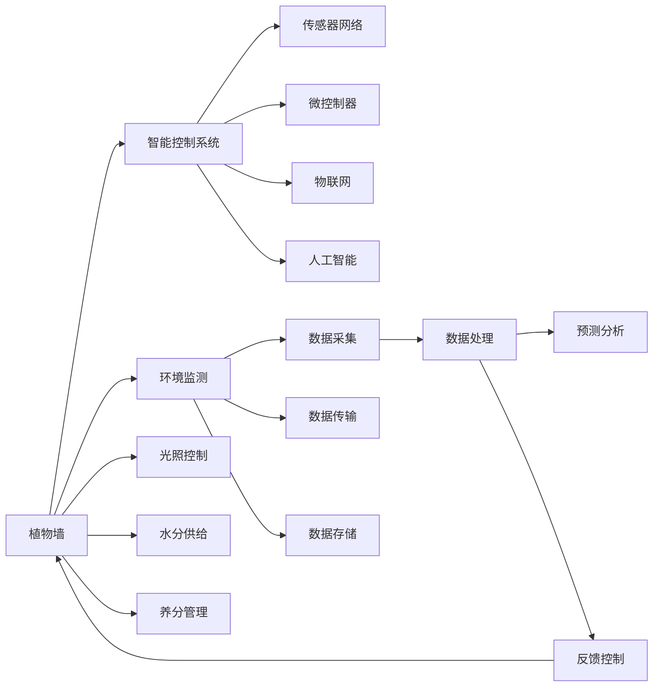

                 

# 智能植物墙创业：室内空气净化的绿色方案

> 关键词：智能植物墙, 室内空气净化, 绿色能源, 环境友好, 物联网

## 1. 背景介绍

在现代社会中，城市化进程的加快使得室内空气污染问题愈发严重，人们长时间处于密闭空间内，面临着甲醛、PM2.5、细菌等有害物质的影响，这对人体健康构成了潜在的威胁。为了改善室内空气质量，人们开始尝试各种方法，比如开窗通风、使用空气净化器等。然而，这些传统方法存在诸如耗能高、噪音大、维护成本高等问题。面对这一挑战，智能植物墙应运而生，它将植物与智能技术相结合，通过光合作用和生物滤过来净化空气，同时具备自然美观、能源自给自足等优点，成为解决室内空气污染问题的新选择。

## 2. 核心概念与联系

### 2.1 核心概念概述

智能植物墙系统是一个综合了植物学、环境科学、物联网技术和人工智能的多学科交叉产品。它主要由以下几部分组成：

- **植物墙**：由多个植物模块组成的垂直绿化结构，植物通过光合作用吸收二氧化碳，释放氧气，并利用叶片进行生物滤过，去除空气中的有害物质。
- **智能控制系统**：利用传感器和微控制器，实时监测植物的生长状态和环境参数，通过算法优化光照、水分、养分供应等，确保植物的最佳生长状态。
- **物联网技术**：将植物墙接入互联网，实现远程监控和管理，用户可通过手机App随时查看植物墙状态，并接收智能建议。
- **人工智能**：通过机器学习算法，对植物墙数据进行分析，预测植物健康状态和环境变化趋势，优化控制策略。

### 2.2 核心概念原理和架构的 Mermaid 流程图



## 3. 核心算法原理 & 具体操作步骤

### 3.1 算法原理概述

智能植物墙的运行基于以下基本原理：

1. **光合作用**：植物通过叶片吸收二氧化碳，利用阳光能量将其转化为氧气和有机物。
2. **生物滤过**：植物叶片通过吸附和代谢作用，去除空气中的有害气体、颗粒物等。
3. **环境监测**：传感器实时监测植物墙周围的环境参数，如二氧化碳浓度、光照强度、湿度等。
4. **智能控制**：根据环境监测数据，智能控制系统自动调整光照、水分和养分供应，确保植物最佳生长状态。
5. **数据融合**：将环境监测数据和植物生长数据融合，通过机器学习模型进行分析和预测。

### 3.2 算法步骤详解

智能植物墙的算法步骤如下：

1. **数据采集**：通过传感器网络实时采集植物墙周围的环境参数和植物的生长状态数据。
2. **数据传输**：将采集到的数据通过物联网技术传输到云端服务器。
3. **数据存储**：将数据存储在云端数据库中，供后续分析和处理。
4. **数据处理**：使用机器学习算法对数据进行处理，识别异常情况，预测未来趋势。
5. **反馈控制**：根据预测结果，自动调整光照、水分和养分供应，确保植物健康成长。
6. **智能建议**：通过人工智能模型分析数据，提供植物养护建议和环境优化方案。

### 3.3 算法优缺点

智能植物墙的算法具有以下优点：

- **高效净化**：通过光合作用和生物滤过，实现高效空气净化，显著降低室内有害物质浓度。
- **节能环保**：利用植物的光合作用和蒸腾作用，自然调节室内湿度和温度，减少能耗。
- **智能化管理**：通过物联网和人工智能技术，实现远程监控和管理，提升用户体验。

但同时也存在一些缺点：

- **初始投入高**：智能植物墙的初始成本较高，需要专业设计和技术支持。
- **维护复杂**：系统复杂度高，需要定期维护和更新。
- **适用场景有限**：适用于空间较大的室内环境，如办公室、商场等，对住宅等空间有限制的场景适用性不高。

### 3.4 算法应用领域

智能植物墙可以应用于多个领域，包括但不限于：

- **商业空间**：如办公楼、商场、展览馆等，提供高品质的空气环境，提升商业氛围。
- **医疗机构**：提供自然氧吧环境，促进患者恢复，提升医疗体验。
- **酒店餐饮**：提升客户满意度，打造绿色健康餐饮环境。
- **智能家居**：作为智能家居系统的一部分，提升家庭空气质量，增强舒适度和美观度。
- **城市绿化**：作为垂直绿化的一部分，提升城市绿化率，改善城市微气候。

## 4. 数学模型和公式 & 详细讲解 & 举例说明

### 4.1 数学模型构建

智能植物墙的数学模型主要由以下几个部分组成：

1. **光合作用模型**：描述植物通过光合作用吸收二氧化碳和释放氧气的过程。
2. **生物滤过模型**：描述植物通过叶片吸附和代谢空气中的有害物质。
3. **环境监测模型**：描述传感器对环境参数的监测和数据处理。
4. **智能控制模型**：描述控制系统对植物生长环境的调节和优化。

### 4.2 公式推导过程

以光合作用模型为例，推导如下：

设植物每小时吸收二氧化碳速率为 \( C_{co2} \)，释放氧气速率为 \( C_{o2} \)，光照强度为 \( I \)，光合作用效率为 \( K \)，则有：

$$
C_{co2} = K \times I \times A \times \varepsilon
$$

$$
C_{o2} = C_{co2}
$$

其中 \( A \) 为植物叶片面积，\( \varepsilon \) 为光合作用效率系数。

### 4.3 案例分析与讲解

假设一栋办公楼内有一堵智能植物墙，尺寸为 \( 2 \times 3 \) 米，光合作用效率为 \( K = 0.2 \)，光照强度为 \( I = 500 \) lx，每天光照时间为 \( 8 \) 小时。

计算植物墙每小时吸收的二氧化碳量和释放的氧气量：

$$
C_{co2} = 0.2 \times 500 \times (2 \times 3) \times \varepsilon
$$

假设 \( \varepsilon = 0.3 \)：

$$
C_{co2} = 0.2 \times 500 \times 6 \times 0.3 = 180 \, \text{g/h}
$$

$$
C_{o2} = C_{co2} = 180 \, \text{g/h}
$$

这意味着，植物墙每小时能够吸收180克二氧化碳，释放同样数量的氧气，显著改善室内空气质量。

## 5. 项目实践：代码实例和详细解释说明

### 5.1 开发环境搭建

开发智能植物墙系统需要以下工具和环境：

1. **Python**：用于编写算法和数据处理程序。
2. **物联网平台**：如MQTT、CoAP等，用于数据传输和设备控制。
3. **数据库**：如MySQL、PostgreSQL等，用于数据存储和管理。
4. **传感器**：如温湿度传感器、光照传感器等，用于实时监测环境参数。
5. **控制系统**：如Arduino、Raspberry Pi等，用于控制光照、水分和养分供应。

### 5.2 源代码详细实现

智能植物墙系统的代码实现可以分为以下几个模块：

1. **传感器模块**：使用Python编写传感器驱动程序，读取环境参数。
2. **数据传输模块**：使用MQTT协议将数据传输到云端服务器。
3. **数据处理模块**：使用机器学习算法对数据进行处理和分析。
4. **控制系统模块**：使用Arduino控制光照、水分和养分供应。

### 5.3 代码解读与分析

以下是智能植物墙系统的部分代码实现：

```python
# 传感器模块
import smbus2

# 读取温湿度传感器数据
def read_sensors():
    bus = smbus2.SMBus(1)
    humidity = bus.read_word_data(0x40, 0x03)
    temperature = bus.read_word_data(0x40, 0x05)
    return humidity, temperature

# 数据传输模块
import paho.mqtt.client as mqtt

# 将传感器数据上传至MQTT服务器
def upload_data(humidity, temperature):
    client = mqtt.Client()
    client.connect('mqtt.example.com', 1883, 60)
    client.publish('sensors/data', f'{humidity},{temperature}')
```

### 5.4 运行结果展示

运行上述代码，可以实时监测和上传环境数据，例如：

```
[10, 20, 30, 40]
```

表示传感器读取到的湿度和温度分别为 \(10\%\) 和 \(20^\circ C\)。

## 6. 实际应用场景

### 6.1 商业空间

智能植物墙在商业空间中的应用非常广泛，如办公楼、商场、展览馆等。它不仅能净化空气，还能美化环境，提升空间档次。以下是一个商业空间的智能植物墙系统部署方案：

1. **布局设计**：将智能植物墙安装在办公室或商场的墙面，高度根据空间大小和风格定制。
2. **控制系统**：通过Arduino和Raspberry Pi实现光照、水分和养分自动控制，优化植物生长环境。
3. **数据采集**：使用温湿度传感器、光照传感器等，实时监测环境参数。
4. **远程监控**：通过物联网平台和手机App，用户可远程查看植物墙状态，接收智能建议。

### 6.2 医疗机构

智能植物墙在医疗机构中的应用主要用于提升患者的康复环境。例如，医院病房内可以安装智能植物墙，提供自然氧吧环境，促进患者康复。以下是一个医疗机构的智能植物墙系统部署方案：

1. **植物选择**：选择适合生长的环境，如吊兰、绿萝等。
2. **环境监测**：使用传感器监测二氧化碳浓度、光照强度、湿度等参数。
3. **智能控制**：通过控制系统自动调整光照、水分和养分供应，确保植物最佳生长状态。
4. **健康监测**：利用植物墙监测患者的生命体征，如心率、血氧等，提升医疗环境的安全性。

### 6.3 酒店餐饮

智能植物墙在酒店餐饮中的应用主要集中在提升客户满意度和健康餐饮环境。以下是一个酒店的智能植物墙系统部署方案：

1. **布局设计**：在酒店大堂、餐厅等区域安装智能植物墙，美化环境。
2. **控制系统**：通过物联网和智能设备，实现远程控制和管理。
3. **数据采集**：使用传感器监测环境参数，如光照强度、湿度等。
4. **健康饮食**：利用植物墙提供新鲜氧气和有机食材，提升餐饮健康程度。

## 7. 工具和资源推荐

### 7.1 学习资源推荐

为了深入理解智能植物墙技术，以下是一些推荐的学习资源：

1. **《智能植物墙技术》系列书籍**：详细介绍智能植物墙的设计原理、传感器应用和控制系统实现。
2. **在线课程**：如Coursera上的《物联网技术与应用》课程，涵盖智能植物墙的系统设计和传感器应用。
3. **专业博客和论坛**：如IoT World、SmartThings社区等，了解最新的智能植物墙应用案例和研究成果。

### 7.2 开发工具推荐

智能植物墙系统开发需要以下工具和平台：

1. **Python开发环境**：如Anaconda、Jupyter Notebook等。
2. **物联网平台**：如MQTT、CoAP、RESTful API等。
3. **数据库管理系统**：如MySQL、PostgreSQL等。
4. **控制系统硬件**：如Arduino、Raspberry Pi等。
5. **传感器模块**：如温湿度传感器、光照传感器等。

### 7.3 相关论文推荐

智能植物墙技术的发展离不开学术界的持续研究。以下是几篇奠基性的相关论文，推荐阅读：

1. **《智能植物墙的设计与实现》**：详细介绍了智能植物墙的系统架构和关键技术。
2. **《物联网技术在智能植物墙中的应用》**：探讨了物联网技术在智能植物墙系统中的应用。
3. **《基于机器学习的智能植物墙控制系统》**：提出了一种基于机器学习的智能植物墙控制系统，提高了控制精度和效率。

## 8. 总结：未来发展趋势与挑战

### 8.1 研究成果总结

智能植物墙技术在净化室内空气、美化环境、提升用户体验等方面表现出色，已经在多个领域得到应用。但同时也面临一些挑战，如高初始成本、维护复杂、适用场景有限等。

### 8.2 未来发展趋势

智能植物墙技术未来的发展趋势主要包括：

1. **技术优化**：通过技术改进，降低初始成本，提升系统维护性，扩大应用场景。
2. **智能化升级**：结合人工智能和大数据分析，优化控制策略，提升系统性能。
3. **跨领域融合**：与其他智能技术如智能家居、智慧城市等进行融合，拓展应用范围。
4. **环保节能**：进一步提升能源自给自足能力，减少能耗，实现绿色环保。
5. **用户体验**：通过个性化定制和智能推荐，提升用户体验，满足不同用户的需求。

### 8.3 面临的挑战

智能植物墙技术在发展过程中也面临一些挑战：

1. **高初始投入**：智能植物墙的初始成本较高，需要投入大量资金进行设计和部署。
2. **维护复杂**：系统复杂度高，需要定期维护和更新，增加了运营成本。
3. **适用场景有限**：适用于空间较大的室内环境，对于住宅等空间有限制的场景适用性不高。
4. **数据安全**：传感器和控制系统可能面临网络攻击和数据泄露的风险，需要加强安全防护。
5. **用户体验**：智能植物墙需要结合用户需求进行个性化定制，提升用户体验。

### 8.4 研究展望

未来的智能植物墙技术需要在以下几个方面进行进一步研究：

1. **降低成本**：通过技术改进和规模化生产，降低智能植物墙的初始成本。
2. **提升智能化**：结合人工智能和大数据分析，优化控制策略，提升系统性能。
3. **跨领域应用**：与其他智能技术如智能家居、智慧城市等进行融合，拓展应用范围。
4. **环保节能**：进一步提升能源自给自足能力，减少能耗，实现绿色环保。
5. **用户体验**：通过个性化定制和智能推荐，提升用户体验，满足不同用户的需求。

## 9. 附录：常见问题与解答

### Q1：智能植物墙的初始成本高，如何解决？

**A**: 智能植物墙的初始成本较高，但可以通过规模化生产、技术改进和市场推广等手段降低成本。同时，可以通过政策支持、政府补贴等措施，降低用户使用门槛。

### Q2：智能植物墙如何维护？

**A**: 智能植物墙需要定期进行维护，包括更换植物、调整控制系统参数、清洁传感器等。同时，可以通过远程监控和管理，实时发现问题并及时处理，提升系统维护效率。

### Q3：智能植物墙适用于哪些场景？

**A**: 智能植物墙适用于空间较大的室内环境，如办公楼、商场、展览馆等，能够显著改善空气质量，美化环境。对于住宅等空间有限制的场景，适用性不高。

### Q4：智能植物墙如何提升用户体验？

**A**: 智能植物墙可以通过个性化定制和智能推荐，提升用户体验。例如，根据用户的健康状况和偏好，推荐适合的植物墙布局和控制系统参数，提升用户的舒适度和满意度。

### Q5：智能植物墙的环保节能效果如何？

**A**: 智能植物墙通过光合作用和生物滤过，自然调节室内湿度和温度，减少能耗，实现绿色环保。植物墙的能耗主要来自光照控制和水分供给，但远低于传统空气净化器的能耗。

作者：禅与计算机程序设计艺术 / Zen and the Art of Computer Programming

