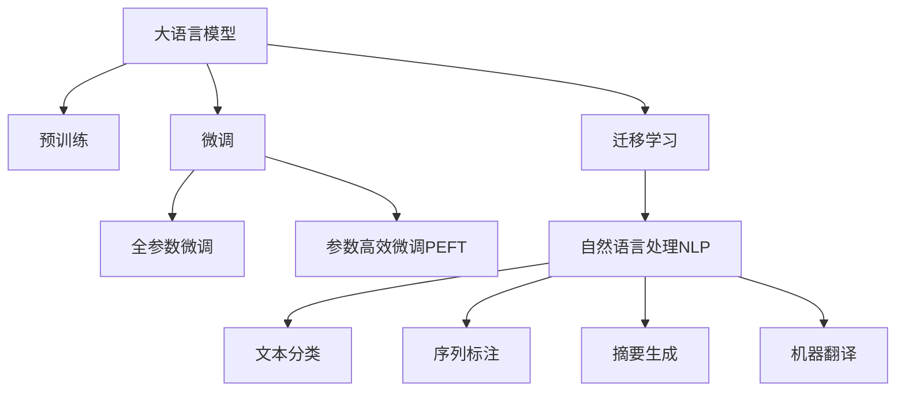

                 

# 智能简历筛选：LLM在人力资源管理中的作用

## 1. 背景介绍

### 1.1 问题由来

在当今竞争激烈的就业市场中，人力资源管理者面临着筛选海量简历的巨大挑战。传统的人力资源筛选方法依赖于人工审核简历、手动检索相关经验等，不仅耗时耗力，还难以保证筛选结果的一致性和公正性。因此，利用先进的AI技术，尤其是大语言模型(LLM)，进行智能简历筛选，已成为提高人力资源管理效率和质量的关键方向。

### 1.2 问题核心关键点

大语言模型(LLM)，特别是基于预训练的通用大模型，如GPT、BERT等，已经展现了强大的自然语言理解和生成能力。通过在人力资源管理领域的应用，LLM能够自动化地处理简历信息，识别关键技能、匹配职位要求、甚至对简历进行内容生成和优化。

具体来说，基于LLM的智能简历筛选方法的核心关键点包括：
- **数据预处理**：将简历文本进行分词、标注等预处理，以适配模型输入。
- **模型选择**：选择合适的预训练模型，并根据任务特性进行微调或使用其隐层表示。
- **输入设计**：设计合适的输入格式，如文本分类、序列标注、摘要生成等。
- **输出生成**：模型生成输出，如简历评分、匹配度、推荐等。
- **后处理**：对模型输出进行后处理，如评分阈值设置、复审规则设计等。

### 1.3 问题研究意义

智能简历筛选技术可以大幅提高人力资源管理的效率和效果，具体体现在：
- **减少人力资源工作量**：自动筛选简历，减轻人力资源人员的负担。
- **提高筛选准确性**：利用LLM强大的语言理解能力，减少人为偏差和遗漏。
- **优化招聘流程**：为求职者提供个性化推荐，提升用户体验。
- **提升招聘质量**：准确匹配职位要求和求职者能力，提高面试成功率。
- **增强决策支持**：辅助人力资源管理者做出更加科学的招聘决策。

## 2. 核心概念与联系

### 2.1 核心概念概述

为更好地理解基于LLM的智能简历筛选方法，本节将介绍几个密切相关的核心概念：

- **大语言模型(LLM)**：以自回归或自编码模型为代表的大规模预训练语言模型。通过在大规模无标签文本数据上进行预训练，学习通用的语言表示，具备强大的语言理解和生成能力。
- **预训练(Pre-training)**：指在大规模无标签文本数据上，通过自监督学习任务训练通用语言模型的过程。常见的预训练任务包括掩码语言模型、下一句预测等。
- **微调(Fine-tuning)**：指在预训练模型的基础上，使用特定任务的数据集，通过有监督学习优化模型在该任务上的性能。通常仅调整顶层，以避免过拟合。
- **迁移学习(Transfer Learning)**：指将一个领域学习到的知识，迁移到另一个不同但相关的领域的学习范式。大模型的预训练-微调过程即是一种典型的迁移学习方式。
- **自然语言处理(NLP)**：研究如何让计算机理解和处理人类语言的技术，包括文本分类、序列标注、机器翻译等。

这些核心概念之间的逻辑关系可以通过以下Mermaid流程图来展示：



这个流程图展示了大语言模型的核心概念及其之间的关系：

1. 大语言模型通过预训练获得基础能力。
2. 微调是对预训练模型进行任务特定的优化，可以分为全参数微调和参数高效微调（PEFT）。
3. 迁移学习是连接预训练模型与下游任务的桥梁，可以通过微调或使用预训练表示来实现。
4. 自然语言处理是应用大语言模型于具体任务的前提，涉及到文本处理和理解的多个方面。

## 3. 核心算法原理 & 具体操作步骤

### 3.1 算法原理概述

基于LLM的智能简历筛选方法，本质上是一个有监督的文本分类和序列标注任务。其核心思想是：将预训练的大语言模型视作一个强大的"特征提取器"，通过在简历文本数据上进行有监督的微调，使得模型能够自动识别简历中的关键信息，如教育背景、工作经历、技能等，并根据职位要求对其进行筛选和推荐。

形式化地，假设预训练模型为 $M_{\theta}$，其中 $\theta$ 为预训练得到的模型参数。给定简历数据集 $D=\{(x_i,y_i)\}_{i=1}^N$，其中 $x_i$ 为简历文本，$y_i$ 为简历是否符合职位要求或与职位匹配的标签。微调的目标是找到新的模型参数 $\hat{\theta}$，使得：

$$
\hat{\theta}=\mathop{\arg\min}_{\theta} \mathcal{L}(M_{\theta},D)
$$

其中 $\mathcal{L}$ 为针对简历筛选任务设计的损失函数，用于衡量模型预测输出与真实标签之间的差异。常见的损失函数包括交叉熵损失、均方误差损失等。

通过梯度下降等优化算法，微调过程不断更新模型参数 $\theta$，最小化损失函数 $\mathcal{L}$，使得模型输出逼近真实标签。由于 $\theta$ 已经通过预训练获得了较好的初始化，因此即便在简历文本数据量较小的情况下，也能较快收敛到理想的模型参数 $\hat{\theta}$。

### 3.2 算法步骤详解

基于LLM的智能简历筛选一般包括以下几个关键步骤：

**Step 1: 准备简历数据集**
- 收集和标注简历数据集 $D=\{(x_i,y_i)\}_{i=1}^N$，其中 $x_i$ 为简历文本，$y_i$ 为简历是否符合职位要求或与职位匹配的标签。
- 将数据集划分为训练集、验证集和测试集。

**Step 2: 添加简历适配层**
- 根据职位要求，设计合适的输出层和损失函数。
- 对于简历筛选任务，通常在顶层添加softmax分类器或CRF层，并使用交叉熵损失或条件随机场损失。

**Step 3: 设置微调超参数**
- 选择合适的优化算法及其参数，如Adam、SGD等，设置学习率、批大小、迭代轮数等。
- 设置正则化技术及强度，包括权重衰减、Dropout、Early Stopping等。
- 确定冻结预训练参数的策略，如仅微调顶层，或全部参数都参与微调。

**Step 4: 执行梯度训练**
- 将简历数据集 $D$ 分批次输入模型，前向传播计算损失函数。
- 反向传播计算参数梯度，根据设定的优化算法和学习率更新模型参数。
- 周期性在验证集上评估模型性能，根据性能指标决定是否触发 Early Stopping。
- 重复上述步骤直到满足预设的迭代轮数或 Early Stopping 条件。

**Step 5: 测试和部署**
- 在测试集上评估微调后模型 $M_{\hat{\theta}}$ 的性能，对比微调前后的精度提升。
- 使用微调后的模型对新简历进行推理预测，集成到实际的应用系统中。
- 持续收集新的简历数据，定期重新微调模型，以适应数据分布的变化。

以上是基于LLM的智能简历筛选的一般流程。在实际应用中，还需要针对具体简历文本的特点，对微调过程的各个环节进行优化设计，如改进训练目标函数，引入更多的正则化技术，搜索最优的超参数组合等，以进一步提升模型性能。

### 3.3 算法优缺点

基于LLM的智能简历筛选方法具有以下优点：
1. 快速高效。使用预训练模型进行微调，可以在短时间内完成大规模简历的筛选。
2. 泛化能力强。大模型已经在大规模数据上进行预训练，具备较强的泛化能力，能够适应不同类型的简历数据。
3. 灵活可调。通过调整微调超参数和适配层设计，可以适应不同职位要求的简历筛选任务。
4. 结果可解释。大模型的决策过程可借助可视化工具进行解释，便于人力资源管理者理解和调整。

同时，该方法也存在一定的局限性：
1. 数据质量依赖。微调的效果很大程度上取决于简历数据的质量和标注的准确性。
2. 过度依赖技术。过分依赖技术手段可能忽视简历中的非语言信息，如求职者的综合素质、沟通能力等。
3. 模型偏见。预训练模型可能存在固有偏见，如性别、种族等，通过微调传递到简历筛选中，造成歧视性输出。
4. 计算成本高。大模型通常需要大量的计算资源和存储空间，初期部署成本较高。

尽管存在这些局限性，但就目前而言，基于LLM的智能简历筛选方法仍是简历筛选领域的主流范式。未来相关研究的重点在于如何进一步降低数据标注成本，提高模型的鲁棒性和公平性，同时兼顾可解释性和成本效益。

### 3.4 算法应用领域

基于LLM的智能简历筛选方法，已经在招聘、人员配置、人才推荐等多个领域得到了广泛应用，具体包括：

- **招聘自动化**：使用模型自动筛选简历，推荐最适合的候选人。
- **内部招聘**：优化内部人才流动，提升员工满意度。
- **人才储备**：评估求职者的长期潜力，储备优秀人才。
- **实习生招聘**：快速匹配学校和学生，提升实习效果。
- **跨国招聘**：适配不同语言的简历，统一筛选标准。

除了上述这些经典应用外，LLM的智能简历筛选方法还被创新性地应用到更多场景中，如实习生质量评估、优秀人才识别、面试自动化等，为人力资源管理带来了全新的突破。

## 4. 数学模型和公式 & 详细讲解 & 举例说明

### 4.1 数学模型构建

本节将使用数学语言对基于LLM的智能简历筛选过程进行更加严格的刻画。

记预训练语言模型为 $M_{\theta}$，其中 $\theta$ 为模型参数。假设简历数据集为 $D=\{(x_i,y_i)\}_{i=1}^N$，其中 $x_i$ 为简历文本，$y_i$ 为简历是否符合职位要求或与职位匹配的标签。

定义模型 $M_{\theta}$ 在数据样本 $(x,y)$ 上的损失函数为 $\ell(M_{\theta}(x),y)$，则在数据集 $D$ 上的经验风险为：

$$
\mathcal{L}(\theta) = \frac{1}{N}\sum_{i=1}^N \ell(M_{\theta}(x_i),y_i)
$$

微调的优化目标是最小化经验风险，即找到最优参数：

$$
\theta^* = \mathop{\arg\min}_{\theta} \mathcal{L}(\theta)
$$

在实践中，我们通常使用基于梯度的优化算法（如Adam、SGD等）来近似求解上述最优化问题。设 $\eta$ 为学习率，$\lambda$ 为正则化系数，则参数的更新公式为：

$$
\theta \leftarrow \theta - \eta \nabla_{\theta}\mathcal{L}(\theta) - \eta\lambda\theta
$$

其中 $\nabla_{\theta}\mathcal{L}(\theta)$ 为损失函数对参数 $\theta$ 的梯度，可通过反向传播算法高效计算。

### 4.2 公式推导过程

以下我们以文本分类任务为例，推导交叉熵损失函数及其梯度的计算公式。

假设模型 $M_{\theta}$ 在输入 $x$ 上的输出为 $\hat{y}=M_{\theta}(x) \in [0,1]$，表示简历是否符合职位要求或与职位匹配的概率。真实标签 $y \in \{0,1\}$。则二分类交叉熵损失函数定义为：

$$
\ell(M_{\theta}(x),y) = -[y\log \hat{y} + (1-y)\log (1-\hat{y})]
$$

将其代入经验风险公式，得：

$$
\mathcal{L}(\theta) = -\frac{1}{N}\sum_{i=1}^N [y_i\log M_{\theta}(x_i)+(1-y_i)\log(1-M_{\theta}(x_i))]
$$

根据链式法则，损失函数对参数 $\theta_k$ 的梯度为：

$$
\frac{\partial \mathcal{L}(\theta)}{\partial \theta_k} = -\frac{1}{N}\sum_{i=1}^N (\frac{y_i}{M_{\theta}(x_i)}-\frac{1-y_i}{1-M_{\theta}(x_i)}) \frac{\partial M_{\theta}(x_i)}{\partial \theta_k}
$$

其中 $\frac{\partial M_{\theta}(x_i)}{\partial \theta_k}$ 可进一步递归展开，利用自动微分技术完成计算。

在得到损失函数的梯度后，即可带入参数更新公式，完成模型的迭代优化。重复上述过程直至收敛，最终得到适应简历筛选任务的最优模型参数 $\theta^*$。

## 5. 项目实践：代码实例和详细解释说明

### 5.1 开发环境搭建

在进行微调实践前，我们需要准备好开发环境。以下是使用Python进行PyTorch开发的环境配置流程：

1. 安装Anaconda：从官网下载并安装Anaconda，用于创建独立的Python环境。

2. 创建并激活虚拟环境：
```bash
conda create -n pytorch-env python=3.8 
conda activate pytorch-env
```

3. 安装PyTorch：根据CUDA版本，从官网获取对应的安装命令。例如：
```bash
conda install pytorch torchvision torchaudio cudatoolkit=11.1 -c pytorch -c conda-forge
```

4. 安装TensorFlow：从官网下载TensorFlow安装程序，按照指南完成安装。

5. 安装PyTorch预训练模型：可以使用HuggingFace等平台提供的预训练模型。例如：
```bash
pip install transformers
```

6. 安装各类工具包：
```bash
pip install numpy pandas scikit-learn matplotlib tqdm jupyter notebook ipython
```

完成上述步骤后，即可在`pytorch-env`环境中开始微调实践。

### 5.2 源代码详细实现

下面我们以简历筛选任务为例，给出使用Transformers库对BERT模型进行微调的PyTorch代码实现。

首先，定义简历筛选任务的数据处理函数：

```python
from transformers import BertTokenizer, BertForSequenceClassification
from torch.utils.data import Dataset
import torch

class ResumeDataset(Dataset):
    def __init__(self, texts, labels, tokenizer, max_len=128):
        self.texts = texts
        self.labels = labels
        self.tokenizer = tokenizer
        self.max_len = max_len
        
    def __len__(self):
        return len(self.texts)
    
    def __getitem__(self, item):
        text = self.texts[item]
        label = self.labels[item]
        
        encoding = self.tokenizer(text, return_tensors='pt', max_length=self.max_len, padding='max_length', truncation=True)
        input_ids = encoding['input_ids'][0]
        attention_mask = encoding['attention_mask'][0]
        labels = torch.tensor(label, dtype=torch.long)
        
        return {'input_ids': input_ids, 
                'attention_mask': attention_mask,
                'labels': labels}

# 标签与id的映射
label2id = {'not_match': 0, 'match': 1}
id2label = {v: k for k, v in label2id.items()}

# 创建dataset
tokenizer = BertTokenizer.from_pretrained('bert-base-cased')

train_dataset = ResumeDataset(train_texts, train_labels, tokenizer)
dev_dataset = ResumeDataset(dev_texts, dev_labels, tokenizer)
test_dataset = ResumeDataset(test_texts, test_labels, tokenizer)
```

然后，定义模型和优化器：

```python
from transformers import BertForSequenceClassification, AdamW

model = BertForSequenceClassification.from_pretrained('bert-base-cased', num_labels=len(label2id))

optimizer = AdamW(model.parameters(), lr=2e-5)
```

接着，定义训练和评估函数：

```python
from torch.utils.data import DataLoader
from tqdm import tqdm
from sklearn.metrics import accuracy_score, precision_recall_fscore_support

device = torch.device('cuda') if torch.cuda.is_available() else torch.device('cpu')
model.to(device)

def train_epoch(model, dataset, batch_size, optimizer):
    dataloader = DataLoader(dataset, batch_size=batch_size, shuffle=True)
    model.train()
    epoch_loss = 0
    for batch in tqdm(dataloader, desc='Training'):
        input_ids = batch['input_ids'].to(device)
        attention_mask = batch['attention_mask'].to(device)
        labels = batch['labels'].to(device)
        model.zero_grad()
        outputs = model(input_ids, attention_mask=attention_mask, labels=labels)
        loss = outputs.loss
        epoch_loss += loss.item()
        loss.backward()
        optimizer.step()
    return epoch_loss / len(dataloader)

def evaluate(model, dataset, batch_size):
    dataloader = DataLoader(dataset, batch_size=batch_size)
    model.eval()
    preds, labels = [], []
    with torch.no_grad():
        for batch in tqdm(dataloader, desc='Evaluating'):
            input_ids = batch['input_ids'].to(device)
            attention_mask = batch['attention_mask'].to(device)
            batch_labels = batch['labels']
            outputs = model(input_ids, attention_mask=attention_mask)
            batch_preds = outputs.logits.argmax(dim=2).to('cpu').tolist()
            batch_labels = batch_labels.to('cpu').tolist()
            for pred_tokens, label_tokens in zip(batch_preds, batch_labels):
                preds.append(pred_tokens[:len(label_tokens)])
                labels.append(label_tokens)
                
    acc = accuracy_score(labels, preds)
    precision, recall, f1, _ = precision_recall_fscore_support(labels, preds, average='binary')
    print(f"Accuracy: {acc:.2f}, Precision: {precision:.2f}, Recall: {recall:.2f}, F1 Score: {f1:.2f}")
```

最后，启动训练流程并在测试集上评估：

```python
epochs = 5
batch_size = 16

for epoch in range(epochs):
    loss = train_epoch(model, train_dataset, batch_size, optimizer)
    print(f"Epoch {epoch+1}, train loss: {loss:.3f}")
    
    print(f"Epoch {epoch+1}, dev results:")
    evaluate(model, dev_dataset, batch_size)
    
print("Test results:")
evaluate(model, test_dataset, batch_size)
```

以上就是使用PyTorch对BERT进行简历筛选任务微调的完整代码实现。可以看到，得益于Transformers库的强大封装，我们可以用相对简洁的代码完成BERT模型的加载和微调。

### 5.3 代码解读与分析

让我们再详细解读一下关键代码的实现细节：

**ResumeDataset类**：
- `__init__`方法：初始化简历文本、标签、分词器等关键组件。
- `__len__`方法：返回数据集的样本数量。
- `__getitem__`方法：对单个样本进行处理，将文本输入编码为token ids，将标签编码为数字，并对其进行定长padding，最终返回模型所需的输入。

**label2id和id2label字典**：
- 定义了标签与数字id之间的映射关系，用于将模型输出解码为简历是否匹配的标签。

**训练和评估函数**：
- 使用PyTorch的DataLoader对数据集进行批次化加载，供模型训练和推理使用。
- 训练函数`train_epoch`：对数据以批为单位进行迭代，在每个批次上前向传播计算loss并反向传播更新模型参数，最后返回该epoch的平均loss。
- 评估函数`evaluate`：与训练类似，不同点在于不更新模型参数，并在每个batch结束后将预测和标签结果存储下来，最后使用sklearn的accuracy_score、precision_recall_fscore_support对整个评估集的预测结果进行打印输出。

**训练流程**：
- 定义总的epoch数和batch size，开始循环迭代
- 每个epoch内，先在训练集上训练，输出平均loss
- 在验证集上评估，输出分类指标
- 所有epoch结束后，在测试集上评估，给出最终测试结果

可以看到，PyTorch配合Transformers库使得BERT微调的代码实现变得简洁高效。开发者可以将更多精力放在数据处理、模型改进等高层逻辑上，而不必过多关注底层的实现细节。

当然，工业级的系统实现还需考虑更多因素，如模型的保存和部署、超参数的自动搜索、更灵活的任务适配层等。但核心的微调范式基本与此类似。

## 6. 实际应用场景

### 6.1 招聘自动化

基于LLM的智能简历筛选方法，可以显著提高招聘流程的自动化水平。传统招聘流程中，人力资源管理者需要手动阅读、筛选简历，工作量巨大，且容易产生人为偏差。使用微调后的简历筛选模型，可以自动处理大量简历，识别简历中的关键信息，快速筛选出符合职位要求的候选人。

在技术实现上，可以收集历史简历数据，将简历文本和职位要求标注为是否匹配，在此基础上对预训练模型进行微调。微调后的模型能够自动理解简历中的技能、经验等信息，并与职位要求进行匹配。对于不符合要求的简历，模型会自动给予低分或标记不匹配，以便人力资源管理者快速排除。

### 6.2 内部人才流动

对于企业内部人才流动，微调后的简历筛选模型可以优化人才匹配，提升员工满意度。企业可以通过微调模型对现有员工的技能和潜力进行评估，并将匹配度高的候选人推荐给其他部门。同时，模型还可以评估员工的职业发展路径，推荐适合的培训课程和职业晋升机会，实现人才的有效流动和培养。

### 6.3 实习生招聘

对于实习生招聘，微调模型可以快速匹配学校和学生，提升实习效果。企业可以通过微调模型对学生简历进行筛选，并与学校的招聘信息进行匹配，筛选出最适合的实习生。同时，模型还可以对学生的未来职业规划进行评估，推荐合适的岗位和职业发展路径，帮助学生更好地选择实习机会。

### 6.4 跨国招聘

对于跨国招聘，微调模型可以适配不同语言的简历，统一筛选标准。企业可以通过微调模型对不同国家的简历进行筛选，确保筛选结果的一致性和公正性。同时，模型还可以对候选人的语言能力和文化适应性进行评估，帮助企业在跨国市场上更好地找到合适的人才。

## 7. 工具和资源推荐

### 7.1 学习资源推荐

为了帮助开发者系统掌握LLM在人力资源管理中的应用，这里推荐一些优质的学习资源：

1. 《Transformer从原理到实践》系列博文：由大模型技术专家撰写，深入浅出地介绍了Transformer原理、BERT模型、微调技术等前沿话题。

2. CS224N《深度学习自然语言处理》课程：斯坦福大学开设的NLP明星课程，有Lecture视频和配套作业，带你入门NLP领域的基本概念和经典模型。

3. 《Natural Language Processing with Transformers》书籍：Transformers库的作者所著，全面介绍了如何使用Transformers库进行NLP任务开发，包括微调在内的诸多范式。

4. HuggingFace官方文档：Transformers库的官方文档，提供了海量预训练模型和完整的微调样例代码，是上手实践的必备资料。

5. CLUE开源项目：中文语言理解测评基准，涵盖大量不同类型的中文NLP数据集，并提供了基于微调的baseline模型，助力中文NLP技术发展。

通过对这些资源的学习实践，相信你一定能够快速掌握LLM在人力资源管理中的应用精髓，并用于解决实际的招聘问题。

### 7.2 开发工具推荐

高效的开发离不开优秀的工具支持。以下是几款用于LLM微调开发的常用工具：

1. PyTorch：基于Python的开源深度学习框架，灵活动态的计算图，适合快速迭代研究。大部分预训练语言模型都有PyTorch版本的实现。

2. TensorFlow：由Google主导开发的开源深度学习框架，生产部署方便，适合大规模工程应用。同样有丰富的预训练语言模型资源。

3. Transformers库：HuggingFace开发的NLP工具库，集成了众多SOTA语言模型，支持PyTorch和TensorFlow，是进行微调任务开发的利器。

4. Weights & Biases：模型训练的实验跟踪工具，可以记录和可视化模型训练过程中的各项指标，方便对比和调优。与主流深度学习框架无缝集成。

5. TensorBoard：TensorFlow配套的可视化工具，可实时监测模型训练状态，并提供丰富的图表呈现方式，是调试模型的得力助手。

6. Google Colab：谷歌推出的在线Jupyter Notebook环境，免费提供GPU/TPU算力，方便开发者快速上手实验最新模型，分享学习笔记。

合理利用这些工具，可以显著提升LLM微调的开发效率，加快创新迭代的步伐。

### 7.3 相关论文推荐

LLM在人力资源管理领域的应用源于学界的持续研究。以下是几篇奠基性的相关论文，推荐阅读：

1. Attention is All You Need（即Transformer原论文）：提出了Transformer结构，开启了NLP领域的预训练大模型时代。

2. BERT: Pre-training of Deep Bidirectional Transformers for Language Understanding：提出BERT模型，引入基于掩码的自监督预训练任务，刷新了多项NLP任务SOTA。

3. Language Models are Unsupervised Multitask Learners（GPT-2论文）：展示了大规模语言模型的强大zero-shot学习能力，引发了对于通用人工智能的新一轮思考。

4. Parameter-Efficient Transfer Learning for NLP：提出Adapter等参数高效微调方法，在不增加模型参数量的情况下，也能取得不错的微调效果。

5. Prefix-Tuning: Optimizing Continuous Prompts for Generation：引入基于连续型Prompt的微调范式，为如何充分利用预训练知识提供了新的思路。

6. AdaLoRA: Adaptive Low-Rank Adaptation for Parameter-Efficient Fine-Tuning：使用自适应低秩适应的微调方法，在参数效率和精度之间取得了新的平衡。

这些论文代表了大语言模型微调技术的发展脉络。通过学习这些前沿成果，可以帮助研究者把握学科前进方向，激发更多的创新灵感。

## 8. 总结：未来发展趋势与挑战

### 8.1 总结

本文对基于LLM的智能简历筛选方法进行了全面系统的介绍。首先阐述了LLM在人力资源管理领域的应用背景和意义，明确了简历筛选技术对提升招聘效率、降低人力资源成本的重要作用。其次，从原理到实践，详细讲解了LLM在简历筛选任务中的微调过程，给出了微调任务开发的完整代码实例。同时，本文还探讨了微调技术在招聘自动化、内部人才流动、实习生招聘等场景中的应用，展示了微调范式的强大潜力。此外，本文精选了微调技术的各类学习资源，力求为读者提供全方位的技术指引。

通过本文的系统梳理，可以看到，基于LLM的智能简历筛选技术正在成为人力资源管理的重要工具，极大地提高了招聘流程的效率和效果。受益于大语言模型的语言理解能力和微调技术，模型能够在简历数据中准确识别关键信息，快速筛选出符合职位要求的候选人。未来，伴随大语言模型和微调方法的持续演进，简历筛选技术必将在更广阔的应用领域大放异彩，深刻影响人力资源管理的各个环节。

### 8.2 未来发展趋势

展望未来，LLM在人力资源管理领域的应用将呈现以下几个发展趋势：

1. **多模态融合**：除了文本数据，将引入图像、视频等多模态数据，提升简历筛选的准确性和鲁棒性。
2. **因果学习**：利用因果推断方法，增强模型的决策透明性和解释性，提高简历筛选的公平性和可靠性。
3. **个性化推荐**：通过微调模型，实现个性化的简历推荐和职业规划，提升求职者的匹配度和满意度。
4. **自监督学习**：探索使用自监督学习范式，降低对标注数据的依赖，提高模型的泛化能力。
5. **跨领域迁移**：利用迁移学习技术，将简历筛选模型应用于其他人力资源管理任务，如员工满意度调查、薪酬优化等。
6. **智能辅助**：结合知识图谱和逻辑推理，构建智能辅助系统，辅助人力资源管理者进行复杂决策。

这些趋势凸显了LLM在人力资源管理领域的广阔前景。这些方向的探索发展，必将进一步提升LLM的智能简历筛选能力，为招聘过程带来新的变革。

### 8.3 面临的挑战

尽管LLM在人力资源管理领域的应用取得了显著成效，但在迈向更加智能化、普适化应用的过程中，它仍面临诸多挑战：

1. **数据质量问题**：简历数据的质量和标注的准确性对模型性能有重要影响。不完整的简历和错误标注可能导致模型筛选效果不佳。
2. **模型偏见**：简历筛选模型可能存在固有偏见，如性别、年龄、种族等，通过微调传递到筛选结果中，造成不公平。
3. **模型鲁棒性**：简历筛选模型需要具备较好的鲁棒性，以应对不同类型的简历和职位要求。
4. **计算资源成本**：大模型和大规模数据集的训练和微调需要较高的计算资源和存储成本。
5. **隐私保护**：简历数据包含大量个人隐私信息，如何在保证隐私保护的前提下进行模型训练和微调，是一个重要问题。

尽管存在这些挑战，但LLM在人力资源管理领域的潜力不容忽视。未来相关研究需要在数据质量、模型偏见、鲁棒性、计算成本和隐私保护等方面进行持续优化和改进，以充分发挥其应用潜力。

### 8.4 研究展望

面向未来，大语言模型在人力资源管理领域的应用研究可以从以下几个方面进行深入探索：

1. **数据增强和清洗**：探索使用数据增强和清洗技术，提升简历数据的完整性和准确性，降低数据质量对模型的影响。
2. **公平性算法**：开发公平性算法，消除模型中的固有偏见，确保简历筛选结果的公正性。
3. **分布式训练**：利用分布式训练技术，优化模型训练过程，降低计算资源成本。
4. **跨领域迁移学习**：研究跨领域迁移学习方法，使模型能够适应不同类型的简历筛选任务。
5. **隐私保护技术**：探索使用隐私保护技术，如差分隐私、联邦学习等，在保证隐私保护的前提下进行模型微调。

这些研究方向不仅有助于提升简历筛选模型的性能和应用效果，还将推动人力资源管理领域的智能化进程，为实现人机协同的智能招聘提供新的思路和方法。

## 9. 附录：常见问题与解答

**Q1：如何处理简历中的非文本信息？**

A: 简历筛选模型主要处理文本信息，非文本信息如求职者的语音、视频等，需要结合其他技术进行处理。例如，可以使用语音识别技术将求职者的语音转换成文本，再通过微调模型进行筛选。

**Q2：简历筛选模型是否需要定期更新？**

A: 是的。随着招聘市场的变化，求职者的简历内容也在不断更新。定期重新微调模型，使其适应新的简历数据分布，可以保证模型的筛选效果。

**Q3：简历筛选模型是否需要考虑候选人的面试表现？**

A: 在实际应用中，可以结合面试表现数据，对简历筛选结果进行二次评估和调整。例如，可以使用模型对面试视频进行分析，评估求职者的综合能力，进一步筛选候选人。

**Q4：简历筛选模型是否需要考虑候选人的历史绩效？**

A: 在招聘高绩效职位时，可以将候选人的历史绩效数据纳入模型训练，提升模型的筛选准确性。例如，可以使用模型对候选人的项目成果、业绩等数据进行分析，筛选出最佳候选人。

**Q5：简历筛选模型是否需要考虑候选人的团队合作能力？**

A: 在团队合作要求较高的职位，可以考虑候选人的团队合作数据，如与同事的互动记录、项目协作评价等，进行综合评估。例如，可以使用模型对候选人的团队合作数据进行分析，筛选出合作能力强的候选人。

这些问题的答案展示了简历筛选模型在不同场景中的应用，体现了其在提升招聘效率和效果方面的巨大潜力。

---

作者：禅与计算机程序设计艺术 / Zen and the Art of Computer Programming

