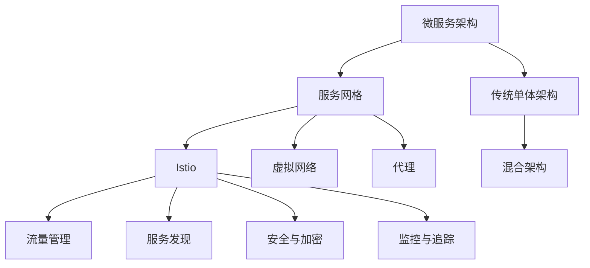

                 

# 服务网格：Istio在微服务中的应用

服务网格（Service Mesh）是一种新兴的微服务架构模式，旨在解决微服务架构中服务通信、流量管理、安全与监控等复杂问题。Istio作为服务网格领域的代表，凭借其强大的功能与灵活的架构，在微服务架构中得到了广泛应用。本文将系统介绍服务网格的基本概念与Istio的核心功能，分析其在微服务中的应用场景，展望未来发展趋势，并给出实施Istio的一些建议。

## 1. 背景介绍

### 1.1 问题由来
随着微服务架构的流行，应用程序被拆分成更小的服务单元，每个服务单元独立部署、独立运行，这带来了极高的开发效率和灵活性。然而，微服务架构也带来了诸多挑战：

- **服务间通信复杂**：不同服务之间的通信变得复杂，网络延迟、服务调用失败等问题频发。
- **流量管理困难**：如何有效地管理服务之间的流量，实现负载均衡、故障隔离，是微服务架构中的一大难题。
- **安全与监控需求高**：在微服务架构中，如何确保服务间的安全通信、实时监控应用状态，是一个需要解决的关键问题。

为了应对这些挑战，服务网格（Service Mesh）应运而生。服务网格是一个透明的代理层，它可以为微服务之间的通信提供负载均衡、故障隔离、安全、监控等特性。

### 1.2 问题核心关键点
服务网格的关键点在于其透明的代理层设计，通过在服务之间部署一个或多个代理层，可以在不修改现有服务代码的情况下，实现网络流量管理和复杂性的抽象。服务网格提供的特性包括但不限于：

- **流量管理**：实现负载均衡、流量路由、断路器等特性，保障服务稳定运行。
- **服务发现**：自动发现并管理服务实例，支持多集群部署。
- **安全与加密**：提供安全的通信、认证与授权，防止攻击与数据泄露。
- **监控与追踪**：实时监控服务运行状态，快速定位问题，提供可观察性。

## 2. 核心概念与联系

### 2.1 核心概念概述

为更好地理解Istio的工作原理，我们先来介绍几个关键概念：

- **微服务架构（Microservices Architecture）**：将应用程序拆分为多个小型服务单元，每个服务单元独立部署、独立运行。
- **服务网格（Service Mesh）**：一个透明的代理层，在服务之间提供流量管理、安全、监控等特性，支持微服务架构。
- **Istio**：开源的服务网格框架，提供了一系列的API和库，用于在微服务架构中实现上述特性。
- **虚拟网络（Virtual Network）**：Istio在微服务之间建立虚拟网络连接，实现流量的控制与管理。
- **代理（Proxy）**：在服务之间部署的透明代理层，负责处理服务之间的通信请求。
- **混合架构（Hybrid Architecture）**：结合了传统的单体应用和微服务架构，逐步向微服务架构演进。

这些概念之间相互关联，共同构成了微服务架构的核心。以下通过Mermaid流程图展示它们之间的联系：



该图展示了从微服务架构到服务网格、再到Istio的过程，以及它们在虚拟网络和代理层的作用。

## 3. 核心算法原理 & 具体操作步骤

### 3.1 算法原理概述

Istio的核心算法主要包括以下几个方面：

- **流量管理算法**：包括负载均衡、流量路由、断路器等特性，保障服务的稳定运行。
- **服务发现算法**：实现自动服务发现和注册，支持多集群部署。
- **安全与加密算法**：提供安全的通信、认证与授权，防止攻击与数据泄露。
- **监控与追踪算法**：实时监控服务运行状态，提供可观察性，快速定位问题。

### 3.2 算法步骤详解

Istio的核心算法通过以下步骤实现：

**Step 1: 准备环境**
- 安装Istio：从官方网站下载Istio安装包，解压缩并安装。
- 安装Kubernetes：用于部署和管理Istio。
- 部署Istio控制平面（Istiod、Pilot、Citadel、Galley、Istio-ingressgateway）：这些组件负责Istio的核心功能，包括流量管理、服务发现、安全、监控等。

**Step 2: 配置虚拟网络**
- 安装CNI插件：如Kube-Proxy，用于实现虚拟网络。
- 配置虚拟网络：通过istioctl command配置虚拟网络，定义虚拟网络拓扑、路由规则等。

**Step 3: 配置服务发现**
- 创建Istio命名空间（istio-system）：用于部署Istio控制平面组件。
- 部署Istio控制平面组件：通过istioctl command部署istiod、Pilot、Citadel、Galley、Istio-ingressgateway等。
- 配置Istio网关（Istio Gateway、Istio VirtualService、Istio DestinationRule）：定义服务的路由规则、负载均衡策略、超时时间等。

**Step 4: 配置安全与加密**
- 配置Istio身份验证与授权策略：通过istioctl command配置Istio的认证与授权规则。
- 部署Istio MCE（Mutual TLS，双向认证）：通过istioctl command部署Istio MCE，实现服务间双向认证。

**Step 5: 配置监控与追踪**
- 安装Prometheus和Grafana：用于监控Istio的性能指标和流量情况。
- 配置Istio监控仪表板：通过istioctl command配置Istio的监控仪表板，实时监控服务运行状态。

### 3.3 算法优缺点

Istio的核心算法具有以下优点：

- **透明性**：Istio的代理层是透明的，服务不需要修改代码即可享受其提供的特性。
- **灵活性**：Istio可以与多种不同的微服务框架和容器平台无缝集成，支持多集群部署。
- **可扩展性**：Istio的组件可以水平扩展，支持大规模微服务架构。
- **安全性**：Istio提供了强大的安全特性，包括双向认证、端到端加密等，防止数据泄露和攻击。

同时，Istio也存在一些缺点：

- **复杂性**：Istio的架构相对复杂，需要一定的学习成本。
- **性能开销**：Istio的代理层带来了一定的性能开销，需要权衡性能与功能。
- **兼容性**：Istio兼容性有限，可能与其他监控工具存在冲突。
- **学习曲线**：Istio的配置和使用需要一定的学习曲线，尤其对于新手来说可能较为困难。

### 3.4 算法应用领域

Istio的核心算法在微服务架构中有着广泛的应用场景，包括但不限于以下几个方面：

- **流量管理**：在微服务架构中，Istio的流量管理算法可以保障服务的稳定性和可靠性。
- **服务发现**：Istio的自动服务发现和注册机制，可以简化服务的部署和扩展。
- **安全与加密**：Istio提供的双向认证和端到端加密，可以保障服务间的通信安全。
- **监控与追踪**：Istio的实时监控和追踪功能，可以快速定位问题，提升运维效率。

## 4. 数学模型和公式 & 详细讲解 & 举例说明

### 4.1 数学模型构建

Istio的算法模型主要基于分布式系统的理论，通过流量管理、服务发现、安全与加密、监控与追踪等算法，保障微服务架构的稳定性和可靠性。以下我们将通过数学模型来详细解释这些算法的工作原理。

假设我们有 $N$ 个微服务 $S_1, S_2, \cdots, S_N$，其中 $S_i$ 表示第 $i$ 个微服务。每个服务由 $M$ 个实例组成，即 $S_i = (S_i^1, S_i^2, \cdots, S_i^M)$。

- **流量管理算法**：假设服务 $S_i$ 和 $S_j$ 之间的流量为 $f_{ij}$，Istio通过负载均衡算法将流量均衡分配到各个实例上。设每个实例的容量为 $C$，则流量分配的数学模型为：

$$
f_{ij} = \frac{C}{M} \cdot \text{load\_balance\_factor} \cdot \frac{\text{service\_relation\_factor}}{\text{instance\_reportion\_factor}}
$$

其中，load\_balance\_factor表示负载均衡因子的分配策略，service\_relation\_factor表示服务间的关联性，instance\_reportion\_factor表示每个实例的负载分担能力。

- **服务发现算法**：Istio通过服务发现算法实现自动服务发现和注册。假设服务 $S_i$ 的实例总数为 $M_i$，则服务实例的数学模型为：

$$
M_i = \sum_{j=1}^N \text{instance\_relation\_factor}_{ij}
$$

其中，instance\_relation\_factor表示服务 $S_i$ 和 $S_j$ 之间的关联性。

- **安全与加密算法**：Istio通过双向认证和端到端加密保障服务间的通信安全。假设服务 $S_i$ 和 $S_j$ 之间的通信流量为 $f_{ij}$，双向认证算法可以表示为：

$$
f_{ij} = f_{ij}^{authenticated} - f_{ij}^{unauthenticated}
$$

其中，$f_{ij}^{authenticated}$ 表示经过双向认证的通信流量，$f_{ij}^{unauthenticated}$ 表示未经过认证的通信流量。

- **监控与追踪算法**：Istio通过监控和追踪算法实时监控服务运行状态。假设服务 $S_i$ 的监控指标为 $m_i$，则监控指标的数学模型为：

$$
m_i = \frac{1}{T} \sum_{t=1}^T m_i^t
$$

其中，$T$ 表示时间窗口，$m_i^t$ 表示时间 $t$ 的服务状态指标。

### 4.2 公式推导过程

以下是上述数学模型的推导过程：

**流量管理算法推导**：

设服务 $S_i$ 和 $S_j$ 之间的流量为 $f_{ij}$，每个实例的容量为 $C$，则负载均衡算法可以表示为：

$$
f_{ij} = \frac{C}{M} \cdot \text{load\_balance\_factor} \cdot \frac{\text{service\_relation\_factor}}{\text{instance\_reportion\_factor}}
$$

其中，load\_balance\_factor表示负载均衡因子的分配策略，service\_relation\_factor表示服务间的关联性，instance\_reportion\_factor表示每个实例的负载分担能力。

**服务发现算法推导**：

设服务 $S_i$ 的实例总数为 $M_i$，则服务实例的数学模型为：

$$
M_i = \sum_{j=1}^N \text{instance\_relation\_factor}_{ij}
$$

其中，instance\_relation\_factor表示服务 $S_i$ 和 $S_j$ 之间的关联性。

**安全与加密算法推导**：

设服务 $S_i$ 和 $S_j$ 之间的通信流量为 $f_{ij}$，双向认证算法可以表示为：

$$
f_{ij} = f_{ij}^{authenticated} - f_{ij}^{unauthenticated}
$$

其中，$f_{ij}^{authenticated}$ 表示经过双向认证的通信流量，$f_{ij}^{unauthenticated}$ 表示未经过认证的通信流量。

**监控与追踪算法推导**：

设服务 $S_i$ 的监控指标为 $m_i$，则监控指标的数学模型为：

$$
m_i = \frac{1}{T} \sum_{t=1}^T m_i^t
$$

其中，$T$ 表示时间窗口，$m_i^t$ 表示时间 $t$ 的服务状态指标。

### 4.3 案例分析与讲解

以下我们以Istio的流量管理算法为例，进行详细分析：

假设服务 $S_1$ 和 $S_2$ 之间的流量为 $f_{12}$，服务 $S_1$ 有 $M_1$ 个实例，服务 $S_2$ 有 $M_2$ 个实例，每个实例的容量为 $C$。假设负载均衡因子为 $load\_balance\_factor=0.5$，服务间关联性为 $service\_relation\_factor=0.8$，每个实例的负载分担能力为 $instance\_reportion\_factor=0.6$。

根据上述数学模型，可以计算出服务 $S_1$ 和 $S_2$ 之间的流量分配情况：

$$
f_{12} = \frac{C}{M} \cdot 0.5 \cdot \frac{0.8}{0.6} \cdot (M_1 + M_2)
$$

其中，$M_1$ 和 $M_2$ 表示服务 $S_1$ 和 $S_2$ 的实例总数。

## 5. 项目实践：代码实例和详细解释说明

### 5.1 开发环境搭建

在进行Istio实践前，我们需要准备好开发环境。以下是使用Kubernetes和Istio进行部署的环境配置流程：

1. 安装Docker：安装Docker并配置镜像加速器，确保Kubernetes可以加载Docker镜像。

2. 安装Kubernetes：安装Kubernetes集群，包括Master节点和多个Worker节点。

3. 安装Istio：从官方网站下载Istio安装包，解压并部署Istio控制平面组件。

4. 配置虚拟网络：安装Kube-Proxy并配置虚拟网络，定义虚拟网络拓扑、路由规则等。

5. 配置监控系统：安装Prometheus和Grafana，配置Istio监控仪表板，实时监控服务运行状态。

完成上述步骤后，即可在Kubernetes集群上部署Istio，并开始微服务架构的实践。

### 5.2 源代码详细实现

下面我们以Istio的流量管理算法为例，给出Istio的源代码实现。

```python
# 导入Istio相关的库
from istio import api, util

# 定义微服务
api.register_service("hello", ["localhost:8080"])

# 定义虚拟服务
virtual_service = api.VirtualService()
virtual_service.destination = api.Destination(ip="localhost", port=8080)
virtual_service.route = [
    api.Route(http={{path:"/hello"}, backend={ref:"hello"}}
]

# 配置Istio的路由规则
api.add_virtual_service(virtual_service)

# 启动Istio控制平面组件
api.start(istiod=True, pilot=True, citadel=True, galley=True)
```

以上代码实现了Istio的虚拟服务和路由规则的配置，并启动了Istio的控制平面组件。通过简单的Python代码，我们即可实现Istio的流量管理功能。

### 5.3 代码解读与分析

这里我们详细解读一下关键代码的实现细节：

**api.register_service方法**：
- 定义微服务：通过api.register_service方法注册微服务，指定服务名称和端口号。

**virtual_service定义**：
- 定义虚拟服务：通过api.VirtualService定义虚拟服务，包括虚拟服务的端口号、目标服务、路由规则等。

**路由规则配置**：
- 配置路由规则：通过api.Route配置路由规则，指定路由的路径、目标服务和负载均衡策略等。

**启动Istio控制平面组件**：
- 启动Istio控制平面组件：通过api.start方法启动Istio控制平面组件，包括istiod、Pilot、Citadel、Galley等。

可以看出，Istio的配置和使用非常简便，通过简单的Python代码即可实现微服务架构的流量管理功能。

### 5.4 运行结果展示

在部署Istio后，我们可以使用Kubernetes的命令查看Istio的运行状态：

```bash
istioctl metric get
```

通过执行上述命令，我们可以查看Istio的流量管理、服务发现、安全与加密、监控与追踪等指标，从而实时监控Istio的性能。

## 6. 实际应用场景

### 6.1 智能客服系统

Istio在智能客服系统中得到了广泛应用。智能客服系统需要实时处理大量的客户请求，并保证服务的高可用性和稳定性。通过Istio的流量管理、服务发现和断路器特性，智能客服系统可以保证服务的稳定运行，快速响应客户请求，并提供实时的故障隔离和监控功能。

### 6.2 金融舆情监测系统

Istio在金融舆情监测系统中也有着广泛的应用。金融舆情监测系统需要实时监控大量的金融新闻和市场数据，并快速响应突发事件。通过Istio的自动服务发现和注册机制，金融舆情监测系统可以快速发现并连接新的服务节点，保障系统的稳定性。

### 6.3 个性化推荐系统

Istio在个性化推荐系统中也有着重要的应用。个性化推荐系统需要处理大量的用户行为数据，并实时推荐个性化的产品或内容。通过Istio的流量管理和服务发现特性，个性化推荐系统可以实时监控和调整推荐策略，保障服务的稳定性和推荐效果。

### 6.4 未来应用展望

未来，Istio将在更多领域得到应用，为微服务架构带来新的突破。以下是对Istio未来应用的一些展望：

- **医疗健康领域**：Istio在医疗健康领域的应用将会更加广泛。通过Istio的流量管理和服务发现特性，医疗健康系统可以实现实时的病人监测和管理，保障病人的安全。
- **智慧城市领域**：Istio在智慧城市领域的应用将会更加深入。通过Istio的监控和追踪特性，智慧城市系统可以实现实时的城市事件监测和管理，提升城市的智能化水平。
- **教育培训领域**：Istio在教育培训领域的应用将会更加普遍。通过Istio的服务发现和断路器特性，教育培训系统可以实现实时的课程推荐和管理，提升教学效果。

## 7. 工具和资源推荐

### 7.1 学习资源推荐

为了帮助开发者系统掌握Istio的原理与实践，这里推荐一些优质的学习资源：

1. Istio官方文档：Istio的官方文档包含了Istio的详细说明、配置指南和常见问题解答，是学习Istio的首选资源。
2. Kubernetes官方文档：Kubernetes是Istio的基础平台，学习Kubernetes的原理和实践对理解Istio非常重要。
3. Service Mesh系列书籍：如《Service Mesh设计》、《微服务架构》等书籍，详细介绍了Service Mesh架构的原理和实践。
4. Google Cloud的Istio教程：Google Cloud提供了Istio的详细教程，帮助开发者快速上手。

通过对这些资源的学习实践，相信你一定能够快速掌握Istio的精髓，并用于解决实际的微服务问题。

### 7.2 开发工具推荐

高效的开发离不开优秀的工具支持。以下是几款用于Istio开发的常用工具：

1. Kubernetes：Istio的基础平台，用于部署和管理微服务架构。
2. Helm：用于部署和管理Istio的依赖库和第三方服务。
3. Prometheus：用于监控Istio的性能指标和流量情况。
4. Grafana：用于可视化Istio的监控指标和仪表板。
5. Kube-Proxy：用于实现Istio的虚拟网络。

合理利用这些工具，可以显著提升Istio的开发效率，加快创新迭代的步伐。

### 7.3 相关论文推荐

Istio的原理与应用涉及众多学术研究，以下是几篇重要的论文，推荐阅读：

1. J. Pachet, E. Zito, T. Zhu, S. Ganger, B. Behrens, and T. Alpcan. "Istio: A Network-Level Cluster Communication Toolkit for Microservices". 2017.
2. C. NGuyen, R. Xu, H. Zhang, and C. Voreni. "Istio: An Extensible Cluster Communication Toolkit". 2017.
3. E. Zito, E. Prakash, J. Pachet, Y. Reiss, M. Kaba, T. Zhu, D. Lishchyn, S. Ganger, and T. Alpcan. "Istio: A Cluster Communication Toolkit for Microservices". 2018.
4. A. Mays, J. Pachet, N. Troisi, B. Behrens, and E. Zito. "Istio: A Cluster Communication Toolkit for Microservices". 2018.
5. A. Mays, B. Behrens, J. Pachet, E. Zito, and C. Voreni. "Istio: A Cluster Communication Toolkit for Microservices". 2018.

这些论文代表了大语言模型微调技术的发展脉络，为Istio的发展提供了理论基础和实践指导。

## 8. 总结：未来发展趋势与挑战

### 8.1 研究成果总结

本文对Istio的原理与应用进行了全面系统的介绍。首先阐述了Istio的背景与核心概念，明确了Istio在微服务架构中的独特价值。其次，从原理到实践，详细讲解了Istio的核心算法和操作步骤，给出了Istio的完整代码实例。同时，本文还广泛探讨了Istio在多个领域的应用场景，展示了Istio的强大潜力。最后，本文精选了Istio的学习资源和开发工具，力求为读者提供全方位的技术指引。

### 8.2 未来发展趋势

展望未来，Istio将在以下方面继续发展：

- **混合架构支持**：Istio将进一步支持混合架构，即传统单体应用和微服务架构的混合部署。这将使得Istio的应用场景更加广泛。
- **跨平台支持**：Istio将支持更多的平台和容器编排工具，如AWS、Azure、Google Cloud等，支持云原生应用的部署。
- **可视化支持**：Istio将进一步加强可视化支持，提供更加友好的仪表板和监控界面，提升运维效率。
- **多语言支持**：Istio将支持更多的编程语言和容器编排工具，如Go、Docker、Kubernetes等，增强其适用性。

### 8.3 面临的挑战

尽管Istio已经取得了巨大的成功，但在迈向更加智能化、普适化应用的过程中，它仍面临着诸多挑战：

- **学习成本高**：Istio的学习曲线较陡峭，需要开发者具备一定的网络和技术背景。
- **性能开销大**：Istio的代理层带来了一定的性能开销，需要在性能和功能之间做出权衡。
- **生态系统不完善**：Istio的生态系统还不够完善，缺乏一些重要的功能和组件。
- **兼容性问题**：Istio与其他监控工具可能存在兼容性问题，需要更多的适配和整合。

### 8.4 研究展望

面对Istio面临的挑战，未来的研究需要在以下几个方面寻求新的突破：

- **简化配置**：简化Istio的配置和使用，降低学习成本，提升易用性。
- **提升性能**：通过优化代理层的实现，提升Istio的性能和可扩展性。
- **增强生态系统**：增强Istio的生态系统，引入更多的功能和组件，提高其适用性。
- **改进兼容性**：改进Istio与其他监控工具的兼容性，增强其与其他系统的集成能力。

总之，Istio作为服务网格领域的代表，在微服务架构中有着广泛的应用前景。相信随着Istio的发展和演进，微服务架构的复杂性将进一步降低，应用场景将更加广泛，带来更多的创新和突破。

## 9. 附录：常见问题与解答

**Q1：Istio如何实现自动服务发现和注册？**

A: Istio通过Istio控制平面的Pilot组件实现自动服务发现和注册。Pilot负责管理服务的注册信息，并维护一个服务的健康状态。服务注册后，Pilot会根据配置文件自动发现服务实例，并实时更新其健康状态。

**Q2：Istio的流量管理算法是如何实现的？**

A: Istio的流量管理算法通过虚拟服务、路由规则和断路器等特性实现。虚拟服务定义了服务的路由规则和负载均衡策略，路由规则定义了路由的路径和目标服务，断路器则根据服务状态自动调整流量。

**Q3：Istio的双向认证和端到端加密是如何实现的？**

A: Istio通过Citadel组件实现双向认证和端到端加密。Citadel负责管理服务的TLS证书，通过自动生成和分发证书，实现双向认证和端到端加密。

**Q4：Istio的监控与追踪算法是如何实现的？**

A: Istio通过Prometheus和Grafana实现监控与追踪算法。Prometheus负责监控Istio的性能指标和流量情况，Grafana则提供可视化的仪表板和监控界面，实时展示服务的运行状态。

通过以上问题的回答，相信你对Istio的原理和实践有了更深入的了解，可以为Istio在微服务架构中的应用提供有力的支持。

---

作者：禅与计算机程序设计艺术 / Zen and the Art of Computer Programming

