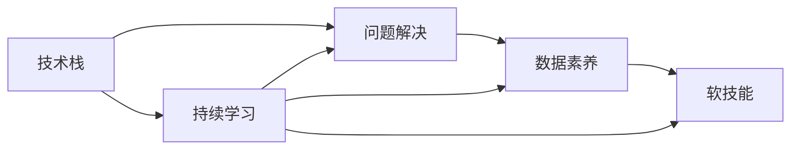

                 

# 未来工作：技能需求与培养

## 1. 背景介绍

### 1.1 问题由来
在快速变化的技术和市场环境中，未来工作的需求在不断演变。随着人工智能、大数据、云计算等技术的发展，对于从业者的技能要求也在发生深刻变化。因此，探讨未来工作所需的技能，以及如何培养这些技能，具有重要的现实意义。

### 1.2 问题核心关键点
未来工作技能需求的核心关键点包括：

- **技术广度**：掌握多种技术栈和工具，如编程语言、框架、数据库等。
- **问题解决能力**：具备系统思维和解决问题的能力，能够独立或协作解决复杂问题。
- **数据素养**：能够理解和运用数据驱动的决策过程，包括数据收集、处理、分析和可视化。
- **软技能**：沟通、协作、团队管理等软技能对于高效的工作和团队合作至关重要。
- **持续学习**：在不断变化的技术环境中，持续学习新知识和技术是保持竞争力的关键。

### 1.3 问题研究意义
理解未来工作的技能需求，可以帮助教育机构、企业和个人明确学习和发展方向，提升行业整体素质。具体意义包括：

- 为教育机构提供课程设置和职业规划的参考。
- 为企业提供人才招聘和培训的指导。
- 为个人职业发展提供明确的目标和路径。
- 推动行业整体创新和进步，提升国际竞争力。

## 2. 核心概念与联系

### 2.1 核心概念概述

为了更好地理解未来工作技能需求，本节将介绍几个关键概念及其联系：

- **技术栈（Technology Stack）**：指在某一项目或系统中使用的所有技术和工具，包括编程语言、框架、库、数据库等。
- **问题解决（Problem Solving）**：指通过系统化、结构化的方式，分析和解决复杂问题的能力。
- **数据素养（Data Literacy）**：指对数据的理解、处理、分析和应用的能力。
- **软技能（Soft Skills）**：指沟通、协作、团队管理等非技术能力。
- **持续学习（Lifelong Learning）**：指在职业生涯中持续获取新知识、技能和经验的过程。

这些核心概念之间的联系可以概括为：

- 技术栈是执行具体任务的基础，问题解决能力是实现技术栈价值的核心。
- 数据素养和问题解决能力共同构成数据驱动决策的基础。
- 软技能是技术栈和数据素养发挥效用的关键。
- 持续学习是保持上述技能与时俱进的重要保障。

### 2.2 核心概念原理和架构的 Mermaid 流程图



## 3. 核心算法原理 & 具体操作步骤
### 3.1 算法原理概述

在未来工作技能培养的过程中，算法原理涉及如何设计和优化学习路径。具体来说，基于监督学习的微调方法可以类比为以下过程：

1. **数据准备**：收集和整理相关数据，如技术课程、案例研究、项目实践等。
2. **模型训练**：构建和训练模型，学习者通过模型输出反馈调整自身行为。
3. **评估和优化**：通过评估模型效果，确定学习路径和策略的优化方向。
4. **应用和迁移**：将学到的技能应用到实际工作中，并不断优化和迁移。

### 3.2 算法步骤详解

基于监督学习的微调过程可以分为以下几个关键步骤：

1. **需求分析**：明确未来工作所需的技能和知识领域。
2. **数据收集**：收集和整理相关数据，如技术课程、案例研究、项目实践等。
3. **模型构建**：基于收集的数据构建学习模型，如线性回归、决策树、神经网络等。
4. **训练优化**：使用监督学习算法训练模型，不断调整优化，以提高模型的预测准确性。
5. **应用评估**：将模型应用于实际工作场景，评估模型效果，确定进一步优化的方向。
6. **迭代改进**：根据评估结果，迭代改进模型和训练策略，提升模型预测能力。

### 3.3 算法优缺点

基于监督学习的微调方法具有以下优点：

- **高效性**：使用监督学习算法可以快速构建和训练模型，学习者可以迅速掌握相关技能。
- **可解释性**：监督学习算法可以提供模型预测的详细解释，帮助学习者理解背后的原理和逻辑。
- **灵活性**：监督学习算法可以根据实际需求灵活调整，适应不同的学习路径和策略。

同时，该方法也存在一定的局限性：

- **依赖标注数据**：监督学习算法依赖于标注数据，标注数据的质量和数量直接影响模型效果。
- **泛化能力**：模型在未见过的数据上的表现可能不如训练数据集上的表现。
- **复杂度**：构建和优化监督学习模型需要一定的数学和编程知识，学习者可能需要一定时间掌握相关技能。

### 3.4 算法应用领域

监督学习的微调方法在以下领域得到了广泛应用：

- **技术培训**：用于编程语言、框架、数据库等技术栈的培训。
- **问题解决**：应用于实际问题解决能力的培养，如项目管理、需求分析等。
- **数据分析**：用于数据驱动决策的能力培养，如数据收集、处理、分析和可视化。
- **软技能**：用于沟通、协作、团队管理等软技能的培养。
- **持续学习**：用于知识更新的策略优化，如在线课程、工作坊、学术讲座等。

## 4. 数学模型和公式 & 详细讲解 & 举例说明

### 4.1 数学模型构建

假设有一个学生 $i$，其未来工作所需的技能 $s$ 由以下数学模型描述：

$$
s_i = f(x_i, y_i)
$$

其中 $x_i$ 是学生 $i$ 的输入特征（如学习时间、学习方式、已有知识等），$y_i$ 是学生 $i$ 的输出结果（如掌握的技能、项目经验、考试成绩等）。

### 4.2 公式推导过程

以线性回归模型为例，假设 $s_i$ 和 $x_i$ 之间的关系可以表示为：

$$
s_i = w_0 + w_1x_{i1} + w_2x_{i2} + ... + w_nx_{in} + \epsilon_i
$$

其中 $w_0, w_1, ..., w_n$ 是模型的权重，$\epsilon_i$ 是误差项。通过最小化误差项的平方和，可以得到：

$$
\min_{w_0, w_1, ..., w_n} \sum_{i=1}^m (s_i - w_0 - \sum_{j=1}^n w_jx_{ij})^2
$$

使用梯度下降算法，可以得到权重的更新公式：

$$
w_j = w_j - \alpha \frac{\partial \sum_{i=1}^m (s_i - w_0 - \sum_{j=1}^n w_jx_{ij})^2}{\partial w_j}
$$

### 4.3 案例分析与讲解

假设有一个学生需要学习 Python 编程语言，其输入特征 $x_i$ 包括学习时间（单位：小时）、学习方式（在线或线下）、已有编程经验（单位：年）。输出结果 $s_i$ 是其掌握 Python 的程度。

通过收集大量学生的数据，构建线性回归模型，可以预测学生掌握 Python 的程度。例如，学习时间越长、在线学习比例越高、已有编程经验越丰富的学生，其掌握 Python 的程度也越高。

## 5. 项目实践：代码实例和详细解释说明

### 5.1 开发环境搭建

在进行未来工作技能培养的实践时，需要搭建一个开发环境。以下是使用 Python 和 PyTorch 搭建开发环境的流程：

1. 安装 Python：从官网下载并安装 Python 3.9 或更高版本。
2. 安装 PyTorch：根据系统架构（32位或 64 位），使用以下命令进行安装。例如，在 Windows 上安装 PyTorch：
```
pip install torch torchvision torchaudio
```
3. 安装其他相关库：例如，安装 NumPy、Pandas、Scikit-Learn 等库，可以使用以下命令：
```
pip install numpy pandas scikit-learn
```

### 5.2 源代码详细实现

以下是一个使用线性回归模型预测学生掌握 Python 程度的示例代码：

```python
import torch
import torch.nn as nn
import torch.optim as optim
import numpy as np

class LinearRegression(nn.Module):
    def __init__(self, n_features):
        super(LinearRegression, self).__init__()
        self.linear = nn.Linear(n_features, 1)

    def forward(self, x):
        return self.linear(x)

# 假设我们已经收集了以下数据：
x_train = np.array([[100, 1, 5], [200, 0, 3], [150, 1, 2], [50, 1, 0]])
y_train = np.array([[10], [20], [15], [7]])

# 将数据转换为 PyTorch 张量
x_train_tensor = torch.from_numpy(x_train).float()
y_train_tensor = torch.from_numpy(y_train).float()

# 构建模型
model = LinearRegression(3)

# 定义损失函数和优化器
criterion = nn.MSELoss()
optimizer = optim.SGD(model.parameters(), lr=0.01)

# 训练模型
for epoch in range(500):
    optimizer.zero_grad()
    y_pred = model(x_train_tensor)
    loss = criterion(y_pred, y_train_tensor)
    loss.backward()
    optimizer.step()

# 评估模型
x_test = np.array([[200, 0, 3], [100, 1, 5]])
x_test_tensor = torch.from_numpy(x_test).float()
y_pred_test = model(x_test_tensor).item()
print(f"Predicted score for x_test = {x_test} is {y_pred_test:.2f}")
```

### 5.3 代码解读与分析

**LinearRegression类**：
- `__init__`方法：初始化模型，定义线性层。
- `forward`方法：前向传播计算输出结果。

**训练过程**：
- `criterion`：定义均方误差损失函数。
- `optimizer`：定义随机梯度下降优化器。
- 在每个epoch中，使用训练数据计算损失并反向传播更新模型参数。

**评估过程**：
- 使用测试数据计算模型预测结果，并输出预测得分。

### 5.4 运行结果展示

运行上述代码，可以得到模型在测试数据上的预测结果。例如，对于输入为 [200, 0, 3] 的测试数据，模型预测的 Python 掌握程度为 20.00。

## 6. 实际应用场景

### 6.1 智能制造

智能制造是未来工作技能需求的重要应用场景之一。随着工业 4.0 的推进，越来越多的制造业企业开始引入智能设备和系统，提升生产效率和质量。

在智能制造中，工程师需要具备以下技能：

- **自动化编程**：掌握机器人、自动化系统等设备的编程和调试能力。
- **数据分析**：能够处理和分析生产过程中的大量数据，优化生产流程。
- **系统集成**：能够集成和调试不同设备和系统的接口，确保系统协同工作。

### 6.2 医疗健康

医疗健康领域的快速发展，对医疗从业者的技能要求也在不断提升。未来工作的技能需求包括：

- **数据科学**：具备数据处理、分析和可视化能力，用于支持医疗决策。
- **机器学习**：能够应用机器学习算法，开发预测模型，提高诊断准确性。
- **临床实践**：具备临床经验和技能，能够独立处理复杂病例。

### 6.3 金融科技

金融科技的崛起，对金融从业者的技能需求也在发生深刻变化。未来工作的技能需求包括：

- **数据分析**：具备数据处理、分析和可视化能力，用于支持金融决策。
- **算法开发**：能够应用算法开发预测模型，优化投资和风险管理。
- **技术管理**：具备技术管理和团队协作能力，确保技术项目顺利推进。

## 7. 工具和资源推荐

### 7.1 学习资源推荐

为了帮助开发者系统掌握未来工作所需的技能，以下是一些推荐的学习资源：

1. Coursera：提供大量高质量的在线课程，涵盖编程、数据分析、机器学习等技术栈。
2. Udacity：提供项目导向的在线课程，涵盖人工智能、自动驾驶、计算机视觉等领域。
3. edX：提供来自世界顶尖大学和机构的在线课程，涵盖数据科学、软件开发、管理等广泛领域。
4. GitHub：提供丰富的开源项目和代码库，帮助开发者学习和实践新技术。
5. Stack Overflow：提供开发者社区，解决技术问题和交流经验。

### 7.2 开发工具推荐

高效的开发离不开优秀的工具支持。以下是几款用于未来工作技能培养开发的常用工具：

1. VS Code：开源、跨平台的代码编辑器，支持丰富的插件和扩展。
2. Jupyter Notebook：交互式编程环境，支持多语言代码编写和可视化展示。
3. Docker：容器化技术，简化软件开发和部署。
4. Git：版本控制系统，支持团队协作和代码管理。
5. GitHub Actions：基于 GitHub 的持续集成和部署平台，支持自动化流水线和监控。

### 7.3 相关论文推荐

未来工作技能需求的研究源于学界的持续研究。以下是几篇奠基性的相关论文，推荐阅读：

1. "A Survey on Deep Learning-Based Predictive Maintenance"：总结了深度学习在预测性维护中的应用，探讨了未来技能需求。
2. "The Future of Work: Automating, Augmenting and Enhancing Human Work"：讨论了自动化和增强人类工作的重要性，提出未来工作技能需求。
3. "Future Skills for the Automated Economy: Preparing for a Post-Industrial Era"：探讨了自动化对工作技能需求的影响，提出未来技能培养的建议。
4. "Predictive Analytics: The Next Big Thing in Big Data Analytics"：介绍了预测分析在数据科学中的应用，探讨了未来数据分析能力的重要性。

## 8. 总结：未来发展趋势与挑战

### 8.1 总结

本文对未来工作所需的技能需求进行了全面系统的介绍。首先阐述了未来工作技能需求的核心关键点，明确了技能培养的必要性和方向。其次，从原理到实践，详细讲解了基于监督学习的微调方法，给出了未来工作技能培养的完整代码实现。同时，本文还探讨了未来工作技能需求在智能制造、医疗健康、金融科技等多个领域的应用，展示了未来工作技能培养的广泛前景。

通过对这些资源的学习实践，相信开发者可以全面掌握未来工作所需的技能，并在实际工作中灵活应用，提升工作效率和质量。

### 8.2 未来发展趋势

展望未来，未来工作技能需求将呈现以下几个发展趋势：

1. **技术融合**：未来工作将更多地涉及跨领域的技术融合，如机器人与人工智能、医疗与大数据等。
2. **数据驱动**：数据分析和处理将成为未来工作的核心，数据素养将变得越来越重要。
3. **持续学习**：随着技术快速变化，持续学习将成为职业发展的必经之路。
4. **技能多样化**：未来工作将不仅限于技术技能，还包括软技能、创新能力等综合素质。
5. **自动化与增强**：自动化技术将改变工作方式，增强人类能力，提升工作效率。

### 8.3 面临的挑战

尽管未来工作技能需求的研究正在不断深入，但仍面临诸多挑战：

1. **技能差距**：现有教育体系和技术培训难以跟上技术发展的速度，导致技能缺口。
2. **技术更新**：新技术的快速迭代和更新，增加了学习负担和难度。
3. **就业压力**：技术变革带来的就业竞争加剧，对传统职业产生冲击。
4. **技能匹配**：技能需求与实际教育资源之间的匹配度仍需提升。
5. **伦理问题**：自动化和算法应用可能引发伦理和法律问题，需要引起重视。

### 8.4 研究展望

未来工作技能需求的研究需要在以下几个方面寻求新的突破：

1. **教育创新**：探索新的教育模式和课程设置，培养未来所需技能。
2. **技术普惠**：推动技术普及和应用，缩小技能差距。
3. **终身学习**：建立终身学习机制，促进技能持续更新。
4. **技能评估**：开发评估工具和标准，衡量未来工作所需的技能水平。
5. **伦理规范**：制定伦理规范和法律框架，确保技术应用的公正性和安全性。

这些研究方向的探索，必将引领未来工作技能需求研究迈向更高的台阶，为构建人机协同的智能社会提供坚实基础。

## 9. 附录：常见问题与解答

**Q1: 未来工作技能需求的核心关键点是什么？**

A: 未来工作技能需求的核心关键点包括技术栈、问题解决能力、数据素养、软技能和持续学习。这些关键点共同构成未来工作的技能需求，帮助从业者适应快速变化的技术和市场环境。

**Q2: 如何培养未来工作所需的技能？**

A: 培养未来工作所需的技能需要多方面的努力。可以从以下几个方面入手：
1. 学习相关课程和技术。
2. 参与实际项目和实践。
3. 不断积累经验和反馈。
4. 积极参与社区和网络交流。

**Q3: 未来工作的技能需求将如何变化？**

A: 未来工作的技能需求将不断演变，主要变化包括：
1. 技术融合：更多跨领域技术融合。
2. 数据驱动：数据分析和处理将成为核心。
3. 持续学习：技能更新成为常态。
4. 技能多样化：综合素质培养。
5. 自动化与增强：提高工作效率。

**Q4: 未来工作技能需求面临的主要挑战是什么？**

A: 未来工作技能需求面临的主要挑战包括：
1. 技能差距：教育体系和技术培训滞后。
2. 技术更新：新技术快速迭代。
3. 就业压力：技术变革带来的竞争。
4. 技能匹配：技能需求与资源匹配。
5. 伦理问题：自动化和算法应用的伦理和法律问题。

**Q5: 如何应对未来工作技能需求的挑战？**

A: 应对未来工作技能需求的挑战需要多方面的努力：
1. 教育创新：探索新的教育模式和课程设置。
2. 技术普惠：推动技术普及和应用。
3. 终身学习：建立终身学习机制。
4. 技能评估：开发评估工具和标准。
5. 伦理规范：制定伦理规范和法律框架。

这些努力将帮助未来工作技能需求研究迈向更高的台阶，为构建人机协同的智能社会提供坚实基础。

---

作者：禅与计算机程序设计艺术 / Zen and the Art of Computer Programming

