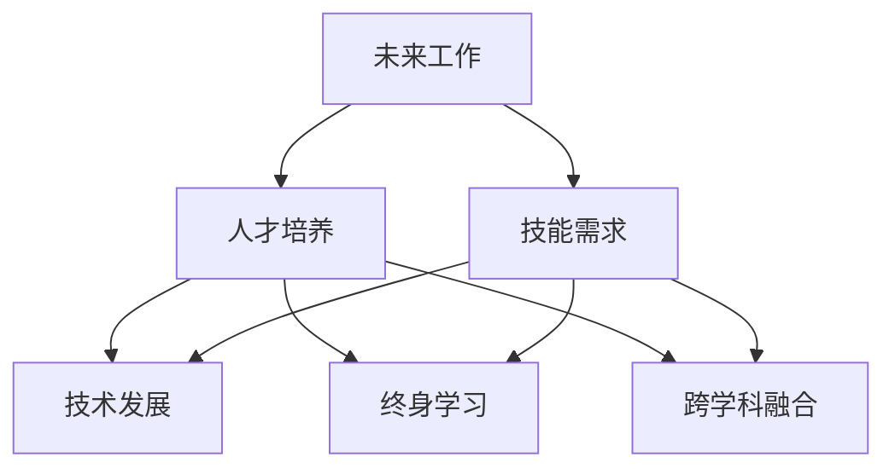

                 

# 未来工作：技能需求与培养

> 关键词：未来工作,技能需求,人才培养,技术发展,人工智能,自动化,数据驱动,数字转型

## 1. 背景介绍

### 1.1 问题由来
随着技术的不断进步，尤其是人工智能(AI)、自动化技术(Automation)的迅猛发展，未来工作的本质正在发生深刻的变化。自动化和数据驱动的趋势不仅影响了传统的制造业、服务业，也对知识型工作者提出了新的要求。因此，理解未来工作的变化趋势，以及与之相适应的技能需求，对于个人职业规划和组织人才培养都至关重要。

### 1.2 问题核心关键点
未来工作环境的显著特点包括：

- **数字化与智能化**：越来越多的工作依赖于数字化工具和智能系统，如人工智能、大数据分析、机器学习等。
- **自动化与协作**：自动化技术的应用改变了工作流程，协作和团队工作的模式也随之发生变化。
- **跨学科与融合**：未来的工作往往需要跨学科知识和技能，如技术、商业、设计、心理学等。
- **终身学习**：技术的快速迭代要求从业者持续学习，更新自己的技能以适应新变化。

### 1.3 问题研究意义
了解未来工作的技能需求，有助于：

- **个人职业发展**：指导个人规划职业生涯，选择和提升关键技能，确保在职场中保持竞争力。
- **组织人才战略**：帮助企业识别并培养所需人才，优化人才结构，提升组织效能。
- **教育改革**：指导教育机构调整课程设置，更新教学内容，培养符合未来工作需求的人才。

## 2. 核心概念与联系

### 2.1 核心概念概述

为更好地理解未来工作的技能需求，本节将介绍几个关键概念及其相互之间的联系：

- **未来工作**：指随着技术发展，特别是AI和自动化技术的应用，工作方式和内容发生的变化。
- **技能需求**：指为了适应未来工作环境，个人和组织需要掌握的知识和技能。
- **人才培养**：指通过教育、培训等手段，提升个体的综合素质和专业能力，满足未来工作要求。
- **技术发展**：指驱动未来工作变化的技术趋势，如AI、自动化、大数据等。
- **终身学习**：指在职业生涯中持续学习新技能，适应技术变革。
- **跨学科融合**：指不同学科知识和方法的综合应用，以解决复杂问题。

这些概念之间的关系可以用以下Mermaid流程图表示：



这个流程图展示了未来工作与技能需求之间的关系，以及技能需求与技术发展、终身学习、跨学科融合之间的相互影响。

## 3. 核心算法原理 & 具体操作步骤
### 3.1 算法原理概述

未来工作的技能需求分析可以视为一种监督学习问题，即在已有数据集上训练一个模型，预测新情况下的技能需求。假设我们有历史工作环境和技能需求的数据集，可以通过训练一个预测模型来识别未来可能的技能需求。

具体来说，模型训练的输入为历史工作环境和相关技能需求，输出为未来特定工作环境下的技能需求。模型的目标是最小化预测值与实际值之间的误差，即：

$$
\min_{\theta} \sum_{i=1}^n \left(y_i - f_\theta(x_i)\right)^2
$$

其中，$x_i$ 表示历史工作环境，$y_i$ 表示对应的技能需求，$f_\theta(x_i)$ 是模型对 $x_i$ 的预测，$\theta$ 是模型的参数。

### 3.2 算法步骤详解

以下是未来工作技能需求分析的具体步骤：

**Step 1: 数据收集与预处理**
- 收集历史工作环境和技能需求的数据，并进行清洗、标注等预处理。
- 将工作环境数据转换为模型可处理的格式，如特征工程。

**Step 2: 模型选择与训练**
- 选择合适的机器学习模型，如线性回归、决策树、随机森林等。
- 划分数据集为训练集和测试集，使用训练集训练模型。
- 在测试集上评估模型性能，选择最优模型。

**Step 3: 模型调优与验证**
- 对模型进行超参数调优，如学习率、正则化参数等。
- 使用交叉验证等技术验证模型的泛化能力。

**Step 4: 技能需求预测**
- 将未来工作环境数据输入训练好的模型，预测其对应的技能需求。
- 对预测结果进行后处理，如阈值调整、规则化等，确保预测结果合理。

**Step 5: 技能培养与评估**
- 根据预测结果，制定相应的培训计划，提升员工的技能。
- 定期评估培训效果，确保培训内容与实际需求相符。

### 3.3 算法优缺点

未来工作技能需求分析的优势在于：

- **可量化预测**：通过模型，可以量化技能需求的未来变化趋势，便于管理和决策。
- **预测准确性**：借助机器学习，可以更准确地预测技能需求，避免人为偏见。

同时，该方法也存在一些局限性：

- **数据依赖**：模型预测依赖于历史数据的质量和数量，数据不足可能导致预测不准确。
- **技术门槛**：模型训练和调优需要一定的技术背景，对非技术岗位来说门槛较高。
- **动态变化**：技术发展迅速，模型需要定期更新，以保持预测的准确性。
- **复杂度增加**：预测模型本身可能增加复杂度，影响使用效率。

### 3.4 算法应用领域

未来工作技能需求分析在多个领域都有应用：

- **人力资源管理**：识别未来员工所需技能，制定招聘和培训策略。
- **企业战略规划**：预测技术变革对工作环境的影响，调整组织结构和业务策略。
- **教育培训**：指导教育机构调整课程设置，提升学生就业竞争力。
- **职业指导**：帮助个人规划职业发展，选择适合的职业路径和培训课程。

## 4. 数学模型和公式 & 详细讲解 & 举例说明

### 4.1 数学模型构建

以线性回归模型为例，假设工作环境特征为 $X$，技能需求为 $Y$，模型为线性回归模型：

$$
Y = \beta_0 + \beta_1 X_1 + \beta_2 X_2 + \cdots + \beta_n X_n + \epsilon
$$

其中，$\beta_i$ 是回归系数，$\epsilon$ 是误差项。

### 4.2 公式推导过程

对于给定的历史数据集 $D = \{(X_i, Y_i)\}_{i=1}^n$，线性回归模型的最小二乘估计为：

$$
\hat{\beta} = (X^T X)^{-1} X^T Y
$$

其中，$X^T$ 是 $X$ 的转置矩阵。

### 4.3 案例分析与讲解

假设我们收集了50个历史工作环境数据，每个数据包含5个特征 $X_1, X_2, X_3, X_4, X_5$ 和对应的技能需求 $Y$。使用线性回归模型进行训练，得到模型参数 $\hat{\beta}$。将未来工作环境数据 $X_6, X_7, X_8, X_9, X_{10}$ 输入模型，预测其对应的技能需求 $Y_6, Y_7, Y_8, Y_9, Y_{10}$。

## 5. 项目实践：代码实例和详细解释说明

### 5.1 开发环境搭建

以下是使用Python和Scikit-learn库进行线性回归模型开发的开发环境搭建流程：

1. 安装Anaconda：从官网下载并安装Anaconda，用于创建独立的Python环境。

2. 创建并激活虚拟环境：
```bash
conda create -n future-work-env python=3.8 
conda activate future-work-env
```

3. 安装Scikit-learn：
```bash
conda install scikit-learn
```

4. 安装NumPy、Pandas、Matplotlib、Seaborn等库：
```bash
pip install numpy pandas matplotlib seaborn jupyter notebook ipython
```

完成上述步骤后，即可在`future-work-env`环境中开始模型开发。

### 5.2 源代码详细实现

以下是使用Scikit-learn库对线性回归模型进行开发的代码实现。

首先，准备数据集：

```python
import pandas as pd
from sklearn.model_selection import train_test_split

# 读取数据集
data = pd.read_csv('future_work_data.csv')

# 数据预处理
X = data[['X1', 'X2', 'X3', 'X4', 'X5']]
Y = data['Y']

# 划分训练集和测试集
X_train, X_test, Y_train, Y_test = train_test_split(X, Y, test_size=0.2, random_state=42)
```

然后，定义模型并训练：

```python
from sklearn.linear_model import LinearRegression

# 创建线性回归模型
model = LinearRegression()

# 训练模型
model.fit(X_train, Y_train)
```

接着，评估模型性能：

```python
from sklearn.metrics import mean_squared_error

# 预测测试集结果
Y_pred = model.predict(X_test)

# 计算均方误差
mse = mean_squared_error(Y_test, Y_pred)
```

最后，输出模型参数和评估结果：

```python
# 输出模型参数
print(model.coef_)
print(model.intercept_)

# 输出均方误差
print(f"Mean Squared Error: {mse:.2f}")
```

这就是使用Scikit-learn库对线性回归模型进行开发的完整代码实现。可以看到，Scikit-learn提供了方便的API和工具，可以高效地进行模型训练和评估。

### 5.3 代码解读与分析

以下是关键代码的实现细节：

**数据预处理**：
- 使用Pandas库读取CSV格式的数据集，并进行特征选择和数据划分。

**模型训练**：
- 使用Scikit-learn库的LinearRegression类创建线性回归模型。
- 使用fit方法训练模型，自动完成模型参数估计。

**模型评估**：
- 使用均方误差（MSE）评估模型预测的准确性。
- 使用predict方法对测试集进行预测，并输出评估结果。

可以看到，Scikit-learn库的API设计简洁高效，使得模型开发和评估变得简单易行。

## 6. 实际应用场景

### 6.1 人力资源管理

未来工作技能需求分析在人力资源管理中的应用，主要体现在招聘和培训两个方面。通过预测未来的技能需求，人力资源部门可以更准确地制定招聘计划，吸引所需人才。同时，针对预测出的技能需求，制定相应的培训课程，提升员工的专业能力，使其能够胜任未来的工作。

### 6.2 企业战略规划

企业战略规划需要考虑未来的技术趋势对工作环境的影响。通过预测未来技能需求，企业可以调整组织结构，优化业务流程，确保战略与技术变革保持同步。同时，通过持续的技能预测和培训，确保企业的竞争力和市场适应性。

### 6.3 教育培训

教育机构需要根据未来工作的需求，调整课程设置和教学内容。通过预测未来的技能需求，教育机构可以提前规划课程设置，提升学生的就业竞争力。同时，定期更新课程内容，确保教学内容与未来工作需求相符。

### 6.4 职业指导

职业指导中心可以根据未来工作的需求，为个人提供职业规划建议。通过预测未来的技能需求，职业指导中心可以推荐适合的职业路径和培训课程，帮助个人更好地规划职业生涯。

## 7. 工具和资源推荐

### 7.1 学习资源推荐

为了帮助从业者系统掌握未来工作的技能需求，这里推荐一些优质的学习资源：

1. **Coursera《未来工作》课程**：由多位行业专家开设，深入浅出地介绍了未来工作的发展趋势和技能需求，适合所有从业者学习。

2. **《人工智能与未来工作》书籍**：系统介绍了人工智能技术对未来工作的影响，并提供了详细的技能培养建议。

3. **LinkedIn Learning《未来工作技能》课程**：涵盖了未来工作所需的多项技能，如编程、数据分析、软技能等，适合职业发展的各个阶段。

4. **edX《未来工作技能提升》课程**：由多所知名大学和机构联合开设，提供全面的技能提升课程，帮助从业者应对未来工作挑战。

通过这些资源的学习实践，相信你一定能够全面掌握未来工作的技能需求，并用于指导个人职业规划和组织人才培养。

### 7.2 开发工具推荐

高效的开发离不开优秀的工具支持。以下是几款用于未来工作技能需求分析开发的常用工具：

1. **Jupyter Notebook**：一个交互式的开发环境，支持Python和Scikit-learn等库，方便进行模型开发和调试。

2. **Scikit-learn**：一个强大的机器学习库，提供了多种模型和工具，方便进行数据预处理和模型训练。

3. **NumPy**：一个高效的数学库，用于数值计算和数组操作，是Scikit-learn的基础库。

4. **Pandas**：一个数据处理库，用于数据清洗、处理和分析，方便进行数据预处理。

5. **Matplotlib**：一个绘图库，用于绘制图表，方便可视化模型性能和结果。

6. **Seaborn**：一个基于Matplotlib的高级绘图库，提供了更多的绘图选项，适合进行数据可视化。

合理利用这些工具，可以显著提升未来工作技能需求分析的开发效率，加快创新迭代的步伐。

### 7.3 相关论文推荐

未来工作技能需求分析的研究始于学界的研究，以下是几篇奠基性的相关论文，推荐阅读：

1. **《未来工作技能需求分析》论文**：提出了基于机器学习的方法，对未来工作技能需求进行预测，并进行了详细的案例分析。

2. **《人工智能对未来工作的影响》论文**：探讨了人工智能技术对未来工作的广泛影响，并提出了技能培养的策略。

3. **《终身学习与未来工作》论文**：讨论了终身学习在未来工作中的重要性，并提出了终身学习路径的设计。

4. **《跨学科技能培养》论文**：提出了跨学科技能培养的方法和模型，探讨了不同学科知识在实际工作中的应用。

这些论文代表了大语言模型微调技术的发展脉络。通过学习这些前沿成果，可以帮助研究者把握学科前进方向，激发更多的创新灵感。

## 8. 总结：未来发展趋势与挑战

### 8.1 总结

本文对未来工作的技能需求进行了全面系统的介绍。首先阐述了未来工作的变化趋势，明确了未来工作的关键特征和技能需求。其次，从原理到实践，详细讲解了未来工作技能需求分析的数学模型和关键步骤，给出了模型开发的完整代码实例。同时，本文还广泛探讨了技能需求分析在人力资源管理、企业战略规划、教育培训和职业指导等多个行业领域的应用前景，展示了技能需求分析的巨大潜力。此外，本文精选了技能需求分析的学习资源、开发工具和相关论文，力求为从业者提供全方位的技术指引。

通过本文的系统梳理，可以看到，未来工作的技能需求分析正在成为人力资源管理、企业战略规划和教育培训等领域的重要工具，为组织和个人提供了科学的管理和规划依据。未来工作的技能需求分析，将帮助从业者更好地适应技术变革，提升职业竞争力，推动各行各业向数字化、智能化方向发展。

### 8.2 未来发展趋势

展望未来，未来工作技能需求分析将呈现以下几个发展趋势：

1. **模型智能化**：未来的技能需求预测模型将更加智能，能够自动学习和适应不断变化的技术趋势。
2. **数据自动化**：通过自动数据采集和预处理，减少人工干预，提高数据获取和处理的效率。
3. **跨平台兼容性**：技能需求分析将支持多种平台和工具，方便不同行业的从业者使用。
4. **实时化**：实时更新的技能需求分析模型，能够及时响应技术变革和市场变化，保持预测的准确性。
5. **个性化推荐**：根据个人能力和职业背景，提供个性化的技能提升建议，提升职业发展效率。

以上趋势凸显了未来工作技能需求分析技术的广阔前景。这些方向的探索发展，必将进一步提升人力资源管理的科学性、企业战略规划的准确性、教育培训的针对性，为未来的职业发展和行业变革提供有力支持。

### 8.3 面临的挑战

尽管未来工作技能需求分析技术已经取得了显著成果，但在迈向更加智能化、普适化应用的过程中，它仍面临着诸多挑战：

1. **数据质量**：技能需求预测依赖于高质量的数据，数据采集、标注和清洗的复杂性可能影响预测的准确性。
2. **技术门槛**：模型开发和调优需要一定的技术背景，对于非技术岗位来说门槛较高。
3. **模型复杂性**：技能需求预测模型可能过于复杂，影响模型的解释性和实用性。
4. **动态变化**：技术发展迅速，模型需要定期更新，以保持预测的准确性。
5. **跨学科融合**：不同学科的知识和方法需要在技能需求分析中有效融合，提高模型对复杂问题的处理能力。

正视技能需求分析面临的这些挑战，积极应对并寻求突破，将是其成为未来工作管理的重要工具的必由之路。相信随着学界和产业界的共同努力，这些挑战终将一一被克服，技能需求分析必将在构建人机协同的智能时代中扮演越来越重要的角色。

### 8.4 研究展望

面向未来，技能需求分析需要在以下几个方面寻求新的突破：

1. **多模态技能预测**：结合不同类型的数据，如文本、视频、音频等，提升技能需求预测的准确性。
2. **实时动态预测**：通过实时数据流处理，实现对技能需求的动态预测，及时响应技术变革。
3. **自适应学习**：引入自适应学习算法，使模型能够自动更新和优化，适应不同行业的技能需求。
4. **跨学科知识融合**：将不同学科的知识和方法进行融合，提升技能需求预测模型的泛化能力。
5. **人工智能辅助**：引入AI技术，如自然语言处理、图像识别等，提升技能需求分析的自动化和智能化水平。

这些研究方向的探索，必将引领技能需求分析技术迈向更高的台阶，为构建安全、可靠、可解释、可控的智能系统铺平道路。面向未来，技能需求分析技术还需要与其他人工智能技术进行更深入的融合，如知识表示、因果推理、强化学习等，多路径协同发力，共同推动未来工作的智能化转型。只有勇于创新、敢于突破，才能不断拓展技能需求分析的边界，让智能技术更好地造福人类社会。

## 9. 附录：常见问题与解答

**Q1: 未来工作的技能需求分析是否适用于所有行业？**

A: 未来工作的技能需求分析适用于大多数行业，特别是那些正在或即将被技术变革影响的行业。但对于一些传统行业，如农业、手工业等，技能需求的分析可能更依赖于经验和专业知识，而非数据驱动。

**Q2: 技能需求分析的准确性如何保障？**

A: 技能需求分析的准确性主要依赖于数据的质量和模型设计的合理性。为了提高准确性，可以采用以下措施：

1. **数据采集**：从可靠的渠道获取高质量的数据，避免数据偏差。
2. **模型选择**：选择合适的预测模型，如随机森林、深度学习等，根据数据特性和任务需求进行优化。
3. **超参数调优**：通过交叉验证等方法，对模型的超参数进行调优，提升模型泛化能力。
4. **反馈机制**：引入反馈机制，根据实际效果调整模型和数据采集策略。

**Q3: 如何应对未来工作技能需求的变化？**

A: 应对未来工作技能需求的变化，需要建立持续学习和动态更新的机制：

1. **定期更新数据**：定期更新技能需求数据，确保模型能够适应新的技术趋势和工作环境。
2. **动态调整模型**：引入在线学习算法，使模型能够实时更新和优化。
3. **灵活调整策略**：根据预测结果，及时调整培训计划和招聘策略，保持组织和个人的竞争优势。

**Q4: 技能需求分析在教育培训中的应用有哪些？**

A: 技能需求分析在教育培训中的应用主要体现在以下几个方面：

1. **课程设置**：根据技能需求预测结果，调整和优化课程设置，提升学生的就业竞争力。
2. **教学方法**：引入与未来工作相关的教学方法，如项目实践、案例分析等，提高学生的实战能力。
3. **职业规划**：帮助学生了解未来工作的技能需求，制定职业发展规划。

**Q5: 技能需求分析的实施需要哪些资源？**

A: 技能需求分析的实施需要以下资源：

1. **数据采集和标注**：需要高质量的数据集和标注工具，进行数据收集和标注。
2. **计算资源**：需要高性能的计算设备和数据存储设备，支持大规模数据处理和模型训练。
3. **技术支持**：需要专业的数据科学家和软件工程师，提供模型开发和调优的支持。
4. **专家咨询**：需要行业专家提供领域知识和经验，指导模型开发和应用。

这些资源对于技能需求分析的成功实施至关重要，需要组织和团队共同努力。

---

作者：禅与计算机程序设计艺术 / Zen and the Art of Computer Programming

