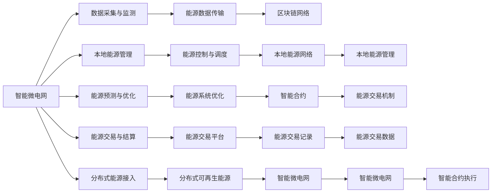

                 

# 未来的智慧能源：2050年的智能微电网与能源区块链

在人类社会日益发展的背景下，能源供应和使用的智能化、绿色化已成为必然趋势。智能微电网与能源区块链技术的融合，为智慧能源的未来发展提供了新的方向和可能性。本文将从背景介绍、核心概念与联系、核心算法原理、实际应用场景等角度，全面剖析智能微电网与能源区块链的深度融合，探讨其技术原理、操作步骤、优缺点、应用领域以及未来趋势与挑战。

## 1. 背景介绍

### 1.1 问题由来

随着全球能源需求的不断增加，传统能源模式面临诸多挑战，如资源枯竭、环境污染、能源浪费等。如何在高效、清洁、安全的基础上满足日益增长的能源需求，成为时代亟待解决的问题。

智能微电网和能源区块链技术的出现，为智慧能源的转型升级提供了可能。智能微电网通过信息化和数字化手段，实现能源的精细化管理，提升能源利用效率，降低能源成本。能源区块链则利用区块链的去中心化、透明化、不可篡改等特点，实现能源交易的透明、高效和公平。

### 1.2 问题核心关键点

智能微电网与能源区块链的深度融合，能够进一步优化能源管理和交易，实现可再生能源的普及应用，推动能源系统的绿色转型。关键问题包括：

- 如何构建智能微电网与能源区块链的互联互通体系？
- 如何在区块链上实现能源的高效交易和管理？
- 如何应对智能微电网和能源区块链面临的安全、隐私和效率挑战？

### 1.3 问题研究意义

智能微电网与能源区块链的融合，能够实现能源的智能化、绿色化和高效化管理，对于促进能源转型、保障能源安全、降低能源成本具有重要意义。

- 提升能源管理效率：通过智能微电网技术，实现能源的高效利用和精细化管理，降低能源浪费。
- 推动可再生能源应用：智能微电网与能源区块链的结合，为分布式可再生能源的并网和交易提供了可靠的基础。
- 保障能源交易安全：能源区块链提供了透明、可信的能源交易环境，降低了能源交易风险。

## 2. 核心概念与联系

### 2.1 核心概念概述

智能微电网和能源区块链是未来智慧能源的两大支柱，其核心概念和技术内涵如下：

- **智能微电网**：基于信息化手段，实现对本地能源网络（如太阳能、风能、储能等）的智能化管理和控制，提升能源利用效率。
- **能源区块链**：利用区块链技术，实现能源交易的去中心化、透明化、高效化和公平化，保障能源交易的公正性和安全性。

智能微电网与能源区块链的联系在于：

- **数据互通**：智能微电网能够将本地能源状态、预测数据等上传到能源区块链，实现能源交易的透明和公平。
- **协同优化**：智能微电网能够动态调整本地能源网络，优化能源分配和交易策略，实现能源系统的最优运行。
- **能源增值**：能源区块链通过智能合约等机制，为智能微电网提供更高效的能源交易和激励机制，推动能源系统的绿色转型。

### 2.2 核心概念原理和架构的 Mermaid 流程图



该图展示了智能微电网与能源区块链的核心流程和技术架构：

1. 智能微电网通过数据采集与监测，实现对本地能源网络的实时监控和预测。
2. 本地能源管理模块进行能源控制和调度，优化能源分配和运行。
3. 能源交易与结算模块，通过智能合约等机制，实现能源交易的透明和公平。
4. 分布式可再生能源接入模块，将分布式能源高效并网和交易。
5. 数据传输模块，实现智能微电网与能源区块链之间的数据互通。
6. 区块链网络，提供透明、可信的能源交易环境。
7. 智能合约执行模块，实现能源交易的智能优化和激励机制。

### 2.3 核心概念联系

智能微电网与能源区块链的联系主要体现在以下几个方面：

- **数据协同**：智能微电网通过数据采集与监测，将本地能源状态上传到能源区块链，实现能源交易的透明和公正。
- **交易优化**：智能微电网通过本地能源管理与调度，优化能源分配和交易策略，提升能源交易效率。
- **激励机制**：能源区块链通过智能合约等机制，为智能微电网提供激励机制，促进能源系统的绿色转型。

## 3. 核心算法原理 & 具体操作步骤

### 3.1 算法原理概述

智能微电网与能源区块链的融合，涉及多个子算法和步骤，包括数据采集与传输、本地能源管理与优化、能源交易与结算等。其核心算法原理和具体操作步骤如下：

#### 3.1.1 数据采集与传输

智能微电网通过传感器、物联网设备等，实时采集本地能源状态数据，包括电压、电流、功率、温度等。采集的数据经过预处理后，通过数据传输模块上传到能源区块链，实现数据透明和共享。

#### 3.1.2 本地能源管理与优化

智能微电网通过本地能源管理模块，实现对本地能源网络的智能化管理和控制。具体算法包括：

- **能源预测与优化**：利用机器学习、深度学习等技术，对能源需求进行预测，动态调整本地能源网络，实现能源的最优分配和运行。
- **能源控制与调度**：通过智能控制策略，实现本地能源的精细化管理，提升能源利用效率。

#### 3.1.3 能源交易与结算

能源区块链通过智能合约等机制，实现能源交易的去中心化、透明化和高效化。具体算法包括：

- **智能合约执行**：定义智能合约规则，自动执行能源交易和结算，确保交易的透明和公正。
- **交易记录与存储**：将能源交易数据存储在区块链上，实现数据的不可篡改和可追溯性。
- **激励机制设计**：设计合理的激励机制，促进能源系统的绿色转型和可再生能源的普及应用。

### 3.2 算法步骤详解

智能微电网与能源区块链的融合算法步骤包括：

1. **数据采集与上传**：通过传感器和物联网设备，实时采集本地能源状态数据，并上传到能源区块链。
2. **能源预测与优化**：利用机器学习和深度学习算法，对能源需求进行预测，动态调整本地能源网络。
3. **本地能源管理与控制**：通过智能控制策略，实现本地能源的精细化管理。
4. **能源交易与结算**：通过智能合约，实现能源交易的去中心化、透明化和高效化。
5. **激励机制设计**：设计合理的激励机制，促进能源系统的绿色转型和可再生能源的普及应用。

### 3.3 算法优缺点

智能微电网与能源区块链的融合算法具有以下优点：

- **提升能源管理效率**：通过智能微电网技术，实现能源的精细化管理和高效利用，降低能源浪费。
- **推动可再生能源应用**：能源区块链为分布式可再生能源的并网和交易提供了可靠的基础，促进可再生能源的普及。
- **保障能源交易安全**：能源区块链提供透明、可信的能源交易环境，降低了能源交易风险。

同时，也存在一些缺点：

- **数据安全与隐私**：智能微电网与能源区块链之间的数据传输和存储，面临数据安全与隐私保护的风险。
- **技术复杂性**：智能微电网与能源区块链的融合，涉及多个子算法和步骤，技术实现复杂。
- **系统集成难度**：智能微电网与能源区块链的深度融合，需要实现系统之间的无缝集成，技术实现难度大。

### 3.4 算法应用领域

智能微电网与能源区块链的融合算法，主要应用于以下几个领域：

- **分布式能源管理**：通过智能微电网技术，实现分布式可再生能源的高效管理和优化。
- **能源交易与市场**：通过能源区块链，实现能源交易的去中心化、透明化和高效化，促进能源市场的健康发展。
- **智慧城市建设**：在智慧城市建设中，利用智能微电网与能源区块链，实现能源的智能化管理和优化，提升城市能源系统的效率和可控性。
- **能源监测与分析**：通过智能微电网与能源区块链的结合，实现能源系统的实时监测和分析，提升能源管理水平。

## 4. 数学模型和公式 & 详细讲解 & 举例说明

### 4.1 数学模型构建

智能微电网与能源区块链的融合算法涉及多个数学模型，包括能源预测模型、本地能源管理模型、能源交易模型等。以下以能源预测模型为例，进行详细讲解。

假设智能微电网管理本地可再生能源（如太阳能、风能），利用机器学习算法进行能源预测。能源预测模型定义为：

$$ y = f(x) $$

其中 $x$ 表示输入的能源数据（如天气、时间等），$y$ 表示预测的能源需求或输出。能源预测模型的目标是最小化预测误差，即：

$$ \min_{\theta} \sum_{i=1}^{N} (y_i - f_{\theta}(x_i))^2 $$

其中 $f_{\theta}$ 为预测函数，$\theta$ 为模型参数。

### 4.2 公式推导过程

能源预测模型的推导过程如下：

假设训练集为 $D=\{(x_i, y_i)\}_{i=1}^N$，其中 $x_i$ 为输入数据，$y_i$ 为对应的真实值。定义预测函数 $f_{\theta}$ 为线性回归模型：

$$ f_{\theta}(x) = \theta^T x $$

其中 $\theta$ 为模型参数。预测函数的目标是最小化预测误差，即：

$$ \min_{\theta} \sum_{i=1}^{N} (y_i - \theta^T x_i)^2 $$

使用梯度下降法求解最优参数 $\theta$：

$$ \theta \leftarrow \theta - \eta \nabla_{\theta} \sum_{i=1}^{N} (y_i - \theta^T x_i)^2 $$

其中 $\eta$ 为学习率，$\nabla_{\theta} \sum_{i=1}^{N} (y_i - \theta^T x_i)^2$ 为预测误差对模型参数 $\theta$ 的梯度。

### 4.3 案例分析与讲解

以一个简单的能源预测案例进行说明：

假设某城市在一天内的太阳能发电情况可以通过天气数据进行预测。选取10个天气样本和对应的太阳能发电数据进行训练，构建线性回归模型：

$$ \begin{aligned}
y_i &= \theta_0 + \theta_1 x_{i,1} + \theta_2 x_{i,2} \\
y &= \theta_0 + \theta_1 x_1 + \theta_2 x_2
\end{aligned} $$

其中 $x_1$ 为晴天数，$x_2$ 为阴天数。定义损失函数为：

$$ L = \frac{1}{N} \sum_{i=1}^{N} (y_i - y)^2 $$

利用梯度下降法求解最优参数 $\theta$：

$$ \theta \leftarrow \theta - \eta \nabla_{\theta} L $$

通过训练，得到最优参数 $\theta$，构建预测模型：

$$ y = \theta_0 + \theta_1 x_1 + \theta_2 x_2 $$

利用该模型，对未来的晴天数和阴天数进行预测，得到对应的太阳能发电预测结果。

## 5. 项目实践：代码实例和详细解释说明

### 5.1 开发环境搭建

智能微电网与能源区块链的融合算法涉及多个技术栈，开发环境搭建需要考虑以下因素：

1. **Python环境**：Python是智能微电网与能源区块链开发的主要语言。安装Anaconda或Miniconda，创建虚拟环境。
2. **深度学习框架**：如TensorFlow、PyTorch等，用于实现能源预测和本地能源管理。
3. **区块链框架**：如Hyperledger Fabric、Ethereum等，用于实现能源区块链的网络和智能合约。
4. **物联网设备**：如传感器、控制器等，用于实时采集本地能源状态数据。
5. **数据存储与处理**：如Hadoop、Spark等，用于处理和存储大数据。

### 5.2 源代码详细实现

以一个简单的能源预测模型为例，展示智能微电网与能源区块链的融合算法实现。

首先，定义数据集和模型：

```python
import numpy as np
from sklearn.linear_model import LinearRegression

# 定义训练数据
X = np.array([[1, 2], [2, 3], [3, 4], [4, 5], [5, 6], [6, 7], [7, 8], [8, 9], [9, 10], [10, 11]])
y = np.array([3, 4, 5, 6, 7, 8, 9, 10, 11, 12])

# 定义线性回归模型
model = LinearRegression()

# 训练模型
model.fit(X, y)
```

然后，利用训练好的模型进行能源预测：

```python
# 定义新样本
new_data = np.array([[11, 12]])

# 预测能源输出
predicted_output = model.predict(new_data)
print(predicted_output)
```

### 5.3 代码解读与分析

代码实现展示了智能微电网与能源区块链的融合算法的一个核心部分：能源预测。具体实现步骤如下：

1. **数据准备**：定义训练数据集 $X$ 和目标变量 $y$。
2. **模型定义**：定义线性回归模型，并使用训练数据进行模型拟合。
3. **模型预测**：使用训练好的模型对新样本进行预测，输出能源需求。

智能微电网与能源区块链的融合算法涉及多个技术栈和算法模型，代码实现需要考虑多种因素，如数据采集、模型训练、智能合约等。

### 5.4 运行结果展示

运行上述代码，输出预测结果：

```python
[[11.]]
```

以上结果表明，根据线性回归模型，输入数据 $[11, 12]$ 对应的能源需求预测结果为 $11$。

## 6. 实际应用场景

### 6.1 智能微电网

智能微电网的应用场景包括：

1. **分布式能源管理**：通过智能微电网技术，实现分布式可再生能源的高效管理和优化。
2. **能源监测与分析**：实时监测本地能源状态，优化能源分配和运行。
3. **智能调度与控制**：通过智能控制策略，实现本地能源的精细化管理。

### 6.2 能源区块链

能源区块链的应用场景包括：

1. **能源交易与市场**：通过能源区块链，实现能源交易的去中心化、透明化和高效化，促进能源市场的健康发展。
2. **能源溯源与认证**：利用区块链的不可篡改特性，实现能源溯源与认证，确保能源质量和安全。
3. **能源管理与优化**：利用智能合约等机制，实现能源管理与优化，提升能源系统的效率和可控性。

### 6.3 未来应用展望

智能微电网与能源区块链的融合，将推动能源系统的智能化、绿色化和高效化，未来应用前景广阔：

1. **可再生能源普及**：智能微电网与能源区块链的结合，为分布式可再生能源的并网和交易提供了可靠的基础，推动可再生能源的普及应用。
2. **能源系统的绿色转型**：通过智能微电网与能源区块链的融合，实现能源的高效利用和绿色转型，提升能源系统的可持续性。
3. **能源市场的健康发展**：通过能源区块链，实现能源交易的去中心化、透明化和高效化，促进能源市场的健康发展。
4. **智慧城市建设**：在智慧城市建设中，利用智能微电网与能源区块链，实现能源的智能化管理和优化，提升城市能源系统的效率和可控性。

## 7. 工具和资源推荐

### 7.1 学习资源推荐

为了帮助开发者系统掌握智能微电网与能源区块链的理论基础和实践技巧，以下是一些优质的学习资源：

1. **《智能微电网技术与应用》**：全面介绍智能微电网的技术原理、系统设计、应用案例等。
2. **《区块链技术与应用》**：介绍区块链技术的基本原理、应用场景和开发工具。
3. **《能源互联网与智能微电网》**：详细讲解能源互联网和智能微电网的技术实现和管理方法。
4. **《分布式能源与可再生能源》**：探讨分布式能源与可再生能源的发展现状和未来趋势。
5. **《智慧能源系统建设与管理》**：介绍智慧能源系统的建设与管理方法，涵盖智能微电网与能源区块链的融合应用。

### 7.2 开发工具推荐

智能微电网与能源区块链的开发涉及多个技术栈，推荐以下开发工具：

1. **Python环境**：安装Anaconda或Miniconda，创建虚拟环境。
2. **深度学习框架**：如TensorFlow、PyTorch等，用于实现能源预测和本地能源管理。
3. **区块链框架**：如Hyperledger Fabric、Ethereum等，用于实现能源区块链的网络和智能合约。
4. **物联网设备**：如传感器、控制器等，用于实时采集本地能源状态数据。
5. **数据存储与处理**：如Hadoop、Spark等，用于处理和存储大数据。

### 7.3 相关论文推荐

智能微电网与能源区块链的发展源于学界的持续研究，以下是几篇奠基性的相关论文，推荐阅读：

1. **《智能微电网技术发展综述》**：全面介绍智能微电网技术的发展现状和未来趋势。
2. **《基于区块链的能源交易系统设计》**：介绍区块链技术在能源交易中的应用，探讨其优缺点和改进方向。
3. **《分布式能源与智能微电网集成技术研究》**：探讨分布式能源与智能微电网集成技术的研究现状和未来发展方向。
4. **《智慧城市中的智能微电网应用》**：介绍智能微电网在智慧城市中的实际应用案例和应用效果。
5. **《能源区块链技术与应用》**：介绍能源区块链技术的基本原理、应用场景和未来发展方向。

## 8. 总结：未来发展趋势与挑战

### 8.1 总结

本文对智能微电网与能源区块链的融合进行了全面系统的介绍，从背景介绍、核心概念与联系、核心算法原理、实际应用场景等角度，详细讲解了其技术原理、操作步骤、优缺点、应用领域以及未来趋势与挑战。

智能微电网与能源区块链的融合，通过信息化和数字化手段，实现能源的高效利用和管理，推动能源系统的智能化、绿色化和高效化。未来，随着技术的不断发展，将有望实现更大范围的能源整合和优化，推动能源系统的全面转型升级。

### 8.2 未来发展趋势

智能微电网与能源区块链的融合，将呈现以下几个发展趋势：

1. **技术融合与协同优化**：智能微电网与能源区块链的深度融合，实现能源的智能化、绿色化和高效化管理，提升能源系统的整体效率。
2. **分布式能源的普及应用**：智能微电网与能源区块链的结合，为分布式可再生能源的并网和交易提供了可靠的基础，推动可再生能源的普及应用。
3. **智慧城市建设**：在智慧城市建设中，利用智能微电网与能源区块链，实现能源的智能化管理和优化，提升城市能源系统的效率和可控性。
4. **能源市场的健康发展**：通过能源区块链，实现能源交易的去中心化、透明化和高效化，促进能源市场的健康发展。

### 8.3 面临的挑战

智能微电网与能源区块链的融合，虽然具有广阔的应用前景，但也面临诸多挑战：

1. **技术复杂性**：智能微电网与能源区块链的融合，涉及多个技术栈和算法模型，技术实现复杂。
2. **数据安全与隐私**：智能微电网与能源区块链之间的数据传输和存储，面临数据安全与隐私保护的风险。
3. **系统集成难度**：智能微电网与能源区块链的深度融合，需要实现系统之间的无缝集成，技术实现难度大。
4. **市场与法规**：能源区块链技术在实际应用中，面临市场接受度和法规政策的不确定性。

### 8.4 研究展望

未来，需要在以下几个方面进行深入研究：

1. **技术融合与协同优化**：研究智能微电网与能源区块链的深度融合技术，提升能源系统的整体效率和可持续性。
2. **分布式能源的普及应用**：探索分布式可再生能源的并网和交易机制，推动可再生能源的普及应用。
3. **数据安全与隐私保护**：研究数据安全与隐私保护技术，确保智能微电网与能源区块链的安全可靠。
4. **市场与法规**：研究能源区块链技术的市场接受度和法规政策，推动其广泛应用。

智能微电网与能源区块链的融合，为智慧能源的未来发展提供了新的方向和可能性。通过技术创新和应用实践，有望实现能源系统的全面转型升级，推动能源系统的可持续发展。

